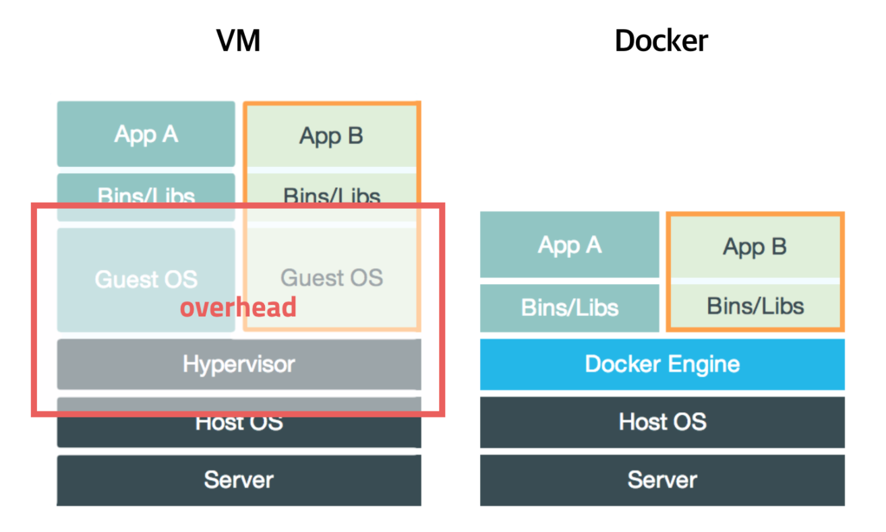

# Docker 학습 1 - 도커란 무엇인가?

- macOS에 오라클을 설치하는 과정에서 Docker의 필요성을 인식
- Docker에 대해 학습해보자 

## 1. 서버 관리의 어려움

- 서버 관리는 복잡하고 어려움
- 여러가지 설정과 프로그램 간의 충돌, 버전 등 신경써야할 것들이 많음
- Docker의 등장으로 서버를 관리하는 방식이 변하고 있음

## 2. 도커의 역사

- 도커는 2013년, dotCloud 창업자인 Solomon Hykes가 'The future of Linux Containers' 라는 세션을 발표하면서 세상에 알려짐
- 이후, 계속해서 인기가 많아지고 있음

## 3. 도커란?

### 컨테이너를 관리하는 플랫폼

- 도커는 '컨테이너 기반의 오픈소스 가상화 플랫폼'
- 다양한 프로그램, 실행환경을 컨테이너로 추상화하고 동일한 인터페이스를 제공하여 프로그램의 배포 및 관리를 단순하게 해주는 것
- 백엔드 프로그램, 데이터베이스 서버 등 어떤 프로그램도 컨테이너로 추상화할 수 있고, 조립PC, AWS, Azure, Google cloud등 어디에서든 실행할 수 있음

### 컨테이너

- 컨테이너는 격리된 공간에서 프로세스가 동작하는 기술
- 가상화 기술의 하나지만 기존 방식과 차이가 있음
- 기존의 방식은 주로 OS를 가상화하는 방식
  - 전가상화, 반가상화 등이 있는데, 이런 방법들은 추가적인 OS를 설치하는 방법들이고 성능문제가 있음
  - 이를 개선하기 위해 프로세스를 격리하는 방식이 등장
- 이런 방식은 단순히 프로세스를 격리시키기 때문에 가볍고 빠르게 동작함
- CPU나 메모리는 프로세스가 필요한만큼만 추가로 사용하고 성능적으로도 손실이 거의 없음
- 가상머신과 도커

### 이미지

- 도커에서 가장 중요한 개념으로 컨테이너와 함께 이미지라는 것이 있음
- 이미지는 컨테이너 실행에 필요한 파일과 설정값들을 포함하고 있는 것
- 상태값을 가지지 않고 변하지 않음
- 컨테이너는 이미지를 실행한 상태라고 볼 수 있고, 추가되거나 변하는 값은 컨테이너에 저장됨
- 같은 이미지에서 여러개의 컨테이너를 생성할 수 있고 컨테이너의 상태가 바뀌거나 컨테이너가 삭제되더라도 이미지는 변하지 않고 그대로 남아있음
- 이미지는 컨테이너를 실행하기 위한 모든 정보를 가지고 있기 때문에 더 이상 의존성 파일을 컴파일하고 이것저것 설치할 필요가 없음
- 새로운 서버가 추가되면 미리 만들어 놓은 이미지를 다운받고 컨테이너를 생성만 하면 됨
- 한 서버에 여러개의 컨테이너를 실행할 수 있음
- 도커 이미지는 Docker hub에 등록하거나 Docker Registry 저장소를 직접 만들어 관리할 수 있음
- 누구나 쉽게 이미지를 만들고 배포할 수 있음

## 4. 도커의 장점

- 도커는 완전히 새로운 기술이라기 보다는 이미 존재하는 기술을 잘 포장했다고 할 수 있음
- 이미 존재하는 기술을 잘 조합하고 사용하기 쉽게 만들었음

### 레이어 저장 방식

- 도커 이미지는 컨테이너를 실행하기 위한 모든 정보를 가지고 있기 때문에 용량이 보통 수백메가에 이름
- 처음 이미지를 다운받을 때는 큰 부담이 아니지만, 기존 이미지에 파일 하나 추가했다고 다시 다운받는 것은 매우 비효율적임
- 도커는 이런 문제를 해결하기 위해 레이어 개념을 사용함

### 이미지 경로

- 이미지는 url방식으로 관리하고 태그를 붙일 수 있음

### Dockerfile

- 도커는 이미지를 만들기 위해 Dockerfile이라는 파일에 자체 DSL 언어를 이용해서 이미지 생성 과정을 적음

### Docker Hub

- 공개 이미지를 무료로 관리해줌

### Command와 API

- 직관적인 명령어, Rest API 지원 등

### 유용한 새로운 기능들

- 매우 빠른 발전속도

### 훌륭한 생태계

- 활발한 오픈소스 프로젝트들

### 커뮤니티 지원

- 홍보와 커뮤니티 관리에 많은 노력을 함

## 참고

- 초보를 위한 도커 안내서
  - https://subicura.com/2017/01/19/docker-guide-for-beginners-1.html

