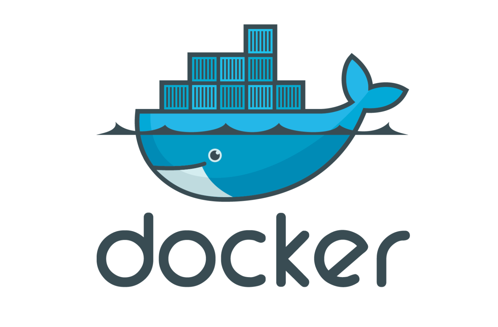
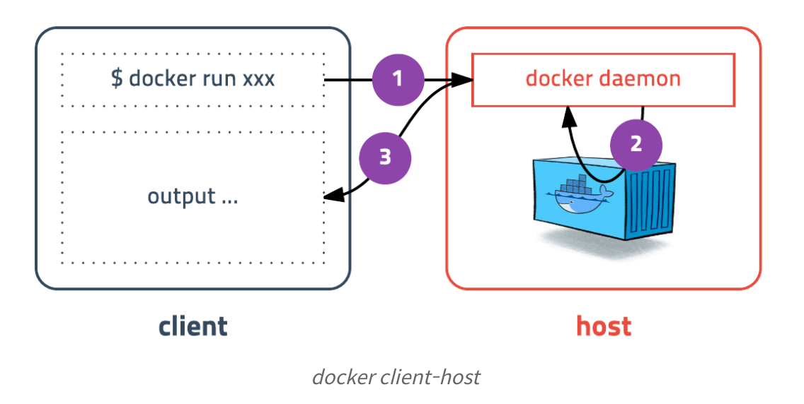
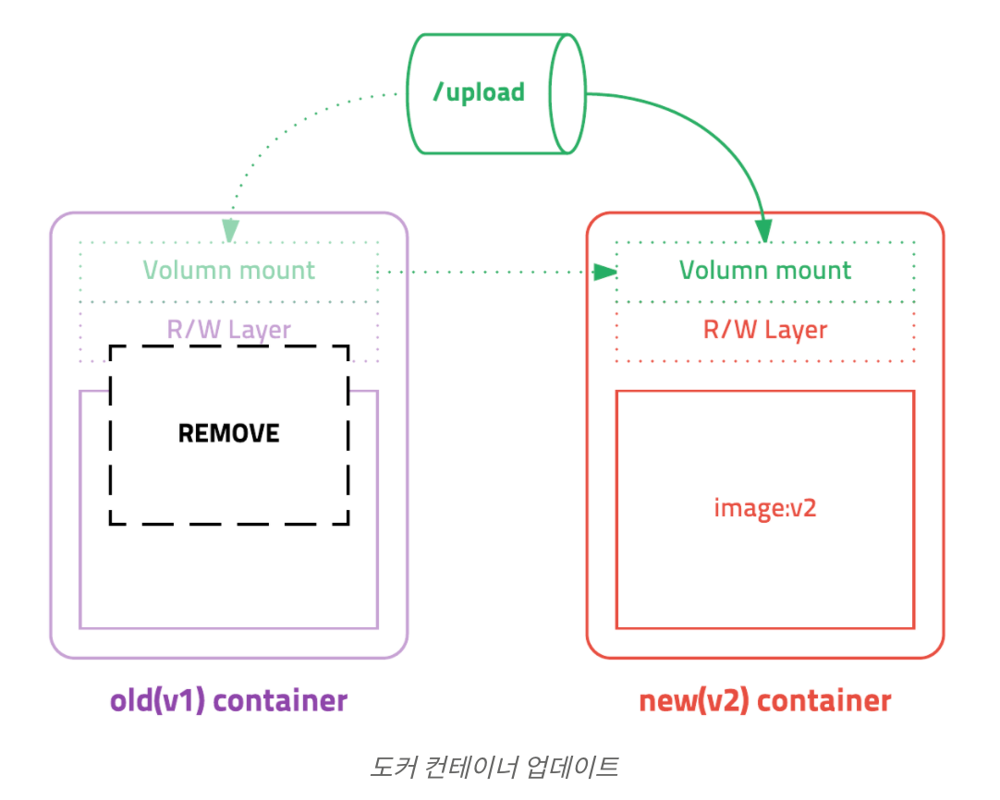

# Docker 학습 2 - 설치 및 컨테이너 실행



## 1. 도커 설치하기

- 도커는 리눅스 컨테이너 기술이므로 macOS나 윈도우에 설치할 경우, 가상머신에 설치가 됨

- Docker for Mac

  - https://docs.docker.com/docker-for-mac/

  - 설치확인: docker version

  - 결과

    ```shell
    Client: Docker Engine - Community
     Cloud integration  0.1.18
     Version:           19.03.13
     API version:       1.40
     Go version:        go1.13.15
     Git commit:        4484c46d9d
     Built:             Wed Sep 16 16:58:31 2020
     OS/Arch:           darwin/amd64
     Experimental:      false
    
    Server: Docker Engine - Community
     Engine:
      Version:          19.03.13
      API version:      1.40 (minimum version 1.12)
      Go version:       go1.13.15
      Git commit:       4484c46d9d
      Built:            Wed Sep 16 17:07:04 2020
      OS/Arch:          linux/amd64
      Experimental:     false
     containerd:
      Version:          v1.3.7
      GitCommit:        8fba4e9a7d01810a393d5d25a3621dc101981175
     runc:
      Version:          1.0.0-rc10
      GitCommit:        dc9208a3303feef5b3839f4323d9beb36df0a9dd
     docker-init:
      Version:          0.18.0
      GitCommit:        fec3683
    ```

    

- 네이티브스럽게 설치된 것 같지만 도커는 리눅스 컨테이너이므로 실제로는 가상머신에 설치가 되어있음

- 그런데 그런 느낌이 안들도록 신경써서 설계함

- docker for mac은 xhyve라는 macOS에서 제공하는 가상환경을 이용함

- 버전 정보를 보면 클라이언트와 서버가 나뉘어져있음

  - 도커는 하나의 실행파일이지만 클라이언트와 서버의 역할을 각각 할 수 있음
  - 도커 커맨드를 입력하면 도커 클라이언트가 도커 서버로 명령을 전송하고 결과를 받아 터미널에 출력해줌



- 기본값이 도커 서버의 소켓을 바라보고 있기 때문에 사용자는 의식하지 않고 바로 명령을 내리는 것 같은 느낌을 받음
- 이런 설계 덕분에 mac이나 windows의 터미널에서 명령어를 입력했을 때 가상 서버에 설치된 도커가 동작하게 됨


## 2. 컨테이너 실행하기

### 도커 실행 명령어

```txt
docker run [OPTIONS] IMAGE[:TAG|@DIGEST] [COMMAND] [ARG...]
```

- 자주 사용하는 옵션

| 옵션  | 설명                                                   |
| :---- | :----------------------------------------------------- |
| -d    | detached mode 흔히 말하는 백그라운드 모드              |
| -p    | 호스트와 컨테이너의 포트를 연결 (포워딩)               |
| -v    | 호스트와 컨테이너의 디렉토리를 연결 (마운트)           |
| -e    | 컨테이너 내에서 사용할 환경변수 설정                   |
| –name | 컨테이너 이름 설정                                     |
| –rm   | 프로세스 종료시 컨테이너 자동 제거                     |
| -it   | -i와 -t를 동시에 사용한 것으로 터미널 입력을 위한 옵션 |
| –link | 컨테이너 연결 [컨테이너명:별칭]                        |


## 3. 도커 기본 명령어

### 컨테이너 목록 확인하기(ps)

- 실행중인 컨테이너 목록을 보여줌

```txt
docker ps [OPTIONS]
```

- ps 옵션: -a, -all
  - 실행했다가 종료된 컨테이너들도 전부 보임
  - 컨테이너는 종료되어도 삭제되지 않고 남아있음
  - 종료된 건 다시 시작할 수 있고, 컨테이너의 읽기/쓰기 레이어도 그대로 존재함
  - 명시적으로 삭제하면 깔끔하게 컨테이너를 제거할 수 있음

```
docker ps -a 
```

### 컨테이너 중지하기(stop)

- 옵션은 특별한게 없고 실행중인 컨테이너를 하나 또는 여러개(띄어쓰기로 구분) 중지할 수 있음

```txt
docker stop [OPTIONS] CONTAINER [CONTAINER...]
```

### 컨테이너 제거하기(rm)

- 옵션은 특별한게 없고, 종료된 컨테이너를 하나 또는 여러개 삭제할 수 있음

```txt
docker rm [OPTIONS] CONTAINER [CONTAINER...]
```

### 이미지 목록 확인하기(images)

```txt
docker images [OPTIONS] [REPOSITORY[:TAG]]
```

### 이미지 다운로드하기(pull)

- rurn 명령어를 사용하면 이미지가 없을 때 자동으로 다운로드됨
- pull 명령어는 최신 버전으로 다시 다운받을 때 많이 사용됨
  - 같은 태그지만 이미지가 업데이터 된 경우, 새로 다운받을 수 있음

```txt
docker pull [OPTIONS] NAME[:TAG|@DIGEST]
```

### 이미지 삭제하기(rmi)

- 이미지 목록에서 이미지 ID를 입력
- 단, 컨테이너가 실행중인 이미지는 삭제되지 않음
  - 이미지들의 레이어를 기반으로 실행중이므로 당연히 삭제할 수 없음

```txt
docker rmi [OPTIONS] IMAGE [IMAGE...]
```


## 4. 컨테이너 둘러보기

### 컨테이너 로그 보기(logs)

- 컨테이너가 정상적으로 동작하는지 확인하는 좋은 방법은 로그를 확인하는 것
- 아무런 옵션을 주지 않았을 때는 전체 로그를 전부 다 출력함

```txt
docker logs [OPTIONS] CONTAINER
```

- logs 옵션: -f, --tail
  - -f: 실시간으로 생성되는 로그 확인
    - 로그 보기를 중지하려면 ctrl+c
  - --tail: 마지막 10줄만 출력 

### 컨테이너 명령어 실행하기(exec)

- 컨테이너를 관리하다보면 실행중인 컨테이너에 들어가보거나 컨테이너의 파일을 실행하고 싶을 때가 있음
- run 명령어와 유사해보이지만, 차이는 run은 새로 컨테이너를 만들어서 실행하고 exec는 실행중인 컨테이너에 명령어를 내리는 정도의 차이

```txt
docker exec [OPTIONS] CONTAINER COMMAND [ARG...]
```


## 5. 컨테이너 업데이트



- 도커에서 컨테이너를 업데이트하려면 새 버전의 이미지를 다운(pull)받고 기존 컨테이너를 삭제(stop, rm)한 후 새 이미지를 기반으로 새 컨테이너를 실행(run)하면 됨

- 그런데 컨테이너를 삭제한다는 건 컨테이너에서 생성된 파일이 사라진다는 뜻임. 데이터베이스라면 그동안 쌓였던 데이터가 모두 사라진다는 것이고 웹 어플리케이션이라면 그동안 사용자가 업로드한 이미지가 모두 사라진다는 것임

- 이런 상황을 방지하기 위해서 컨테이너 삭제 시 유지해야하는 데이터는 반드시 컨테이너 내부가 아닌 외부 스토리지에 저장해야함

- 가장 좋은 방법은 AWS S3같은 클라우드 서비스를 이용하는 것, 그렇지 않으면 데이터 볼륨을 컨테이너에 추가해서 사용해야함

- 데이터 볼륨을 사용하면 해당 디렉토리는 컨테이너와 별도로 저장되고 컨테이너를 삭제해도 데이터가 지워지지 않음

- 데이터 볼륨을 사용하는 방법은 몇가지가 있는데, 여기서는 호스트의 디렉토리를 마운트해서 사용하는 방법에 대해 알아보자

  - 예를 들어, MySQL이라면 /var/lib/mysql 디렉토리에 모든 데이터베이스 정보가 담기므로 호스트의 특정 디렉토리를 연결해주면 됨

  ```
  # before
  docker run -d -p 3306:3306 \
    -e MYSQL_ALLOW_EMPTY_PASSWORD=true \
    --name mysql \
    mysql:5.7
  
  # after
  docker run -d -p 3306:3306 \
    -e MYSQL_ALLOW_EMPTY_PASSWORD=true \
    --name mysql \
    -v /my/own/datadir:/var/lib/mysql \ # <- volume mount
    mysql:5.7
  ```

  - 호스트의 /my/own/datadir 디렉토리를 컨테이너의 /var/lib/mysql 디렉토리로 마운트했음
  - 이제 데이터베이스 파일은 호스트의 /my/own/datadir 디렉토리에 저장되고 컨테이너를 삭제해도 데이터는 사라지지 않음
  - 최신버전의 MySQL 이미지를 다운받고 다시 컨테이너를 실행할 때 동일한 디렉토리를 마운트해주면 그대로 데이터를 사용할 수  있음


## 6. Docker compose

- 컨테이너 조합이 많아지고 여러가지 설정이 추가되면 명령어가 복잡해져서 커맨드라인으로 작업하기엔 무리가 있음
- 도커는 복잡한 설정을 쉽게 관리하기 위해 YAML방식의 설정파일을 이용한 Docker Compose라는 툴을 제공함
- Docker for Mac을 설치할 때 자동 설치됨
- 예시) wordpress를 compose를 이용해서 만들어보자
  - 빈 디렉토리에 docker-compose.yml 파일 생성 및 설정 입력
  - 실행: docker-compose up

```yml
version: '2'

services:
   db:
     image: mysql:5.7
     volumes:
       - db_data:/var/lib/mysql
     restart: always
     environment:
       MYSQL_ROOT_PASSWORD: wordpress
       MYSQL_DATABASE: wordpress
       MYSQL_USER: wordpress
       MYSQL_PASSWORD: wordpress

   wordpress:
     depends_on:
       - db
     image: wordpress:latest
     volumes:
       - wp_data:/var/www/html
     ports:
       - "8000:80"
     restart: always
     environment:
       WORDPRESS_DB_HOST: db:3306
       WORDPRESS_DB_PASSWORD: wordpress
volumes:
    db_data:
    wp_data:
```


## 참고

- 초보를 위한 도커 안내서
  - https://subicura.com/2017/01/19/docker-guide-for-beginners-2.html

