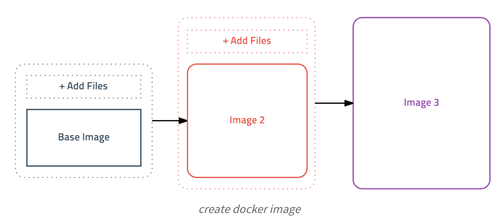

# Docker 학습 3 - 이미지 만들고 배포하기

## 1. 도커 이미지 만들기

- 도커는 이미지를 만들기 위해 컨테이너의 상태를 그대로 이미지로 저장하는 방법을 사용함

- 예를 들어, 어떤 애플리케이션을 이미지로 만든다면 리눅스만 설치된 컨테이너에 애플리케이션을 설치하고 그 상태를 그대로 이미지로 저장함

## 참고

- 초보를 위한 도커 안내서
  - https://subicura.com/2017/02/10/docker-guide-for-beginners-create-image-and-deploy.html

