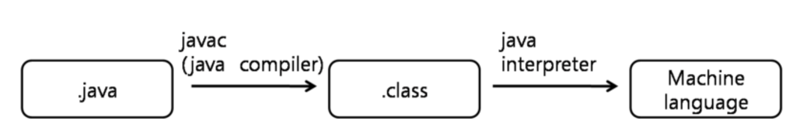
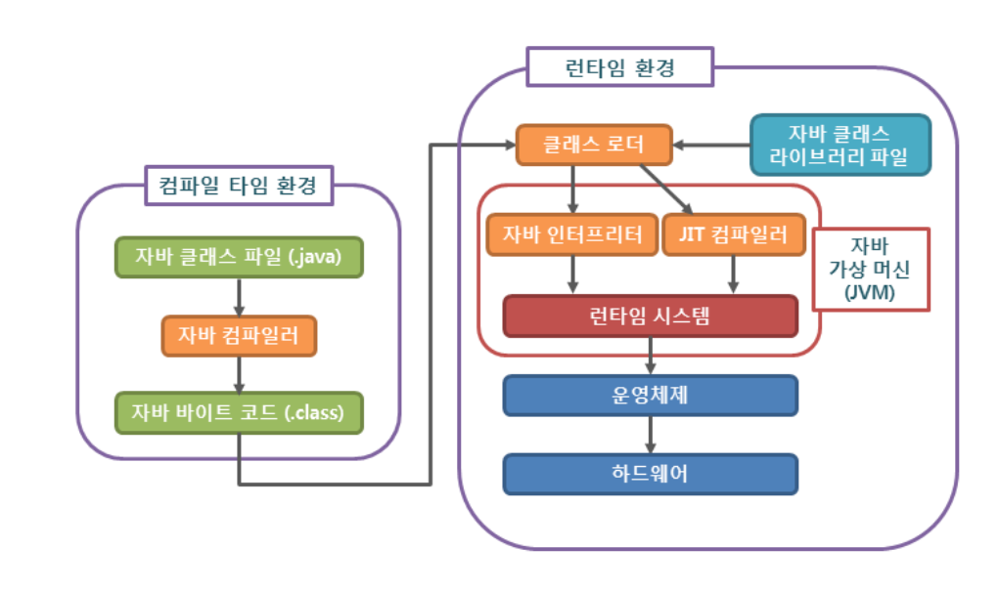
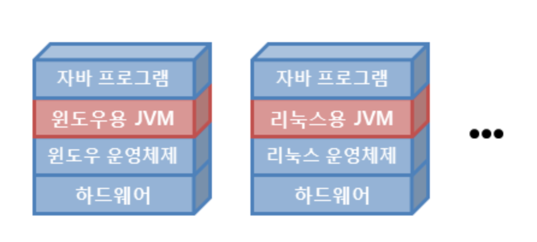

# java 프로그램 실행 프로세스에 대하여 알아보자

## 자바의 컴파일러와 인터프리터

- 자바는 컴파일러와 인터프리터 모두 사용한다
- 자바 컴파일러는 .java 파일을 javac가 바이트코드로 쓰여진 .class 파일로 변환한다.
- 컴파일러는 기계어로 변환하는 프로그램인데 .class 파일안의 바이트코드가 기계어인가?
  - 기계가 반드시 하드웨어를 의미하는 건 아님
  - JVM(Java Virtual **Machine**)
  - 즉, JVM을 위해 기계어로 변환한다는 것
- 자바 인터프리터가 하는 일은?
  - 자바 컴파일러에 의해 변환된 클래스 파일 내의 바이트 코드를 특정 환경의 기계에서 실행될 수 있도록 변환한다
  - 예를 들면 IBM PC에서 작성된 프로그램이 매킨토시에서도 실행할 수 있도록 변환한다는 의미
- 왜 자바는 기본적으로 컴파일과 인터프리트를 병행하는 것일까?
  - 바로 기계어로 변환하는 컴파일러의 경우는 프로그램이 작성된 기계상에서 실행했을 경우 매우 효율적으로 실행된다
  - 이는 대부분의 하드웨어 제어 시스템의 프로그래밍언어가 C인 이유
  - 하지만 이와 동시에 기계 종류에 종속된다는 말이기도 함
  - 자바 인터프리팅은 자바 컴파일러를 통해 생성된 클래스파일을 기계어로 변환한다
- 인터프리팅의 첫 번째 장점
  - 플랫폼에 종속되지 않는다.
  - 컴파일 후, 인터프리팅 하는 과정 때문에 컴파일 과정만 필요한 프로그래밍 언어보다는 느리다.
- 인터프리팅의 두 번째 장점
  - 자바 바이트코드는 컴퓨터와 프로그램 사이에 별도의 버퍼역할을 한다.
  - 보안적으로 장점이 될 수 있다

## 자바 프로그램 실행 프로세스

## 자바 컴파일러(Java compiler)

- 자바 컴파일러는 자바를 가지고 작성한 자바 소스 코드를 자바 가상 머신이 이해할 수 있는 자바 바이트 코드로 변환함
- 자바 컴파일러는 자바를 설치하면 javac.exe라는 실행 파일 형태로 설치됨

## 자바 바이트 코드(Java bytecode)

- 자바 바이트 코드란 자바 가상 머신이 이해할 수 있는 언어로 변환된 자바 소스 코드를 의미함
- 자바 바이트 코드의 확장자는 .class
- 자바 바이트 코드는 자바 가상 머신만 설치되어 있으면, 어떤 운영체제에서라도 실행될 수 있음

## 자바 가상 머신(JVM, Java Virtual Machine)

- 자바 가상 머신이란 자바 바이트 코드를 실행시키기 위한 가상의 기계라고 할 수 있음
- 자바로 작성된 모든 프로그램은 자바 가상 머신에서만 실행될 수 있으므로, 자바 프로그램을 실행하기 위해서는 반드시 자바 가상 머신이 설치되어 있어야함
- 오라클은 대부분의 주요 운영체제뿐만 아니라 웹 브라우저, 스마트폰, 가전기기 등에서도 자바 가상 머신을 손쉽게 설치할 수 있도록 지원하고 있음
- 서로 다른 운영체제라도 자바 가상 머신만 설치되어 있다면, 그림과 같이 아무런 추가 조치 없이 동작할 수 있음
- 따라서 개발자는 한 번만 프로그램을 작성하면, 모든 운영체제에서 같이 사용할 수 있는 장점이 있음
- 단, 자바 프로그램과 달리 JVM은 운영체제에 종속적이므로, 각 운영체제에 맞는 자바 가상 머신을 설치해야함

## 자바 가상 머신의 구성

1. 자바 인터프리터(interpreter)

- 자바 컴파일러에 의해 변환된 자바 바이트 코드를 읽고 해석하는 역할을 하는 것이 자바 인터프리터

2. 클래스 로더(class loader)

- 자바는 동적으로 클래스를 읽어오므로, 프로그램이 실행 중인 런타임에서야 모든 코드가 자바 가상 머신과 연결됨
- 이렇게 동적으로 클래스를 로딩해주는 역할을 하는 것이 클래스 로더

3. JIT 컴파일러(Just-In-Time compiler)

- 프로그램이 실행 중인 런타임에 실제 기계어로 변환해주는 컴파일러를 의미
- 동적 번역(dynamic translation)이라고도 불리는 이 기법은 프로그램의 실행 속도를 향상시키기 위해 개발되었음
- JIT 컴파일러는 자바 컴파일러가 생성한 자바 바이트 코드를 런타임에 바로 기계어로 변환하는 데 사용됨
- 같은 코드를 매번 해석하지 않고 실행할 때 컴파일을 하면서 해당 코드를 캐싱해버림
- 이후엔, 바뀐 부분만 컴파일하고 나머지는 캐싱된 코드를 사용
- 즉, 인터프리터의 속도를 개선할 수 있음

4. 가비지 컬렉터(Garbage collector)

- 자바 가상 머신은 가비지 컬렉터를 이용해서 더는 사용하지 않는 메모리를 자동으로 회수함
- 개발자가 따로 메모리를 관리하지 않아도 되므로, 더욱 손쉽게 프로그래밍을 할 수 있도록 도와줌

## JRE(Java Runtime Environment)

- .class 파일(자바 바이트 코드)을 JVM으로 로딩시키는 역할
- 자바 프로그램이 실행되기 위한 최소환경
- 자바 프로그램을 개발하지 않고 실행만 시킬거라면 JRE만 있으면 됨

## JDK(Java Development Kit)

- 자바 환경에서 돌아가는 프로그램을 개발하는데 필요한 툴들을 모아놓은 소프트웨어 패키지
- 자바 프로그래밍을 하기 위해서는 JDK를 설치해야 함
- 구성
  - JRE = JVM + Java API
  - Javac.exe = 컴파일러
    - .java -> .class
  - Java.exe = 인터프리터
    - .class 해석, 실행
  - Java.exe = 역어셈블러
    - .class -> .java
  - Jar.exe = 압축 프로그램
    - 클래스 파일과 프로그램의 실행에 관련된 파일을 jar파일로 압축하거나 해제함

## 참고

http://tcpschool.com/java/java_intro_programming

https://medium.com/@ahn428/java-jvm-java-virtual-machine-jre-java-runtime-environment-jdk-java-developement-kit-fed91def1d6f