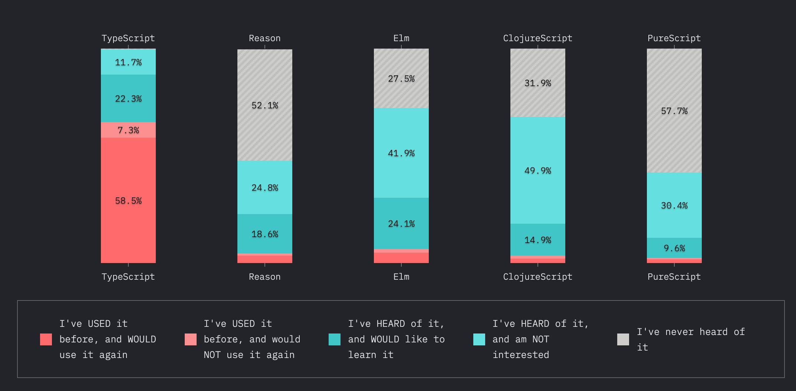
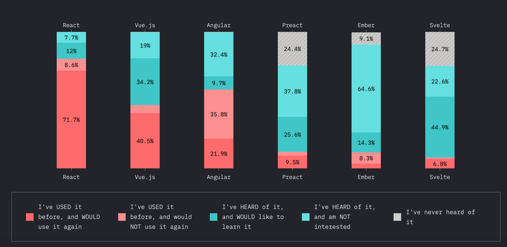
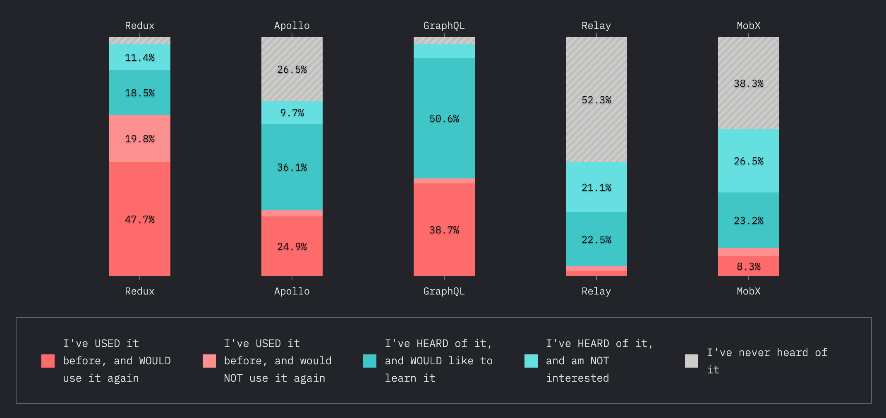
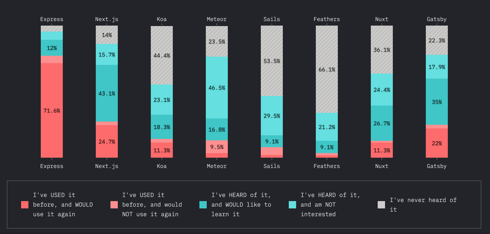
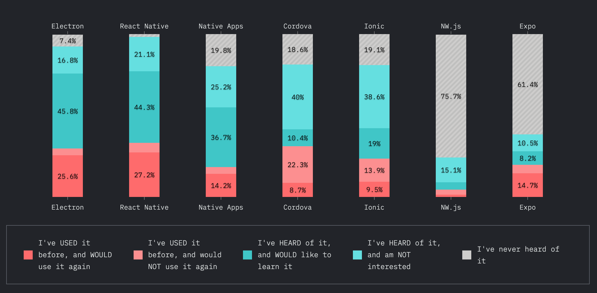

# 2020년 자바스크립트 트렌드는 어떻게 될까?

- State of JS 설문조사 결과를 기반으로 이야기해봄
- State of JS란?
  - 자바스크립트 개발자들이 진행한 설문조사...(약 2만여몀의 개발자들)
  - 전반적인 JS 생태계가 어떠한지 감을 잡을 수 있음
- 크게 5가지 카테고리로 살펴보자

1. JS flavors
2. 프론트 프레임워크
3. 데이터 레이어
4. 백엔드 프레임워크
5. 모바일 & 데스크탑

## JS flavors

- JS로 컴파일되는 프로그래밍 언어들을 뜻함
- typescript, reason, elm, clojurescript, purescript.. 등
- typescript가 58%로 압도적인 점유율을 자랑함
  - 일단 typescript 다운로드 횟수는 매월 2,900만 횟수를 자랑함
  - JS랑 느낌이 비슷함
  - typescript를 배우면 0에서 시작할 필요가 없음
  - typescript를 배운다는 것 자체가 JS의 지식을 확장하는 것
- reason, elm 등은 JS랑 너무 많이 달라서 배우기 꺼려짐
- 만족도를 살펴봤을때도 typescript, reason, elm 순서..
- 관심도도 압도적으로 typescript
- 인지도가 놀라움, 100%로 typescript를 안다는 결과가 나옴

## 프론트엔드 프레임워크

- 리액트가 무려 71%로 우위를 점하고 있음
- Vue.js는 34%가 관심을 보임
- angular는 많은 사람들이 들어봤지만 배우고 싶어하지는 않음
- angular을 써보고나서 다신 사용하지 않겠다고 한 사람들도 꽤 많음
- svelte는 많은 사람들이 들어보았고, 배우고 싶어함, 하지만 매우 적은 사람들이 사용해봤음
- svelte의 컨셉이 매우 신기함, 사라지는 프레임워크..
  - 코드를 쓰고 컴파일하고 나면 JS가 됨, 바닐라 JS가 됨
  - 유저가 웹에 가면 어떤 라이브러리든 다운받지 않고, 모든게 바닐라 JS인 것!
- 리액트의 경우 반대임
  - 리액트로 웹사이트를 만들고나면
  - 유저들은 리액트 라이브러리를 다운로드 받아야됨
- 만족도를 보면 Vue, Svelte, React 순임
- 관심도는 Svelte가 높음
- 인지도 순은 React, Angular, Vue 순

## Data Layer

- Redux가 47%로 1등
- Apollo가 뒤쫒고 있음, 많은 사람들이 배우고 싶어함
- GraphQL이랑 Apollo는 똑같은거 아닌가..?(Apollo로 GraphQL을 해야함)
- 어찌됐건 GraphQL에 대한 사람들의 관심과 인기는 엄청남
- 앞으로 GraphQL은 계속 치고올라갈 것 같고, Redux가 결국 내려갈 것 같음
- 만족도는 GraphQL 유저가 95% 만족한다고 응답했음(Apollo도 비슷)
- Redux, MobX, Relay의 만족도는 높지않음
- 관심도도 GraphQL와 Apollo가 압도적으로 높음
- 인지도도 GraphQL와 Redux가 거의 비슷함

## 백엔드 프레임워크

- Express가 위너, 무려 71%가 사용하고 있고, 계속 사용하고 싶어함
- nodeJS로 뭔가를 할 때, 백엔드의 넘버완 초이스는 Express가 되버림, 거의 디폴트임
- Next,JS랑 gateby도 있는데 백엔드라고 보긴 좀 어려움.. 리액트 프레임워크에 가까움
- 흥미로운건 Next,JS랑 gateby를 배우고싶다는 사람이 꽤 많다는 것
- 만족도도 express를 사용한 사람들은 계속 유지하고 있음
- 관심도는 express가 좀 떨어짐.. 지겨울 때가 되긴했지;,
- 관심은 nextJS에 쏠리고 있음

## 모바일 & 데스크탑

- 일랙트론과 리액트 네이티브가 승자임
- 사용도에서도 승자고, 다들 배우고 싶어하고 있음
- 리액트 네이티브는 들어본 적이 있지만 배우고 싶지는 않다는 비율이 꽤 높음.
- 만족도는 일랙트론이 높고 다른것들은 비슷함
- 인지도는 리액트 네이티브가 가장 높음
- flutter이 점점 성장하고 있음, 훌륭한 툴이고 나중에 리액트 네이티브랑 경쟁하게 될 것 같음

## 참고

https://2019.stateofjs.com

