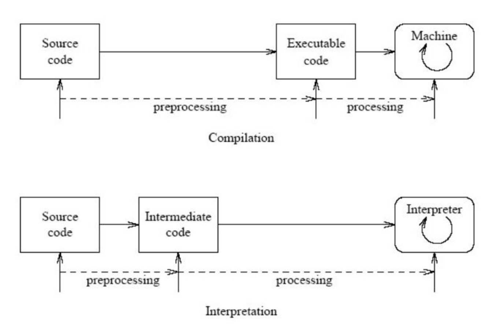

# 왜 파이썬이 C 보다 느린가?

- 파이썬이 느린게 아니라 상대적으로 C 보다 더 느리다는 의미
- 모든 프로그래밍 언어는 빠르다
- 컴퓨터 언어는 0과 1로 대화함
- 우리의 언어는 프로그래밍 언어
  - If, else, function, variable...
- 즉, 우리와 컴퓨터는 서로 다른 언어를 사용하고 있음
- 그렇다면 If, else... 이 프로그래밍 언어를 0과 1로 번역하는 방법이 있어야됨
- 그 번역 과정을 compilation 혹은 interpretation 이라고 함

## interpretation

- 실시간 번역 O
- 파이썬, 자바스크립트
  - 컴퓨터한테 조잘조잘 0과 1을 통역해줌
  - 느릴 수 밖에 없음
  - 중간에 파이썬 언어를 0과 1로 통역하는 중간 프로세스가 필요하기 때문에
  - 통역하는 중간에 통역인(인터프리터)이 모르는 말이 나오면 
    - "몰라.."
    - 에러 띄움
    - 실시간으로 통역해주기 때문에 전체 코드 내에 에러가 있어도 그 부분이 통역되기 전까지는 에러가 있는지 알 수가 없음

## compilation

- 실시간 번역 X
- 실시간으로 번역해주는게 아니라 먼저 이해한 후에 전체 메시지를 통역해줌
- C
  - Compiled 되어있기 때문에 더 빠름
  - 코딩을 다 하고 나서 '컴파일' 버튼을 누르면 컴파일러는 모든 코드를 0과 1로 번역해줌, 그 다음에 프로그램을 열 수 있음
  - 더 빠를 수 밖에 없음, 중간에 통역하는 사람이 없음
  - 이미 0과 1로 다 작업해서 만든 걸로 함, 프로그램을 열면 이미 0과 1임
  - 중간에 통역인(컴파일러)이 모르는 말이 나오면
    - "뭔말인지 모르겠으니까 봐꿔봐" 요청
    - 에러 띄움
    - 컴파일할려고 할 때, C가 이해못하겠으니까 고쳐라고 함
    - 그래서 컴파일하고나면 거기에 에러가 더 이상 없다는 것을 알 수 있음

## 결론

- 이러한 설명은 이해를 돕기 위해서 일반화를 많이 했음
- 동의하지 않는 개발자도 있을 수 있다고 생각함
- 파이썬을 컴파일 언어로 만들 수도 있지만, 일반적으로 파이썬은 인터프리터 언어, C는 컴파일 언어임
- 근데 사실 "스피드", "빠른 프로그래밍 언어"는 그렇게 중요한 요소는 아님
- 인터프리터 == 문장을 일일이 번역함
- 컴파일러 == 단락이나 글 전체를 한꺼번에 번역함

## 추가 내용

### 컴파일러와 인터프리터 내용 추가

- 컴파일러는 전체 소스코드를 변환 한 뒤 에러를 보고하지만, 인터프리터는 각 행 마다 실행하는 도중 에러가 보고되면 이후 작성된 코드를 살펴보지 않는다. 이는 보안적인 관점에서 도움이 된다.
- 자바의 경우, 컴파일러와 인터프리터 모두 사용한다.

## 참고

https://m.blog.naver.com/ehcibear314/221228200531