# 컴퓨터 프로그래밍을 하기 위한 사전지식

## 1. 프로그래밍이란?

### 프로그램이란?

#### 프로그램의 어원

- 그리스어
  - pro + graphein
  - Before + write
- 사전에 작성한..?
- 프로그램은 계획 또는 <b>수행절차</b>

#### 프로그램이라는 용어는 일상에서도 많이 사용됨

- OOO 프로그램
  - OOO : 이게 재료가 됨
  - 이것에 속하는 요소들을 어떤 순서로 처리할 것인지, 즉, 요소들을 이용한 수행절차를 의미
- 영화제 프로그램
  - 영화들을 어떤 순서로 상영할 것인가
- 교육 프로그램
  - 세부 교육을 어떤 순서로
- 라디오 프로그램
- 컴퓨터 프로그램
  - 컴퓨터 안에 있는 요소들을 어떤 순서로 처리할 것인가

## 2. 컴퓨터란?

### 컴퓨터 플랫폼

#### 컴퓨터의 구성

- 중앙처리장치(CPU)
  - 산술/논리 연산
    - 사칙연산, 판단 등
  - <b>흐름 제어</b>
    - 반복, 조건 등
- 주기억장치(Memory)
  - 임지 저장소
- 다양한 입/출력 장치(HDD/ODD/...)
  - 데이터 소스/영구 저장소
  - CD, 보조기억장치, USB, 하드디스크, 네트워크를 통한 다른 컴퓨터, 모니터, 키보드...
  - 기본 입출력 장치(콘솔): 모니터, 키보드
  - 입출력 장치의 조합에 따라서 컴퓨터의 종류/용도가 달라짐

## 3. 컴퓨터 프로그램이란?

### 프로그래밍이란 수행 절차를 기록하는 것

### 컴퓨터 프로그램이란? 컴퓨터를 이용한 절차를 만들어 놓은 것

- <b>재료 = 플랫폼 = 하드웨어</b>
  - CPU(ALU, CU), 주기억장치, 모니터, 키보드, 보조기억장치
- <b>수행절차 = 프로그램 = 소프트웨어</b>

## 4. CPU란?

### 컴퓨터에서 가장 중요한 부품인 CPU가 담당하는 기능은?

#### 계산기 능력과 순서를 제어하는 중앙 처리 장치

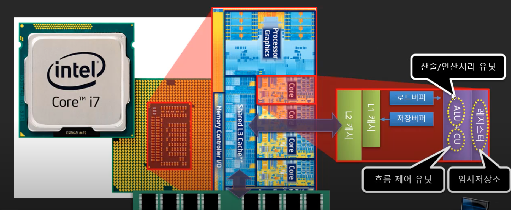

- CPU의 구성 요소
  - ALU
    - 산술/논리 연산
  - CU
    - 흐름 제어
  - 레지스터
    - 메인메모리로부터 데이터를 읽어온 뒤, 처리를 위해 잠시 두는 곳

## 5. 컴퓨터 프로그램 만들어보기

### CPU의 ALU만을 사용한 컴퓨터 프로그램

- 3 + 4 를 연산하기 위해서는 CPU의 ALU만 있으면 됨
- 보통 컴퓨터는 64비트지만 3비트짜리 가상 컴퓨터를 예시로 해봄
- 명령선과 데이터선으로 설명

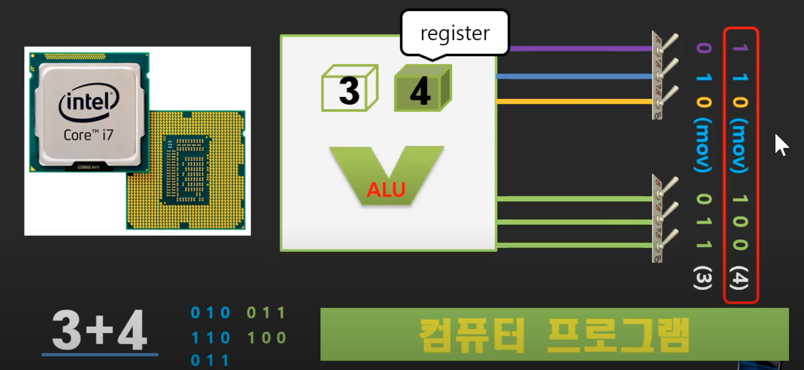

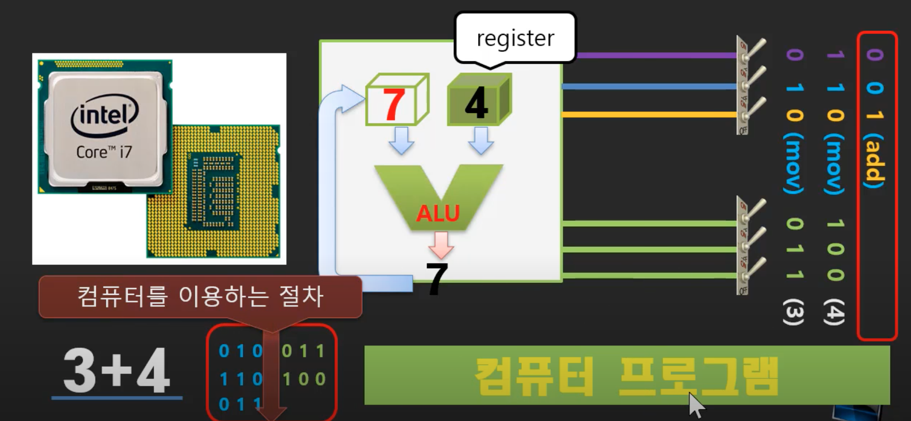

- 이렇게 컴퓨터를 직접 이용해서 프로그램을 만드는 것이 아님
- C, Cpp, 자바, 파이썬 등 프로그래밍 언어를 사용해서 번역기를 통해 간접적으로 만듬

## 6. 번역기를 이용한 컴퓨터 프로그래밍 언어들

### C/C++/JAVA/C#/Python/Javascript/...등을 이용한 컴퓨터 프로그래밍

- 간접적으로 만드는 것
- 컴퓨터의 요소들을 이용해서 프로그램을 만드는데 번역기를 사용함
- '3 + 4' > 번역기 > 010 011, 110 100, 011

### 컴파일러에 의해서 정해지는 기호와 문법

- 컴파일러(번역기)에 따라서 기호와 구문은 달라질 수 있음
- C 언어와 컴파일러가 가장 많이 쓰임
- 대부분의 많이 쓰이는 언어들이 C에서 파생됨

### 수학 연산을 많이 닮은 C계열의 고급 언어의 명령어

#### C언어 연산자들

- 산술 연산: +, -, *, /, %
- 비교 연산: <, >, <=, >=, ==, !=
- 관계 연산: &&, ||

 #### 수학 기호와 같은 건 아니지만 비슷하게 생겼고, 의미와 동작은 같음

## 7. 번역기의 종류

- 번역기를 이용해서 프로그램을 간접적으로 짤 수 있음
- 번역기는 단순히 수학기호와 비슷하게 생긴 언어들로 컴퓨터 프로그램을 만들 수 있게 해줌

### 컴퓨터 플랫폼의 구성

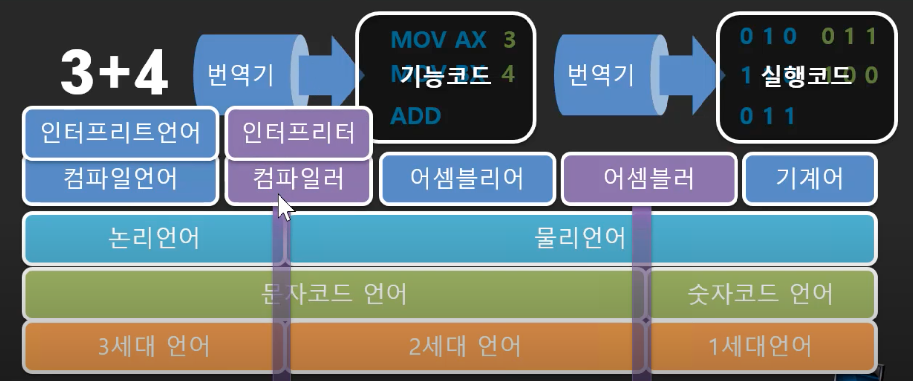

- 논리언어를 고급언어, 물리언어를 저급언어라고도 표현함
- 고급언어를 번역할 때 컴파일러는 번역만 함
  - 결과물이 남음, 그래서 실행코드를 만질 수 있음
  - C, C++, 자바(자바는 컴파일러와 인터프리터를 둘 다 씀) 등이 있음
- 인터프리터는 코드를 한번에 다 번역하는 것이 아니라 사용자가 필요로하는 부분만 번역하고 실행까지함
  - 결과물이 안남음
  - 이 코드를 다시 실행하고 싶으면 매번 다 번역을 해야함
  - 자바스크립트가 대표적임

## 8. 고급언어를 이용한 컴퓨터 프로그래밍

- 고급언어를 사용해서 프로그램을 만들면 컴퓨터를 직접 이용할 때와 어떻게 다른지 보자

### 프로그래밍이란 수행 절차를 기록하는 것

#### 컴퓨터 프로그램이란? 컴퓨터를 이용한 절차를 만들어 놓은 것

- 컴퓨터를 이용한 절차

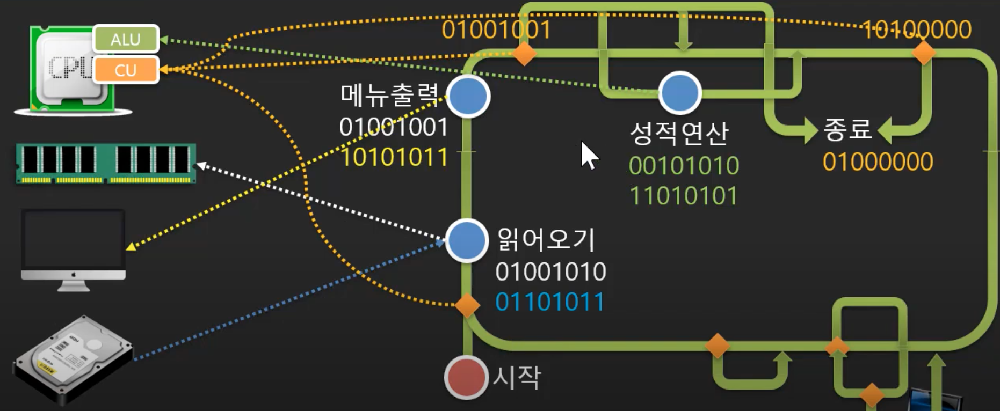

- 고급언어를 사용함
  - 고급언어는 CPU와 메모리 관련된 부분을 담당할 수 있음

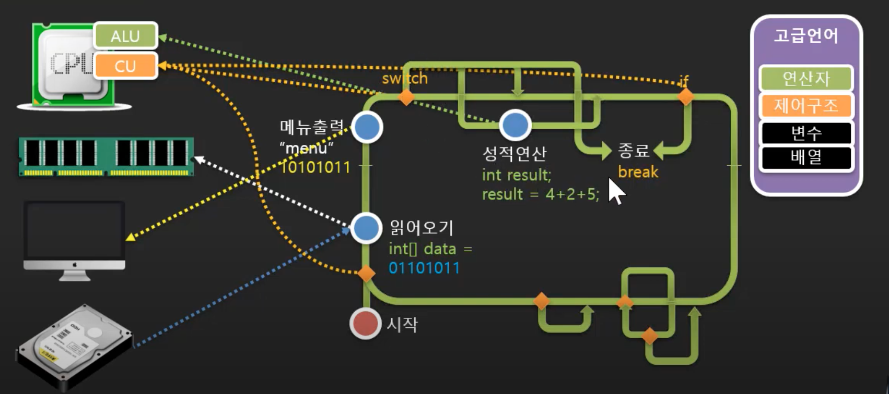

- 번역기를 통해서 내부적으로 다시 기계어 코드로 변경할 수 있음

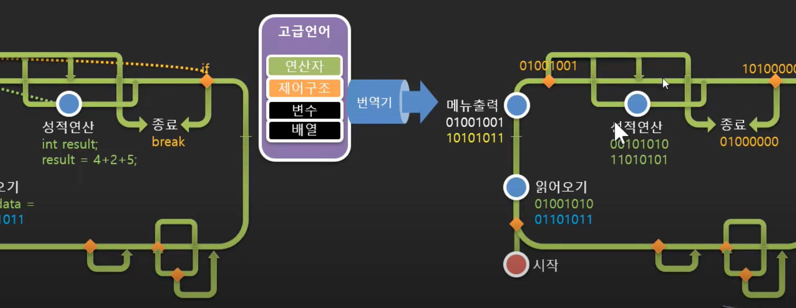

- 입/출력 장치는 언어에 포함되어있지 않음
  - API가 필요함

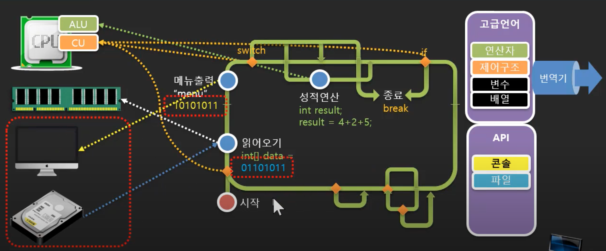

## 9. API란?

### 입/출력 장치는 왜 언어에 포함시키지 않았을까?

### 컴파일 언어와 API(Application Programming Interface) 플랫폼

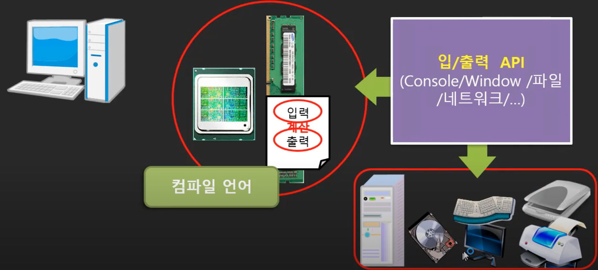

- CPU와 메모리는 자주 바뀌지 않음
  - 언어로 치환해서 사용할 수 있음
- 입출력 장치는 상대적으로 다양한 장치들이 있음
  - 언어로 치환하기에는 종류가 많아서 어려움
  - 장치가 달라지면 언어도 바꿔줘야되기 때문에
  - 그래서 장치를 직접 언어로 쓰지 않고 인터페이스를 사용하기로 함
    - 인터페이스는 어떤 장치를 사용하기 위한 간접적인 접근 도구라고 할 수 있음

#### 입출력 장치를 위한 인터페이스의 필요성

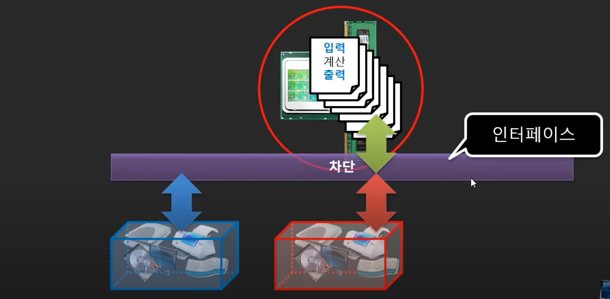

- 프로그램을 만들면서 장치가 달라질 수 있다는 것을 염두해두고 프로그램을 짤 때 자주 바뀔 수 있는 부분들, 즉 입출력 장치 부분을 차단함
- 그리고 간접적으로 사용할 수 있도록 API라는 변하지 않는 약속화되어있는 인터페이스를 사용함

## 10. API를 실현하기 위한 구현체 그리고 API와 플랫폼의 관계

### 프로그램에서 사용하는 재료

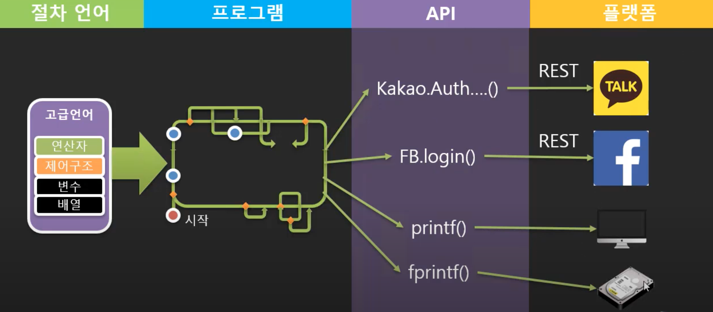

- 고급언어에는 CPU와 메모리가 녹아있음
  - SQL, HTML 등도 언어인가? 언어는 맞지만 플랫폼 언어임
- API는 보통 함수형태로 생김
  - 실질적으로 사용되는 원재료, 플랫폼들이 API라는 약속(간접적인 도구)을 통해 사용됨

## 11. 프로그래밍에서 함수가 제공하는 능력 3가지

### 함수의 능력

- 코드 파편화
  - 코드를 나눠서 만들 수 있음
- 코드 집중화
  - 세번 고칠 것을 한번만 고치면 됨
- 코드 은닉화
  - 함수를 사용할 때, 함수의 정의 부분을 알아야만 쓸 수 있나? 그럴 필요없다
  - 일부러 내용을 숨기고 싶을 때, 함수를 정의할 수도 있음
  - 함수 정의 부분이 바뀌던 말던 사용할 때 영향을 주지 않음
  - 이런 특징 때문에 플랫폼을 사용하는 부분을 함수로 정의하고 플랫폼이 바뀌어도 사용하는 입장에서는 영향을 받지 않도록 함

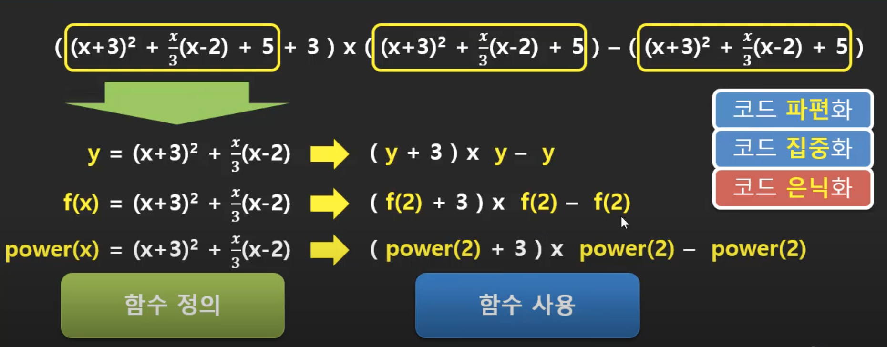

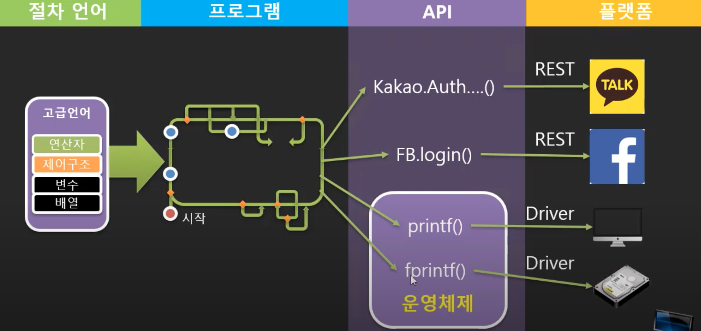

- 운영체제는 이런 함수들을 제공하고 스펙을 정의함
- 실제 구동 장치에 대한 내용들 코드는 장치를 만드는 회사에서 드라이버라는 개념으로 제공해줌
- 내가 사용하는 장치를 바꾸면 드라이버만 바꾸면 됨, 함수 사용에서 영향을 받지 않음

## 12. 어떤 언어로 프로그래밍을 시작할 것인가?

### 언어보다는 플랫폼이 먼저 선택의 기준이 되어야 한다.

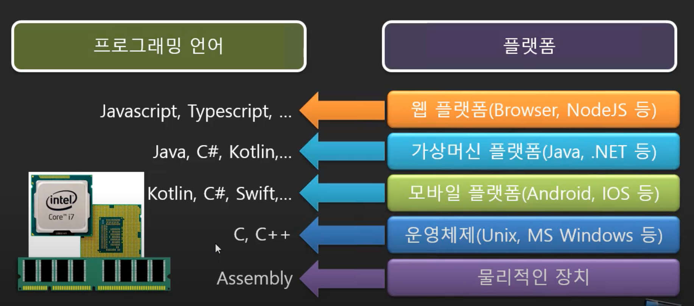

## 참고

- 유튜브 뉴렉처
- https://www.youtube.com/watch?v=PHqDCkv09lk&list=PLq8wAnVUcTFXna0fCAsElIj2qayRqvGjk

