# Java Programming


## 1. 프로그래밍과 프로그래밍 언어

### 모든 버전의 공통분모인 자바 프로그래밍

- 자바 6, 7, 8, 9, .. 등 버전에 상관없이 자바 언어를 이용해서 절차를 만드는 방법을 배우는 것이 '자바 프로그래밍'
- JDK는 8버전 사용함
- 자바 프로그래밍
  - 자바를 이용해서 컴퓨터 프로그램을 만드는 방법
    - 자바 번역기(컴파일러)를 이용해서

### 동일한 프로그램이지만 방법을 달리 만들 수 있다.

- 자바 프로그래밍(절차 구현) < 구조적 프로그래밍 < 객체지향 프로그래밍
- 여기서는 절차적으로 프로그래밍하는 법을 먼저 배움


## 2. 번역기 준비하기

### 컴파일러 다운로드

- 두 가지 버전의 컴파일러

  - 오라클의 유료화된 JDK
  - OpenJDK

- JDK

  - Java Community Process에서 같이 만드는 것(오라클이 가장 큰 영향력이 있음, 삼성도 있음)
  - 새로운 기능이나 방법을 제안하고 누군가 요청하면 이때 실험적으로 만들어지는 것이 OpenJDK임

- OpenJDK

  - openJDK 8 버전 다운로드
  - 윈도우: https://github.com/ojdkbuild/ojdkbuild
  - 맥: https://github.com/AdoptOpenJDK/homebrew-openjdk

- JDK

  - bin
    - Javac.exe: 이게 컴파일러

- 환경변수 설정

  - mac의 Zsh에서 실행한 경우

  ```shell
  open ~/.zshrc
  
  여기서 path 추가해주고
  
  source ~/.zshrc
  
  적용하면 끝!
  ```

  - 윈도우에서는 시스템 환경변수설정에 들어가서 설정


## 3. 자바를 이용해서 컴퓨터 프로그램 만들기

### 자바 코드의 기본 규칙

- Program.java

```java
public class Program {
  public static void main(String[] args) {
    int a = 50;
    int b = 40;
    int c = 30;
    int total = a + b + c;

    System.out.printf("total is %d\n", total);
	}
}
```

```shell
// 컴파일러로 java파일을 컴파일
javac Program.java
// 컴파일하고나면 Program.class라는 파일이 생김

// 인터프리터로 실행(.class는 떼고)
java Program
```


## 4. 자바 IDE 이클립스 설치하기

### 통합개발환경(IDE)와 워크벤치(Work Bench)


## 5. 이클립스 사용하기

### perspective를 변경해가며 사용할 수 있음

- Java
- Java EE
- ...
- 사용하고자하는 것에 맞춰서 메뉴와 함께 툴이 변경됨

### Project를 만드는 이유

- 이클립스가 쉽게 컴파일하기 위해서
- src에 java
- 컴파일하고나면 bin으로 감


## 6. 자바 언어의 특징

### Green Project(Stealth Project)

- 티비부터 시작해서 가전제품에 코드를 심기위한 프로젝트
- 새로운 언어에 대한 필요성
- C++
  - 객체 생성과 제거를 사용자가 할 수 있었음
    - 근데 제거를 사용자가 할 수 있게 하다보니까 생성과 제거가 쌍을 이루지 못하는 경우가 발생
    - 메모리 누수가 발생하게 됨
    - -> delete 키워드 제거(객체를 생성만 할 수 있게 만듬, 자바가 알아서 지워주도록 만듬)
  - 참조변수와 포인터 변수
    - 객체의 포인터 제거
  - 이차 이상의 포인터 문제
    - 모든 포인터 제거
  - 데이터 구조를 정의하는 두 가지 방법
    - Struct 키워드 제거
  - 함수지향? 객체지향?
    - 함수는 메소드로만 사용하도록 제약
    - 완전한 객체지향으로
  - 컬렉션의 부재
    - 언어에 컬렉션을 포함
  - 글로벌한 문자 복잡성
    - 다양한 인코딩 문자열 기능 개선
- Java
  - 간결성
  - 언어에 컬렉션 포함
  - 완전한 객체지향 언어
  - 요즘에 나온 언어들 대부분 이런 특징을 가지고 있음
  - 그래서 java 언어의 특징을 묻는다면 C++에 비해서 이러한 특징들이 있다고 말하면 됨


## 7. 자바 플랫폼(Platform)의 특징

### 새로운 WORA API의 탄생 - Platform independent

- WORA: 한번 작성하면 모든 곳에서 실행되는 코드
- 자바는 기본적으로 WORA를 구현하기 위해 나온 언어임

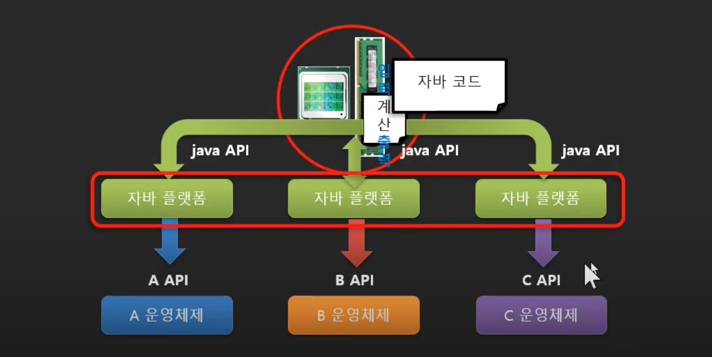

- 자바는 운영체제에 자바 플랫폼만 설치하면 단일한 API를 사용할 수 있게 만들어줌
- 하지만 단점이 있음
  - 플랫폼을 반드시 설치해야됨
  - 각 운영체제들만 가지고 있는 특징들은 단일화시킬 수 없었음


## 8. 자바 번역기의 특징

### WORA를 지원하기 위한 자바 프로그래밍 방법

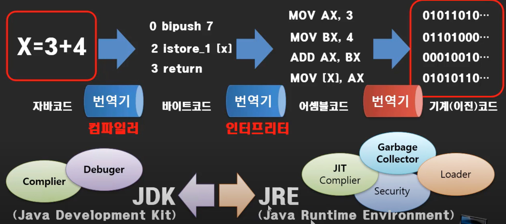

- 각 운영체제의 API를 맞추는것 보다 더 앞서서 CPU가 한 종류가 아니기 때문에 기계어 코드로 바뀔 때 문제가 생김
  - 인텔 CPU에서 돌아가는거는 다른 CPU에서는 안돌아갈 수도 있음
- 컴파일러의 번역 과정을 살펴보게 됨
  - 형태소 분석 > 구문 분석 > 의미 분석 > 중간 코드 > 최적화 > 물리 코드
  - 4단계까지는 CPU랑 무관한 것
  - 중간단계까지는 컴파일러로 번역
  - 나머지 두 단계는 실행자들의 환경에 맞게 실행하고 필요에 의해 그때그때 번역하는 인터프리터 사용
- 자바코드(.java) > [컴파일러] > 중간코드(.class) > [인터프리터] > 어셈블코드 > [어셈블러] > 기계코드
- 중간코드의 다른 용어
  - 가상CPU코드
  - 바이트코드
  - 의사코드
  - 수도코드
- 컴파일러는 개발자가 쓰는 번역기
- 인터프리터는 사용자가 쓰는 번역기
  - JIT Complier라고도 부름


## 9. 값의 종류와 표현방법

- 정수값
  - int
    - 26, 0x1a(16진수), 032(8진수), 0b11010(2진수)
    - 4바이트
  - long
    - 26L, 0x1aL
    - 8바이트
- 실수값
  - double
    - 123.4,  123.4d, 1.234e2, 1.234e2d
    - 8바이트
  - float
    - 123.4f, 1.234e2f
    - 4바이트
- 문자값
  - char
    - 'A'
- 진리값
  - True, false


## 10. 값의 진법 변환

- 16진수는 2진수를 4개씩 나눠서 적고 8진수는 3개씩 나눠서 적으면 됨


## 11. 값의 형식과 변환

### 정수형식과 변환

- 26 = 0x1A
  - 1 바이트
    - Byte
    - 26
  - 2 바이트
    - Short
    - 26
  - 4 바이트
    - Int
    - 26
  - 8 바이트
    - Long
    - 26L
- 기본적으로 정수는 int를 가짐

```java
long x = 30;
// long(8바이트)크기를 가진 그릇에 int(4바이트)크기를 가진 26을 넣는다? 기능하나?
// 가능함
// 묵시적으로 30을 30L로 바꿔서 크기를 맞춰줌, 데이터 손실이 없기 때문에 컴퓨터가 알아서 해줌

byte x = 30;
// 이때는 번역(컴파일)과정에서 에러가 남
// 프로그래머가 생각해서 이거 문제없다하면
byte x = (byte)30;
// 이렇게 바꿔줌, 명시적 형변환

//근데
byte x = 30;
// 여기서는 에러가 안남
// 30이라는 숫자가 byte의 범위 안에 있기 때문에
// 형변환 할때는 각 형식을 그릇으로 생각하고 숫자를 그 안에 있는 물로 생각하면 쉬움
// byte라는 1바이트짜리 그릇이지만 4바이트짜리에 들어있던 30이라는 숫자를 넣어도 넘치기 않기때문에 에러가 안남
// 만약에 200을 넣었다면 넘쳐서 에러가 났을 것, 이때는 앞에 (byte)를 붙여줘야됨, 물론 데이터 손실은 일어남
```

### 실수형식과 변환

- 26.5 = 2.65e1
  - 4바이트
    - float
  - 8바이트
    - double

```java
float x = 3.5;
// 에러남, 묵시적으로 형변환 불가능
float x = (float)3.5;
// 이러면 에러는 안나는데, 데이터 손실이 있을 수 있음

double x = 3.5f;
// 이건 에러안남, 묵시적으로 형변환 가능
```

### 문자형식

- 2바이트
  - char

### 부울 형식

- 1비트
  - boolean

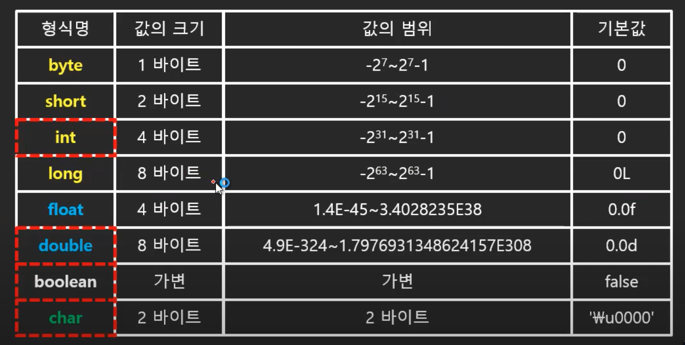


## 12. 정수 값의 크기와 범위

- 1바이트 = 8비트 = 2의 8승개의 데이터를 표현할수있음 = 256개 표현
- 표현할 수 있는 숫자의 범위는: -2^7 ~ 2^7-1


## 13. 부동 소수점(Float Point) 실수의 크기와 범위

- 고정 소수점(Fixed Point) 4바이트
  - 부호비트(1비트) + 정수부(15비트) + 실수부(16비트)
  - 유동적이지가 않고, 비효율, 낭비, 표현의 한계가 생김
- 부동 소수점(Float Point) 4바이트
  - 부호비트(1비트) + 지수부(8비트) + 가수부(23비트)

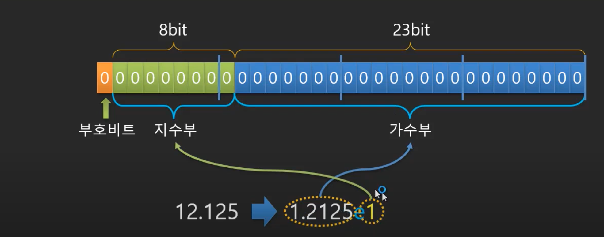

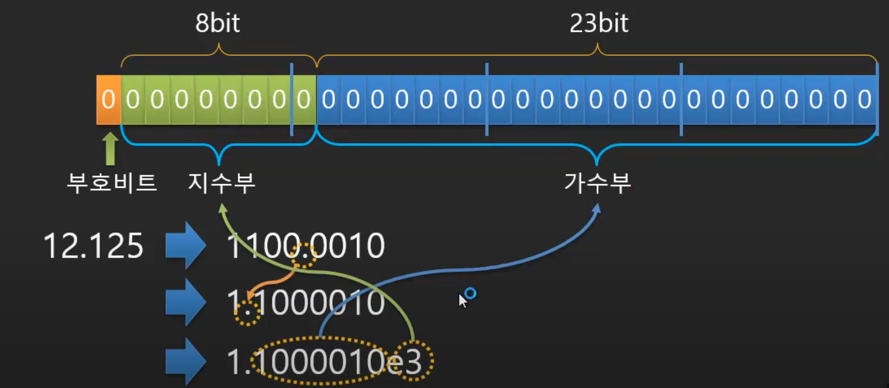

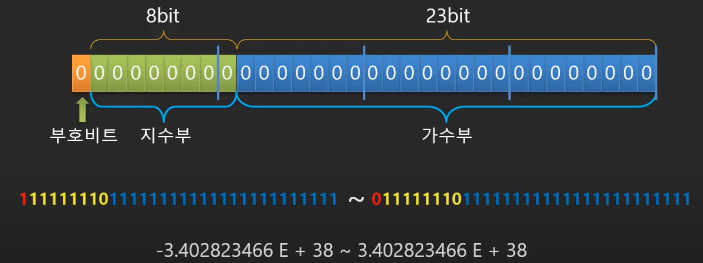


## 14. 자바 변수 선언

### 선언이란?

- 모든 키워드는 선언하고 사용해야만 한다.
- 변수, 함수, 참조변수 ... 등 쓰임을 써야됨

```java
//변수
int kor;

//함수
void add(int x, int y){
  
}

//참조변수
Animal 순심이;
```

### 변수란?

- 값을 저장하기 위한 공간
  - Byte, int, float 등
- 변수 명명 규칙
  - 영문자로 시작
  - 공백 안됨
  - 특수기호 안됨
  - ...
- 여러 변수 한번에 선언하기
  - 자료형이 같을 경우에는 한 줄에 선언할 수 있음


## 15. 출력 스트림 객체와 API

### 자바 플랫폼의 내장 입/출력 객체와 멤버 함수

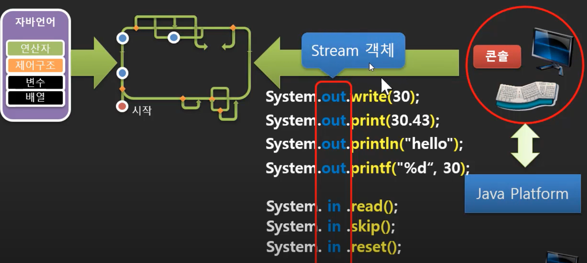

- 스트림? 객체? 알아보자

### 출력 스트림(Output Stream)을 이용한 비동기 처리

- Stream: 단방향 버퍼
- Output Stream: 출력 방향으로의 단방향 버퍼
- 어플리케이션의 많은 프로그램들을 수행할 때 비동기로 처리할 수 있도록 버퍼가 있어야됨
- 그 버퍼를 실행환경에서 운영하면서 순서를 정하고 처리를 해줌
- 이때 보통 이런 운영은 운영체제해서 하는데 자바 플랫폼에 이런 기능이 있어서 자바 플랫폼에서 처리함
- 그래서 우리는 출력을 바로 모니터로하는게 아니라 출력버퍼, 즉, 출력 스트림에다가 해주는 것
- 출력스트림을 사용할 때는 개체를 쓰는게 아니라 객체를 쓰는 것

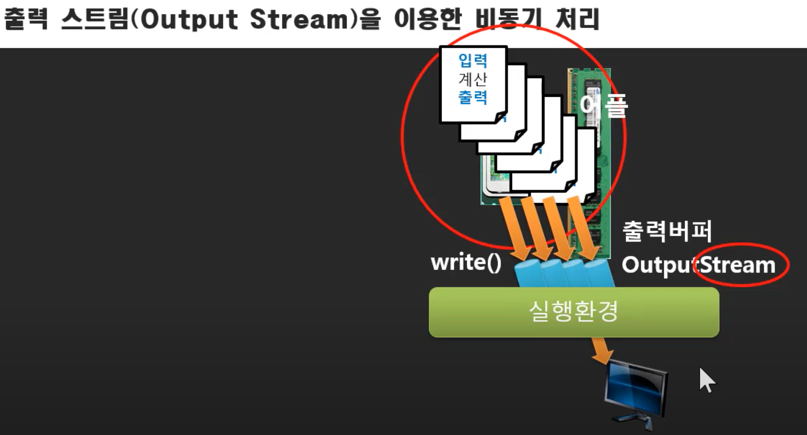

### 개체(Entity)와 객체(Object)

- 개체: 실체라는 것을 사용하기 위해 사용하는 타입
  - 자동차 타입명: K7 하이브리드
- 객체: 실존하는 것, 실체
  - 내가 산 K7 하이브리드 타입의 자동차 이름: 쇠돌이

### 입/출력 API는 입/출력 스트림 객체를 이용한다

- 객체를 이용하는 함수
  - 객체라고 하는 것을 누가 만들어달라고 한 적이 있어야됨
  - 객체화를 위해 사용되는 new가 있음
  - new를 통해 객체화하고나서 이름을 붙이는건 우리가 할 수 있음, 이게 참조변수
  - 그런데 콘솔 입출력을 위한 출력스트림과 입력스트림의 객체는 자바 플랫폼에서 생성하고 이름까지 붙여둠
  - 그게 out과 in임

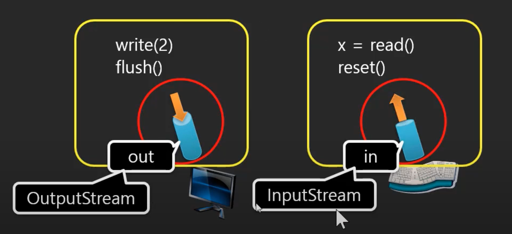


## 16. 콘솔 입출력과 문자코드

- 미국에서 정한 문자코드
  - 아스키코드
- 각국의 문자코드 확장
  - 아스키코드 + 각국의 코드들
  - 문제점: 같은 번호라도 각국에서 다르게 표현됨
- 그래서 유니코드가 쓰여짐
  - 아스키코드 + 각국의 테이블을 안겹치게 모아둠


## 17. 콘솔 문자열 출력 - PrintStream

- write를 사용하면 문자 하나씩 출력할 수 있음
- 문자열을 한번에 출력해줄수없나?

### PrintStream과 객체 생성

- Print(), println(), printf() 등이 있음
- OutputStream을 응용한 것

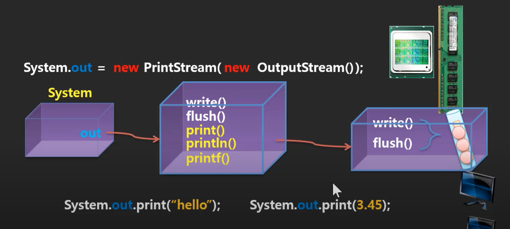

### 성적 출력하기

```java
package ex1.io.printstream;
public class Program {

	public static void main(String[] args) {
		
		int a = 50;
		int b = 40;
		int c = 30;
		int total = a + b + c;

		//------------성적 출력 부분-------------------------------
		System.out.print("|---------------------|");
		System.out.print("|        성적출력       |");
		System.out.print("|---------------------|");
		
		System.out.print("국어1 : 0");
		System.out.print("국어2 : 0");
		System.out.print("국어3 : 0");
		System.out.print("총점 : 0");
		System.out.print("평균 : 0.00");
	}
}
```


## 18. Escape 문자

### 출력을 제어하기 위한 방법이 필요

- 이스케이프 문자: 문자열 사이에 꽂아 넣을 수 있는 명령어
- \n, \b, \\\, \\', \\", \t, \f, \r...

```java
package ex3.io.escape;
public class Program {

	public static void main(String[] args) {
		
		int a = 50;
		int b = 40;
		int c = 30;
		int total = a + b + c;

		//------------성적 출력 부분-------------------------------
		System.out.print("|---------------------|\n");
		System.out.print("|        Score        |\n");
		System.out.print("|---------------------|\n");
		
		System.out.print("국어1 : 0\n");
		System.out.print("국어2 : 0\n");
		System.out.print("국어3 : 0\n");
		System.out.print("총점 : 0\n");
		System.out.print("평균 : 0.00\n");
		System.out.print("|---------------------|\n");
		
		System.out.println("|---------------------|");
		System.out.println("|        Score        |");
		System.out.println("|---------------------|");
		
		System.out.println("국어1 : 0");
		System.out.println("국어2 : 0");
		System.out.println("국어3 : 0");
		System.out.println("총점 : 0");
		System.out.println("평균 : 0.00");
		System.out.println("|---------------------|");
	}
}
```


## 19. 출력 문자열 format과 숫자 출력 - printf

```java
System.out.print(80);
// 숫자를 넣으면 "80" > '8' '0' 변환해서 보여주는 것까지 해줌
System.out.printf("%d-%d-%d", 1995, 04, 08);
// 표시형식을 지정해줄 수 있음
```

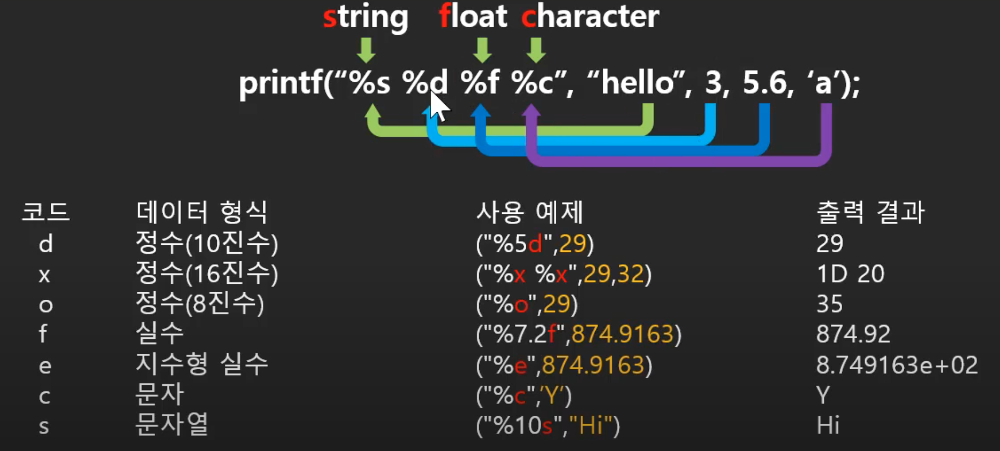


## 20. 형식지정자 옵션

```java
System.out.printf("평균 : %6.2f\n", avg);

System.out.printf("%1$d %3$d %2$d\n", a, b, c);
System.out.printf("%1$d %1$d %1$d", a);
```


## 21. 콘솔 입력하기(System.in, Scanner)

### InputStream과 객체 생성

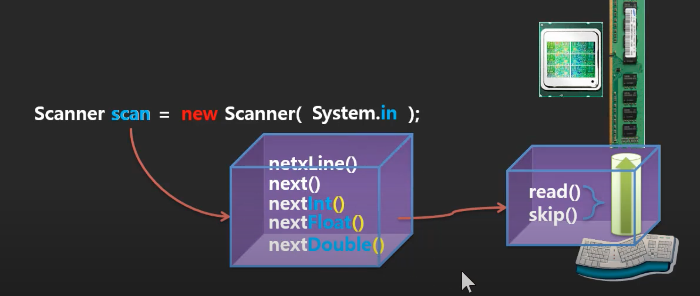


## 22. 산술, 대입 연산자

### 산술 연산자

- 나머지 연산자
  - 숫자를 나눌 때
- 연산자와 자료형
  - 손실되지 않는 쪽으로 묵시적인 형변환이 일어남
  - 아니면 프로그래머가 그냥 명시적인 형변환을 할 수 있음
- 연산자 우선순위
  - 괄호 사용

### 단항 연산자

- 증가 연산자, 감소 연산자, 부정 연산자
- 단항 연산자의 전위와 후위 연산 고려


## 23. 비교, 관계 연산자

- 비교 연산자
  - ==, !=. >, >=,<, <=
- 논리 연산자
  - &&: and
  - ||: or


## 24. 비트(bit) 연산자

### 비트 논리 연산자

- &: 비트 교집합 연산
  - 3 & 7 => 0011 & 0111 => 0011
- |: 비트 합집합 연산
- ^: 비트 차집합 연산
- ~: 비트 부정 연산자

### 쉬프트 연산자

- <<
  - 3 << 2 => 0011 << 2 => 1100 => 12
- \>>
  - 왼쪽 끝에 있는 숫자로 이어져서 옮겨짐
- 사용 사례
  - 한 변수에 두 개의 값을 대입하기


## 25. 복합 대입 연산자와 연산자 우선순위

### 복합 대입 연산자

- +=, -=, *=, /=, %=, |=, <<=, \>>=

### 기타 연산자

- 3항 연산자
  - ? :

- 객체 형식 비교 연산자
  - instanceof

### 연산자 우선순위

- 우선순위를 암기하기보단 괄호를 쓰자


## 26. 제어 구조(Control)

### 대부분의 컴퓨터 프로그램의 기본흐름

- 컴퓨터 프로그램은 반복을 기본으로 한다

### 제어구조의 종류

- 선택문
- 반복문
- 분기문


## 27. if와 while문

### 제어문을 사용하면 흐름을 바꿀 수 있음


## 28. 제어구조 do while문

- do while을 쓰면 반복을 줄일 수 있음
  - 수정해야될 부분을 줄일 수 있음


## 29. 제어구조 for문

### 특정수 만큼 반복

- 이런식으로도 쓰임

```java
int i = 0;
for(; i<3 ;) {
  
	i++;
}

for(; true ;) {
  
}

for(;;){
  
}

for(int x=0, int y=0, x<0; x++, y=x) {
  
}
```


## 30. 수학의 필요성

```java
package ex10.control2.for_.example;

import java.util.Scanner;

public class Program {

	public static void main(String[] args) {
		
		int total = 0;
		
//		for(int i=0; i<5; i++) {
//			total += 3+i;
//		}
		
//		n*(a+l)/2
		total = 5*(3+7)/2;
		
		System.out.printf("total is %d\n", total);
		
	}
}
```


## 31. 제어구조 else if, else

### 메뉴 선택 기능을 추가

```java
package ex11.control2.elseif;

import java.util.Scanner;

public class Program {

	public static void main(String[] args) {
		
		int kor1, kor2, kor3;
		int total;
		float avg;
		int menu;
		
		Scanner scan = new Scanner(System.in);
		
		
		kor1 = 0;
		kor2 = 0;
		kor3 = 0;
		
		
		while(true) {
			//------------메인 메뉴 부분------------------------------
			System.out.println("|---------------------|");
			System.out.println("|       Main menu     |");
			System.out.println("|---------------------|");
			
			System.out.println("\t1.성적 입력");
			System.out.println("\t2.성적 출력");
			System.out.println("\t3.종료");
			System.out.print("\t>");
			
			menu = scan.nextInt();
			
			
			if (menu == 1) {
				//------------성적 입력 부분------------------------------
				System.out.println("|---------------------|");
				System.out.println("|       Score in      |");
				System.out.println("|---------------------|");
				
				do {
					System.out.print("국어1 : ");
					kor1 = scan.nextInt();
					if(kor1 < 0 || 100 < kor1) {
						System.out.println("out of scope 0~100");
					}
					
				} while(kor1 < 0 || 100 < kor1);
				
				do {
					System.out.print("국어2 : ");
					kor2 = scan.nextInt();
					if(kor2 < 0 || 100 < kor2) {
						System.out.println("out of scope 0~100");
					}
					
				} while(kor2 < 0 || 100 < kor2);
				
				do {
					System.out.print("국어3 : ");
					kor3 = scan.nextInt();
					if(kor3 < 0 || 100 < kor3) {
						System.out.println("out of scope 0~100");
					}
					
				} while(kor3 < 0 || 100 < kor3);
			
			}
			
			else if (menu == 2) {
				//------------성적 출력 부분------------------------------
				total = kor1 + kor2 + kor3;
				avg = total / 3.0f;
				
				System.out.println("|---------------------|");
				System.out.println("|      Score out      |");
				System.out.println("|---------------------|");
				
				for(int i=0; i<3; i++) {
					System.out.printf("국어%d : %3d\n", i+1, kor1);
				}
						
				System.out.printf("총점 : %3d\n", total);
				System.out.printf("평균 : %6.2f\n", avg);
				System.out.println("|---------------------|");
			}
			
			else if (menu == 3) {
				break;
			}
			else {
				System.out.println("1~3까지만 입력해주세요.");
			}
		}
		System.out.println("good bye~");
	}
}
```


## 32. 제어구조 switch와  break 라벨문

### 사실 메뉴를 구현하는 else if는 적절한 제어흐름이 아님

- Else if 문의 문제점
  - 뒤쪽에 가다보면 실행되는데 오래걸림
  - 이런 경우에는 선택문을 사용해야됨

### Switch문을 이용한 선택 흐름

```java
switch(menu)

case 1:
	break;
case 2:
	break;
case 3:
	break;
```

### 중첩된 제어구조 벗어나기

```java
종료
while
	for
		switch
			break 종료:
```

### switch로 변형시킴

```java
package ex12.control2.switch_;

import java.util.Scanner;

public class Program {

	public static void main(String[] args) {
		
		int kor1, kor2, kor3;
		int total;
		float avg;
		int menu;
		
		Scanner scan = new Scanner(System.in);
		
		
		kor1 = 0;
		kor2 = 0;
		kor3 = 0;
		
		종료:
		while(true) {
			//------------메인 메뉴 부분------------------------------
			System.out.println("|---------------------|");
			System.out.println("|       Main menu     |");
			System.out.println("|---------------------|");
			
			System.out.println("\t1.성적 입력");
			System.out.println("\t2.성적 출력");
			System.out.println("\t3.종료");
			System.out.print("\t>");
			
			menu = scan.nextInt();
			
			switch(menu) {
			
			case 1: 
				//------------성적 입력 부분------------------------------
				System.out.println("|---------------------|");
				System.out.println("|       Score in      |");
				System.out.println("|---------------------|");
				
				do {
					System.out.print("국어1 : ");
					kor1 = scan.nextInt();
					if(kor1 < 0 || 100 < kor1) {
						System.out.println("out of scope 0~100");
					}
					
				} while(kor1 < 0 || 100 < kor1);
				
				do {
					System.out.print("국어2 : ");
					kor2 = scan.nextInt();
					if(kor2 < 0 || 100 < kor2) {
						System.out.println("out of scope 0~100");
					}
					
				} while(kor2 < 0 || 100 < kor2);
				
				do {
					System.out.print("국어3 : ");
					kor3 = scan.nextInt();
					if(kor3 < 0 || 100 < kor3) {
						System.out.println("out of scope 0~100");
					}
					
				} while(kor3 < 0 || 100 < kor3);
			
				break;
				
			case 2: 
				//------------성적 출력 부분------------------------------
				total = kor1 + kor2 + kor3;
				avg = total / 3.0f;
				
				System.out.println("|---------------------|");
				System.out.println("|      Score out      |");
				System.out.println("|---------------------|");
				
				for(int i=0; i<3; i++) {
					System.out.printf("국어%d : %3d\n", i+1, kor1);
				}
						
				System.out.printf("총점 : %3d\n", total);
				System.out.printf("평균 : %6.2f\n", avg);
				System.out.println("|---------------------|");
			
				break;
				
			case 3: 
				break 종료;
				
			default:
				System.out.println("1~3까지만 입력해주세요.");
				
			}
		}
		System.out.println("good bye~");
	}
}
```


## 33. 제어구조  continue와 break문

### 건너뛰기(continue)와 중단하기(break)


## 34. 배열이란?

### 임시 저장소 또는 버퍼의 필요성

- 프로그램 방식
  - 입력 > 데이터(계산) > 출력
  - 중간에 저장소가 필욯함

### 여러 개의 성적을 관리하기 위한 저장소 마련하기

- 각각의 변수를 통해 저장하기보단 여러개의 변수를 한번에 저장할 수 있는 방법
- 여러개의 변수를 각각 만드는 것과의 차이
  - 변수 이름이 하나만 있으면 됨

### 저장소 구현

```java
int [] kors = new int[3];
```

- 반복문을 사용해서 여러개의 값을 저장할 수 있음


## 35. 배열을 이용한 성적 관리

```java
package ex14.array;

import java.util.Scanner;

public class Program {

	public static void main(String[] args) {
		
//		int kor1, kor2, kor3;
		int [] kors = new int[3];
		int total;
		float avg;
		int menu;
		
		Scanner scan = new Scanner(System.in);
		
		
//		kor1 = 0;
//		kor2 = 0;
//		kor3 = 0;
		
		for(int i=0; i<3; i++) {
			kors[i] = 0;
		}
		
		종료:
		while(true) {
			//------------메인 메뉴 부분------------------------------
			System.out.println("|---------------------|");
			System.out.println("|       Main menu     |");
			System.out.println("|---------------------|");
			
			System.out.println("\t1.성적 입력");
			System.out.println("\t2.성적 출력");
			System.out.println("\t3.종료");
			System.out.print("\t>");
			
			menu = scan.nextInt();
			
			switch(menu) {
			
			case 1: 
				//------------성적 입력 부분------------------------------
				System.out.println("|---------------------|");
				System.out.println("|       Score in      |");
				System.out.println("|---------------------|");
				
//				do {
//					System.out.print("국어1 : ");
//					kor1 = scan.nextInt();
//					if(kor1 < 0 || 100 < kor1) {
//						System.out.println("out of scope 0~100");
//					}
//					
//				} while(kor1 < 0 || 100 < kor1);
//				
//				do {
//					System.out.print("국어2 : ");
//					kor2 = scan.nextInt();
//					if(kor2 < 0 || 100 < kor2) {
//						System.out.println("out of scope 0~100");
//					}
//					
//				} while(kor2 < 0 || 100 < kor2);
//				
//				do {
//					System.out.print("국어3 : ");
//					kor3 = scan.nextInt();
//					if(kor3 < 0 || 100 < kor3) {
//						System.out.println("out of scope 0~100");
//					}
//					
//				} while(kor3 < 0 || 100 < kor3);
				
				for(int i=0; i<3; i++) {
					do {
						System.out.printf("국어%d : ", i+1);
						kors[i] = scan.nextInt();
						if(kors[i] < 0 || 100 < kors[i]) {
							System.out.println("out of scope 0~100");
						}
						
					} while(kors[i] < 0 || 100 < kors[i]);
				}
			
				break;
				
			case 2: 
				//------------성적 출력 부분------------------------------
//				total = kor1 + kor2 + kor3;
				total = kors[0] + kors[1] + kors[2];
				avg = total / 3.0f;
				
				System.out.println("|---------------------|");
				System.out.println("|      Score out      |");
				System.out.println("|---------------------|");
				
				for(int i=0; i<3; i++) {
					System.out.printf("국어%d : %3d\n", i+1, kors[i]);
				}
						
				System.out.printf("총점 : %3d\n", total);
				System.out.printf("평균 : %6.2f\n", avg);
				System.out.println("|---------------------|");
			
				break;
				
			case 3: 
				break 종료;
				
			default:
				System.out.println("1~3까지만 입력해주세요.");
				
			}
		}
		System.out.println("good bye~");
	}
}
```


## 36. 다차원 배열

### 국어성적을 여러 개 저장하기 위한 더 큰 단위의 저장소

- 학년 마다 국어성적들을 쓸려고 할 때

```java
int[][] kors = new int[3][3]
```


## 37. 다차원 배열 표현식

```java
package ex15.marray;

import java.util.Scanner;

public class Program2 {

	public static void main(String[] args) {
		
//		int kor1, kor2, kor3;
//		int [] kors = new int[3*3];
		int[][] kors = new int[3][3];
		int total;
		float avg;
		int menu;
		
		Scanner scan = new Scanner(System.in);
		
		
//		kor1 = 0;
//		kor2 = 0;
//		kor3 = 0;
		
		for(int j=0; j<3; j++) {
			for(int i=0; i<3; i++) {
//				kors[j*3+i] = 0;
				kors[j][i] = 0;
			}
		}
		
		종료:
		while(true) {
			//------------메인 메뉴 부분------------------------------
			System.out.println("|---------------------|");
			System.out.println("|       Main menu     |");
			System.out.println("|---------------------|");
			
			System.out.println("\t1.성적 입력");
			System.out.println("\t2.성적 출력");
			System.out.println("\t3.종료");
			System.out.print("\t>");
			
			menu = scan.nextInt();
			
			switch(menu) {
			
			case 1: 
				//------------성적 입력 부분------------------------------
				System.out.println("|---------------------|");
				System.out.println("|       Score in      |");
				System.out.println("|---------------------|");
				
//				do {
//					System.out.print("국어1 : ");
//					kor1 = scan.nextInt();
//					if(kor1 < 0 || 100 < kor1) {
//						System.out.println("out of scope 0~100");
//					}
//					
//				} while(kor1 < 0 || 100 < kor1);
//				
//				do {
//					System.out.print("국어2 : ");
//					kor2 = scan.nextInt();
//					if(kor2 < 0 || 100 < kor2) {
//						System.out.println("out of scope 0~100");
//					}
//					
//				} while(kor2 < 0 || 100 < kor2);
//				
//				do {
//					System.out.print("국어3 : ");
//					kor3 = scan.nextInt();
//					if(kor3 < 0 || 100 < kor3) {
//						System.out.println("out of scope 0~100");
//					}
//					
//				} while(kor3 < 0 || 100 < kor3);
				
				for(int j=0; j<3; j++) {
					for(int i=0; i<3; i++) {
						do {
							System.out.printf("%d학년 국어%d : ", j+1, i+1);
							kors[j][i] = scan.nextInt();
							if(kors[j][i] < 0 || 100 < kors[j][i]) {
								System.out.println("out of scope 0~100");
							}
							
						} while(kors[j][i] < 0 || 100 < kors[j][i]);
					}
				}
			
				break;
				
			case 2: 
				//------------성적 출력 부분------------------------------
				
				System.out.println("|---------------------|");
				System.out.println("|      Score out      |");
				System.out.println("|---------------------|");
				
				for(int j=0; j<3; j++) {
					
					System.out.printf("-----<%d grade>--------\n", j+1);

					total = 0;
					for(int i=0; i<3; i++) {
						total += kors[j][i];
					}
					avg = total / 3.0f;
					
					for(int i=0; i<3; i++) {
						System.out.printf("국어%d : %3d\n", i+1, kors[j][i]);
					}
							
					System.out.printf("총점 : %3d\n", total);
					System.out.printf("평균 : %6.2f\n", avg);
					System.out.println("---------------------");
				}
				break;
				
			case 3: 
				break 종료;
				
			default:
				System.out.println("1~3까지만 입력해주세요.");
				
			}
		}
		System.out.println("good bye~");
	}
}
```


## 38. 상수형 변수

### 상수형 변수가 필요한 경우

- 변수를 통해 문자로 의미를 파악할 수 있도록 함
  - 방향을 설정할 때

```java
final int N = 1;
final int E = 2;
final int S = 3;
final int W = 4;

int direction;
// 나중에 헷갈림
direction = 4;
// 이렇게 문자로 두면 나중에 봐도 바로 알 수 있음
direction = W;
```


