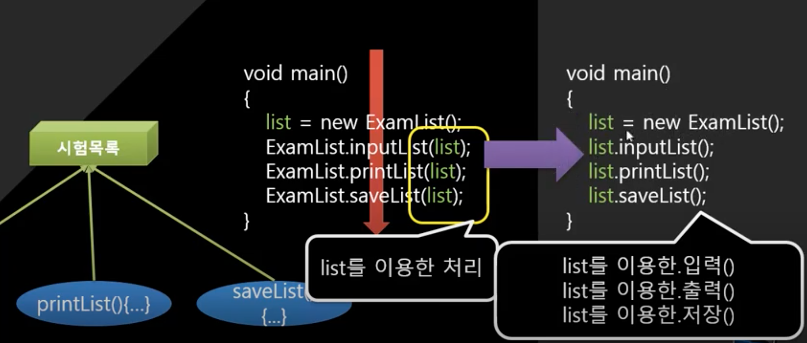
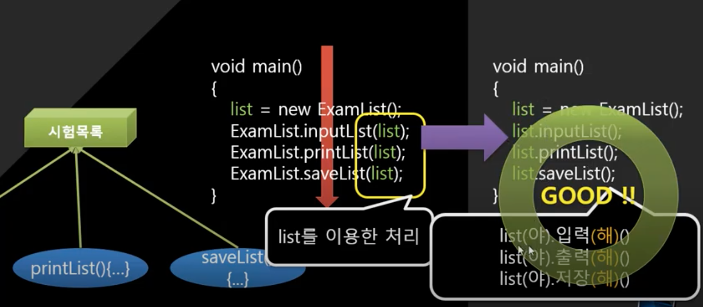
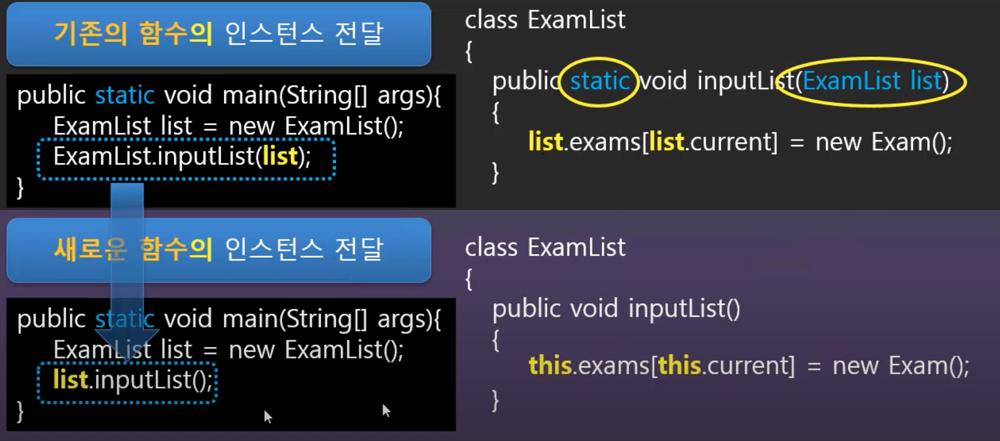
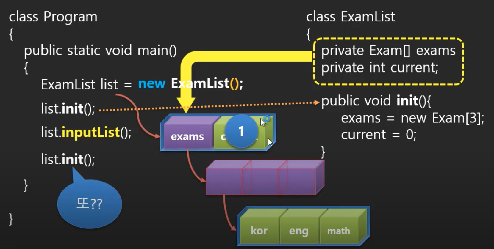

# 객체지향 프로그램(OOP-Object Oriented Programming)

## 1. 객체지향 프로그래밍의 시작 캡슐화

### 객체지향 프로그래밍

- OOP의 기본 컨셉은 프로그램 내에서 표현하고자 하는 <b>실 세계(real world)의 일들을 객체를 사용해서 모델링 하고</b>,  객체를 사용하지 않으면 불가능 혹은 무지 어려웠을 일들을 쉽게 처리하는 방법을 제공한다는 것
- 객체는 모델링하고자 하는 일이나 기능 혹은 필요한 행동들을 표현하는 프로그램 코드와 그와 연관된 데이터로 구성됨
- 객체는 데이터(그리고, 함수 역시)를 감싸서(공식적인 표현으로는 encapsulate) 객체 패키지(해당 객체를 참조하기 위한 이름. namespace라고도 불림) 안에 보관함
- 이는 계층 구조를 만드는데 용이하고 사용하기에도 쉽게 하기 위해서임
- 또한, 객체는 네트워크를 통해 쉽게 전송될 수 있도록 데이터를 저장하는 용도로도 많이 사용됨

### 객체란? 클래스란?

- 변수와 함수와 데이터 구조를 가지고 구성된다?
- 아무렇게나하면되나? 멀 기준으로하는 건가..

### 프로그램이란... 절차가 전부이다.

- 무조건 프로그램이라고 하면 절차임
- 근데 절차만 가지고 만들려고하면 코드가 길어지고 규모가 커짐
- 그래서 잘라서 만드는 방법이 유행함 > 구조적인 프로그래밍
- 근데 함수로 쭉 만드는 방법에도 해결하지 못한 부분이 있음
- 그래서 새로운 방법이 나옴 > 객체지향 프로그래밍
  - 어떤 문제가 있었으며, 새로운 방식이 필요했을 것이다..?
  - 뭐가 문제였나??

### 캡슐화

- 객체지향가 제일 먼저 시작되는 것은 캡슐화
- 프로그래밍은 절차이다
  - 흐름 제어가 포함된 프로그램
- 절차를 잘라서 만드는게 구조적 프로그래밍
  - 구조가 포함된 프로그램
  - 학생목록(): 거시적인 단위의 절차
    - 추가(): 미시적인 단위의 절차
    - 수정(): 미시적인 단위의 절차
    - 삭제(): 미시적인 단위의 절차
    - 취소(): 미시적인 단위의 절차
  - 프로그램 규모의 변화
    - 만약 볼륨감이 큰 코드를 잘랐다고해보자, 함수의 개수가 많아짐
      - 여기서부터 문제임

### 함수의 개체수가 많아지는 문제와 수납 방법의 모색

- 어떻게 수납할 것인가?
  - 수납 공간은 파일(클래스 파일)
  - 기능에 따라서 분리할 것인가? 아니면 데이터에 따라서 분리할 것인가?
    - 데이터를 기준으로 묶어주는 것이 바람직함 
    - 구조화된 데이터를 사용하는 함수 모듈의 독립성을 침해하는 문제를 해결할 수 있기 때문
- 함수 모듈의 독립성?
  - 함수는 외부의 수정에 절대 영향을 받아서는 안된다
  - 매개변수를 써도 이런 문제가 발생함

```java
class Ellipse{
	int x, y, w, h;
  int color;
}
```

```java
void draw(Ellipse ellipse){
  print(ellipse.x);
  ellipse.x + ellipse.y ....
}
```

- 다른 곳에서 draw함수에 매개변수로 ellipse를 받았음
  - 외부의 변수를 쓴적이 없음, 매개변수로 받아 지역변수로 사용했기 때문에
  - 그런데 구조화된 데이터를 쓰게 되면, 즉, 클래스 Ellipse의 속성을 변경하면 오류가 발생하게 됨
  - 구조화된 객체를 사용하는 함수는 객체의 구조 변경에 아주 취약하다
  - 어떻게 해결해야하나?
    - 절대 변수명을 변경하지 않는다?? x
    - 바꾸지만 모든 연관된 함수들을 일일이 다 찾아서 고쳐준다?? x
  - 연관된 함수들을 한곳에 모아서 class안에 넣어주는 방법이 필요함
    - 그러면 코드를 수정할 때 부담이 줄어듬

### 코드 파일 관리방법

```java
class Ellipse{
	int x, y, w, h;
  int color;
	
	void draw(Ellipse ellipse){
    print(ellipse.x);
    ellipse.x + ellipse.y ....
	}
}
```

- 이런식으로 한 곳에 다 모음
  - 유지보수가 편해짐
  - 데이터와 이 데이터를 사용하는 함수들을 함께 모았다고해서 캡슐이라고 함
  - 캡슐화의 핵심은 데이터 구조의 변화가 class안에서만 영향을 준다. 외부에는 영향을 주지 않는다

### 캡슐화 정리

- 데이터 구조와 함수를 하나의 영역에 함께 정의하는 것


## 2. 함수들을 캡슐화하기

### 캡슐화: 데이터 구조와 함수를 하나의 영역에 함께 모아 놓는 작업

- 캡슐: 모아놓은 것
- ~화: 모아놓는 작업

### 성적 출력 프로그램을 객체지향으로 리팩토링해보자

- 완벽한 객체지향은 아니지만 그 의미는 따라가는 과도기적 객체지향 코드
- 아직까지 캡슐화가 깨질 수 있음
- 하지만 일단은 클래스내부에서의 변화가 외부에 영향을 주지 않게 만들어봄

```java
package Part3.ex1.캡슐화;

import java.util.Scanner;

public class ExamList {
	Exam[] exams;
	int current;
	
	static void printList(ExamList list) {
		printList(list, list.current);
	}
	
	static void printList(ExamList list, int size) {
		System.out.println("|---------------------|");
		System.out.println("|      Score out      |");
		System.out.println("|---------------------|");
        System.out.println();
        
//        int size = list.current;
        if(size > list.current) {
        	size = list.current;
        }
        Exam[] exams = list.exams;
        
        for(int i=0; i<size; i++) {
	        Exam exam = exams[i];
	        int kor = exam.kor;
	        int eng = exam.eng;
	        int math = exam.math;
	        
	        int total = kor+eng+math;
	        float avg = total/3.0f;
	        
	        System.out.printf("국어 : %d\n", kor);
	        System.out.printf("영어 : %d\n", eng);
	        System.out.printf("수학 : %d\n", math);
	        
	        System.out.printf("총점 : %3d\n", total);
			System.out.printf("평균 : %6.2f\n", avg);
			System.out.println("|---------------------|");
        }
		
	}

	static void inputList(ExamList list) {
		Scanner scan = new Scanner(System.in);
		
		System.out.println("|---------------------|");
		System.out.println("|       Score in      |");
		System.out.println("|---------------------|");
        System.out.println();
        
        
        int kor, eng, math;
        
        do {
        	System.out.printf("국어 : ");
	        kor = scan.nextInt();
        
	        if(kor < 0 || 100 < kor)
	        	System.out.println("out of scope 0~100");
	        
        }while(kor < 0 || 100 < kor);
        
        do {
        	System.out.printf("영어 : ");
        	eng = scan.nextInt();
        
	        if(eng < 0 || 100 < eng)
	        	System.out.println("out of scope 0~100");
	        
        }while(eng < 0 || 100 < eng);
        
        do {
        	System.out.printf("수학 : ");
        	math = scan.nextInt();
        
	        if(math < 0 || 100 < math)
	        	System.out.println("out of scope 0~100");
	        
        }while(math < 0 || 100 < math);
        
        Exam exam = new Exam();
        exam.kor = kor;
        exam.eng = eng;
        exam.math = math;
        
        Exam[] exams = list.exams;
        int size = list.current;
        
        if(exams.length == size) {
        	// 1. 크기가 5개 정도 더 큰 새로운 배열을 생성하시오.
        	Exam[] temp = new Exam[size+5];
        	// 2. 값을 이주시키기
        	for(int i=0; i<size; i++) {
        		temp[i] = exams[i];
        	}
        	// 3. list.exams가 새로 만든 temp배열을 참조하도록 한다.
        	list.exams = temp;
        }
        list.exams[list.current] = exam;
        list.current++;
        
		
	}

	
	public static void init(ExamList list) {
		list.exams = new Exam[3];
		list.current = 0;
		
	}
}
```

```java
package Part3.ex1.캡슐화;

import java.util.Scanner;

public class Program {

	public static void main(String[] args) {
		
		ExamList list = new ExamList();
		ExamList.init(list);
		
		int menu;
        boolean keepLoop = true;			
        
		while(keepLoop)
		{
			menu = inputMenu();
	        
	        switch(menu) {	        
	        case 1:
	        	ExamList.inputList(list);
		        break;
	        case 2:
	        	ExamList.printList(list);
		        break;
	        case 3:
	        	System.out.println("Bye~~");
	        	keepLoop = false;
				break;
	        default:
	        	System.out.println("1~3까지만 입력해주세요.");
	        }
		}

	}

	static int inputMenu() {
    	
    	Scanner scan = new Scanner(System.in);
    	
    	System.out.println("|---------------------|");
		System.out.println("|       Main menu     |");
		System.out.println("|---------------------|");
		System.out.println("\t1.성적 입력");
		System.out.println("\t2.성적 출력");
		System.out.println("\t3.종료");
		System.out.print("\t>");
        int menu = scan.nextInt();
        
        return menu;
    }

}

```


## 3. 인스턴스(Instance) 메소드

### 객체와 함수의 관계

- 객체를 통해서 호출되고, 객체를 묵시적으로 넘겨받는 함수를 인스턴스 함수라고 함
- 지금은 인스턴스 함수라고 하지만 나중에 메소드에 대한 의미도 설명함
- 함수를 이렇게도 가능하게 표현식을 지원한다면 객체지향 언어라고 할 수있음
- 객체가 눈에 띄고, 객체에게 일을 시키는 형태로 프로그램 코드르 만드는 그런 방식
- list.inputList();
  - 이거는 main함수한테 list를 이용해서 먼가를 해라는 의미가 아니라 list에게 이런이런거를 해달라는 의미
  - list라는 객체에게 역할을 줘버림, 책임으로써의 의미를 갖게 됨
  - 결국 함수이름도 명령조로 쓰게 됨






## 4. 인스턴스(Instance) 메소드 구현하기

### 객체지향적인 함수 호출 방식으로의 변화하기

- static과 객체를 넘기는 매개변수가 없으면 인스턴스 함수라고 볼 수 있음
- 함수라는 말과 메소드라는 말은 같은 말인가?
  - 같은 말이긴한데 개념이 좀 달라짐
  - 객체가 먼가를 해주는 방법, 객체를 통한 로직처리는 메소드라고 하자
- static의 의미
  - 그냥 함수를 나타내는 식별 키워드
- ExamList.inputList(list);
  - 일반적으로 다른 언어에서는 함수라고 함
  - 자바에서는 스태틱 메소드라고 함
    - 스태틱 메소드는 고전적인 함수라고 할 수 있음
    - 모든 값은 파라미터로 넘겨받고 일반적인 함수와 똑같이 사용하는 함수
- list.inputList();
  - 다른 언어에서는 메소드라고 함
  - 자바에서는 인스턴스 메소드라고 함
    - 반드시 객체를 통해서만 호출되는 함수
    - 묵시적으로 객체를 넘겨받는 함수
- this
  - 현재 묵시적으로 호출되고 있는 객체를 this로 표현
  - 무조건 받는 거라서 생략할 수도 있음
    - 그런데 나중에 식별을 해야될 경우가 생기면 지울 수 없을 수도 있음



### 성적 출력 프로그램 리팩토링

```java
package Part3.ex2.메소드;

import java.util.Scanner;

public class ExamList {
	Exam[] exams;
	int current;
	
	void printList() {
		this.printList(this.current);
	}
	
	void printList(int size) {
		System.out.println("|---------------------|");
		System.out.println("|      Score out      |");
		System.out.println("|---------------------|");
        System.out.println();
        
//        int size = list.current;
        if(size > this.current) {
        	size = this.current;
        }
        Exam[] exams = this.exams;
        
        for(int i=0; i<size; i++) {
	        Exam exam = exams[i];
	        int kor = exam.kor;
	        int eng = exam.eng;
	        int math = exam.math;
	        
	        int total = kor+eng+math;
	        float avg = total/3.0f;
	        
	        System.out.printf("국어 : %d\n", kor);
	        System.out.printf("영어 : %d\n", eng);
	        System.out.printf("수학 : %d\n", math);
	        
	        System.out.printf("총점 : %3d\n", total);
			System.out.printf("평균 : %6.2f\n", avg);
			System.out.println("|---------------------|");
        }
		
	}
	
	void inputList() {
		Scanner scan = new Scanner(System.in);
		
		System.out.println("|---------------------|");
		System.out.println("|       Score in      |");
		System.out.println("|---------------------|");
        System.out.println();
        
        
        int kor, eng, math;
        
        do {
        	System.out.printf("국어 : ");
	        kor = scan.nextInt();
        
	        if(kor < 0 || 100 < kor)
	        	System.out.println("out of scope 0~100");
	        
        }while(kor < 0 || 100 < kor);
        
        do {
        	System.out.printf("영어 : ");
        	eng = scan.nextInt();
        
	        if(eng < 0 || 100 < eng)
	        	System.out.println("out of scope 0~100");
	        
        }while(eng < 0 || 100 < eng);
        
        do {
        	System.out.printf("수학 : ");
        	math = scan.nextInt();
        
	        if(math < 0 || 100 < math)
	        	System.out.println("out of scope 0~100");
	        
        }while(math < 0 || 100 < math);
        
        Exam exam = new Exam();
        exam.kor = kor;
        exam.eng = eng;
        exam.math = math;
        
        Exam[] exams = this.exams;
        int size = this.current;
        
        if(exams.length == size) {
        	// 1. 크기가 5개 정도 더 큰 새로운 배열을 생성하시오.
        	Exam[] temp = new Exam[size+5];
        	// 2. 값을 이주시키기
        	for(int i=0; i<size; i++) {
        		temp[i] = exams[i];
        	}
        	// 3. list.exams가 새로 만든 temp배열을 참조하도록 한다.
        	this.exams = temp;
        }
        this.exams[this.current] = exam;
        this.current++;
        
		
	}

	public void init() {
//		this.exams = new Exam[3];
//		this.current = 0;
		
//		this생략가능, 식별해야할 경우엔 지우면 안됨
		exams = new Exam[3];
		current = 0;
	}
}

```

```java
package Part3.ex2.메소드;

import java.util.Scanner;

public class Program {

	public static void main(String[] args) {
		
		ExamList list = new ExamList();
		list.init();
		
		int menu;
        boolean keepLoop = true;			
        
		while(keepLoop)
		{
			menu = inputMenu();
	        
	        switch(menu) {	        
	        case 1:
//	        	ExamList.inputList(list);
	        	list.inputList();
		        break;
	        case 2:
//	        	ExamList.printList(list);
	        	list.printList();
		        break;
	        case 3:
	        	System.out.println("Bye~~");
	        	keepLoop = false;
				break;
	        default:
	        	System.out.println("1~3까지만 입력해주세요.");
	        }
		}

	}

	static int inputMenu() {
    	
    	Scanner scan = new Scanner(System.in);
    	
    	System.out.println("|---------------------|");
		System.out.println("|       Main menu     |");
		System.out.println("|---------------------|");
		System.out.println("\t1.성적 입력");
		System.out.println("\t2.성적 출력");
		System.out.println("\t3.종료");
		System.out.print("\t>");
        int menu = scan.nextInt();
        
        return menu;
    }

}

```


## 5. 캡슐의 은닉성과 접근 지정자

### 캡슐을 깨뜨리는 행위란?

- 캡술화의 가장 중요한 덕목은 데이터 구조를 변경했을 때, 데이터를 사용하는 함수의 오류범위가 클래스로 한정된다라는 것임
- 그런데 클래스 내부의 함수 중에 하나가 다른 클래스의 데이터를 사용하려고 한다면?
  - 파라미터로 넘겨받거나 지역적으로 new를 통해 객체화해서 사용한다? 안됨
  - 그런일이 필요하다면 필요한 데이터가 있는 클래스 내부에 함수로 작성하고 그전에 있던 클래스에서는 이 함수를 호출하는 방식으로 해야됨, 객체지향이니까.., 그래야 데이터구조가 바꼈을 때, 이전 클래스에서는 오류가 안남
- C++이나 자바같이 객체지향을 지원하는 언어들이 아니어도 캡슐화라는 것을 구현할 수는 있음(관련있는 데이터와 함수를 묶는 방식)
  - 그런데 문제는 여기서 차이가 남
  - 객체지향을 지원하지 않는 c같은 언어에서는 앞서말한 완전한 캡슐을 깨뜨리는 행위를 파일단위로 막을 방법이 없음
  - 그래서 신입이오거나 하면 이런식으로 프로그래밍하지 말아라는 교육을 했었음
  - 그래도 막을 방법이 없었음
- 자바나 C++은 각 클래스에 보호막을 씌울 수 있음
  - 허락할지말지를 그 클래스가 결정할 수 있는 기능

### 캡슐을 깨지 못하게 하는 도구: 접근 제어 지시자

| 접근지시자 | 동일 클래스 | 파생 클래스 | 외부 클래스 |
| :--------: | :---------: | :---------: | :---------: |
|  private   |      O      |      X      |      X      |
| protected  |      O      |      O      |      X      |
|   public   |      O      |      X      |      O      |

- private: 외부 클래스에서 접근 불가능
- public: 외부 클래스에서 접근 가능

### 성적 출력 프로그램 리팩토링

- privavte을 사용해서 은닉화 적용
- 클래스 내부에서 숨기고싶은 것들은 private를 사용하고, 외부에서 사용할 수 있도록 서브하는 것들은 public을 사용해야함
- 습관적으로 데이터 구조는 private, 서브할 함수들은 public으로 쓰고 시작하자
- main함수와 클래스 앞에 붙는 public에 대한 의미는 패키지를 공부할 때 다시 보자
  - 변수랑 메소드, 일반 함수 등에서 사용되는 거랑 그 의미가 조금 다름

```java
package Part3.ex2.메소드;

import java.util.Scanner;

public class ExamList {
	private Exam[] exams;
	private int current;
	
	public void printList() {
		this.printList(this.current);
	}
	
	public void printList(int size) {
		System.out.println("|---------------------|");
		System.out.println("|      Score out      |");
		System.out.println("|---------------------|");
        System.out.println();
        
//        int size = list.current;
        if(size > this.current) {
        	size = this.current;
        }
        Exam[] exams = this.exams;
        
        for(int i=0; i<size; i++) {
	        Exam exam = exams[i];
	        int kor = exam.kor;
	        int eng = exam.eng;
	        int math = exam.math;
	        
	        int total = kor+eng+math;
	        float avg = total/3.0f;
	        
	        System.out.printf("국어 : %d\n", kor);
	        System.out.printf("영어 : %d\n", eng);
	        System.out.printf("수학 : %d\n", math);
	        
	        System.out.printf("총점 : %3d\n", total);
			System.out.printf("평균 : %6.2f\n", avg);
			System.out.println("|---------------------|");
        }
		
	}
	
	public void inputList() {
		Scanner scan = new Scanner(System.in);
		
		System.out.println("|---------------------|");
		System.out.println("|       Score in      |");
		System.out.println("|---------------------|");
        System.out.println();
        
        
        int kor, eng, math;
        
        do {
        	System.out.printf("국어 : ");
	        kor = scan.nextInt();
        
	        if(kor < 0 || 100 < kor)
	        	System.out.println("out of scope 0~100");
	        
        }while(kor < 0 || 100 < kor);
        
        do {
        	System.out.printf("영어 : ");
        	eng = scan.nextInt();
        
	        if(eng < 0 || 100 < eng)
	        	System.out.println("out of scope 0~100");
	        
        }while(eng < 0 || 100 < eng);
        
        do {
        	System.out.printf("수학 : ");
        	math = scan.nextInt();
        
	        if(math < 0 || 100 < math)
	        	System.out.println("out of scope 0~100");
	        
        }while(math < 0 || 100 < math);
        
        Exam exam = new Exam();
        exam.kor = kor;
        exam.eng = eng;
        exam.math = math;
        
        Exam[] exams = this.exams;
        int size = this.current;
        
        if(exams.length == size) {
        	// 1. 크기가 5개 정도 더 큰 새로운 배열을 생성하시오.
        	Exam[] temp = new Exam[size+5];
        	// 2. 값을 이주시키기
        	for(int i=0; i<size; i++) {
        		temp[i] = exams[i];
        	}
        	// 3. list.exams가 새로 만든 temp배열을 참조하도록 한다.
        	this.exams = temp;
        }
        this.exams[this.current] = exam;
        this.current++;
        
	}

	public void init() {
//		this.exams = new Exam[3];
//		this.current = 0;
		
//		this생략가능, 식별해야할 경우엔 지우면 안됨
		exams = new Exam[3];
		current = 0;
	}
}

```


## 6. 생성자(Constructor)

### 객체 초기화



- ExamList list = new ExamList();
  - exams, current를 담을 공간이 생김
  - 그 공간을 사용하기 위해 이름을 달아서 참조해줌
  - (사실 ExamList에서 '( )' 이게 생성자임, 초기화 역할을 해줌)
- list.init();
  - 초기화 진행
    - exams에 exam타입의 값을 담을 수 있는 공간 3개 만들기
    - current = 0
- list.inputList();
  - exams에 값을 넣음
- 여기서 list.init();을 또 해줄 수 있음, 언제든 할 수 있음
  - 결국 list.init()은 초기화라기 보다는 리셋을 해주는 함수의 의미가 됨

### 생성자: 초기화를 위한 특별한 함수

#### 생성자의 조건

1. 객체가 생성 되자 마자 무조건 제일 먼저 실행되어야만 한다
2. 생성될 때 단 한번만 실행되어야만 한다

- 생성자는 이름이 없음
- 명시적으로 호출할 수 있는 함수가 아님
- 함수는 맞는데 특별한 함수
- 생성자 함수라고 하기보단 생성자라고 말하는게 좋음
- new ExamList();
  - 하나의 문장이 아니라 두개의 의미가 있음
  - new ExamList + ();
  - () 이게 생성자인데, 앞에 바로 생성된 객체가 있어야 됨
- 생성자를 만드는 법
  - 여기서 'ExamList'은 함수명이 아님
  - 정의할 때의 함수명은 초기화 할 객체를 한정하기 위한 형식명칭임
  - void나 반환타입 역시 없음

```java
class ExamList{
  public ExamList(){
    exams = new Exam[3];
    current = 0;
  }
}
```

### 성적 출력 함수 생성자 리팩토링

```java
public class ExamList {
	// ...생략...
	public void init() {
		exams = new Exam[3];
		current = 0;
	}
}

```

```java
public class ExamList {
	// ...생략...
	public ExamList() {
		exams = new Exam[3];
		current = 0;
	}
}
```


## 7. 생성자 오버로드(Constructor Overload)

### 두 개 이상의 생성자

- 생성자도 함수의 특징을 가짐
- 매개변수를 가질 수 있음
- 3개짜리로 먼저 생성하느냐, 원하는 사이즈를 주고 생성하느냐

```java
public ExamList() 
		exams = new Exam[3];
		current = 0;
	}
public ExamList(int size) 
		exams = new Exam[size];
		current = 0;
	}
```

### 기본 생성자를 제거한다면?

```java
public ExamList(int size) 
		exams = new Exam[size];
		current = 0;
	}
```

- 이것만 있으면, new ExamList(); 이거는 사용이 불가능함
  - 객체를 생성하는 과정에서 생성자는 꼭 필요한데 오버로드된(매개변수 있는) 생성자가 존재한다면 컴파일러는 기본생성자를 자동으로 만들어주지 않음
- 무조건 new ExamList(10); 이런식으로만 생성할 수 있음
- 의도적으로 했다면 괜찮지만, 실수나 혹은 모르고 했을 경우, 상속에서 난제를 만나게 됨 

### 생성자의 중복 제거

```java
public ExamList() 
		this(3);
	}
public ExamList(int size) 
		exams = new Exam[size];
		current = 0;
	}
```

- 생성자는 갓 태어난 객체를 통해서만 호출할 수 있음
- 재호출을 함으로써 중복을 제거할 수 있음

### 생성자를 하나도 정의하지 않았다면?

- 생성자를 정의한 적이 없는데 계속 썼다?
  - 기본 생성자(ExamList())는 컴파일러가 자동으로 생성해줌
  - 값 변수는 0, 참조 변수는 null로 초기화해줌
  - 만약 이렇게 초기화되는 것을 원치않으면 따로 생성자를 직접만들어줘야됨


## 8. Getters와 Setters 그리고 이것을 써야하는 이유


## 참고

- 유튜브 채널 - 뉴렉처
- https://www.youtube.com/user/newlec1/playlists
  - 자바 프로그래밍 강의 강좌


