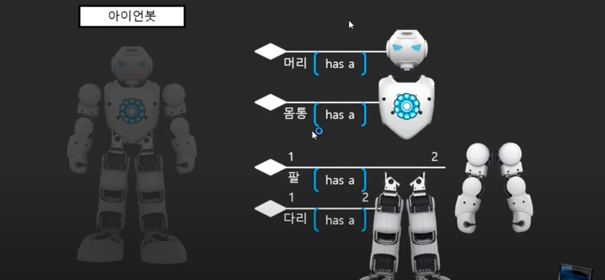
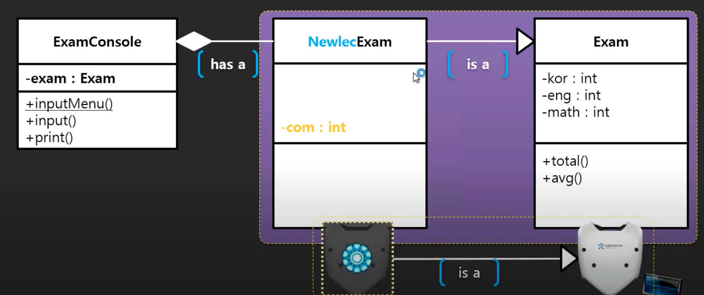

# 객체지향 프로그램(OOP-Object Oriented Programming)


## 13. 코드 재사용이란?

### 성적관리 프로그램의 새롣운 버전을 만들자


- 구성은 비슷함
- 전에 했던 것을 재사용해서 만들어보자


- 이 부분을 재사용할 것

### 코드 재사용

- 재사용이란 소스 코드를 재사용하는 것을 의미하는 것이 아니라, 배포된 바이너리 코드를 재사용하는 것을 의미함
- 배포된 코드를 재사용하는 방법을 익혀보는 것이 목표임
- 전에 만들었던 결과물을 바이너리 배포 코드로 만들어서 새로운 프로젝트에서 재사용하는 것을 연습해보자


### 베포 과정

1. 컴파일 -> Exam.class
2. 압축 -> Exam.zip
3. jar로 확장자 변경 -> Exam.jar

- 수작업으로 하면 이런 방식으로 해야됨
- 이클립스는 배포해주는 기능을 가지고 있음

### 배포한 클래스 파일 import로 사용하기

```java
import Part3.ex4.UI코드분리하기.Exam;

public class Program {

	public static void main(String[] args) {
		Exam exam = new Exam(1, 1, 1);
		
		System.out.println(exam.total());
	}
}
```


## 14. Is A 상속이란?

- 객체지향을 지원하는 플랫폼 또는 언어에서는 반드시 알고 있어야되는 부분임

- 객체지향의 3대 덕목

  - 1. 캡슐화

  - 2. 상속

    - Has A 상속을 이야기할 수도 있지만, 일반적으로는 Is A 상속을 의미함

  - 3. 다형성

- 여기서는 2번째 덕목인 상속을 알아보자

### Has A 상속만으로 만들기



- 구성품들이 모두 존재한다면 Has A 상속만으로도 완성할 수 있음


- 몸통은 없지만 비슷한 틀이 존재함, 거기에 조금만 더해서 몸통을 만들 수 있을 듯?
  - 사용하는 것은 맞음, 상속임
  - 그런데 구성품은 아니고, 구성품의 틀로써 역할을 하게 됨
  - 이런 경우를 Is A 상속이라고 함


- 아이언봇과 거의 흡사한 로보트 틀이 있음
  - Is A 상속임
  - 유사도가 비슷할수록 생산성이 올라감
  - 프레임워크가 이렇게 생산성을 극대화하기 위해 만들어진 것이라고 할 수 있음
- 요새는 프레임워크를 사용하면서 일부분만을 차별화하는 방식이 많이 사용된다


## 15. Exam을 Is A 상속하기

### Exam을 is a 상속하는 NewlecExam 클래스 구현

#### 컴퓨터 과목을 추가해야함

- 새로운 클래스 NewlecExam을 만들어야 됨
  - Exam을 상속한 후, com 과목 추가하는 과정 필요




### 두 클래스의 명칭


- 문제가 발생

```java
import Part3.ex4.UI코드분리하기.Exam;

public class Program {

	public static void main(String[] args) {
		NewlecExam exam = new NewlecExam();
		exam.setKor(10);
		exam.setEng(10);
		exam.setMath(10);
		exam.setCom(10);
		
		System.out.println(exam.total());

	}

}
```

```java
import Part3.ex4.UI코드분리하기.Exam;

public class NewlecExam extends Exam {
	
	private int com;
	
	public int getCom() {
		return com;
	}

	public void setCom(int com) {
		this.com = com;
	}
	
	

}

```

- total값이 30이 나옴
  - 오버라이딩이 필요함


## 16. Override(우선순위가 높은) 메소드

### NewlecExam 객체 사용하기


- 상속받은 객체를 만들면 부모 객체도 같이 만들어진다고 할 수 있음
- 자식 클래스에 오버라이드 메소드가 없다면 부모 클래스의 메소드가 호출됨
- 우선순위는 자식의 메소드가 높지만, 없다면 차선책으로 부모의 메소드가 호출되는 것

### 수정해야 할 코드를 재정의(override)


```java
import Part3.ex4.UI코드분리하기.Exam;

public class NewlecExam extends Exam {
	
	private int com;
	
	public int getCom() {
		return com;
	}

	public void setCom(int com) {
		this.com = com;
	}

	@Override
	public int total() {
		
		return super.total()+com;
	}

	@Override
	public float avg() {
		
		return total()/4.0f;
	}
	

}

```


## 17. 자식 클래스의 객체 초기화

### 부모를 가지는 클래스는 두 개의 객체를 생성한다.

- NewlecExam 객체를 만들면, 골격에 해당되는 Exam 객체(super)가 먼저 만들어지고, 그 위로 NewlecExam 객체(this)가 생성됨

```java
import Part3.ex4.UI코드분리하기.Exam;

public class NewlecExam extends Exam {
	
	private int com;
	
	public NewlecExam() {
		this(0, 0, 0, 0);
	}
	// super를 통해서 부모의 생성자를 호출, 이어서 com에 값을 넣어줌
	public NewlecExam(int kor, int eng, int math, int com) {
		super(kor, eng, math);
		this.com = com;
	}
	
	public int getCom() {
		return com;
	}

	public void setCom(int com) {
		this.com = com;
	}

	@Override
	public int total() {
		
		return super.total()+com;
	}

	@Override
	public float avg() {
		
		return total()/4.0f;
	}
}

```


## 18. 참조형식과 호출되는 메소드의 관계


## 참고

- 유튜브 채널 - 뉴렉처
- https://www.youtube.com/user/newlec1/playlists
  - 자바 프로그래밍 강의 강좌


