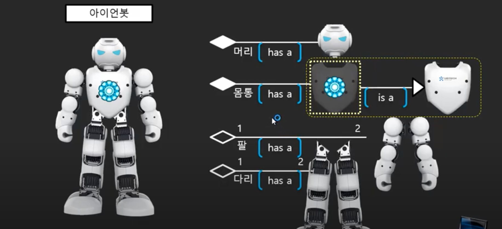

# 객체지향 프로그램(OOP-Object Oriented Programming)


## 13. 코드 재사용이란?

### 성적관리 프로그램의 새로운 버전을 만들자


- 구성은 비슷함
- 전에 했던 것을 재사용해서 만들어보자


- 이 부분을 재사용할 것

### 코드 재사용

- 재사용이란 소스 코드를 재사용하는 것을 의미하는 것이 아니라, 배포된 바이너리 코드를 재사용하는 것을 의미함
- 배포된 코드를 재사용하는 방법을 익혀보는 것이 목표임
- 전에 만들었던 결과물을 바이너리 배포 코드로 만들어서 새로운 프로젝트에서 재사용하는 것을 연습해보자


### 배포 과정

1. 컴파일 -> Exam.class
2. 압축 -> Exam.zip
3. jar로 확장자 변경 -> Exam.jar

- 수작업으로 하면 이런 방식으로 해야됨
- 이클립스는 배포해주는 기능을 가지고 있음

### 배포한 클래스 파일 import로 사용하기

```java
import Part3.ex4.UI코드분리하기.Exam;

public class Program {

	public static void main(String[] args) {
		Exam exam = new Exam(1, 1, 1);
		
		System.out.println(exam.total());
	}
}
```


## 14. Is A 상속이란?

- 객체지향을 지원하는 플랫폼 또는 언어에서는 반드시 알고 있어야되는 부분임

- 객체지향의 3대 덕목

  - 1. 캡슐화

  - 2. 상속

    - Has A 상속을 이야기할 수도 있지만, 일반적으로는 Is A 상속을 의미함

  - 3. 다형성

- 여기서는 2번째 덕목인 상속을 알아보자

### Has A 상속만으로 만들기


- 구성품들이 모두 존재한다면 Has A 상속만으로도 완성할 수 있음



- 몸통은 없지만 비슷한 틀이 존재함, 거기에 조금만 더해서 몸통을 만들 수 있을 듯?
  - 사용하는 것은 맞음, 상속임
  - 그런데 구성품은 아니고, 구성품의 틀로써 역할을 하게 됨
  - 이런 경우를 Is A 상속이라고 함


- 아이언봇과 거의 흡사한 로보트 틀이 있음
  - Is A 상속임
  - 유사도가 비슷할수록 생산성이 올라감
  - 프레임워크가 이렇게 생산성을 극대화하기 위해 만들어진 것이라고 할 수 있음
- 요새는 프레임워크를 사용하면서 일부분만을 차별화하는 방식이 많이 사용된다


## 15. Exam을 Is A 상속하기

### Exam을 is a 상속하는 NewlecExam 클래스 구현

#### 컴퓨터 과목을 추가해야함

- 새로운 클래스 NewlecExam을 만들어야 됨
  - Exam을 상속한 후, com 과목 추가하는 과정 필요


### 두 클래스의 명칭


- 문제가 발생

```java
import Part3.ex4.UI코드분리하기.Exam;

public class Program {

	public static void main(String[] args) {
		NewlecExam exam = new NewlecExam();
		exam.setKor(10);
		exam.setEng(10);
		exam.setMath(10);
		exam.setCom(10);
		
		System.out.println(exam.total());

	}

}
```

```java
import Part3.ex4.UI코드분리하기.Exam;

public class NewlecExam extends Exam {
	
	private int com;
	
	public int getCom() {
		return com;
	}

	public void setCom(int com) {
		this.com = com;
	}
	
	

}

```

- total값이 30이 나옴
  - 오버라이딩이 필요함


## 16. Override(우선순위가 높은) 메소드

### NewlecExam 객체 사용하기


- 상속받은 객체를 만들면 부모 객체도 같이 만들어진다고 할 수 있음
- 자식 클래스에 오버라이드 메소드가 없다면 부모 클래스의 메소드가 호출됨
- 우선순위는 자식의 메소드가 높지만, 없다면 차선책으로 부모의 메소드가 호출되는 것

### 수정해야 할 코드를 재정의(override)


```java
import Part3.ex4.UI코드분리하기.Exam;

public class NewlecExam extends Exam {
	
	private int com;
	
	public int getCom() {
		return com;
	}

	public void setCom(int com) {
		this.com = com;
	}

	@Override
	public int total() {
		
		return super.total()+com;
	}

	@Override
	public float avg() {
		
		return total()/4.0f;
	}
	

}

```


## 17. 자식 클래스의 객체 초기화

### 부모를 가지는 클래스는 두 개의 객체를 생성한다.

- NewlecExam 객체를 만들면, 골격에 해당되는 Exam 객체(super)가 먼저 만들어지고, 그 위로 NewlecExam 객체(this)가 생성됨

```java
import Part3.ex4.UI코드분리하기.Exam;

public class NewlecExam extends Exam {
	
	private int com;
	
	public NewlecExam() {
		this(0, 0, 0, 0);
	}
	// super를 통해서 부모의 생성자를 호출, 이어서 com에 값을 넣어줌
	public NewlecExam(int kor, int eng, int math, int com) {
    // 부모 객체는 부모의 기능으로 초기화
		super(kor, eng, math);
		this.com = com;
	}
	
	public int getCom() {
		return com;
	}

	public void setCom(int com) {
		this.com = com;
	}

	@Override
	public int total() {
		
		return super.total()+com;
	}

	@Override
	public float avg() {
		
		return total()/4.0f;
	}
}

```


## 18. 참조형식과 호출되는 메소드의 관계

### 객체와 참조 형식의 개수


- NewlecExam은 Exam을 Is A 상속하고 있음
- NewlecExam은 자식 클래스, Exam은 부모 클래스
- Exam exam = new Exam();
  - 참조 형식과 객체 타입이 일치하므로 가능
- NewlecExam exam = new NewlecExam();
  - 참조 형식과 객체 타입이 일치하므로 가능
- Exam exam = new NewlecExam();
  - NewlecExam 객체 안에는 Exam 객체가 있음
  - 참조 가능
- NewlecExam exam = new Exam();
  - Exam 객체만으로는 NewlecExam객체를 대신할 수 없음
  - 참조 불가능
- 결론적으로, NewlecExam 객체는 참조형식이 두개임

### 형식에 따른 재정의 함수 호출 관계


- 자바의 경우, 참조 형식에 따라서 메소드가 있는지 확인하고 있다면, 객체 형식에 맞는 오버라이드된 메소드를 호출함(만약 오버라이드가 안되있다면 그냥 부모의 메소드 호출)


- 참조 형식에 있는 메소드를 봤더니, 존재하지가 않음.. 그러면 오류가 발생함(객체 형식이랑 상관없음)


- 이 상태에는 둘 다 Exam의 메소드를 호출하게 됨
- 결론적으로, 참조 형식에 따라서 볼 수 있는, 호출 할 수 있는 함수가 결정되고, 객체 형식에 따라서 오버라이드한게 있으면 그게 먼저 호출됨


## 19. 참조형식과 호출되는 메소드의 관계2

### 메소드의 관계 연습하기

- 참조 형식에 따라서 사용할 수 있는 메소드가 결정됨
  - B 타입은 f1~f7까지를 사용할 수 있음
  - A 타입은 f1~f5까지를 사용할 수 있음
- 객체 타입에 따라서 오버라이드된 함수를 사용할 수 있음

### 연습문제1


- b.f6();
  - b의 참조형식은 B, 객체 타입은 B
  - B클래스의 f6()을 호출하게 됨
- a.f6();
  - a의 참조형식은 A, 객체 타입은 B
  - A클래스를 보니 f6이 없음, 오류가 뜸
- ((B)a).f6();
  - a의 참조 형식을 B로 변경함, 객체 타입은 B
  - b.f6();랑 똑같이 호출함
- a.f2();
  - a의 참조형식은 A, 객체 타입은 B
  - 따로 오버라이드된 메소드가 없기 때문에, A 클래스의 f2를 호출
  - f2는 f3를 호출하는데 오버라이드된 f3가 존재하기 때문에 B클래스의 f3를 호출하게 됨
- b.f2();
  - a.f2(); 와 똑같이 호출함
- a.f4();
  - A 클래스의 f4호출
  - B 클래스의 f5호출
  - A 클래스의 f4호출
  - ...
  - (무한루프)
- b.f4();
  - a.f4();와 똑같음

### 연습문제 2


- a.f4();
  - B클래스의 f4 호출
  - super를 통해서 부모 클래스(A)의 f4 호출
  - A클래스의 f5 호출
  - A클래스의 f2 호출
  - B클래스의 f3 호출


## 20. Is A 상속 쉬어가기

### 윈도우

- 좌표 시스템
  - 옛날에는 콘솔 형태의 프로그램, 문자로만 하다가 2차배열로 그림을 그리는 형태로 발전됨
  - 점이나 선 등 도형을 그릴 수 있는 라이브러리가 생김
- 초기 윈도우 시스템
  - 화면의 밀도가 높아짐
- 최근 윈도우 시스템
  - 프레임이 있는 윈도우도 생김
  - 그 위에 프로그램을 띄우는 형식
  - 이런 윈도우를 만들기 위해서는 다양한 코드가 들어가야 됨
  - 자바에서는 윈도우 프레임의 라이브러리를 제공해줌
- 자바 윈도우 API의 변화
  - AWT > Swing > Fx
  - 여기서는  AWT를 사용해보자
- Program
  - Frame을 상속하는 GameFrame을 객체화해서 그림을 그려보자

```java
import java.awt.Frame;

public class Program {

	public static void main(String[] args) {
		GameFrame frame = new GameFrame();
		frame.setVisible(true);
		
	}

}

```

- GameFrame
  - Frame 상속
  - paint 오버라이딩
  - drawRect 메소드로 사각형 그리기

```java
import java.awt.Frame;
import java.awt.Graphics;

public class GameFrame extends Frame {
	@Override
	public void paint(Graphics g) {
		super.paint(g);
		
		g.drawRect(100, 100, 200, 200);
	}
}

```

- 이런식으로 외부 라이브러리를 사용할 수 있으려면 개념을 잘 익혀야됨


## 21. 메소드 동적 바인딩(함수 호출 위치 결정 방식 이해하기)

### 호출 되는 함수의 위치 결정문제


- 원래 컴파일러가 함수 호출 부분의 코드를 해석할 때, 그 함수의 주소를 통해서 갈 수 있음
- 그런데 이 함수가 어떤 객체의 함수인지에 따라서 그 주소가 달라짐


- C++이라면
  - 컴파일러가 컴파일 시점에 결정
  - 참조형식을 보고 객체의 함수의 주소를 적어줌
  - 어셈블러가 jump 2A3F로 바꿔줌
  - 컴파일러가 결국 결정하는 방식, 주소가 변경되지 않음, 정적 바인딩


- JAVA의 경우
  - 컴파일러가 저 부분에 주소를 딱 박아서 적어놓지 않음
  - 객체가 뭐냐에 따라서 호출하는 함수가 달라지기 때문에 주소도 바뀌어야됨
  - 결국 실행되어봐야 알 수 있음
  - 실행 중에 함수의 위치가 결정되는 것, 동적 바인딩
  - 클래스가 두개라면 각각의 메소드에 대한 주소 목록을 준비해둠
  - 컴파일러는 결정하지 않고 주소가 들어가는 부분은 비워둠
  - 객체 전달 시점에 결정
  - 객체는 데이터를 담는 공간 이외에 추가적으로 4바이트를 더 갖음
    - 함수 주소를 담는 공간
  - 그래서 비워둔 자리에 객체 가지고 있는 함수들의 주소번지가 들어감


## 22. 코드 집중화와 추상화

### 코드 집중화

- 코드 집중화와 재사용은 다른 것
  - 이전 제품으로 만들었던 것을 다시 사용하는 거라면 재사용
  - 같은 제품을 만드는 과정에서, 같은 코드를 여기저기서 사용할 때 한쪽으로 몰아두고 가져다 쓰는식이면 집중화


- 함수들의 일부 구간이 동일한 코드가 필요하면 그 부분을 따로 떼어내서 함수로 만들고 호출해서 사용하는 식 = 코드 집중화

### 추상화: 코드 집중화(X) => 서비스 집중화(캡슐 단위의 공통 서비스)

- 집중화는 집중환데, 캡슐 단위의(서비스의) 집중화
- 각 캡슐들의 공통부분들이 있음
  - 원, 세모, 네모 => 도형
  - 세단, 승합, 스포츠카 => 자동차
- 공통분모를 클래스로 만들고 Is A 상속을 받음
- 여기서의 공통분모는 개체분석을 통해서 나온 것이 아니라 공통분모로써 일반화를 통해 나온 것
  - 그래서 추상클래스라고 함


### 추상 클래스를 만드는 상황 1

#### 개체들의 공통서비스를 집중화

- Circle, Rect, Line => Shape

#### 공통 서비스화로 얻을 수 있는 장점

- 코드 집중화와 같은 효과를 볼 수 있음
- 일괄 처리
  - 만약 일괄적으로 배열에 담으려고 한다면, 추상클래스가 없다면 한번에 배열에 넣을 수 있을까?(Object 타입은 일단 제외)
    - No, 추상클래스를 통해 배열로 만들면 일괄처리를 할 수 있음


### 추상 클래스를 만드는 상황 2

#### 향후 제품을 위한 프레임워크

- NewlecExam => Exam
- YBM에서 연락이 옴
- NewlecExam, YBMExam ... => Exam
- 솔루션을 팔아라고 제안이옴,, 공통분모를 팔아야되는데 문제가 발생함
- 아직 공통분모화가 안됐음
  - 아직은 추상화가 안됐고, 가져다 쓰고 있는 상황
  - 이를 완전히 추상화시켜야 됨 


## 23. 추상 클래스 만들기(Exam 클래스의 추상화)

### 공통 클래스의 종류

- 추상화는 공통분모화라고 할 수 있음
- 추상 클래스는 공통 클래스임
- 코드 집중화는 아니지만, 역할 집중화라고 할 수 있음


- 공통 부분이 그 자체로도 하나의 개체로 사용될 필요가 있다면 공통분모화, 추상화는 할 필요가 없음, 추상 클래스가 될 필요가 없음
- 객체화하지 않고 그냥 공통분모로만 사용한다면, 뼈대로만 사용한다면 추상화하는 것
- Shape, Exam은 뼈대로만 사용될 것임 => 추상화(실체화하지 않을 것)

### 앞으로 계속 만들게 될 Exam 개체들... 을 위한 추상화

#### 매번 새로 만들 것인가? 아니면 Exam을 틀로 사용할 것인가?

- 틀로 사용하자
- 생산성이 높아지니까


### 추상화를 위한 과제(앞으로 확장될 부분을 확인하고 자식에게 위임하기)

- 뼈대로 만들기 1
  - Exam이 뼈대로만 사용할 수 있도록 만든다
  - 즉, 객체화 되는 것을 막는다
  - new Exam(); 를 못하게 하자
  - 클래스 이름 앞에 abastract를 붙여씀

### OOPJavaPrj의 Part3.ex5.추상화와 OOPJavaPrj2의 Part3.ex5.추상화를 사용

- OOPJavaPrj의 Part3.ex5.추상화
  - Exam을 추상화
  - public abstract class Exam {}
- OOPJavaPrj2의 Part3.ex5.추상화
  - 여기서 Exam을 사용함
  - NewlecExam클래스에서 Exam 상속


## 24. 추상 메소드(Abstract Method)

### 추상 클래스는 공통 자료형이다


- move()
  - 각 도형에서 기능이 똑같음
- paint()
  - 각 도형에서 그리는 방식이 다름
  - 그런데 또 일괄처리를 할려면 있어야됨
  - 기능은 구현하지말고 그냥 뼈대만 올려두면 어떨까? => 추상메소드


- 각 도형의 클래스에서 오버라이드해서 기능을 구현하자

### 추상화 메소드란? 공통으로 제공되어야 할 서비스

- 이 경우는 위의 예시랑 차이가 있음
- 위의 예시는 도형을 일괄적으로 그릴 수 있어야하기 때문에 paint가 추상메소드로 들어감
- 여기서는 ExamConsole을 사용해서  print 기능을 구현하려면 거기서 사용할 수 있도록 total, avg, getters/setters 등을 뼈대만이라도 올려둬야함
- ExamConsole이 앞으로 생성될 다른 것들에서도 기능을 하려면 Exam에서 공통기능으로써 뼈대만이라도 올려둬야됨
- 실제 기능 구현은 각 클래스에서 오버라이드해서 구현


## 25. 추상 메소드 구현하기(Abstract Method)

### 앞으로 계속 만들게 될 Exam 개체들... 을 위한 추상화

#### 추상화를 위한 과제(앞으로 확장될 부분을 확인하고 자식에게 위임하기)

- 뼈대로 만들기 2
  - 공통 기능인데 내가 구현할 수 없는 상황
  - 그것을 자식이 책임지도록 만든다
  - abstract method ...


- 추상메소드는 공통 서비스 함수
  - 구현이 공통이 아니고, 서비스의 목록을 의미

- Exam

```java
package Part3.ex5.추상화;

public abstract class Exam {
	int kor;
	int eng;
	int math;
	
	public Exam() {
		this(0, 0, 0);
	}
	
	public Exam(int kor, int eng, int math) {
		this.kor = kor;
		this.eng = eng;
		this.math = math;
	}
	public int getKor() {
		return kor;
	}
	public void setKor(int kor) {
		this.kor = kor;
	}
	public int getEng() {
		return eng;
	}
	public void setEng(int eng) {
		this.eng = eng;
	}
	public int getMath() {
		return math;
	}
	public void setMath(int math) {
		this.math = math;
	}
	public abstract int total();
	
  // 자식 클래스에게만 공개되는 메소드
	protected int onTotal() {
		return kor + eng + math;
	}
	
	public abstract float avg();
	
	
}

```

- NewlecExam

```java
package Part3.ex5.추상화;

public class NewlecExam extends Exam {
	
	private int com;
	
	public NewlecExam() {
		this(0, 0, 0, 0);
	}
	
	public NewlecExam(int kor, int eng, int math, int com) {
		super(kor, eng, math);
		this.com = com;
	}


	public int getCom() {
		return com;
	}

	public void setCom(int com) {
		this.com = com;
	}

	@Override
	public int total() {
		int total = onTotal() + com;
		
 		return total;
	}

	@Override
	public float avg() {
		
		return total()/4.0f;
	}
	
	
}

```


## 참고

- 유튜브 채널 - 뉴렉처
- https://www.youtube.com/user/newlec1/playlists
  - 자바 프로그래밍 강의 강좌


