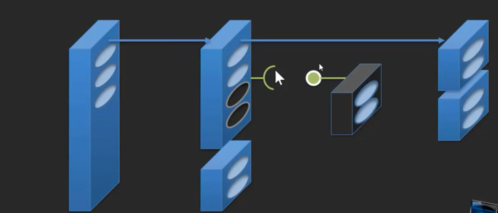

# 객체지향 프로그램(OOP-Object Oriented Programming)


## 26. 팩토리 메소드(Factory Method)	

- 추상메소드가 쓰이는 곳이 좀 있음
- 그 자체로 쓰인다기보다는 패턴이나 형태로 쓰임
  - 대표적인 패턴이 팩토리 메소드

### 지금은 결정할 수 없는 코드...

- 추상클래스 Exam, 그 안에 있는 추상메소드 total, avg
- 추상클래스를 만든다는 것, 추상화를 한다는  == 공통화 작업을 하는 것
- 앞으로 여러개의 Exam 클래스가 만들어질텐데.. 이들의 공통부분을 모아두는 작업이 바로 추상화임
- 그런데 total이나 avg는 공통으로 같은 구현로직을 가지진 않지만, 추상클래스는 공통 자료형이라는 의미가 있기 때문에 모든 Exam을 일괄적으로 관리하겠다는 것을 생각하면(total과 avg가 일괄 서비스로 제공될 것이 확실하다면) 구현은 공통이 아니더라도 서비스 항목으로는 공통자료형에 들어가는 것이 맞다 
- 그런데 이렇게 Exam을 추상클래스로 만들었더니 문제가 생김
  - ExamConsole에서 문제가 생김
  - Exam객체를 생성하려고 하기 때문에
  - Exam객체가 아니라 새로 만들고자하는 Exam(예를 들면 YBMExam)을 객체로해서 사용해야됨
  - 이를 해결하기 위해서는 두가지 방식이 존재
    - 첫번째, YBMExam을 만드는 프로젝트에서 ExamConsole 소스코드를 가져와서 오류부분만 수정해서 쓴다
    - 두번째, 소스코드를 가지고오는게 아니라 바이너리로 만들어두고 대신 저부분만 고칠 수 있는 방법을 제공해준다
  - 소스코드없이 재사용할 수 있는 두번째 방식이 더 바람직
  - 그럼 어떻게 할 수 있나?? >> 해결방법이 나왔음 >> 이런일이 자주 발생하니까 이런 해결방법을 패턴화했 >> 디자인패턴이라고 표현


- 어떻게 소스코드없이 바꿔치기 할 것인가?
  - 앞으로 태어날 새로운 Exam(ExamConsole가 사용해야되는 것)에서 책임을 지는 방식으로 만들자
  -  ExamConsole를 확장을 해서 저 부분을 고칠 수 있도록 추상메소드를 제공하자
  - ExamConsole이 추상 클래스가 됨


- 이렇게 객체를 생성하는 부분을 자식에게 위임하는 패턴 == 팩토리 메소드 패턴


## 27. 팩토리 메소드 구현하기

### Exam을 이용하는 ExamConsole 클래스 추상화

- 새로운 클래스(NewlecExamConsole)을 만들고 추상클래스(ExamConsole)에게 객체를 전달해줄 수 있도록 추상 메소드의 구현부분을 완성하자

- ExamConsole

```java
package Part3.ex5.추상화;

import java.util.Scanner;

public abstract class ExamConsole {
	
	private ExamList list = new ExamList();
	
	public void input() {
        
    //	makeExam를 통해 전달받은 객체를 사용
        Exam exam = makeExam();
    //  객체를 전달받고 사용하기 때문에 생성자를 통한 초기화가 불가능, 직접 넣어줘야됨
        exam.setKor(kor);
        exam.setEng(eng);
        exam.setMath(math);
        list.add(exam);
        
	}
	// 자식클래스에서 객체를 전달해줄 기능을 구현하기 위한 추상메소드
	protected abstract Exam makeExam();

	public void print() {
		print(list.size());
	}
	
	public void print(int size) {
		
	}

}

```

- NewlecExamConsole

```java
package Part3.ex5.추상화;
// 추상클래스를 상속받음
public class NewlecExamConsole extends ExamConsole{

	@Override
	protected Exam makeExam() {
		// 객체를 생성해서 반환
		return new NewlecExam();
	}
}
```

- Program

```java
package Part3.ex5.추상화;

public class Program {

	public static void main(String[] args) {
    
		ExamConsole console = new NewlecExamConsole();
		console.input(); // 1, 1, 1
		console.print(); // 0.75
		
	}

}

```

- 결과가 이상함
- ExamConsole에서 com 값을 입력하지 않기 때문에 com이 0으로 초기화됨
- NewlecExamConsole에서 오버라이딩하면 안되나??
  - 그렇게하게 되면 ExamConsole이 존재하는 의미가 없게 됨
  - 그냥 새롭게 만드는 것과 다를게 없음


## 28. 이벤트 메소드 구현하기

### 앞으로 계속 만들게 될 ExamConsole 개체들을 위한 추상화

- 확장성을 고려한 input 함수를 만들자


- ExamConsole

```java
package Part3.ex5.추상화;

import java.util.Scanner;

public abstract class ExamConsole {
	
	private ExamList list = new ExamList();
	public void input() {
        Exam exam = makeExam();
        exam.setKor(kor);
        exam.setEng(eng);
        exam.setMath(math);
    //	exam 객체를 넘겨줌
        onInput(exam);
    
        list.add(exam);
        
	}
	
  // 확장을 위한 추상메소드
	protected abstract void onInput(Exam exam);
	protected abstract void onPrint(Exam exam);

	protected abstract Exam makeExam();

	public void print() {
		print(list.size());
	}
	
	public void print(int size) {
		
        for(int i=0; i<size; i++) {
	        Exam exam = list.get(i); // this.exams[i];
	        int kor = exam.getKor(); // exam.kor;
	        int eng = exam.getEng(); //exam.eng;
	        int math = exam.getMath(); //exam.math;
	        
	        int total = exam.total(); // kor+eng+math;
	        float avg = exam.avg(); // total/3.0f;
	        
	        System.out.printf("국어 : %d\n", kor);
	        System.out.printf("영어 : %d\n", eng);
	        System.out.printf("수학 : %d\n", math);
          
	        //	exam 객체를 넘겨줌
	        onPrint(exam);
	        
	        System.out.printf("총점 : %3d\n", total);
          System.out.printf("평균 : %6.2f\n", avg);
          System.out.println("|---------------------|");
        }
	}
}

```

- NewlecExamConsole

```java
package Part3.ex5.추상화;

import java.util.Scanner;

public class NewlecExamConsole extends ExamConsole{

	@Override
	protected Exam makeExam() {
		
		return new NewlecExam();
	}

  // exam 객체를 넘겨받고 형변환을 해줌
  // setCom()을 사용하기 위해서
  // 객체에 입력받은 com 값을 입력
	@Override
	protected void onInput(Exam exam) {
		NewlecExam newlecExam = (NewlecExam)exam;
		
		Scanner scan = new Scanner(System.in);
		int com;
		
		do {
        	System.out.printf("컴퓨터 : ");
        	com = scan.nextInt();
        
	        if(com < 0 || 100 < com)
	        	System.out.println("out of scope 0~100");
	        
        }while(com < 0 || 100 < com);
		
		newlecExam.setCom(com);
		
	}

  // exam 객체를 넘겨받고 형변환을 해줌
  // getCom()을 사용하기 위해서
  // 객체의 com 값을 출력
	@Override
	protected void onPrint(Exam exam) {
		NewlecExam newlecExam = (NewlecExam)exam;
		int com = newlecExam.getCom();
		System.out.printf("컴퓨터 : %d\n", com);
		
	}

}

```


## 29. 코드 분리와 인터페이스

- 일반적으로 인터페이스 용어를 추상클래스보다 더욱 더 추상화된 것이다?
- 이렇게 이해하는데 조금 잘못된 것
- 추상화는 집중화를 의미하는 것, 코드를 집중화하거나 데이터가 집중화되거나..
- 인터페이스는 집중화가 아님
- 인터페이스는 무엇인가?
  - 인터페이스를 고민하는 시점에는 반드시 코드 분리가 있다
  - 코드 분리를 하기 위해서 어쩔수없이 하는 것이 인터페이스이다
  - 집중화에 연관시켜서 비교하는 것은 근시야적인 것
  - 실제로는 인터페이스는 분리라는 것과 연관되어있음
- 인터페이스란?
  - 어떤 것, 어떤 장소, 어떤 시간, 일반적으로는 접근할 수 없는 상황에서 접근할 수 있게 도와주는 도구, 방법을 인터페이스라고 함
  - 분리되어있는 것에 닿을 수 있는 접점이 인터페이스임
  - 자바에서도 분리된 것에 접근할 수 있는 도구(인터페이스)가 필요함

### 여러가지 이유로 밧데리 분리를 고민하게 될 수 있다

- 밧데리는 다른 업체들이?
- 밧데리를 교체형으로 만들까?
- 폰은 다양하지만 밧데리를 표준으로 만들까?
- 모듈별로 별도 업데이트?
- ...


### 부품의 분리를 생각할 때는 일단 약속된 인터페이스로 제품을 만든다

- 핸드폰에서 이 부품(배터리)에게 요구하는 약속된 목록이 있음
- 요구 목록들을 인터페이스로 정의
- 실제 사용할 배터리(NewlecBattery)는 이 목록(Battery)을 인터페이스 상속(implements)해서 사용할 수 있음


- 실제 배터리(NewlecBattery)를 객체화해서 휴대폰에 꽂아서 사용하게 됨


- setBattery()를 통해서 객체화된 배터리를 꽂아넣음
- 결론적으로 인터페이스는 분리되어있는 것을 사용할 수 있도록 하는 약속이고 자바에서는 이런식으로 인터페이스를 구현하고 있음


## 30. 추상클래스와 인터페이스의 차이

### 공통분모: 추상 클래스? 인터페이스?

#### 개체들의 공통분모를 일반화한 이름

- 추상화
  - 집중화, 강제화 등을 통해 공통분모를 만들 수 있음 => 추상화
  - 추상클래스는 클라이언트가 주체라기 보다는 그 자체로써 의미가 있음
  - 도구(Exam들)가 먼저 존재하고 클라이언트가 어떤 것을 사용할 것인지 결정하는 것은 그다음


- 인터페이스
  - 추상화랑 반대
  - 클라이언트가 주체, FileSaver를 만들건데 이런 기능을 사용하고 싶으면 인터페이스로 정의해둔 약속에 따라서 만들어줘라
  - 인터페이스를 상속한 클래스들은 공통적인 특성을 가지지 않을수도 있음
  - 다만, 어떤 정해진 접근 방식(인터페이스)을 정해두고 그거에 맞춰서 코드를 짜면 그 기능을 구현할 수 있도록 만드는 것
  - 인터페이스대로 구현하면 다 꽂아서 쓸 수가 있음
  - 어떤 데이터를 넘겨줄지는 각 클래스에서 정하면 됨


- 각 클래스들은 여러개의 인터페이스를 구현해서 여러가지 클라이언트에 접근하고 기능을 만들 수 있음
  - 상속이라고 표현한다면 다중상속이라고 할 수 있긴 하지만, 상속의 의미를 생각해보면 좀 이상하긴함
  - 클래스 상속: 씨를 갖고 있는 족보체계에서 유전자를 가지고 있는 느낌
  - 인터페이스 상속: 유전자를 물려받았다기 보다는 필요에 의해 그때그때 사교적인 관계를 맺는 느낌


## 31. 객체 단위로 분리/결합을 위한 인터페이스 구현하기

### 코드 분리를 염두에 두지 않은 결합력이 강한 코드의 구조

#### 앞으로 어떤 부분도 대체하지 못하는 코드

- 아직 배터리가 완성이 안되어있어도 핸드폰은 배터리를 꽂을 수 있는 구성을 갖도록 만들어야함


### 개체 단위로 코드를 분리하는 경우

#### 앞으로 대체하기를 원하는 부분: 캡슐

- 도구를 꽂아서 사용할 수 있도록 만듬
- 인터페이스는 사용자 입장에서 정의, 구현은 도구쪽에서


#### 앞으로 대체하기를 원하는 부분: 일부 기능

- 메소드를 대체할 수 있도록



#### 앞으로 대체하기를 원하는 부분: 구현코드의 일부

- 메소드 내에서도 일부분을 대체할 수 있도록

  - 캡슐에 꽂을 수 있는 방식

    

  - 메소드의 매개변수로 꽂을 수 있는 방식

    

### 실습 코드 준비하기

- Program

```java
package Part3.ex6.인터페이스;

public class Program {

	public static void main(String[] args) {
		A a = new A();
		a.print();

	}

}

```

- A

```java
package Part3.ex6.인터페이스;

public class A {
	private B b;
	
	public A() {
		b = new B();
	}

	public void print() {
		int total = b.total();
		
		System.out.printf("total is %d\n", total);
	}
}

```

- B

```java
package Part3.ex6.인터페이스;

public class B {

	public int total() {
		
		return 30;
	}
}

```

- 현재는 결합력이 굉장히 강한 프로그램임
  - 결합력이 강하다는 것은 코드 수정을 통해서만 고칠 수 있는 것
  - 소수 코드 수정없이 변경할 수 있으면 결합력이 낮은 것


## 32. 개체 결합을 위한 인터페이스 구현하기


## 참고

- 유튜브 채널 - 뉴렉처
- https://www.youtube.com/user/newlec1/playlists
  - 자바 프로그래밍 강의 강좌


