# 구조적 프로그래밍


## 1. 프로그래밍과 프로그래밍 언어

### 동일한 프로그램이지만 방법을 달리 만들 수 있다.

- 자바 프로그래밍(절차지향) < 구조적인 프로그래밍 < 객체지향 프로그래밍
- 객체 지향으로 가기 전에 구조적 프로그래밍을 먼저 알아보자

### 구조적 프로그래밍이란?

- 프로그램의 크기가 커지면 단위별로 쪼개서 만든다
- 프로그래밍은 절차이다, 그 절차에 구조가 생긴다
- 절차를 자르는 도구로써의 함수
  - 함수가 가지는 능력: 코드를 잘라낼 수 있다
- 함수를 이용하면
  - 코드의 직접 사용을 차단할 수 있다
  - 코드를 작게 나누어서 만들 수 있다
  - 코드를 집중화할 수 있다
  - 코드를 재사용할 수 있다
- 자바로 함수를 정의하고 사용하는 방법

```java
// 함수 정의
static int power(int x) {
	return (x+3)*(x+3);
}

// 함수 사용
(power(7) + 3)*power(7);


// 반환 값이 없을 때 정의 방법
static void power(int x) {
	System.out.println((x+3)*(x+3));
}
```


## 2. 코드 구조화 Bottom Up 방식 연습1

- 절자적 프로그램을 쪼개서 구조적 프로그램을 만드는 방식: Bottom Up
- 처음부터 구조적 프로그램으로 설계하고 개발하는 방식: Top Down
- 여기서는 절차적인 프로그램을 짤라서 구조적 프로그램을 만들어보자

### 성정입력을 위한 코드를 새로운 함수에 담기

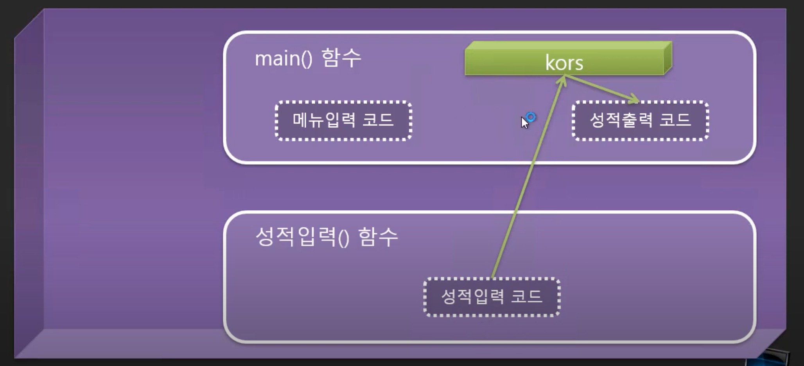

- 외부 함수에 접근 불가능
- 변수를 바깥으로 빼줘야됨

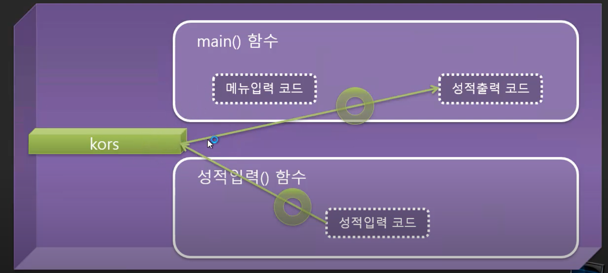

- 이렇게 하면 가능
- 전역 변수로 만들어서 접근할 수 있도록 만듬
- 좀 더 바람직한 방법이 있는데 그건 나중에..
- 전역변수가 되기 위해서는 static을 써야됨
  - 힘수 앞에 있는 static은 다른 의미
  - 함수 앞의 static은 이게 함수다 라고 하는 의미
  - 일반적인 메소드는 static을 뺌
- scanner는 전역으로 안함
  - 꼭 공유해야되는게 아니면 안하는게 좋음
  - 따로 써주자


## 3. 코드 구조화 Bottom Up 방식 연습2

```java
package Part2.ex1.성적입력부분나누기;

import java.util.Scanner;

public class StructuredProgram{
	
	static int[] kors = new int[3];
	
    public static void main(String[] args) {
    	
        int menu;
        boolean keepLoop = true;			
        
		while(keepLoop)
		{
			menu = 메뉴입력();
	        
	        switch(menu) {	        
	        case 1:
	        	성적입력();
		        break;
	        case 2:
		        성적출력();
		        break;
	        case 3:
	        	System.out.println("Bye~~");
	        	keepLoop = false;
				break;
	        default:
	        	System.out.println("1~3까지만 입력해주세요.");
	        }
		}
    }
    
    static int 메뉴입력() {
    	
    	Scanner scan = new Scanner(System.in);
    	
    	System.out.println("|---------------------|");
		System.out.println("|       Main menu     |");
		System.out.println("|---------------------|");
		System.out.println("\t1.성적 입력");
		System.out.println("\t2.성적 출력");
		System.out.println("\t3.종료");
		System.out.print("\t>");
        int menu = scan.nextInt();
        
        return menu;
    }
    
    static void 성적출력() {
    	
    	int total = 0;
        float avg;
        
    	for(int i=0; i<3; i++)
        	total += kors[i];
        
        avg = total / 3.0f;
        
        System.out.println("|---------------------|");
		System.out.println("|      Score out      |");
		System.out.println("|---------------------|");
        System.out.println();		        
       
        for(int i=0;i<3;i++)
        	System.out.printf("국어%d : %3d\n", i+1, kors[i]);    	
        	        
        System.out.printf("총점 : %3d\n", total);
		System.out.printf("평균 : %6.2f\n", avg);
		System.out.println("|---------------------|");
    }
    
    static void 성적입력() {
    	
    	Scanner scan = new Scanner(System.in);
    	
    	System.out.println("|---------------------|");
		System.out.println("|       Score in      |");
		System.out.println("|---------------------|");
        System.out.println();
       		        
        for(int i=0; i<3; i++)
	        do {
	        	System.out.printf("국어%d : ", i+1);
		        kors[i] = scan.nextInt();
	        
		        if(kors[i] < 0 || 100 < kors[i])
		        	System.out.println("out of scope 0~100");
		        
	        }while(kors[i] < 0 || 100 < kors[i]);
        
        System.out.println("|---------------------|");
    }
}
```


## 4. 매개변수를 이용한 함수 고립화

- 함수가 매개값을 하나도 안가지고 있었음
- 이는 함수가 외부의 변화에 영향을 받는다는 뜻임
  - 만약 누가 전역변수의 이름을 변경하면 이를 사용하던 함수들이 오작동하게 됨
- 독립적으로 고립시키는 게 좋음

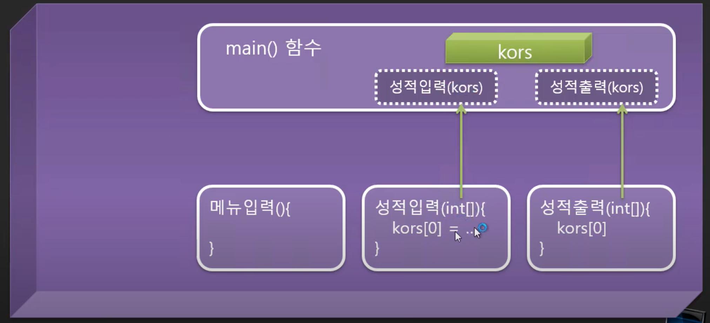


## 5. 함수 이름 짓기

- 숫자로 시작할 수 없다.
- 문자 사아에 빈 공백은 사용할 수 없다.
- 특수 문자는 사용할 수 없다.

### 예시 - 로또 생성 출력 정렬 프로그램

- 로또번호생성 => 생성로또번호 => genLotto()
- 로또번호출력 => 출력로또번호 => printLotto()
- 로또번호정렬 => 정렬로또번호 => sortLotto()

### 성적 출력 프로그램 리팩토링 결과

```java
package Part2.ex1.성적입력부분나누기;

import java.util.Scanner;

public class StructuredProgram{
	
    public static void main(String[] args) {
    	
    	int[] korList = new int[3];
        int menu;
        boolean keepLoop = true;			
        
		while(keepLoop)
		{
			menu = inputMenu();
	        
	        switch(menu) {	        
	        case 1:
	        	inputKors(korList);
		        break;
	        case 2:
		        printKors(korList);
		        break;
	        case 3:
	        	System.out.println("Bye~~");
	        	keepLoop = false;
				break;
	        default:
	        	System.out.println("1~3까지만 입력해주세요.");
	        }
		}
    }
    
    static int inputMenu() {
    	
    	Scanner scan = new Scanner(System.in);
    	
    	System.out.println("|---------------------|");
		System.out.println("|       Main menu     |");
		System.out.println("|---------------------|");
		System.out.println("\t1.성적 입력");
		System.out.println("\t2.성적 출력");
		System.out.println("\t3.종료");
		System.out.print("\t>");
        int menu = scan.nextInt();
        
        return menu;
    }
    
    static void printKors(int[] kors) {
    	
    	int total = 0;
        float avg;
        
    	for(int i=0; i<3; i++)
        	total += kors[i];
        
        avg = total / 3.0f;
        
        System.out.println("|---------------------|");
		System.out.println("|      Score out      |");
		System.out.println("|---------------------|");
        System.out.println();		        
       
        for(int i=0;i<3;i++)
        	System.out.printf("국어%d : %3d\n", i+1, kors[i]);    	
        	        
        System.out.printf("총점 : %3d\n", total);
		System.out.printf("평균 : %6.2f\n", avg);
		System.out.println("|---------------------|");
    }
    
    static void inputKors(int[] kors) {
    	
    	Scanner scan = new Scanner(System.in);
    	int kor;
    	
    	System.out.println("|---------------------|");
		System.out.println("|       Score in      |");
		System.out.println("|---------------------|");
        System.out.println();
       		        
        for(int i=0; i<3; i++) {
	        do {
	        	System.out.printf("국어%d : ", i+1);
		        kor = scan.nextInt();
	        
		        if(kor < 0 || 100 < kor)
		        	System.out.println("out of scope 0~100");
		        
	        }while(kor < 0 || 100 < kor);
	        
	        kors[i] = kor;
        }
        
        System.out.println("|---------------------|");
    }
}
```


## 6. Top Down 방식으로 구현하는 간단 예제

### 로또 프로그램 분석

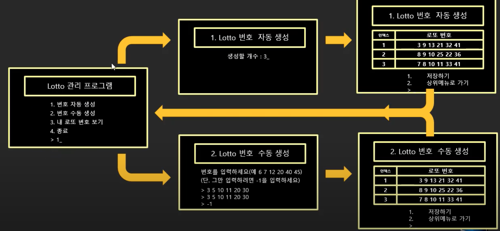

```java
package Part2.ex2.탑다운예제;

public class Program {

	public static void main(String[] args) {
		
		int[][] lottos = null;
		int menu;
		boolean running = true;
		
		while (running) {
			
			menu = inputMenu();
			
			switch(menu) {
			case 1:
				lottos = createLottosAuto();
				break;
			case 2:
				lottos = createLottosManual();
				break;
			case 3:
				printLottos(lottos);
				break;
			case 4:
				running = false;
				break;
			default:
				
			}
		}

	}

	private static void printLottos(int[][] lottos) {
		
		
	}

	private static int[][] createLottosManual() {
		
		return null;
	}

	private static int[][] createLottosAuto() {
		
		return null;
	}

	private static int inputMenu() {
		
		return 0;
	}

}
```


## 7. 함수의 매개변수

### 값에 대한 매개 변수

- 자료형 신경쓰기


## 8. 데이터 구조화1

```java
void drawEllipse(int x, int y, int w, int h, int color) {
  // 생략
}

// Ellipse?? 엔티티(Entity)를 정의할 수 있음(C언어에서는 Struct키워드로 구조체라는 걸 정의해서 사용했음, 자바에서는 클래스)
void draw(Ellipse ellipse) {
  // 생략
}
```

### 오목 게임 데이터와 엔티티(Entity)

- 오목 게임 데이터는?
  - 오목판(Board)
  - 오목(Omok)
  - 수행자(Player)

### 성적 관리를 위한 데이터 구조 정의와 선언 그리고 생성하기

```java
// 1. 데이터 구조 정의
public class Exam {
	int kor;
  int eng;
  int math;
}


public class Program{
    public static void main(String[] args) {
      // 2. 선언
      // int, char, boolean, float, double 등 값 변수를 제외한 모든 변수는 참조형 변수
      // 참조형 변수를 선언하면 처음에 null을 가리킴
      Exam exam;
      
      // 3. 객체 생성
      // 객체를 생성해야만 exam.kor, exam.eng, exam.math 등을 위한 공간이 마련됨
      exam = new Exam();
			// 이제 값을 저장할 수 있음
      exam.kor = 30;
      
    }
}
```


## 9. 데이터 구조화2

- 참조 변수는 참조형태로만 사용이 가능하다
  - 함수에 전달해도 결국 참조를 하기 때문에 그 공간은 공유가 됨

```java
package Part2.ex3.데이터구조화;

import java.util.Scanner;

public class ExamProgram{
	
    public static void main(String[] args) {
    	
    	Exam exam = new Exam();
    	
    	input(exam);
    	print(exam);

    }

	private static void print(Exam exam) {
		System.out.println("|---------------------|");
		System.out.println("|      Score out      |");
		System.out.println("|---------------------|");
        System.out.println();
        
        int kor = exam.kor;
        int eng = exam.eng;
        int math = exam.math;
        
        int total = kor+eng+math;
        float avg = total/3.0f;
        
        System.out.printf("국어 : %3d\n", kor);
        System.out.printf("영어 : %3d\n", eng);
        System.out.printf("수학 : %3d\n", math);
        
        System.out.printf("총점 : %3d\n", total);
		System.out.printf("평균 : %6.2f\n", avg);
		System.out.println("|---------------------|");
	}

	private static void input(Exam exam) {
		
		Scanner scan = new Scanner(System.in);
		
		System.out.println("|---------------------|");
		System.out.println("|       Score in      |");
		System.out.println("|---------------------|");
        System.out.println();
        
        int kor, eng, math;
        
        do {
        	System.out.printf("국어 : ");
	        kor = scan.nextInt();
        
	        if(kor < 0 || 100 < kor)
	        	System.out.println("out of scope 0~100");
	        
        }while(kor < 0 || 100 < kor);
        
        do {
        	System.out.printf("영어 : ");
        	eng = scan.nextInt();
        
	        if(eng < 0 || 100 < eng)
	        	System.out.println("out of scope 0~100");
	        
        }while(eng < 0 || 100 < eng);
        
        do {
        	System.out.printf("수학 : ");
        	math = scan.nextInt();
        
	        if(math < 0 || 100 < math)
	        	System.out.println("out of scope 0~100");
	        
        }while(math < 0 || 100 < math);
        
        exam.kor = kor;
        exam.eng = eng;
        exam.math = math;
		
	}
}
```


## 10. 구조체 배열

- 구조체??
  - 데이터를 구조화한 것
  - 자바에서는 클래스라고 하는 것이 데이터를 구조화할 뿐만 아니라 함수까지 포함하기도 함, 이 경우에는 캡슐(캡슐 도구)이라는 용도로 사용함
    - 이거는 객체제향에서 더 알아보고, 지금은 데이터만 구조화하는 구조체로써의 역할만 주고 해보자

### 배열을 이용해 여러 개의 성적을 입력 받기 위한 구조체 배열

```java
// 1
Exam exam = new Exam();

// 배열로 바꾸면
// 2
Exam[] exams = new Exam[3];

// 그런데 바로 이렇게 쓸 수 없음
// 3
exams[0].kor = 30;


// 1에서는 실제 exam이라는 공간이 만들어진거지만, 2에서는 Exam 타입의 배열이 만들어진 것
// 이렇게 실제 객체에 참조를 해줘야됨
exams[0] = new Exam();
exams[0].kor = 30;
```

- 클래스 배열은 객체 배열이 아니라 객체 참조배열이다

 ```java
Exam exam;
// exam 이라는 이름표 생성, 근데 null을 가리킴
// exam -> null

Exam exam = new Exam();
// 이름표를 실제 객체(공간)에 달아줌
// exam -> [kor][eng][math]

Exam[] exams;
// exams 이라는 이름표 생성, 아직 null을 가리킴
// exams -> null

Exam[] exams = new Exam[3];
// 이름표가 Exam 타입의 객체를 참조할 공간(아직은 참조안하고 있음, 각각 이름표만 있는 상태)을 참조함
// exams -> [exams[0]][exams[1]][exams[2]]
// exams[0] -> null
// exams[1] -> null
// exams[2] -> null

exams[0] = new Exam();
exams[1] = new Exam();
exams[2] = new Exam();
// 각 이름표들에 객체를 참조시킴
// exams[0] -> [kor][eng][math]
// exams[1] -> [kor][eng][math]
// exams[2] -> [kor][eng][math]

exams[0].kor = 30;
// exams 이름표가 달린 공간중에 첫번째칸에 있는 exmas[0]이라는 이름표가 가리키는 kor 공간에 30 값을 넣음
// exams[0] -> [30][0][0]
 ```

### 성적 출력 프로그램 리팩토링 결과

```java
package Part2.ex3.데이터구조화;

import java.util.Scanner;

public class Program {

	public static void main(String[] args) {
		
		Exam[] exams = new Exam[3];
		
		int menu;
        boolean keepLoop = true;			
        
		while(keepLoop)
		{
			menu = inputMenu();
	        
	        switch(menu) {	        
	        case 1:
	        	inputList(exams);
		        break;
	        case 2:
		        printList(exams);
		        break;
	        case 3:
	        	System.out.println("Bye~~");
	        	keepLoop = false;
				break;
	        default:
	        	System.out.println("1~3까지만 입력해주세요.");
	        }
		}

	}
	
	private static void printList(Exam[] exams) {
        System.out.println("|---------------------|");
        System.out.println("|      Score out      |");
        System.out.println("|---------------------|");
        System.out.println();
        
        for(int i=0; i<3; i++) {
	        Exam exam = exams[i];
	        int kor = exam.kor;
	        int eng = exam.eng;
	        int math = exam.math;
	        
	        int total = kor+eng+math;
	        float avg = total/3.0f;
	        
	        System.out.printf("국어 : %d\n", kor);
	        System.out.printf("영어 : %d\n", eng);
	        System.out.printf("수학 : %d\n", math);
	        
	        System.out.printf("총점 : %3d\n", total);
          System.out.printf("평균 : %6.2f\n", avg);
          System.out.println("|---------------------|");
        }
		
	}

	private static void inputList(Exam[] exams) {
		Scanner scan = new Scanner(System.in);
		
      System.out.println("|---------------------|");
      System.out.println("|       Score in      |");
      System.out.println("|---------------------|");
        System.out.println();
        
        for(int i=0; i<3; i++) {
	        int kor, eng, math;
	        
	        do {
	        	System.out.printf("국어 : ");
		        kor = scan.nextInt();
	        
		        if(kor < 0 || 100 < kor)
		        	System.out.println("out of scope 0~100");
		        
	        }while(kor < 0 || 100 < kor);
	        
	        do {
	        	System.out.printf("영어 : ");
	        	eng = scan.nextInt();
	        
		        if(eng < 0 || 100 < eng)
		        	System.out.println("out of scope 0~100");
		        
	        }while(eng < 0 || 100 < eng);
	        
	        do {
	        	System.out.printf("수학 : ");
	        	math = scan.nextInt();
	        
		        if(math < 0 || 100 < math)
		        	System.out.println("out of scope 0~100");
		        
	        }while(math < 0 || 100 < math);
	        
	        Exam exam = new Exam();
	        exam.kor = kor;
	        exam.eng = eng;
	        exam.math = math;
	        
	        exams[i] = exam;
        }
		
	}

	static int inputMenu() {
    	
    	Scanner scan = new Scanner(System.in);
    	
    	System.out.println("|---------------------|");
      System.out.println("|       Main menu     |");
      System.out.println("|---------------------|");
      System.out.println("\t1.성적 입력");
      System.out.println("\t2.성적 출력");
      System.out.println("\t3.종료");
      System.out.print("\t>");
        int menu = scan.nextInt();
        
        return menu;
    }

}

```


## 11. 가변 길이 배열

### 배열의 크기를 넘는 수의 추가

- 저절로 늘어나게 하는 방법은 없음
- 큰 거를 하나 더 생성해서 값들을 이주시키고 그전에 것을 소거하는 방법을 써야됨
- 알고리즘적으로 해결해야됨

### 성적 프로그램

```java
package Part2.ex3.데이터구조화;

import java.util.Scanner;

public class Program {

	public static void main(String[] args) {
		
		Exam[] exams = new Exam[3];
		int current = 0;
		
		int menu;
        boolean keepLoop = true;			
        
		while(keepLoop)
		{
			menu = inputMenu();
	        
	        switch(menu) {	        
	        case 1:
	        	inputList(exams, current);
		        break;
	        case 2:
		        printList(exams, current);
		        break;
	        case 3:
	        	System.out.println("Bye~~");
	        	keepLoop = false;
				break;
	        default:
	        	System.out.println("1~3까지만 입력해주세요.");
	        }
		}

	}
	
	private static void printList(Exam[] exams, int size) {
		System.out.println("|---------------------|");
		System.out.println("|      Score out      |");
		System.out.println("|---------------------|");
        System.out.println();
        
        for(int i=0; i<size; i++) {
	        Exam exam = exams[i];
	        int kor = exam.kor;
	        int eng = exam.eng;
	        int math = exam.math;
	        
	        int total = kor+eng+math;
	        float avg = total/3.0f;
	        
	        System.out.printf("국어 : %d\n", kor);
	        System.out.printf("영어 : %d\n", eng);
	        System.out.printf("수학 : %d\n", math);
	        
	        System.out.printf("총점 : %3d\n", total);
			System.out.printf("평균 : %6.2f\n", avg);
			System.out.println("|---------------------|");
        }
		
	}

	private static void inputList(Exam[] exams, int current) {
		Scanner scan = new Scanner(System.in);
		
		System.out.println("|---------------------|");
		System.out.println("|       Score in      |");
		System.out.println("|---------------------|");
        System.out.println();
        
        
        int kor, eng, math;
        
        do {
        	System.out.printf("국어 : ");
	        kor = scan.nextInt();
        
	        if(kor < 0 || 100 < kor)
	        	System.out.println("out of scope 0~100");
	        
        }while(kor < 0 || 100 < kor);
        
        do {
        	System.out.printf("영어 : ");
        	eng = scan.nextInt();
        
	        if(eng < 0 || 100 < eng)
	        	System.out.println("out of scope 0~100");
	        
        }while(eng < 0 || 100 < eng);
        
        do {
        	System.out.printf("수학 : ");
        	math = scan.nextInt();
        
	        if(math < 0 || 100 < math)
	        	System.out.println("out of scope 0~100");
	        
        }while(math < 0 || 100 < math);
        
        Exam exam = new Exam();
        exam.kor = kor;
        exam.eng = eng;
        exam.math = math;
        
        exams[current] = exam;
        current++;
        
		
	}

	static int inputMenu() {
    	
    	Scanner scan = new Scanner(System.in);
    	
    	System.out.println("|---------------------|");
		System.out.println("|       Main menu     |");
		System.out.println("|---------------------|");
		System.out.println("\t1.성적 입력");
		System.out.println("\t2.성적 출력");
		System.out.println("\t3.종료");
		System.out.print("\t>");
        int menu = scan.nextInt();
        
        return menu;
    }

}

```

- 여기서 current를 공유해야되는데 값이라서 참조하는 게 아니기 때문에 매개변수로 넘겨주는 것만으로는 공유할 수가 없다는 문제가 생김


## 12. 가변 길이 배열을 위한 구조체

### 함수 단위에서 공유해야 할 데이터라면 큰 단위의 구조체로 묶어서 공유

```java
Exam[] exams = new Exam[3];
int current = 0;
```

- 하나로 묶어서 리팩토링

```java
class ExamList {
  Exam[] exams;
  int current;
}
```

```java
ExamList list = new ExamList();
list.exams = new Exam[3];
list.current = 0;

inputList(list);
printList(list);
```


## 13. 가변 길이 배열 구현하기

### 가변적으로 데이터를 수집하기 위해 배열을 이용하는 방법

- 데이터 수집을 위한 필수 필드

```java
Exam[] object = new Exam[1000];
int current = 0;
```

### 정적인 크기의 배열을 동적인 크기로 만들기

#### 어느 방법이 더 많은 장점을 가질까?

- 충분히 큰 그기를 마련하는 방법: 초기 크기로 1000개 마련
- 필요할 때 마다 용량을 늘리는 방법
  - 이런 방법이 더 선호되는데 구현을 해줘야됨

### 동적인 공간을 관리하기 위해 필요한  capacity 변수

#### 용량(capacity)이 변하기 때문에 새로운 변수가 필요함

- 배열, current, capacity, amount

### 공간을 점진적으로 늘리는 위치와 방법

1. amount개 확장한 새로운 배열 temp를 생성한다
2. list에 있는 데이터를 temp 배열로 옮긴다
3. temp가 참조하는 객체를 list가 참조하게 한다
4. 현재 capacity의 값을 amount 만큼 증가시킨다

```java
if(capacity == current) {
  Exam[] temp = new Exam[capacity+amount];
  for(int i=0; i<current; i++){
    temp[i] = list[i];
  }
  list = temp;
  capacity += amount;
}
```

### 성적 프로그램 리팩토링 결과

```java
package Part2.ex3.데이터구조화;

import java.util.Scanner;

public class ListProgram {

	public static void main(String[] args) {
		
		ExamList list = new ExamList();
		list.exams = new Exam[3];
		list.current = 0;
		
		int menu;
        boolean keepLoop = true;			
        
		while(keepLoop)
		{
			menu = inputMenu();
	        
	        switch(menu) {	        
	        case 1:
	        	inputList(list);
		        break;
	        case 2:
		        printList(list);
		        break;
	        case 3:
	        	System.out.println("Bye~~");
	        	keepLoop = false;
				break;
	        default:
	        	System.out.println("1~3까지만 입력해주세요.");
	        }
		}

	}
	
	private static void printList(ExamList list) {
		System.out.println("|---------------------|");
		System.out.println("|      Score out      |");
		System.out.println("|---------------------|");
        System.out.println();
        
        int size = list.current;
        Exam[] exams = list.exams;
        
        for(int i=0; i<size; i++) {
	        Exam exam = exams[i];
	        int kor = exam.kor;
	        int eng = exam.eng;
	        int math = exam.math;
	        
	        int total = kor+eng+math;
	        float avg = total/3.0f;
	        
	        System.out.printf("국어 : %d\n", kor);
	        System.out.printf("영어 : %d\n", eng);
	        System.out.printf("수학 : %d\n", math);
	        
	        System.out.printf("총점 : %3d\n", total);
			System.out.printf("평균 : %6.2f\n", avg);
			System.out.println("|---------------------|");
        }
		
	}

	private static void inputList(ExamList list) {
		Scanner scan = new Scanner(System.in);
		
		System.out.println("|---------------------|");
		System.out.println("|       Score in      |");
		System.out.println("|---------------------|");
        System.out.println();
        
        
        int kor, eng, math;
        
        do {
        	System.out.printf("국어 : ");
	        kor = scan.nextInt();
        
	        if(kor < 0 || 100 < kor)
	        	System.out.println("out of scope 0~100");
	        
        }while(kor < 0 || 100 < kor);
        
        do {
        	System.out.printf("영어 : ");
        	eng = scan.nextInt();
        
	        if(eng < 0 || 100 < eng)
	        	System.out.println("out of scope 0~100");
	        
        }while(eng < 0 || 100 < eng);
        
        do {
        	System.out.printf("수학 : ");
        	math = scan.nextInt();
        
	        if(math < 0 || 100 < math)
	        	System.out.println("out of scope 0~100");
	        
        }while(math < 0 || 100 < math);
        
        Exam exam = new Exam();
        exam.kor = kor;
        exam.eng = eng;
        exam.math = math;
        
        Exam[] exams = list.exams;
        int size = list.current;
        
        if(exams.length == size) {
        	// 1. 크기가 5개 정도 더 큰 새로운 배열을 생성하시오.
        	Exam[] temp = new Exam[size+5];
        	// 2. 값을 이주시키기
        	for(int i=0; i<size; i++) {
        		temp[i] = exams[i];
        	}
        	// 3. list.exams가 새로 만든 temp배열을 참조하도록 한다.
        	list.exams = temp;
        }
        list.exams[list.current] = exam;
        list.current++;
        
		
	}

	static int inputMenu() {
    	
    	Scanner scan = new Scanner(System.in);
    	
    	System.out.println("|---------------------|");
		System.out.println("|       Main menu     |");
		System.out.println("|---------------------|");
		System.out.println("\t1.성적 입력");
		System.out.println("\t2.성적 출력");
		System.out.println("\t3.종료");
		System.out.print("\t>");
        int menu = scan.nextInt();
        
        return menu;
    }

}

```


## 14. 함수 오버로딩(overloading)

### 함수를 선택적으로 사용할 수 있게 하기

#### 같은 기능 하지만 다른 인자를 가지는 함수를 추가하기

```java
// 기본 함수
static void printList(ExamList list){

}

// 오버로딩 함수
static void printList(ExamList list, int size){

}

// 오버로딩 함수
static void printList(ExamList list, int offset, int size){

}
```

- 오버로딩 함수를 구현하면 사용자 입장에서 좋아짐

### 오버로딩 적용

- 기본 함수는 오버로딩한 함수를 호출하는 식으로 재사용하자
- 공통으로 가지는 부분을 중복으로 작성하지 않고 집중화를 하는 것이 중요

```java
private static void printList(ExamList list) {
		printList(list, list.current);
	}
	
	private static void printList(ExamList list, int size) {
		System.out.println("|---------------------|");
		System.out.println("|      Score out      |");
		System.out.println("|---------------------|");
        System.out.println();
        
//        int size = list.current;
        if(size > list.current) {
        	size = list.current;
        }
        Exam[] exams = list.exams;
        
        for(int i=0; i<size; i++) {
	        Exam exam = exams[i];
	        int kor = exam.kor;
	        int eng = exam.eng;
	        int math = exam.math;
	        
	        int total = kor+eng+math;
	        float avg = total/3.0f;
	        
	        System.out.printf("국어 : %d\n", kor);
	        System.out.printf("영어 : %d\n", eng);
	        System.out.printf("수학 : %d\n", math);
	        
	        System.out.printf("총점 : %3d\n", total);
			System.out.printf("평균 : %6.2f\n", avg);
			System.out.println("|---------------------|");
        }
		
	}
```


## 15. 코드 실행과 함수 호출 스택

### 클래스의 함수 호출과 스택

- 메모리는 두가지 용도로 나눠쓰게 됨
  - Text
    - 하나는 코드가 올라오는 영역
    - 우리가 알아볼 수 있는 문자가 아니라 번역된(컴파일된) 결과물인 바이너리코드가 들어있음
    - 사진에서는 설명을 위해 문자로 표현함
    - 또 하나, 메모리에 올라간 프로그램은 프로그램이라고 하지 않음
      - 메모리에 올라간 프로그램 = 실행중인 프로그램 = 프로세스
  - Data
    - 다른 하나는 코드가 실행되는 과정에서 필요한 데이터가 있으면 그 데이터를 보관하는 메모리 영역
    - Stack
      - 함수의 지역변수를 마련하는 공간
    - Heap
      - 동적으로 생성되는 메모리를 마련하는 공간

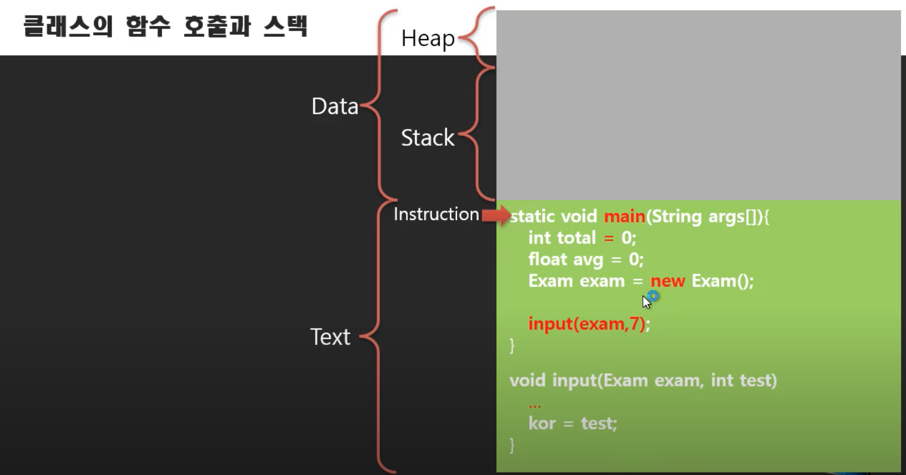

- 프로그램이 실행되면 제일 처음 실행되는 함수가 메인함수
  - 함수가 실행된다는 말은 함수내에 있는 연산자들이 실행된다는 말인데, 연산자들이 실행되기 위해서는 사전에 준비물이 필요함
- 메인함수가 실행되기 전에 필요한 변수들(준비물)이 먼저 준비된 후 실행됨
  - 어떤 함수도 실행되기 전에 함수 내에 선언된 변수들을 위한 공간들이 마련됨
  - 이때 준비된 공간은 더이상 다른 공간이 할당될 수 없도록 잠겨버림
  - 보라색은 참조변수, 초록색은 값을 저장하는 기본변수로 표현
  - 이렇게 함수가 실행되기 전에 마련된 변수들은 예약석이라고 생각하자

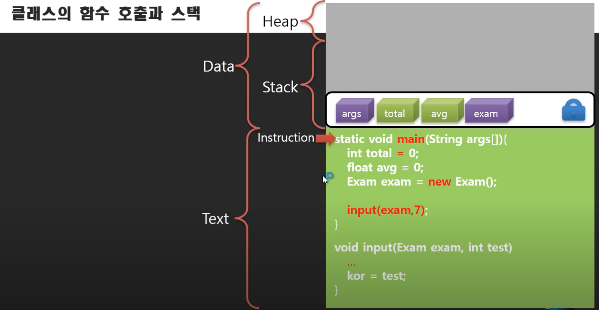

- 코드가 진행되다가 갑자기 예약하지 않은 좌석이 필요할때는 힙이라는 공간을 사용함(입석이라고 생각하자)
- 기본변수에 값이 할당됨(1, 2)

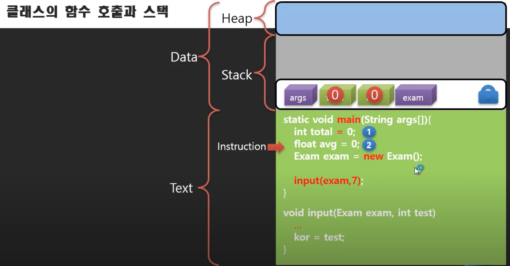

- 그 다음 줄에 있는 연산자는 '=', 'new', 'Exam()' 이렇게 3개가 있음
- 이 중에서 'new'가 가장 먼저 실행됨(3)
  - 갑자기 Exam이라는 형식의 공간이 필요해짐
  - 연산 중에 연산자에 의해서 필요해진 공간이기 때문에 입석(힙 영역)으로 가게 됨

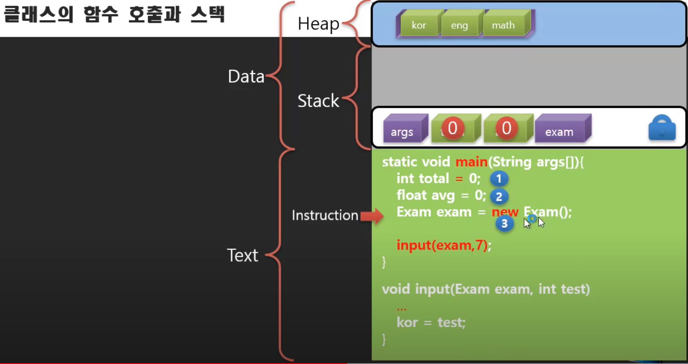

- 다음으로 'Exam()'이 실행되고 초기화가 진행됨(4)
  - 이게 생성자
  - 이걸 통해서 클래스에서 정의된 변수 타입에 따라서 초기화가 진행되는 것 같음
  - 그래서  'new Exam()' 이걸 해주면 공간이 마련되고 초기값이 할당되니까 실체화(인스턴스화, 객체화)가 되었다고 하는 것 같음

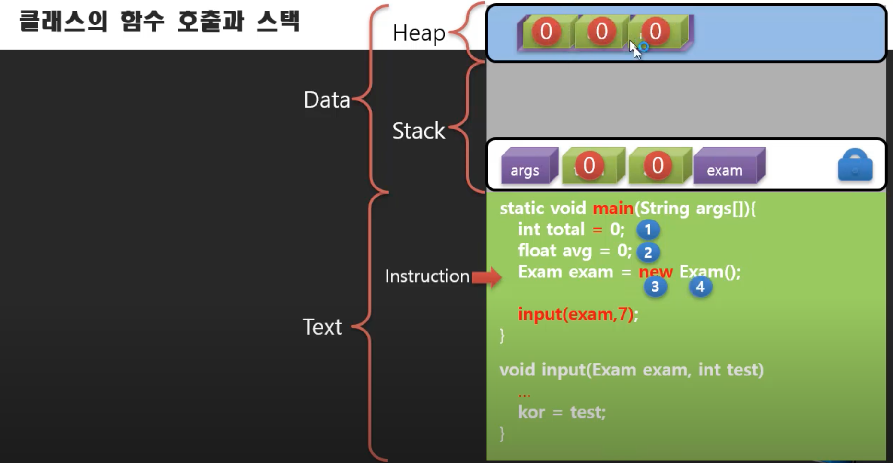

- 다음으로 '='이 실행되는데 이때 참조변수(exam)에게 힙 영역에 마련한 공간의 주소를 알려줘서 참조하게끔해줌(5)
  - 객체를 가리키게(참조하도록) 해주는 것
  - 그 객체에 이름표가 달렸다고 생각하자


- 다음으로 input() 이라는 함수를 호출함
  - 함수를 호출한다는 것은 그 함수가 있는 곳으로 간다는 의미

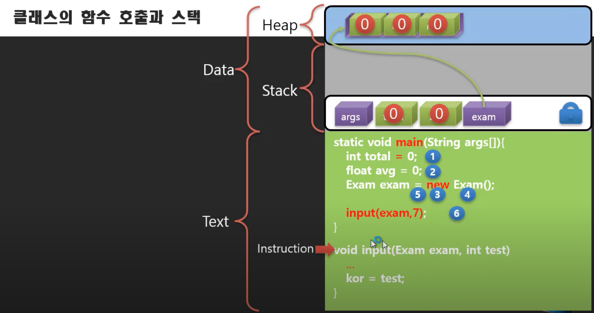

- input 함수가 실행되기 전에 준비물을 준비해야됨
  - 매개변수와 지역변수를 스택영역에 준비해야됨
  - 메인함수가 잠시 중단되고 input함수를 위한 스택 영역이 적재되는 형태로 마련됨

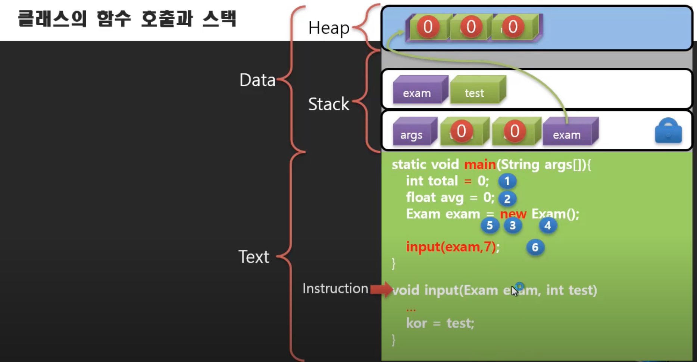

- 매개변수로 받은 메인함수의 exam을 통해 input함수 내에서도 input함수의 exam으로 힙 영역에 있는 객체(exam)을 참조할 수 있게 됨
  - exam 객체는 참조가 두개가 되는 것

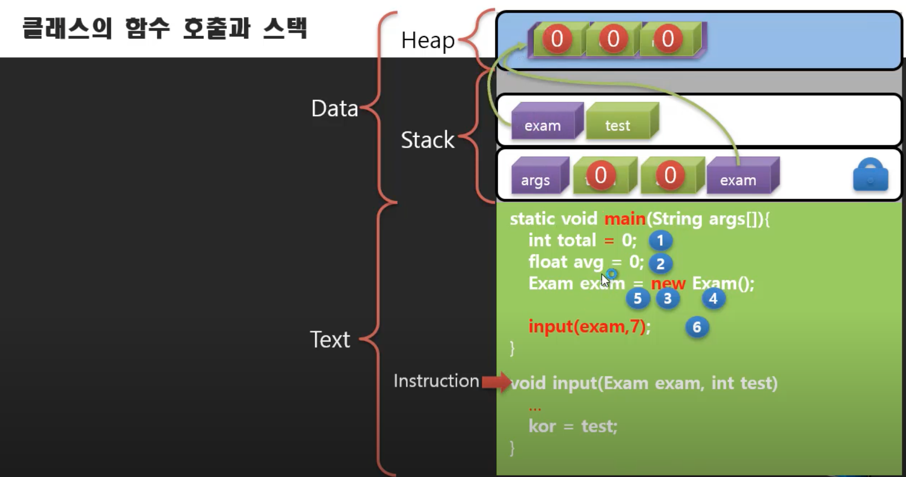

- 쭉 진행되서 test로 받은 7이 exam.kor에 할당됨(7)
  - 아마 생략된 부분이 이럴 것 같음

```java
void input(Exam exam, int test){
  int kor = exam.kor;
  kor = test;
}
```

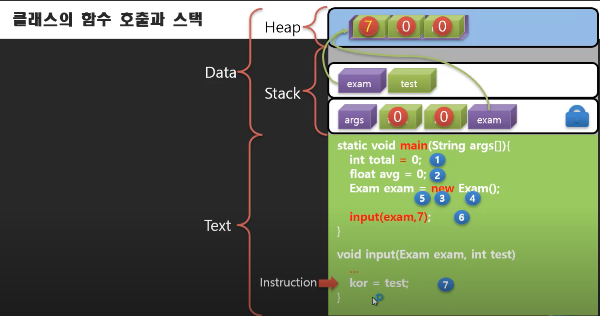

- input함수가 역할을 다하고 끝나면 다시 메인함수의 호출했었던 위치로 돌아감(반환됨)
  - input 함수에서 사용되었던 변수들이 함께 사라지게 됨

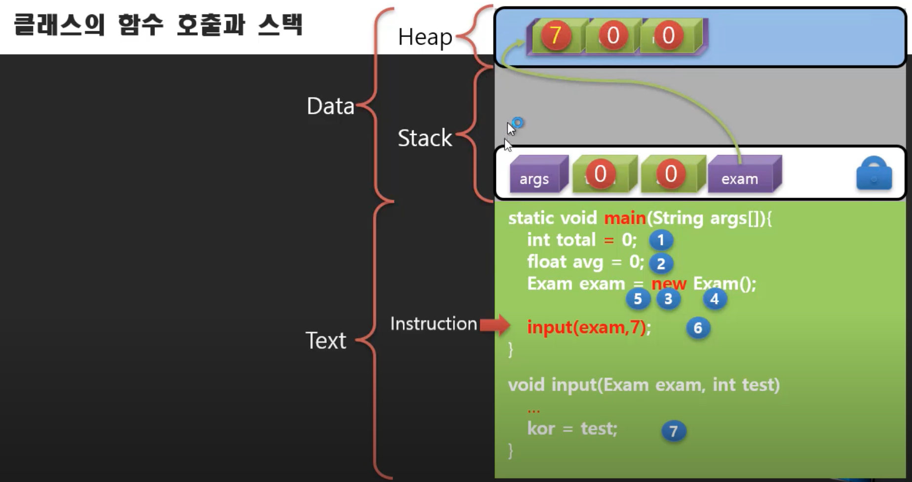

- 메인함수도 끝이나고 시스템으로 반환되면 메인함수에 쓰였던 변수들도 다 사라짐

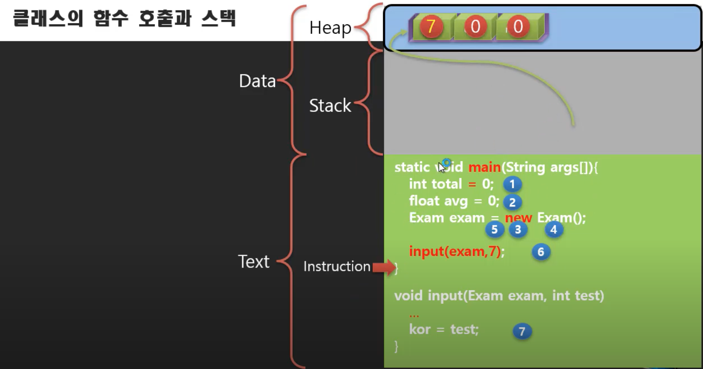

- 이렇게 프로세스가 끝나고 프로그램으로 돌아가면 스택영역에 있던 사용되었던 모든 공간들이 같이 사라지게 됨
- 그런데 힙에 있는 공간들은 참조가 사라져도 남아있는 특징이 있음
  - 잘못하다가는 메모리만 잡아먹는 상황이 생길 수도 있음(메모리 누수)
  - 그래서 자바같은 경우에는 런타임 환경에 의해서 참조되지 않는 힙 영역은 주기적으로 찾아서 지워줌(가비지 콜렉터)