# JDBC 학습 1


## 1. JDBC란 무엇인가?

### SQL을 작성할 수 있는 사람들을 위한 쿼리 실행 도구는 DB Client 프로그램

- DB 서버와 제공되는 클라이언트 프로그램은 각각 다르지만 비슷한 기능을 제공해줌

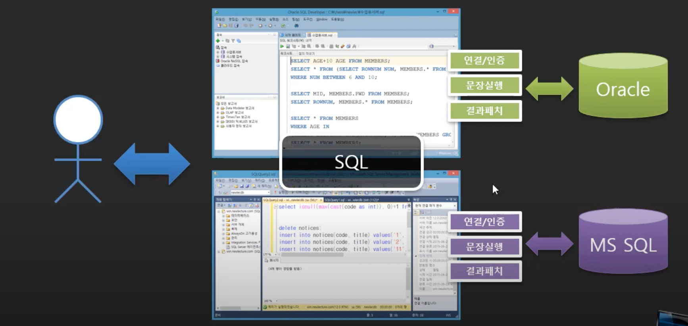

### SQL을 작성할 수 없는 사람들을 위한 쿼리 실행 도구는 업무용 프로그램

- 업무용 프로그램을 통해 간접적으로 데이터를 얻을 수 있음
- 사용자가 업무용 프로그램으로 데이터를 찾기 위해 버튼을 누르고 키워드를 입력하는 행위들을 통해 질의문이 만들어지고 코드를 통해 SQL문이 만들어짐
- 이 SQL문으로 서버에 접근해서 데이터를 사용하게 됨
- 이 때, 이 업무용 프로그램을 만드는 사람들에게 코드를 통해 DB를 이용할 수 있게 해주는 라이브러리가 필요함

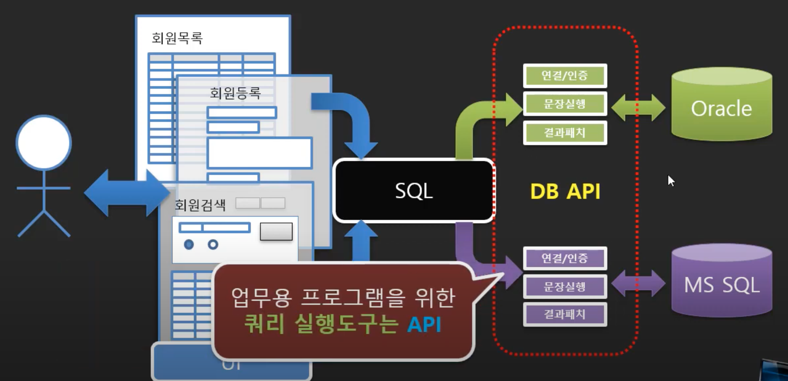

### DBC(DataBase Connectivity)

- 그런데 여기서 문제가 있음
- 각 DBMS 회사들에서 이런 API, 라이브러리를 만들어주는데 각 회사들의 API 함수들의 이름이 다름
- 똑같은 SQL문이더라도 각 DB에 연결하고 접근해서 사용하는 코드들이 다르면 특정 DB마다 그 기능과 사용 코드들을 알고 있어야됨
- 그래서 등장한게 JDBC

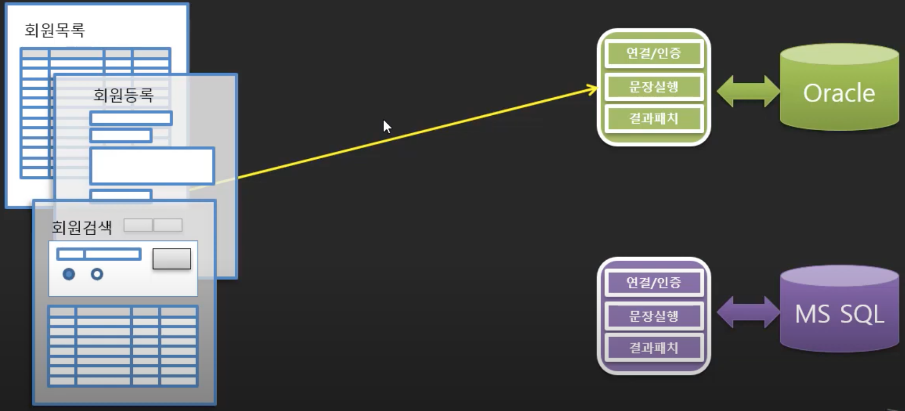

### JDBC와 JDBC Driver

- JDBC는 업무용 프로그램을 만드는 사람들이 각 DB에 연결하는 부분들을 직접 쓰지 않도록 단일화시켜주는 도구
- 자바에서 제공하고 있음
- 다른 나라의 전기콘셉트가 다르니까 여행갈때 가지고다니는 어댑터랑 비슷한 개념
- JDBC를 사용하면 각 DB들의 차이점을 모두 다 알필요가 없음
- DB를 바꾼다고해도 코드를 변경하거나 할 필요가 없음
- 하지만, JDBC Driver는 있어야함
  - 실제 구동시키는 코드들은 여기에 다 들어있음
  - JDBC가 이 Driver를 사용하기 때문에 사용할 DB에 맞는 Drive를 다운받아야함
- JDBC를 사용하기 위한 절차
  1. 드라이버 로드하기
  2. 연결 생성하기
  3. 문장 실행하기
  4. 결과집합 사용하기

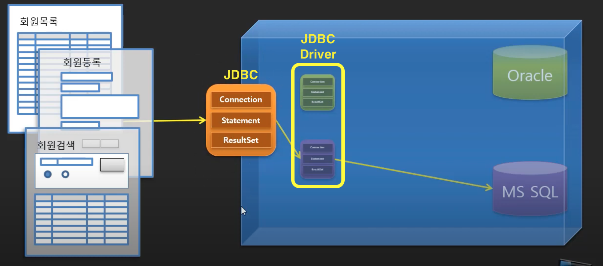


## 2. DBMS와 JDBC Driver 준비하기

### 윈도우에 Oracle DBMS 설치하기

- 영상참고
  - https://www.youtube.com/watch?v=aDTiSKcMtoc&list=PLq8wAnVUcTFVq7RD1kuUwkdWabxvDGzfu&index=2
- macOS는 docker나 가상컴퓨터를 이용해야함
  - 밑에서 다룸

### 오라클 DBMS

- Oracle Database Express Edition을 설치하자
- SQL을 통해 DBMS를 사용하는 정도로는 충분함
- 윈도우에서 설치하고나면 다음과 같은 창이 뜸

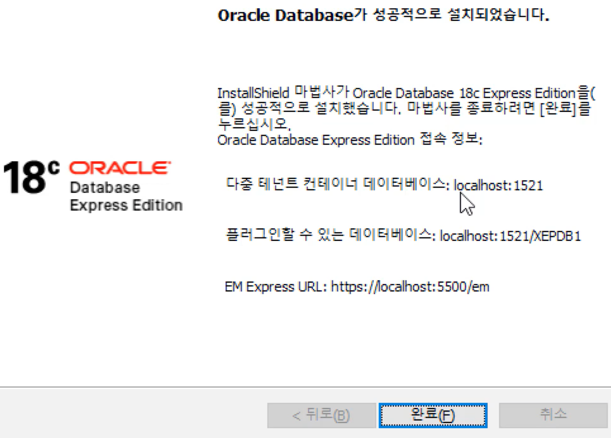

- 다중 테넌트 컨테이너 데이터베이스
  - 서버로 접속할 때 사용되는 주소 및 포트번호
- 플러그인할 수 있는 데이터베이스
- EM Express URL
  - 데이터베이스를 관리자로서 다룰 수 있는 유틸리티가 웹 기반으로도 있음

### 데이터베이스에 접속하기

- 설치한 것은 오라클 DBMS임
  - 원격의 서버라고 생각하자
- 이 서버를 사용하기 위해서는 사용자 인터페이스인 클라이언트 프로그램이 필요: 두가지
  - sqlplus: 콘솔기반
  - sql developer: 윈도우기반

### 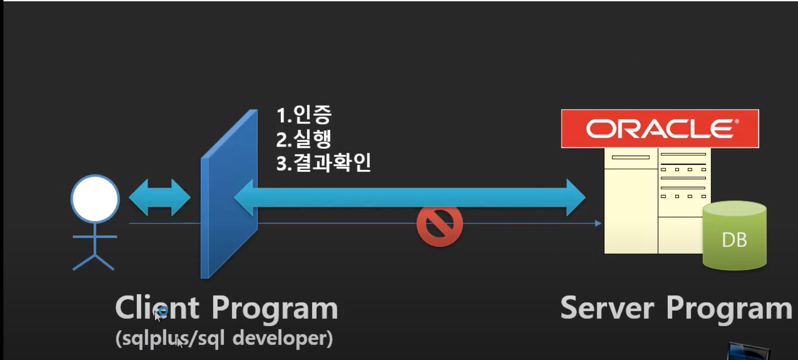

### macOS에서 오라클 DBMS를 사용하기 위한 방법: Docker

- MacOS에서 오라클 DB를 사용하려면 Docker를 사용해야함
- 다른 DBMS를 사용해도 되지만, Docker에 대해 공부할 겸, Docker를 사용해서 오라클 DB를 설치해보자
  - Docker에 대한 학습부분은 ITknowledge에 있는 Docker관련 마크다운파일에 정리했음
    - [학습1](../ITknowledge/Docker_1.md)
    - [학습2](../ITknowledge/Docker_2.md)

### Oracle + Docker + OJDBC

- 전체 흐름 참고: https://seongjaemoon.github.io/database/2018/02/18/database-oracle6.html

### Oracle Database 18c (18.4.0) Express Edition (XE)를 이미지로 빌딩하기

- https://github.com/oracle/docker-images git clone하기

  ```shell
  git clone https://github.com/oracle/docker-images.git
  ```

- 18.4.0-xe 버전의 경우, 최근에 추가로 필요했던 파일(예전에는 oracle-database-xe-18c-1.0-1.x86_64.rpm를 공식홈페이지에서 다운받고 dockerfiles/{version}폴더 안에 추가했었는데, 지금은 사라짐)을 없애면서 바로 빌드할 수 있게 됨

- clone 했던 docker-images폴더에서 빌드하고자하는 버전의 폴더까지 경로를 타고 들어감

  ```shell
  cd docker-images/OracleDatabase/SingleInstance/dockerfiles
  ```

- 도커의 이미지로 빌드

  - -v : 버전
  - -x : Express Edition기반의 이미지를 생성하겠다는 의미

  ```shell
  ./buildDockerImage.sh -v 18.4.0 -x
  ```

- 시간이 꽤 걸림

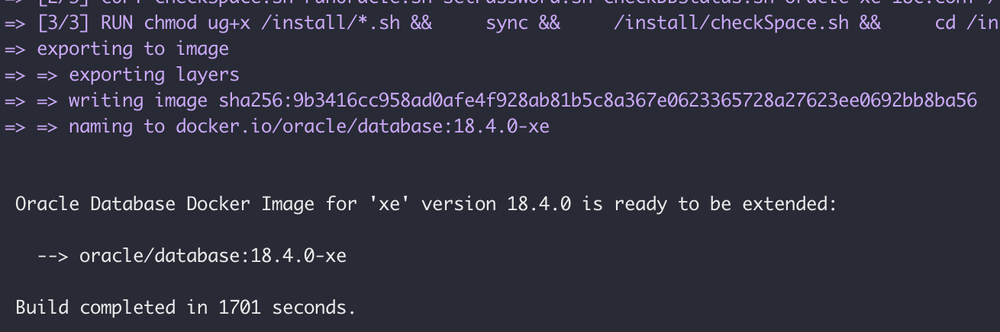

- 이미지가 제대로 빌드되었는지 확인

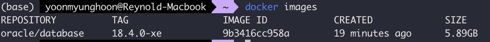

### Docker에서 Oracle DB 컨테이너 생성 및 실행

- docker run할때, 옵션들
  - Oracle Database 18c (18.4.0) Express Edition (XE) 관련 옵션

```
docker run --name <container name> \
-p <host port>:1521 -p <host port>:5500 \
-e ORACLE_PWD=<your database passwords> \
-e ORACLE_CHARACTERSET=<your character set> \
-v [<host mount point>:]/opt/oracle/oradata \
oracle/database:18.4.0-xe

Parameters:
   --name:        The name of the container (default: auto generated)
   -p:            The port mapping of the host port to the container port.
                  Two ports are exposed: 1521 (Oracle Listener), 5500 (EM Express)
   -e ORACLE_PWD: The Oracle Database SYS, SYSTEM and PDB_ADMIN password (default: auto generated)
   -e ORACLE_CHARACTERSET:
                  The character set to use when creating the database (default: AL32UTF8)
   -v /opt/oracle/oradata
                  The data volume to use for the database.
                  Has to be writable by the Unix "oracle" (uid: 54321) user inside the container!
                  If omitted the database will not be persisted over container recreation.
   -v /opt/oracle/scripts/startup | /docker-entrypoint-initdb.d/startup
                  Optional: A volume with custom scripts to be run after database startup.
                  For further details see the "Running scripts after setup and on startup" section below.
   -v /opt/oracle/scripts/setup | /docker-entrypoint-initdb.d/setup
                  Optional: A volume with custom scripts to be run after database setup.
                  For further details see the "Running scripts after setup and on startup" section below.
```

```shell
docker run --name ora18xe -d \
-p 1521:1521 -p 5500:5500 \
-e ORACLE_PWD=1234 \
oracle/database:18.4.0-xe
```

- 결과

```shell
ORACLE PASSWORD FOR SYS AND SYSTEM: 1234

Specify a password to be used for database accounts. Oracle recommends that the password entered should be at least 8 characters in length, contain at least 1 uppercase character, 1 lower case character and 1 digit [0-9]. Note that the same password will be used for SYS, SYSTEM and PDBADMIN accounts:

Confirm the password:

Configuring Oracle Listener.

Listener configuration succeeded.

Configuring Oracle Database XE.

Enter SYS user password:

**** 

Enter SYSTEM user password:

**** *

Enter PDBADMIN User Password:

**** 

Prepare for db operation

7% complete

Copying database files

29% complete

Creating and starting Oracle instance

30% complete

31% complete

34% complete

38% complete

41% complete

43% complete

Completing Database Creation

47% complete

50% complete

Creating Pluggable Databases

54% complete

71% complete

Executing Post Configuration Actions

93% complete

Running Custom Scripts

100% complete

Database creation complete. For details check the logfiles at:

/opt/oracle/cfgtoollogs/dbca/XE.

Database Information:

Global Database Name:XE

System Identifier(SID):XE

Look at the log file "/opt/oracle/cfgtoollogs/dbca/XE/XE.log" for further details.


Connect to Oracle Database using one of the connect strings:

Pluggable database: 8eda82bcebe3/XEPDB1

Multitenant container database: 8eda82bcebe3

Use https://localhost:5500/em to access Oracle Enterprise Manager for Oracle Database XE

The Oracle base remains unchanged with value /opt/oracle

#########################

DATABASE IS READY TO USE!

#########################

The following output is now a tail of the alert.log:

Pluggable database XEPDB1 opened read write

Completed: alter pluggable database XEPDB1 open

2020-10-29T12:31:40.943439+00:00

XEPDB1(3):CREATE SMALLFILE TABLESPACE "USERS" LOGGING DATAFILE '/opt/oracle/oradata/XE/XEPDB1/users01.dbf' SIZE 5M REUSE AUTOEXTEND ON NEXT 1280K MAXSIZE UNLIMITED EXTENT MANAGEMENT LOCAL SEGMENT SPACE MANAGEMENT AUTO

XEPDB1(3):Completed: CREATE SMALLFILE TABLESPACE "USERS" LOGGING DATAFILE '/opt/oracle/oradata/XE/XEPDB1/users01.dbf' SIZE 5M REUSE AUTOEXTEND ON NEXT 1280K MAXSIZE UNLIMITED EXTENT MANAGEMENT LOCAL SEGMENT SPACE MANAGEMENT AUTO

XEPDB1(3):ALTER DATABASE DEFAULT TABLESPACE "USERS"

XEPDB1(3):Completed: ALTER DATABASE DEFAULT TABLESPACE "USERS"

2020-10-29T12:31:46.657699+00:00

ALTER PLUGGABLE DATABASE XEPDB1 SAVE STATE

Completed: ALTER PLUGGABLE DATABASE XEPDB1 SAVE STATE
```

- sqlplus 실행
  - orcle DBMS를 설치하면 자동으로 설치되는 sqlplus

```shell
docker exec -it --user=oracle ora18xe bash
```

- 연결 성공

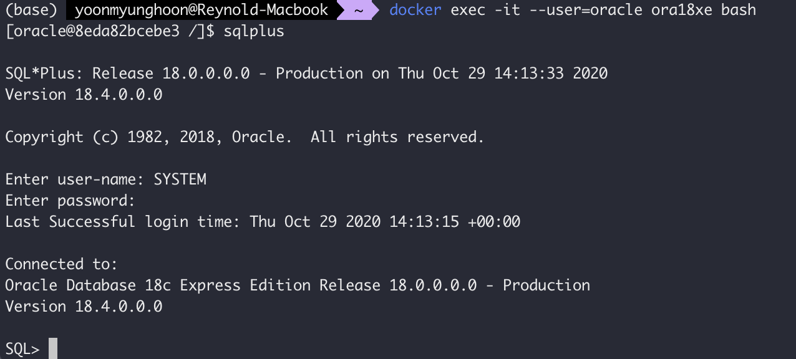

### SQL Developer 설치하기

- 연결(인증), 실행, 결과집합 등 DB에 접근하는데 콘솔기반 UI보다 조금 더 사용하기 쉬운 GUI 프로그램 SQL Developer를 설치해보자

  - https://www.oracle.com/tools/downloads/sqldev-v192-downloads.html
  - http://taewan.kim/oci_docs/98_misc_tips/tools/install_sqldeveloper/

- SQLDeveloper 오류: Locale not recoginized

  - http://taewan.kim/tip/sqldeveloper_error_unrecog_locale/

- 접속 성공

  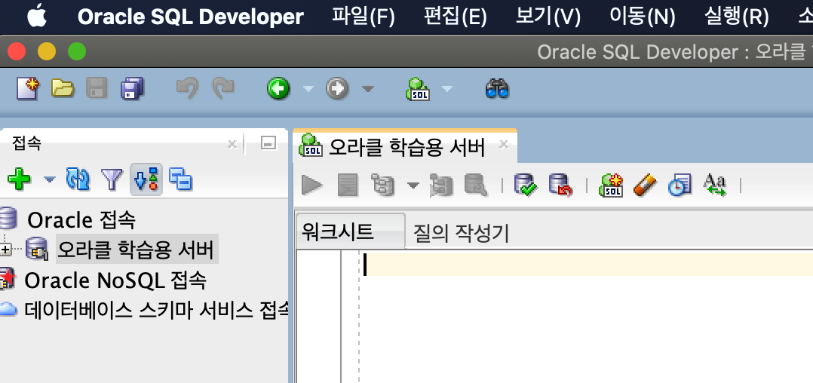

### 오라클 JDBC 드라이버 다운로드하기

- https://www.oracle.com/database/technologies/appdev/jdbc-downloads.html
- Oracle Database 18c (18.3) drivers 다운로드
- 새로운 프로젝트 생성: JDBCPrj
- 클래스 생성: ex1패키지 안에 Program.java
- Build path > configure build path > Libraries
  - 외부 JARs 추가로 앞서 다운로드받았던 ojdbc8.jar 넣어주기

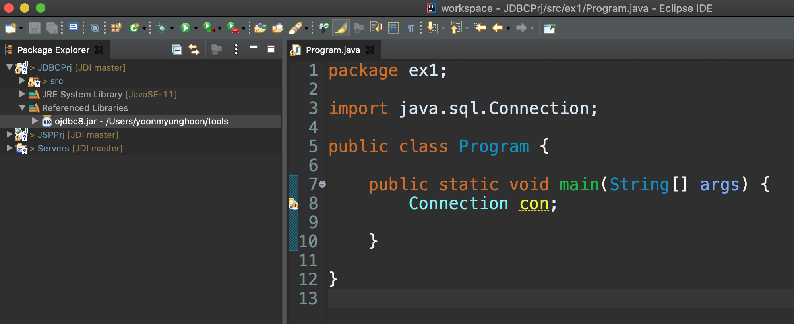


## 3. JDBC 기본 코드의 이해

### JDBC를 이용하는 자바 코드

- 업무용 프로그램을 개발하고 그 안에서 필요한 DB 처리를 해주기 위해서 JDBC 라이브러리를 이용할 것
- JDBC 라이브러리가 가진 기능은 없음, 실제 구동 코드는 드라이버가 가지고 있음
- 일단 오라클에서 다운받은 드라이버를 로드해야만 JDBC가 이 드라이버를 이용해서 데이터베이스를 연결하고 실행해줄 수 있음
- 그래서 해야될 첫번째는 드라이버를 로드하는 것
  - Class.forName("oracle.jdbc.driver.OracleDriver");
  - 로드는 클래스를 객체화시키는 것을 의미함
  - 보통 new를 써서 객체화하지만 여기서는 Class.forName()을 사용함
  - 이렇게 로드하고나면 메모리에 잡히게 됨
- 다음으로 연결객체를 얻고, 실행도구 생성, 쿼리 실행 후 결과 얻고 패치할 수 있는 도구를 생성함
- 이 4단계의 과정동안 객체가 4번 만들어지는데 한번도 new를 사용하질 않음
- DriverManager를 통해서 con을 만들고, con을 통해서 st를 만들고, st를 통해서 rs를 만듬
- 순차적으로 진행되어야만하는 것이라서 자연스러움
- 1번 실행 후
  - 드라이버가 메모리에 올라감

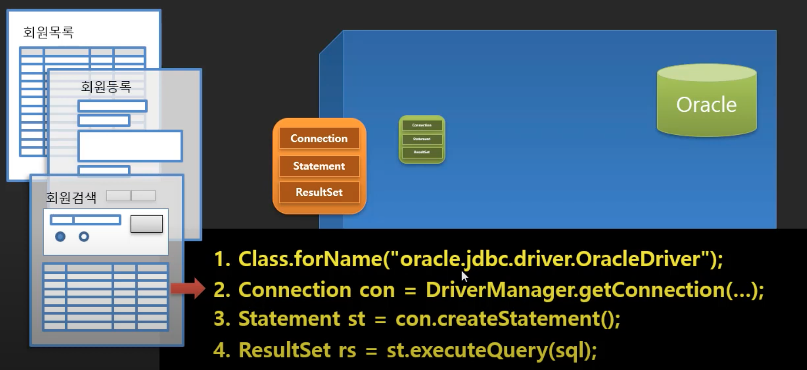

- 2번 실행 후
  - 연결됨

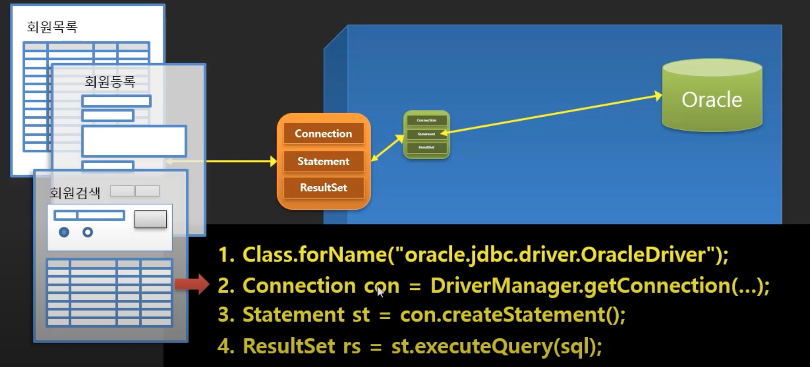

- 3번 실행 후
  - 쿼리를 짜고 입력

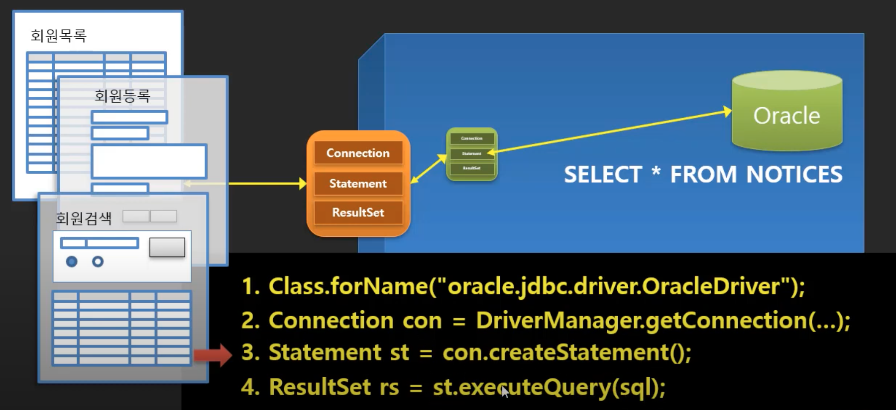

- 4번 실행 후
  - 서버에 결과집합이 만들어짐
  - 클라이언트는 한번에 결과를 받는 것이 아니라, 레코드 단위로 한줄씩한줄씩 받게 됨
  - 서버에서는 사용자에게 돌려줄 결과를 가리키는 커서(포인터)가 만들어짐
  - 서버에서 실행결과와 커서가 만들어지면 이를 이용할 수 있는 도구(ResultSet)가 클라이언트에 만들어짐
  - ResultSet가 만들어졌다는 것은 결과를 받았다는 것이 아니라 결과집합을 이용할 수 있는 상태가 된 것임
  - 결과를 하나 받아올 수 있는 빈 공간이 생김

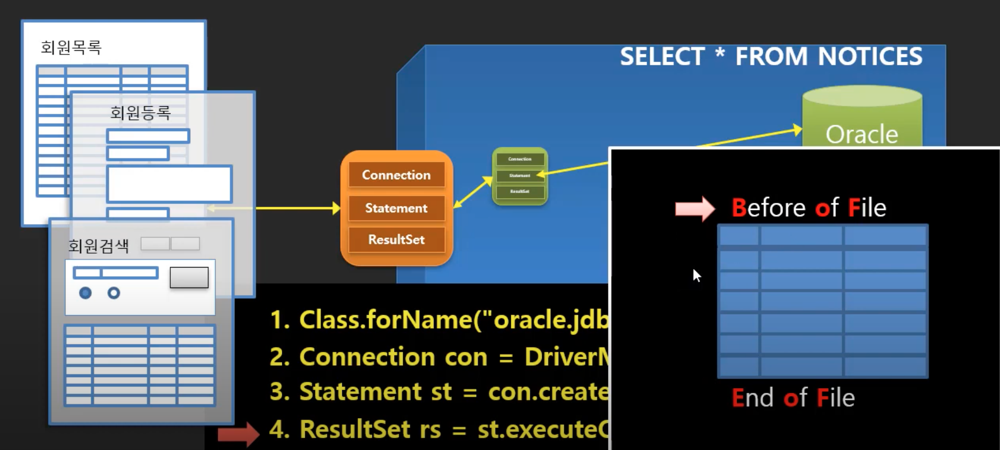

- 5번 후
  - 다음것을 달라고 하는 것 = 패치
  - 서버에서의 BOF가 움직이면서 레코드 하나가 클라이언트로 전달됨
  - 이때 전달된 레코드를 담는 그릇이 ResultSet임

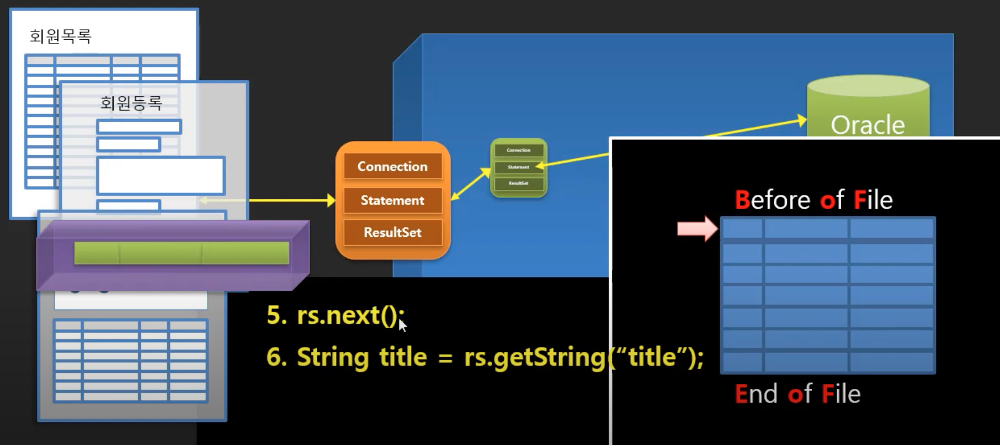

- 6번 후
  - "title" 컬럼에 해당되는 것들을 ResultSet에서 문자열로 받음
  - 게속 5번을 반복해서 끝까지 받으면 커서가 EOF까지 가게됨
  - 결과적으로 커서가 BOF에서 EOF까지 데이터를 쭉 반환하게 되면 클라이언트가 그 결과집합을 모두 받았다는 의미임


## 4. 쿼리 실행하기 실습

### 테이블 준비하기

- 참고
  - MEMBER 테이블 생성하기
    - https://www.youtube.com/watch?v=7rpwgjNuOwo&list=PLq8wAnVUcTFVq7RD1kuUwkdWabxvDGzfu&index=6
  - 나머지 테이블 준비하기
    - https://www.youtube.com/watch?v=ZEW5WY0hxIc&list=PLq8wAnVUcTFVq7RD1kuUwkdWabxvDGzfu&index=10

### 테이블 준비하기에 앞서 SQL에 대해 간략 정리

#### SQL의 구분

- DDL
  - CREATE
  - ALTER
  - DROP
- DML
  - INSERT
  - SELECT
  - UPDATE
  - DELETE
- DCL
  - GRANT
  - REVOKE

#### 테이블 생성하기 - CREATE

- 테이블 정의하기 = 데이터 구조 정의하기 = 개념상의 데이터 정의하기 = Entity 정의하기
- 프로그래밍 언어에서 데이터를 다룰 때, 클래스로 정의했음
- 이를 데이터베이스에서는 테이블로 나타냄

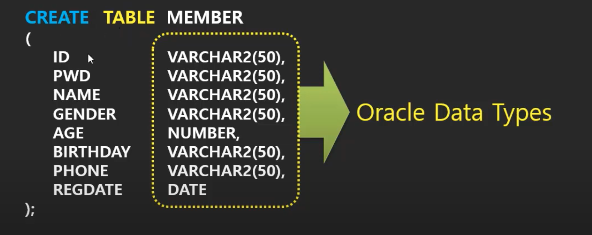

- 생성

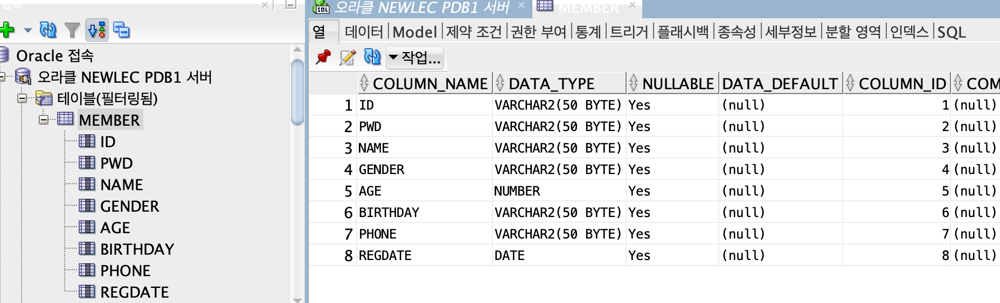

#### VALUE TYPE

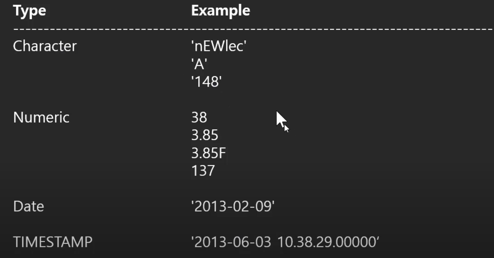

- Character 형식
  - CHAR
    - 길이가 고정일 때
    - 크기가 정해져있기 때문에 검색할 경우, 시간이 적게 걸림
  - VARCHAR2
    - 길이가 변할 수 있을 때
    - 데이터가 저장될 때, 구분자를 통해서 저장하기 때문에, 검색할 경우, 시간이 많이 걸림
  - NCHAR
    - 다양한 문자를 한번에 표현하기 위해서는 이 타입을 사용해야함
    - 크기가 3배임
  - NVARCHAR2
    - 가변적인 NCHAR 타입
  - LONG
    - 최대 2G, 예전에 나와서 요새는 잘 안쓰임
  - CLOB
    - 대용량 텍스트 데이터 타입, 최대 4G
  - NCLOB
    - 대용량 텍스틑 유니코드 데이터 타입, 최대 4G
- Numeric 형식
  - NUMBER
    - 정수와 실수 모두 표현할 수 있음
- Date 형식
  - DATE
    - 년월일 표현
  - TIMESTAMP
    - 년월일+시분초까지 표현

#### 테이블 수정하기 - ALTER

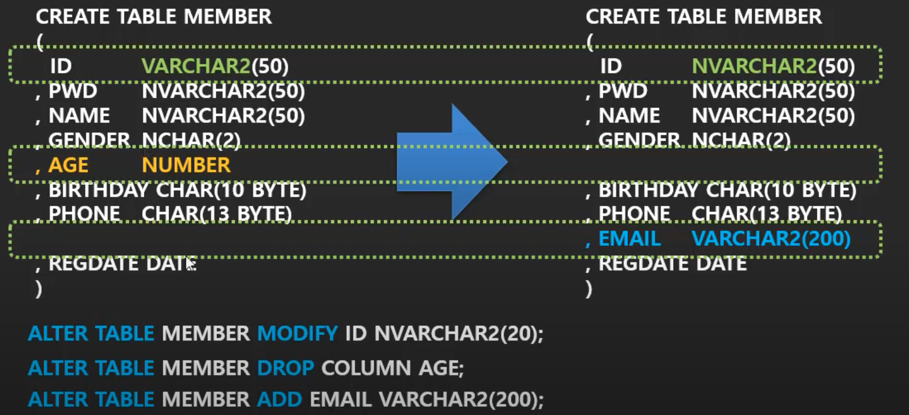

- 결과

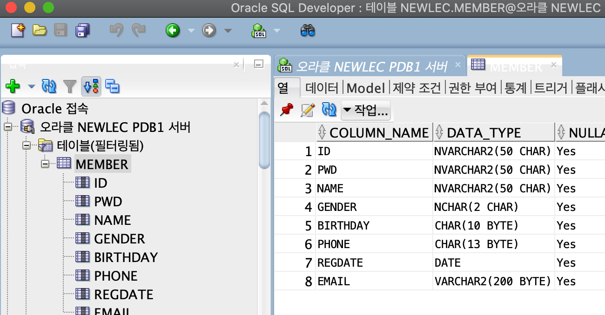

- DDL의 경우, 자주 사용하는 명령어가 아니기 때문에 완벽하게 숙지하고 있는 것보다는 그냥 툴을 사용하는 편임

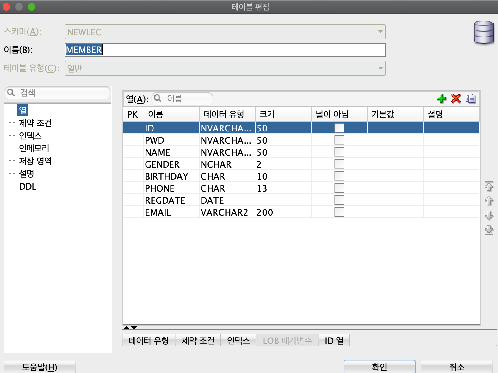

### 나머지 테이블 준비하기

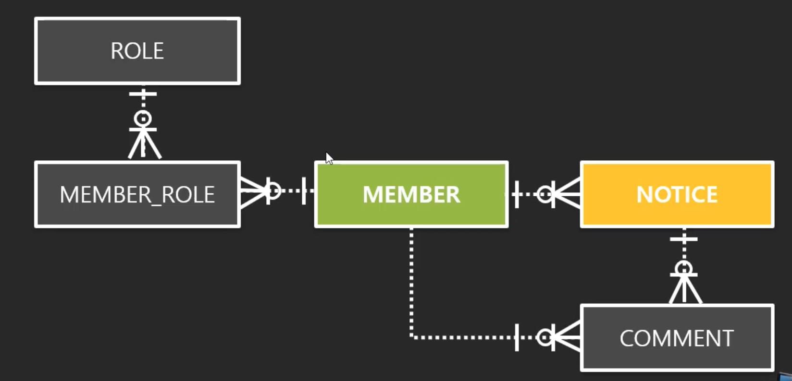

- 테이블 생성 코드

```sql
CREATE TABLE MEMBER
(
    ID VARCHAR2(50),
    PWD NVARCHAR2(50),
    NAME NVARCHAR2(50),
    GENDER NCHAR(2), --남성, 여성
    AGE NUMBER(3),
    BIRTHDAY CHAR(10), --2000-01-02
    PHONE CHAR(13), --010-1234-2345
    REGDATE DATE
);

DROP TABLE MEMBER;

ALTER TABLE MEMBER MODIFY ID NVARCHAR2(50);

ALTER TABLE MEMBER DROP COLUMN AGE;

ALTER TABLE MEMBER ADD EMAIL VARCHAR2(200);


CREATE TABLE NOTICE
(
    ID NUMBER,
    TITLE NVARCHAR2(100),
    WRITER_ID NVARCHAR2(50),
    CONTENT CLOB,
    REGDATE TIMESTAMP,
    HIT NUMBER,
    FILES NVARCHAR2(1000)    
);

CREATE TABLE "COMMENT"
(
    ID NUMBER,
    CONTENT NVARCHAR2(2000),
    REGDATE TIMESTAMP,
    WRITER_ID NVARCHAR2(50),
    NOTICE_ID NUMBER
);

CREATE TABLE ROLE
(
    ID VARCHAR2(50),
    DISCRIPTION NVARCHAR2(500)
);

CREATE TABLE MEMBER_ROLE
(
    MEMBER_ID NVARCHAR2(50),
    ROLE_ID VARCHAR2(50)
);


```

- 테이블 준비완료

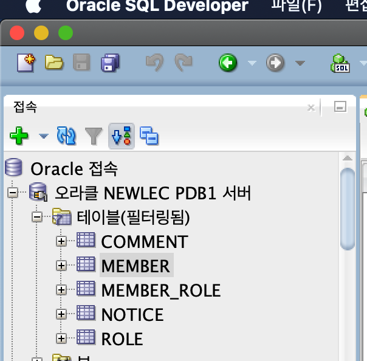

### JDBC 코드 : 첫 번째 게시글 제목 출력하기

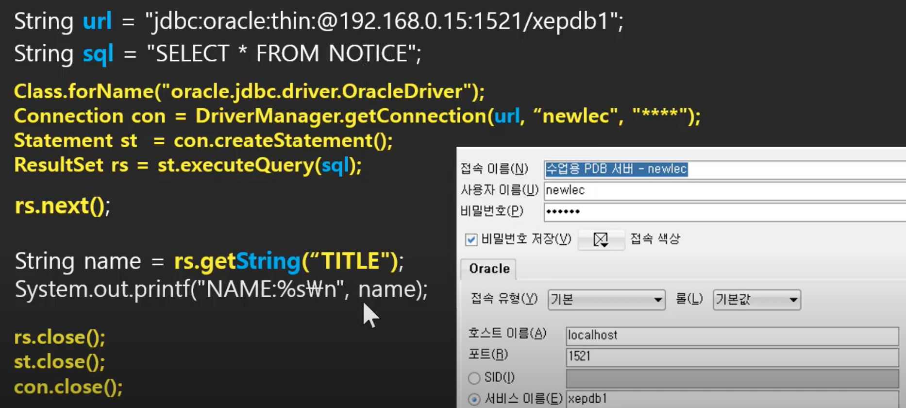

- Program.java

```java
package ex1;

import java.sql.Connection;
import java.sql.DriverManager;
import java.sql.ResultSet;
import java.sql.SQLException;
import java.sql.Statement;

public class Program {

	public static void main(String[] args) throws ClassNotFoundException, SQLException {
		
		String url = "jdbc:oracle:thin:@localhost:1521/xepdb1";
		String sql = "SELECT * FROM NOTICE";
		
		Class.forName("oracle.jdbc.driver.OracleDriver");
		Connection con = DriverManager.getConnection(url, "NEWLEC", "1234");
		Statement st = con.createStatement();
		ResultSet rs = st.executeQuery(sql);
		
		rs.next();
		String title = rs.getString("TITLE");
		System.out.println(title);
		
		rs.close();
		st.close();
		con.close();

	}

}
```

- 로케일을 찾을 수 없다는 에러가 뜸
  - 찾아보니 맥북에서 발생하는 오류임
  - 시스템환경설정에서 언어 및 지역의 지역을 미국으로 바꿨다가 다시 대한민국으로 바꾸니 해결됨;;
    - https://butter-ring.tistory.com/5
- Oracle
  - notice에 데이터 한개 삽입
  - 오라클을 commit을 수동으로 해줘야한다고 함

```sql
INSERT INTO NOTICE VALUES(1, 'JDBC란 무엇인가?', 'newlec', 'aaa', SYSDATE, 0, '');
COMMIT;
```

- Program.java

```java
package ex1;

import java.sql.Connection;
import java.sql.DriverManager;
import java.sql.ResultSet;
import java.sql.SQLException;
import java.sql.Statement;

public class Program {

	public static void main(String[] args) throws ClassNotFoundException, SQLException {
		
		String url = "jdbc:oracle:thin:@localhost:1521/xepdb1";
		String sql = "SELECT * FROM NOTICE";
		
		Class.forName("oracle.jdbc.driver.OracleDriver");
		Connection con = DriverManager.getConnection(url, "NEWLEC", "1234");
		Statement st = con.createStatement();
		ResultSet rs = st.executeQuery(sql);
		
		if (rs.next()) {
			String title = rs.getString("TITLE");
			System.out.println(title);
		}
		
		rs.close();
		st.close();
		con.close();

	}

}

```

- 결과

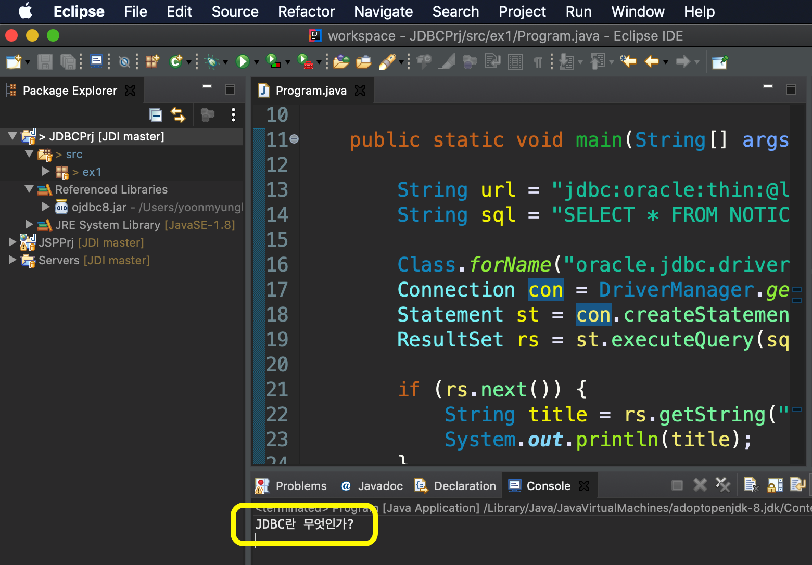


## 5. 혼자 풀어보는 문제 - 1


## 참고

- 유튜브 뉴렉처 채널
- Oracle Database를 Docker 이미지로 빌드하고 실행하는 과정에서 참고한 사이트들
  - https://www.youtube.com/watch?v=uoQr1j1A6Hk
  - https://emflant.tistory.com/237
  - https://jungwoon.github.io/docker/2019/01/13/Docker-3/
  - https://github.com/oracle/docker-images/tree/master/OracleDatabase/SingleInstance#running-oracle-database-18c-express-edition-in-a-docker-container
  - https://emflant.tistory.com/237
  - https://milancode.tistory.com/9