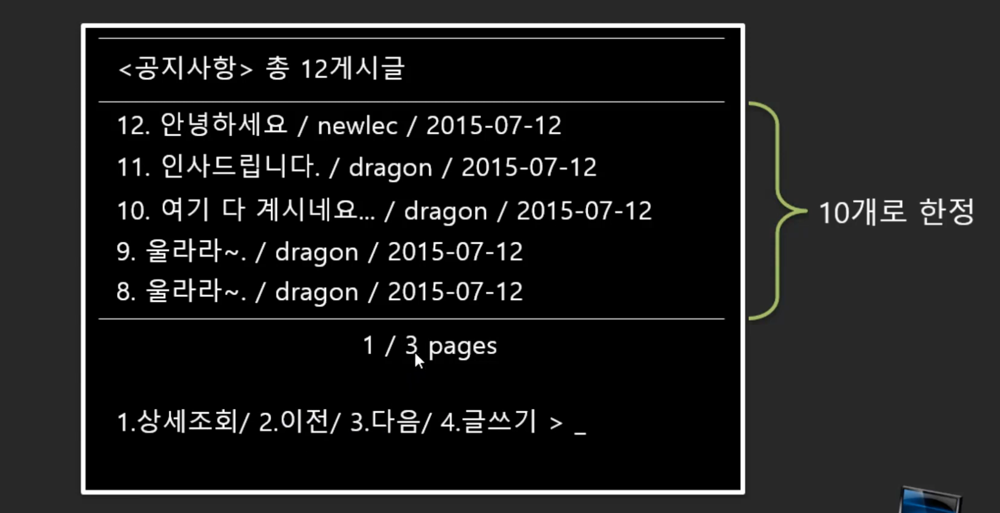
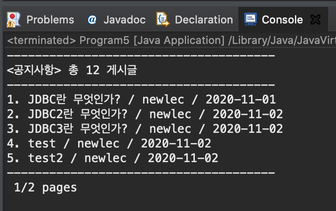

# JDBC 학습 2


## 13. CRUD를 담당하는 서비스 틀래스(NoticeService) 생성하기

### Notice 개체(클래스) 만들기 and SELECT 기능부 만들기

- Notice.java

```java
package com.newlecture.app.entity;

import java.util.Date;

public class Notice {
	private int id;
	private String title;
	private String writerId;
	private Date regDate;
	private String content;
	private int hit;
	
	public Notice() {
		
	}
	
	public Notice(int id, String title, String writerId, Date regDate, String content, int hit) {
		this.id = id;
		this.title = title;
		this.writerId = writerId;
		this.regDate = regDate;
		this.content = content;
		this.hit = hit;
	}


	public int getId() {
		return id;
	}
	public void setId(int id) {
		this.id = id;
	}
	public String getTitle() {
		return title;
	}
	public void setTitle(String title) {
		this.title = title;
	}
	public String getWriterId() {
		return writerId;
	}
	public void setWriterId(String writerId) {
		this.writerId = writerId;
	}
	public Date getRegDate() {
		return regDate;
	}
	public void setRegDate(Date regDate) {
		this.regDate = regDate;
	}
	public String getContent() {
		return content;
	}
	public void setContent(String content) {
		this.content = content;
	}
	public int getHit() {
		return hit;
	}
	public void setHit(int hit) {
		this.hit = hit;
	}
	
	
}

```

- NoticeService.java

```java
package com.newlecture.app.service;

import java.sql.Connection;
import java.sql.DriverManager;
import java.sql.ResultSet;
import java.sql.SQLException;
import java.sql.Statement;
import java.util.ArrayList;
import java.util.Date;
import java.util.List;

import com.newlecture.app.entity.Notice;

public class NoticeService {
	public List<Notice> getList() throws ClassNotFoundException, SQLException{
		String url = "jdbc:oracle:thin:@localhost:1521/xepdb1";
		String sql = "SELECT * FROM NOTICE";
		
		Class.forName("oracle.jdbc.driver.OracleDriver");
		Connection con = DriverManager.getConnection(url, "NEWLEC", "1234");
		Statement st = con.createStatement();
		ResultSet rs = st.executeQuery(sql);
		
		List<Notice> list = new ArrayList<Notice>();
		
		while (rs.next()) {
			int id = rs.getInt("ID");
			String title = rs.getString("TITLE");
			String writerId = rs.getString("WRITER_ID");
			Date regDate = rs.getDate("REGDATE");
			String content = rs.getString("CONTENT");
			int hit = rs.getInt("hit");
			
			Notice notice = new Notice(
					id, title, writerId, regDate, content, hit
				);
			list.add(notice);
		}
		
		
		rs.close();
		st.close();
		con.close();
		
		return list;
	}
}

```


## 14. NoticeService 구현 마무리

- Notice.java

```java
package com.newlecture.app.entity;

import java.util.Date;

public class Notice {
	private int id;
	private String title;
	private String writerId;
	private Date regDate;
	private String content;
	private int hit;
	private String files;
	
	public Notice() {
		
	}
	
	public Notice(int id, String title, String writerId, Date regDate, String content, int hit, String files) {
		
		this.id = id;
		this.title = title;
		this.writerId = writerId;
		this.regDate = regDate;
		this.content = content;
		this.hit = hit;
		this.files = files;
	}


	public int getId() {
		return id;
	}
	public void setId(int id) {
		this.id = id;
	}
	public String getTitle() {
		return title;
	}
	public void setTitle(String title) {
		this.title = title;
	}
	public String getWriterId() {
		return writerId;
	}
	public void setWriterId(String writerId) {
		this.writerId = writerId;
	}
	public Date getRegDate() {
		return regDate;
	}
	public void setRegDate(Date regDate) {
		this.regDate = regDate;
	}
	public String getContent() {
		return content;
	}
	public void setContent(String content) {
		this.content = content;
	}
	public int getHit() {
		return hit;
	}
	public void setHit(int hit) {
		this.hit = hit;
	}

	public String getFiles() {
		return files;
	}

	public void setFiles(String files) {
		this.files = files;
	}
	
	
}

```

- NoticeService.java

```java
package com.newlecture.app.service;

import java.sql.Connection;
import java.sql.DriverManager;
import java.sql.PreparedStatement;
import java.sql.ResultSet;
import java.sql.SQLException;
import java.sql.Statement;
import java.util.ArrayList;
import java.util.Date;
import java.util.List;

import com.newlecture.app.entity.Notice;

public class NoticeService {
	private String url = "jdbc:oracle:thin:@localhost:1521/xepdb1";
	private String uid = "NEWLEC";
	private String pwd = "1234";
	private String driver = "oracle.jdbc.driver.OracleDriver";
	
	public List<Notice> getList() throws ClassNotFoundException, SQLException{
		String sql = "SELECT * FROM NOTICE";
		
		Class.forName(driver);
		Connection con = DriverManager.getConnection(url, uid, pwd);
		Statement st = con.createStatement();
		ResultSet rs = st.executeQuery(sql);
		
		List<Notice> list = new ArrayList<Notice>();
		
		while (rs.next()) {
			int id = rs.getInt("ID");
			String title = rs.getString("TITLE");
			String writerId = rs.getString("WRITER_ID");
			Date regDate = rs.getDate("REGDATE");
			String content = rs.getString("CONTENT");
			int hit = rs.getInt("hit");
			String files = rs.getString("FILES");
			
			Notice notice = new Notice(
					id, title, writerId, regDate, content, hit, files
				);
			list.add(notice);
		}
		
		
		rs.close();
		st.close();
		con.close();
		
		return list;
	}
	
	public int insert(Notice notice) throws ClassNotFoundException, SQLException {
		String title = notice.getTitle();
		String writerId = notice.getWriterId();
		String content = notice.getContent();
		String files = notice.getFiles();
		
		String sql = "INSERT INTO notice (" + 
				"    title," + 
				"    writer_id," + 
				"    content," + 
				"    files" + 
				") VALUES (?,?,?,?)";
		
		Class.forName(driver);
		Connection con = DriverManager.getConnection(url, uid, pwd);
		PreparedStatement st = con.prepareStatement(sql);
		st.setString(1, title);
		st.setString(2, writerId);
		st.setString(3, content);
		st.setString(4, files);
		int result = st.executeUpdate();
		
		st.close();
		con.close();
		
		return result;
	}
	
	public int update(Notice notice) throws ClassNotFoundException, SQLException {
		String title = notice.getTitle();
		String content = notice.getContent();
		String files = notice.getFiles();
		int id = notice.getId();
		
		String sql = "UPDATE NOTICE SET" + 
				"    TITLE=?," + 
				"    CONTENT=?," + 
				"    FILES=?" + 
				"WHERE ID=?";
		
		Class.forName(driver);
		Connection con = DriverManager.getConnection(url, uid, pwd);
		PreparedStatement st = con.prepareStatement(sql);
		st.setString(1, title);
		st.setString(2, content);
		st.setString(3, files);
		st.setInt(4, id);
		int result = st.executeUpdate();
		
		st.close();
		con.close();
		
		return result;
	}
	
	public int delete(int id) throws ClassNotFoundException, SQLException {		
		String sql = "DELETE NOTICE WHERE ID=?";
		
		Class.forName(driver);
		Connection con = DriverManager.getConnection(url, uid, pwd);
		PreparedStatement st = con.prepareStatement(sql);
		st.setInt(1, id);
		int result = st.executeUpdate();
		
		st.close();
		con.close();
		return result;
	}

}

```


## 15. 사용자 인터페이스 붙이기(공지사항 목록)

### 사용자 인터페이스

- 웹 기반
- 콘솔 기반
- 윈도우
- ...
- 등
- 여러가지 인터페이스를 사용할 수 있지만, 여기서는 콘솔기반으로 해보자
- 웹 기반은 JSP에서 다룸

### 목록에서 쿼리해야 할 내용



- Program5.java

```java
package ex1;

import java.sql.SQLException;

import com.newlecture.app.console.NoticeConsole;

public class Program5 {

	public static void main(String[] args) throws ClassNotFoundException, SQLException {
		NoticeConsole console = new NoticeConsole();
		console.printNoticeList();
		int menu = console.inputNoticeMenu();
		
		switch(menu) {
		case 1: // 상세조회 
			break;
		case 2: // 이전 
			break;
		case 3: // 다음 
			break;
		case 4: // 글쓰기
			break;
		}
	}

}

```

- NoticeConsole.java

```java
package com.newlecture.app.console;

import java.sql.SQLException;
import java.util.List;

import com.newlecture.app.entity.Notice;
import com.newlecture.app.service.NoticeService;

public class NoticeConsole {
	
	private NoticeService service;
	
	public NoticeConsole() {
		service = new NoticeService();
	}

	public void printNoticeList() throws ClassNotFoundException, SQLException {
		List<Notice> list = service.getList();
		
		System.out.println("--------------------------------------");
		System.out.printf("<공지사항> 총 %d 게시글\n", 12);
		System.out.println("--------------------------------------");
		for(Notice n : list) {
			System.out.printf("%d. %s / %s / %s\n", 
					n.getId(), 
					n.getTitle(), 
					n.getWriterId(), 
					n.getRegDate());
		}
		System.out.println("--------------------------------------");
		System.out.printf(" %d/%d pages\n", 1, 2);

	}

	public int inputNoticeMenu() {
		
		return 0;
	}

}

```

- 결과




## 16. 공지사항 메뉴 붙이기

- NoticeConsole.java

```java
public int inputNoticeMenu() {
		Scanner scan = new Scanner(System.in);
		
		System.out.printf("<1.상세조회 / 2.이전 / 3.다음 / 4.글쓰기 / 5.종료 >");
		String menu_ = scan.nextLine();
		int menu = Integer.parseInt(menu_);
		
		return menu;
	}
```

- Program5.java
  - EXIT를 사용한 while문 탈출

```java
package ex1;

import java.sql.SQLException;

import com.newlecture.app.console.NoticeConsole;

public class Program5 {

	public static void main(String[] args) throws ClassNotFoundException, SQLException {
		NoticeConsole console = new NoticeConsole();
		
		EXIT:
		while(true) {
			console.printNoticeList();
			int menu = console.inputNoticeMenu();
			
			switch(menu) {
			case 1: // 상세조회 
				break;
			case 2: // 이전 
				break;
			case 3: // 다음 
				break;
			case 4: // 글쓰기
				break;
			case 5: // 종료
				System.out.println("Bye~~~");
				break EXIT;
			default:
				System.out.println("<<You have to push between 1 to 4 >>");
				break;
			}
			
		}
	}

}

```


## 17. 페이징을 위한 쿼리 만들기

### 이전 페이지, 다음 페이지 등 페이징 처리를 위해 SQL쿼리문을 변경하자

```sql
SELECT * FROM (
    SELECT ROWNUM NUM, N.* FROM (
        SELECT * FROM NOTICE ORDER BY REGDATE DESC
    ) N
)
WHERE NUM BETWEEN 1 AND 10;
```


## 18. 페이징 쿼리 이용하기 

- NoticeService.java
  - 쿼리문 삽입하기
  - page를 매개변수로 받아서 start와 end 값을 계산해서 쿼리에 넣어줌

```java
package com.newlecture.app.service;

import java.sql.Connection;
import java.sql.DriverManager;
import java.sql.PreparedStatement;
import java.sql.ResultSet;
import java.sql.SQLException;
import java.sql.Statement;
import java.util.ArrayList;
import java.util.Date;
import java.util.List;

import com.newlecture.app.entity.Notice;

public class NoticeService {
	private String url = "jdbc:oracle:thin:@localhost:1521/xepdb1";
	private String uid = "NEWLEC";
	private String pwd = "1234";
	private String driver = "oracle.jdbc.driver.OracleDriver";
	
	public List<Notice> getList(int page) throws ClassNotFoundException, SQLException{
		
		int start = 1 + (page-1)*10;
		int end = 10*page;
		
		String sql = "SELECT * FROM (" + 
				"    SELECT ROWNUM NUM, N.* FROM (" + 
				"        SELECT * FROM NOTICE ORDER BY REGDATE DESC" + 
				"    ) N" + 
				")" + 
				"WHERE NUM BETWEEN ? AND ?";
		
		Class.forName(driver);
		Connection con = DriverManager.getConnection(url, uid, pwd);
		PreparedStatement st = con.prepareStatement(sql);
		st.setInt(1, start);
		st.setInt(2, end);
		ResultSet rs = st.executeQuery();
		
		List<Notice> list = new ArrayList<Notice>();
		
		while (rs.next()) {
			int id = rs.getInt("ID");
			String title = rs.getString("TITLE");
			String writerId = rs.getString("WRITER_ID");
			Date regDate = rs.getDate("REGDATE");
			String content = rs.getString("CONTENT");
			int hit = rs.getInt("hit");
			String files = rs.getString("FILES");
			
			Notice notice = new Notice(
					id, title, writerId, regDate, content, hit, files
				);
			list.add(notice);
		}
		
		
		rs.close();
		st.close();
		con.close();
		
		return list;
	}

}

```


## 19. 목록을 위한 View 생성하기

- NOTICE_VIEW 라는 view 만들기

```sql
CREATE VIEW NOTICE_VIEW
AS
SELECT * FROM (
    SELECT ROWNUM NUM, N.* FROM (
        SELECT * FROM NOTICE ORDER BY REGDATE DESC
    ) N
);
```

- NOTICE_VIEW 를 통해서 select 하기

```sql
SELECT * FROM NOTICE_VIEW
WHERE NUM BETWEEN 1 AND 10;
```

- NoticeService.java
  - sql 쿼리문을 수정해주자

```java
public List<Notice> getList(int page) throws ClassNotFoundException, SQLException{
		
		int start = 1 + (page-1)*10;
		int end = 10*page;
		
		String sql = "SELECT * FROM NOTICE_VIEW WHERE NUM BETWEEN ? AND ?";
		
		Class.forName(driver);
		Connection con = DriverManager.getConnection(url, uid, pwd);
		PreparedStatement st = con.prepareStatement(sql);
		st.setInt(1, start);
		st.setInt(2, end);
		ResultSet rs = st.executeQuery();
		
		List<Notice> list = new ArrayList<Notice>();
		
		while (rs.next()) {
			int id = rs.getInt("ID");
			String title = rs.getString("TITLE");
			String writerId = rs.getString("WRITER_ID");
			Date regDate = rs.getDate("REGDATE");
			String content = rs.getString("CONTENT");
			int hit = rs.getInt("hit");
			String files = rs.getString("FILES");
			
			Notice notice = new Notice(
					id, title, writerId, regDate, content, hit, files
				);
			list.add(notice);
		}
		
		
		rs.close();
		st.close();
		con.close();
		
		return list;
	}
```


## 20. 이전 / 다음 구현하기

- Program5.java
  - 현재 페이지를 나타내는 변수 page를 여기에 두지 않고 console 내부에 두는 것이 더 바람직 할 듯
  - console에서 페이지네이션을 처리할 수 있도록 movePrevList와 moveNextList를 구현해두고 그걸 호출해서 사용하자

```java
package ex1;

import java.sql.SQLException;

import com.newlecture.app.console.NoticeConsole;

public class Program5 {

	public static void main(String[] args) throws ClassNotFoundException, SQLException {
		NoticeConsole console = new NoticeConsole();
//		int page;
		
		EXIT:
		while(true) {
			console.printNoticeList();
			int menu = console.inputNoticeMenu();
			
			switch(menu) {
			case 1: // 상세조회 
				break;
			case 2: // 이전 
				console.movePrevList();
//				page--;
				break;
			case 3: // 다음 
				console.moveNextList();
//				page++;
				break;
			case 4: // 글쓰기
				break;
			case 5: // 종료
				System.out.println("Bye~~~");
				break EXIT;
			default:
				System.out.println("<<You have to push between 1 to 5 >>");
				break;
			}
			
		}
	}

}

```

- NoticeConsole.java
  - movePrevList에서는 1페이지 밑으로 떨어지지 못하도록 조건 처리를 해주자
  - moveNextList를 구현하기 위해서는 전체 공지사항의 목록 개수를 구하는 부분을 작성해주어야함

```java
package com.newlecture.app.console;

import java.sql.SQLException;
import java.util.List;
import java.util.Scanner;

import com.newlecture.app.entity.Notice;
import com.newlecture.app.service.NoticeService;

public class NoticeConsole {
	
	private NoticeService service;
	private int page;
	
	public NoticeConsole() {
		service = new NoticeService();
		page = 1;
	}

	public void printNoticeList() throws ClassNotFoundException, SQLException {
		List<Notice> list = service.getList(page);
		
		System.out.println("--------------------------------------");
		System.out.printf("<공지사항> 총 %d 게시글\n", 12);
		System.out.println("--------------------------------------");
		for(Notice n : list) {
			System.out.printf("%d. %s / %s / %s\n", 
					n.getId(), 
					n.getTitle(), 
					n.getWriterId(), 
					n.getRegDate());
		}
		System.out.println("--------------------------------------");
		System.out.printf(" %d/%d pages\n", 1, 2);

	}

	public int inputNoticeMenu() {
		Scanner scan = new Scanner(System.in);
		
		System.out.printf("<1.상세조회 / 2.이전 / 3.다음 / 4.글쓰기 / 5.종료 >");
		String menu_ = scan.nextLine();
		int menu = Integer.parseInt(menu_);
		
		return menu;
	}

	public void movePrevList() {
		if(page == 1) {
			System.out.println("이전 페이지가 없습니다.");
			return;
		}
		page--;
		
	}

	public void moveNextList() {
//		if(page == ?) {
//			System.out.println("이전 페이지가 없습니다.");
//			return;
//		}
		page++;
		
	}

}

```


## 21. 게시글 개수 구하기

- NoticeConsole.java
  - 목록을 print할 때 목록의 개수(게시글의 개수)를 가져올 수 있도록 구현하자
  - 여기서는 count라는 변수를 사용하고 NoticeService에서 count 값을 가져오는 getCount를 구현하자

```java
package com.newlecture.app.console;

import java.sql.SQLException;
import java.util.List;
import java.util.Scanner;

import com.newlecture.app.entity.Notice;
import com.newlecture.app.service.NoticeService;

public class NoticeConsole {
	
	private NoticeService service;
	private int page;
	private int count;
	
	public NoticeConsole() {
		service = new NoticeService();
		page = 1;
		count = 0;
	}

	public void printNoticeList() throws ClassNotFoundException, SQLException {
		List<Notice> list = service.getList(page);
		count = service.getCount();
		
		System.out.println("--------------------------------------");
		System.out.printf("<공지사항> 총 %d 게시글\n", count);
		System.out.println("--------------------------------------");
		for(Notice n : list) {
			System.out.printf("%d. %s / %s / %s\n", 
					n.getId(), 
					n.getTitle(), 
					n.getWriterId(), 
					n.getRegDate());
		}
		System.out.println("--------------------------------------");
		System.out.printf(" %d/%d pages\n", 1, 2);

	}

	public int inputNoticeMenu() {
		Scanner scan = new Scanner(System.in);
		
		System.out.printf("<1.상세조회 / 2.이전 / 3.다음 / 4.글쓰기 / 5.종료 >");
		String menu_ = scan.nextLine();
		int menu = Integer.parseInt(menu_);
		
		return menu;
	}

	public void movePrevList() {
		if(page == 1) {
			System.out.println("이전 페이지가 없습니다.");
			return;
		}
		page--;
		
	}

	public void moveNextList() {
//		if(page == ?) {
//			System.out.println("이전 페이지가 없습니다.");
//			return;
//		}
		page++;
		
	}

}

```

- NoticeService.java
  - 게시글의 개수를 구하는 sql문을 사용

```java
// Scalar
	public int getCount() throws ClassNotFoundException, SQLException {
		int count = 0;
		
		String sql = "SELECT COUNT(ID) COUNT FROM NOTICE";

		Class.forName(driver);
		Connection con = DriverManager.getConnection(url, uid, pwd);
		Statement st = con.createStatement();
		ResultSet rs = st.executeQuery(sql);

		if(rs.next()) {
			count = rs.getInt("COUNT");			
		}
			

		rs.close();
		st.close();
		con.close();

		return count;
	}
```


## 22. 마지막 페이지 구하기

- NoticeConsole..java
  - count와 lastPage는 공지사항 목록을 출력하거나 다루는 작업을 처리할 때마다 새롭게 구해줘야함
  - 글을 쓰거나 삭제하는 등 목록이 업데이트가 될 수도 있기 때문에
  - 각 함수에서 지역변수로 설정해주고 각 함수끼리 공유하지 않는 것이 바람직함

```java
package com.newlecture.app.console;

import java.sql.SQLException;
import java.util.List;
import java.util.Scanner;

import com.newlecture.app.entity.Notice;
import com.newlecture.app.service.NoticeService;

public class NoticeConsole {
	
	private NoticeService service;
	private int page;
	
	public NoticeConsole() {
		service = new NoticeService();
		page = 1;
	}

	public void printNoticeList() throws ClassNotFoundException, SQLException {
		List<Notice> list = service.getList(page);
		int count = service.getCount();
		int lastPage = count/10;
		lastPage = count%10 > 0 ? lastPage+1 : lastPage;
		
		System.out.println("--------------------------------------");
		System.out.printf("<공지사항> 총 %d 게시글\n", count);
		System.out.println("--------------------------------------");
		for(Notice n : list) {
			System.out.printf("%d. %s / %s / %s\n", 
					n.getId(), 
					n.getTitle(), 
					n.getWriterId(), 
					n.getRegDate());
		}
		System.out.println("--------------------------------------");
		System.out.printf(" %d/%d pages\n", page, lastPage);

	}

	public int inputNoticeMenu() {
		Scanner scan = new Scanner(System.in);
		
		System.out.printf("<1.상세조회 / 2.이전 / 3.다음 / 4.글쓰기 / 5.종료 >");
		String menu_ = scan.nextLine();
		int menu = Integer.parseInt(menu_);
		
		return menu;
	}

	public void movePrevList() {
		if(page == 1) {
			System.out.println("==================");
			System.out.println("이전 페이지가 없습니다.");
			System.out.println("==================");
			return;
		}
		page--;
		
	}

	public void moveNextList() throws ClassNotFoundException, SQLException {
		int count = service.getCount();
		int lastPage = count/10;
		lastPage = count%10 > 0 ? lastPage+1 : lastPage;
		
		if(page == lastPage) {
			System.out.println("==================");
			System.out.println("다음 페이지가 없습니다.");
			System.out.println("==================");
			return;
		}
		page++;
		
	}

}

```


## 23. 검색 메뉴 붙이기

- Program5.java
  - 5번을 검색으로 변경해주고 검색어를 받아주는 함수 호출

```java
package ex1;

import java.sql.SQLException;

import com.newlecture.app.console.NoticeConsole;

public class Program5 {

	public static void main(String[] args) throws ClassNotFoundException, SQLException {
		NoticeConsole console = new NoticeConsole();
//		int page;
		
		EXIT:
		while(true) {
			console.printNoticeList();
			int menu = console.inputNoticeMenu();
			
			switch(menu) {
			case 1: // 상세조회 
				break;
			case 2: // 이전 
				console.movePrevList();
//				page--;
				break;
			case 3: // 다음 
				console.moveNextList();
//				page++;
				break;
			case 4: // 글쓰기
				break;
			case 5: // 검색
				console.inputSearchWord();
				break;
			case 6: // 종료
				System.out.println("Bye~~~");
				break EXIT;
			default:
				System.out.println("<<You have to push between 1 to 6 >>");
				break;
			}
			
		}
	}

}

```

- NoticeConsole.java
  - searchField와 searchWord를 입력 받아서 멤버 변수에 담아주자
  - 멤버 변수로 만드는 이유는 나중에 목록을 가져올 때, printNoticeList()안에 있는 service.getList(page);에서 매개변수로 추가해서 사용해야하기 때문에 

```java
package com.newlecture.app.console;

import java.sql.SQLException;
import java.util.List;
import java.util.Scanner;

import com.newlecture.app.entity.Notice;
import com.newlecture.app.service.NoticeService;

public class NoticeConsole {
	
	private NoticeService service;
	private int page;
	private String searchField;
	private String searchWord;
	
	public NoticeConsole() {
		service = new NoticeService();
		page = 1;
		searchField = "";
		searchWord = "";
	}

	public void printNoticeList() throws ClassNotFoundException, SQLException {
		List<Notice> list = service.getList(page);
		int count = service.getCount();
		int lastPage = count/10;
		lastPage = count%10 > 0 ? lastPage+1 : lastPage;
		
		System.out.println("--------------------------------------");
		System.out.printf("<공지사항> 총 %d 게시글\n", count);
		System.out.println("--------------------------------------");
		for(Notice n : list) {
			System.out.printf("%d. %s / %s / %s\n", 
					n.getId(), 
					n.getTitle(), 
					n.getWriterId(), 
					n.getRegDate());
		}
		System.out.println("--------------------------------------");
		System.out.printf(" %d/%d pages\n", page, lastPage);

	}

	public void inputSearchWord() {
		Scanner scan = new Scanner(System.in);
		System.out.println("-------------------------------");
		System.out.println("검색 범주(title/content/writerId)중에 하나를 입력하세요");
		System.out.print("검색 범주 > ");
		searchField = scan.nextLine();
		System.out.print("검색어 > ");
		searchWord = scan.nextLine();
		
		
	}

}

```


## 참고

- 유튜브 뉴렉처 채널