# JSP 학습 1

> 'Servlet'에 이어서 'JSP'를 학습해보자


## 40. JSP 시작하기(Jasper를 이용한 서블릿 프로그래밍)

### JSP를 이용한 자바 웹 프로그래밍

- Jasper라는 소프트웨어를 통해 서블릿을 좀 더 쉽게 개발할 수 있다
- Jasper를 이용한 서블릿 프로그램
- 이를 JSP 프로그램이라고 함
- 왜 Jasper를 사용해야하는지, 이로 인해 얻을 수 있는 이점은 무엇인지 알아보자

### HTML 출력이 많은 결과 페이지

- 간단한 문자를 몇 개 보내주는 거라면 Jasper를 사용할 필요가 없음
- 하지만, 대부분의 웹 페이지는 복잡한 html으로 구성되어있음

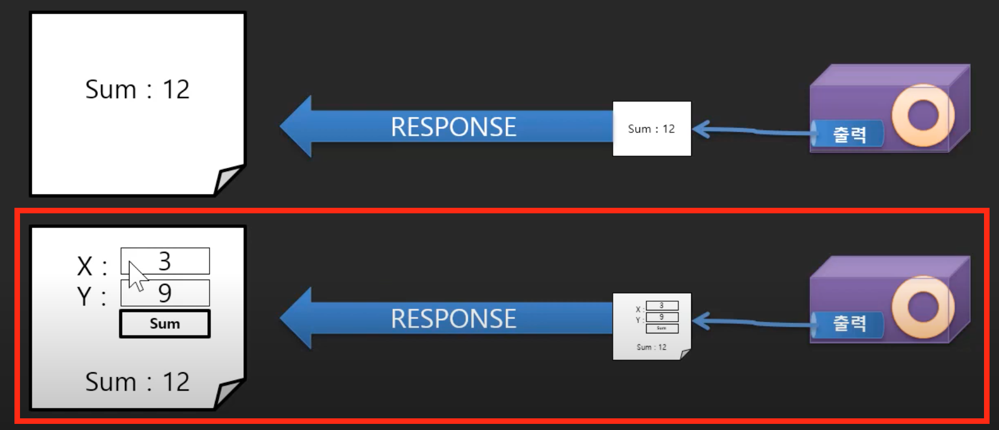

### 서블릿 출력 코드에서 HTML을 출력하는 방법

- 서블릿 내에서 구현하려면 전부 코드로 직접 써줘야 됨
- 이런 번거로운 작업을 줄이자해서 만들어진게 자바쪽에서는 Jasper임

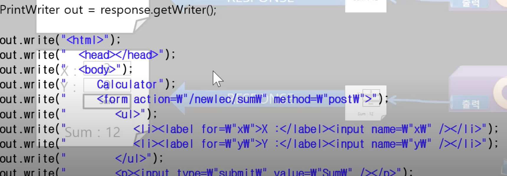

### Jasper가 만들어주는 서블릿 출력 코드

- Jasper한테 이런 html코드들 앞에 out.write()를 다 붙혀서 서블릿코드를 만들어달라고 함
- 어떻게 만드는가?
  - add.jsp
  - jsp라는 확장자를 붙여줌
  - 이렇게하면 여기에 있는 내용들을 다 출력해야햐는 것으로 인식하고 출력할 수 있는 형태로 바꿔줌
- 언제 바꿔주나?
  - add.jsp를 언제 서블릿 코드로 바꿔주는가?
  - 사용자가 이 add.jsp 페이지를 요청할 때 만들어짐
  - URL 매핑은 이 파일이름(확장자까지 포함된, add.jsp)이 됨

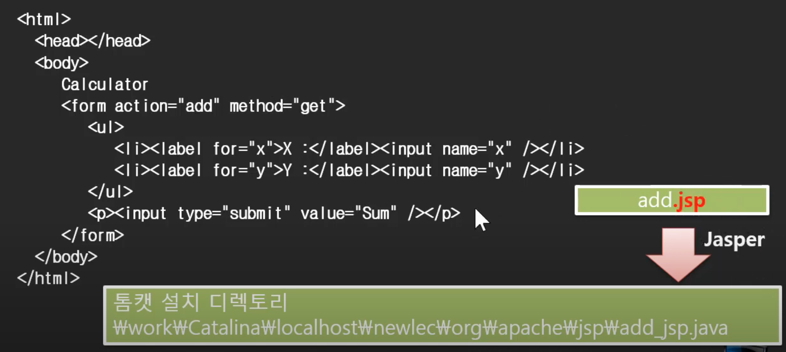

- 실제로 만들어진 서블릿 코드의 이름은 add_jsp.java
  - server탭에 있는 서버를 더블클릭하거나 오른쪽을 클릭해서 open을 누르면
  - 서버 설정에 대한 내용이 나옴
  - 이클립스를 통해 코드를 수정하고 파일을 생성하고 하지만, 실제로 브라우저는 우리가 보고있는 부분을 보는게 아님
    - 우리가 코드를 고치고 생성하고 하는 부분은 개발 디렉토리임
    - 이걸 실행하면 배포를 하게 됨
    - 배포하게 되면 tomcat의 홈디렉토리로 옮겨지게 됨
    - 그런데 사용하고 있는 tomcat이 다른 서비스도 운영하고 있을 수도 있기 때문에
    - 실제 톰캣의 work 디렉토리에 두지 않고, 이클립스가 관리하는 별도의 운영을 위한 복사본을 만들게 됨
    - Server Location 부분에 있는 Server Path가 임시 배포 디렉토리임
    -  ..../Servlet_JSP/workspace/.metadata/.plugins/org.eclipse.wst.server.core
    - 여기서 더 들어가면
    - tmp0/work/Catalina/localhost/ROOT/org/apache/jsp/calculator_jsp.java
      - work는 jasper가 일하는 공간
      - jasper가 만들어낸 파일들이 있음
- calculator_jsp.java을 열어서 보면
  - 이렇게 다 out.write()를 다 붙여줬음

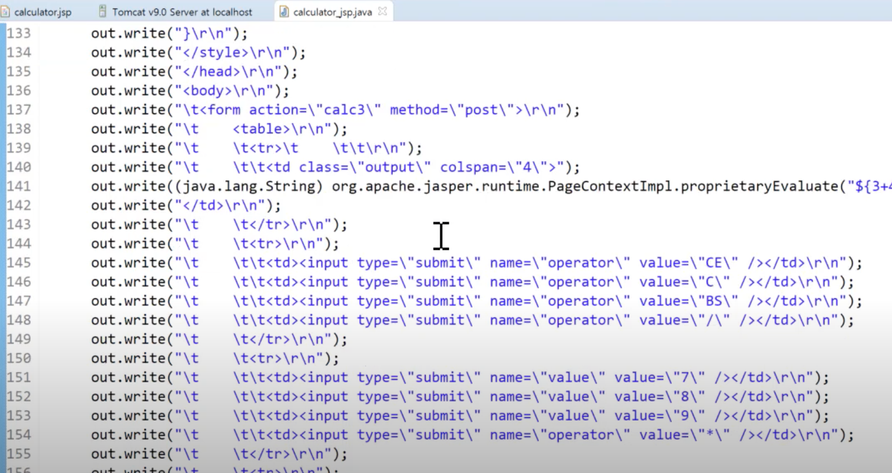

### Jasper를 이용한 코드 작성 방법

- 만약 jsp파일에서 변수를 선언하고 싶다고하면 어떻게해야할까?
  - 출력하기를 원하는게 아니라 서블릿 내에서 동작할 수 있도록 변수를 선언하고 싶은 것임
  - 이렇게 한다고하면 될까? X
  - 아무런 표시없이 적어주면 Jasper는 코드로 인식을 못함
  - 그냥 write를 붙여줘버림

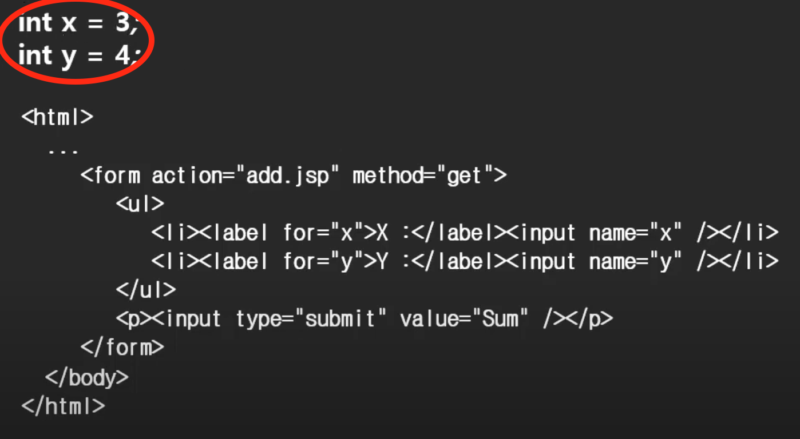

- 코드 블록을 사용해야함
  - 이게 서블릿을 Jasper를 통해서 만드는 방법임
  - 앞으로 이런 코드 블록을 어떻게 이용하는지, 코드 블록의 종류가 몇가지인지, 어떻게하면 잘 활용하는 것인지 등을 공부할 것임

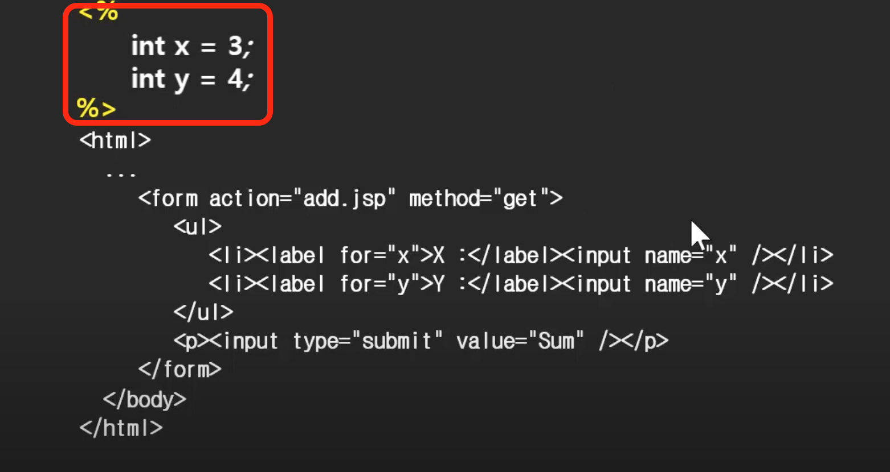

- calculator.jsp

```jsp
<%
int x = 3;
int y = 4;
%>

<!DOCTYPE html>
<html>
<head>
<meta charset="UTF-8">

<style>
	input{
		width:50px;
		height:50px;
	}
	.output{
		height:50px;
		background: #e9e9e9;
		font-size: 24px;
		font-weight: bold;
		text-align: right;
		padding: 0px 5px;
	}
</style>

<title>calculator</title>
</head>
<body>
	<div>
		<form action="calc3" method="post">
			<table>
				<tr>
					<td class="output" colspan="4">${3+4}</td>
				</tr>
				<tr>
					<td><input type="submit" name="operator" value="CE" /></td>
					<td><input type="submit" name="operator" value="C" /></td>
					<td><input type="submit" name="operator" value="BS" /></td>
					<td><input type="submit" name="operator" value="/" /></td>
				</tr>
				<tr>
					<td><input type="submit" name="value" value="7" /></td>
					<td><input type="submit" name="value" value="8" /></td>
					<td><input type="submit" name="value" value="9" /></td>
					<td><input type="submit" name="operator" value="*" /></td>
				</tr>
				<tr>
					<td><input type="submit" name="value" value="4" /></td>
					<td><input type="submit" name="value" value="5" /></td>
					<td><input type="submit" name="value" value="6" /></td>
					<td><input type="submit" name="operator" value="-" /></td>
				</tr>
				<tr>
					<td><input type="submit" name="value" value="1" /></td>
					<td><input type="submit" name="value" value="2" /></td>
					<td><input type="submit" name="value" value="3" /></td>
					<td><input type="submit" name="operator" value="+" /></td>
				</tr>
				<tr>
					<td></td>
					<td><input type="submit" name="value" value="0" /></td>
					<td><input type="submit" name="dot" value="." /></td>
					<td><input type="submit" name="operator" value="=" /></td>
				</tr>
			</table>
		</form>
	</div>
</body>
</html>
```


## 41. JSP의 코드 블록

- Jasper를 통해 간접적으로 서블릿을 만들 때, 자바 코드를 끼워넣고 싶다면, 코드 블록을 사용해야함
- 몇가지 코드 블록 지시방법에 대해 알아보자

### 코드 블록의 종류1 : 출력 코드

- 아무것도 안했을 경우
- 출력하게 됨

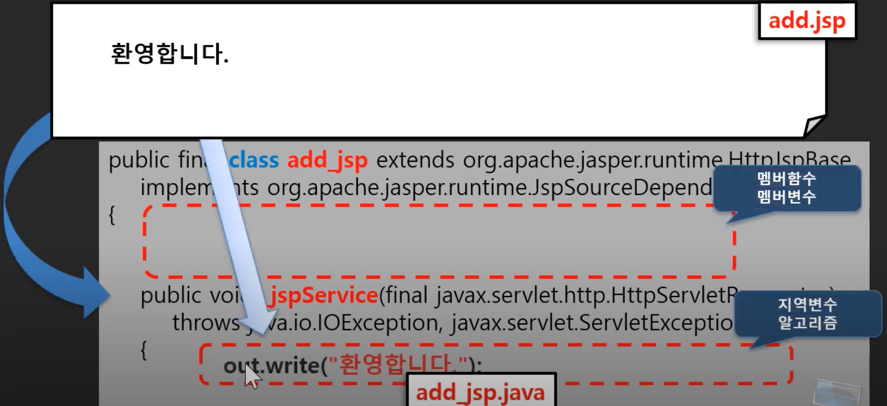

### 코드 블록의 종류2 : 코드 블록

- 코드 블록을 사용
- 자바 코드로 들어가게 됨 

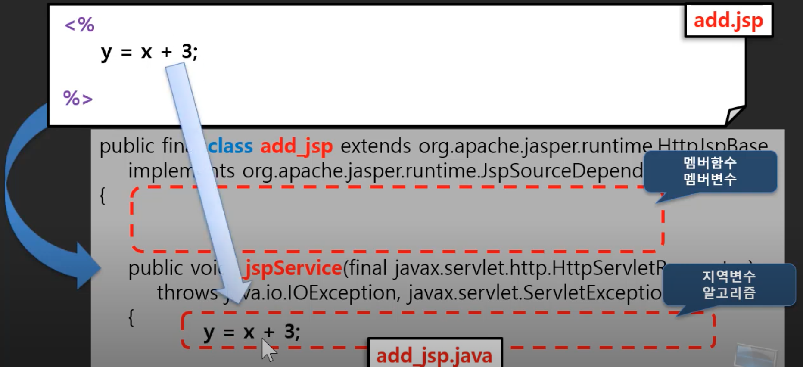

### 코드 블록의 종류3 : 코드 블록

- 출력을 하되, 선언했던 변수도 함께 출력하고 싶은 경우
- 코드 블록안에 out.print()를 사용해서 출력하는 자바 코드를 넣어줌

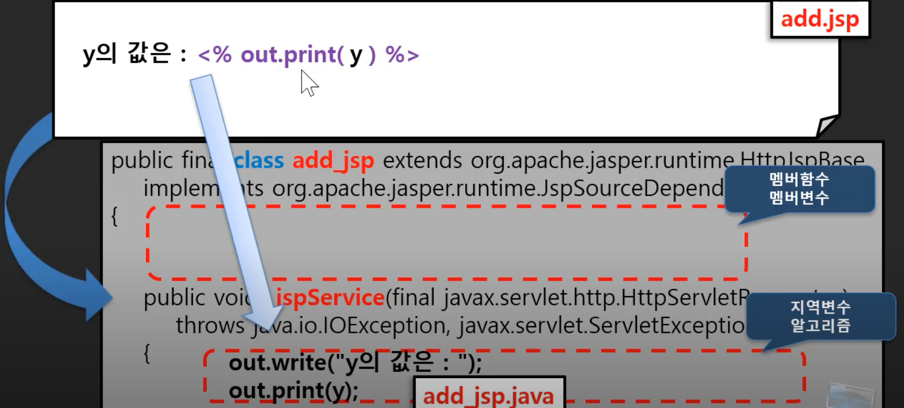

- 이때, 변수 출력을 위해서 코드 블록안에 출력문을 일일히 넣어주는 것은 번거롭기 때문에 다음과 같은 방식을 사용할 수 있음
  - <%= 변수 %>
  - 이런식으로 표현하면 위의 방법과 동일한 결과가 나옴

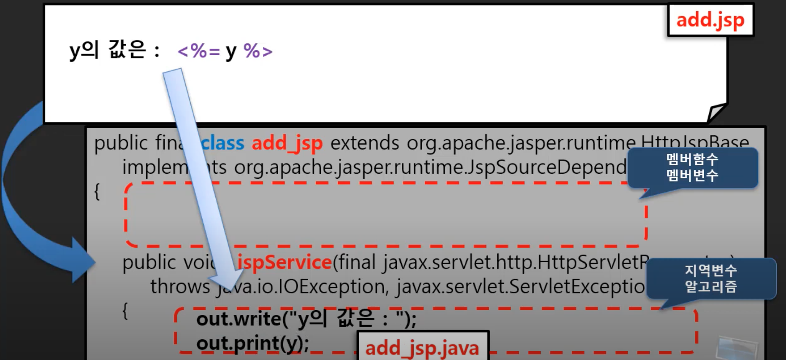

### 코드 블록의 종류 4 : 선언부(Declaration)

- service함수 안이 아니라 밖에, 클래스의 멤버함수와 멤버변수로써 선언하고자할 때
- <%! 자바 코드 %>

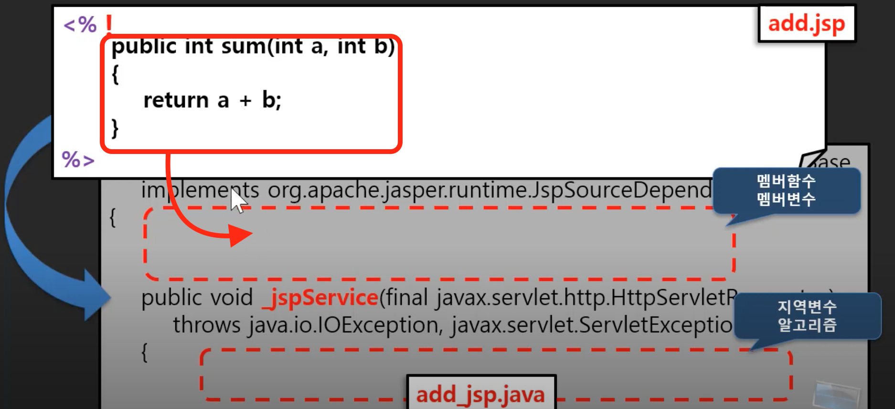

### 코드 블록의 종류5 : 초기 설정을 위한 Page 지시자

- 자바 코드가 아니라 페이지에 대한 정보를 나타내고 있음
  - key와 value로 나타내어진 데이터임
  - 어떤 형태의 인코딩 방식을 사용할 것인지, 컨텐트 타입은 무엇인지 등을 지시하는 것
- 이는 코드 블록이라고하지 않고 Page 지시자 블록이라고 함

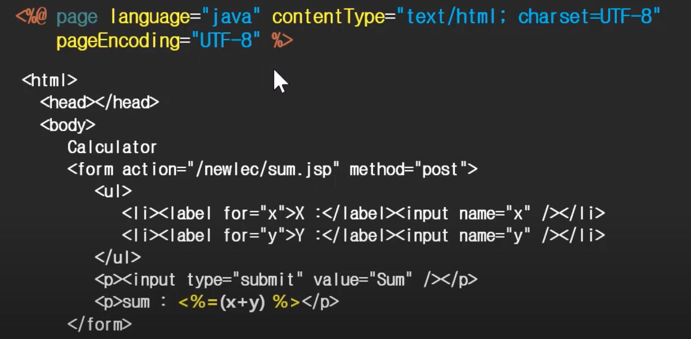

- 왜 이런 지시 블록이 필요한가?
  - 과거에는 response를 사용하기 전에 이런것들을 써줘서 인코딩 설정을 해줬었음
  - response.setCharacterEncoding("UTF-8");
  - response.setContentType("text/html; charser=UTF-8");
  - 이를 코드 블록으로 할 수 있지 않나?
    - 이렇게 하면 에러가 나옴
      - 이미 출력이 진행된 다음에 설정하는 것은 잘못된 것이다라는 오류
      - 이 코드 블록이 실행되기전에 위쪽에서 하나라도 출력되는 부분이 있다는 말임
      - 그래서 어쩔 수 없이 코드 지시자를 써야함

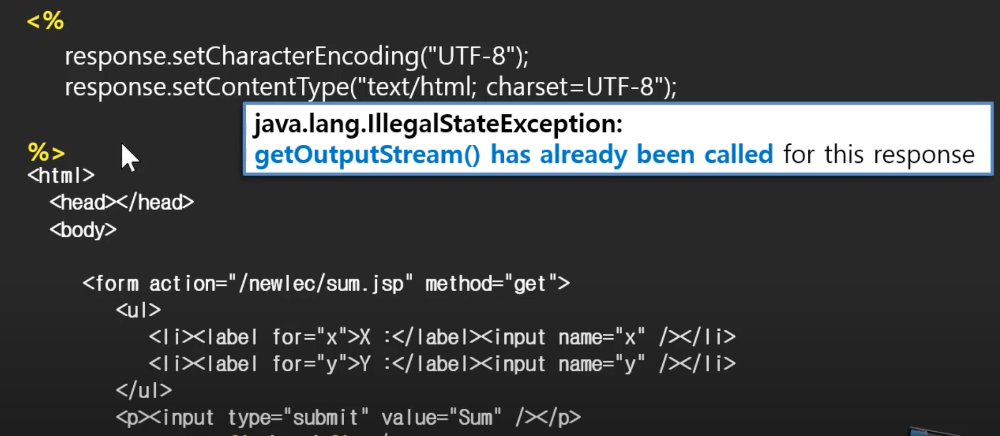


## 42. JSP의 내장객체 간단히 알아보기

### 코드 블록의 내장 객체

- jsp로 코드를 작성하며 Jasper가 서블릿을 만들어주는데 이때 고려해야되는 부분이 있음
- 내가 jsp파일에 작성한 코드뿐만아니라 Jasper가 만든 서블릿에도 자동으로 만들어진 코드가 존재한다는 것
- 다음과 같이 page라는 변수를 선언했을 때 오류가 발생하는 것은 이미 서블릿의 service함수에 page라는 이름의 변수가 존재하기 때문임
- 그래서 jsp를 사용하려면 자동 생성되는 서블릿의 코드를 좀 알아야됨

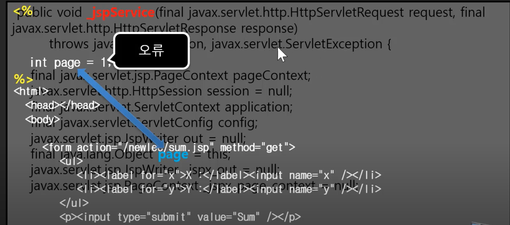

### JSP 내장 객체

- jasper에 의해 자동으로 만들어진 변수들은 다 객체를 가리키는 변수들임
- 이런 변수들을 내장 객체라고 함
- 이런 변수들이 있다는 것을 미리 알고 있어야 중복된 이름의 변수를 만들지 않을 뿐더러 jsp의 코드블록에서 이들을 적절히 활용해서 프로그램을 만들 수 있음
- 대표적으로 request, response가 있음
- application, session 객체
- pageContext
  - 페이지 내에서 임시로 데이터를 저장할 수 있도록하는 객체
  - setAttribute, getAttribute를 가지고 있음
  - application, session이 전역적으로 사용되는 데이터를 가지고 있다면 pageContext는 이 페이지 내에서만 사용되는 저장소
- config
- out
  - 출력 도구
- page
  - 페이지 자체의 객체를 참조하는 변수


### 내장 객체 request : HttpServletRequest

- 요청을 확인하고 입력을 하기 위한 도구
- 사용자가 전달한 파라미터 관련 정보, 쿠키, 요청 방식, 세션, 사용자의 IP주소, 문자셋 인코딩 설정, 헤더 정보, 쿼리 스트링 등을 알 수 있음

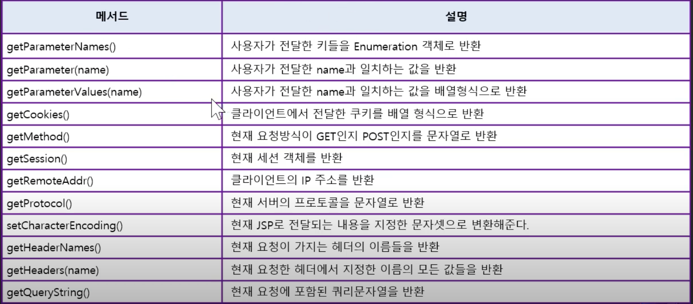 

### 내장 객체 response : HttpServletResponse

- 응답으로 보낸 때, 출력할 도구
- 쿠키 입력, redirect, 헤더정보 입력, 컨텐트 타입 입력, 상태 코드 설정 등을 할 수 있음

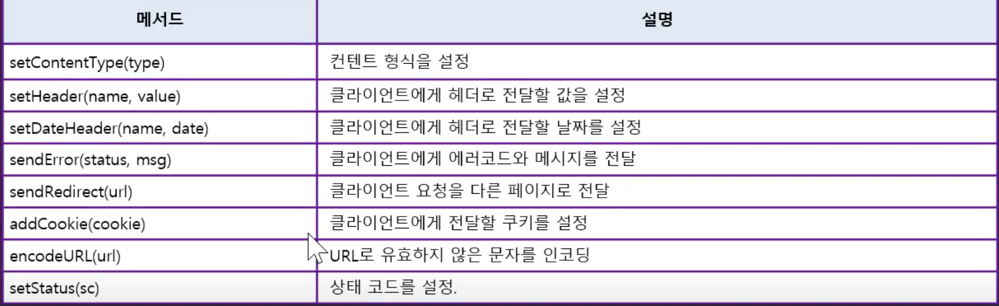

### 내장 객체 out : Java.servlet.jsp.JspWriter

- 출력할 때 사용하는 객체
- 직접 쓰는 일은 많지 않음
- 쓸 수 있지만 안씀
- 이미 jasper를 쓰고 있기 때문에 직접 out.write를 사용하는 일은 지양해야됨

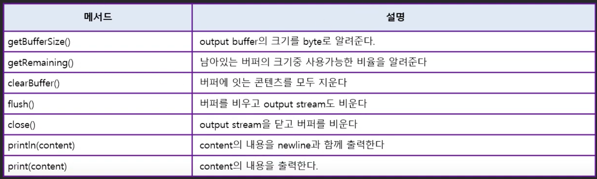

### 내장 객체 session : javax.servlet.http.HttpSession

- 생성 일자, 마지막 액세스 시간 등을 알 수 있음
- 가장 중요한 기능은 값을 설정하고 얻어낼 수 있고, 값이 저장되는 시간을 설정하고, 특정값을 삭제하는 기능 등임

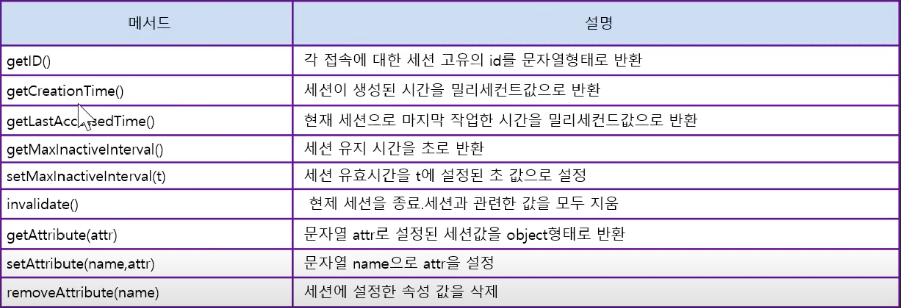

### 내장 객체 application : javax.servlet.ServletContext

- 서블릿들이 공통으로 사용할 수 있는 전역 저장소


## 43. JSP로 만드는 Hello 서블릿

- nana.jsp
  - 이전에 만들었던 Nana.java(서블릿)을 jsp로 만들어보자

```jsp
<%@ page language="java" contentType="text/html; charset=UTF-8"
    pageEncoding="UTF-8"%>
    
<%
String cnt_ = request.getParameter("cnt");

int cnt = 10;

if(cnt_ != null && !cnt_.equals("")) {
	cnt = Integer.parseInt(cnt_);
}
%>
<!DOCTYPE html>
<html>
<head>
<meta charset="UTF-8">
<title>Insert title here</title>
</head>
<body>
	<%for(int i=0; i<cnt; i++){ %>
		안녕 Servlet!!<br >
	<%} %>
</body>
</html>
```

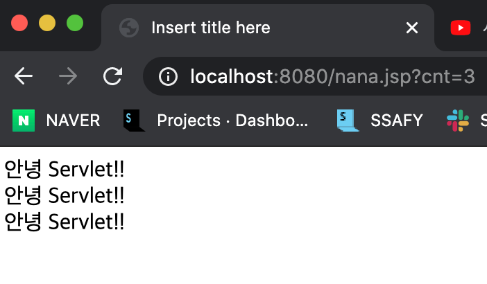


## 44. 스파게티 코드를 만드는 JSP

- JSP를 만드는 방법이 너무 다양해서 페이지를 만들다보면 간단하게 만들 수도 있지만, 복잡하게 만들 수도 있음
- 복잡하게 만들었을 경우, 그 코드를 스파게티 코드라고 하는데 그게 왜 문제가 되는지 알아보자
- 그 다음에는 스파게티 코드를 개선할 수 있는 방법에 대해 알아보자
- 일단 간단한 jsp 파일을 하나 추가해보자
- spag.jsp
  - 코드 블록을 여러 군데 순서만 맞도록해서 쓰면 오류가 나지 않음
  - 하지만, 여러 군데 코드 블록을 써서 코드를 짜다보면 다른 오류를 찾는 것이 어려워짐
  - 자바 코드를 보기가 어려워짐
  - 어떤 블록과 어떤 블록이 단일한 업무를 다루고 있는지 찾기가 쉽지 않음
  - 이런 스파게티 코드, 실타래 코드를 어떻게 하면 개선할 수 있을까?
  - 코드를 한곳에 모아서 쉽게 유지보수할 수 있는 방법을 알아보자

```jsp
<%@ page language="java" contentType="text/html; charset=UTF-8"
    pageEncoding="UTF-8"%>

<% int num = 0; %>
<!DOCTYPE html>
<html> 
<head>
<meta charset="UTF-8">
<title>Insert title here</title>
</head>
<%
	String num_ = request.getParameter("n");
	if(num_ != null && !num_.equals("")) {
		num = Integer.parseInt(num_);
	}
%>
<body>
	<% if(num%2 != 0) { %>
		홀수입니다.
	<% } else {%>
		짝수입니다.
	<% } %>
</body>
</html>
```


## 45. JSP MVC model1

- Jasper를 통해 서블릿을 만들면(jsp에 코드블록을 활용해서) 프로그램을 쉽게 만들 수 있을 것이라고 생각했지만, 자칫 잘못해서 코드블록을 복잡하게 만들면 오히려 유지보수에 더 안좋을 수 있을 것이다..
- 코드블록을 어떻게 복잡하지 않게 만들 수 있을까?
  - 그래서 나온게 'JSP MVC model1' 방식
  - 블록을 최소화하자는 것에서부터 시작됨
  - 코드블록을 위쪽에 두고, 출력해야되는 부분만 밑쪽에 넣자
  - 모델이라는 개념을 사용해서 위쪽의 코드블록에서 데이터(모델)와 로직을 다루고, 밑에쪽에서는 이 데이터를 사용해서 출력하는 방식
    - 이렇게 양분화하지 않고, 출력이라는 것을 직접 제어하려고하면 코드블록이 여러개가 만들어질 수 밖에 없음

### 일반적인 JSP 프로그래머가 구현하게 되는 코드

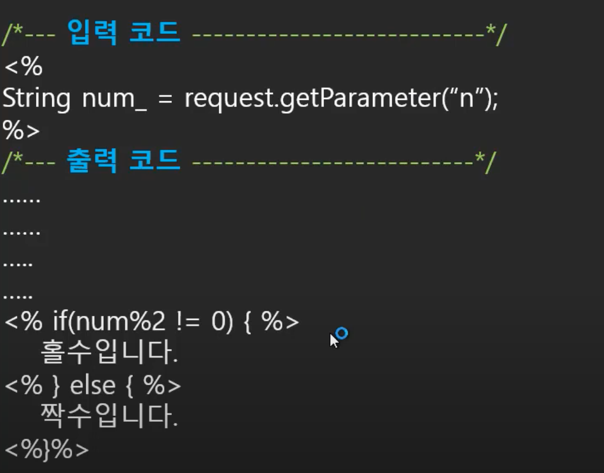

### 양분화된 JSP 코드와의 코드 블록 비교

- 왼쪽은 코드블록이 4개, 오른쪽은 코드블록이 2개(출력 코드블록까지 포함해서)
- 로직은 위쪽에서, 결과는 밑쪽에서
- 데이터와 로직을 위쪽에서 처리, 밑쪽에서는 결과로 출력만

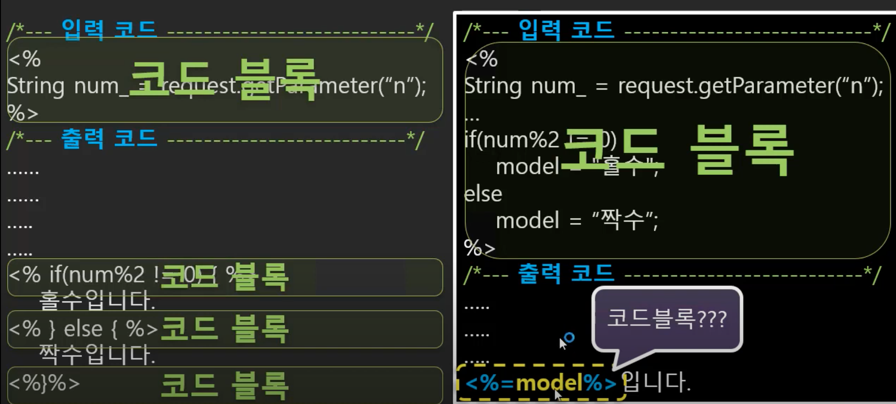

### 출력을 가볍게 만들기 위한 코드작성 방식

- 입력, 제어를 담당하는 Controller
  - 자바 코드
- 출력을 담당하는 View
  - HTML 코드 + 출력 코드 블록
- 데이터를 의미하는 Model
  - 적절한 데이터를 모델로 생각하고 코드를 짜면 이렇게 MVC 패턴으로 나눌 수 있음

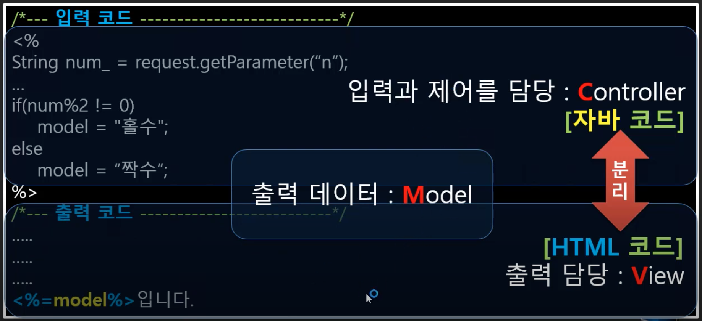

- spag.jsp

```jsp
<%@ page language="java" contentType="text/html; charset=UTF-8"
	pageEncoding="UTF-8"%>

<% 
	int num = 0; 
	String num_ = request.getParameter("n");
	if(num_ != null && !num_.equals("")) {
		num = Integer.parseInt(num_);
	}
	String result;
	if(num%2 != 0) {
		result = "홀수";
	} else {
		result = "짝수";
	}
%>
<!DOCTYPE html>
<html>
<head>
<meta charset="UTF-8">
<title>Insert title here</title>
</head>
<body>
	<%= result %>입니다.
</body>
</html>
```


## 46. JSP MVC model1을 model2 방식으로

### model 1 : 컨트롤러와 뷰가 물리적으로 분리되지 않은 방식

- 하나의 JSP 파일 내에 MVC를 모두 구현했었음
  - 하나에 다 구현하는 것이 더 바람직한지, 분리시키는 것이 바람직한지에 대해 생각하게 됨
  - 분리하는게 더 바람직하겠다

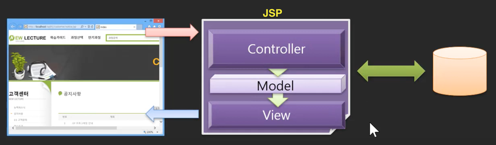

### model 2 : 컨트롤러와 뷰가 물리적으로 분리된 방식

- JSP에서 controller과 model 부분을 다시 원래대로 서블릿으로 올리고, view부분만 jsp로 남겨두자
- 이렇게되면 controller과 model 부분은 사용자의 요청이 있을 때 서블릿으로 만들어지는 것이 아님, view부분만 jsp이기 때문에 사용자의 요청에 의해 서블릿으로 바뀜
  - 서블릿으로 만들어야할 분량이 줄어듦
  - controller과 model 부분은 미리 컴파일해둘 수 있게 되면서 실행속도도 빨라지게 됨
- 자바코드부분(C, M)과 html부분(V)이 따로 존재하기 때문에 유지보수도 더 용이해짐
- 모델 1과의 가장 큰 차이는 C,M 과 V를 물리적으로 분리했는가임
- 여기에 한가지 요소가 더 있음

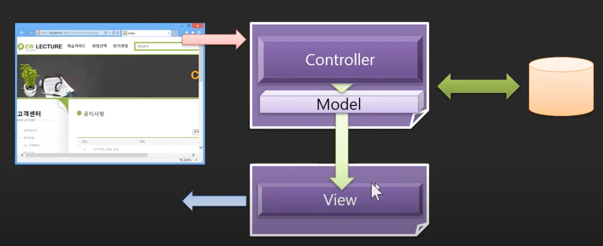

### MVC model 2 : Dispatcher를 집중화하기 전의 모델

- 컨트롤러에서 뷰단에 연결하기 위해 포워딩 방식이 사용됨
  - 컨트롤러도 서블릿이고, 뷰도 jsp이지만 서블릿으로 바뀌기 때문에 서블릿임
  - 서블릿에서 서블릿으로 이전되면서 흐름을 이어받아서 코드를 진행할 때 사용되는 것이 포워딩
  - 포워딩을 할 때, Dispatcher를 사용하게 됨
  - 그런데 컨트롤러와 뷰를 계속 만들면서 Dispatcher도 계속 같이 만들어줘야 됨

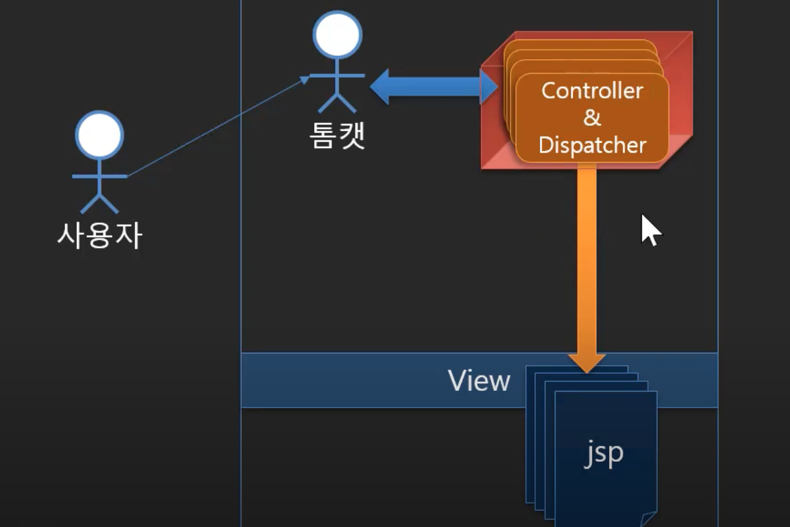

### MVC model 2 : Dispatcher를 집중화 한 후의 모델

- 컨트롤러를 따로 만들고, Dispatcher를 하나만 둬서, 실질적으로는 서블릿을 하나만 구현하게 됨
- 일반적인 업무로직(컨트롤러들)은 POJO클래스라고해서 서블릿 클래스가 아닌 일반 클래스형태로 만듦
- 사용자 요청이 들어오면 디스패처가 사용자 요청을 수반해서 적절한 컨트롤러를 찾아서 수행하는 방식으로 진행하게 됨
- 컨트롤러는 로직처리하고 관련된 뷰를 호출할 수 있도록 디스패처에게 관련된 내용을 알려줌
- 디스패처는 관련된 뷰를 호출하게 됨

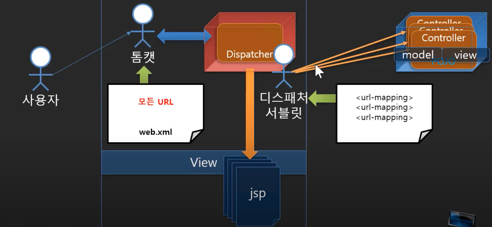

### 일단 컨트롤러와 뷰를 물리적으로 분리시키는 것부터 코드로 구현해보자

- Spag.java
  - redirect vs forward
    - redirect: 현재 작업과 전혀 상관없이 새로운 요청을 하는 것
    - forward: 현재 작업한 내용을 이어갈 수 있도록 공유하는 것
  - 상태를 저장할 수 있는 저장소(1~4: 서버 내의 저장소, 5: 클라이언트 저장소)
    - 1. page Context: 하나의 페이지 내에서 사용하는 저장소
    - 2. request: forward 관계의 둘 사이에서 사용하는 저장소 
    - 3. session: 현재 session에서 공유될 수 있는 저장소 
    - 4. application: 모든 session, 모든 페이지에서 공유될 수 있는 저장소 
    - 5. cookie: 클라이언트에 저장할 수 있는 저장소
  - forward 관계에 있는 둘 사이에 공유할 수 있는 저장소로는 request가 사용됨

```java
package com.reynold.web;

import java.io.IOException;

import javax.servlet.RequestDispatcher;
import javax.servlet.ServletException;
import javax.servlet.annotation.WebServlet;
import javax.servlet.http.HttpServlet;
import javax.servlet.http.HttpServletRequest;
import javax.servlet.http.HttpServletResponse;

@WebServlet("/spag")
public class Spag extends HttpServlet {
	@Override
	protected void doGet(HttpServletRequest request, HttpServletResponse response) throws ServletException, IOException {
		int num = 0; 
		String num_ = request.getParameter("n");
		if(num_ != null && !num_.equals("")) {
			num = Integer.parseInt(num_);
		}
		String result;
		
		if(num%2 != 0) {
			result = "홀수";
		} else {
			result = "짝수";
		}
		
    // request에 result 값 저장
		request.setAttribute("result", result);
		
    // forward로 spag.jsp와 연결 및 요청
		RequestDispatcher dispatcher = request.getRequestDispatcher("spag.jsp");
		dispatcher.forward(request, response);
	}
}

```

- spag.jsp
  - request로 받은 result를 출력

```jsp
<%@ page language="java" contentType="text/html; charset=UTF-8"
	pageEncoding="UTF-8"%>
<!DOCTYPE html>
<html>
<head>
<meta charset="UTF-8">
<title>Insert title here</title>
</head>
<body>
	<%=request.getAttribute("result") %>입니다.
</body>
</html>
```

- 물리적으로 분리는 됐지만, spag.jsp를 보면 아직 코드블록이 남아있음
  - 이 부분을 완전히 없애기 위한 EL 표기법에 대해 알아보자


## 47. View를 위한 데이터 추출 표현식, EL(Expression Language)

### EL(Expression Language)

#### 저장 객체에서 값을 추출해서 출력하는 표현식

- 값을 출력하기 위해서는 <%=request.getAttribute("result") %> 이렇게 썼어야했는데
- ${cnt} 이렇게만해도 되도록 해줌

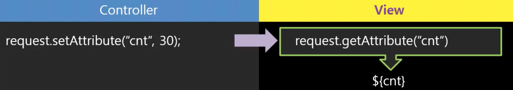

- spag.jsp

```jsp
<%@ page language="java" contentType="text/html; charset=UTF-8"
	pageEncoding="UTF-8"%>
<!DOCTYPE html>
<html>
<head>
<meta charset="UTF-8">
<title>Insert title here</title>
</head>
<body>
	<%=request.getAttribute("result") %>입니다.
	${result}입니다.
</body>
</html>
```

- 결과

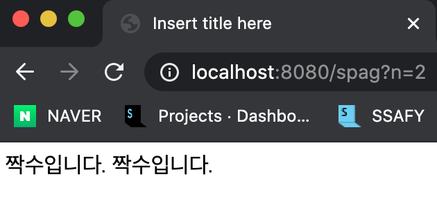

### 값 하나가 아니라 배열처럼 복잡한 구조라면?

- 배열은?

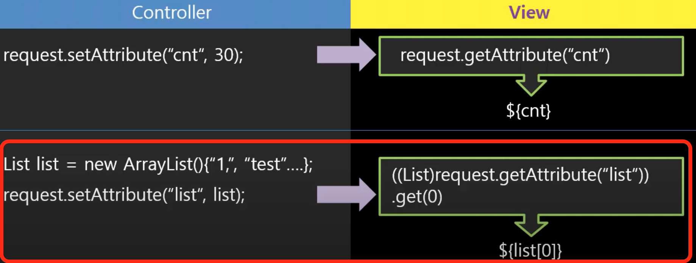

- Map은?

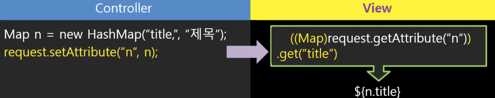

- Spag.java

```java
package com.reynold.web;

import java.io.IOException;
import java.util.HashMap;
import java.util.Map;

import javax.servlet.RequestDispatcher;
import javax.servlet.ServletException;
import javax.servlet.annotation.WebServlet;
import javax.servlet.http.HttpServlet;
import javax.servlet.http.HttpServletRequest;
import javax.servlet.http.HttpServletResponse;

@WebServlet("/spag")
public class Spag extends HttpServlet {
	@Override
	protected void doGet(HttpServletRequest request, HttpServletResponse response) throws ServletException, IOException {
		int num = 0; 
		String num_ = request.getParameter("n");
		if(num_ != null && !num_.equals("")) {
			num = Integer.parseInt(num_);
		}
		String result;
		
		if(num%2 != 0) {
			result = "홀수";
		} else {
			result = "짝수";
		}
		// 값 하나
		request.setAttribute("result", result);
		// 배열
		String[] names = {"reynold", "dragon"};
		request.setAttribute("names", names);
		// 맵
		Map<String, Object> notice = new HashMap<String, Object>();
		notice.put("id", 1);
		notice.put("title", "EL은 좋아요");
		request.setAttribute("notice", notice);
		
		RequestDispatcher dispatcher = request.getRequestDispatcher("spag.jsp");
		dispatcher.forward(request, response);
	}
}

```

- spag.jsp

```jsp
<%@ page language="java" contentType="text/html; charset=UTF-8"
	pageEncoding="UTF-8"%>


<!DOCTYPE html>
<html>
<head>
<meta charset="UTF-8">
<title>Insert title here</title>
</head>
<body>
	<%=request.getAttribute("result") %>입니다.
	${result}입니다.<br>
	${names[0]}
	${names[1]}<br>
	${notice.id}
	${notice.title}<br>
</body>
</html>
```

- 결과

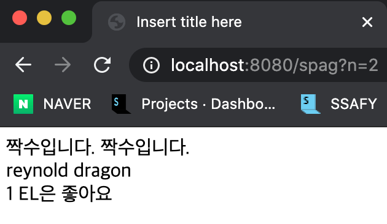

- 그렇다면 EL의 저장소, 저장소의 우선순위, 데이터를 꺼낼 때 주의사항 등에 대해 알아보자


## 48. EL의 데이터 저장소

### 저장 객체에서 값을 추출하는 순서

- request라는 저장소에 값을 넣었는데, EL은 사실 request 저장소에서만 키워드를 검색해서 가져오는게 아님
- 서버 상에 존재하는 4개의 저장소가 있음
  - page 객체
  - request 객체
  - session 객체
  - application 객체
- page 객체를 통해서도 EL 표현식으로 값을 꺼내올 수 있음
- spag.jsp
  - pageContext.setAttribute("aa", "hello"); 를 사용해서 값을 저장하고
  - ${aa} 를 통해 출력할 수 있음

```jsp
<%@ page language="java" contentType="text/html; charset=UTF-8"
	pageEncoding="UTF-8"%>
<!DOCTYPE html>
<html>
<head>
<meta charset="UTF-8">
<title>Insert title here</title>
</head>
<%
pageContext.setAttribute("aa", "hello");
%>
<body>
	<%=request.getAttribute("result") %>입니다.
	${result}입니다.<br>
	${names[0]}
	${names[1]}<br>
	${notice.id}
	${notice.title}<br>
	${aa}
</body>
</html>
```

- 그러면 만약 page, request, session, application 저장소에서 전부 cnt로 값을 넣었다고 하면, ${cnt}를 했을 때, 어떤 값이 나올까?
- 우선순위가 존재함
  - Page > request > session > application 순임
  - 이런 우선순위 때문에 page에 cnt 값이 있으면 뒤쪽 저장소의 cnt들을 꺼내올수가 없게 됨
- 이런 문제를 해결하기 위해 범위를 지정해주고 그 저장소에서만 찾게해주는 내장 객체가 있음

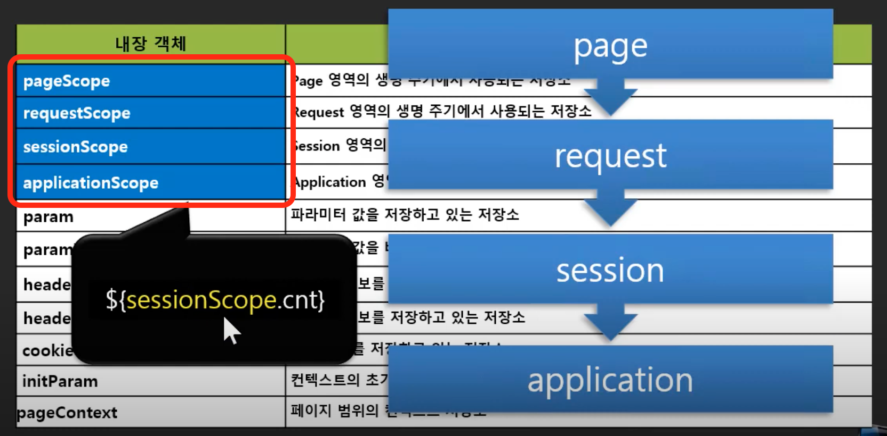

### 코드로 테스트해보자

- spag.jsp

```jsp
<%@ page language="java" contentType="text/html; charset=UTF-8"
	pageEncoding="UTF-8"%>
<!DOCTYPE html>
<html>
<head>
<meta charset="UTF-8">
<title>Insert title here</title>
</head>
<%
pageContext.setAttribute("result", "hello");
%>
<body>
	<%=request.getAttribute("result") %>입니다.
	${result}입니다.<br>
	${names[0]}
	${names[1]}<br>
	${notice.id}
	${notice.title}<br>
	<br>
	request의 result ===> ${requestScope.result}<br>
	page의 result ===> ${result}
</body>
</html>
```

- 결과

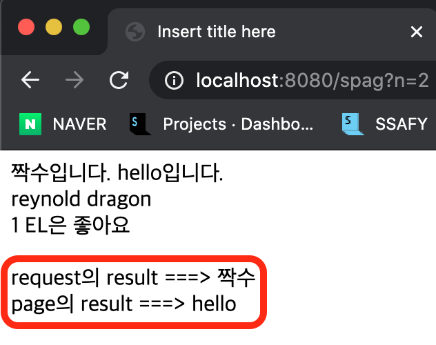

### EL 표기는 앞서 말한 4대 저장소말고도 사용할 수 있는 내장객체들이 있음

- ${param.cnt}
- ${header.host}
- ${header["host"]}
  - 변수의 이름이 변수 명명 규칙에 벗어났을 때 사용
  - 예를 들면, 대쉬나 띄워쓰기가 들어갔을 경우 등
- ...
- 이런식으로 사용할 수 있음


- spag.jsp

```jsp
<%@ page language="java" contentType="text/html; charset=UTF-8"
	pageEncoding="UTF-8"%>
<!DOCTYPE html>
<html>
<head>
<meta charset="UTF-8">
<title>Insert title here</title>
</head>
<%
pageContext.setAttribute("result", "hello");
%>
<body>
	<%=request.getAttribute("result") %>입니다.
	${result}입니다.<br>
	${names[0]}
	${names[1]}<br>
	${notice.id}
	${notice.title}<br>
	<br>
	request의 result ===> ${requestScope.result}<br>
	page의 result ===> ${result}
	<br>
	<br>
	${param.n}<br>
	${header.accept}<br>
</body>
</html>
```

- 결과

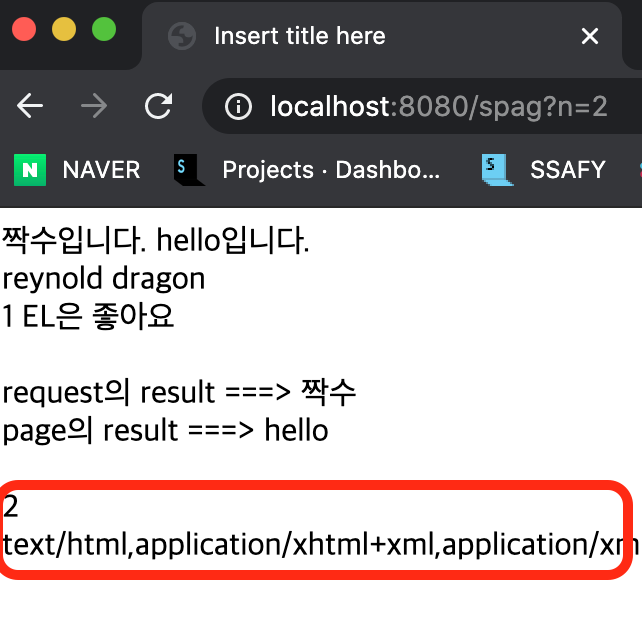

- pageContext
  - EL에서는 함수를 호출하는 형태는 안됨
  - 다만, get함수만 쓸 수 있음. 단, 메소드 호출의 느낌을 없애기 위해
  - get과 괄호를 없애고 속성처럼 써야함 

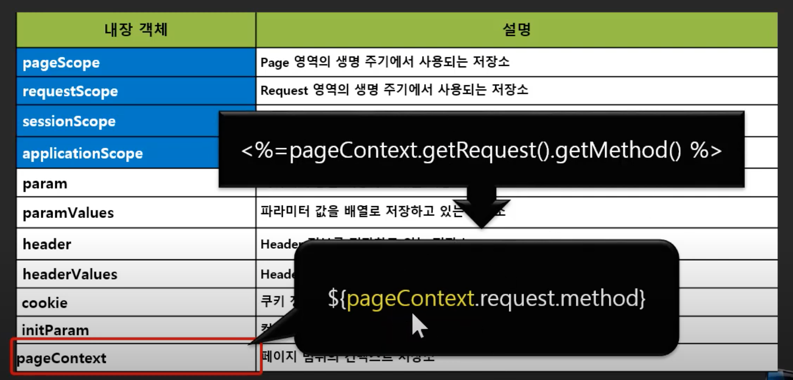


## 49. EL의 연산자

- 연산자
  - empty
    - null이거난 빈문자열이거나
  - /
    - 정수 / 정수 이렇게해도 결과가 소숫점으로 출력됨

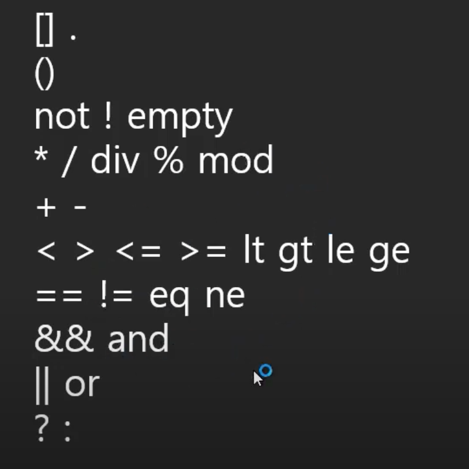

- 사용예시

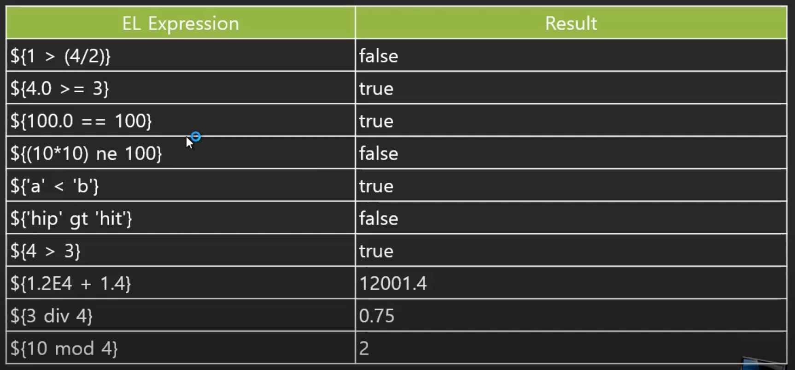

- spaq.jsp

```jsp
<%@ page language="java" contentType="text/html; charset=UTF-8"
	pageEncoding="UTF-8"%>
<!DOCTYPE html>
<html>
<head>
<meta charset="UTF-8">
<title>Insert title here</title>
</head>
<%
pageContext.setAttribute("result", "hello");
%>
<body>
	<%=request.getAttribute("result") %>입니다.
	${result}입니다.<br>
	${names[0]}
	${names[1]}<br>
	${notice.id}
	${notice.title}<br>
	<br>
	request의 result ===> ${requestScope.result}<br>
	page의 result ===> ${result}
	<br>
	<br>
	${param.n}<br>
	${header.accept}<br>
	<br>
	${param.n <= 3}<br>
	${param.n gt 3}<br>
	${not empty param.n ? param.n : '값이 비어 있습니다.'}<br>
	${param.n/3}<br>
	
</body>
</html>
```

- 결과

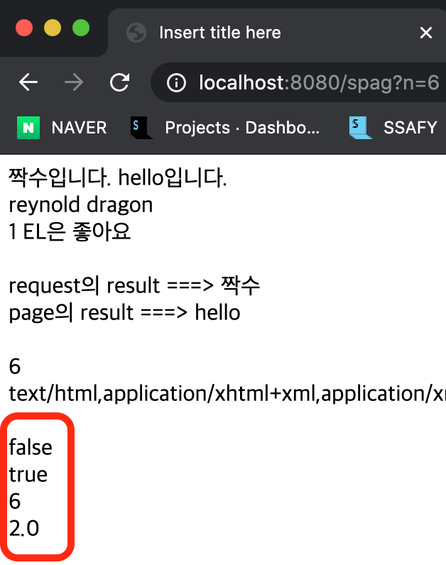


## 50. 수업용 프로젝트 준비하기

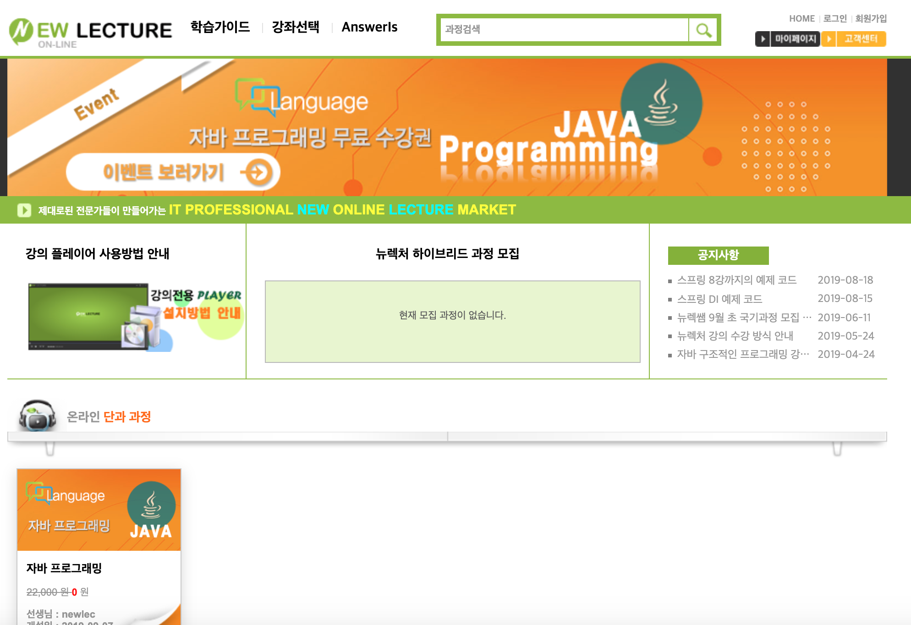


## 51. JSP를 이용해서 자바 웹 프로그램 만들기 시작

### Jasper를 이용한 코드 작성 방법

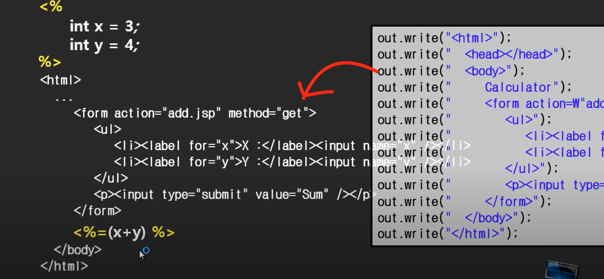

### 코드 블록 4종류


### 모든 jsp 페이지에 한글 깨짐을 방지하기 위한 페이지 지시자 등록

#### 페이지 상단에 <%@ page ... %> 블록을 이용해서 UTF-8 설정하기

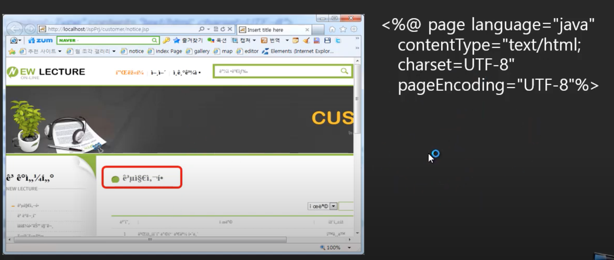

- notice/list.jsp
  - 맨 위쪽에 인코딩 설정해주기
  - 중간에 공지사항 리스트를 반복문을 사용해서 출력하기

```jsp
<%@ page language="java" contentType="text/html; charset=UTF-8"
    pageEncoding="UTF-8"%>
<!---생략---->
					<% for(int i=0; i<10; i++){%>
							
					<tr>
						<td><%= i+1 %></td>
						<td class="title indent text-align-left"><a href="detail.html">스프링 8강까지의 예제 코드</a></td>
						<td>newlec</td>
						<td>
							2019-08-18		
						</td>
						<td>146</td>
					</tr>
							
					<% }%>
<!---생략---->
```

- 결과

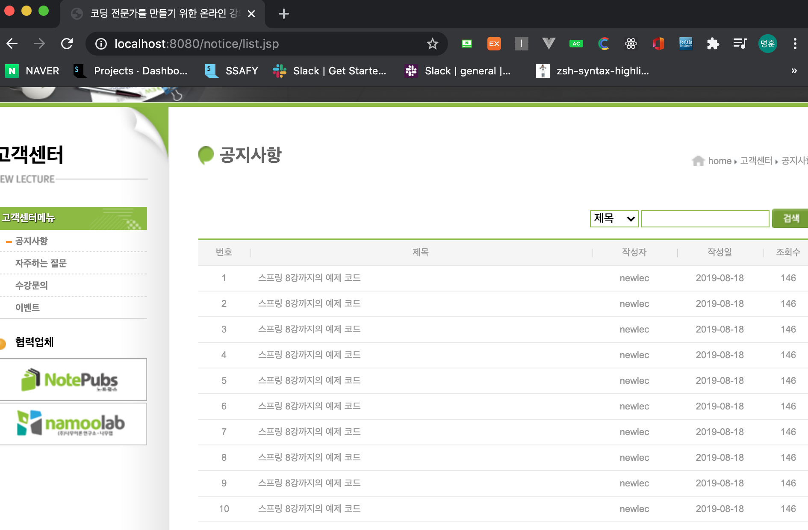


## 52. JDBC를 이용해 글 목록 구현하기

- NOTICE 데이터 삽입
  - ID는 트리거로 설정되어있어서 자동으로 증가함
  - ID를 직접 수정해주자

```sql
insert into notice(title, writer_id, content, hit, files) values('JDBC란 무엇인가?', 'okay', 'aaa', 1, '');
insert into notice(title, writer_id, content, hit, files) values('JDBC 드라이버 다운로드 방법', 'newlec', 'aaa', 10, '');
insert into notice(title, writer_id, content, hit, files) values('전화주시기 바랍니다.', 'newlec', '연락처 남깁니다. 010-2222-2333', 22, '');
insert into notice(title, writer_id, content, hit, files) values('Service 계층 추가하기', 'dragon', 'aaa', 1, '');
insert into notice(title, writer_id, content, hit, files) values('JSP에서 JDBC 사용하기', 'newlec', 'soso', 33, '');
insert into notice(title, writer_id, content, hit, files) values('파라미터를 가지는 문장 실행하기', 'okay', 'aaa', 1, '');
insert into notice(title, writer_id, content, hit, files) values('추가요', 'dragon', 'aaa', 44, '');
insert into notice(title, writer_id, content, hit, files) values('디엔드', 'okay', 'aaa', 55, '');
```

- list.jsp
  - DB에 연결하고 반복문도 수정해줬지만, 실행했을 때 오류가 발생함

```jsp
<%@page import="java.sql.ResultSet"%>
<%@page import="java.sql.Statement"%>
<%@page import="java.sql.DriverManager"%>
<%@page import="java.sql.Connection"%>
<%@ page language="java" contentType="text/html; charset=UTF-8"
    pageEncoding="UTF-8"%>
    

<%
	String url = "jdbc:oracle:thin:@localhost:1521/xepdb1";
	String sql = "SELECT * FROM NOTICE";
	
	Class.forName("oracle.jdbc.driver.OracleDriver");
	Connection con = DriverManager.getConnection(url, "NEWLEC", "1234");
	Statement st = con.createStatement();
	ResultSet rs = st.executeQuery(sql);
%>

<!DOCTYPE html>
<html>

<head>
    <title>코딩 전문가를 만들기 위한 온라인 강의 시스템</title>
    <meta charset="UTF-8">
    <title>공지사항목록</title>
    
    <link href="/css/customer/layout.css" type="text/css" rel="stylesheet" />
    <style>
    
        #visual .content-container{	
            height:inherit;
            display:flex; 
            align-items: center;
            
            background: url("../../images/customer/visual.png") no-repeat center;
        }
    </style>
</head>

<body>
    <!-- header 부분 -->

    <header id="header">
        
        <div class="content-container">
            <!-- ---------------------------<header>--------------------------------------- -->

            <h1 id="logo">
                <a href="/index.html">
                    

                </a>
            </h1>

            <section>
                <h1 class="hidden">헤더</h1>

                <nav id="main-menu">
                    <h1>메인메뉴</h1>
                    <ul>
                        <li><a href="/guide">학습가이드</a></li>

                        <li><a href="/course">강좌선택</a></li>
                        <li><a href="/answeris/index">AnswerIs</a></li>
                    </ul>
                </nav>

                <div class="sub-menu">

                    <section id="search-form">
                        <h1>강좌검색 폼</h1>
                        <form action="/course">
                            <fieldset>
                                <legend>과정검색필드</legend>
                                <label>과정검색</label>
                                <input type="text" name="q" value="" />
                                <input type="submit" value="검색" />
                            </fieldset>
                        </form>
                    </section>

                    <nav id="acount-menu">
                        <h1 class="hidden">회원메뉴</h1>
                        <ul>
                            <li><a href="/index.html">HOME</a></li>
                            <li><a href="/member/login.html">로그인</a></li>
                            <li><a href="/member/agree.html">회원가입</a></li>
                        </ul>
                    </nav>

                    <nav id="member-menu" class="linear-layout">
                        <h1 class="hidden">고객메뉴</h1>
                        <ul class="linear-layout">
                            <li><a href="/member/home"></a></li>
                            <li><a href="/notice/list.html"></a></li>
                        </ul>
                    </nav>

                </div>
            </section>

        </div>
        
    </header>

	<!-- --------------------------- <visual> --------------------------------------- -->
	<!-- visual 부분 -->
	
	<div id="visual">
		<div class="content-container"></div>
	</div>
	<!-- --------------------------- <body> --------------------------------------- -->
	<div id="body">
		<div class="content-container clearfix">

			<!-- --------------------------- aside --------------------------------------- -->
			<!-- aside 부분 -->


			<aside class="aside">
				<h1>고객센터</h1>

				<nav class="menu text-menu first margin-top">
					<h1>고객센터메뉴</h1>
					<ul>
						<li><a class="current"  href="/customer/notice">공지사항</a></li>
						<li><a class=""  href="/customer/faq">자주하는 질문</a></li>
						<li><a class="" href="/customer/question">수강문의</a></li>
						<li><a class="" href="/customer/event">이벤트</a></li>
						
					</ul>
				</nav>


	<nav class="menu">
		<h1>협력업체</h1>
		<ul>
			<li><a target="_blank" href="http://www.notepubs.com"></a></li>
			<li><a target="_blank" href="http://www.namoolab.com"></a></li>
						
		</ul>
	</nav>
					
			</aside>
			<!-- --------------------------- main --------------------------------------- -->


		<main class="main">
			<h2 class="main title">공지사항</h2>
			
			<div class="breadcrumb">
				<h3 class="hidden">경로</h3>
				<ul>
					<li>home</li>
					<li>고객센터</li>
					<li>공지사항</li>
				</ul>
			</div>
			
			<div class="search-form margin-top first align-right">
				<h3 class="hidden">공지사항 검색폼</h3>
				<form class="table-form">
					<fieldset>
						<legend class="hidden">공지사항 검색 필드</legend>
						<label class="hidden">검색분류</label>
						<select name="f">
							<option  value="title">제목</option>
							<option  value="writerId">작성자</option>
						</select> 
						<label class="hidden">검색어</label>
						<input type="text" name="q" value=""/>
						<input class="btn btn-search" type="submit" value="검색" />
					</fieldset>
				</form>
			</div>
			
			<div class="notice margin-top">
				<h3 class="hidden">공지사항 목록</h3>
				<table class="table">
					<thead>
						<tr>
							<th class="w60">번호</th>
							<th class="expand">제목</th>
							<th class="w100">작성자</th>
							<th class="w100">작성일</th>
							<th class="w60">조회수</th>
						</tr>
					</thead>
					<tbody>
					
					<% while(rs.next()){ %>
							
					<tr>
						<td><%= rs.getInt("ID") %></td>
						<td class="title indent text-align-left"><a href="detail.html"><%= rs.getString("TITLE") %></a></td>
						<td><%= rs.getString("WRITER_ID") %></td>
						<td>
							<%= rs.getDate("REGDATE") %>		
						</td>
						<td><%= rs.getInt("HIT") %></td>
					</tr>
							
					<% }%>
					
					
					</tbody>
				</table>
			</div>
			
			<div class="indexer margin-top align-right">
				<h3 class="hidden">현재 페이지</h3>
				<div><span class="text-orange text-strong">1</span> / 1 pages</div>
			</div>

			<div class="margin-top align-center pager">	
		
	<div>
		
		
		<span class="btn btn-prev" onclick="alert('이전 페이지가 없습니다.');">이전</span>
		
	</div>
	<ul class="-list- center">
		<li><a class="-text- orange bold" href="?p=1&t=&q=" >1</a></li>
				
	</ul>
	<div>
		
		
			<span class="btn btn-next" onclick="alert('다음 페이지가 없습니다.');">다음</span>
		
	</div>
	
			</div>
		</main>
		
			
		</div>
	</div>

    <!-- ------------------- <footer> --------------------------------------- -->


        <footer id="footer">
            <div class="content-container">
                <h2 id="footer-logo"></h2>
    
                <div id="company-info">
                    <dl>
                        <dt>주소:</dt>
                        <dd>서울특별시 </dd>
                        <dt>관리자메일:</dt>
                        <dd>admin@newlecture.com</dd>
                    </dl>
                    <dl>
                        <dt>사업자 등록번호:</dt>
                        <dd>111-11-11111</dd>
                        <dt>통신 판매업:</dt>
                        <dd>신고제 1111 호</dd>
                    </dl>
                    <dl>
                        <dt>상호:</dt>
                        <dd>뉴렉처</dd>
                        <dt>대표:</dt>
                        <dd>홍길동</dd>
                        <dt>전화번호:</dt>
                        <dd>111-1111-1111</dd>
                    </dl>
                    <div id="copyright" class="margin-top">Copyright ⓒ newlecture.com 2012-2014 All Right Reserved.
                        Contact admin@newlecture.com for more information</div>
                </div>
            </div>
        </footer>
    </body>
    
    </html>
    
    <% 
    rs.close();
	st.close();
	con.close();
    %>
```

- 오류 내용
  - JDBC 드라이버를 찾지 못함
  - JDBC 드라이버 라이브러리를 사용할 수 있도록 설정해줘야함
  - JDBC 공부할 때는 로컬에서 돌리는 프로그램이었기 때문에 jar를 단순히 Path 설정만해줘도 됐지만, 웹에서는 다름
  - 웹은 톰캣을 통해서 배포가 되고, 다른 환경에서 배포될 수도 있기 때문에 jar를 함께 배포할 수 있도록 포함시켜야됨

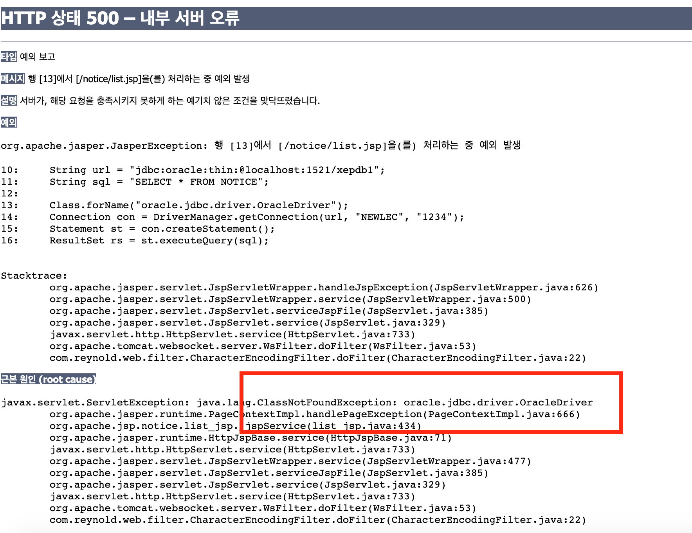

- 오류 해결
  - lib에 넣어주자

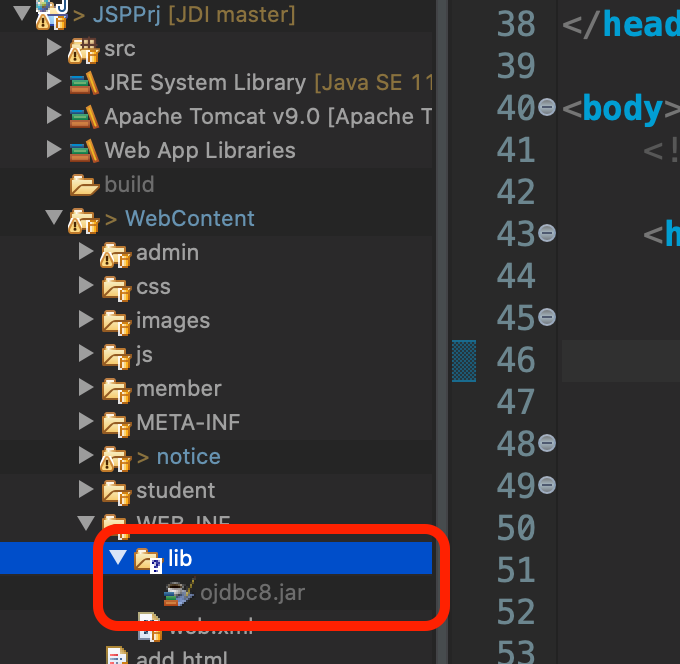


## 참고

- 유튜브 채널 뉴렉처


