# JSP 학습 2


## 53. 자세한 페이지 구현하기

### 목록 페이지와 자세한 페이지

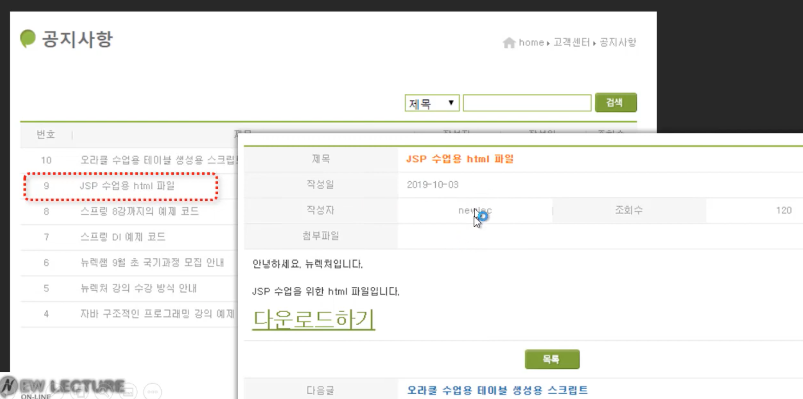

- list.jsp
  - 파라미터로 id를 전달해주자

```jsp
<% while(rs.next()){ %>
							
					<tr>
						<td><%= rs.getInt("ID") %></td>
						<td class="title indent text-align-left"><a href="detail.jsp?id=<%= rs.getInt("ID") %>"><%= rs.getString("TITLE") %></a></td>
						<td><%= rs.getString("WRITER_ID") %></td>
						<td>
							<%= rs.getDate("REGDATE") %>		
						</td>
						<td><%= rs.getInt("HIT") %></td>
					</tr>
							
					<% }%>
```

- detail.jsp
  - select문으로 id에 해당하는 게시글을 가져옴
  - 결과를 적절한 위치에서 보여줄 수 있도록 해줌
  - 목록 버튼을 누르면 list.jsp로 가도록 링크 수정

```jsp
<%@page import="java.sql.PreparedStatement"%>
<%@page import="java.sql.ResultSet"%>
<%@page import="java.sql.Statement"%>
<%@page import="java.sql.DriverManager"%>
<%@page import="java.sql.Connection"%>
<%@ page language="java" contentType="text/html; charset=UTF-8"
    pageEncoding="UTF-8"%>

<%
	int id = Integer.parseInt(request.getParameter("id"));

	String url = "jdbc:oracle:thin:@localhost:1521/xepdb1";
	String sql = "SELECT * FROM NOTICE WHERE ID=?";
	
	Class.forName("oracle.jdbc.driver.OracleDriver");
	Connection con = DriverManager.getConnection(url, "NEWLEC", "1234");
	PreparedStatement st = con.prepareStatement(sql);
	st.setInt(1, id);
	ResultSet rs = st.executeQuery();
	rs.next();
%>

    <!-- header 부분 -->


            <!-- ---------------------------<header>--------------------------------------- -->


	<!-- --------------------------- <visual> --------------------------------------- -->
	<!-- visual 부분 -->
	

	<!-- --------------------------- <body> --------------------------------------- -->


			<!-- --------------------------- aside --------------------------------------- -->
			<!-- aside 부분 -->


			<!-- --------------------------- main --------------------------------------- -->

			


			<main>
				<h2 class="main title">공지사항</h2>
				
				<div class="breadcrumb">
					<h3 class="hidden">breadlet</h3>
					<ul>
						<li>home</li>
						<li>고객센터</li>
						<li>공지사항</li>
					</ul>
				</div>
				
				<div class="margin-top first">
						<h3 class="hidden">공지사항 내용</h3>
						<table class="table">
							<tbody>
								<tr>
									<th>제목</th>
									<td class="text-align-left text-indent text-strong text-orange" colspan="3"><%= rs.getString("TITLE") %></td>
								</tr>
								<tr>
									<th>작성일</th>
									<td class="text-align-left text-indent" colspan="3"><%= rs.getDate("REGDATE") %></td>
								</tr>
								<tr>
									<th>작성자</th>
									<td><%= rs.getString("WRITER_ID") %></td>
									<th>조회수</th>
									<td><%= rs.getString("HIT") %></td>
								</tr>
								<tr>
									<th>첨부파일</th>
									<td colspan="3"><%= rs.getString("FILES") %></td>
								</tr>
								<tr class="content">
									<td colspan="4"><%= rs.getString("CONTENT") %></td>
								</tr>
							</tbody>
						</table>
					</div>
					
					<div class="margin-top text-align-center">
						<a class="btn btn-list" href="list.jsp">목록</a>
					</div>
					
					<div class="margin-top">
						<table class="table border-top-default">
							<tbody>
								
								<tr>
									<th>다음글</th>
									<td colspan="3"  class="text-align-left text-indent">다음글이 없습니다.</td>
								</tr>
								
									
								
								
								<tr>
									<th>이전글</th>
									<td colspan="3"  class="text-align-left text-indent"><a class="text-blue text-strong" href="">스프링 DI 예제 코드</a></td>
								</tr>
								
								
							</tbody>
						</table>
					</div>			
					
			</main>		
			
		</div>
	</div>

    <!-- ------------------- <footer> --------------------------------------- -->

    <% 
    rs.close();
	st.close();
	con.close();
    %>
```


## 54. 자세한 페이지 MVC model 1으로 변경하기

### 스파게티 코드로 작성된 noticeDetail.jsp 페이지

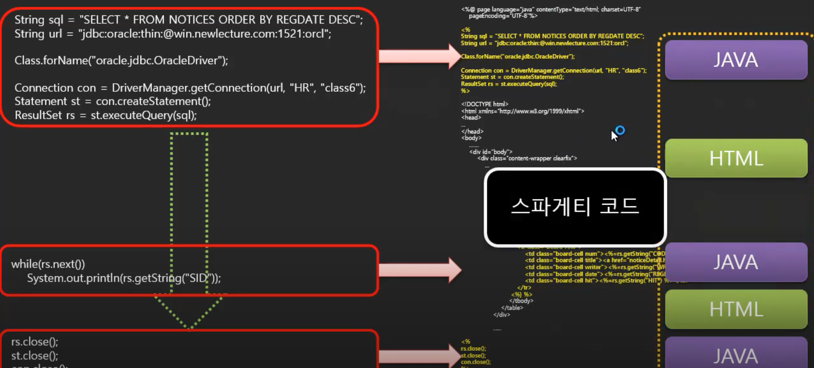

### 임시 변수를 이용한 코드 분리

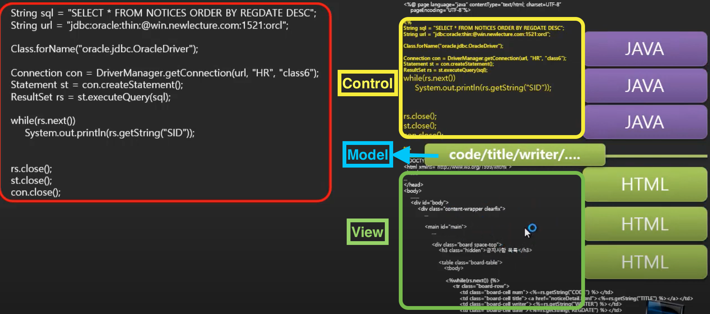

- detail.jsp
  - Control부분(자바코드)을 위쪽으로, View부분(html코드)를 밑으로 몰아서 양분화시킴
  - 유지보수에 용이함

```jsp
<%@page import="java.util.Date"%>
<%@page import="java.sql.PreparedStatement"%>
<%@page import="java.sql.ResultSet"%>
<%@page import="java.sql.Statement"%>
<%@page import="java.sql.DriverManager"%>
<%@page import="java.sql.Connection"%>
<%@ page language="java" contentType="text/html; charset=UTF-8"
    pageEncoding="UTF-8"%>

<%
	int id = Integer.parseInt(request.getParameter("id"));

	String url = "jdbc:oracle:thin:@localhost:1521/xepdb1";
	String sql = "SELECT * FROM NOTICE WHERE ID=?";
	
	Class.forName("oracle.jdbc.driver.OracleDriver");
	Connection con = DriverManager.getConnection(url, "NEWLEC", "1234");
	PreparedStatement st = con.prepareStatement(sql);
	st.setInt(1, id);
	ResultSet rs = st.executeQuery();
	rs.next();
	
	String title = rs.getString("TITLE");
	String writerId = rs.getString("WRITER_ID");
	Date regdate = rs.getDate("REGDATE");
	String hit = rs.getString("HIT");
	String files = rs.getString("FILES");
	String content = rs.getString("CONTENT");

    rs.close();
	st.close();
	con.close();
%>

<!DOCTYPE html>
<html>

<head>
    <title>코딩 전문가를 만들기 위한 온라인 강의 시스템</title>
    <meta charset="UTF-8">
    <title>공지사항목록</title>
    
    <link href="/css/customer/layout.css" type="text/css" rel="stylesheet" />
    <style>
    
        #visual .content-container{	
            height:inherit;
            display:flex; 
            align-items: center;
            
            background: url("../../images/customer/visual.png") no-repeat center;
        }
    </style>
</head>

<body>
    <!-- header 부분 -->

	<header id="header">
        
        <div class="content-container">
            <!-- ---------------------------<header>--------------------------------------- -->

            <h1 id="logo">
                <a href="/index.html">
                    

                </a>
            </h1>

            <section>
                <h1 class="hidden">헤더</h1>

                <nav id="main-menu">
                    <h1>메인메뉴</h1>
                    <ul>
                        <li><a href="/guide">학습가이드</a></li>

                        <li><a href="/course">강좌선택</a></li>
                        <li><a href="/answeris/index">AnswerIs</a></li>
                    </ul>
                </nav>

                <div class="sub-menu">

                    <section id="search-form">
                        <h1>강좌검색 폼</h1>
                        <form action="/course">
                            <fieldset>
                                <legend>과정검색필드</legend>
                                <label>과정검색</label>
                                <input type="text" name="q" value="" />
                                <input type="submit" value="검색" />
                            </fieldset>
                        </form>
                    </section>

                    <nav id="acount-menu">
                        <h1 class="hidden">회원메뉴</h1>
                        <ul>
                            <li><a href="/index.html">HOME</a></li>
                            <li><a href="/member/login.html">로그인</a></li>
                            <li><a href="/member/agree.html">회원가입</a></li>
                        </ul>
                    </nav>

                    <nav id="member-menu" class="linear-layout">
                        <h1 class="hidden">고객메뉴</h1>
                        <ul class="linear-layout">
                            <li><a href="/member/home"></a></li>
                            <li><a href="/notice/list.html"></a></li>
                        </ul>
                    </nav>

                </div>
            </section>

        </div>
        
    </header>

	<!-- --------------------------- <visual> --------------------------------------- -->
	<!-- visual 부분 -->
	
	<div id="visual">
		<div class="content-container"></div>
	</div>
	<!-- --------------------------- <body> --------------------------------------- -->
	<div id="body">
		<div class="content-container clearfix">

			<!-- --------------------------- aside --------------------------------------- -->
			<!-- aside 부분 -->


			<aside class="aside">
				<h1>고객센터</h1>

				<nav class="menu text-menu first margin-top">
					<h1>고객센터메뉴</h1>
					<ul>
						<li><a class="current"  href="/customer/notice">공지사항</a></li>
						<li><a class=""  href="/customer/faq">자주하는 질문</a></li>
						<li><a class="" href="/customer/question">수강문의</a></li>
						<li><a class="" href="/customer/event">이벤트</a></li>
						
					</ul>
				</nav>


	<nav class="menu">
		<h1>협력업체</h1>
		<ul>
			<li><a target="_blank" href="http://www.notepubs.com"></a></li>
			<li><a target="_blank" href="http://www.namoolab.com"></a></li>
						
		</ul>
	</nav>
					
			</aside>
			<!-- --------------------------- main --------------------------------------- -->

			


			<main>
				<h2 class="main title">공지사항</h2>
				
				<div class="breadcrumb">
					<h3 class="hidden">breadlet</h3>
					<ul>
						<li>home</li>
						<li>고객센터</li>
						<li>공지사항</li>
					</ul>
				</div>
				
				<div class="margin-top first">
						<h3 class="hidden">공지사항 내용</h3>
						<table class="table">
							<tbody>
								<tr>
									<th>제목</th>
									<td class="text-align-left text-indent text-strong text-orange" colspan="3"><%=title %></td>
								</tr>
								<tr>
									<th>작성일</th>
									<td class="text-align-left text-indent" colspan="3"><%=regdate %></td>
								</tr>
								<tr>
									<th>작성자</th>
									<td><%=writerId %></td>
									<th>조회수</th>
									<td><%=hit %></td>
								</tr>
								<tr>
									<th>첨부파일</th>
									<td colspan="3"><%=files %></td>
								</tr>
								<tr class="content">
									<td colspan="4"><%=content %></td>
								</tr>
							</tbody>
						</table>
					</div>
					
					<div class="margin-top text-align-center">
						<a class="btn btn-list" href="list.jsp">목록</a>
					</div>
					
					<div class="margin-top">
						<table class="table border-top-default">
							<tbody>
								
								<tr>
									<th>다음글</th>
									<td colspan="3"  class="text-align-left text-indent">다음글이 없습니다.</td>
								</tr>
								
									
								
								
								<tr>
									<th>이전글</th>
									<td colspan="3"  class="text-align-left text-indent"><a class="text-blue text-strong" href="">스프링 DI 예제 코드</a></td>
								</tr>
								
								
							</tbody>
						</table>
					</div>			
					
			</main>		
			
		</div>
	</div>

    <!-- ------------------- <footer> --------------------------------------- -->


        <footer id="footer">
            <div class="content-container">
                <h2 id="footer-logo"></h2>
    
                <div id="company-info">
                    <dl>
                        <dt>주소:</dt>
                        <dd>서울특별시 </dd>
                        <dt>관리자메일:</dt>
                        <dd>admin@newlecture.com</dd>
                    </dl>
                    <dl>
                        <dt>사업자 등록번호:</dt>
                        <dd>111-11-11111</dd>
                        <dt>통신 판매업:</dt>
                        <dd>신고제 1111 호</dd>
                    </dl>
                    <dl>
                        <dt>상호:</dt>
                        <dd>뉴렉처</dd>
                        <dt>대표:</dt>
                        <dd>홍길동</dd>
                        <dt>전화번호:</dt>
                        <dd>111-1111-1111</dd>
                    </dl>
                    <div id="copyright" class="margin-top">Copyright ⓒ newlecture.com 2012-2014 All Right Reserved.
                        Contact admin@newlecture.com for more information</div>
                </div>
            </div>
        </footer>
    </body>
    
    </html>
```


## 55. MVC model 2 방식으로 변경하기

### MVC model 1

- 물리적으로 분리하지 않고, 하나의 jsp에서 지역적으로 나눠서 구현

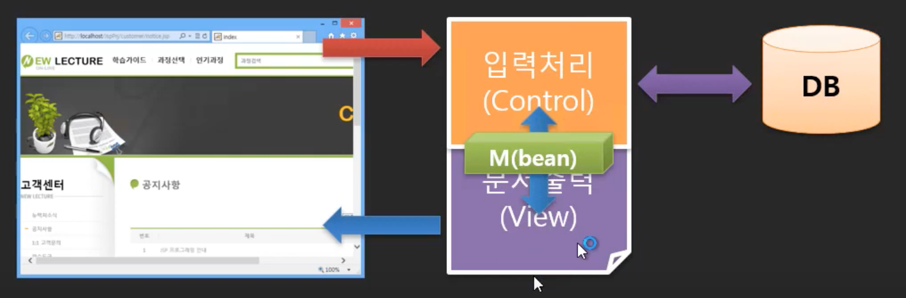

### MVC model 2

- View와 Controller 부분을 물리적으로 나누는 방식
- Control 부분은 다시 서블릿으로 구현
- View 부분은 jsp로 구현
- 결국 jsp도 서블릿을 만들기 때문에 결과적으로 서블릿이 두개가 사용됨
- 서블릿이 두개가 되면 Model을 지역변수로 설정해서 공유하는 것이 불가능해짐
- 서블릿과 서블릿을 연결해서 Model을 공유할 수 있는 방법이 필요함
- 그런데 이렇게 물리적으로 나누면 복잡도가 올라가는데 그만한 장점이 있나?
  - 개별적으로 나누어지면 협업 및 유지관리, 재사용에 용이함
  - 실행속도 관점에서도 좋음
    -  jsp는 사용자가 요청을 하면 그때 서블릿코드를 만들고, 컴파일되고, 로드가 됨
    - 그래서 Control 부분은 따로 떼어내서 java파일로 만들고, View부분만 jsp로 만들어서 실행과정에서의 비효율을 줄일 수 있음(jsp 크기가 작아지기 때문에)
- Model을 전달하기 위해서 상태를 저장하는 공간이 필요함
  - pageContext는 안되고, session, application보다는  request가 적절함

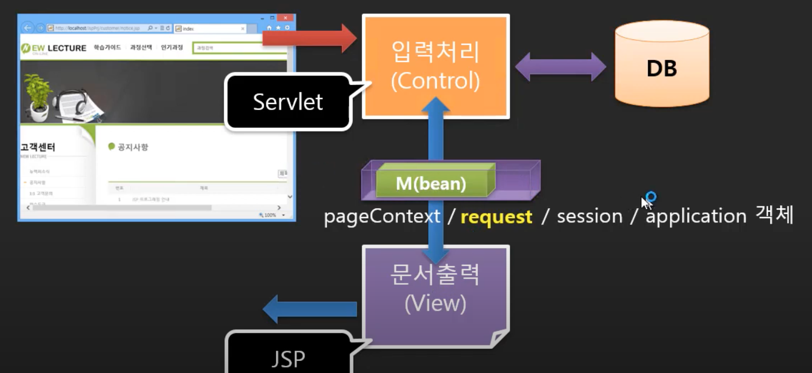

### MVC model 2로 리팩토링

- NoticeDetailController.java
  - Control에 해당하는 코드 작성
  - DB로부터 데이터를 전달받아서 변수에 저장하고, request를 통해 저장된 데이터(Model)를 detail.jsp에게 전달해줌

```java
package com.reynold.web.controller;

import java.io.IOException;
import java.sql.Connection;
import java.sql.DriverManager;
import java.sql.PreparedStatement;
import java.sql.ResultSet;
import java.sql.SQLException;
import java.util.Date;

import javax.servlet.ServletException;
import javax.servlet.annotation.WebServlet;
import javax.servlet.http.HttpServlet;
import javax.servlet.http.HttpServletRequest;
import javax.servlet.http.HttpServletResponse;

@WebServlet("/notice/detail")
public class NoticeDetailController extends HttpServlet {
	@Override
	protected void doGet(HttpServletRequest request, HttpServletResponse response) throws ServletException, IOException {
		
		int id = Integer.parseInt(request.getParameter("id"));

		String url = "jdbc:oracle:thin:@localhost:1521/xepdb1";
		String sql = "SELECT * FROM NOTICE WHERE ID=?";
		
		try {
			Class.forName("oracle.jdbc.driver.OracleDriver");
			Connection con = DriverManager.getConnection(url, "NEWLEC", "1234");
			PreparedStatement st = con.prepareStatement(sql);
			st.setInt(1, id);
			ResultSet rs = st.executeQuery();
			rs.next();
			
			String title = rs.getString("TITLE");
			String writerId = rs.getString("WRITER_ID");
			Date regdate = rs.getDate("REGDATE");
			String hit = rs.getString("HIT");
			String files = rs.getString("FILES");
			String content = rs.getString("CONTENT");
			
			request.setAttribute("title", title);
			request.setAttribute("writerId", writerId);
			request.setAttribute("regdate", regdate);
			request.setAttribute("hit", hit);
			request.setAttribute("files", files);
			request.setAttribute("content", content);
			
			rs.close();
			st.close();
			con.close();
		} catch (ClassNotFoundException e) {
			// TODO Auto-generated catch block
			e.printStackTrace();
		} catch (SQLException e) {
			// TODO Auto-generated catch block
			e.printStackTrace();
		}
		
		// redirect: 다른 페이지로 요청을 전달하는 것
		// forward: 작업했던 내용들을 이전하는 것
		request
		.getRequestDispatcher("/notice/detail.jsp")
		.forward(request, response);

	}
}
```

- detail.jsp
  - 자바 코드부분 삭제
  - NoticeDetailController.java에서 전달받은 데이터를 보여주는 부분만 처리

```jsp
<%@ page language="java" contentType="text/html; charset=UTF-8"
    pageEncoding="UTF-8"%>

<!DOCTYPE html>
<html>

<head>
    <title>코딩 전문가를 만들기 위한 온라인 강의 시스템</title>
    <meta charset="UTF-8">
    <title>공지사항목록</title>
    
    <link href="/css/customer/layout.css" type="text/css" rel="stylesheet" />
    <style>
    
        #visual .content-container{	
            height:inherit;
            display:flex; 
            align-items: center;
            
            background: url("../../images/customer/visual.png") no-repeat center;
        }
    </style>
</head>


			<!-- --------------------------- main --------------------------------------- -->

			


			<main>
				<h2 class="main title">공지사항</h2>
				
				<div class="breadcrumb">
					<h3 class="hidden">breadlet</h3>
					<ul>
						<li>home</li>
						<li>고객센터</li>
						<li>공지사항</li>
					</ul>
				</div>
				
				<div class="margin-top first">
						<h3 class="hidden">공지사항 내용</h3>
						<table class="table">
							<tbody>
								<tr>
									<th>제목</th>
									<td class="text-align-left text-indent text-strong text-orange" colspan="3"><%=request.getAttribute("title") %></td>
								</tr>
								<tr>
									<th>작성일</th>
									<td class="text-align-left text-indent" colspan="3"><%=request.getAttribute("regdate") %></td>
								</tr>
								<tr>
									<th>작성자</th>
									<td><%=request.getAttribute("writerId") %></td>
									<th>조회수</th>
									<td><%=request.getAttribute("hit") %></td>
								</tr>
								<tr>
									<th>첨부파일</th>
									<td colspan="3"><%=request.getAttribute("files") %></td>
								</tr>
								<tr class="content">
									<td colspan="4"><%=request.getAttribute("content") %></td>
								</tr>
							</tbody>
						</table>
					</div>
					
		

    <!-- ------------------- <footer> --------------------------------------- -->


```

- list.jsp
  - detail페이지로 갈 때, 경로를 detail.jsp가 아닌 서블릿을 요청하도록 변경해줌

```jsp
<% while(rs.next()){ %>
							
					<tr>
						<td><%= rs.getInt("ID") %></td>
						<td class="title indent text-align-left"><a href="detail?id=<%= rs.getInt("ID") %>"><%= rs.getString("TITLE") %></a></td>
						<td><%= rs.getString("WRITER_ID") %></td>
						<td>
							<%= rs.getDate("REGDATE") %>		
						</td>
						<td><%= rs.getInt("HIT") %></td>
					</tr>
							
					<% }%>
```


## 56. Model 데이터를 구조화하기

### Model 데이터를 위한 구조화의 필요성

#### 구조화된 데이터를 이용하면?


#### 모델 데이터를 위한 클래스 정의와 사용방법의 변화

- EL표기법을 사용해서 간단하게 사용할 수 있음
- notice라는 풀네임을 쓸 수도 있고, 더 짧게 n으로 객체명을 지정해서 사용할 수도 있음
  - 같이쓰는 것은 안됨
  - 아래 사진은 이해를 돕기 위한 거지 저렇게 쓰면 안됨

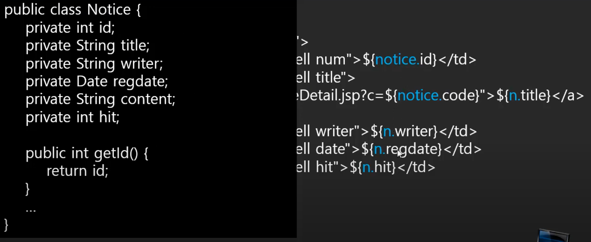

### 리팩토링

- Notice.java
  - 생성자 및 getter, setter 생성
  - 나중에 데이터 확인을 편리하게 하기 위한 toString까지 오버라이딩해두자

```java
package com.reynold.web.entity;

import java.util.Date;

public class Notice {
	
	private int id;
	private String title;
	private String writerId;
	private Date regdate;
	private String hit;
	private String files;
	private String content;
	
	public Notice() {
		
	}
	
	public Notice(int id, String title, String writerId, Date regdate, String hit, String files, String content) {
		
		this.id = id;
		this.title = title;
		this.writerId = writerId;
		this.regdate = regdate;
		this.hit = hit;
		this.files = files;
		this.content = content;
	}

	public int getId() {
		return id;
	}

	public void setId(int id) {
		this.id = id;
	}

	public String getTitle() {
		return title;
	}

	public void setTitle(String title) {
		this.title = title;
	}

	public String getWriterId() {
		return writerId;
	}

	public void setWriterId(String writerId) {
		this.writerId = writerId;
	}

	public Date getRegdate() {
		return regdate;
	}

	public void setRegdate(Date regdate) {
		this.regdate = regdate;
	}

	public String getHit() {
		return hit;
	}

	public void setHit(String hit) {
		this.hit = hit;
	}

	public String getFiles() {
		return files;
	}

	public void setFiles(String files) {
		this.files = files;
	}

	public String getContent() {
		return content;
	}

	public void setContent(String content) {
		this.content = content;
	}

	@Override
	public String toString() {
		return "Notice [id=" + id + ", title=" + title + ", writerId=" + writerId + ", regdate=" + regdate + ", hit="
				+ hit + ", files=" + files + ", content=" + content + "]";
	}
	

}

```

- NoticeDetailController.java
  - notice객체 하나에 데이터들을 넣어서 View에는 객체 하나만 전달할 수 있도록하자

```java
package com.reynold.web.controller;

import java.io.IOException;
import java.sql.Connection;
import java.sql.DriverManager;
import java.sql.PreparedStatement;
import java.sql.ResultSet;
import java.sql.SQLException;
import java.util.Date;

import javax.servlet.ServletException;
import javax.servlet.annotation.WebServlet;
import javax.servlet.http.HttpServlet;
import javax.servlet.http.HttpServletRequest;
import javax.servlet.http.HttpServletResponse;

import com.reynold.web.entity.Notice;

@WebServlet("/notice/detail")
public class NoticeDetailController extends HttpServlet {
	@Override
	protected void doGet(HttpServletRequest request, HttpServletResponse response) throws ServletException, IOException {
		
		int id = Integer.parseInt(request.getParameter("id"));

		String url = "jdbc:oracle:thin:@localhost:1521/xepdb1";
		String sql = "SELECT * FROM NOTICE WHERE ID=?";
		
		try {
			Class.forName("oracle.jdbc.driver.OracleDriver");
			Connection con = DriverManager.getConnection(url, "NEWLEC", "1234");
			PreparedStatement st = con.prepareStatement(sql);
			st.setInt(1, id);
			ResultSet rs = st.executeQuery();
			rs.next();
			
			String title = rs.getString("TITLE");
			String writerId = rs.getString("WRITER_ID");
			Date regdate = rs.getDate("REGDATE");
			String hit = rs.getString("HIT");
			String files = rs.getString("FILES");
			String content = rs.getString("CONTENT");
			
			
			Notice notice = new Notice(
						id,
						title,
						writerId,
						regdate,
						hit,
						files,
						content
					);
					
			request.setAttribute("n", notice);
			
			/*
			request.setAttribute("title", title);
			request.setAttribute("writerId", writerId);
			request.setAttribute("regdate", regdate);
			request.setAttribute("hit", hit);
			request.setAttribute("files", files);
			request.setAttribute("content", content);
			*/
			
			rs.close();
			st.close();
			con.close();
		} catch (ClassNotFoundException e) {
			// TODO Auto-generated catch block
			e.printStackTrace();
		} catch (SQLException e) {
			// TODO Auto-generated catch block
			e.printStackTrace();
		}
		
		// redirect: 다른 페이지로 요청을 전달하는 것
		// forward: 작업했던 내용들을 이전하는 것
		request
		.getRequestDispatcher("/notice/detail.jsp")
		.forward(request, response);
		
		
		
	}
}

```

- detail.jsp
  - 전달받은 noitce 객체에 있는 속성값들을 EL표기법을 사용해서 간단하게 출력할 수 있도록 구현

```jsp
<div class="margin-top first">
						<h3 class="hidden">공지사항 내용</h3>
						<table class="table">
							<tbody>
								<tr>
									<th>제목</th>
									<td class="text-align-left text-indent text-strong text-orange" colspan="3">${n.title}</td>
								</tr>
								<tr>
									<th>작성일</th>
									<td class="text-align-left text-indent" colspan="3">${n.regdate}</td>
								</tr>
								<tr>
									<th>작성자</th>
									<td>${n.writerId}</td>
									<th>조회수</th>
									<td>${n.hit}</td>
								</tr>
								<tr>
									<th>첨부파일</th>
									<td colspan="3">${n.files}</td>
								</tr>
								<tr class="content">
									<td colspan="4">${n.content}</td>
								</tr>
							</tbody>
						</table>
					</div>
```


## 57. 목록 페이지도 MVC model 2로 수정하기

- NoticeListController.java
  - notice 목록을 받아줄 list 객체를 만들고  View에 전달

```java
package com.reynold.web.controller;

import java.io.IOException;
import java.sql.Connection;
import java.sql.DriverManager;
import java.sql.ResultSet;
import java.sql.SQLException;
import java.sql.Statement;
import java.util.ArrayList;
import java.util.Date;
import java.util.List;

import javax.servlet.ServletException;
import javax.servlet.annotation.WebServlet;
import javax.servlet.http.HttpServlet;
import javax.servlet.http.HttpServletRequest;
import javax.servlet.http.HttpServletResponse;

import com.reynold.web.entity.Notice;

@WebServlet("/notice/list")
public class NoticeListController extends HttpServlet {
	@Override
	protected void doGet(HttpServletRequest request, HttpServletResponse response) throws ServletException, IOException {
		
		List<Notice> list = new ArrayList<Notice>();
		
		String url = "jdbc:oracle:thin:@localhost:1521/xepdb1";
		String sql = "SELECT * FROM NOTICE";

		try {
			Class.forName("oracle.jdbc.driver.OracleDriver");
			Connection con = DriverManager.getConnection(url, "NEWLEC", "1234");
			Statement st = con.createStatement();
			ResultSet rs = st.executeQuery(sql);
			
			while(rs.next()){
				
				int id = rs.getInt("ID");
				String title = rs.getString("TITLE");
				String writerId = rs.getString("WRITER_ID");
				Date regdate = rs.getDate("REGDATE");
				String hit = rs.getString("HIT");
				String files = rs.getString("FILES");
				String content = rs.getString("CONTENT");
				
				Notice notice = new Notice(
						id,
						title,
						writerId,
						regdate,
						hit,
						files,
						content
						);
				list.add(notice);
				
			}
			
			rs.close();
			st.close();
			con.close();
		} catch (ClassNotFoundException e) {
			// TODO Auto-generated catch block
			e.printStackTrace();
		} catch (SQLException e) {
			// TODO Auto-generated catch block
			e.printStackTrace();
		}
		
		request.setAttribute("list", list);
		
		request
		.getRequestDispatcher("/notice/list.jsp")
		.forward(request, response);
	}
}

```

- list.jsp
  - 위아래의 코드블록들은 없애주고, 다음과 같이 목록을 출력하는 부분만 반복문을 처리해주기 위해서 코드블록 사용
  - 나중에는 이부분도 tag라이브러리라는 것을 사용해서 코드블록을 제거해줄 것임

```jsp
<%
					List<Notice> list = (List<Notice>)request.getAttribute("list");
					for(Notice n : list) { 
						pageContext.setAttribute("n", n);
					%>
							
					<tr>
						<td>${n.id}</td>
						<td class="title indent text-align-left"><a href="detail?id=${n.id}">${n.title}</a></td>
						<td>${n.writerId}</td>
						<td>${n.regdate}</td>
						<td>${n.hit}</td>
					</tr>
					
					<%
					} 
					%>
```

- detail.jsp
  - 목록으로 돌아가는 링크를 list.jsp에서 list로 수정

```jsp
<div class="margin-top text-align-center">
  <a class="btn btn-list" href="list">목록</a>
</div>
```


## 58. View 페이지 은닉하기

- view 페이지들은 control에서 foward 방식으로 요청해서 나오게 되는 것이기 때문에 사용자가 직접 요청할 수 없도록 숨겨줘야함
- 사용자가 접근할 수 없도록  WEB-INF 안에  View 페이지들을 넣어두자

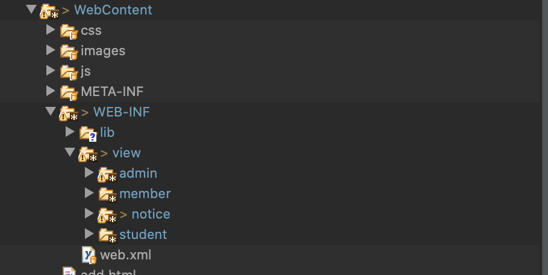

- NoticeDetailController.java와  NoticeListController.java에서 View페이지 요청 경로 수정해주기

```java
// NoticeDetailController.java
request
		.getRequestDispatcher("/WEB-INF/view/notice/detail.jsp")
		.forward(request, response);

// NoticeListController.java
request
		.getRequestDispatcher("/WEB-INF/view/notice/list.jsp")
		.forward(request, response);
```


## 59. View(list.jsp)에서 반복문 제거하기

### 자바의 반복문을 이용한 제어구조에서 태그를 이용한 제어구조로

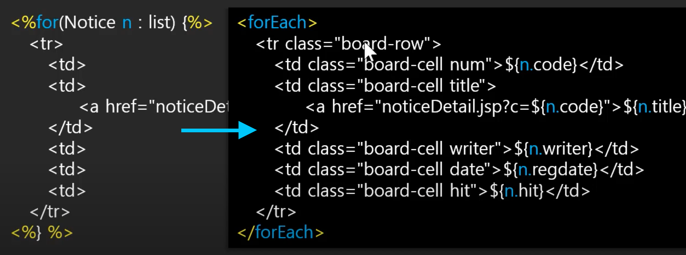

### JSTL다운로드

- https://mvnrepository.com/artifact/javax.servlet/jstl/1.2
- jar파일 다운로드
- lib에 넣기

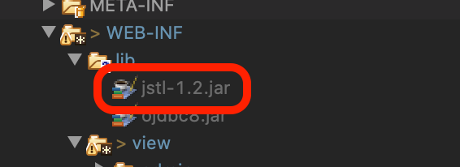

### list.jsp 리팩토링

- 위쪽에서 taglib 관련 설정
- c:forEach에서 주석처리된 부분의 역할을 해줌

```jsp
<%@page import="com.reynold.web.entity.Notice"%>
<%@page import="java.util.List"%>
<%@ page language="java" contentType="text/html; charset=UTF-8"
    pageEncoding="UTF-8"%>
<%@ taglib prefix="c" uri="http://java.sun.com/jsp/jstl/core" %>

<!DOCTYPE html>
<html>

<head>

</head>

<body>
    <!-- header 부분 -->

  
            <!-- ---------------------------<header>--------------------------------------- -->

	<!-- --------------------------- <visual> --------------------------------------- -->
	<!-- visual 부분 -->
	
	
	<!-- --------------------------- <body> --------------------------------------- -->
	
	
			<!-- --------------------------- main --------------------------------------- -->


					
					<%-- <%
					List<Notice> list = (List<Notice>)request.getAttribute("list");
					for(Notice n : list) { 
						pageContext.setAttribute("n", n);
					%> --%>
					<c:forEach var="n" items="${list}">
					<tr>
						<td>${n.id}</td>
						<td class="title indent text-align-left"><a href="detail?id=${n.id}">${n.title}</a></td>
						<td>${n.writerId}</td>
						<td>${n.regdate}</td>
						<td>${n.hit}</td>
					</tr>
					</c:forEach>
					<%-- <%
					} 
					%> --%>
		

    <!-- ------------------- <footer> --------------------------------------- -->


    </body>
    
    </html>
```


## 60. Tag 라이브러리와  JSTL

### JSTL(JSP Standard Tag Library)

-  View단에서 사용할 수 있는 제어를 담당하는 태그들을 제공해줌

#### JSTL이 제공하는 기능들의 범주

- 크게 5가지의 태그 라이브러리를 제공해줌
  - Core
    - 제어의 행위를 담당하는 태그
  - Formating
    - 날짜, 화폐단위 등 포맷팅할 수 있는 기능
  - Functions
    - 약간의 문자열 조작과 같은 기능을 제공하는 함수
  - SQL
    - 안쓰는 게 바람직
  - XML
    - 안쓰는 게 바람직

### JSTL Core

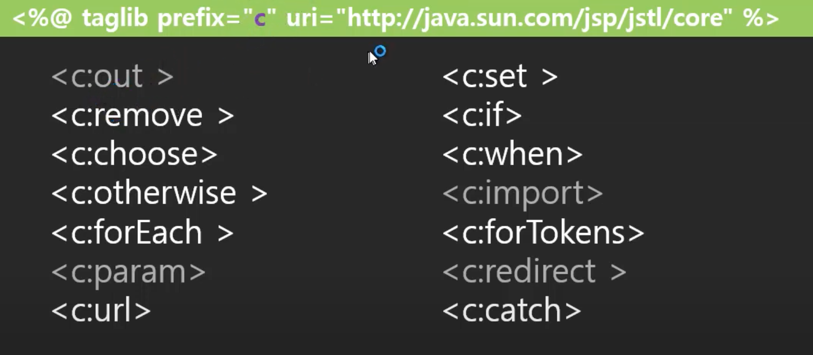

### ForEach 태그를 사용하여 공지사항 목록 작성하기

- Jasper는 forEach가 html태그인지 제어를 담당하는 태그인지 구별할 수가 없음
- 그래서 접두사를 사용함
  - 식별자(uri)를 대신해서 접두사를 사용함
  - Jasper에게 서버에서 처리할 taglib 임을 알 수 있게 함

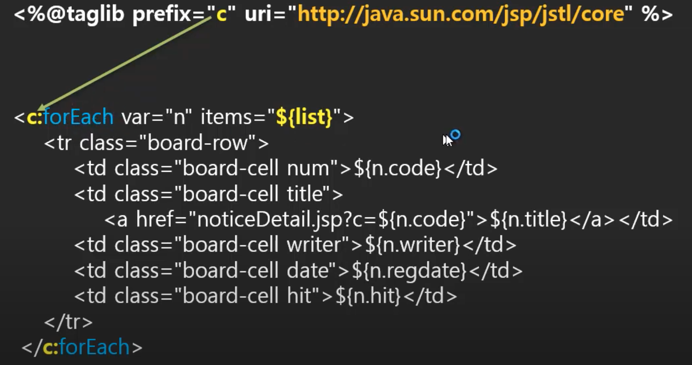

### 가장 간단한 for 태그 라이브러리를 만들기 위한 코드

- ForTag라는 클래스를 만들고 TagSupport를 상속받음
- 태그 Descriptor를 사용해서 정의한 태그를 매핑해줌, 이때 도메인네임을 사용해서 태그를 식별할 수 있도록 해줌
- 이 부분은 다음에 필요하면 더 공부해보자

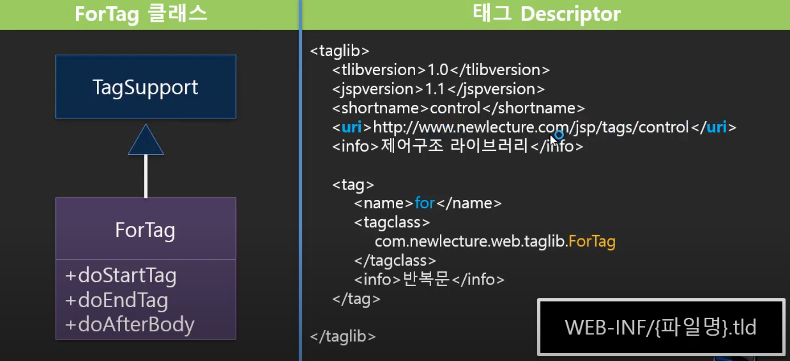

### ForTag 클래스 생성


### 태그 라이브러리 만들어보기

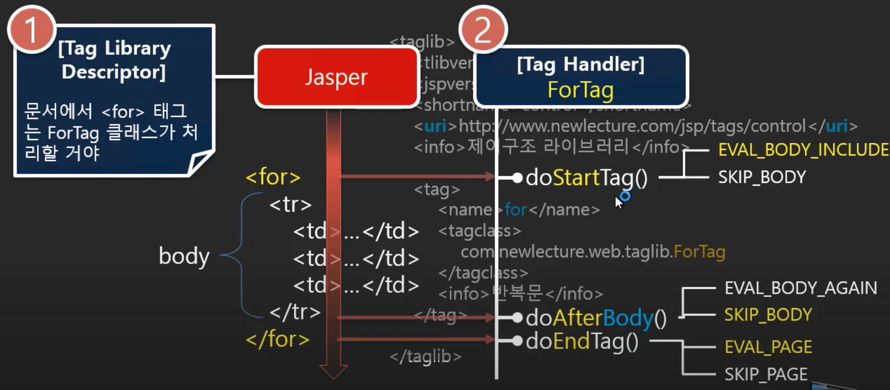


## 참고

- 유튜브 채널 뉴렉처


