# JSP 학습 3


## 62. forEach의 속성 사용하기

### JSTL Core

- 여기서 빨간색 박스 안에 있는 것들을 공부할 것
- 나머지는 예전에 사용되던 것들, 현재 방식에는 안맞기 때문에 사용하지 않는 것이 바람직함

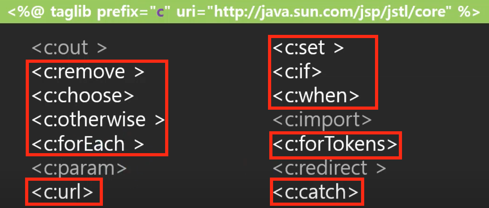

### forEach

- 태그 속성에는 var, items, begin, end, varStatus, step 등이 있음
- varStatus는 반복문 한번 돌떄마다의 상태 정보를 가지고 있음
  - current: 반복하고 있는 객체
  - index: 반복하고 있는 객체의 인덱스
  - count: 반복횟수
  - first: 현재 반복되고 있는 객체가 첫번째이면 True, 아니면 False
  - last: 현재 반복되고 있는 객체가 마지막이면 True, 아니면 False
  - begin: begin 속성에서 넣어준 값을 보여줌
  - end: end 속성에서 넣어준 값을 보여줌
  - step: step 속성에서 넣어준 값을 보여줌


## 63. JSTL: forEach문으로 Pager 번호 만들기 - c:forEach

### pager 번호 생성하기

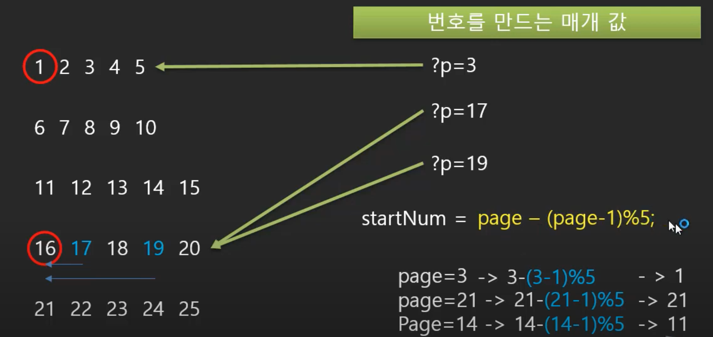

- list.jsp
  - c:set 태그를 통해 변수를 설정해줄 수 있고, 이 변수는 pageContext에 저장되어 페이지 내에서 사용될 수 있음 

```jsp
<c:set var="page" value="${(param.p == null)?1:param.p}"/>
<c:set var="startNum" value="${page-(page-1)%5}"/>
<ul class="-list- center">
  <c:forEach var="i" begin="0" end="4">
    <li><a class="-text- orange bold" href="?p=${startNum+i}&t=&q=" >${startNum+i}</a></li>
  </c:forEach>
</ul>
```


## 64. JSTL: if 문으로 Pager 이전/다음 번호 만들기 - c:if

- list.jsp
  - lastNum은 레코드의 총 개수와 연관이 있지만, 여기서는 JSTL을 중심으로 볼 것이기 때문에 임의로 23을 넣어줌
  - JSTL의 if 문의 경우, else문이 따로 없기 때문에 조건문 자체를 배타적으로 설정해줘야함
  - startNum을 기준으로해서 조건문을 처리해주자

```jsp
<c:set var="page" value="${(param.p == null)?1:param.p}"/>
<c:set var="startNum" value="${page-(page-1)%5}"/>
<c:set var="lastNum" value="23"/>

<div>	
  <c:if test="${startNum>1}">
    <a href="?p=${startNum-1}&t=&q=" class="btn btn-prev">이전</a>
  </c:if>
  <c:if test="${startNum<=1}">
    <span class="btn btn-prev" onclick="alert('이전 페이지가 없습니다.');">이전</span>
  </c:if>
</div>

<ul class="-list- center">
  <c:forEach var="i" begin="0" end="4">
    <li><a class="-text- orange bold" href="?p=${startNum+i}&t=&q=" >${startNum+i}</a></li>
  </c:forEach>
</ul>

<div>
  <c:if test="${startNum+5<lastNum}">
    <a href="?p=${startNum+5}&t=&q=" class="btn btn-next">다음</a>
  </c:if>
  <c:if test="${startNum+5>=lastNum}">
    <span class="btn btn-next" onclick="alert('다음 페이지가 없습니다.');">다음</span>
  </c:if>
</div>
```


## 65. JSTL: forTokens로 첨부파일 목록 출력하기 - c:forTockens

- detail.jsp
  - 첨부파일 목록을 구분자(,)로 구분해서 분리하고, 반복해서 출력해줌

```jsp
<tr>
  <th>첨부파일</th>
  <td colspan="3" style="text-align:Left;text-indent:10px;">
    <c:forTokens var="fileName" items="${n.files}" delims="," varStatus="st">
      <a href="${fileName}">${fileName}</a>
      <c:if test="${!st.last}">
        /
      </c:if>
    </c:forTokens>
  </td>
</tr>
```

- 결과

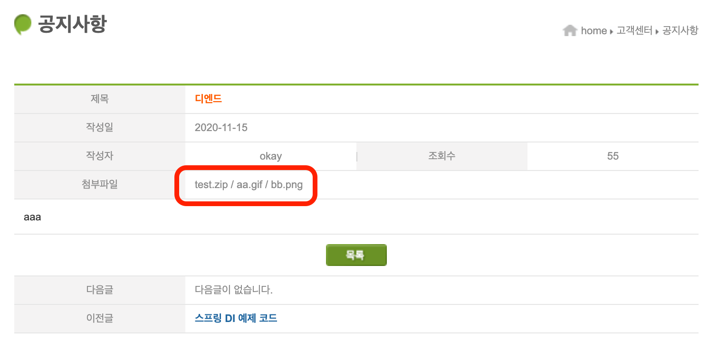


## 66. JSTL: format 태그로 날짜 형식 변경하기 - fmt:formatDate

- list.jsp
  - DB에 저장되어있는 date 값을 jsp가 알아서 변경해준 상태인데, 이것을 내가 원하는 형태로 만들 수 있음
  - fmt:formatDate태그를 사용해서 yyyy-MM-dd 형태로 표현

```jsp
<%@ taglib prefix="fmt" uri="http://java.sun.com/jsp/jstl/fmt" %>

<c:forEach var="n" items="${list}">
  <tr>
    <td>${n.id}</td>
    <td class="title indent text-align-left"><a href="detail?id=${n.id}">${n.title}</a></td>
    <td>${n.writerId}</td>
    <td><fmt:formatDate pattern="yyyy-MM-dd" value="${n.regdate}"/></td>
    <td>${n.hit}</td>
  </tr>
</c:forEach>
```

- 결과

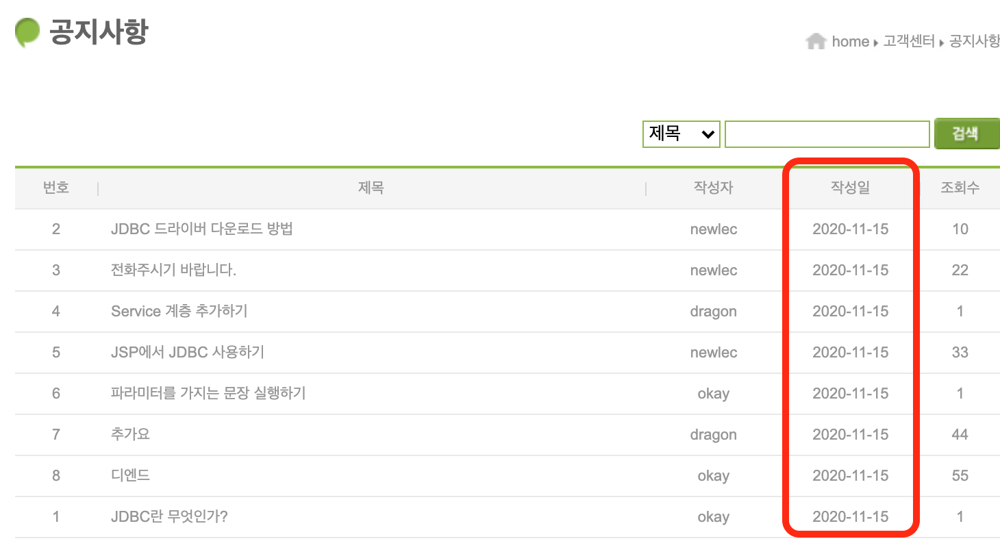

- detail.jsp
  - yyyy-MM-dd hh:mm:ss 형태로 표현

```jsp
<%@ taglib prefix="fmt" uri="http://java.sun.com/jsp/jstl/fmt" %>

<tr>
  <th>작성일</th>
  <td class="text-align-left text-indent" colspan="3"><fmt:formatDate pattern="yyyy-MM-dd hh:mm:ss" value="${n.regdate}"/></td>
</tr>
```

- 결과


## 67. JSTL: format 태그로 숫자 출력 형식 지정하기 - fmt:formatNumber

- detail.jsp
  - 이렇게만해도 기본적으로 세자리씩 끊어줌
  - 이외에도 여러가지 속성값들이 존재하고 필요에 따라 찾아서 쓰면 됨

```jsp
<th>조회수</th>
<td><fmt:formatNumber value="${n.hit}" /></td>
```

- 결과

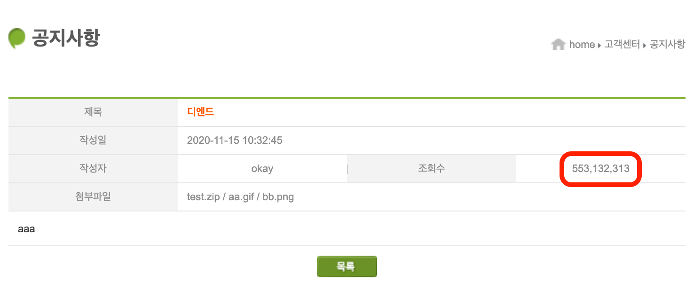


## 68. JSTL:functions로 EL에서 함수 이용하기

- 문자열을 조작할려고 할때 사용할 수 있음
- functions 태그는 EL표기법 안에 작성함
- detail.jsp
  - 첨부파일의 이름을 대문자로 표시하고, 만약 zip형식일 경우에는 빨간색 굻은 글자로 표현해보자

```jsp
<tr>
  <th>첨부파일</th>
  <td colspan="3" style="text-align:Left;text-indent:10px;">
    <c:forTokens var="fileName" items="${n.files}" delims="," varStatus="st">
      <c:set var="style" value="" />
      <c:if test="${fn:endsWith(fileName, '.zip')}">
        <c:set var="style" value="font-weight:bold; color:red;" />
      </c:if>
      <a href="${fileName}" style="${style}">${fn:toUpperCase(fileName)}</a>
      <c:if test="${!st.last}">
        /
      </c:if>
    </c:forTokens>
  </td>
</tr>
```

- 결과

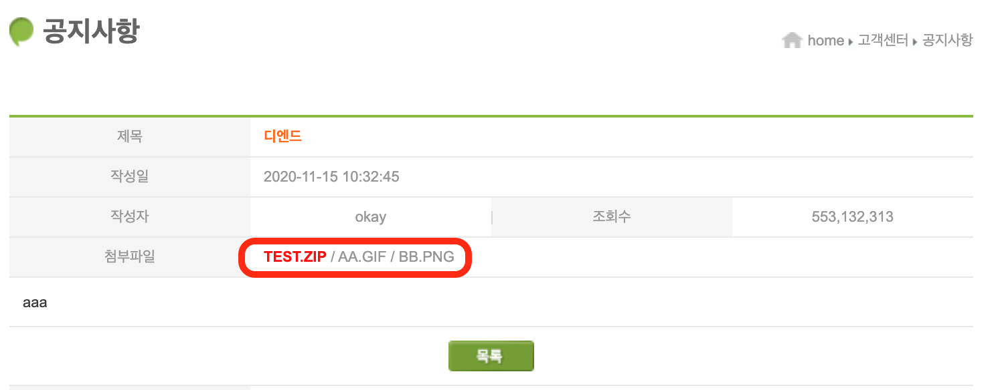


## 69. 기업형으로 레이어를 나누는 이유와 설명 - 코드 분리를 위한 사전 설명

### 정리 - 코드의 분리

- 더 세밀하게 코드를 분리하는 이유
  - 실제 기업형 프로그램을 개발할 때는 규모가 크기 때문에 분업이 필요함

#### 서블릿만으로 이루어진 모델

- 요청에 대한 응답을 서블릿에서 모두 처리하는 형태

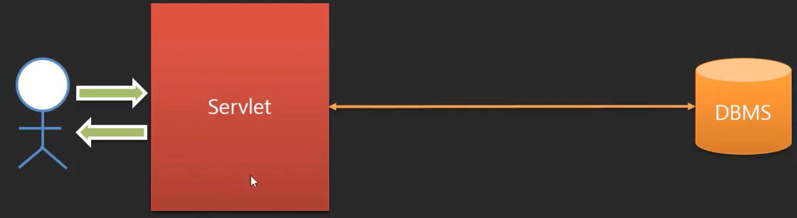

#### 서블릿과 jsp를 분리한 MVC 모델

- 지금까지 만든 형태가 이 형태임
- 문서 출력에 대한 부담을 줄이기 위해서 서블릿에서는 control역할을 담당하고 model을 정의해서 view(jsp)에게 전달함
- 사용자의 입력 및 출력 관리와 업무 처리를 control에서 함
- 혼자 개발하고 서비스할 때는 이런 방식이 적합함
  - 팀으로 개발을 할 때는 분업해야함
  - 좀 더 적합한 방식이 있음

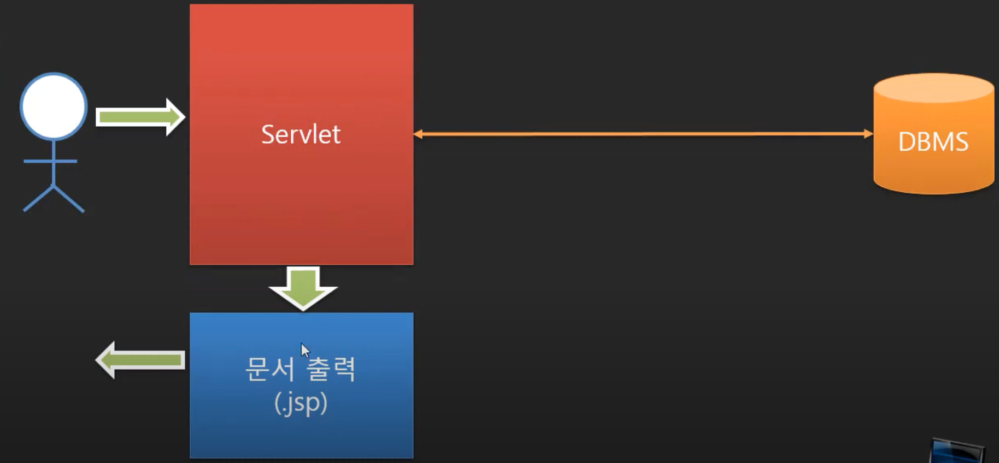

#### 트랜잭션을 처리하는 업무 서비스를 분리함

- 경험이 많은 사람은 업무 서비스를, 그렇지 않은 사람은 입출력을 맡도록 분업하는 것이 바람직
  - 업무를 제대로 알고 구현하는 것이 중요하기 때문임
  - 입출력에서의 오류보다 업무관련된 데이터의 손실이나 오류가 더 큰 피해로 이어짐
- 실제 업무(비즈니스 로직)와 관련된 처리들은 업무 서비스에서 담당함
  - 예를 들어 결제 시스템이라면 결제와 관련된 기능들을 여기서 담당하는 것
  - 만약 계좌이체를 사용자가 요청하면 서블릿(control)이 여기로 바로 요청을 전달하고, 여기서 관련 기능들을 구현하고, 결과를 다시 서블릿(control)에게 전달함, 서블릿은 결과를 받아서 출력을 할 수 있도록 함
- 업무 서비스 부분은 잘 변경되지 않기 때문에 재사용에도 용이함

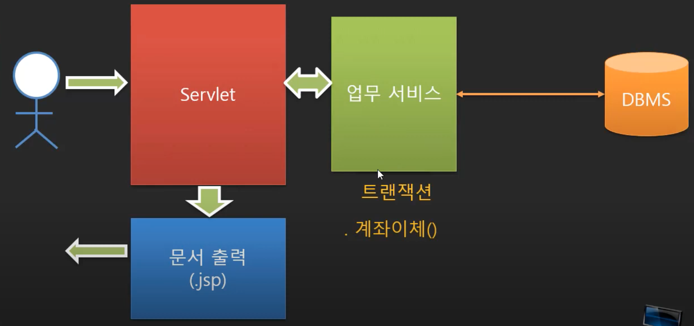

#### 데이터서비스(DAO)까지 분리한 경우

- 이전의 모델에서는 업무 서비스에서 DB와 관련된 처리를 함께 했다면, 이부분도 분리하는 것
- 어떤 DBMS를 사용하는지, 어떤 형식으로 데이터가 제공되는지 이런 부분들은 신경쓰지 않고, 업무 로직 처리에만 집중하기 위해서 분리하는 것
- 보통 기업형 프로그램을 개발할 때, 이런 형태로 분리해서 분업하는 것이 일반적임
- 계좌이체를 구현하고자 하면 두번의 update가 필요함(돈이 나가는 곳과 돈이 들어오는 곳의 데이터 갱신)
  - 이 과정에서 두번의 update 중 하나만 되는 일이 일어나지 않도록 업무 서비스에서 트랜잭션을 처리하는 부분도 관리해야함


#### 이외에도 다양한 형태가 가능함

- 상황에 맞게 선택할 수 있는 것
- 비즈니스 로직을 control에서 다 처리하고 싶으면 이런 형태도 가능함

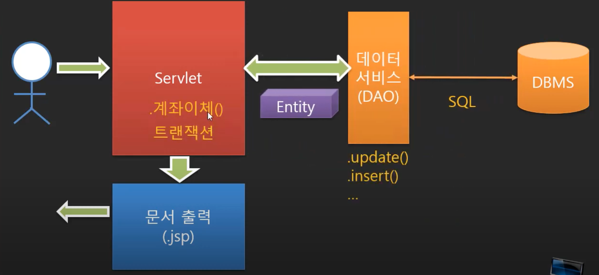

- 또는 그냥 업무 서비스에서 데이터관련 처리도 함께 처리하겠다고 하면 이런 형태도 가능함
  - 일단은 이 방식부터 만들어보고, 이어서 DAO를 분리하는 식으로 진행하자
  - DAO를 분리하면서 발생하는 문제점과 이를 처리하기 위한 방법으로 스프링이 등장하게 됨

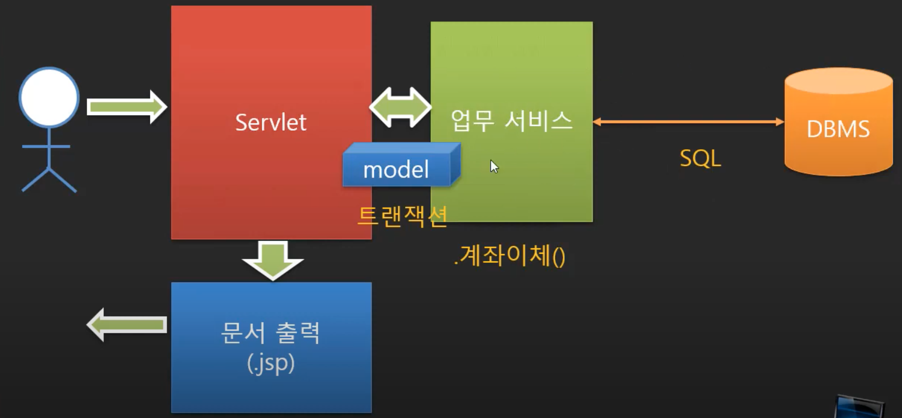


## 70. 서비스 함수 찾아내기

- Control에서 업무 서비스(비즈니스 로직 처리) 부분을 떼어내자

### 공지 시스템

- 공지에 대한 서비스 클래스를 만들자
- 관리자는 일반회원을 상속하고 있음
- 먼저 공지목록조회와 공지상세조회 기능을 구현하자

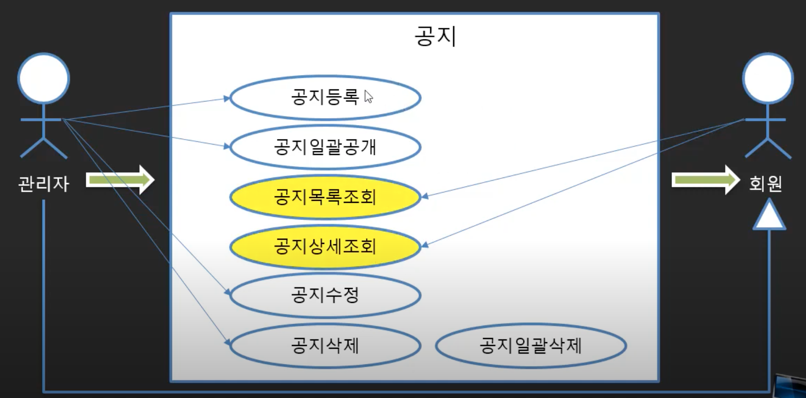

### 공지목록조회에서의 요청 사항

- 사용자가 공지 목록을 요청하는 방식, 세가지
  - 공지사항이라는 버튼을 눌러서 공지사항 페이지를 요청
    - getNoticeList()
  - 공지사항 페이지 내에 있는 페이저 버튼을 눌러서 그에 맞는 공지사항 페이지 요청
    - getNoticeList(int page)
  - 검색을 통한 페이지 요청
    - getNoticeList(String field, String query, int page)
- 공지 사항의 게시글 개수를 요청
  - getNoticeCount()
  - getNoticeCount(String field, String query)

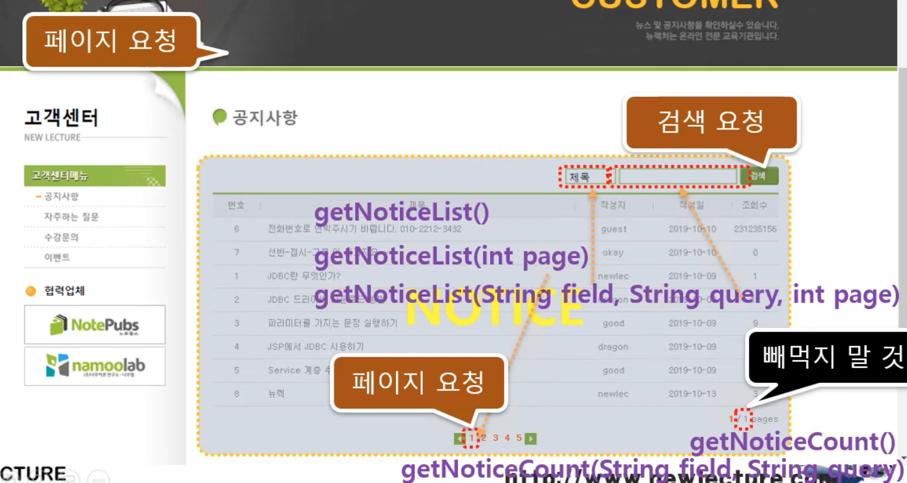

### 공지상세조회에서의 요청 사항

- id를 넘겨받아서 해당 공지글을 요청
  - getNotice(id)
- 다음 글과 이전 글을 요청
  - getNextNotice(id)
  - getPrevNotice(id)

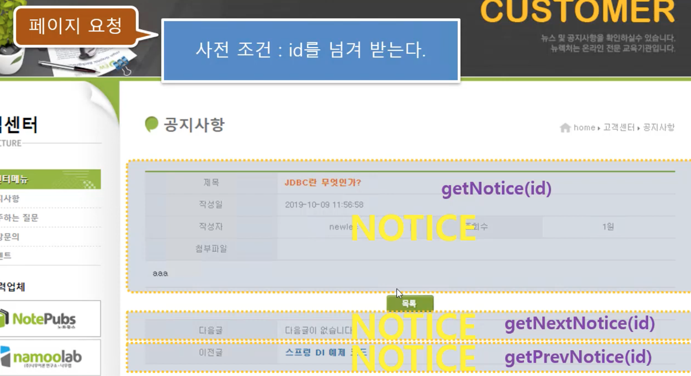


## 71. 서비스 클래스 구현하기

- NoticeService.java
  - 필요한 메소드들 대략적으로 정의해두기

```java
package com.reynold.web.service;

import java.util.List;

import com.reynold.web.entity.Notice;

public class NoticeService {
	public List<Notice> getNoticeList(){
		
		return getNoticeList("title", "", 1);
	}
	
	public List<Notice> getNoticeList(int page){
			
		return getNoticeList("title", "", page);
	}
	
	public List<Notice> getNoticeList(String field, String query, int page){
		
		return null;
	}
	
	public int getNoticeCount() {
		
		return getNoticeCount("title", "");
	}
	
	public int getNoticeCount(String field, String query) {
		
		return 0;
	}
	
	public Notice getNotice(int id) {
		
		return null;
	}
	
	public Notice getNextNotice(int id) {
		
		return null;
	}
	
	public Notice getPrevNotice(int id) {
		
		return null;
	}
}
```


## 72. getNoticeList 메소드의 SQL 쿼리 작성하기

- getNoticeList을 위한 sql

```sql
SELECT * 
FROM (
    SELECT ROWNUM NUM, N.* 
    FROM (SELECT * FROM NOTICE ORDER BY REGDATE DESC) N
) 
WHERE NUM BETWEEN 1 AND 10;
```

- NoticeService.java
  - 검색관련 부분, 변수 처리 등은 다음에 더 추가하자
  - getNoticeCount 쿼리는 getNoticeList 쿼리랑 비슷, 일단 똑같이 써놓자

```java
package com.reynold.web.service;

import java.util.List;

import com.reynold.web.entity.Notice;

public class NoticeService {
	public List<Notice> getNoticeList(){
		
		return getNoticeList("title", "", 1);
	}
	
	public List<Notice> getNoticeList(int page){
			
		return getNoticeList("title", "", page);
	}
	
	public List<Notice> getNoticeList(String field, String query, int page){
		
		String sql = "SELECT * FROM (" + 
				"    SELECT ROWNUM NUM, N.*" + 
				"    FROM (SELECT * FROM NOTICE ORDER BY REGDATE DESC) N" + 
				") " + 
				"WHERE NUM BETWEEN 1 AND 10";
				
		return null;
	}
	
	public int getNoticeCount() {
		
		return getNoticeCount("title", "");
	}
	
	public int getNoticeCount(String field, String query) {
		String sql = "SELECT * FROM (" + 
				"    SELECT ROWNUM NUM, N.*" + 
				"    FROM (SELECT * FROM NOTICE ORDER BY REGDATE DESC) N" + 
				") " + 
				"WHERE NUM BETWEEN 1 AND 10";
		return 0;
	}
	
	public Notice getNotice(int id) {
		
		return null;
	}
	
	public Notice getNextNotice(int id) {
		
		return null;
	}
	
	public Notice getPrevNotice(int id) {
		
		return null;
	}
	
}
```


## 73. getNextNotice 메소드의 SQL 쿼리 작성하기

- getNotice를 위한 sql

```sql
SELECT * FROM NOTICE WHERE ID=3;
```

- getNextNotice를 위한 sql

```sql
SELECT * FROM NOTICE
WHERE ID = (
    SELECT ID FROM (SELECT * FROM NOTICE ORDER BY REGDATE)
    WHERE REGDATE > (SELECT REGDATE FROM NOTICE WHERE ID=37) AND ROWNUM=1
);
```


## 74. getPrevNotice 메소드의 SQL 쿼리 작성하기

- getPrevNotice를 위한 sql

```sql
SELECT * FROM NOTICE 
WHERE ID = (
    SELECT ID FROM (SELECT * FROM NOTICE ORDER BY REGDATE DESC)
    WHERE REGDATE < (SELECT REGDATE FROM NOTICE WHERE ID=1) AND ROWNUM = 1
);
```

- NoticeService.java

```java
package com.reynold.web.service;

import java.util.List;

import com.reynold.web.entity.Notice;

public class NoticeService {
	public List<Notice> getNoticeList(){
		
		return getNoticeList("title", "", 1);
	}
	
	public List<Notice> getNoticeList(int page){
			
		return getNoticeList("title", "", page);
	}
	
	public List<Notice> getNoticeList(String field, String query, int page){
		
		String sql = "SELECT * FROM (" + 
				"    SELECT ROWNUM NUM, N.*" + 
				"    FROM (SELECT * FROM NOTICE ORDER BY REGDATE DESC) N" + 
				") " + 
				"WHERE NUM BETWEEN 1 AND 10";
				
		return null;
	}
	
	public int getNoticeCount() {
		
		return getNoticeCount("title", "");
	}
	
	public int getNoticeCount(String field, String query) {
		String sql = "SELECT * FROM (" + 
				"    SELECT ROWNUM NUM, N.*" + 
				"    FROM (SELECT * FROM NOTICE ORDER BY REGDATE DESC) N" + 
				") " + 
				"WHERE NUM BETWEEN 1 AND 10";
		
		return 0;
	}
	
	public Notice getNotice(int id) {
		String sql = "SELECT * FROM NOTICE WHERE ID=?";
		
		return null;
	}
	
	public Notice getNextNotice(int id) {
		String sql = "SELECT * FROM NOTICE " + 
				"WHERE ID = ( " + 
				"    SELECT ID FROM (SELECT * FROM NOTICE ORDER BY REGDATE) " + 
				"    WHERE REGDATE > (SELECT REGDATE FROM NOTICE WHERE ID=37) AND ROWNUM=1 " + 
				")";
		return null;
	}
	
	public Notice getPrevNotice(int id) {
		String sql = "SELECT * FROM NOTICE " + 
				"WHERE ID = ( " + 
				"    SELECT ID FROM (SELECT * FROM NOTICE ORDER BY REGDATE DESC) " + 
				"    WHERE REGDATE < (SELECT REGDATE FROM NOTICE WHERE ID=1) AND ROWNUM = 1 " + 
				")";
		return null;
	}
}
```


## 75. getNoticeList의 JDBC 코드 구현하기

- NoticeListController.java
  - 이전에 DB를 연결하던 부분을 service에 넘겨줬기 때문에 코드가 간결해짐

```java
package com.reynold.web.controller;

import java.io.IOException;
import java.sql.Connection;
import java.sql.DriverManager;
import java.sql.ResultSet;
import java.sql.SQLException;
import java.sql.Statement;
import java.util.ArrayList;
import java.util.Date;
import java.util.List;

import javax.servlet.ServletException;
import javax.servlet.annotation.WebServlet;
import javax.servlet.http.HttpServlet;
import javax.servlet.http.HttpServletRequest;
import javax.servlet.http.HttpServletResponse;

import com.reynold.web.entity.Notice;
import com.reynold.web.service.NoticeService;

@WebServlet("/notice/list")
public class NoticeListController extends HttpServlet {
	@Override
	protected void doGet(HttpServletRequest request, HttpServletResponse response) throws ServletException, IOException {
		
		NoticeService service = new NoticeService();
		List<Notice> list = service.getNoticeList();

		request.setAttribute("list", list);
		
		request
		.getRequestDispatcher("/WEB-INF/view/notice/list.jsp")
		.forward(request, response);
	}
}

```

- NoticeService.java
  - getNoticeList 부분 구현

```java
package com.reynold.web.service;

import java.sql.Connection;
import java.sql.DriverManager;
import java.sql.PreparedStatement;
import java.sql.ResultSet;
import java.sql.SQLException;
import java.sql.Statement;
import java.util.ArrayList;
import java.util.Date;
import java.util.List;

import com.reynold.web.entity.Notice;

public class NoticeService {
	public List<Notice> getNoticeList(){
		
		return getNoticeList("title", "", 1);
	}
	
	public List<Notice> getNoticeList(int page){
			
		return getNoticeList("title", "", page);
	}
	
	public List<Notice> getNoticeList(String field, String query, int page){
		
		List<Notice> list = new ArrayList<>();
		
		String sql = "SELECT * FROM (" + 
				"    SELECT ROWNUM NUM, N.*" + 
				"    FROM (SELECT * FROM NOTICE WHERE "+field+" LIKE ? ORDER BY REGDATE DESC) N" + 
				") " + 
				"WHERE NUM BETWEEN ? AND ?";
		
		String url = "jdbc:oracle:thin:@localhost:1521/xepdb1";

		try {
			Class.forName("oracle.jdbc.driver.OracleDriver");
			Connection con = DriverManager.getConnection(url, "NEWLEC", "1234");
			PreparedStatement st = con.prepareStatement(sql);
			st.setString(1, "%"+query+"%");
			st.setInt(2, 1+(page-1)*10);
			st.setInt(3, page*10);
			
			ResultSet rs = st.executeQuery();
			
			while(rs.next()){
				
				int id = rs.getInt("ID");
				String title = rs.getString("TITLE");
				String writerId = rs.getString("WRITER_ID");
				Date regdate = rs.getDate("REGDATE");
				String hit = rs.getString("HIT");
				String files = rs.getString("FILES");
				String content = rs.getString("CONTENT");
				
				Notice notice = new Notice(
						id,
						title,
						writerId,
						regdate,
						hit,
						files,
						content
						);
				list.add(notice);
				
			}
			
			rs.close();
			st.close();
			con.close();
		} catch (ClassNotFoundException e) {
			// TODO Auto-generated catch block
			e.printStackTrace();
		} catch (SQLException e) {
			// TODO Auto-generated catch block
			e.printStackTrace();
		}
		return list;
	}
	
	public int getNoticeCount() {
		
		return getNoticeCount("title", "");
	}
	
	public int getNoticeCount(String field, String query) {
		String sql = "SELECT * FROM (" + 
				"    SELECT ROWNUM NUM, N.*" + 
				"    FROM (SELECT * FROM NOTICE ORDER BY REGDATE DESC) N" + 
				") " + 
				"WHERE NUM BETWEEN 1 AND 10";
		
		return 0;
	}
	
	public Notice getNotice(int id) {
		String sql = "SELECT * FROM NOTICE WHERE ID=?";
		
		return null;
	}
	
	public Notice getNextNotice(int id) {
		String sql = "SELECT * FROM NOTICE " + 
				"WHERE ID = ( " + 
				"    SELECT ID FROM (SELECT * FROM NOTICE ORDER BY REGDATE) " + 
				"    WHERE REGDATE > (SELECT REGDATE FROM NOTICE WHERE ID=37) AND ROWNUM=1 " + 
				")";
		return null;
	}
	
	public Notice getPrevNotice(int id) {
		String sql = "SELECT * FROM NOTICE " + 
				"WHERE ID = ( " + 
				"    SELECT ID FROM (SELECT * FROM NOTICE ORDER BY REGDATE DESC) " + 
				"    WHERE REGDATE < (SELECT REGDATE FROM NOTICE WHERE ID=1) AND ROWNUM = 1 " + 
				")";
		return null;
	}
	
}

```


## 76. NoticeService 클래스 완성하기

- NoticeService.java

```java
package com.reynold.web.service;

import java.sql.Connection;
import java.sql.DriverManager;
import java.sql.PreparedStatement;
import java.sql.ResultSet;
import java.sql.SQLException;
import java.sql.Statement;
import java.util.ArrayList;
import java.util.Date;
import java.util.List;

import com.reynold.web.entity.Notice;

public class NoticeService {
	public List<Notice> getNoticeList(){
		
		return getNoticeList("title", "", 1);
	}
	
	public List<Notice> getNoticeList(int page){
			
		return getNoticeList("title", "", page);
	}
	
	public List<Notice> getNoticeList(String field, String query, int page){
		
		List<Notice> list = new ArrayList<>();
		
		String sql = "SELECT * FROM (" + 
				"    SELECT ROWNUM NUM, N.*" + 
				"    FROM (SELECT * FROM NOTICE WHERE "+field+" LIKE ? ORDER BY REGDATE DESC) N" + 
				") " + 
				"WHERE NUM BETWEEN ? AND ?";
		
		String url = "jdbc:oracle:thin:@localhost:1521/xepdb1";

		try {
			Class.forName("oracle.jdbc.driver.OracleDriver");
			Connection con = DriverManager.getConnection(url, "NEWLEC", "1234");
			PreparedStatement st = con.prepareStatement(sql);
			st.setString(1, "%"+query+"%");
			st.setInt(2, 1+(page-1)*10);
			st.setInt(3, page*10);
			
			ResultSet rs = st.executeQuery();
			
			while(rs.next()){
				
				int id = rs.getInt("ID");
				String title = rs.getString("TITLE");
				String writerId = rs.getString("WRITER_ID");
				Date regdate = rs.getDate("REGDATE");
				String hit = rs.getString("HIT");
				String files = rs.getString("FILES");
				String content = rs.getString("CONTENT");
				
				Notice notice = new Notice(
						id,
						title,
						writerId,
						regdate,
						hit,
						files,
						content
						);
				list.add(notice);
				
			}
			
			rs.close();
			st.close();
			con.close();
		} catch (ClassNotFoundException e) {
			// TODO Auto-generated catch block
			e.printStackTrace();
		} catch (SQLException e) {
			// TODO Auto-generated catch block
			e.printStackTrace();
		}
		return list;
	}
	
	public int getNoticeCount() {
		
		return getNoticeCount("title", "");
	}
	
	public int getNoticeCount(String field, String query) {
		
		int count = 0;
		
//		String sql = "SELECT COUNT(ID) COUNT FROM (" + 
//				"    SELECT ROWNUM NUM, N.*" + 
//				"    FROM (SELECT * FROM NOTICE WHERE "+field+" LIKE ? ORDER BY REGDATE DESC) N " + 
//				")";
		
    // 이게 맞는거 같은데 나중에 control까지 만들어서 확인해보자
		String sql = "SELECT COUNT(ID) COUNT FROM NOTICE WHERE "+field+" LIKE ? ORDER BY REGDATE DESC";
		
		String url = "jdbc:oracle:thin:@localhost:1521/xepdb1";
		
		try {
			Class.forName("oracle.jdbc.driver.OracleDriver");
			Connection con = DriverManager.getConnection(url, "NEWLEC", "1234");
			PreparedStatement st = con.prepareStatement(sql);
			st.setString(1, "%"+query+"%");
			
			ResultSet rs = st.executeQuery();
			
			count = rs.getInt("count");
			
			rs.close();
			st.close();
			con.close();
		} catch (ClassNotFoundException e) {
			// TODO Auto-generated catch block
			e.printStackTrace();
		} catch (SQLException e) {
			// TODO Auto-generated catch block
			e.printStackTrace();
		}
		
		return count;
	}
	
	public Notice getNotice(int id) {
		
		Notice notice = null;
		
		String sql = "SELECT * FROM NOTICE WHERE ID=?";
		
		String url = "jdbc:oracle:thin:@localhost:1521/xepdb1";

		try {
			Class.forName("oracle.jdbc.driver.OracleDriver");
			Connection con = DriverManager.getConnection(url, "NEWLEC", "1234");
			PreparedStatement st = con.prepareStatement(sql);
			st.setInt(1, id);
			
			ResultSet rs = st.executeQuery();
			
			if(rs.next()){
				
				int nid = rs.getInt("ID");
				String title = rs.getString("TITLE");
				String writerId = rs.getString("WRITER_ID");
				Date regdate = rs.getDate("REGDATE");
				String hit = rs.getString("HIT");
				String files = rs.getString("FILES");
				String content = rs.getString("CONTENT");
				
				notice = new Notice(
						nid,
						title,
						writerId,
						regdate,
						hit,
						files,
						content
						);
			}
			
			rs.close();
			st.close();
			con.close();
		} catch (ClassNotFoundException e) {
			// TODO Auto-generated catch block
			e.printStackTrace();
		} catch (SQLException e) {
			// TODO Auto-generated catch block
			e.printStackTrace();
		}
		return notice;
	}
	
	public Notice getNextNotice(int id) {
		
		Notice notice = null;
		
		String sql = "SELECT * FROM NOTICE " + 
				"WHERE ID = ( " + 
				"    SELECT ID FROM (SELECT * FROM NOTICE ORDER BY REGDATE) " + 
				"    WHERE REGDATE > (SELECT REGDATE FROM NOTICE WHERE ID=?) AND ROWNUM=1 " + 
				")";
		String url = "jdbc:oracle:thin:@localhost:1521/xepdb1";

		try {
			Class.forName("oracle.jdbc.driver.OracleDriver");
			Connection con = DriverManager.getConnection(url, "NEWLEC", "1234");
			PreparedStatement st = con.prepareStatement(sql);
			st.setInt(1, id);
			
			ResultSet rs = st.executeQuery();
			
			if(rs.next()){
				
				int nid = rs.getInt("ID");
				String title = rs.getString("TITLE");
				String writerId = rs.getString("WRITER_ID");
				Date regdate = rs.getDate("REGDATE");
				String hit = rs.getString("HIT");
				String files = rs.getString("FILES");
				String content = rs.getString("CONTENT");
				
				notice = new Notice(
						nid,
						title,
						writerId,
						regdate,
						hit,
						files,
						content
						);
			}
			
			rs.close();
			st.close();
			con.close();
		} catch (ClassNotFoundException e) {
			// TODO Auto-generated catch block
			e.printStackTrace();
		} catch (SQLException e) {
			// TODO Auto-generated catch block
			e.printStackTrace();
		}
		return notice;
	}
	
	public Notice getPrevNotice(int id) {
		
		Notice notice = null;
		
		String sql = "SELECT * FROM NOTICE " + 
				"WHERE ID = ( " + 
				"    SELECT ID FROM (SELECT * FROM NOTICE ORDER BY REGDATE DESC) " + 
				"    WHERE REGDATE < (SELECT REGDATE FROM NOTICE WHERE ID=?) AND ROWNUM = 1 " + 
				")";
		String url = "jdbc:oracle:thin:@localhost:1521/xepdb1";

		try {
			Class.forName("oracle.jdbc.driver.OracleDriver");
			Connection con = DriverManager.getConnection(url, "NEWLEC", "1234");
			PreparedStatement st = con.prepareStatement(sql);
			st.setInt(1, id);
			
			ResultSet rs = st.executeQuery();
			
			if(rs.next()){
				
				int nid = rs.getInt("ID");
				String title = rs.getString("TITLE");
				String writerId = rs.getString("WRITER_ID");
				Date regdate = rs.getDate("REGDATE");
				String hit = rs.getString("HIT");
				String files = rs.getString("FILES");
				String content = rs.getString("CONTENT");
				
				notice = new Notice(
						nid,
						title,
						writerId,
						regdate,
						hit,
						files,
						content
						);
			}
			
			rs.close();
			st.close();
			con.close();
		} catch (ClassNotFoundException e) {
			// TODO Auto-generated catch block
			e.printStackTrace();
		} catch (SQLException e) {
			// TODO Auto-generated catch block
			e.printStackTrace();
		}
		return notice;
	}
}
```


## 77.  목록 페이지에서 검색 추가하기


## 참고

- 유튜브 채널 뉴렉처


