# JSP 학습 4


## 81. 자세한 페이지 수정하기

- NoticeDetailController.java
  - 디테일 페이지의 서비스 로직(id를 전달받아서 해당 게시글의 정보를 가져오는 로직)을 서비스 레이어에게 줌
  - 코드가 훨씬 간결해짐

```java
package com.reynold.web.controller;

import com.reynold.web.entity.Notice;
import com.reynold.web.service.NoticeService;


@WebServlet("/notice/detail")
public class NoticeDetailController extends HttpServlet {
	@Override
	protected void doGet(HttpServletRequest request, HttpServletResponse response) throws ServletException, IOException {
		
		int id = Integer.parseInt(request.getParameter("id"));

		NoticeService service = new NoticeService();
		Notice notice = service.getNotice(id);
		request.setAttribute("n", notice);

		request
		.getRequestDispatcher("/WEB-INF/view/notice/detail.jsp")
		.forward(request, response);

	}
}

```

- NoticeService.java
  - 전달받은 id를 가지고 DB에 접근해서 해당 게시글의 정보를 얻음
  - notice라는 Entity에 속성들을 저장해서 객체로 만들고 리턴해줌 

```java
public Notice getNotice(int id) {
		
		Notice notice = null;
		
		String sql = "SELECT * FROM NOTICE WHERE ID=?";
		
		String url = "jdbc:oracle:thin:@localhost:1521/xepdb1";

		try {
			Class.forName("oracle.jdbc.driver.OracleDriver");
			Connection con = DriverManager.getConnection(url, "NEWLEC", "1234");
			PreparedStatement st = con.prepareStatement(sql);
			st.setInt(1, id);
			
			ResultSet rs = st.executeQuery();
			
			if(rs.next()){
				
				int nid = rs.getInt("ID");
				String title = rs.getString("TITLE");
				String writerId = rs.getString("WRITER_ID");
				Date regdate = rs.getDate("REGDATE");
				String hit = rs.getString("HIT");
				String files = rs.getString("FILES");
				String content = rs.getString("CONTENT");
				
				notice = new Notice(
						nid,
						title,
						writerId,
						regdate,
						hit,
						files,
						content
						);
			}
			
			rs.close();
			st.close();
			con.close();
		} catch (ClassNotFoundException e) {
			// TODO Auto-generated catch block
			e.printStackTrace();
		} catch (SQLException e) {
			// TODO Auto-generated catch block
			e.printStackTrace();
		}
		return notice;
	}
```


## 82. 목록에 댓글 수를 표함하려면?

- list.jsp
  - 제목 뒷쪽에 댓글의 수를 넣어줄 예정임

```jsp
<c:forEach var="n" items="${list}">
  <tr>
    <td>${n.id}</td>
    <td class="title indent text-align-left"><a href="detail?id=${n.id}">${n.title}</a><span>[3]</span></td>
    <td>${n.writerId}</td>
    <td><fmt:formatDate pattern="yyyy-MM-dd" value="${n.regdate}"/></td>
    <td>${n.hit}</td>
  </tr>
</c:forEach>
```

- 결과
  - 이런식으로 표현되도록 하자

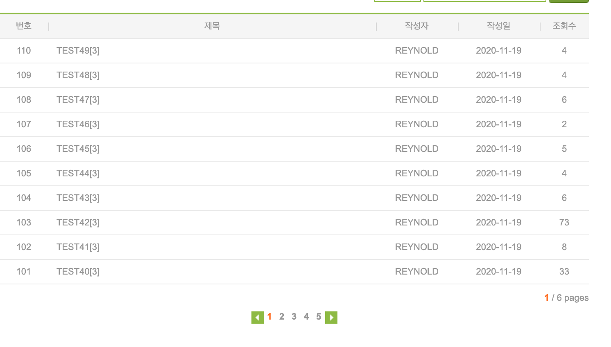


## 83. 목록에 댓글 수를 포함하기 위한 쿼리문제

- 공지목록과 각 글에 대한 댓글 개수를 함께 구하는 sql 쿼리문

```sql
SELECT N.ID, N.TITLE, N.WRITER_ID, N.REGDATE, N.HIT, N.FILES, COUNT(C.ID) CMT_COUNT
FROM NOTICE N LEFT JOIN "COMMENT" C ON N.ID = C.NOTICE_ID
GROUP BY N.ID, N.TITLE, N.WRITER_ID, N.REGDATE, N.HIT, N.FILES
ORDER BY N.REGDATE DESC;
```

- 결과

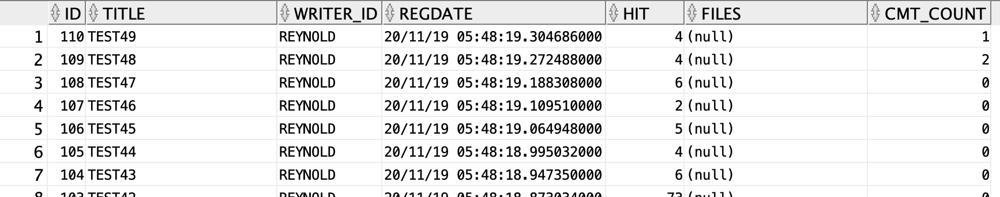


## 84. 목록의 댓글 수를 위한 View 생성하기

- 기존의 getNoticeList(String field, String query, int page)에서 사용되었던 sql문
  - 여기서 NOTICE가 적혀있는 부분에 앞서 구한 sql문이 들어가야함
  - 두 개의 쿼리문을 합하면 너무 복잡하고 길어지기 때문에 앞서 구한 sql문으로 View를 생성하고 사용하자

```sql
SELECT * 
FROM (SELECT ROWNUM NUM, N.* 
  FROM (SELECT * FROM NOTICE WHERE "+field+" LIKE ? ORDER BY REGDATE DESC) N
     ) 
WHERE NUM BETWEEN ? AND ?;
```

- JDBC에서 만들었던 NOTICE_VIEW가 있기 때문에 이번에 만드는 View이름은 NOTICE_VIEW2로 하겠음
- NOTICE_VIEW2 생성 sql
  - view를 생성할 때는 필터링이나 정렬과 같은 것들을 안하고 원본 테이블에 필요한 컬럼을 추가한 정도로 만드는 것이 좋음

```sql
CREATE VIEW NOTICE_VIEW2
AS
SELECT N.ID, N.TITLE, N.WRITER_ID, N.REGDATE, N.HIT, N.FILES, COUNT(C.ID) CMT_COUNT
FROM NOTICE N LEFT JOIN "COMMENT" C ON N.ID = C.NOTICE_ID
GROUP BY N.ID, N.TITLE, N.WRITER_ID, N.REGDATE, N.HIT, N.FILES;
```

- getNoticeList에서 사용하는 sql문 수정하기

```sql
SELECT * 
FROM (SELECT ROWNUM NUM, N.* 
  FROM (SELECT * FROM NOTICE_VIEW2 WHERE "+field+" LIKE ? ORDER BY REGDATE DESC) N
     ) 
WHERE NUM BETWEEN ? AND ?;
```

- NoticeService.java
  - Notice라는 entity를 그대로 사용하려면 cmtCount라는 속성을 추가해줘야하는데 그것보다는 Notice를 상속하는 NoticeView entity를 만들어주는 것이 바람직
  - content 속성은 DB에서 안받아왔으므로 뺴줌
    - GROUP BY할 때 용량이커서 처리하기 어려워서 빼줌
  - CMT_COUNT값을 cmtCount로 받고 NoticeView에 값들을 저장해서 객체화하고 리턴해줌
    - 관련된 부분들에서 기존에 Notice로 되어있던 객체타입을 NoticeView로 변경해주자

```java
package com.reynold.web.service;

import com.reynold.web.entity.Notice;
import com.reynold.web.entity.NoticeView;

public class NoticeService {
	public List<NoticeView> getNoticeList(){
		
		return getNoticeList("title", "", 1);
	}
	
	public List<NoticeView> getNoticeList(int page){
			
		return getNoticeList("title", "", page);
	}
	
	public List<NoticeView> getNoticeList(String field, String query, int page){
		
		List<NoticeView> list = new ArrayList<>();
		
		String sql = "SELECT * FROM (" + 
				"    SELECT ROWNUM NUM, N.*" + 
				"    FROM (SELECT * FROM NOTICE_VIEW2 WHERE "+field+" LIKE ? ORDER BY REGDATE DESC) N" + 
				") " + 
				"WHERE NUM BETWEEN ? AND ?";
		
		String url = "jdbc:oracle:thin:@localhost:1521/xepdb1";

		try {
			Class.forName("oracle.jdbc.driver.OracleDriver");
			Connection con = DriverManager.getConnection(url, "NEWLEC", "1234");
			PreparedStatement st = con.prepareStatement(sql);
			st.setString(1, "%"+query+"%");
			st.setInt(2, 1+(page-1)*10);
			st.setInt(3, page*10);
			
			ResultSet rs = st.executeQuery();
			
			while(rs.next()){
				
				int id = rs.getInt("ID");
				String title = rs.getString("TITLE");
				String writerId = rs.getString("WRITER_ID");
				Date regdate = rs.getDate("REGDATE");
				String hit = rs.getString("HIT");
				String files = rs.getString("FILES");
//				String content = rs.getString("CONTENT");
				int cmtCount = rs.getInt("CMT_COUNT");
				
				NoticeView notice = new NoticeView(
						id,
						title,
						writerId,
						regdate,
						hit,
						files,
//						content,
						cmtCount
						);
				list.add(notice);
				
			}
			
			rs.close();
			st.close();
			con.close();
		} catch (ClassNotFoundException e) {
			// TODO Auto-generated catch block
			e.printStackTrace();
		} catch (SQLException e) {
			// TODO Auto-generated catch block
			e.printStackTrace();
		}
		return list;
	}
	
	public int getNoticeCount() {
		
		return getNoticeCount("title", "");
	}

}

```

- NoticeListController.java
  - NoticeView를 import하고, getNoticeList로부터 받은 NoticeView객체 리스트를 list에 저장

```java
package com.reynold.web.controller;

import java.io.IOException;
import java.sql.Connection;
import java.sql.DriverManager;
import java.sql.ResultSet;
import java.sql.SQLException;
import java.sql.Statement;
import java.util.ArrayList;
import java.util.Date;
import java.util.List;

import javax.servlet.ServletException;
import javax.servlet.annotation.WebServlet;
import javax.servlet.http.HttpServlet;
import javax.servlet.http.HttpServletRequest;
import javax.servlet.http.HttpServletResponse;

import com.reynold.web.entity.Notice;
import com.reynold.web.entity.NoticeView;
import com.reynold.web.service.NoticeService;

@WebServlet("/notice/list")
public class NoticeListController extends HttpServlet {
	@Override
	protected void doGet(HttpServletRequest request, HttpServletResponse response) throws ServletException, IOException {
		
		String field_ = request.getParameter("f");
		String query_ = request.getParameter("q");
		String page_ = request.getParameter("p");
		
		String field = "title";
		if(field_ != null && !field_.equals("")) {
			field = field_;
		}
		
		String query = "";
		if(query_ != null && !query_.equals("")) {
			query = query_;
		}
		
		int page = 1;
		if(page_ != null && !page_.equals("")) {
			page = Integer.parseInt(page_);
		}
		
		NoticeService service = new NoticeService();
		List<NoticeView> list = service.getNoticeList(field, query, page);
		int count = service.getNoticeCount(field, query);
		
		request.setAttribute("list", list);
		request.setAttribute("count", count);
		
		request
		.getRequestDispatcher("/WEB-INF/view/notice/list.jsp")
		.forward(request, response);
	}
}

```

- NoticeView.java
  - Notice를 상속하고, 추가적으로  cmtCount 속성값만 멤버변수로 생성
  - 생성자에서 content는 빈무자열로 처리해주자

```java
package com.reynold.web.entity;

import java.util.Date;

public class NoticeView extends Notice {
	
	private int cmtCount;
	
	public int getCmtCount() {
		return cmtCount;
	}

	public void setCmtCount(int cmtCount) {
		this.cmtCount = cmtCount;
	}

	public NoticeView() {
		
	}
	
	public NoticeView(int id, String title, String writerId, Date regdate, String hit, String files, int cmtCount) {
		super(id, title, writerId, regdate, hit, files, "");
		this.cmtCount = cmtCount;
	}
}

```

- list.jsp
  - 댓글의 개수를 cmtCount로 받아서 표시해줌

```jsp
<c:forEach var="n" items="${list}">
  <tr>
    <td>${n.id}</td>
    <td class="title indent text-align-left"><a href="detail?id=${n.id}">${n.title}</a><span> [${n.cmtCount}]</span></td>
    <td>${n.writerId}</td>
    <td><fmt:formatDate pattern="yyyy-MM-dd" value="${n.regdate}"/></td>
    <td>${n.hit}</td>
  </tr>
</c:forEach>
```

- 결과

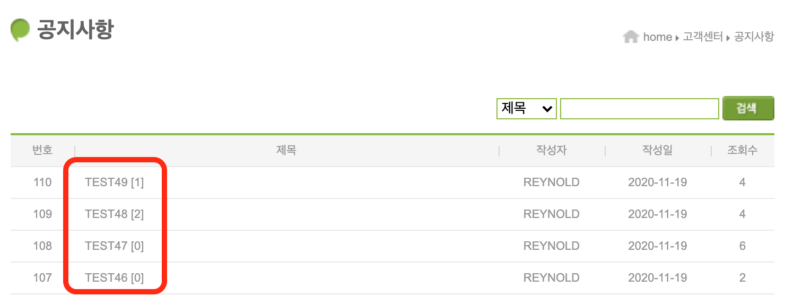


## 85. Index 페이지 추가하기

- Index.jsp
  - Index.html 파일을 이용해서 만들고, 위에 지시자만 달아주자

```jsp
<%@ page language="java" contentType="text/html; charset=UTF-8"
  pageEncoding="UTF-8"%>

<!-- index.html 내용 그대로 옮기기 -->
```

- IndexController.java
  - index 관련된 요청과 응답을 처리할 control 생성

```java
package com.reynold.web.controller;

import java.io.IOException;

import javax.servlet.ServletException;
import javax.servlet.annotation.WebServlet;
import javax.servlet.http.HttpServlet;
import javax.servlet.http.HttpServletRequest;
import javax.servlet.http.HttpServletResponse;

@WebServlet("/index")
public class IndexController extends HttpServlet {
	@Override
	protected void doGet(HttpServletRequest request, HttpServletResponse response) throws ServletException, IOException {
		
		request
		.getRequestDispatcher("/WEB-INF/view/index.jsp")
		.forward(request, response);
	}
}

```

- controller 파일 구조 변경
  - notice 관련 controller들을 묶어주기

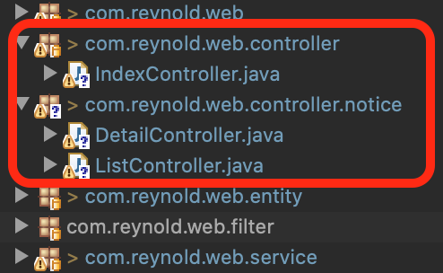

- index 페이지 결과

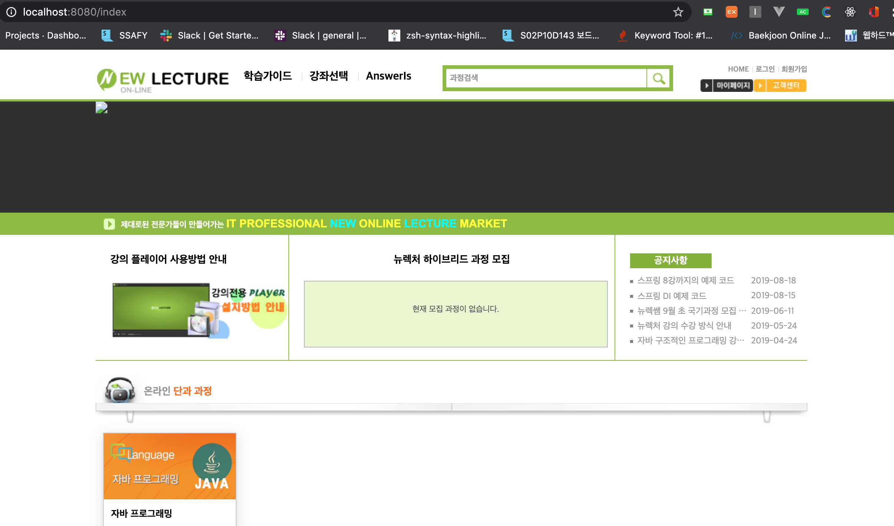


## 86. Admin 페이지를 위한 서비스 목록 추가하기

- 관리자홈의 공지사항 목록 페이지
  - 일괄공개 요청
    - pubNoticeAll(ids)
  - 일괄삭제 요청
    - removeNoticeAll(ids)
  - 글쓰기 페이지 요청

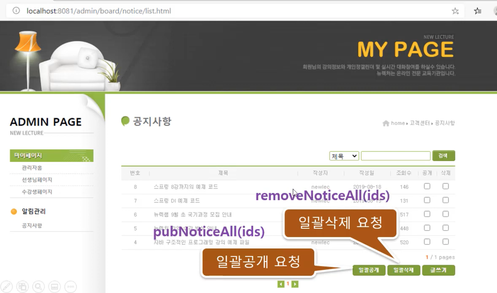

- 글쓰기 페이지
  - 공지등록 요청
    - insertNotice(notice)

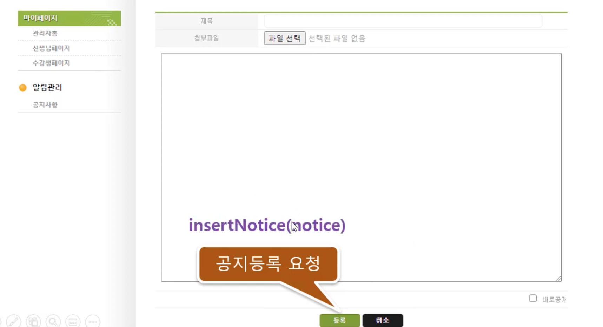

- 관리자홈의 디테일페이지
  - 공지삭제 요청
    - deleteNotice(id)
  - 글수정 페이지 요청

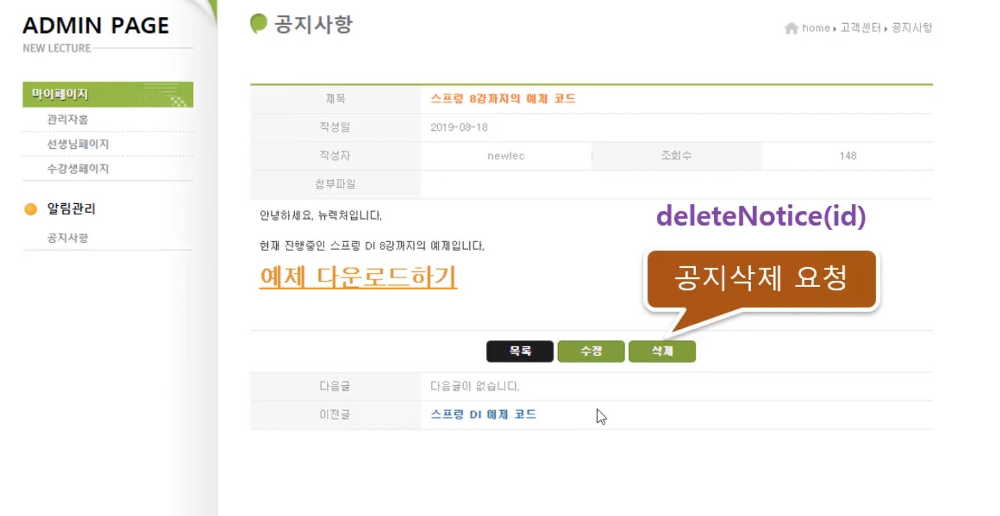

- 글수정 페이지
  - 공지수정 요청
    - updateNotice(notice)

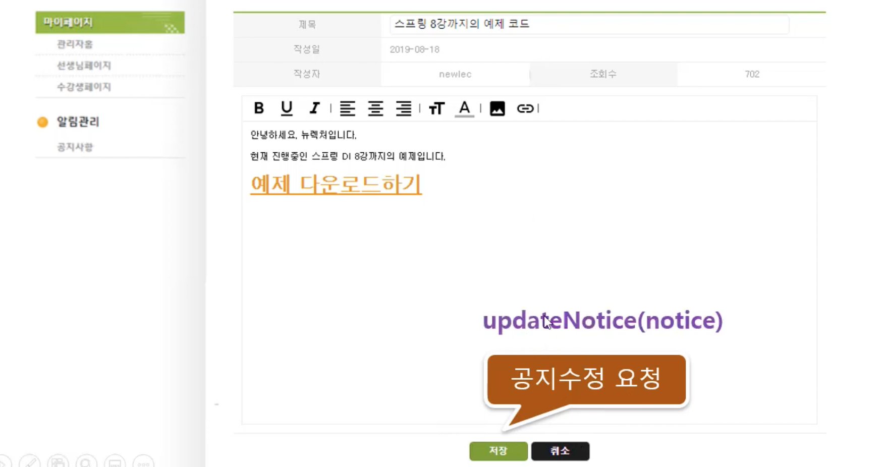

- index 페이지의 공지사항 파트
  - getNoticeNewestList()


- NoticeService.java
  - 앞서 말한 서비스 로직들을 추가해주기
  - 일단 형태만 갖춰두자

```java
package com.reynold.web.service;

import java.sql.Connection;
import java.sql.DriverManager;
import java.sql.PreparedStatement;
import java.sql.ResultSet;
import java.sql.SQLException;
import java.sql.Statement;
import java.util.ArrayList;
import java.util.Date;
import java.util.List;

import com.reynold.web.entity.Notice;
import com.reynold.web.entity.NoticeView;

public class NoticeService {
	
	public int removeNoticeAll(int[] ids) {
		
		return 0;
	}
	
	public int pubNoticeAll(int[] ids) {
		
		return 0;
	}
	
	public int insertNotice(Notice notice){
		
		return 0;
	}
	
	public int deleteNotice(int id){
		
		return 0;
	}
	
	public int updateNotice(Notice notice){
		
		return 0;
	}
	
	public List<Notice> getNoticeNewestList(){
		
		return null;
	}
	
  // 밑에는 생략
}

```


## 87. Admin/index 페이지 만들기

- admin관련된 요청과 응답을 처리할 controller들을 담기 위해 com.reynold.web.controller.admin패키지를 만들고, 그 안에 IndexController.java 생성

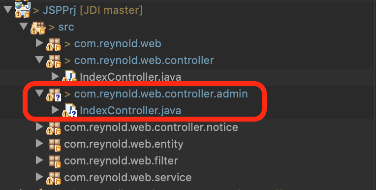

- IndexController.java
  - /admin/index 로 요청을 받고, /WEB-INF/view/admin/index.jsp로 요청을 전달

```java
package com.reynold.web.controller.admin;

import java.io.IOException;

import javax.servlet.ServletException;
import javax.servlet.annotation.WebServlet;
import javax.servlet.http.HttpServlet;
import javax.servlet.http.HttpServletRequest;
import javax.servlet.http.HttpServletResponse;

@WebServlet("/admin/index")
public class IndexController extends HttpServlet {
	@Override
	protected void doGet(HttpServletRequest request, HttpServletResponse response) throws ServletException, IOException {
		
		request
		.getRequestDispatcher("/WEB-INF/view/admin/index.jsp")
		.forward(request, response);
	}
}

```

- Index.jsp
  - index.jsp를 생성하고 view의 admin 안에 있는 index.html을 그대로 복사해서 붙여넣기

```jsp
<%@ page language="java" contentType="text/html; charset=UTF-8"
    pageEncoding="UTF-8"%>

<!-- index.html 내용 그대로 붙여넣기 -->
```

- 결과
  - controller에서 서버를 실행할 때, 한 프로젝트에 동일한 클래스 이름이 둘 이상인 경우에는 URL이 정상적으로 입력되지 않는 오류가 발생하는데 이거는 이클립스의 버그
  - 서버를 실행시키고 난 후, URL을 입력해서 요청하면 정상적으로 페이지가 나옴

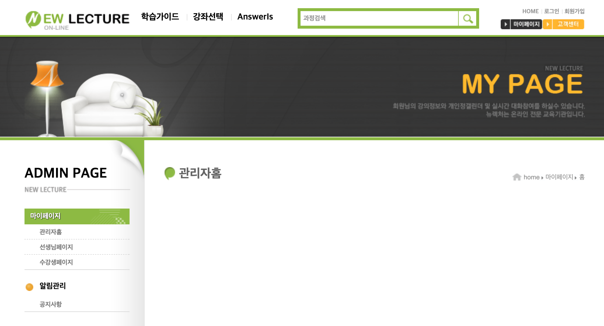


## 88. Admin/notice/list 페이지 추가하기

- admin의 notice 관련 요청과 응답을 처리하기 위한 controller들을 담을 패키지 생성

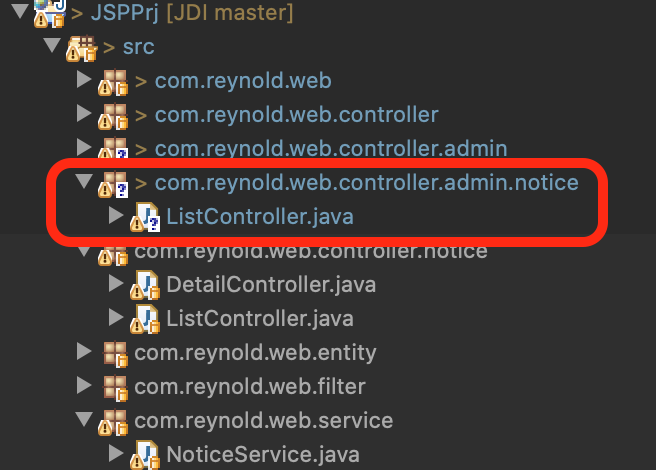

- ListController.java
  - 일반회원용 ListController.java와 거의 유사함

```java
package com.reynold.web.controller.admin.notice;

import com.reynold.web.entity.Notice;
import com.reynold.web.entity.NoticeView;
import com.reynold.web.service.NoticeService;

@WebServlet("/admin/notice/list")
public class ListController extends HttpServlet {
	@Override
	protected void doGet(HttpServletRequest request, HttpServletResponse response) throws ServletException, IOException {
		
		String field_ = request.getParameter("f");
		String query_ = request.getParameter("q");
		String page_ = request.getParameter("p");
		
		String field = "title";
		if(field_ != null && !field_.equals("")) {
			field = field_;
		}
		
		String query = "";
		if(query_ != null && !query_.equals("")) {
			query = query_;
		}
		
		int page = 1;
		if(page_ != null && !page_.equals("")) {
			page = Integer.parseInt(page_);
		}
		
		NoticeService service = new NoticeService();
		List<NoticeView> list = service.getNoticeList(field, query, page);
		int count = service.getNoticeCount(field, query);
		
		request.setAttribute("list", list);
		request.setAttribute("count", count);
		
		request
		.getRequestDispatcher("/WEB-INF/view/admin/board/notice/list.jsp")
		.forward(request, response);
	}
}


```

- list.jsp
  - 일반회원용  list.jsp와 거의 유사함

```jsp
<%@ page language="java" contentType="text/html; charset=UTF-8"
    pageEncoding="UTF-8"%>
<%@ taglib prefix="c" uri="http://java.sun.com/jsp/jstl/core" %>
<%@ taglib prefix="fmt" uri="http://java.sun.com/jsp/jstl/fmt" %>
<%@ taglib prefix="fn" uri="http://java.sun.com/jsp/jstl/functions" %>

<!DOCTYPE html>
<html>

<head>
	<title>코딩 전문가를 만들기 위한 온라인 강의 시스템</title>
	<meta charset="UTF-8">
	<title>공지사항목록</title>

	<link href="/css/customer/layout.css" type="text/css" rel="stylesheet" />
	<style>
		#visual .content-container {
			height: inherit;
			display: flex;
			align-items: center;

			background: url("/images/mypage/visual.png") no-repeat center;
		}
	</style>
</head>

<body>
	<!-- header 부분 -->

	<header id="header">

		<div class="content-container">
			<!-- ---------------------------<header>--------------------------------------- -->

			<h1 id="logo">
				<a href="/index.html">
					

				</a>
			</h1>

			<section>
				<h1 class="hidden">헤더</h1>

				<nav id="main-menu">
					<h1>메인메뉴</h1>
					<ul>
						<li><a href="/guide">학습가이드</a></li>

						<li><a href="/course">강좌선택</a></li>
						<li><a href="/answeris/index">AnswerIs</a></li>
					</ul>
				</nav>

				<div class="sub-menu">

					<section id="search-form">
						<h1>강좌검색 폼</h1>
						<form action="/course">
							<fieldset>
								<legend>과정검색필드</legend>
								<label>과정검색</label>
								<input type="text" name="q" value="" />
								<input type="submit" value="검색" />
							</fieldset>
						</form>
					</section>

					<nav id="acount-menu">
						<h1 class="hidden">회원메뉴</h1>
						<ul>
							<li><a href="/index.html">HOME</a></li>
							<li><a href="/member/login.html">로그인</a></li>
							<li><a href="/member/agree.html">회원가입</a></li>
						</ul>
					</nav>

					<nav id="member-menu" class="linear-layout">
						<h1 class="hidden">고객메뉴</h1>
						<ul class="linear-layout">
							<li><a href="/member/home"></a></li>
							<li><a href="/notice/list.html"></a></li>
						</ul>
					</nav>

				</div>
			</section>

		</div>

	</header>

	<!-- --------------------------- <visual> --------------------------------------- -->
	<!-- visual 부분 -->

	<div id="visual">
		<div class="content-container"></div>
	</div>
	<!-- --------------------------- <body> --------------------------------------- -->
	<div id="body">
		<div class="content-container clearfix">

			<!-- --------------------------- aside --------------------------------------- -->
			<!-- aside 부분 -->


			<aside class="aside">
				<h1>ADMIN PAGE</h1>

				<nav class="menu text-menu first margin-top">
					<h1>마이페이지</h1>
					<ul>
						<li><a href="/admin/index.html">관리자홈</a></li>
						<li><a href="/teacher/index.html">선생님페이지</a></li>
						<li><a href="/student/index.html">수강생페이지</a></li>
					</ul>
				</nav>

				<nav class="menu text-menu">
					<h1>알림관리</h1>
					<ul>
						<li><a href="/admin/board/notice/list.html">공지사항</a></li>
					</ul>
				</nav>

			</aside>
			<!-- --------------------------- main --------------------------------------- -->


			<main class="main">
				<h2 class="main title">공지사항</h2>

				<div class="breadcrumb">
					<h3 class="hidden">경로</h3>
					<ul>
						<li>home</li>
						<li>고객센터</li>
						<li>공지사항</li>
					</ul>
				</div>

				<div class="search-form margin-top first align-right">
					<h3 class="hidden">공지사항 검색폼</h3>
					<form class="table-form">
						<fieldset>
							<legend class="hidden">공지사항 검색 필드</legend>
							<label class="hidden">검색분류</label>
							<select name="f">
								<option ${(param.f == "title")?"selected":""} value="title">제목</option>
								<option ${(param.f == "writer_id")?"selected":""} value="writer_id">작성자</option>
							</select> 
							<label class="hidden">검색어</label>
							<input type="text" name="q" value="${param.q}"/>
							<input class="btn btn-search" type="submit" value="검색" />
						</fieldset>
					</form>
				</div>

				<div class="notice margin-top">
					<h3 class="hidden">공지사항 목록</h3>
					<table class="table">
						<thead>
							<tr>
								<th class="w60">번호</th>
								<th class="expand">제목</th>
								<th class="w100">작성자</th>
								<th class="w100">작성일</th>
								<th class="w60">조회수</th>
								<th class="w40">공개</th>
								<th class="w40">삭제</th>
							</tr>
						</thead>
						<tbody>
							<c:forEach var="n" items="${list}">
							<tr>
								<td>${n.id}</td>
								<td class="title indent text-align-left"><a href="detail?id=${n.id}">${n.title}</a><span> [${n.cmtCount}]</span></td>
								<td>${n.writerId}</td>
								<td><fmt:formatDate pattern="yyyy-MM-dd" value="${n.regdate}"/></td>
								<td>${n.hit}</td>
								<td><input type="checkbox" name="open"></td>
								<td><input type="checkbox" name="del"></td>
							</tr>
							</c:forEach>
						</tbody>
					</table>
				</div>
				
				<c:set var="page" value="${(empty param.p)?1:param.p}"/>
				<c:set var="startNum" value="${page-(page-1)%5}"/>
				<c:set var="lastNum" value="${fn:substringBefore(Math.ceil(count/10), '.')}"/>
				
				<div class="indexer margin-top align-right">
					<h3 class="hidden">현재 페이지</h3>
					<div><span class="text-orange text-strong">${page}</span> / ${lastNum} pages</div>
				</div>

				<div class="text-align-right margin-top">
					<input type="submit" class="btn-text btn-default" value="일괄공개">
					<input type="submit" class="btn-text btn-default" value="일괄삭제">
					<a class="btn-text btn-default" href="reg.html">글쓰기</a>				
				</div>

				<div class="margin-top align-center pager">	
	
					<div>	
					<c:if test="${startNum>1}">
						<a href="?p=${startNum-1}&t=&q=" class="btn btn-prev">이전</a>
					</c:if>
					<c:if test="${startNum<=1}">
						<span class="btn btn-prev" onclick="alert('이전 페이지가 없습니다.');">이전</span>
					</c:if>
					</div>
					
					<ul class="-list- center">
						<c:forEach var="i" begin="0" end="4">
						<c:if test="${(startNum+i) <= lastNum}">
						<li><a class="-text- ${(page == (startNum+i))?'orange':''} bold" href="?p=${startNum+i}&f=${param.f}&q=${param.q}" >${startNum+i}</a></li>
						</c:if>
						</c:forEach>
					</ul>
					
					<div>
					<c:if test="${startNum+4<lastNum}">
						<a href="?p=${startNum+5}&t=&q=" class="btn btn-next">다음</a>
					</c:if>
					<c:if test="${startNum+4>=lastNum}">
						<span class="btn btn-next" onclick="alert('다음 페이지가 없습니다.');">다음</span>
					</c:if>
					</div>
			
				</div>
			</main>


		</div>
	</div>

	<!-- ------------------- <footer> --------------------------------------- -->


	<footer id="footer">
		<div class="content-container">
			<h2 id="footer-logo"></h2>

			<div id="company-info">
				<dl>
					<dt>주소:</dt>
					<dd>서울특별시 </dd>
					<dt>관리자메일:</dt>
					<dd>admin@newlecture.com</dd>
				</dl>
				<dl>
					<dt>사업자 등록번호:</dt>
					<dd>111-11-11111</dd>
					<dt>통신 판매업:</dt>
					<dd>신고제 1111 호</dd>
				</dl>
				<dl>
					<dt>상호:</dt>
					<dd>뉴렉처</dd>
					<dt>대표:</dt>
					<dd>홍길동</dd>
					<dt>전화번호:</dt>
					<dd>111-1111-1111</dd>
				</dl>
				<div id="copyright" class="margin-top">Copyright ⓒ newlecture.com 2012-2014 All Right Reserved.
					Contact admin@newlecture.com for more information</div>
			</div>
		</div>
	</footer>
</body>

</html>
```

- 결과

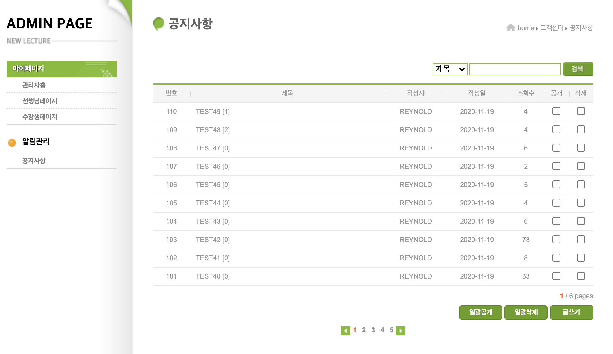


## 89. 다중 선택 값 POST 하기

- list.jsp
  - open-id와 del-id를 체크박스로 받아서 post요청으로 보내기위해서 submit부분(일괄공개, 일괄삭제)과 함께 form태그로 묶여있어야함

```jsp
<form action="list" method="post">
  <div class="notice margin-top">
    <h3 class="hidden">공지사항 목록</h3>
    <table class="table">
      <thead>
        <tr>
          <th class="w60">번호</th>
          <th class="expand">제목</th>
          <th class="w100">작성자</th>
          <th class="w100">작성일</th>
          <th class="w60">조회수</th>
          <th class="w40">공개</th>
          <th class="w40">삭제</th>
        </tr>
      </thead>
      <tbody>
        <c:forEach var="n" items="${list}">
          <tr>
            <td>${n.id}</td>
            <td class="title indent text-align-left"><a href="detail?id=${n.id}">${n.title}</a><span> [${n.cmtCount}]</span></td>
            <td>${n.writerId}</td>
            <td><fmt:formatDate pattern="yyyy-MM-dd" value="${n.regdate}"/></td>
            <td>${n.hit}</td>
            <td><input type="checkbox" name="open-id" value="${n.id}"></td>
            <td><input type="checkbox" name="del-id" value="${n.id}"></td>
          </tr>
        </c:forEach>
      </tbody>
    </table>
  </div>

  <c:set var="page" value="${(empty param.p)?1:param.p}"/>
  <c:set var="startNum" value="${page-(page-1)%5}"/>
  <c:set var="lastNum" value="${fn:substringBefore(Math.ceil(count/10), '.')}"/>

  <div class="indexer margin-top align-right">
    <h3 class="hidden">현재 페이지</h3>
    <div><span class="text-orange text-strong">${page}</span> / ${lastNum} pages</div>
  </div>

  <div class="text-align-right margin-top">
    <input type="submit" class="btn-text btn-default" value="일괄공개">
    <input type="submit" class="btn-text btn-default" value="일괄삭제">
    <a class="btn-text btn-default" href="reg.html">글쓰기</a>				
  </div>
</form>
```

- ListController.java
  - post요청을 받아줄 메소드 생성
  - 다중 값으로 전달되는 파라미터들을 콘솔로 확인해보자

```java
@Override
protected void doPost(HttpServletRequest request, HttpServletResponse response) throws ServletException, IOException {

  String[] openIds = request.getParameterValues("open-id");
  String[] delIds = request.getParameterValues("del-id");

  for(String openId : openIds) {
    System.out.printf("open id : %s\n", openId);
  }

  for(String delId : delIds) {
    System.out.printf("del id : %s\n", delId);
  }
}
```

- 결과

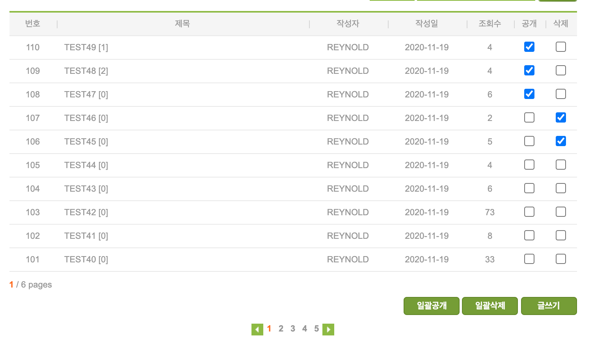

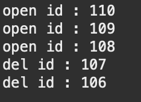


## 90. 다중  Submit 요청 구분하기

- list.jsp
  - submit 버튼에서도 name을 key값으로 가지는 파라미터를 전달할 수 있음

```jsp
<div class="text-align-right margin-top">
  <input type="submit" class="btn-text btn-default" name="cmd" value="일괄공개">
  <input type="submit" class="btn-text btn-default" name="cmd" value="일괄삭제">
  <a class="btn-text btn-default" href="reg.html">글쓰기</a>				
</div>
```

- ListController.java
  - key가 cmd인 파라미터의 값을 받아서 일괄공개인지 일괄삭제인지에 따라서 보여지는 결과가 달라지도록 구분

```java
@Override
protected void doPost(HttpServletRequest request, HttpServletResponse response) throws ServletException, IOException {

  String[] openIds = request.getParameterValues("open-id");
  String[] delIds = request.getParameterValues("del-id");
  String cmd = request.getParameter("cmd");

  switch(cmd) {
    case "일괄공개":
      for(String openId : openIds) {
        System.out.printf("open id : %s\n", openId);
      }
      break;
    case "일괄삭제":
      for(String delId : delIds) {
        System.out.printf("del id : %s\n", delId);
      }
      break;
  }
}
```

- 결과
  - 일괄공개로 보냈기 때문에 콘솔에는 open-id만 찍히게 됨

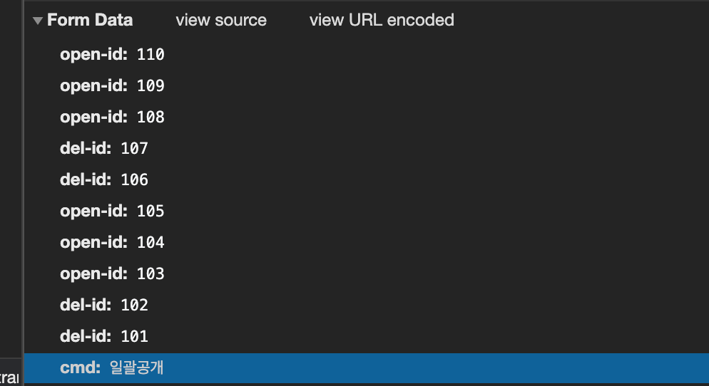

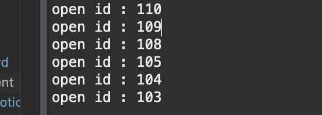

- 게시글 공개에 대한 DB처리를 위해 PUB 컬럼을 생성하자

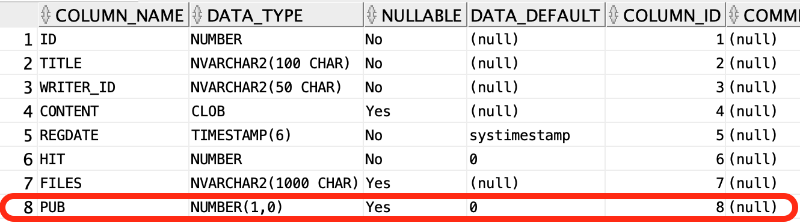


## 91. 일괄삭제 구현하기

- ListController.java
  - 전달받은 del-id들을 정수배열로 바꿔서 deleteNoticeAll의 매개변수로 넣고 요청
  - 삭제 후, get메소드를 요청해서 notice List를 받아올 수 있도록 response.sendRedirect("list")를 해주자

```java
package com.reynold.web.controller.admin.notice;

import com.reynold.web.entity.Notice;
import com.reynold.web.entity.NoticeView;
import com.reynold.web.service.NoticeService;

@WebServlet("/admin/board/notice/list")
public class ListController extends HttpServlet {
	@Override
	protected void doPost(HttpServletRequest request, HttpServletResponse response) throws ServletException, IOException {
		
		String[] openIds = request.getParameterValues("open-id");
		String[] delIds = request.getParameterValues("del-id");
		String cmd = request.getParameter("cmd");
		
		switch(cmd) {
		case "일괄공개":
			for(String openId : openIds) {
				System.out.printf("open id : %s\n", openId);
			}
			break;
		case "일괄삭제":
			NoticeService service = new NoticeService();
			int[] ids = new int[delIds.length];
			for(int i=0; i<delIds.length; i++) {
				ids[i] = Integer.parseInt(delIds[i]);
			}
			int result = service.deleteNoticeAll(ids);
			break;
		}
		
		response.sendRedirect("list");
	}

```

- NoticeService.java
  - 여러개의 id를 sql문에 삽입하기 위해서 다음과 같이 문자열로 바꿔서 넣어줘야함

```java
public int deleteNoticeAll(int[] ids) {
		
		int result = 0;
		
		String params = "";
		
		for(int i=0; i<ids.length; i++) {
			params += ids[i];
			if(i < ids.length-1) {
				params += ",";
			}
		}
		
		String sql = "DELETE NOTICE WHERE ID IN ("+params+")";
		
		String url = "jdbc:oracle:thin:@localhost:1521/xepdb1";

		try {
			Class.forName("oracle.jdbc.driver.OracleDriver");
			Connection con = DriverManager.getConnection(url, "NEWLEC", "1234");
			Statement st = con.createStatement();
			
			result = st.executeUpdate(sql);
			
			st.close();
			con.close();
		} catch (ClassNotFoundException e) {
			// TODO Auto-generated catch block
			e.printStackTrace();
		} catch (SQLException e) {
			// TODO Auto-generated catch block
			e.printStackTrace();
		}
		
		return result;
	}
```


## 참고

- 유튜브 채널 뉴렉처


