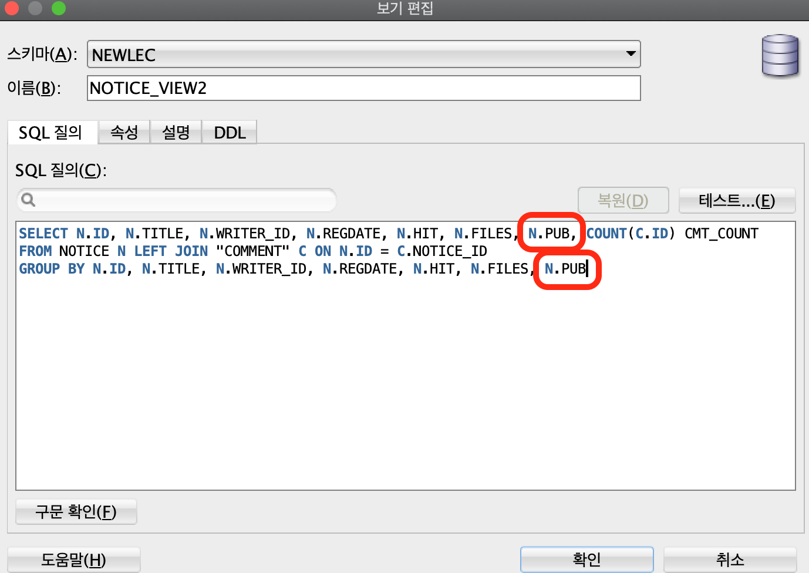

# JSP 학습 5


## 92. 공지사항 등록을 위한 Controller/View 준비하기

- reg.html파일을 복사해서 reg.jsp 생성

```jsp
<form method="post" action="reg">
  <div class="margin-top first">
    <h3 class="hidden">공지사항 입력</h3>
    <table class="table">
      <tbody>
        <tr>
          <th>제목</th>
          <td class="text-align-left text-indent text-strong text-orange" colspan="3">
            <input type="text" name="title" />
          </td>
        </tr>
        <tr>
          <th>첨부파일</th>
          <td colspan="3" class="text-align-left text-indent"><input type="file"
                                                                     name="file" /> </td>
        </tr>
        <tr class="content">
          <td colspan="4"><textarea class="content" name="content"></textarea></td>
        </tr>
        <tr>
          <td colspan="4" class="text-align-right"><input class="vertical-align" type="checkbox" id="open" name="open" value="true"><label for="open" class="margin-left">바로공개</label> </td>
        </tr>
      </tbody>
    </table>
  </div>
  <div class="margin-top text-align-center">
    <input class="btn-text btn-default" type="submit" value="등록" />
    <a class="btn-text btn-cancel" href="list.html">취소</a>
  </div>
</form>
```

- RegController.java
  - get요청을 받으면 reg.jsp 페이지 전달
  - post요청으로 각 데이터들을 입력받아서 전달받음

```java
package com.reynold.web.controller.admin.notice;

import java.io.IOException;
import java.io.PrintWriter;

import javax.servlet.ServletException;
import javax.servlet.annotation.WebServlet;
import javax.servlet.http.HttpServlet;
import javax.servlet.http.HttpServletRequest;
import javax.servlet.http.HttpServletResponse;

@WebServlet("/admin/board/notice/reg")
public class RegController extends HttpServlet {
	@Override
	protected void doGet(HttpServletRequest request, HttpServletResponse response) throws ServletException, IOException {
		
		request
		.getRequestDispatcher("/WEB-INF/view/admin/board/notice/reg.jsp")
		.forward(request, response);
	}
	
	@Override
	protected void doPost(HttpServletRequest request, HttpServletResponse response) throws ServletException, IOException {
		String title = request.getParameter("title");
		String content = request.getParameter("content");
		String isOpen = request.getParameter("open");
		
    response.setCharacterEncoding("UTF-8");
		response.setContentType("text/html; charset=UTF-8");
		PrintWriter out = response.getWriter();
		out.printf("title : %s<br >", title);
		out.printf("content : %s<br >", content);
		out.printf("open : %s<br >", isOpen);
	}
}
```


## 93. pub 컬럼 추가에 대한 변경사항 처리

- DB에서 Notice에 pub 컬럽을 하나 추가했는데 이와 관련해서 수정해야될 것들이 많음
- 가장 먼저 notice entity를 수정해주자
- Notice.java

```java
package com.reynold.web.entity;

import java.util.Date;

public class Notice {
	
	private int id;
	private String title;
	private String writerId;
	private Date regdate;
	private String hit;
	private String files;
	private String content;
	private boolean pub;
	

	public Notice() {
		
	}
	
	public Notice(int id, String title, String writerId, Date regdate, String hit, String files, String content,
			boolean pub) {
		this.id = id;
		this.title = title;
		this.writerId = writerId;
		this.regdate = regdate;
		this.hit = hit;
		this.files = files;
		this.content = content;
		this.pub = pub;
	}

	public int getId() {
		return id;
	}

	public void setId(int id) {
		this.id = id;
	}

	public String getTitle() {
		return title;
	}

	public void setTitle(String title) {
		this.title = title;
	}

	public String getWriterId() {
		return writerId;
	}

	public void setWriterId(String writerId) {
		this.writerId = writerId;
	}

	public Date getRegdate() {
		return regdate;
	}

	public void setRegdate(Date regdate) {
		this.regdate = regdate;
	}

	public String getHit() {
		return hit;
	}

	public void setHit(String hit) {
		this.hit = hit;
	}

	public String getFiles() {
		return files;
	}

	public void setFiles(String files) {
		this.files = files;
	}

	public String getContent() {
		return content;
	}

	public void setContent(String content) {
		this.content = content;
	}
	
	public boolean getPub() {
		return pub;
	}

	public void setPub(boolean pub) {
		this.pub = pub;
	}

	@Override
	public String toString() {
		return "Notice [id=" + id + ", title=" + title + ", writerId=" + writerId + ", regdate=" + regdate + ", hit="
				+ hit + ", files=" + files + ", content=" + content + ", pub=" + pub + "]";
	}

}
```

- DB에서 만들었던 NOTICE_VIEW2도 수정해줘야함



- NoticeView.java에서의 생성자도 수정해줘야함

```java
package com.reynold.web.entity;

import java.util.Date;

public class NoticeView extends Notice {
	
	private int cmtCount;
	
	public int getCmtCount() {
		return cmtCount;
	}

	public void setCmtCount(int cmtCount) {
		this.cmtCount = cmtCount;
	}

	public NoticeView() {
		
	}
	
	public NoticeView(int id, String title, String writerId, Date regdate, String hit, String files, boolean pub, int cmtCount) {
		super(id, title, writerId, regdate, hit, files, "", pub);
		this.cmtCount = cmtCount;
	}

	
}

```

- Notice와 NoticeView를 사용하는 NoticeService.java에서도 수정해줘야할 부분들이 많음
  - DB에서 각 속성값들을 받아오는 부분과, 생성자를 통해 객체를 만드는 과정 수정해줌

```java
package com.reynold.web.service;

import java.sql.Connection;
import java.sql.DriverManager;
import java.sql.PreparedStatement;
import java.sql.ResultSet;
import java.sql.SQLException;
import java.sql.Statement;
import java.util.ArrayList;
import java.util.Date;
import java.util.List;

import com.reynold.web.entity.Notice;
import com.reynold.web.entity.NoticeView;

public class NoticeService {
	
	public int removeNoticeAll(int[] ids) {
		
		return 0;
	}
	
	public int pubNoticeAll(int[] ids) {
		
		return 0;
	}
	
	public int insertNotice(Notice notice){
		
		return 0;
	}
	
	public int deleteNotice(int id){
		
		return 0;
	}
	
	public int updateNotice(Notice notice){
		
		return 0;
	}
	
	public List<Notice> getNoticeNewestList(){
		
		return null;
	}
	
	public List<NoticeView> getNoticeList(){
		
		return getNoticeList("title", "", 1);
	}
	
	public List<NoticeView> getNoticeList(int page){
			
		return getNoticeList("title", "", page);
	}
	
	public List<NoticeView> getNoticeList(String field, String query, int page){
		
		List<NoticeView> list = new ArrayList<>();
		
		String sql = "SELECT * FROM (" + 
				"    SELECT ROWNUM NUM, N.*" + 
				"    FROM (SELECT * FROM NOTICE_VIEW2 WHERE "+field+" LIKE ? ORDER BY REGDATE DESC) N" + 
				") " + 
				"WHERE NUM BETWEEN ? AND ?";
		
		String url = "jdbc:oracle:thin:@localhost:1521/xepdb1";

		try {
			Class.forName("oracle.jdbc.driver.OracleDriver");
			Connection con = DriverManager.getConnection(url, "NEWLEC", "1234");
			PreparedStatement st = con.prepareStatement(sql);
			st.setString(1, "%"+query+"%");
			st.setInt(2, 1+(page-1)*10);
			st.setInt(3, page*10);
			
			ResultSet rs = st.executeQuery();
			
			while(rs.next()){
				
				int id = rs.getInt("ID");
				String title = rs.getString("TITLE");
				String writerId = rs.getString("WRITER_ID");
				Date regdate = rs.getDate("REGDATE");
				String hit = rs.getString("HIT");
				String files = rs.getString("FILES");
//				String content = rs.getString("CONTENT");
				boolean pub = rs.getBoolean("PUB");
				int cmtCount = rs.getInt("CMT_COUNT");
				
				NoticeView notice = new NoticeView(
						id,
						title,
						writerId,
						regdate,
						hit,
						files,
//						content,
						pub,
						cmtCount
						);
				list.add(notice);
				
			}
			
			rs.close();
			st.close();
			con.close();
		} catch (ClassNotFoundException e) {
			// TODO Auto-generated catch block
			e.printStackTrace();
		} catch (SQLException e) {
			// TODO Auto-generated catch block
			e.printStackTrace();
		}
		return list;
	}
	
	public int getNoticeCount() {
		
		return getNoticeCount("title", "");
	}
	
	public int getNoticeCount(String field, String query) {
		
		int count = 0;
		
//		String sql = "SELECT COUNT(ID) COUNT FROM (" + 
//				"    SELECT ROWNUM NUM, N.*" + 
//				"    FROM (SELECT * FROM NOTICE WHERE "+field+" LIKE ? ORDER BY REGDATE DESC) N " + 
//				")";
		
		String sql = "SELECT COUNT(ID) COUNT FROM NOTICE WHERE "+field+" LIKE ? ORDER BY REGDATE DESC";
		
		String url = "jdbc:oracle:thin:@localhost:1521/xepdb1";
		
		try {
			Class.forName("oracle.jdbc.driver.OracleDriver");
			Connection con = DriverManager.getConnection(url, "NEWLEC", "1234");
			PreparedStatement st = con.prepareStatement(sql);
			st.setString(1, "%"+query+"%");
			
			ResultSet rs = st.executeQuery();
			
			if(rs.next()) {
				count = rs.getInt("count");
			}
			
			
			rs.close();
			st.close();
			con.close();
		} catch (ClassNotFoundException e) {
			// TODO Auto-generated catch block
			e.printStackTrace();
		} catch (SQLException e) {
			// TODO Auto-generated catch block
			e.printStackTrace();
		}
		
		return count;
	}
	
	public Notice getNotice(int id) {
		
		Notice notice = null;
		
		String sql = "SELECT * FROM NOTICE WHERE ID=?";
		
		String url = "jdbc:oracle:thin:@localhost:1521/xepdb1";

		try {
			Class.forName("oracle.jdbc.driver.OracleDriver");
			Connection con = DriverManager.getConnection(url, "NEWLEC", "1234");
			PreparedStatement st = con.prepareStatement(sql);
			st.setInt(1, id);
			
			ResultSet rs = st.executeQuery();
			
			if(rs.next()){
				
				int nid = rs.getInt("ID");
				String title = rs.getString("TITLE");
				String writerId = rs.getString("WRITER_ID");
				Date regdate = rs.getDate("REGDATE");
				String hit = rs.getString("HIT");
				String files = rs.getString("FILES");
				String content = rs.getString("CONTENT");
				boolean pub = rs.getBoolean("PUB");
				
				notice = new Notice(
						nid,
						title,
						writerId,
						regdate,
						hit,
						files,
						content,
						pub
						);
			}
			
			rs.close();
			st.close();
			con.close();
		} catch (ClassNotFoundException e) {
			// TODO Auto-generated catch block
			e.printStackTrace();
		} catch (SQLException e) {
			// TODO Auto-generated catch block
			e.printStackTrace();
		}
		return notice;
	}
	
	public Notice getNextNotice(int id) {
		
		Notice notice = null;
		
		String sql = "SELECT * FROM NOTICE " + 
				"WHERE ID = ( " + 
				"    SELECT ID FROM (SELECT * FROM NOTICE ORDER BY REGDATE) " + 
				"    WHERE REGDATE > (SELECT REGDATE FROM NOTICE WHERE ID=?) AND ROWNUM=1 " + 
				")";
		String url = "jdbc:oracle:thin:@localhost:1521/xepdb1";

		try {
			Class.forName("oracle.jdbc.driver.OracleDriver");
			Connection con = DriverManager.getConnection(url, "NEWLEC", "1234");
			PreparedStatement st = con.prepareStatement(sql);
			st.setInt(1, id);
			
			ResultSet rs = st.executeQuery();
			
			if(rs.next()){
				
				int nid = rs.getInt("ID");
				String title = rs.getString("TITLE");
				String writerId = rs.getString("WRITER_ID");
				Date regdate = rs.getDate("REGDATE");
				String hit = rs.getString("HIT");
				String files = rs.getString("FILES");
				String content = rs.getString("CONTENT");
				boolean pub = rs.getBoolean("PUB");
				
				notice = new Notice(
						nid,
						title,
						writerId,
						regdate,
						hit,
						files,
						content,
						pub
						);
			}
			
			rs.close();
			st.close();
			con.close();
		} catch (ClassNotFoundException e) {
			// TODO Auto-generated catch block
			e.printStackTrace();
		} catch (SQLException e) {
			// TODO Auto-generated catch block
			e.printStackTrace();
		}
		return notice;
	}
	
	public Notice getPrevNotice(int id) {
		
		Notice notice = null;
		
		String sql = "SELECT * FROM NOTICE " + 
				"WHERE ID = ( " + 
				"    SELECT ID FROM (SELECT * FROM NOTICE ORDER BY REGDATE DESC) " + 
				"    WHERE REGDATE < (SELECT REGDATE FROM NOTICE WHERE ID=?) AND ROWNUM = 1 " + 
				")";
		String url = "jdbc:oracle:thin:@localhost:1521/xepdb1";

		try {
			Class.forName("oracle.jdbc.driver.OracleDriver");
			Connection con = DriverManager.getConnection(url, "NEWLEC", "1234");
			PreparedStatement st = con.prepareStatement(sql);
			st.setInt(1, id);
			
			ResultSet rs = st.executeQuery();
			
			if(rs.next()){
				
				int nid = rs.getInt("ID");
				String title = rs.getString("TITLE");
				String writerId = rs.getString("WRITER_ID");
				Date regdate = rs.getDate("REGDATE");
				String hit = rs.getString("HIT");
				String files = rs.getString("FILES");
				String content = rs.getString("CONTENT");
				boolean pub = rs.getBoolean("PUB");
				
				notice = new Notice(
						nid,
						title,
						writerId,
						regdate,
						hit,
						files,
						content,
						pub
						);
			}
			
			rs.close();
			st.close();
			con.close();
		} catch (ClassNotFoundException e) {
			// TODO Auto-generated catch block
			e.printStackTrace();
		} catch (SQLException e) {
			// TODO Auto-generated catch block
			e.printStackTrace();
		}
		return notice;
	}

	public int deleteNoticeAll(int[] ids) {
		
		int result = 0;
		
		String params = "";
		
		for(int i=0; i<ids.length; i++) {
			params += ids[i];
			if(i < ids.length-1) {
				params += ",";
			}
		}
		
		String sql = "DELETE NOTICE WHERE ID IN ("+params+")";
		
		String url = "jdbc:oracle:thin:@localhost:1521/xepdb1";

		try {
			Class.forName("oracle.jdbc.driver.OracleDriver");
			Connection con = DriverManager.getConnection(url, "NEWLEC", "1234");
			Statement st = con.createStatement();
			
			result = st.executeUpdate(sql);
			
			st.close();
			con.close();
		} catch (ClassNotFoundException e) {
			// TODO Auto-generated catch block
			e.printStackTrace();
		} catch (SQLException e) {
			// TODO Auto-generated catch block
			e.printStackTrace();
		}
		
		return result;
	}
	
}

```


## 94. 공지사항 등록하기


## 참고

- 유튜브 채널 뉴렉처


