# JSP 학습 5


## 92. 공지사항 등록을 위한 Controller/View 준비하기

- reg.html파일을 복사해서 reg.jsp 생성

```jsp
<form method="post" action="reg">
  <div class="margin-top first">
    <h3 class="hidden">공지사항 입력</h3>
    <table class="table">
      <tbody>
        <tr>
          <th>제목</th>
          <td class="text-align-left text-indent text-strong text-orange" colspan="3">
            <input type="text" name="title" />
          </td>
        </tr>
        <tr>
          <th>첨부파일</th>
          <td colspan="3" class="text-align-left text-indent"><input type="file"
                                                                     name="file" /> </td>
        </tr>
        <tr class="content">
          <td colspan="4"><textarea class="content" name="content"></textarea></td>
        </tr>
        <tr>
          <td colspan="4" class="text-align-right"><input class="vertical-align" type="checkbox" id="open" name="open" value="true"><label for="open" class="margin-left">바로공개</label> </td>
        </tr>
      </tbody>
    </table>
  </div>
  <div class="margin-top text-align-center">
    <input class="btn-text btn-default" type="submit" value="등록" />
    <a class="btn-text btn-cancel" href="list.html">취소</a>
  </div>
</form>
```

- RegController.java
  - get요청을 받으면 reg.jsp 페이지 전달
  - post요청으로 각 데이터들을 입력받아서 전달받음

```java
package com.reynold.web.controller.admin.notice;

import java.io.IOException;
import java.io.PrintWriter;

import javax.servlet.ServletException;
import javax.servlet.annotation.WebServlet;
import javax.servlet.http.HttpServlet;
import javax.servlet.http.HttpServletRequest;
import javax.servlet.http.HttpServletResponse;

@WebServlet("/admin/board/notice/reg")
public class RegController extends HttpServlet {
	@Override
	protected void doGet(HttpServletRequest request, HttpServletResponse response) throws ServletException, IOException {
		
		request
		.getRequestDispatcher("/WEB-INF/view/admin/board/notice/reg.jsp")
		.forward(request, response);
	}
	
	@Override
	protected void doPost(HttpServletRequest request, HttpServletResponse response) throws ServletException, IOException {
		String title = request.getParameter("title");
		String content = request.getParameter("content");
		String isOpen = request.getParameter("open");
		
    response.setCharacterEncoding("UTF-8");
		response.setContentType("text/html; charset=UTF-8");
		PrintWriter out = response.getWriter();
		out.printf("title : %s<br >", title);
		out.printf("content : %s<br >", content);
		out.printf("open : %s<br >", isOpen);
	}
}
```


## 93. pub 컬럼 추가에 대한 변경사항 처리

- DB에서 Notice에 pub 컬럽을 하나 추가했는데 이와 관련해서 수정해야될 것들이 많음
- 가장 먼저 notice entity를 수정해주자
- Notice.java

```java
package com.reynold.web.entity;

import java.util.Date;

public class Notice {
	
	private int id;
	private String title;
	private String writerId;
	private Date regdate;
	private String hit;
	private String files;
	private String content;
	private boolean pub;
	

	public Notice() {
		
	}
	
	public Notice(int id, String title, String writerId, Date regdate, String hit, String files, String content,
			boolean pub) {
		this.id = id;
		this.title = title;
		this.writerId = writerId;
		this.regdate = regdate;
		this.hit = hit;
		this.files = files;
		this.content = content;
		this.pub = pub;
	}

	public int getId() {
		return id;
	}

	public void setId(int id) {
		this.id = id;
	}

	public String getTitle() {
		return title;
	}

	public void setTitle(String title) {
		this.title = title;
	}

	public String getWriterId() {
		return writerId;
	}

	public void setWriterId(String writerId) {
		this.writerId = writerId;
	}

	public Date getRegdate() {
		return regdate;
	}

	public void setRegdate(Date regdate) {
		this.regdate = regdate;
	}

	public String getHit() {
		return hit;
	}

	public void setHit(String hit) {
		this.hit = hit;
	}

	public String getFiles() {
		return files;
	}

	public void setFiles(String files) {
		this.files = files;
	}

	public String getContent() {
		return content;
	}

	public void setContent(String content) {
		this.content = content;
	}
	
	public boolean getPub() {
		return pub;
	}

	public void setPub(boolean pub) {
		this.pub = pub;
	}

	@Override
	public String toString() {
		return "Notice [id=" + id + ", title=" + title + ", writerId=" + writerId + ", regdate=" + regdate + ", hit="
				+ hit + ", files=" + files + ", content=" + content + ", pub=" + pub + "]";
	}

}
```

- DB에서 만들었던 NOTICE_VIEW2도 수정해줘야함


- NoticeView.java에서의 생성자도 수정해줘야함

```java
package com.reynold.web.entity;

import java.util.Date;

public class NoticeView extends Notice {
	
	private int cmtCount;
	
	public int getCmtCount() {
		return cmtCount;
	}

	public void setCmtCount(int cmtCount) {
		this.cmtCount = cmtCount;
	}

	public NoticeView() {
		
	}
	
	public NoticeView(int id, String title, String writerId, Date regdate, String hit, String files, boolean pub, int cmtCount) {
		super(id, title, writerId, regdate, hit, files, "", pub);
		this.cmtCount = cmtCount;
	}

	
}

```

- Notice와 NoticeView를 사용하는 NoticeService.java에서도 수정해줘야할 부분들이 많음
  - DB에서 각 속성값들을 받아오는 부분과, 생성자를 통해 객체를 만드는 과정 수정해줌

```java
package com.reynold.web.service;

import java.sql.Connection;
import java.sql.DriverManager;
import java.sql.PreparedStatement;
import java.sql.ResultSet;
import java.sql.SQLException;
import java.sql.Statement;
import java.util.ArrayList;
import java.util.Date;
import java.util.List;

import com.reynold.web.entity.Notice;
import com.reynold.web.entity.NoticeView;

public class NoticeService {
	
	public int removeNoticeAll(int[] ids) {
		
		return 0;
	}
	
	public int pubNoticeAll(int[] ids) {
		
		return 0;
	}
	
	public int insertNotice(Notice notice){
		
		return 0;
	}
	
	public int deleteNotice(int id){
		
		return 0;
	}
	
	public int updateNotice(Notice notice){
		
		return 0;
	}
	
	public List<Notice> getNoticeNewestList(){
		
		return null;
	}
	
	public List<NoticeView> getNoticeList(){
		
		return getNoticeList("title", "", 1);
	}
	
	public List<NoticeView> getNoticeList(int page){
			
		return getNoticeList("title", "", page);
	}
	
	public List<NoticeView> getNoticeList(String field, String query, int page){
		
		List<NoticeView> list = new ArrayList<>();
		
		String sql = "SELECT * FROM (" + 
				"    SELECT ROWNUM NUM, N.*" + 
				"    FROM (SELECT * FROM NOTICE_VIEW2 WHERE "+field+" LIKE ? ORDER BY REGDATE DESC) N" + 
				") " + 
				"WHERE NUM BETWEEN ? AND ?";
		
		String url = "jdbc:oracle:thin:@localhost:1521/xepdb1";

		try {
			Class.forName("oracle.jdbc.driver.OracleDriver");
			Connection con = DriverManager.getConnection(url, "NEWLEC", "1234");
			PreparedStatement st = con.prepareStatement(sql);
			st.setString(1, "%"+query+"%");
			st.setInt(2, 1+(page-1)*10);
			st.setInt(3, page*10);
			
			ResultSet rs = st.executeQuery();
			
			while(rs.next()){
				
				int id = rs.getInt("ID");
				String title = rs.getString("TITLE");
				String writerId = rs.getString("WRITER_ID");
				Date regdate = rs.getDate("REGDATE");
				String hit = rs.getString("HIT");
				String files = rs.getString("FILES");
//				String content = rs.getString("CONTENT");
				boolean pub = rs.getBoolean("PUB");
				int cmtCount = rs.getInt("CMT_COUNT");
				
				NoticeView notice = new NoticeView(
						id,
						title,
						writerId,
						regdate,
						hit,
						files,
//						content,
						pub,
						cmtCount
						);
				list.add(notice);
				
			}
			
			rs.close();
			st.close();
			con.close();
		} catch (ClassNotFoundException e) {
			// TODO Auto-generated catch block
			e.printStackTrace();
		} catch (SQLException e) {
			// TODO Auto-generated catch block
			e.printStackTrace();
		}
		return list;
	}
	
	public int getNoticeCount() {
		
		return getNoticeCount("title", "");
	}
	
	public int getNoticeCount(String field, String query) {
		
		int count = 0;
		
//		String sql = "SELECT COUNT(ID) COUNT FROM (" + 
//				"    SELECT ROWNUM NUM, N.*" + 
//				"    FROM (SELECT * FROM NOTICE WHERE "+field+" LIKE ? ORDER BY REGDATE DESC) N " + 
//				")";
		
		String sql = "SELECT COUNT(ID) COUNT FROM NOTICE WHERE "+field+" LIKE ? ORDER BY REGDATE DESC";
		
		String url = "jdbc:oracle:thin:@localhost:1521/xepdb1";
		
		try {
			Class.forName("oracle.jdbc.driver.OracleDriver");
			Connection con = DriverManager.getConnection(url, "NEWLEC", "1234");
			PreparedStatement st = con.prepareStatement(sql);
			st.setString(1, "%"+query+"%");
			
			ResultSet rs = st.executeQuery();
			
			if(rs.next()) {
				count = rs.getInt("count");
			}
			
			
			rs.close();
			st.close();
			con.close();
		} catch (ClassNotFoundException e) {
			// TODO Auto-generated catch block
			e.printStackTrace();
		} catch (SQLException e) {
			// TODO Auto-generated catch block
			e.printStackTrace();
		}
		
		return count;
	}
	
	public Notice getNotice(int id) {
		
		Notice notice = null;
		
		String sql = "SELECT * FROM NOTICE WHERE ID=?";
		
		String url = "jdbc:oracle:thin:@localhost:1521/xepdb1";

		try {
			Class.forName("oracle.jdbc.driver.OracleDriver");
			Connection con = DriverManager.getConnection(url, "NEWLEC", "1234");
			PreparedStatement st = con.prepareStatement(sql);
			st.setInt(1, id);
			
			ResultSet rs = st.executeQuery();
			
			if(rs.next()){
				
				int nid = rs.getInt("ID");
				String title = rs.getString("TITLE");
				String writerId = rs.getString("WRITER_ID");
				Date regdate = rs.getDate("REGDATE");
				String hit = rs.getString("HIT");
				String files = rs.getString("FILES");
				String content = rs.getString("CONTENT");
				boolean pub = rs.getBoolean("PUB");
				
				notice = new Notice(
						nid,
						title,
						writerId,
						regdate,
						hit,
						files,
						content,
						pub
						);
			}
			
			rs.close();
			st.close();
			con.close();
		} catch (ClassNotFoundException e) {
			// TODO Auto-generated catch block
			e.printStackTrace();
		} catch (SQLException e) {
			// TODO Auto-generated catch block
			e.printStackTrace();
		}
		return notice;
	}
	
	public Notice getNextNotice(int id) {
		
		Notice notice = null;
		
		String sql = "SELECT * FROM NOTICE " + 
				"WHERE ID = ( " + 
				"    SELECT ID FROM (SELECT * FROM NOTICE ORDER BY REGDATE) " + 
				"    WHERE REGDATE > (SELECT REGDATE FROM NOTICE WHERE ID=?) AND ROWNUM=1 " + 
				")";
		String url = "jdbc:oracle:thin:@localhost:1521/xepdb1";

		try {
			Class.forName("oracle.jdbc.driver.OracleDriver");
			Connection con = DriverManager.getConnection(url, "NEWLEC", "1234");
			PreparedStatement st = con.prepareStatement(sql);
			st.setInt(1, id);
			
			ResultSet rs = st.executeQuery();
			
			if(rs.next()){
				
				int nid = rs.getInt("ID");
				String title = rs.getString("TITLE");
				String writerId = rs.getString("WRITER_ID");
				Date regdate = rs.getDate("REGDATE");
				String hit = rs.getString("HIT");
				String files = rs.getString("FILES");
				String content = rs.getString("CONTENT");
				boolean pub = rs.getBoolean("PUB");
				
				notice = new Notice(
						nid,
						title,
						writerId,
						regdate,
						hit,
						files,
						content,
						pub
						);
			}
			
			rs.close();
			st.close();
			con.close();
		} catch (ClassNotFoundException e) {
			// TODO Auto-generated catch block
			e.printStackTrace();
		} catch (SQLException e) {
			// TODO Auto-generated catch block
			e.printStackTrace();
		}
		return notice;
	}
	
	public Notice getPrevNotice(int id) {
		
		Notice notice = null;
		
		String sql = "SELECT * FROM NOTICE " + 
				"WHERE ID = ( " + 
				"    SELECT ID FROM (SELECT * FROM NOTICE ORDER BY REGDATE DESC) " + 
				"    WHERE REGDATE < (SELECT REGDATE FROM NOTICE WHERE ID=?) AND ROWNUM = 1 " + 
				")";
		String url = "jdbc:oracle:thin:@localhost:1521/xepdb1";

		try {
			Class.forName("oracle.jdbc.driver.OracleDriver");
			Connection con = DriverManager.getConnection(url, "NEWLEC", "1234");
			PreparedStatement st = con.prepareStatement(sql);
			st.setInt(1, id);
			
			ResultSet rs = st.executeQuery();
			
			if(rs.next()){
				
				int nid = rs.getInt("ID");
				String title = rs.getString("TITLE");
				String writerId = rs.getString("WRITER_ID");
				Date regdate = rs.getDate("REGDATE");
				String hit = rs.getString("HIT");
				String files = rs.getString("FILES");
				String content = rs.getString("CONTENT");
				boolean pub = rs.getBoolean("PUB");
				
				notice = new Notice(
						nid,
						title,
						writerId,
						regdate,
						hit,
						files,
						content,
						pub
						);
			}
			
			rs.close();
			st.close();
			con.close();
		} catch (ClassNotFoundException e) {
			// TODO Auto-generated catch block
			e.printStackTrace();
		} catch (SQLException e) {
			// TODO Auto-generated catch block
			e.printStackTrace();
		}
		return notice;
	}

	public int deleteNoticeAll(int[] ids) {
		
		int result = 0;
		
		String params = "";
		
		for(int i=0; i<ids.length; i++) {
			params += ids[i];
			if(i < ids.length-1) {
				params += ",";
			}
		}
		
		String sql = "DELETE NOTICE WHERE ID IN ("+params+")";
		
		String url = "jdbc:oracle:thin:@localhost:1521/xepdb1";

		try {
			Class.forName("oracle.jdbc.driver.OracleDriver");
			Connection con = DriverManager.getConnection(url, "NEWLEC", "1234");
			Statement st = con.createStatement();
			
			result = st.executeUpdate(sql);
			
			st.close();
			con.close();
		} catch (ClassNotFoundException e) {
			// TODO Auto-generated catch block
			e.printStackTrace();
		} catch (SQLException e) {
			// TODO Auto-generated catch block
			e.printStackTrace();
		}
		
		return result;
	}
	
}

```


## 94. 공지사항 등록하기

- RegController.java
  - 입력받은 title, content, isOpen 값을 사용해서 공지사항을 추가하자
  - 작성자는 일단 임의의값으로 채워두고 나중에 로그인 부분을 완성하면 다시 수정하자
  - notice에 값을 넣고, insertNotice 함수 호출

```java
package com.reynold.web.controller.admin.notice;

import com.reynold.web.entity.Notice;
import com.reynold.web.service.NoticeService;

@WebServlet("/admin/board/notice/reg")
public class RegController extends HttpServlet {
	@Override
	protected void doPost(HttpServletRequest request, HttpServletResponse response) throws ServletException, IOException {
		String title = request.getParameter("title");
		String content = request.getParameter("content");
		String isOpen = request.getParameter("open");
		boolean pub = false;
		if(isOpen != null) {
			pub = true;
		}
		
		Notice notice = new Notice();
		notice.setTitle(title);
		notice.setContent(content);
		notice.setPub(pub);
		notice.setWriterId("reynold");
		
		NoticeService service = new NoticeService();
		int result = service.insertNotice(notice);
		
		response.sendRedirect("list");
	}
}
```

- NoticeService.java
  - insert문으로 DB에 새로운 공지사항 추가

```java
public int insertNotice(Notice notice){
		int result = 0;
		
		String sql = "INSERT INTO NOTICE(TITLE, CONTENT, WRITER_ID, PUB) VALUES(?,?,?,?)";
		
		String url = "jdbc:oracle:thin:@localhost:1521/xepdb1";

		try {
			Class.forName("oracle.jdbc.driver.OracleDriver");
			Connection con = DriverManager.getConnection(url, "NEWLEC", "1234");
			PreparedStatement st = con.prepareStatement(sql);
			st.setString(1, notice.getTitle());
			st.setString(2, notice.getContent());
			st.setString(3, notice.getWriterId());
			st.setBoolean(4, notice.getPub());
			
			result = st.executeUpdate();
			
			st.close();
			con.close();
		} catch (ClassNotFoundException e) {
			// TODO Auto-generated catch block
			e.printStackTrace();
		} catch (SQLException e) {
			// TODO Auto-generated catch block
			e.printStackTrace();
		}
		
		return result;
	}
```

-  List.jsp
  - 글쓰기 부분의 링크 수정해주기

```jsp
<div class="text-align-right margin-top">
  <input type="submit" class="btn-text btn-default" name="cmd" value="일괄공개">
  <input type="submit" class="btn-text btn-default" name="cmd" value="일괄삭제">
  <a class="btn-text btn-default" href="reg">글쓰기</a>				
</div>
```

- 결과

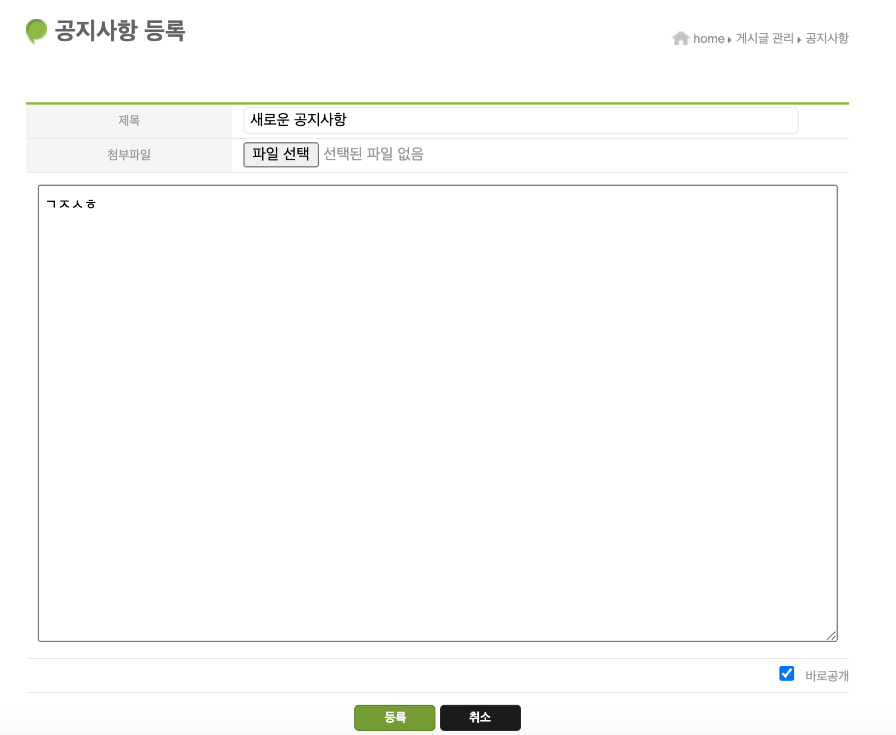

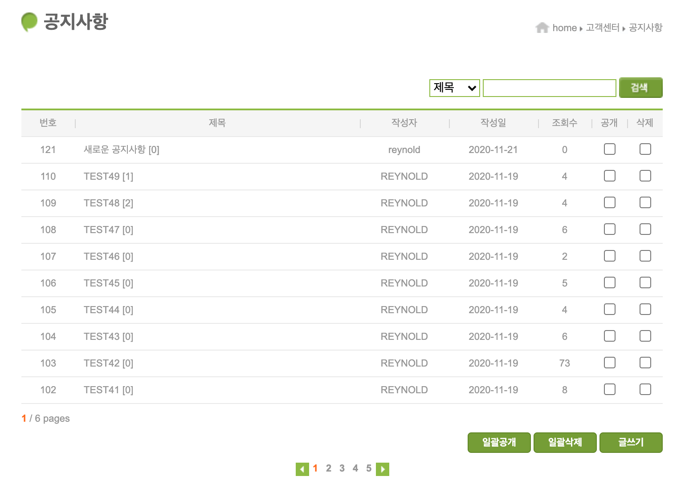


## 95. 관리자 공지사항 자세한 페이지 추가

- detail.jsp
  - detail.html 내용 복사
  - 일반회원용 detail.jsp에서의 데이터 처리부분 가져오기

```jsp
<%@ page language="java" contentType="text/html; charset=UTF-8"
    pageEncoding="UTF-8"%>
<%@ taglib prefix="c" uri="http://java.sun.com/jsp/jstl/core" %>
<%@ taglib prefix="fmt" uri="http://java.sun.com/jsp/jstl/fmt" %>
<%@ taglib prefix="fn" uri="http://java.sun.com/jsp/jstl/functions" %>

<div class="margin-top first">
  <h3 class="hidden">공지사항 내용</h3>
  <table class="table">
    <tbody>
      <tr>
        <th>제목</th>
        <td class="text-align-left text-indent text-strong text-orange" colspan="3">${n.title}</td>
      </tr>
      <tr>
        <th>작성일</th>
        <td class="text-align-left text-indent" colspan="3"><fmt:formatDate pattern="yyyy-MM-dd hh:mm:ss" value="${n.regdate}"/></td>
      </tr>
      <tr>
        <th>작성자</th>
        <td>${n.writerId}</td>
        <th>조회수</th>
        <td><fmt:formatNumber value="${n.hit}" /></td>
      </tr>
      <tr>
        <th>첨부파일</th>
        <td colspan="3" style="text-align:Left;text-indent:10px;">
          <c:forTokens var="fileName" items="${n.files}" delims="," varStatus="st">
            <c:set var="style" value="" />
            <c:if test="${fn:endsWith(fileName, '.zip')}">
              <c:set var="style" value="font-weight:bold; color:red;" />
            </c:if>
            <a href="${fileName}" style="${style}">${fn:toUpperCase(fileName)}</a>
            <c:if test="${!st.last}">
              /
            </c:if>
          </c:forTokens>
        </td>
      </tr>
      <tr class="content">
        <td colspan="4">${n.content}</td>
      </tr>
    </tbody>
  </table>
</div>

<div class="margin-top text-align-center">
  <a class="btn-text btn-cancel" href="list">목록</a>
  <a class="btn-text btn-default" href="edit">수정</a>
  <a class="btn-text btn-default" href="del">삭제</a>
</div>
```

- DetailController.java
  - 일반회원용 DetailController와 유사함

```java
package com.reynold.web.controller.admin.notice;

import com.reynold.web.entity.Notice;
import com.reynold.web.service.NoticeService;


@WebServlet("/admin/board/notice/detail")
public class DetailController extends HttpServlet {
	@Override
	protected void doGet(HttpServletRequest request, HttpServletResponse response) throws ServletException, IOException {
		
		int id = Integer.parseInt(request.getParameter("id"));

		NoticeService service = new NoticeService();
		Notice notice = service.getNotice(id);
		request.setAttribute("n", notice);
		request
		.getRequestDispatcher("/WEB-INF/view/admin/board/notice/detail.jsp")
		.forward(request, response);
	}
}

```

- 결과

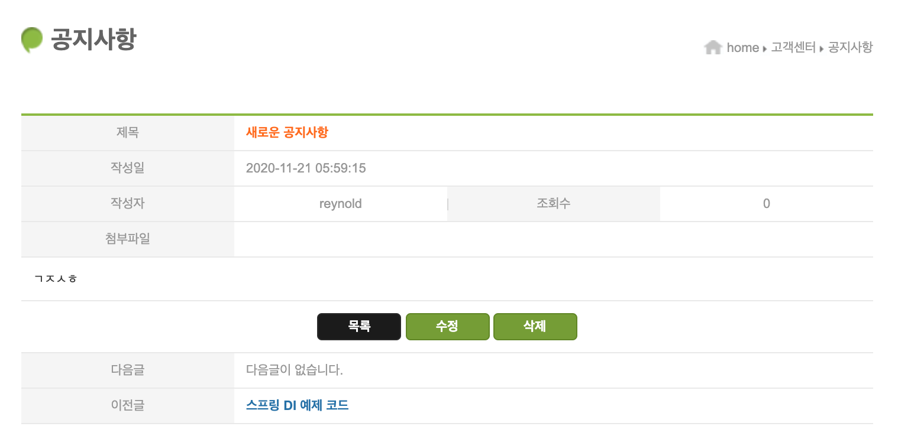


## 96. 파일업로드를 위한 인코드 multipart/form-data

### 파일전송과 멀티파트 라이브러리

- form 태그를 사용해서 요청할 때, 인코드타입을 지정할 수 있음
- 파일첨부를 하기 위해서는 enctype="mulitpart/form-data" 이렇게 설정해줘야함

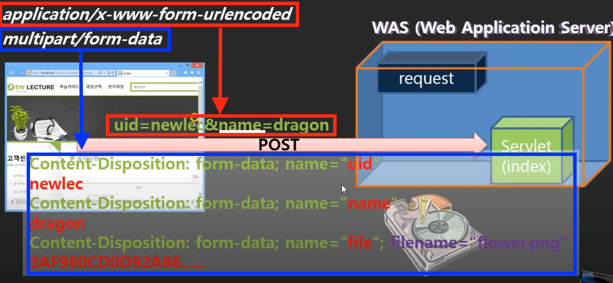

- reg.jsp
  - 인코드타입 설정해줌

```jsp
<form method="post" action="reg" enctype="multipart/form-data">
  <div class="margin-top first">
    <h3 class="hidden">공지사항 입력</h3>
    <table class="table">
      <tbody>
        <tr>
          <th>제목</th>
          <td class="text-align-left text-indent text-strong text-orange" colspan="3">
            <input type="text" name="title" />
          </td>
        </tr>
        <tr>
          <th>첨부파일</th>
          <td colspan="3" class="text-align-left text-indent"><input type="file"
                                                                     name="file" /> </td>
        </tr>
        <tr class="content">
          <td colspan="4"><textarea class="content" name="content"></textarea></td>
        </tr>
        <tr>
          <td colspan="4" class="text-align-right"><input class="vertical-align" type="checkbox" id="open" name="open" value="true"><label for="open" class="margin-left">바로공개</label> </td>
        </tr>
      </tbody>
    </table>
  </div>
  <div class="margin-top text-align-center">
    <input class="btn-text btn-default" type="submit" value="등록" />
    <a class="btn-text btn-cancel" href="list.html">취소</a>
  </div>
</form>
```


## 97. 파일 업로드를 위한 서블릿 설정

### 파일 업로드 위한 서블릿 설정

- web.xml로 설정할 경우, 한번만 설정하고 필요로하는 클래스에서 가져다 쓰면 됨
- annotation으로 설정할 경우, 매 클래스마다 설정을 해줘야함
  - 여기서 annotation으로 설정해주자

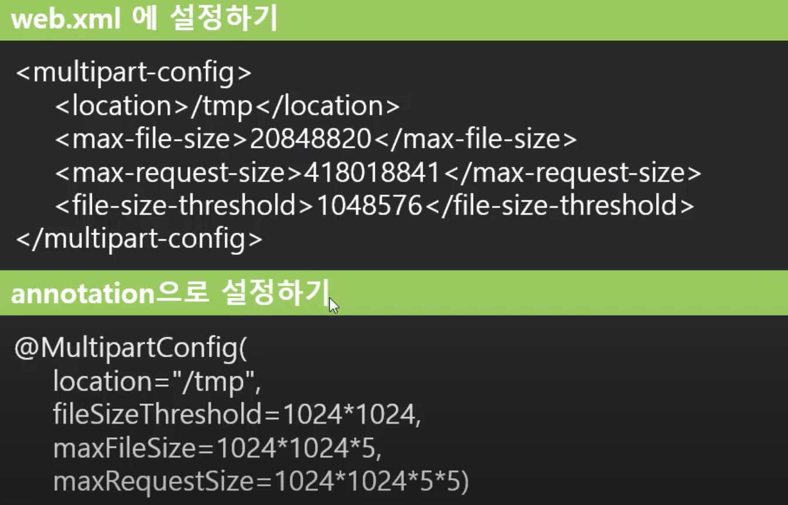

- RegController.java
  - @MultipartConfig()을 사용
    - location
      - 절대경로를 써야함
      - 절대경로는 서비스를 실행하는 리눅스와 윈도우즈에 차이가 있기 때문에, 차라리 설정을 안하고 자바가 지정된 임시 디렉토리를 사용하도록 하자
    - fileSizeThreshold
      - 이 정도 크기가 넘어가면 메모리가 아니라 디스크를 사용
    - maxFileSize
      - 하나의 파일 용량의 최대값
    - maxRequestSize
      - 여러개의 파일을 보낼 경우, 한번의 요청에 최대로 보낼 수 있는 용량

```java
package com.reynold.web.controller.admin.notice;

import com.reynold.web.entity.Notice;
import com.reynold.web.service.NoticeService;

@MultipartConfig(
	fileSizeThreshold=1024*1024,
	maxFileSize=1024*1024*50,
	maxRequestSize=1024*1024*50*5		
)
@WebServlet("/admin/board/notice/reg")
public class RegController extends HttpServlet {
	@Override
	protected void doGet(HttpServletRequest request, HttpServletResponse response) throws ServletException, IOException {
		
		request
		.getRequestDispatcher("/WEB-INF/view/admin/board/notice/reg.jsp")
		.forward(request, response);
	}
	
	@Override
	protected void doPost(HttpServletRequest request, HttpServletResponse response) throws ServletException, IOException {
		String title = request.getParameter("title");
		String content = request.getParameter("content");
		String isOpen = request.getParameter("open");
		boolean pub = false;
		if(isOpen != null) {
			pub = true;
		}
		
		Notice notice = new Notice();
		notice.setTitle(title);
		notice.setContent(content);
		notice.setPub(pub);
		notice.setWriterId("reynold");
		
		NoticeService service = new NoticeService();
		int result = service.insertNotice(notice);
		
		response.sendRedirect("list");
		
		
		
	}
}

```


## 98. 파일 저장을 위한 물리 경로 얻기

- RegController.java
  - 실제 물리 경로를 얻을 수 있는 메소드
    - request.getServletContext().getRealPath("/upload");

```java
package com.reynold.web.controller.admin.notice;

import com.reynold.web.entity.Notice;
import com.reynold.web.service.NoticeService;

@MultipartConfig(
	fileSizeThreshold=1024*1024,
	maxFileSize=1024*1024*50,
	maxRequestSize=1024*1024*50*5		
)
@WebServlet("/admin/board/notice/reg")
public class RegController extends HttpServlet {
	@Override
	protected void doGet(HttpServletRequest request, HttpServletResponse response) throws ServletException, IOException {
		
		request
		.getRequestDispatcher("/WEB-INF/view/admin/board/notice/reg.jsp")
		.forward(request, response);
	}
	
	@Override
	protected void doPost(HttpServletRequest request, HttpServletResponse response) throws ServletException, IOException {
		String title = request.getParameter("title");
		String content = request.getParameter("content");
		String isOpen = request.getParameter("open");
		
		Part filePart = request.getPart("file");
		filePart.getInputStream();
		
		// 상대경로를 절대경로로 바꿔주는 것이 필요함
		String realPath = request.getServletContext().getRealPath("/upload");
		System.out.println(realPath);
		
		boolean pub = false;
		if(isOpen != null) {
			pub = true;
		}
		
		Notice notice = new Notice();
		notice.setTitle(title);
		notice.setContent(content);
		notice.setPub(pub);
		notice.setWriterId("reynold");
		
		NoticeService service = new NoticeService();
//		int result = service.insertNotice(notice);
		
		response.sendRedirect("list");

	}
}

```

- 결과

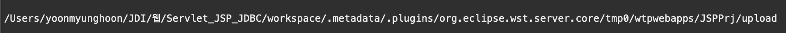


## 99.  단일 파일 업로드

- RegController.java
  - InputStream으로 file을 읽어옴
    - 이때, buf라는 1024바이트 크기의 변수로 받아옴
  - FileOutputStream을 사용해서 읽은 파일을 해당 위치에 생성해줌

```java
package com.reynold.web.controller.admin.notice;

import java.io.File;
import java.io.FileOutputStream;
import java.io.IOException;
import java.io.InputStream;
import java.io.PrintWriter;

import javax.servlet.ServletException;
import javax.servlet.annotation.MultipartConfig;
import javax.servlet.annotation.WebServlet;
import javax.servlet.http.HttpServlet;
import javax.servlet.http.HttpServletRequest;
import javax.servlet.http.HttpServletResponse;
import javax.servlet.http.Part;

import com.reynold.web.entity.Notice;
import com.reynold.web.service.NoticeService;

@MultipartConfig(
	fileSizeThreshold=1024*1024,
	maxFileSize=1024*1024*50,
	maxRequestSize=1024*1024*50*5		
)
@WebServlet("/admin/board/notice/reg")
public class RegController extends HttpServlet {
	@Override
	protected void doGet(HttpServletRequest request, HttpServletResponse response) throws ServletException, IOException {
		
		request
		.getRequestDispatcher("/WEB-INF/view/admin/board/notice/reg.jsp")
		.forward(request, response);
	}
	
	@Override
	protected void doPost(HttpServletRequest request, HttpServletResponse response) throws ServletException, IOException {
		String title = request.getParameter("title");
		String content = request.getParameter("content");
		String isOpen = request.getParameter("open");
		
		Part filePart = request.getPart("file");
		String fileName = filePart.getSubmittedFileName();
		InputStream fis = filePart.getInputStream();
		
		// 상대경로를 절대경로로 바꿔주는 것이 필요함
		String realPath = request.getServletContext().getRealPath("/upload");
		System.out.println(realPath);
		
		String filePath = realPath + File.separator + fileName;
		FileOutputStream fos = new FileOutputStream(filePath);
		
		byte[] buf = new byte[1024];
		int size = 0;
		while((size=fis.read(buf)) != -1) {
			fos.write(buf,0,size);
		}
		fos.close();
		fis.close();
		
		boolean pub = false;
		if(isOpen != null) {
			pub = true;
		}
		
		Notice notice = new Notice();
		notice.setTitle(title);
		notice.setContent(content);
		notice.setPub(pub);
		notice.setWriterId("reynold");
		
		NoticeService service = new NoticeService();
//		int result = service.insertNotice(notice);
		
		response.sendRedirect("list");

	}
}
```

- 결과

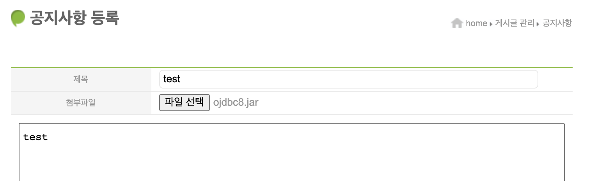

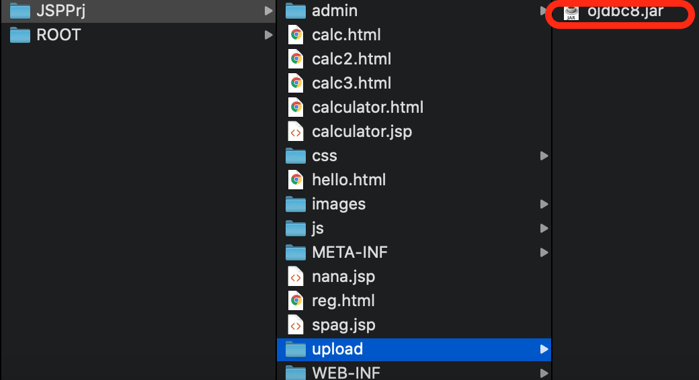


## 100. 다중 파일 업로드

- reg.jsp

```jsp
<tr>
  <th>첨부파일</th>
  <td colspan="3" class="text-align-left text-indent"><input type="file"
                                                             name="file" /> </td>
</tr>
<tr>
  <th>첨부파일</th>
  <td colspan="3" class="text-align-left text-indent"><input type="file"
                                                             name="file" /> </td>
</tr>
```

- RegController.java
  - 여러개의 파일을 getParts()를 통해서 받아줌
  - 쉼표로 구분해서 DB에 넣어주기 위해서 StringBuilder를 사용

```java
package com.reynold.web.controller.admin.notice;

import java.io.File;
import java.io.FileOutputStream;
import java.io.IOException;
import java.io.InputStream;
import java.io.PrintWriter;
import java.util.Collection;

import javax.servlet.ServletException;
import javax.servlet.annotation.MultipartConfig;
import javax.servlet.annotation.WebServlet;
import javax.servlet.http.HttpServlet;
import javax.servlet.http.HttpServletRequest;
import javax.servlet.http.HttpServletResponse;
import javax.servlet.http.Part;

import com.reynold.web.entity.Notice;
import com.reynold.web.service.NoticeService;

@MultipartConfig(
	fileSizeThreshold=1024*1024,
	maxFileSize=1024*1024*50,
	maxRequestSize=1024*1024*50*5		
)
@WebServlet("/admin/board/notice/reg")
public class RegController extends HttpServlet {
	@Override
	protected void doGet(HttpServletRequest request, HttpServletResponse response) throws ServletException, IOException {
		
		request
		.getRequestDispatcher("/WEB-INF/view/admin/board/notice/reg.jsp")
		.forward(request, response);
	}
	
	@Override
	protected void doPost(HttpServletRequest request, HttpServletResponse response) throws ServletException, IOException {
		String title = request.getParameter("title");
		String content = request.getParameter("content");
		String isOpen = request.getParameter("open");
		
		Collection<Part> parts = request.getParts();
		StringBuilder builder = new StringBuilder();
		
		for(Part p : parts) {
			if(!p.getName().equals("file")) {
				continue;
			}
			
			Part filePart = p;
			String fileName = filePart.getSubmittedFileName();
			builder.append(fileName);
			builder.append(",");
			
			InputStream fis = filePart.getInputStream();
			
			// 상대경로를 절대경로로 바꿔주는 것이 필요함
			String realPath = request.getServletContext().getRealPath("/upload");
			System.out.println(realPath);
			
			String filePath = realPath + File.separator + fileName;
			FileOutputStream fos = new FileOutputStream(filePath);
			
			byte[] buf = new byte[1024];
			int size = 0;
			while((size=fis.read(buf)) != -1) {
				fos.write(buf,0,size);
			}
			fos.close();
			fis.close();
		}
		
		builder.delete(builder.length()-1, builder.length());
		
		boolean pub = false;
		if(isOpen != null) {
			pub = true;
		}
		
		Notice notice = new Notice();
		notice.setTitle(title);
		notice.setContent(content);
		notice.setPub(pub);
		notice.setWriterId("reynold");
		notice.setFiles(builder.toString());
		
		NoticeService service = new NoticeService();
		int result = service.insertNotice(notice);
		
		response.sendRedirect("list");

	}
}

```

- 결과

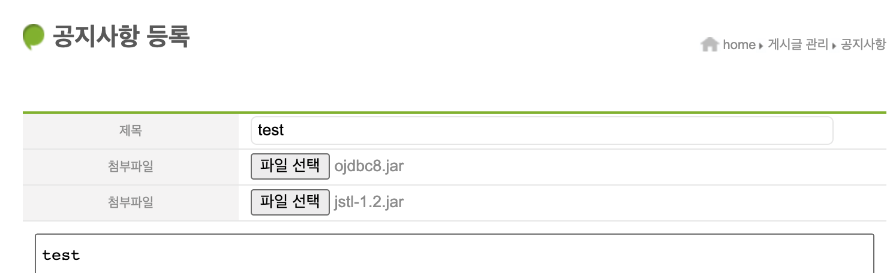


## 101. 업로드 된 파일 사용하기

- NoticeService.java
  - files 추가

```java
public int insertNotice(Notice notice){
		int result = 0;
		
		String sql = "INSERT INTO NOTICE(TITLE, CONTENT, WRITER_ID, PUB, FILES) VALUES(?,?,?,?,?)";
		
		String url = "jdbc:oracle:thin:@localhost:1521/xepdb1";

		try {
			Class.forName("oracle.jdbc.driver.OracleDriver");
			Connection con = DriverManager.getConnection(url, "NEWLEC", "1234");
			PreparedStatement st = con.prepareStatement(sql);
			st.setString(1, notice.getTitle());
			st.setString(2, notice.getContent());
			st.setString(3, notice.getWriterId());
			st.setBoolean(4, notice.getPub());
			st.setString(5, notice.getFiles());
			
			result = st.executeUpdate();
			
			st.close();
			con.close();
		} catch (ClassNotFoundException e) {
			// TODO Auto-generated catch block
			e.printStackTrace();
		} catch (SQLException e) {
			// TODO Auto-generated catch block
			e.printStackTrace();
		}
		
		return result;
	}
```

- detail.jsp
  - 다운받을 수 있도록 링크 수정

```jsp
 <tr>
   <th>첨부파일</th>
   <td colspan="3" style="text-align:Left;text-indent:10px;">
     <c:forTokens var="fileName" items="${n.files}" delims="," varStatus="st">
       <c:set var="style" value="" />
       <c:if test="${fn:endsWith(fileName, '.zip')}">
         <c:set var="style" value="font-weight:bold; color:red;" />
       </c:if>
       <a download href="/upload/${fileName}" style="${style}">${fn:toUpperCase(fileName)}</a>
       <c:if test="${!st.last}">
         /
       </c:if>
     </c:forTokens>
   </td>
</tr>
```

- 결과

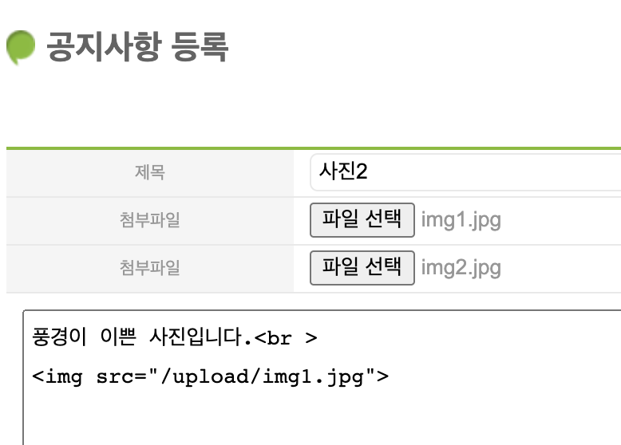

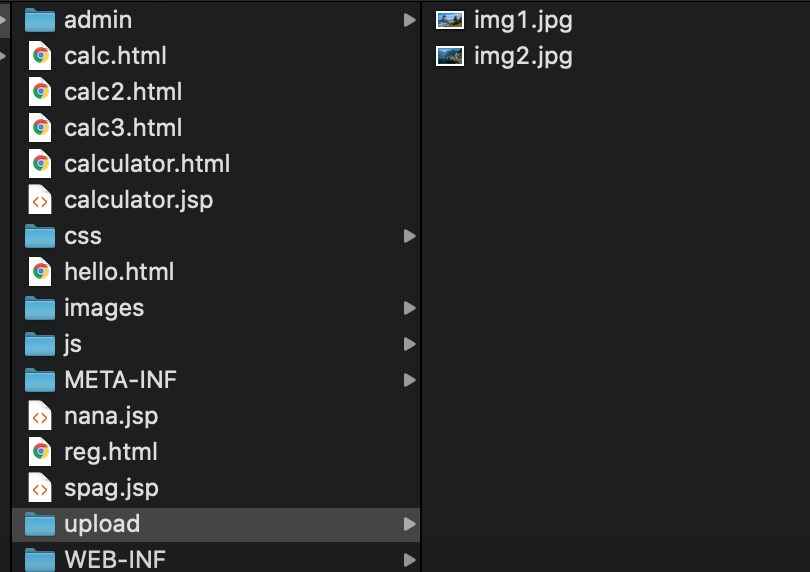

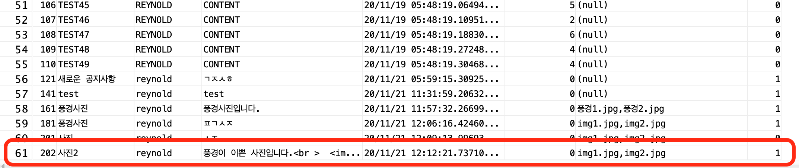

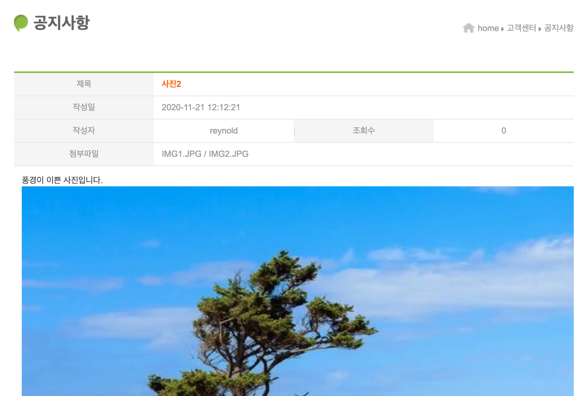


## 102. 파일 업로드 마무리

- 파일 하나만 올려도 정상 작동할 수 있도록 조건처리해주기
- 개발하면서 upload라는 폴더를 프로젝트에서 직접 만들고 실행하니까 이클립스가 임시 배포서버에 이 폴더를 만들어줬었음
- 그런데 실제 서비스로 배포될 때는 이렇게 안되기 때문에 폴더를 알아서 만들 수 있도록 해줘야함
- RegController.java

```java
package com.reynold.web.controller.admin.notice;

import java.io.File;
import java.io.FileOutputStream;
import java.io.IOException;
import java.io.InputStream;
import java.io.PrintWriter;
import java.util.Collection;

import javax.servlet.ServletException;
import javax.servlet.annotation.MultipartConfig;
import javax.servlet.annotation.WebServlet;
import javax.servlet.http.HttpServlet;
import javax.servlet.http.HttpServletRequest;
import javax.servlet.http.HttpServletResponse;
import javax.servlet.http.Part;

import com.reynold.web.entity.Notice;
import com.reynold.web.service.NoticeService;

@MultipartConfig(
	fileSizeThreshold=1024*1024,
	maxFileSize=1024*1024*50,
	maxRequestSize=1024*1024*50*5		
)
@WebServlet("/admin/board/notice/reg")
public class RegController extends HttpServlet {
	@Override
	protected void doGet(HttpServletRequest request, HttpServletResponse response) throws ServletException, IOException {
		
		request
		.getRequestDispatcher("/WEB-INF/view/admin/board/notice/reg.jsp")
		.forward(request, response);
	}
	
	@Override
	protected void doPost(HttpServletRequest request, HttpServletResponse response) throws ServletException, IOException {
		String title = request.getParameter("title");
		String content = request.getParameter("content");
		String isOpen = request.getParameter("open");
		
		Collection<Part> parts = request.getParts();
		StringBuilder builder = new StringBuilder();
		
		for(Part p : parts) {
			if(!p.getName().equals("file")) {
				continue;
			}
      // 파일이 첨부되지 않았을 경우에 대한 조건 처리
			if(p.getSize() == 0) {
				continue;
			}
			
			Part filePart = p;
			String fileName = filePart.getSubmittedFileName();
			builder.append(fileName);
			builder.append(",");
			
			InputStream fis = filePart.getInputStream();
			
			// 상대경로를 절대경로로 바꿔주는 것이 필요함
			String realPath = request.getServletContext().getRealPath("/upload");
//			System.out.println(realPath);
			
      // 파일경로에 폴더가 없을 경우, 확인하고 생성해주는 부분
			File path = new File(realPath);
			if(!path.exists()) {
				path.mkdirs();
			}
			
			String filePath = realPath + File.separator + fileName;
			FileOutputStream fos = new FileOutputStream(filePath);
			
			byte[] buf = new byte[1024];
			int size = 0;
			while((size=fis.read(buf)) != -1) {
				fos.write(buf,0,size);
			}
			fos.close();
			fis.close();
		}
		
		builder.delete(builder.length()-1, builder.length());
		
		boolean pub = false;
		if(isOpen != null) {
			pub = true;
		}
		
		Notice notice = new Notice();
		notice.setTitle(title);
		notice.setContent(content);
		notice.setPub(pub);
		notice.setWriterId("reynold");
		notice.setFiles(builder.toString());
		
		NoticeService service = new NoticeService();
		int result = service.insertNotice(notice);
		
		response.sendRedirect("list");
		
		
		
	}
}

```


## 참고

- 유튜브 채널 뉴렉처


