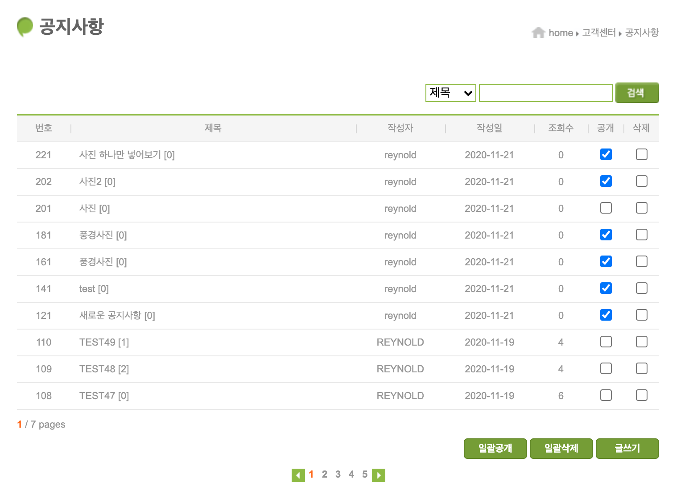
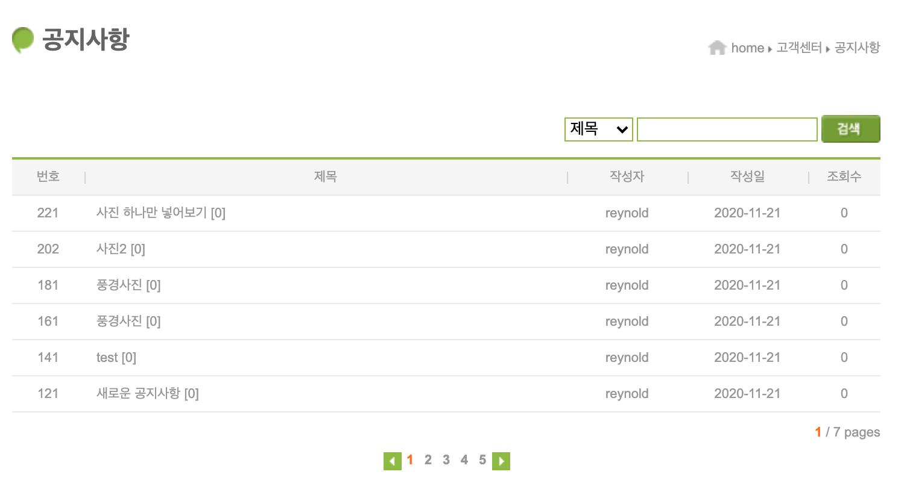
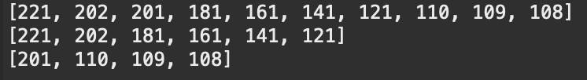
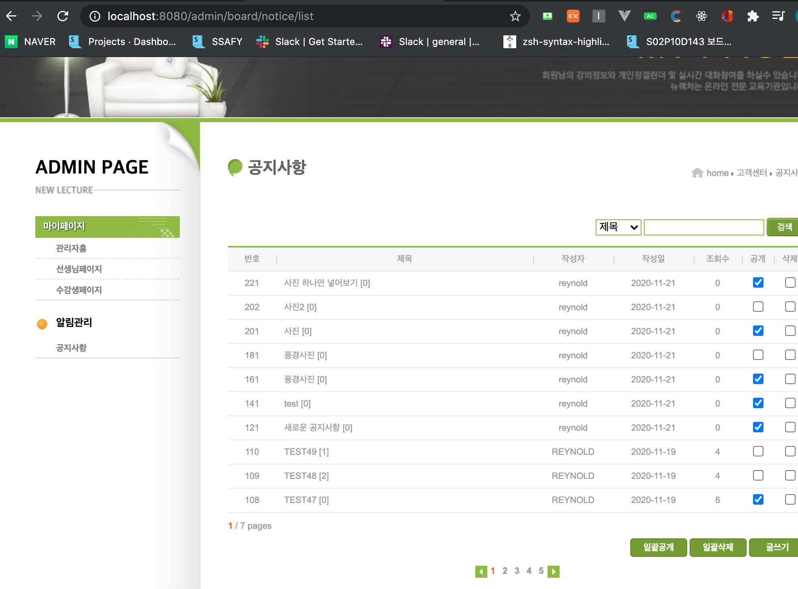
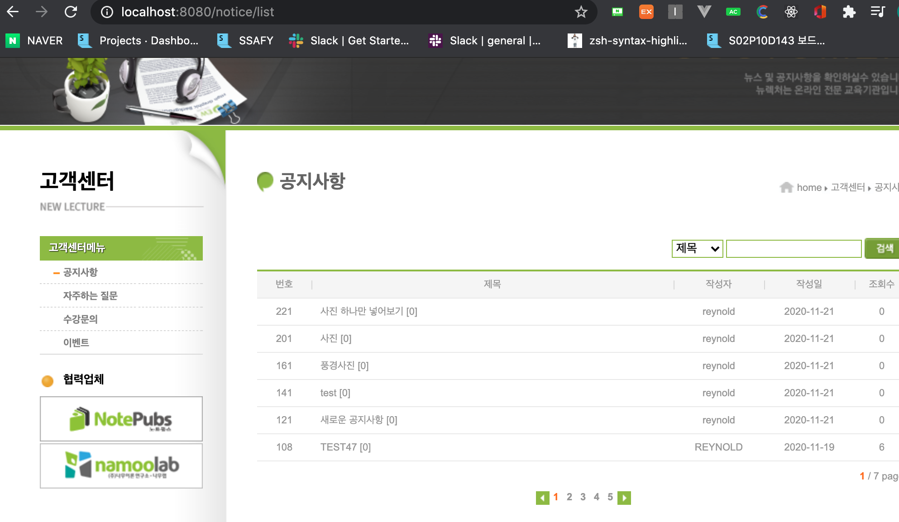

# JSP 학습 6


## 103. 공개 설정 이용하기

- admin의 list.jsp
  - 각 notice의 pub값을 확인해서 조건처리해주기

```jsp
<tbody>
  <c:forEach var="n" items="${list}">
    <c:set var="open" value="" />
    <c:if test="${n.pub}">
      <c:set var="open" value="checked" />
    </c:if>
    <tr>
      <td>${n.id}</td>
      <td class="title indent text-align-left"><a href="detail?id=${n.id}">${n.title}</a><span> [${n.cmtCount}]</span></td>
      <td>${n.writerId}</td>
      <td><fmt:formatDate pattern="yyyy-MM-dd" value="${n.regdate}"/></td>
      <td>${n.hit}</td>
      <td><input type="checkbox" name="open-id" ${open} value="${n.id}"></td>
      <td><input type="checkbox" name="del-id" value="${n.id}"></td>
    </tr>
  </c:forEach>
</tbody>
```

- 일반회원용 list.jsp는 변경없음
  - controller와 service에서 pub에 대한 조건처리를 해서 그 결과를 jsp에 보내줘야함
- ListController.java
  - 공개된 리스트만 가져오는 getNoticePubList() 메서도 호출

```java
NoticeService service = new NoticeService();
List<NoticeView> list = service.getNoticePubList(field, query, page);
int count = service.getNoticeCount(field, query);
```

- NoticeService.java
  - sql문에서 pub확인 조건만 추가해줌

```java
public List<NoticeView> getNoticePubList(String field, String query, int page) {
		
		List<NoticeView> list = new ArrayList<>();
		
		String sql = "SELECT * FROM (" + 
				"    SELECT ROWNUM NUM, N.*" + 
				"    FROM (SELECT * FROM NOTICE_VIEW2 WHERE "+field+" LIKE ? ORDER BY REGDATE DESC) N" + 
				") " + 
				"WHERE PUB=1 AND NUM BETWEEN ? AND ?";
		
		String url = "jdbc:oracle:thin:@localhost:1521/xepdb1";

		try {
			Class.forName("oracle.jdbc.driver.OracleDriver");
			Connection con = DriverManager.getConnection(url, "NEWLEC", "1234");
			PreparedStatement st = con.prepareStatement(sql);
			st.setString(1, "%"+query+"%");
			st.setInt(2, 1+(page-1)*10);
			st.setInt(3, page*10);
			
			ResultSet rs = st.executeQuery();
			
			while(rs.next()){
				
				int id = rs.getInt("ID");
				String title = rs.getString("TITLE");
				String writerId = rs.getString("WRITER_ID");
				Date regdate = rs.getDate("REGDATE");
				String hit = rs.getString("HIT");
				String files = rs.getString("FILES");
//				String content = rs.getString("CONTENT");
				boolean pub = rs.getBoolean("PUB");
				int cmtCount = rs.getInt("CMT_COUNT");
				
				NoticeView notice = new NoticeView(
						id,
						title,
						writerId,
						regdate,
						hit,
						files,
//						content,
						pub,
						cmtCount
						);
				list.add(notice);
				
			}
			
			rs.close();
			st.close();
			con.close();
		} catch (ClassNotFoundException e) {
			// TODO Auto-generated catch block
			e.printStackTrace();
		} catch (SQLException e) {
			// TODO Auto-generated catch block
			e.printStackTrace();
		}
		return list;
	}
```

- 결과






## 104. 공지사항 일괄공개하기

- list.jsp
  - 페이지 내에 있는 목록들의 id들을 함께 넘겨줌

```jsp
<div class="text-align-right margin-top">
  <c:set var="ids" value=""/>
  <c:forEach var="n" items="${list}">
    <c:set var="ids" value="${ids} ${n.id}"/>
  </c:forEach>
  <input type="hidden" name="ids" value="${ids}">
  <input type="submit" class="btn-text btn-default" name="cmd" value="일괄공개">
  <input type="submit" class="btn-text btn-default" name="cmd" value="일괄삭제">
  <a class="btn-text btn-default" href="reg">글쓰기</a>				
</div>
```

- ListController.java
  - openIds로 넘겨온 배열을 리스트로 변환해주고, ids로 받은 페이지내에 있는 모든 id들의 값을 비교해서 포함되어있는지 체크해주는 조건문을 만듬 

```java
package com.reynold.web.controller.admin.notice;

import javax.servlet.ServletException;
import javax.servlet.annotation.WebServlet;
import javax.servlet.http.HttpServlet;
import javax.servlet.http.HttpServletRequest;
import javax.servlet.http.HttpServletResponse;

import com.reynold.web.entity.Notice;
import com.reynold.web.entity.NoticeView;
import com.reynold.web.service.NoticeService;

@WebServlet("/admin/board/notice/list")
public class ListController extends HttpServlet {
	@Override
	protected void doPost(HttpServletRequest request, HttpServletResponse response) throws ServletException, IOException {
		
		String[] openIds = request.getParameterValues("open-id");
		String[] delIds = request.getParameterValues("del-id");
		String cmd = request.getParameter("cmd");
		String ids_ = request.getParameter("ids");
		String[] ids = ids_.split(" ");
		
		NoticeService service = new NoticeService();
		
		switch(cmd) {
		case "일괄공개":
			for(String openId : openIds) {
				System.out.printf("open id : %s\n", openId);
			}
			
			List<String> oids = Arrays.asList(openIds);
			
			for(int i=0; i<ids.length; i++) {
				//1. 현재 id가 open 된 상태인가
				if(oids.contains(ids[i])) {
					// pub -> 1
				}
				else {
					// pub -> 0
				}
			}
			
//			service.pubNoticeList(openIds);
//			service.closeNoticeList(clsIds);
			
			break;
		case "일괄삭제":
			
			int[] ids1 = new int[delIds.length];
			for(int i=0; i<delIds.length; i++) {
				ids1[i] = Integer.parseInt(delIds[i]);
			}
			int result = service.deleteNoticeAll(ids1);
			break;
		}
		
		response.sendRedirect("list");
	}
	
	@Override
	protected void doGet(HttpServletRequest request, HttpServletResponse response) throws ServletException, IOException {
		
		String field_ = request.getParameter("f");
		String query_ = request.getParameter("q");
		String page_ = request.getParameter("p");
		
		String field = "title";
		if(field_ != null && !field_.equals("")) {
			field = field_;
		}
		
		String query = "";
		if(query_ != null && !query_.equals("")) {
			query = query_;
		}
		
		int page = 1;
		if(page_ != null && !page_.equals("")) {
			page = Integer.parseInt(page_);
		}
		
		NoticeService service = new NoticeService();
		List<NoticeView> list = service.getNoticeList(field, query, page);
		int count = service.getNoticeCount(field, query);
		
		request.setAttribute("list", list);
		request.setAttribute("count", count);
		
		request
		.getRequestDispatcher("/WEB-INF/view/admin/board/notice/list.jsp")
		.forward(request, response);
	}
	
}


```


## 105. 비공개할 id 목록 얻기

- ListController.java
  - 전체 ids에서 공개 id와 비공개 id를 리스트 형태로 구하고, 결과를 확인해보자

```java
package com.reynold.web.controller.admin.notice;

import com.reynold.web.entity.Notice;
import com.reynold.web.entity.NoticeView;
import com.reynold.web.service.NoticeService;

@WebServlet("/admin/board/notice/list")
public class ListController extends HttpServlet {
	@Override
	protected void doPost(HttpServletRequest request, HttpServletResponse response) throws ServletException, IOException {
		
		String[] openIds = request.getParameterValues("open-id");
		String[] delIds = request.getParameterValues("del-id");
		String cmd = request.getParameter("cmd");
		String ids_ = request.getParameter("ids");
		String[] ids = ids_.trim().split(" ");
		
		NoticeService service = new NoticeService();
		
		switch(cmd) {
		case "일괄공개":
			for(String openId : openIds) {
				System.out.printf("open id : %s\n", openId);
			}
			
      // 전체 ids에서 oids 빼주기
			List<String> oids = Arrays.asList(openIds);
			List<String> cids = new ArrayList(Arrays.asList(ids));
			cids.removeAll(oids);
			
			System.out.println(Arrays.asList(ids));
			System.out.println(oids);
			System.out.println(cids);
			
//			service.pubNoticeList(openIds);
//			service.closeNoticeList(clsIds);
			
			break;
		case "일괄삭제":
			
			int[] ids1 = new int[delIds.length];
			for(int i=0; i<delIds.length; i++) {
				ids1[i] = Integer.parseInt(delIds[i]);
			}
			int result = service.deleteNoticeAll(ids1);
			break;
		}
		
		response.sendRedirect("list");
	}
	
}


```

- 결과




## 106. 공개를 위한 서비스 함수의 수정사항

- ListController.java
  - 트랜잭션 처리해주기
    - oids와 cids를 각각 처리하는 것이 아니라 한번에 처리해줘야함
    - 하나만 성공하고 다른 하나가 실패하면 안됨
    - pubNoticeAll()에 두개의 매개변수를 사용해서 요청해주자

```java
@Override
	protected void doPost(HttpServletRequest request, HttpServletResponse response) throws ServletException, IOException {
		
		String[] openIds = request.getParameterValues("open-id");
		String[] delIds = request.getParameterValues("del-id");
		String cmd = request.getParameter("cmd");
		String ids_ = request.getParameter("ids");
		String[] ids = ids_.trim().split(" ");
		
		NoticeService service = new NoticeService();
		
		switch(cmd) {
		case "일괄공개":
			for(String openId : openIds) {
				System.out.printf("open id : %s\n", openId);
			}
			
			List<String> oids = Arrays.asList(openIds);
			List<String> cids = new ArrayList(Arrays.asList(ids));
			cids.removeAll(oids);
			
			System.out.println(Arrays.asList(ids));
			System.out.println(oids);
			System.out.println(cids);
			
			// Transaction 처리: 한번에 이뤄지기를 바라는 업무적인, 논리적인 단위
			// 두가지가 한번에 다 일어나야됨
//			service.pubNoticeList(openIds);
//			service.closeNoticeList(clsIds);
			service.pubNoticeAll(oids, cids);
			
			
			break;
		case "일괄삭제":
			
			int[] ids1 = new int[delIds.length];
			for(int i=0; i<delIds.length; i++) {
				ids1[i] = Integer.parseInt(delIds[i]);
			}
			int result = service.deleteNoticeAll(ids1);
			break;
		}
		
		response.sendRedirect("list");
	}
```

- NoticeService.java
  - 여러가지 형태를 받아서 똑같은 일을 처리할 수 있도록 오버로드하자

```java
public int pubNoticeAll(int[] oids, int[] cids) {

  return 0;
}

public int pubNoticeAll(List<String> oids, List<String> cids) {

  return 0;
}

public int pubNoticeAll(String oidsCSV, String cidsCSV) {

  String sql = "UPDATE NOTICE SET PUB=1 WHERE ID IN ()";
  return 0;
}
```


## 107. 오버로드 서비스 메소드 구현하기

- NoticeService.java
  - 각 오버로드에서 매개변수로 받은 변수들의 형태를 바꿔서 다른 오버로드된 메서드를 호출하는 방식으로 구현

```java
public int pubNoticeAll(int[] oids, int[] cids) {
		
		List<String> oidsList = new ArrayList<>();
		for(int i=0; i<oids.length; i++) {
			oidsList.add(String.valueOf(oids[i]));
		}
		
		List<String> cidsList = new ArrayList<>();
		for(int i=0; i<cids.length; i++) {
			cidsList.add(String.valueOf(cids[i]));
		}

		return pubNoticeAll(oidsList, cidsList);
	}
	
	public int pubNoticeAll(List<String> oids, List<String> cids) {
		
		String oidsCSV = String.join(",", oids);
		String cidsCSV = String.join(",", cids);
		return pubNoticeAll(oidsCSV, cidsCSV);
	}
	
	public int pubNoticeAll(String oidsCSV, String cidsCSV) {
		
		String sql = "UPDATE NOTICE SET PUB=1 WHERE ID IN ()";
		return 0;
	}
```


## 108. pubNoticeAll 구현하기

- NoticeService.java
  - 아직 트랜잭션 처리를 안한 상태임

```java
public int pubNoticeAll(String oidsCSV, String cidsCSV) {
		
		int result = 0;
		String sqlOpen = String.format("UPDATE NOTICE SET PUB=1 WHERE ID IN (%s)", oidsCSV);
		String sqlClose = String.format("UPDATE NOTICE SET PUB=0 WHERE ID IN (%s)", cidsCSV);

		String url = "jdbc:oracle:thin:@localhost:1521/xepdb1";

		try {
			Class.forName("oracle.jdbc.driver.OracleDriver");
			Connection con = DriverManager.getConnection(url, "NEWLEC", "1234");
			Statement stOpen = con.createStatement();
			result += stOpen.executeUpdate(sqlOpen);
			
			Statement stClose = con.createStatement();
			result += stClose.executeUpdate(sqlClose);
			
			stOpen.close();
			stClose.close();
			con.close();
		} catch (ClassNotFoundException e) {
			// TODO Auto-generated catch block
			e.printStackTrace();
		} catch (SQLException e) {
			// TODO Auto-generated catch block
			e.printStackTrace();
		}
		
		return result;
	}
```

- 결과






## 참고

- 유튜브 채널 뉴렉처


