# Maven on Ecllipse 학습


## 1. 메이븐(Maven)이란?

### Maven 이란?

- 프로젝트를 만들 때, 가장 많이 사용하는 빌드 툴 중에 하나임
- 프로젝트 빌드 툴

### 프로젝트 빌드 과정

- 프로젝트 생성 > 라이브러리 설정 > 코드 작업 > 컴파일 > 테스트 > 패키지 만들기 > 배포 > 레포팅
- 이런 빌드 과정들에서 반복되는 부분들을 효율적으로 할 수 있도록 도와주는게 빌드 툴
- 메이븐을 사용하면 빌드 과정을 경량화해서 쉽게 구현할 수 있음

### IDE와 별개인 빌드 도구

- 그런데 이클립스도 프로젝트 생성하고 라이브러리 설정하고, 코드 작업, 컴파일, 테스트같은 것들을 할 수 있지 않나?
  - 이클립스도 빌드 툴 아닌가?
  - 이클립스나 비쥬얼스튜디오코드, Intellij 등은 빌드 툴이 아님
    - IDE라고 함
    - 개발 통합 환경이라고 할 수 있음
- 메이븐은 특정 IDE에 종속된 것이 아니라 빌드라는 것을 도와주는 역할에 특화된 도구임
  - 이클립스나 비쥬얼스튜디오코드, Intellij 등 IDE가 메이븐을 이용할 수 있음
  - 메이븐에 없는 편집기능, 디버깅 기능, 협업관련 기능 등은 IDE를 통해서 사용

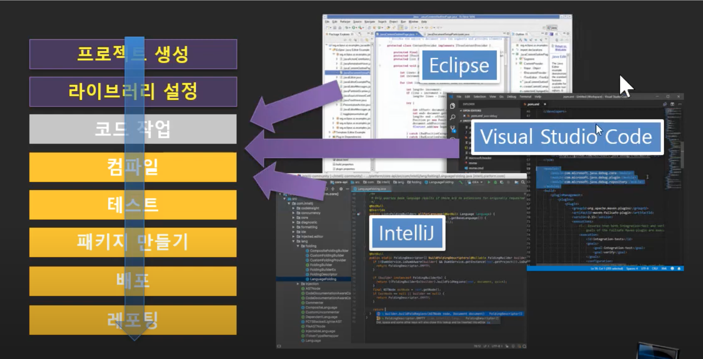

### Build Tool in IDE(Eclipse, VS Code, etc)

- 그러면 이클립스에서 프로젝트를 만드는게 메이븐을 사용한 것인가?
  - 꼭 그런것은 아님
  - 그렇게 할 수도 있고, 안 할수도 있음

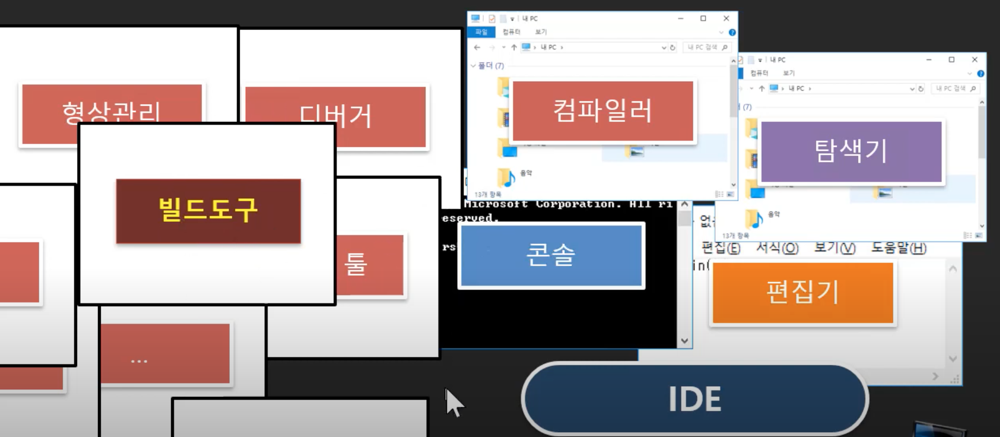

### 최근 IDE에 프로젝트 관리와 관련되어 포함되어 있는 전문화된 도구들

- IDE에 형상관리, 빌드관리, 테스트관리 툴 등의 전문 도구들을 올려서 사용하게 됨
- 프로젝트 생성 같은 기능 등이 이클립스에도 이미 있는데 굳이 메이븐을 사용하는 이유는 뭔가?
  - 메이븐을 사용해보면 그 이유를 알게 됨

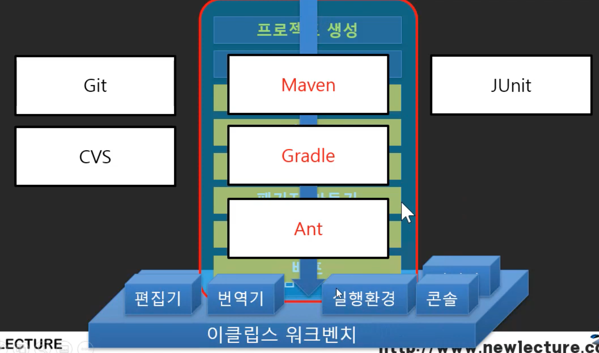

### 이클립스가 제공하지 않는 Maven만의 기능

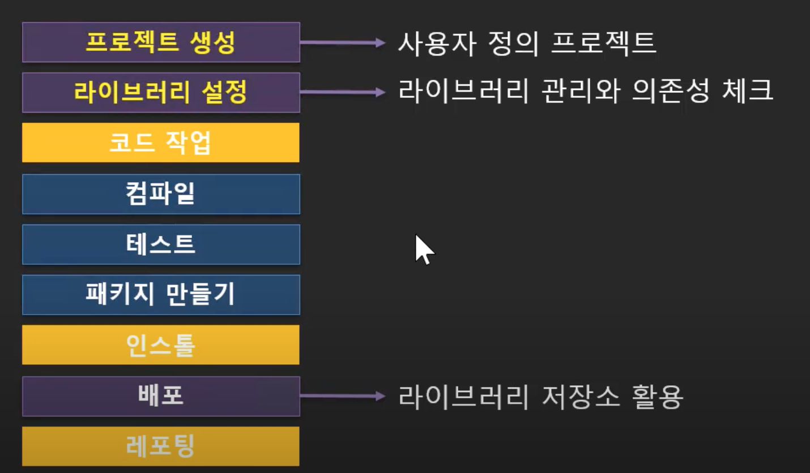


## 2. Maven 설치하기

- homebrew로 설치하기
- 설치 확인

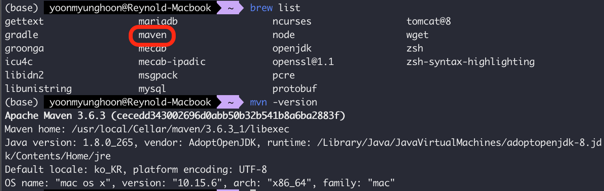


## 3. Maven으로 자바 프로젝트 생성하기

### Maven 자바 프로젝트 생성

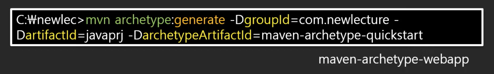

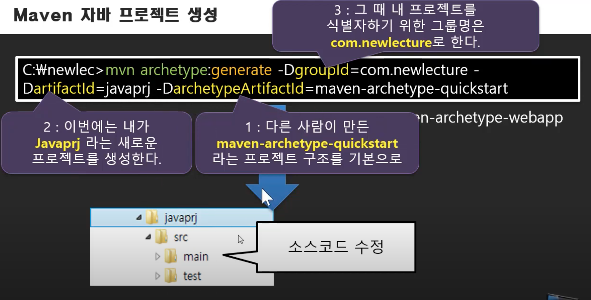

- 코드

```shell
mvn archetype:generate -DgroupId=com.newlecture -DartifactId=javaprj -DarchetypeArtifactId=maven-archetype-quickstart
```

- 결과


## 4. 컴파일과 실행하기

- App.java

```java
package com.newlecture;

/**
 * Hello world!
 *
 */
public class App 
{
    public static void main( String[] args )
    {
        System.out.println( "Hello Maven!" );
    }
}

```

### 컴파일하기

- 프로젝트를 컴파일하거나 실행할 때는 pom.xml이 있는 디렉토리에서 메이븐 관련 명령어를 사용하게 됨
- javaprj 디렉토리에 들어가서 컴파일 명령어 실행

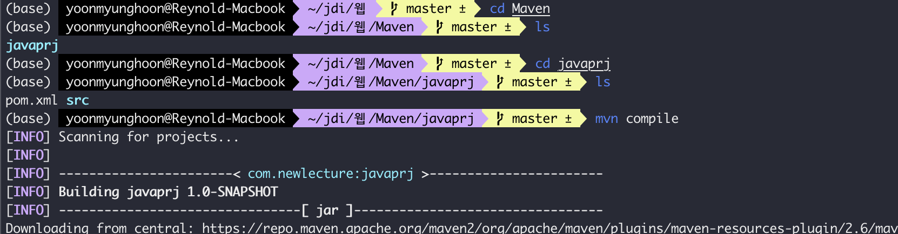

- 결과
  - target이라는 디렉토리가 생기고 안으로 들어가보면 App.class가 있음

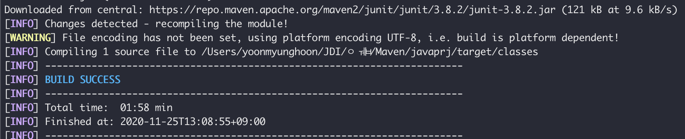

- 강의에서는 컴파일과정에서 오류가 났는데, pom.xml를 수정해서 오류를 해결함
  - 오류가 안났지만, 나중에 버전 차이로 인한 문제가 발생할 수 있으므로 똑같이 설정을 변경해주고 넘어감

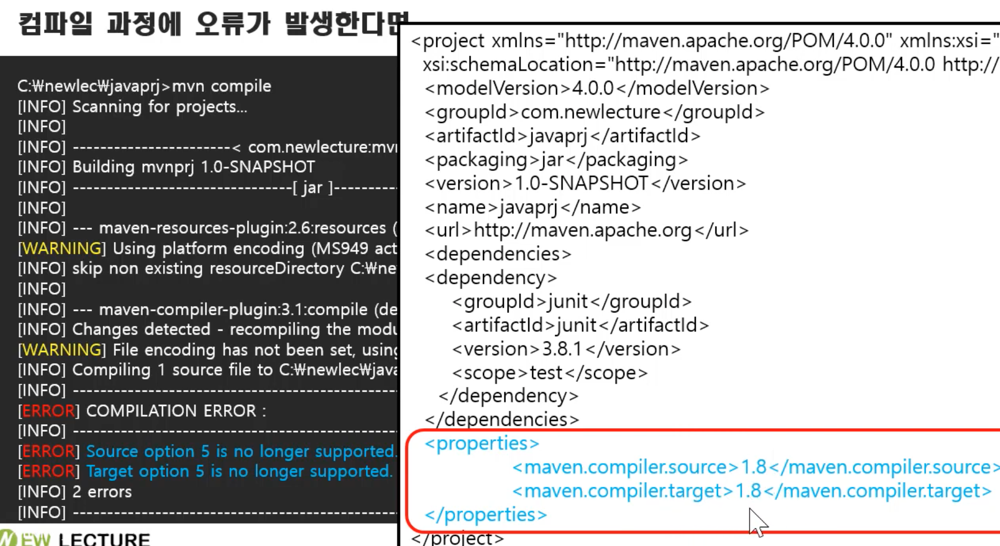

### 패키징하기

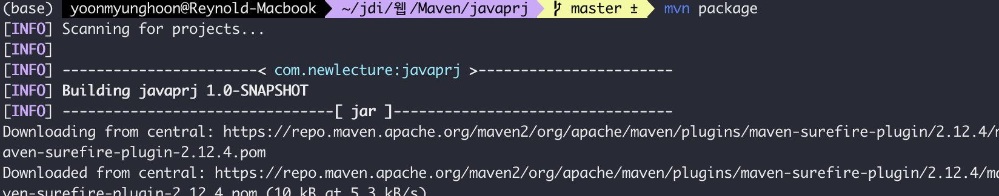

- 결과
  - jar파일이 생성됨

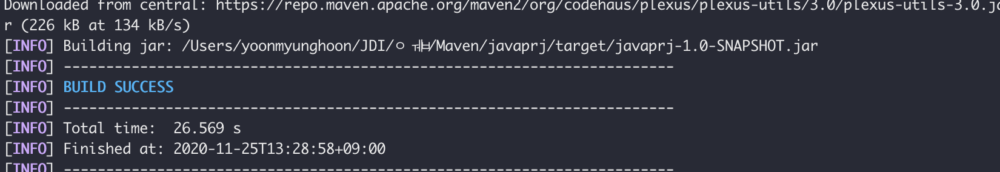

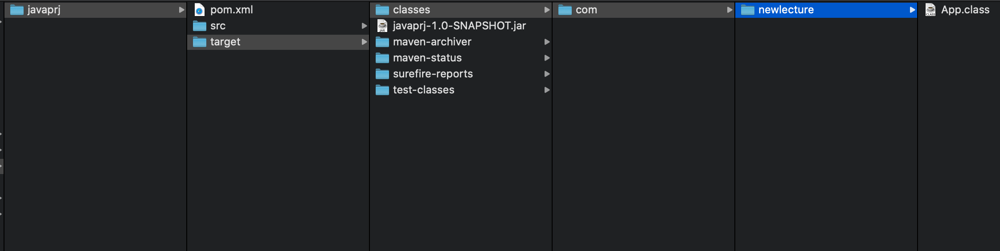

### 실행하기

```shell
Java -cp target\javaprj-1.0-SNAPSHOT.jar com.newlecture.App
```

- 결과

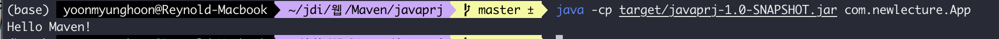


## 5. Build Lifycycle과 Phase들

- 메이븐이 가지고 있는 명령어들을 알아보자

### Build Lifecycle Basics

#### A Build Lifecycle is Made Up of Phases

- 각 명령어들이 수행단계를 의미함
- 수행단계는 몇가지가 존재하고 어떤 순서로 존재하는지 알아보자

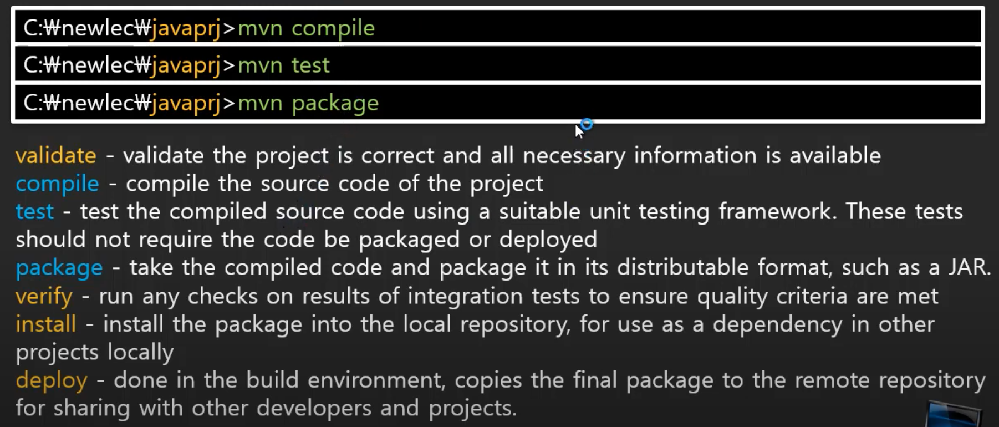

### Default Lifecycle

- 명령어를 실행하면 그 단계까지의 모든 명령어들이 함께 실행됨
  - compile를 실행하면 그 전단계들이 다 함께 실행됨
  - test, package 도 명령어를 실행하면 그 전단계까지 함께 실행됨
- 이 단계는 자바 개발을 할 것인지, 웹 개발을 할 것인지 패키징 방식을 정하게 되는데 그거에 따라 조금 달라질 수 있음
  - 일반적으로는 거의 비슷함

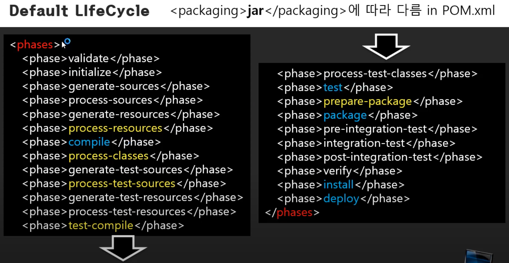

- pom.xml
  - Project Object Model
    - 프로젝트를 구성하는 내용에 대한 것을 모델로써 가지고 있는 파일, 설정 파일
  - pom.xml에서 패키징을 변경할 수 있음

```xml
<project xmlns="http://maven.apache.org/POM/4.0.0" xmlns:xsi="http://www.w3.org/2001/XMLSchema-instance"
  xsi:schemaLocation="http://maven.apache.org/POM/4.0.0 http://maven.apache.org/maven-v4_0_0.xsd">
  <modelVersion>4.0.0</modelVersion>
  <groupId>com.newlecture</groupId>
  <artifactId>javaprj</artifactId>
  ***여기***
  <packaging>jar</packaging>
  *********
  <version>1.0-SNAPSHOT</version>
  <name>javaprj</name>
  <url>http://maven.apache.org</url>
  <dependencies>
    <dependency>
      <groupId>junit</groupId>
      <artifactId>junit</artifactId>
      <version>3.8.1</version>
      <scope>test</scope>
    </dependency>
  </dependencies>
</project>

```

- 가장 많이 사용하게 될 프로젝트는 자바(jar방식으로 패키징), 웹(war방식으로 패키징)

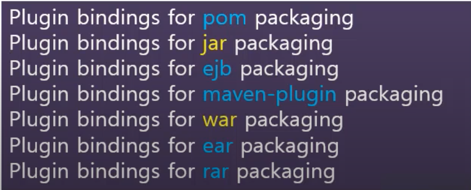

### 단계를 수행해주는 것이 딱 정해져있는 것인가? No

- 메이븐은 각 단계별로 플러그인 방식으로 다 끊어놨음
- 구성단계는 있지만, 무조건 실행되는 것은 아님
- 각 단계를 실행해주는 프로그램들이 각각 따로 있음

### 단계별 실행을 담당하는 플러그인들: mvn help:describe -Dcmd=...

- 자바 프로젝트를 메이븐으로 만들었다고하면, 몇가지 단계들은 기본적으로 설정되어있음
- 설정을 변경해주거나하는 것은 pom.xml에서 할 수 있음
- 단계별로 실행할 수 있는 프로그램들을 Plug-in이라고함
- Plug-in의 작은 절차를 Goal이라고함
- Plug-in들은 메이븐 공식사이트에 들어가보면 각 단계에서 사용할 수 있는 것들을 제공해줌

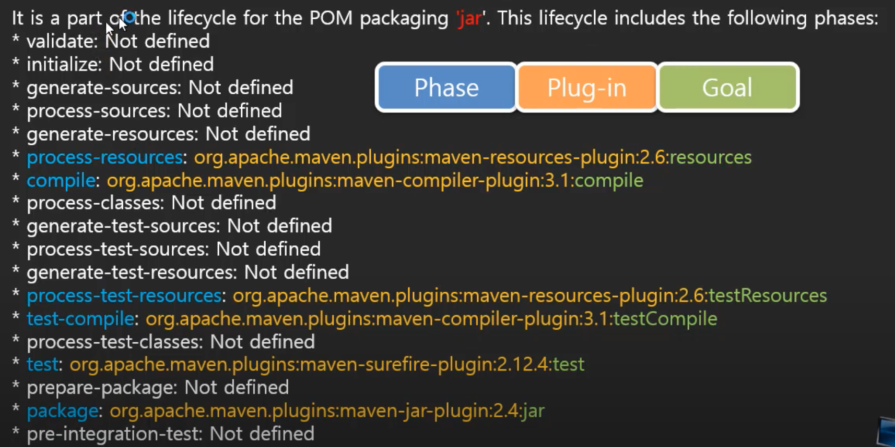

- Help 명령어를 통해 사용하고자하는 명령어와 관련된 plug-in들을 확인할 수 있음

```shell
mvn help:describe -Dcmd=compile
```

- 결과


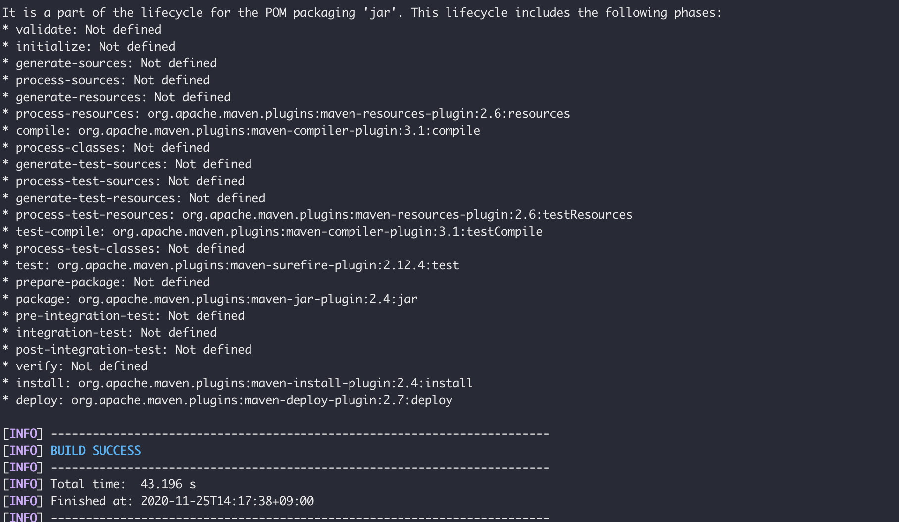


## 6. 메이븐 프로젝트 이클립스에서 로드하기

### 이클립스 IDE로 Maven 프로젝트 임포트하기

- 요즘에는 이클립스를 설치하면 메이븐이 기본으로 포함되어있음
- 이클립스에서 File탭에서 import에서 Maven에서 Existing Maven Projects

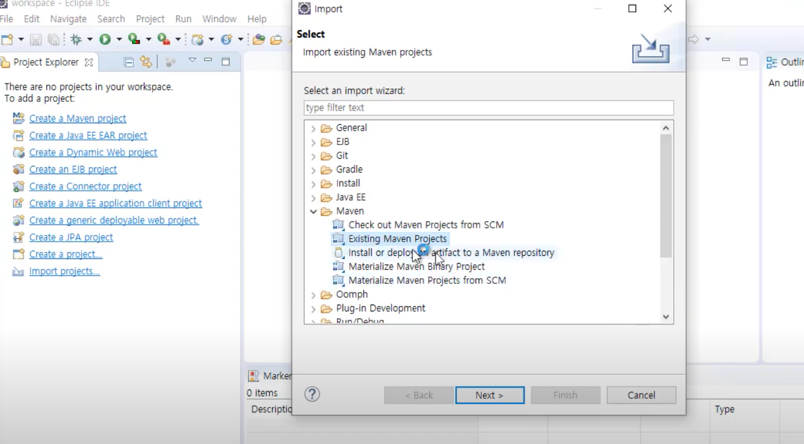

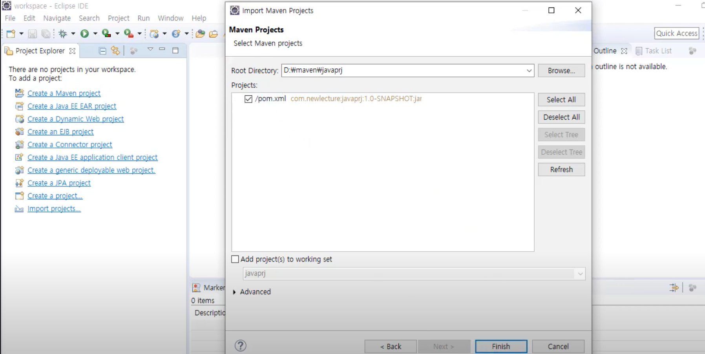

### 이클립스에서 컴파일해보기

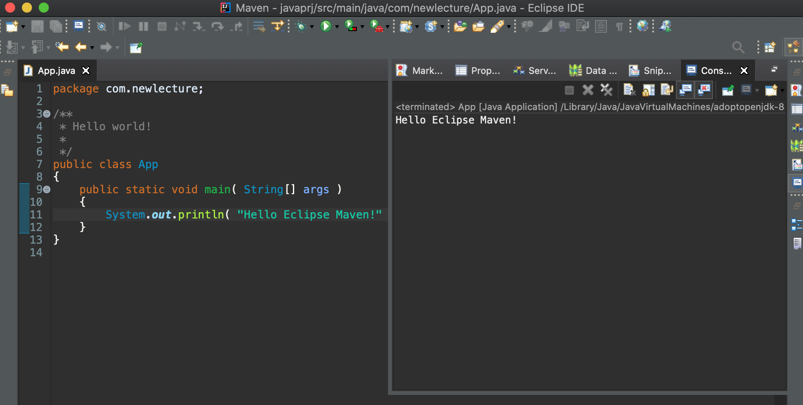

- 이클립스 프로젝트가 아니라 메이븐 프로젝트이기 때문에, 다른 환경에서(메이븐을 사용할 수 있는) 이 프로젝트를 옮겨서 쓸 수 있음


## 7. 컴파일러 플러그인으로 JDK 버전 변경하기

- 각 단계마다 플러그인을 사용할 수 있음
- compile단계의 플러그인은 메이븐 프로젝트에서 지원하고 있는 플러그인
- https://maven.apache.org/plugins/maven-compiler-plugin/
  - 자세한 설명을 볼 수 있음
- 컴파일을 담당하는 플러그인은 두 개의 골을 가지고 있음
  - compile
  - testCompile
- 골이라는 것이 플러그인의 실질적인 역할을 함
- 컴파일 단계와 테스트 컴파일 단계에서 같은 플러그인의 각 골을 사용하고 있음

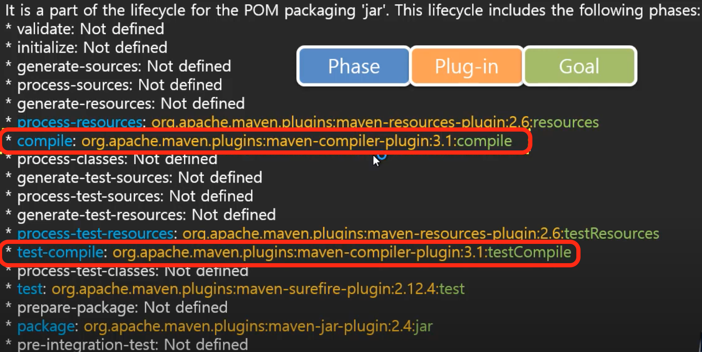

- 플러그인이 가지고 있는 속성을 통해서 컴파일 옵션을 변경하려면? pom.xml을 좀 바꿔줘야함
- 아무런 설정을 하지 않은 상태의 pom.xml

```xml
<project xmlns="http://maven.apache.org/POM/4.0.0" xmlns:xsi="http://www.w3.org/2001/XMLSchema-instance"
  xsi:schemaLocation="http://maven.apache.org/POM/4.0.0 http://maven.apache.org/maven-v4_0_0.xsd">
  <modelVersion>4.0.0</modelVersion>
  <groupId>com.newlecture</groupId>
  <artifactId>javaprj</artifactId>
  <packaging>jar</packaging>
  <version>1.0-SNAPSHOT</version>
  <name>javaprj</name>
  <url>http://maven.apache.org</url>
  <dependencies>
    <dependency>
      <groupId>junit</groupId>
      <artifactId>junit</artifactId>
      <version>3.8.1</version>
      <scope>test</scope>
    </dependency>
  </dependencies>
</project>

```

- 결과

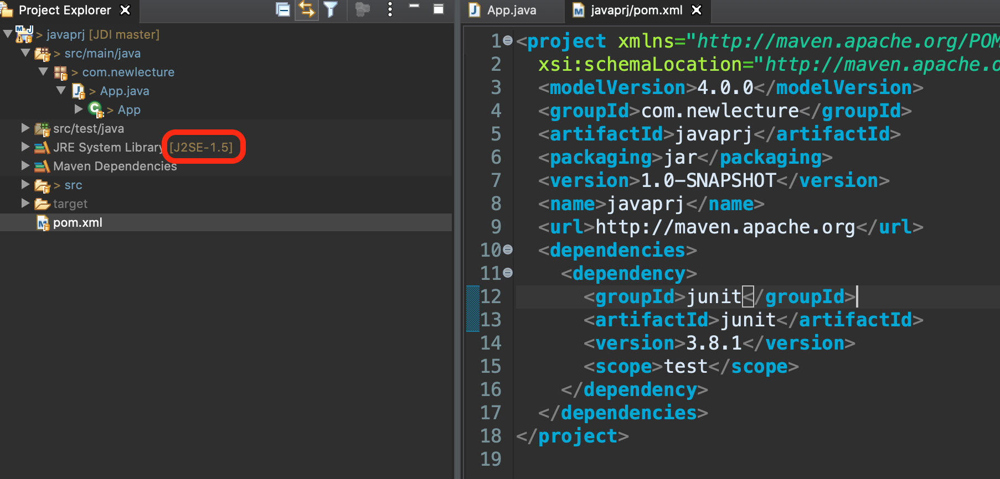

- maven-compiler-plugin를 재정의하는 설정을 포함한 pom.xml

```xml
<project xmlns="http://maven.apache.org/POM/4.0.0" xmlns:xsi="http://www.w3.org/2001/XMLSchema-instance"
  xsi:schemaLocation="http://maven.apache.org/POM/4.0.0 http://maven.apache.org/maven-v4_0_0.xsd">
  <modelVersion>4.0.0</modelVersion>
  <groupId>com.newlecture</groupId>
  <artifactId>javaprj</artifactId>
  <packaging>jar</packaging>
  <version>1.0-SNAPSHOT</version>
  <name>javaprj</name>
  <url>http://maven.apache.org</url>
  <dependencies>
    <dependency>
      <groupId>junit</groupId>
      <artifactId>junit</artifactId>
      <version>3.8.1</version>
      <scope>test</scope>
    </dependency>
  </dependencies>
  <build>
  	<plugins>
  		<plugin>
  			<artifactId>maven-compiler-plugin</artifactId>
  			<version>3.8.1</version>
  			<configuration>
  				<source>1.8</source>
  				<target>1.8</target>
  			</configuration>
  		</plugin>
  	</plugins>
  </build>
</project>

```

- 결과

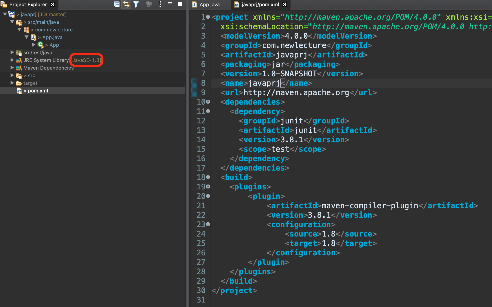

- 최근에는 컴파일러의 JDK 버전을 변경하는 간단한 설정은 플러그인을 재정의하는 방식보다 조금 더 간단한 방식으로 할 수 있게 됨
  - 자세한 속성 변경은 플러그인 재정의를 통해서 해야함

```xml
<project xmlns="http://maven.apache.org/POM/4.0.0" xmlns:xsi="http://www.w3.org/2001/XMLSchema-instance"
  xsi:schemaLocation="http://maven.apache.org/POM/4.0.0 http://maven.apache.org/maven-v4_0_0.xsd">
  <modelVersion>4.0.0</modelVersion>
  <groupId>com.newlecture</groupId>
  <artifactId>javaprj</artifactId>
  <packaging>jar</packaging>
  <version>1.0-SNAPSHOT</version>
  <name>javaprj</name>
  <url>http://maven.apache.org</url>
  <dependencies>
    <dependency>
      <groupId>junit</groupId>
      <artifactId>junit</artifactId>
      <version>3.8.1</version>
      <scope>test</scope>
    </dependency>
  </dependencies>
  <properties>
    <maven.compiler.source>1.8</maven.compiler.source>
    <maven.compiler.target>1.8</maven.compiler.target>
  </properties>
</project>

```

- 결과

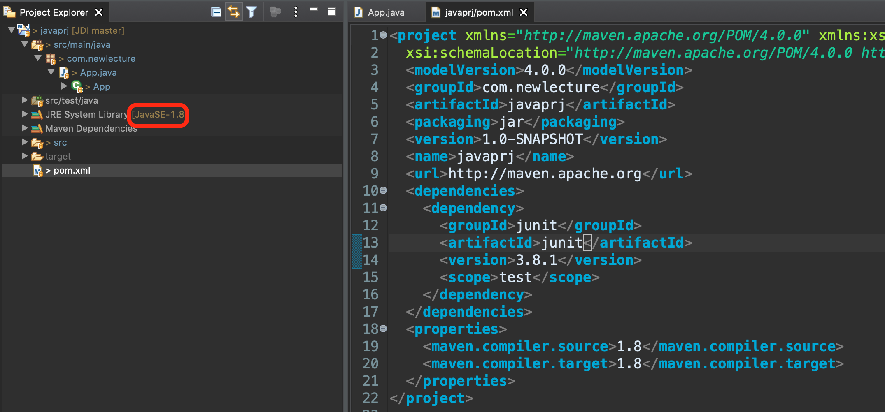

### 메이븐 프로젝트를 생성할 때 사용한 명령어

```shell
mvn archetype:generate -DgroupId=com.newlecture -DartifactId=javaprj -DarchetypeArtifactId=maven-archetype-quickstart
```

- 여기서 옵션들을 지정해줬지만, 만약 지정해주지 않으면, 상호작용하는 방식으로 넘어감
  - 엄청나게 많은 옵션(다른사람들이 만들어놓은 프로젝트 구조)들이 있음
  - 아무것도 정의하지 않겠다고하면, 우리가 설정한 quickstart 옵션으로 생성하게됨
    - 조금 틀이 있는 자바 프로젝트가 생성됨

```shell
mvn archetype:generate
```

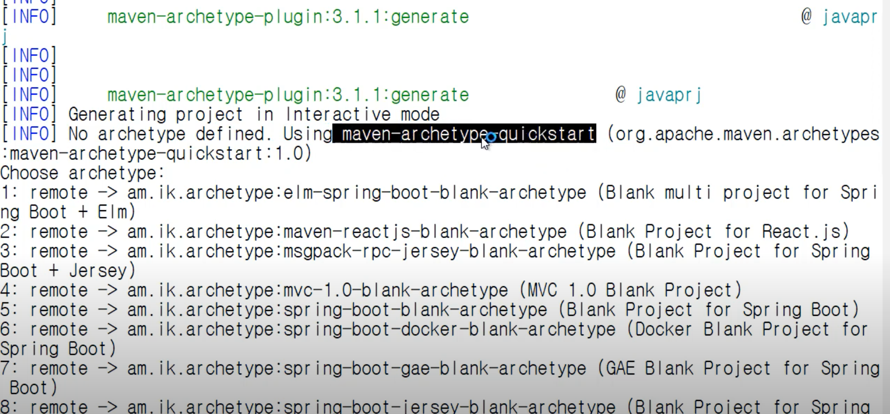


## 8. 웹 프로젝트로 변경

- 패키징을 jar에서 war로 바꾸면 자바 프로젝트에서 웹 프로젝트로 자동으로 변경해줌
- pom.xml

```xml
<project xmlns="http://maven.apache.org/POM/4.0.0" xmlns:xsi="http://www.w3.org/2001/XMLSchema-instance"
  xsi:schemaLocation="http://maven.apache.org/POM/4.0.0 http://maven.apache.org/maven-v4_0_0.xsd">
  <modelVersion>4.0.0</modelVersion>
  <groupId>com.newlecture</groupId>
  <artifactId>javaprj</artifactId>
  <packaging>war</packaging>
  <version>1.0-SNAPSHOT</version>
  <name>javaprj</name>
  <url>http://maven.apache.org</url>
  <dependencies>
    <dependency>
      <groupId>junit</groupId>
      <artifactId>junit</artifactId>
      <version>3.8.1</version>
      <scope>test</scope>
    </dependency>
  </dependencies>
  <properties>
    <maven.compiler.source>1.8</maven.compiler.source>
    <maven.compiler.target>1.8</maven.compiler.target>
  </properties>
</project>

```

- 오류가 발생함
  - web.xml이 없어서 생기는 오류
  - webapp안에 WEB-INF디렉토리를 만들고 그안에 web.xml을 만들어주자
  - 톰캣에 있는 web.xml를 복사해서 넣어주자

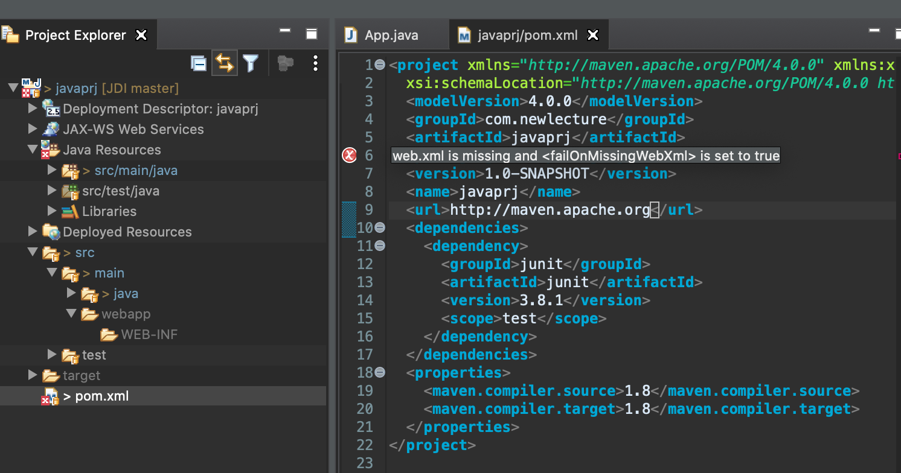

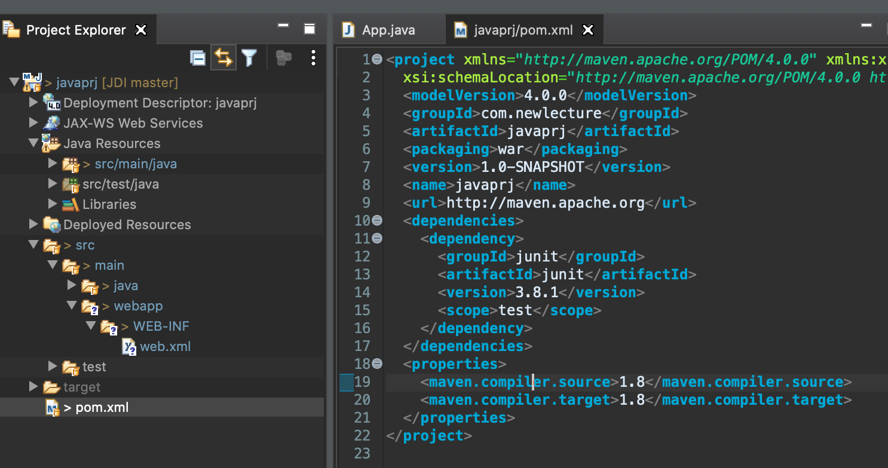

- Index.html 하나 생성

```html
<!DOCTYPE html>
<html>
<head>
<meta charset="UTF-8">
<title>Insert title here</title>
</head>
<body>
	<h1>Hello Maven!</h1>
</body>
</html>
```

- 실행하면 웹 서버 설정이 나옴
  - 톰캣 디렉토리 찾아서 연결해주자

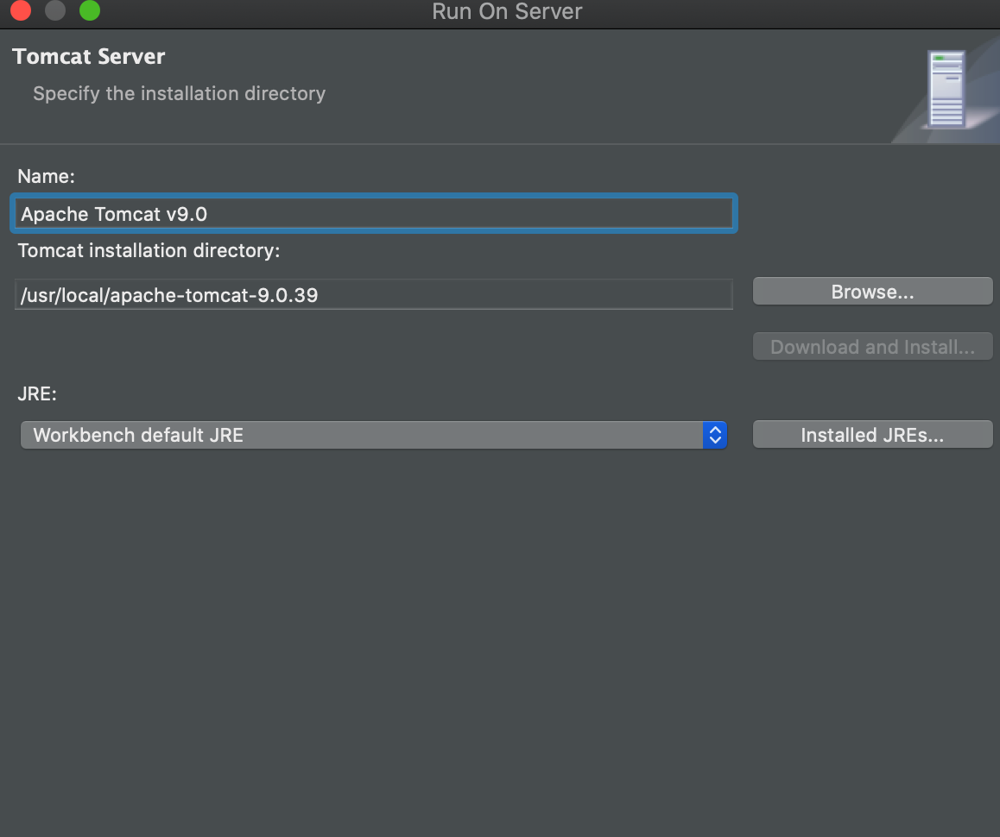

- 결과

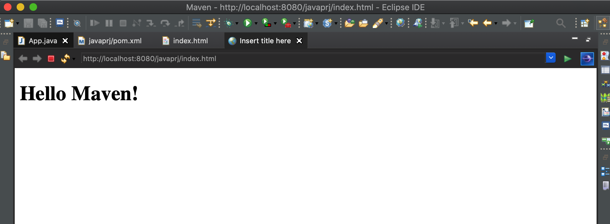

- Window 탭에서 Web Browser를 Default System Web Browser로 변경해주고 실행

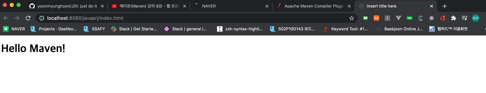


## 9. 서블릿/JSP 라이브러리 설정하기

- 웹 어플리케이션을 만들기 위해서는 서블릿, JSP 라이브러리 등 다양한 라이브러리들이 필요함
- 메이븐을 이용할 때는 라이브러리 설정을 어떻게 하는지 알아보자
- Index.jsp를 하나 만들었더니 오류가 뜨는데, 관련된 라이브러리가 필요하다는 의미임
- 라이브러리를 받기위해서 빌드패쓰 설정을 할 수 있지만, 이렇게 하면 다른 컴퓨터에서 작업할 경우, 라이브러리가 위치하고 있는 경로가 달라서 또 다시 설정해줘야함
- 메이븐에서 라이브러리 설정을 하면 이런 부분을 해결할 수 있음 
- pom.xml에서 dependency를 추가해주면 자동적으로 라이브러리를 설치해주는 것
- 그러면 이 라이브러리들은 어디에서 왔으며 어디에 저장되는 건가??
  - 처음에 프로젝트 생성할 때, 자동으로 다운로드되던 것들은 플러그인들이었음

### Maven 저장소

- 수많은 플러그인과 라이브러리가 저장되어있는 원격 저장소가 있음
- 수많은 사용자들이 올려둔 것
- 과거에는 라이브러리가 필요하면 jar파일을 직접구해서 설정을 해줬는데, 이제는 그럴 필요가 없음
- pom.xml에다가 필요한 라이브러리들을 적어두면 원격 저장소에서 찾아서 로컬 저장소로 설치해줌

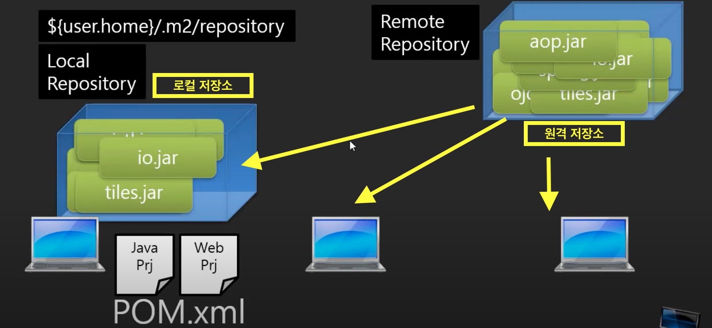

### 중앙 저장소 라이브러리 인덱스 만들기

- https://mvnrepository.com/
- 여기서 필요한 라이브러리를 검색할 수 있음

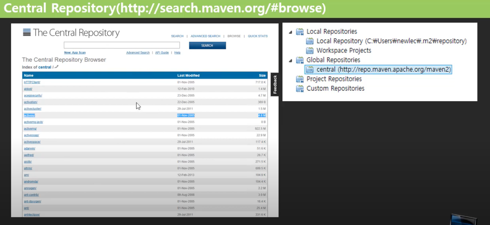

- 톰캣을 설치하면서 자동으로 받아졌던 jsp 라이브러리를 받기 위해서 tomcat jsp를 검색해서 버전에 맞는 라이브러리를 찾자
  - https://mvnrepository.com/artifact/org.apache.tomcat/tomcat-jsp-api/9.0.39

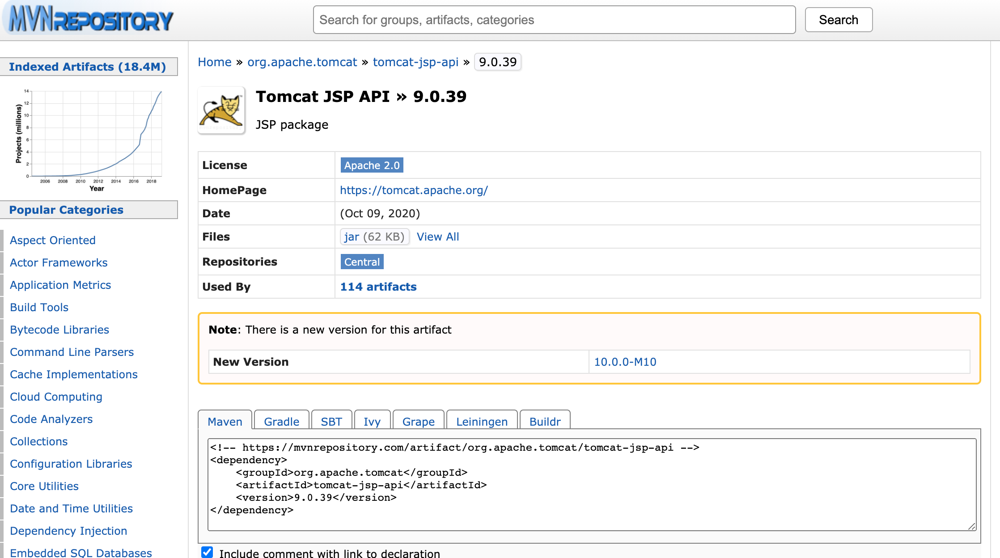

- pom.xml에 붙여넣기

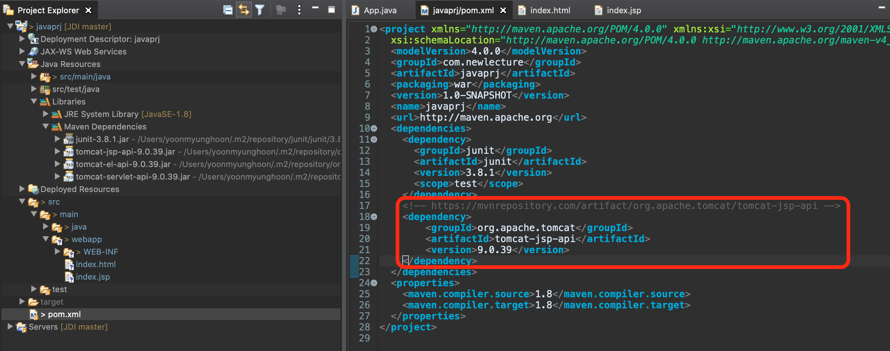

- 설치확인
  - Jsp 라이브러리만 받았지만, 필요한 관련 라이브러리들도 같이 받아짐

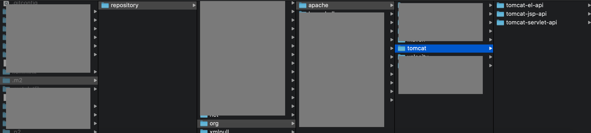

- 결과
  - jsp가 정상 작동함

```jsp
<%@ page language="java" contentType="text/html; charset=UTF-8"
    pageEncoding="UTF-8"%>
<!DOCTYPE html>
<html>
<head>
<meta charset="UTF-8">
<title>Insert title here</title>
</head>
<body>
	JSP Index Page ${3+4}
</body>
</html>
```

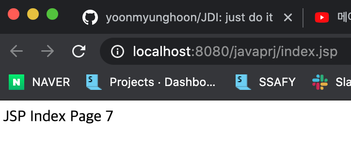


## 10. 라이브러리 오류 문제

- 라이브러리를 받는 도중에 끊겨서 파일이 깨지는 경우, 오류를 찾기가 굉장히 어려움
- 깨진 라이브러리 파일은 눌러보면 알 수 있음, 눌렀을 때 내부 클래스들이 안나오면 문제가 있는 파일임

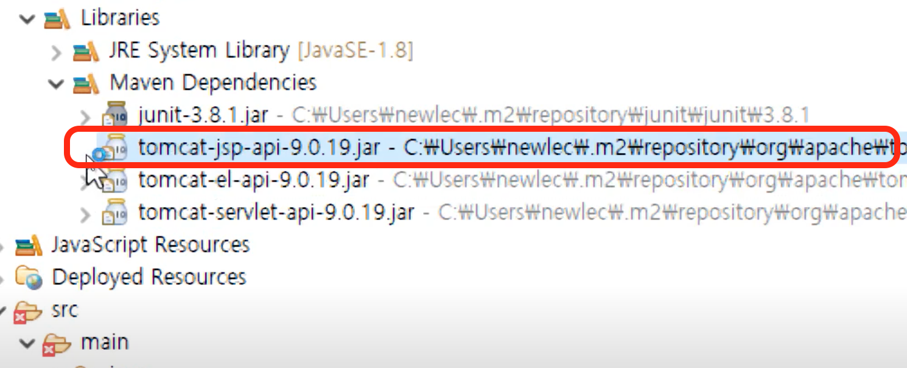

### 해결방법

- 이럴 경우에는 일단 이클립스를 닫고 .m2안에 있는 repository안에 있는 폴더들을 모두 지워주자
  - repository 디렉토리 자체를 지우면 안됨
- 다시 이클립스 실행
  - 이클립스가 알아서 필요한 파일들을 다시 다 다운로드 받아줌


## 11. 라이브러리 인덱싱 검색


## 참고

- 유튜브 뉴렉처 채널
  - 재생목록 - 메이븐 