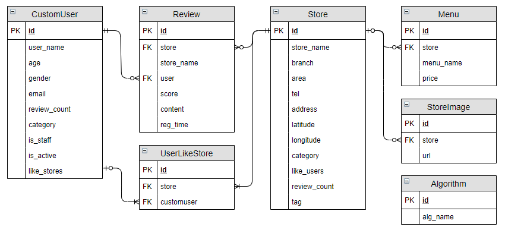
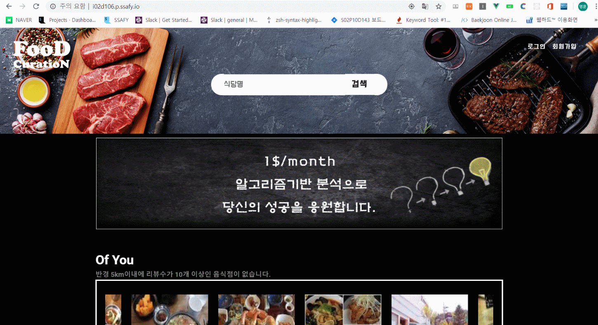
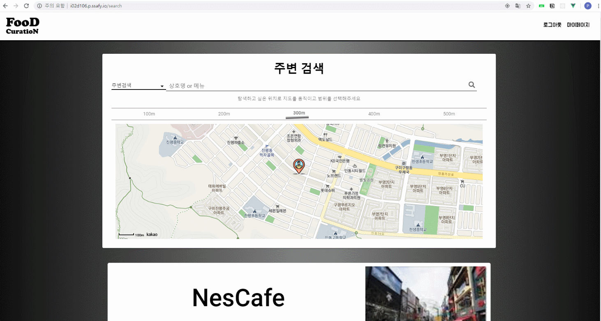
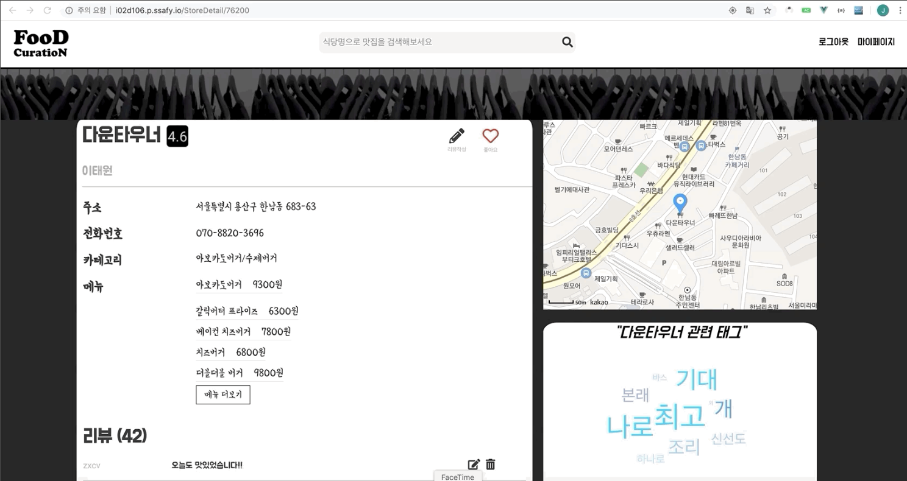
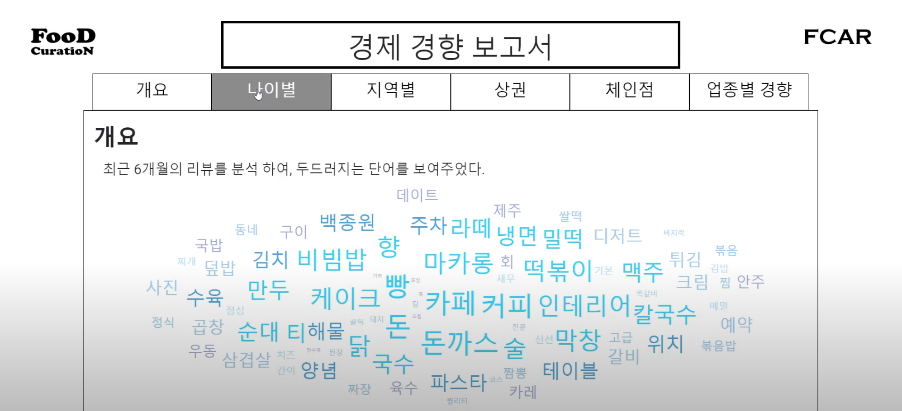
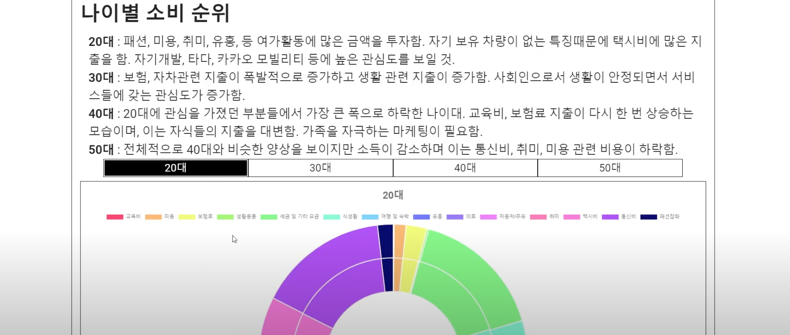
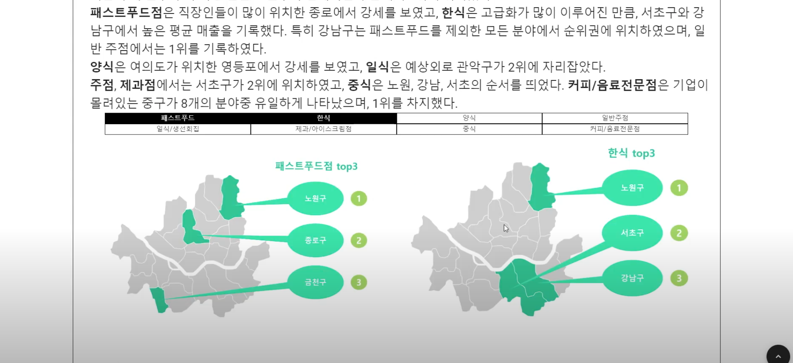
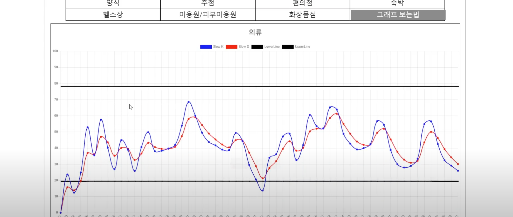

```txt
삼성청년SW아카데미(SSAFY)의 교육과정에서 수행한 프로젝트로 코드를 외부에 노출할 수 없는 점 양해 부탁드립니다.
대신에 프로젝트를 수행했던 과정에 대해 정리하였습니다. 참고해주시면 감사하겠습니다.
```


# :fork_and_knife: 개인별 맞춤형 맛집 추천 웹 서비스: Food Curation

### 프로젝트 기간: 2020. 03. 23 ~ 2020. 05. 01


## 📖 개요

이 서비스는 사용자 정보 기반 맛집 추천 서비스로 사용자에게 적절한 매장들을 추천해 주는 기능과 여러 정보를 바탕으로 각종 보고서를 제작하여 제공해 주는 기능을 가지고 있습니다.

맛집 추천 서비스의 경우 KNN과 SVDPP, K-means 알고리즘을 복합적으로 사용하여 추천해 줍니다.

보고서의 경우 다이닝 코드, 결제 데이터, 통계청 데이터 등을 활용하여 나이대별 소비 트렌드, 지역별 경제 특성분석, 상권 분석, 체인점 분석, 업종별 경향 분석 등의 결과를 보여줍니다.


## 📌 핵심 기능

- 각종 알고리즘과 머신러닝을 기반으로 사용자에게 사용자의, 사용자를 위한, 사용자에 의한 맛집 추천 사이트
- 나만의 맛집 추천을 받고 싶은 사람들에게 맞춤 정장과 같은 느낌의 맛집 추천 시스템
- 맛집에 관한 정보 뿐만 아니라 사람들의 소비트렌드, 지역별 분석, 상권 분석, 체인점 분석, 업종별 분석 결과를 통해 경제 경향을 볼 수 있는 보고서 기능


## 🌐 개발 환경

### 사용 언어

- Python 3.6.8
- nodeJS 13.5.0

### 주요 라이브러리

- npm 6.13.4
- Django 2.2.7
- djangorestframework 3.10.3
- axios 0.19.0
- vue 2.6.10
- vuex 3.1.1
- pandas 0.25.3


## :two_men_holding_hands: 팀원 정보 및 수행 내역

### 프로젝트 팀원

- 총 5명
  - 백엔드 엔지니어 - 2명
  - 프론트 엔지니어 - 2명
  - 데이터 엔지니어 - 1명

### 수행내역

#### 팀 내 역할: 벡엔드 엔지니어

- DB 모델링 및 데이터 저장

  - 제공받은 데이터를 Numpy, Pandas 라이브러리를 사용하여 전처리 후,  DB에 저장 

- 인증 및 권한 관련 REST API 개발

  - 회원가입 기능 구현

    - django-rest-auth 라이브러리에서 제공하는 회원가입 기능을 커스터마이징하여 추가적인 정보를 받도록 하였습니다.

    - 추가사항: 이메일 인증

  - 로그인, 로그아웃 기능 구현

    - django-rest-auth, rest_framework_jwt라이브러리를 사용하였고, 로그인 했을 경우, JWT 토큰을 프론트에 넘겨줍니다.
      - JWT를 통한 유저 식별 및 상태 유지 처리

    - 추가사항: 회원탈퇴 기능
      - 완전히 유저를 삭제하지 않고 is_active 값을 조정해줌으로써 관련 댓글과 리뷰 정보는 남겨두도록 하였습니다.

  - 유저 정보 기능 구현

    - 유저의 상세 정보를 프론트에 제공해주기 위해 로그인 성공 시 유저 정보를 응답해줍니다.

    - 추가사항: 비밀번호 변경, 이메일을 통한 비밀번호 재설정 기능

- 경제 동향 보고서 작성

  - 개요
    - 데이터 범위 → 다이닝 코드 이용자 및 ##은행 고객(제공받은 데이터)
    - 지역 → 서울
    - 활용 데이터: 다이닝코드데이터, 카드사 결제데이터, 서울특별시 우리 마을 가게 데이터
  - 파트: 지역별 경제 특성 분석, 상권 분석 및 추천, 체인점 분석, 업종별 경향 분석

    - 지역별 경제 특성 분석 → 결제 데이터 활용
      - 지역별 소비량 top3
      - 성별 top1 소비량 지역
      - 연령대별 지역 순위(소비량 top5 기준)
      - 시간대별 지역 순위(소비량 top5 기준)
    - 상권 분석 및 추천 → 결제 데이터 + 서울특별시 우리 마을 가게(상권분석서비스 가게 수 데이터 활용)
      - 각 지역마다 소비량이 많은 상권 top3 보여주기
      - 식생활과 관련된 상권을 추천해주기 위하여 각 카테고리마다 지역별 소비량을 가게 수로 나누어 매출이 좋은 지역을 보여줍니다.
        - 식생활과 관련된 상권: 한식, 중식, 양식, 일식/생선회집, 제과점/아이스크림점, 패스트푸드점, 일반주점, 커피/음료전문점으로 한정하였습니다.
    - 체인점 분석 → 다이닝 코드 데이터 활용
      - 체인점 평점순으로 top 10
      - 비체인/체인/전체 가게에 대한 평점 비교

    - 업종별 경향 분석(스토캐스틱 분석) → 결제 데이터 활용
      - 라이프 스타일 관련 업종: 의류, 악세사리류, 제과점/아이스크림점, 커피/음료전문점, 패스트푸드점, 한식, 일식/생선회집, 중식, 양식, 주점, 편의점, 숙박, 헬스장, 미용원/피부미용원, 화장품점으로 한정하였습니다.


## :minidisc: 데이터베이스 모델링(ERD)




## 📷 스크린샷

- Main 페이지



- 마이페이지


- 검색 페이지



- 상세 페이지



- 보고서 페이지










## 🧭 전체 프로젝트 진행 과정

### 1. 데이터 DB 마이그레이션

1. DB 모델 설계

2. Pandas DataFrame DB 마이그레이션

   제공받은 데이터를 전처리하여 DB에 저장합니다.


### 2. 웹 서비스 검색 기능 확장

1. 검색 기능 확장

   근처에 존재하는 매장들의 메뉴나 매장명을 검색하는 기능입니다. 거리를 설정할 수 있으며 현재 보고 있는 지도의 중심점에서 설정한 거리 반경 이내의 매장의 메뉴, 매장명 등을 검색할 수 있습니다.

4. 음식점 정보 기능 구현

   매장명에 해당하는 매장의 정보(매장 상세정보, 메뉴, 평균평점)를 반환합니다.

4. 음식점 사진 자료 크롤링

   서비스를 진행하는동안 자동으로 이미지가 등록되지 않은 매장을 조회 시 크롤링 할 매장 아이디와 우선순위를 저장한 딕셔너리를 갱신합니다.

   크롤링 해야 할 매장의 갯수가 일정 수준 이상이 되면 자동으로 크롤링을 시작하고 크롤링 할 목록이나 크롤링 시작을 요청할 수 있는 API가 있습니다.

5. 구글에 매장명, 주소를 검색하여 받아온 결과에서 썸네일 이미지 url을 가져와 db에 저장합니다.


### 3. 웹 서비스 인증 기능 구현

1. 회원가입 기능 구현

   django-rest-auth 라이브러리에서 제공하는 회원가입 기능을 커스터마이징하여 추가적인 정보를 받도록 하였습니다.

   - 추가사항: 이메일 인증

2. 로그인, 로그아웃 기능 구현

   django-rest-auth, rest_framework_jwt라이브러리를 사용하였고, 로그인 했을 경우, JWT 토큰을 프론트에 넘겨줍니다.

   - 추가사항: 회원탈퇴 기능
     - 완전히 유저를 삭제하지 않고 is_active 값을 조정해줌으로써 관련 댓글과 리뷰 정보는 남겨두도록 하였습니다.
   
3. 유저 정보 기능 구현

   유저의 상세 정보를 프론트에 제공해주기 위해 로그인 성공 시 유저 정보를 응답해줍니다.

   - 추가사항: 비밀번호 변경, 비밀번호 재설정 기능

### 4. 웹 서비스 리뷰 기능 구현

1. 리뷰 기능 구현

   리뷰 작성 요청이 들어오면 권한이 있는지 확인 후 권한이 있으면 리뷰를 작성합니다.
   
   리뷰가 작성이 되면 store와 user의 review_count를 각 각 1씩 더해 줍니다.
   
   리뷰 삭제 요청이 들어오면 권한이 있는지 확인 후 권한이 있으면 리뷰를 삭제합니다.
   
   리뷰가 삭제되면 store와 user의 review_count를 각 각 1씩 빼줍니다.

### 5. KNN 알고리즘 구현

데이터 가공 -> 알고리즘 학습 -> user_based로 id에 대한 정보 선별 -> TOP10 식당 추천

1. 데이터 가공

   리뷰가 10개 이상인 음식점의 리뷰와 리뷰가 10개 이상인 유저 두 집합에 포함되는 리뷰의 user_id, store_id, score를 가져옵니다.

2. KNN 알고리즘 학습 및 구현

   위에 전처리 한 리뷰 데이터를 기반으로 평점을 매기지 않은 음식점들 중 추정 score 값이 가장 높은 매장 상위 20개를 반환합니다.

### 6. Matrix Factorization 알고리즘 구현

1. 데이터 가공

   KNN 알고리즘 구현의 데이터 가공과 동일
   
2. SVDPP 알고리즘 학습 및 구현

   이전에 전처리한 리뷰 데이터를 기반으로 평점을 매기지 않은 음식점들 중 추정 score 값이 가장 높은 매장 상위 20개를 반환합니다.

### 7. TF-IDF 알고리즘 구현

1. 데이터 가공

   리뷰가 5개이상 작성된 매장에서 리뷰를 가져옵니다. 이 중 평점이 3점 이상일 경우 좋은 리뷰로 판단합니다.

2. TF-IDF 알고리즘 구현

   각 매장별로 좋은 리뷰를 TF, 각 매장별 전체 리뷰를 IDF로 사용하여 좋은 리뷰에서 나온 정보를 바탕으로 점수를 계산하여 높은 순으로 반환합니다. 이 정보는 각 매장 상세 페이지에서 워드클라우드로 확인할 수 있습니다.

### 8. K-Means 알고리즘 구현

1. 데이터 가공

   리뷰 작성 갯수가 10개 이상인 유저를 가져옵니다.

   성별이 남자일 경우 gender값을 15로, 여자일 경우 0으로 바꿔 줍니다.

2. K-Means 알고리즘 구현

   위에서 전처리된 데이터를 기반으로 k-means++ 알고리즘을 적용해 유저 군집 각각의 centroid를 얻어냅니다.

   각 각의 군집은 유저의 성별과 나이를 바탕으로 5개의 군집을 이루도록 만들었습니다.

### 9. 컨텐츠 기반 필터링 추천 시스템 구현

매장 정보가 부족하고 가공하기에 부적절하다고 생각하여 이 부분을 유저 군집을 구하여 해당 군집의 유저(나이와 성별을 바탕으로 구분된 군집들)이 주로 찾는 매장을 추천하도록 하였습니다.

리뷰 작성 데이터가 충분하지 않은 유저의 경우 knn, kmeans알고리즘을 적용하지 않고 해당 유저가 어떤 유저 군집에 속해있는지 확인하여 매장을 추천합니다. 

### 10. 하이브리드 추천 시스템 구현

저희 추천 시스템은 사용자의 정보(리뷰 작성량이 일정갯수 이상)가 충분할 경우 svdpp 혹은 knn알고리즘 바탕으로 리뷰를 작성하지 않은 음식점들의 평점을 추산하여 가장 높은 음식점을 추천 목록으로 제공합니다.

만약 사용자의 정보가 부족한 경우, 나이와 성별을 바탕으로 해당 유저가 어느 군집에 속해있는지 판별한 후 속하는 유저 군집에서 인기도점수가 높은 매장을 추천 목록으로 제공합니다.

기본적으로 svdpp와 knn알고리즘이 거의 동일한 역할을 하고 있기 때문에, 서버에 현재 어떤 알고리즘이 적용되어 있는지 확인하고 이를 변경할 수 있는 API를 만들어 원하는 알고리즘이 적용된 추천 리스트를 제공할 수 있도록 구성하였습니다.

### 11. 웹서비스 구현

관리자로 등록된 유저로 로그인 한 경우 페이지 우측 상단에 관리자 페이지로 이동 링크가 보여지게 되며 클릭 시 관리자 페이지로 이동합니다.

유저, 음식점, 리뷰 등을 보거나 삭제, 음식점 등록을 할 수 있습니다.

관리자가 아닌 유저의 경우 해당 기능은 사용할 수가 없습니다.

### 12. 웹서비스 배포

Food curation 서비스는 nginx와 pm2를 활용하여 aws에서 서비스 되고 있습니다.

ssl을 적용하여 프론트엔드와 백엔드 모두 https로 접근하도록 설정하였습니다.

프론트엔드와 백엔드 모두 pm2에서 관리되고 있으며 nginx에선 ssl을 위한 인증서 관리 및 프록시역할을 하고 있습니다.

### 추가사항: 경제경향보고서

파트: 개요, 지역별 경제 특성 분석, 상권 분석 및 추천, 체인점 분석, 업종별 경향 분석

- 개요
  - 조사대상 → 다이닝 코드 이용자 및 ##은행 고객
  - 조사지역 → 서울
  - 활용 데이터: 다이닝코드데이터, 카드사 결제데이터, 통계청 데이터, 서울특별시 우리 마을 가게 데이터
  - tf-idf로 분석한 최신 키워드 
  - 나이대별(2,3,4,50대) 소비 트렌드 → 은행 데이터(통계청 데이터 활용)   + 나이별 소비 증가량 → 은행 데이터
- 지역별 경제 특성 분석 → 결제 데이터 활용
  - 지역별 소비량 top3
  - 성별 top1 소비량 지역
  - 연령대별 지역 순위(소비량 top5 기준)
  - 시간대별 지역 순위(소비량 top5 기준)
- 상권 분석 및 추천 → 결제 데이터 + 서울특별시 우리 마을 가게(상권분석서비스 가게 수 데이터 활용)
  - 각 지역마다 소비량이 많은 상권 top3 보여주기
  - 식생활과 관련된 상권을 추천해주기 위하여 각 카테고리마다 지역별 소비량을 가게 수로 나누어 매출이 좋은 지역을 보여줍니다.
    - 식생활과 관련된 상권: 한식, 중식, 양식, 일식/생선회집, 제과점/아이스크림점, 패스트푸드점, 일반주점, 커피/음료전문점으로 한정하였습니다.
- 체인점 분석 → 다이닝 코드 데이터 활용
  - 체인점 평점순으로 top 10
  - 비체인/체인/전체 가게에 대한 평점 비교

- 업종별 경향 분석(스토캐스틱 분석) → 결제 데이터 활용
  - 라이프 스타일 관련 업종: 의류, 악세사리류, 제과점/아이스크림점, 커피/음료전문점, 패스트푸드점, 한식, 일식/생선회집, 중식, 양식, 주점, 편의점, 숙박, 헬스장, 미용원/피부미용원, 화장품점으로 한정하였습니다.

