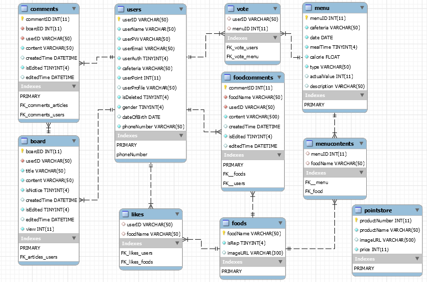
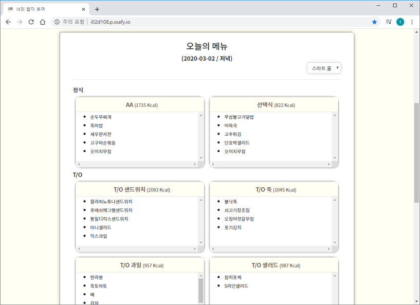
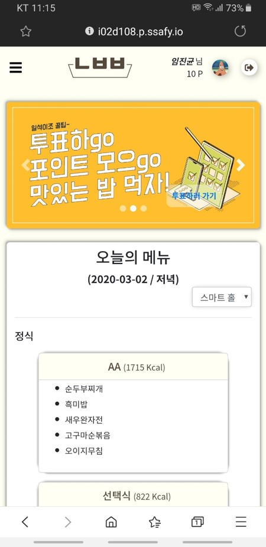
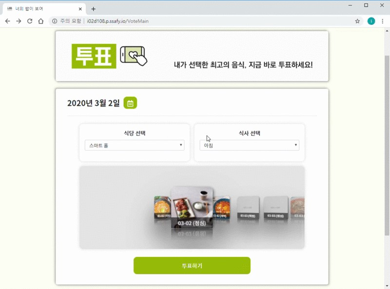
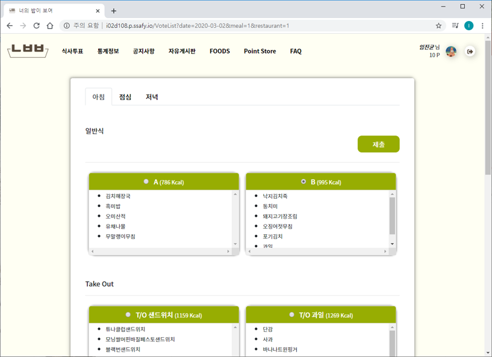
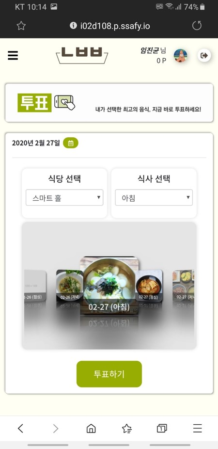
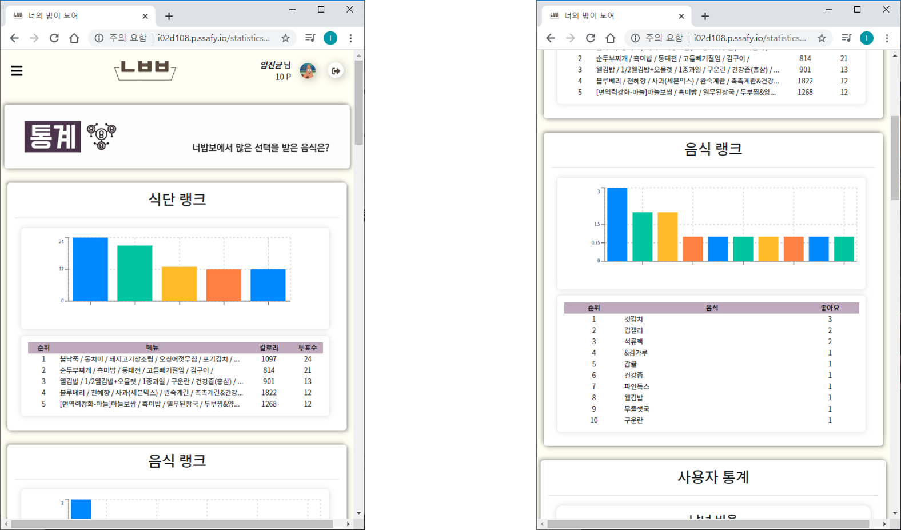
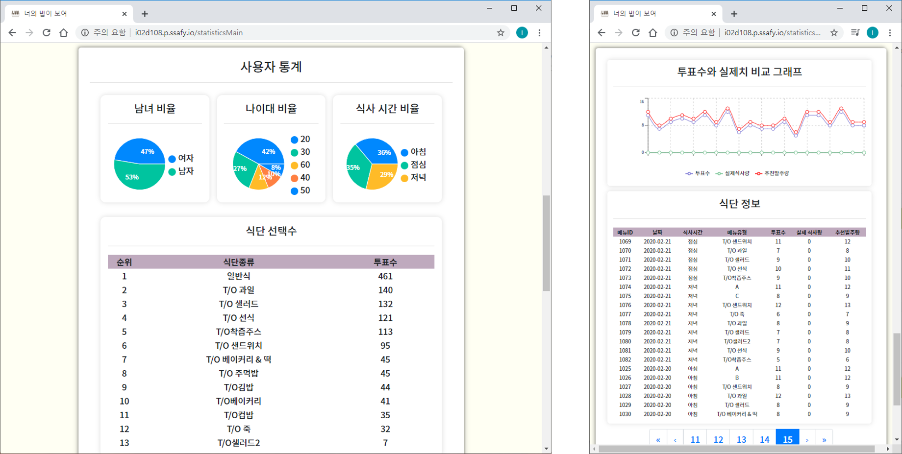

```txt
삼성청년SW아카데미(SSAFY)의 교육과정에서 수행한 프로젝트로 코드를 외부에 노출할 수 없는 점 양해 부탁드립니다.
대신에 프로젝트를 수행했던 과정에 대해 정리하였습니다. 참고해주시면 감사하겠습니다.
```


# 식품 수요 예측 온라인 투표 웹 서비스: 너밥보(너의 밥이 보여)

### 프로젝트 기간: 2020. 01. 20 ~ 2020. 03. 03


## 📖 개요

***미리 음식의 수요를 파악할 수 있는 "KIOSK 및 웹 서비스"***

- 임베디드 장비를 활용한 웹/모바일 프로젝트
- 식품 수요 예측을 위한 온오프라인 투표 웹 서비스


## 🌐 개발 언어

 - `Javascript`
 - `HTML`
 - `CSS`
 - `C`
 - `Python`


## 📌 개발 환경

- Chocolatey, npm
- React
- Nodejs(express)
- NGINX, PM2 배포 환경
- Raspberry Pi
- Git
- MariaDB


## :two_men_holding_hands: ​팀원 정보 및 수행 내역

### 프로젝트 팀원

- 총 4명
  - 백엔드 엔지니어 - 2명
  - 프론트 엔지니어 - 1명
  - 임베디드 엔지니어 - 1명

### 수행 내역

#### 팀 내 역할: 백엔드 엔지니어

- DB 설계 및 모델링
- DB 연결
- mybatis-mapper를 통한 SQL 사용 구조화
- REST API 요청 및 응답 구조화
- 유저 인증 및 권한 REST API 구현
  - 서버 측 로그인, 회원가입 로직 작성 
  - 서버 측 로그인 상태유지, 로그아웃 구현
    - 로그인 시, JWT 생성 및 쿠키에 등록
      - 유저 인증 및 상태유지에 사용
  - 기타 기능 구현
    - 자동 로그인, 회원탈퇴, 프로필 수정 등 
  - 통계 파트를 고려한 유저 DB 모델 보완
  - 클라이언트 측 유저 관련 부분 API 요청 및 상태 유지 관련 처리 코드 작성
- 통계 파트 REST API 구현
  - 일반 사용자 부분
    - 인기메뉴(식단), Best Foods 등 성별, 나이대 별로 보여주기
  - 사업자 부분
    - 집단에 대한 정보 보여주기
      - 남여 비율, 나이대 비율 등
    - 날짜별, 시간대별 식단의 투표수 보여주기
    - 선형회귀분석를 활용한 발주량 추천해주기
  - 클라이언트 측 API 요청 및 받은 데이터를 통한 그래프 그리기
    - recharts 라이브러리 사용 


## :minidisc: ​데이터베이스 모델링(ERD)

- 초기 ERD


- 최종 ERD




## 📷 스크린샷

**Main-Web**



**Main-Mobile**



**Vote - Web**





**Vote - Mobile**



**Statistics**





## 🧭 전체 프로젝트 진행 과정

- 2020.02.10-2020.03.03
    - 메인 페이지 구현 완료
        - 현재 시간에 따른 메뉴 제공
    - 투표 기능 완료
        - 날짜별 식단을 확인하고 투표 가능
        - 비로그인 사용자의 경우 휴대전화번호 입력으로 포인트 적립
    - 통계 기능 완료
        - 관리자에게 회귀분석으로 투표치와 실제치를 분석하여 발주량 추천 기능 제공
        - 투표치를 통한 식단과 사용자 정보 그래프 및 통계 제공
    - Foods 탭 구현
        - 전체 음식 목록을 확인할 수 있는 메뉴
        - 검색/상세 페이지 확인 가능
        - 좋아요 기능
    - 포인트스토어 구현
        - 장바구니 기능
    - KIOSK 제작 및 구현 완료
        - 조이스틱 및 버튼으로 마우스 컨트롤 가능
    - UI 수정 및 전체페이지 반응형 구현 완료
    - 그 외의 미구현된 부분 완료
        - 아이디 저장/자동로그인 기능
        - 공지사항/자유게시판/Foods 상세페이지의 댓글 기능
        - 로그인 시 헤더에서 프로필 사진과 현재 포인트 정보 출력
---
- 2020.02.03-2020.02.07
    - React로 웹페이지 구현
        - 날짜별 식단 검색 및 리스트 구현
        - 식단의 대표메뉴 사진
        - 공지사항 / 자유게시판/ FAQ 구현
    - 회원관리
        - 로그인 토큰 수정
        - 회원 프로필
        - 회원가입 시 프로필사진 저장
---
- 2020.01.20-2020.01.31
    - Bootstrap을 활용하여 레이아웃 구현
    - 반응형 웹으로 서비스 레이아웃 구현
        - 다양한 화면 크기에서도 쾌적하게 사용할 수 있도록 구현 
    - 회원관리와 게시판 웹 구현
        - 로그인/로그아웃
        - 회원상세페이지
        - 게시판 목록확인
        - 게시판 상세페이지 확인
    - Nodejs(Express)를 활용한 서버 구현(RESTFul API 사용)
        - 로그인/로그아웃/회원가입 등 회원
        - 식단/메뉴/대표메뉴 사진 URL
        - 게시판
    - 식단 정보 DB 저장을 위한 웹 크롤러
    - PM2를 통한 관리 및 배포


