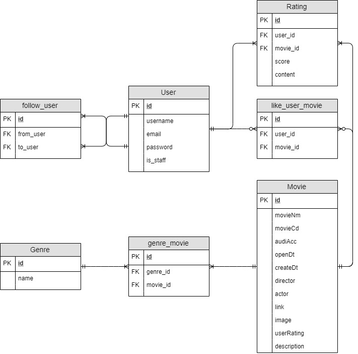

```txt
삼성청년SW아카데미(SSAFY)의 교육과정에서 수행한 프로젝트로 코드를 외부에 노출할 수 없는 점 양해 부탁드립니다.
대신에 프로젝트를 수행했던 과정에 대해 정리하였습니다. 참고해주시면 감사하겠습니다.
```


# :movie_camera: 영화 추천 사이트: SSA-G-V

### 프로젝트 기간: 2019. 11. 22 ~ 2019. 11. 28

> 주요 기능
>
> 유저, 영화, 평점에 대한 CRUD 기능, 영화 추천 기능(인터넷 평점 기반, 유저 정보 기반, 주간 박스오피스), 유저 관리 기능, 유저 간 팔로우 및 영화 좋아요 기능, 반응형 웹, 검색 기능


## 1. 목표

- 영화 추천 서비스 구현
- HTML/CSS, Javascript(Vue.js/Vanilla JS), Django, Database 등을 활용한 실제 서비스 설계

- Git을 통한 소스코드 버전 관리 및 협업
- 서비스 배포


## 2. 개발환경

### 1) Python Web Framework

- Django 2.2.x
- Python 3.7.x

### 2) 개발 아키텍처

- Django + VanilaJS + VueJS(CDN)

### 3) 서비스 배포 환경

- 서버: AWS Elastic Beanstalk, eb사용
- DB: SQLite사용


## 3. 프로젝트 수행 정보

### i. 팀원 정보 및 수행 내역

#### 1. 협업 방식

- github의 collabo repo 방식 사용

#### 2. 프로젝트 팀원

- 총 2명
  - 백엔드 엔지니어 - 1명
  - 프론트엔드 엔지니어 - 1명

#### 3. 수행 내역

#### 팀 내 역할: 백엔드 엔지니어

- Movie, User 데이터베이스 모델링 및 업그레이드
  - movies
    - model.py, form.py 작성 및 업그레이드
  - accounts
    - model.py, form.py 작성 및 업그레이드
- 데이터베이스 생성
  - API 및 크롤링을 통해 필요한 영화 데이터 수집 및 생성 로직 작성
    - movies/views.py
      - update_data
    - movies/templates/update_info.html 작성
  - 장르 시드 데이터 생성
    - movies/fixtures/genre.json
- 유저 관련 기능 구현
  - accounts/views 작성(로그인, 로그아웃, 회원가입, 삭제, 수정, 유저 관리 기능 등)
    - index, user_detail, signup, login, logout, user_delete, update, edit, change_password
  - accoutns/templates(관리자 페이지, form 페이지)
    - _user.html, auth_form.html, index.html
- 영화 추천 서비스 로직 구현
  - movies/views.py
    - 인터넷 평점순으로 top 3 영화 추천(recommend_movie)
    - 유저의 좋아요 데이터를 기반으로 가장 좋아하는 장르의 영화중 평점순으로 추천(recommend_for_user)
    - 최근 주간 박스 오피스 영화 10개 추천(weekly_recommend)
- 검색 기능 구현
  - movies/views.py
    - search
  - movies/templates/index.html 수정
- 평점 수정 기능 구현
  - movies.views.py
    - update_rating
  - movies/templates/_moviereview.html 수정
- 좋아요 및 팔로우 기능 보완
  - accounts/templates/user_detail.html 수정

- 영화 관련 페이지 생성 및 업그레이드
  - movies/templates
    - index.html, for_user.html, main.html, recommend.html, weekly_recommend.html
  - mrs/templates
    - nav.html
- 기타 프론트엔드 작업
  - movies/templates 일부 수정
  - accounts/templates 일부 수정


### ii. 목표 서비스 구현 및 실제 구현 정도 / 일자별 업무 진행 정도

#### 서비스 구현 목표

1. 기본적인 유저, 영화, 평점 CRUD 기능 구현
2. 주간 영화 데이터 자동적으로 반영
3. 인터넷 데이터 기반 추천 서비스 1개와 유저 데이터 기반 추천 서비스 1개 구현
4. 유저 관리 기능(superuser, staff, user, anonymous로 나누어 각각의 권한 부여)
5. 좋아요 및 팔로우 기능 구현
6. 검색 기능 구현
7. 깔끔하고 영화와 어울리는 테마 적용
8. 반응형 웹 구현

#### 실제 구현 정도(목표의 90% 이상 구현)

1. 기본적인 유저, 영화, 평점 CRUD 기능 구현
2. 주간 영화 데이터 반자동적으로 반영(매주 일요일마다 data update 버튼 클릭을 통해 최신 주간 박스오피스 영화 데이터를 자동으로 DB에 저장 및 갱신할 수 있음)
3. 인터넷 데이터 기반 추천 서비스 1개(인터넷 평점 기반 추천)와 유저 데이터 기반 추천 서비스 1개(좋아요 데이터 기반) 구현 + 최신 주간 박스오피스 영화 10개 추천 서비스 구현
4. 유저 관리 기능(superuser, staff, user, anonymous로 나누어 각각의 권한 부여)
5. 좋아요 및 팔로우 기능 구현 + 유저 프로필 페이지에서 한번에 관리 가능
6. 검색 기능 구현
7. 깔끔하고 영화와 어울리는 테마 적용
8. 반응형 웹 구현

#### 일자별 업무 진행

- 20191122 ~ 20191123
  - 영화 진흥위원회 및 네이버 api 활용해서 데이터 수집 로직 개발
  - 기본 django 셋팅 및 데이터 모델링
  - 영화 CRUD 기능 구현
- 20191124
  - 영화 진흥위원회 및 네이버 api 활용해서 데이터 수집 로직 보완
  - 평점 생성 및 삭제 기능 구현
  - 유저 CRUD 기능 구현
  - github collabo repo 방식 사용 시작
- 20191125 ~ 20191126
  - 유저 detail, 좋아요 및 팔로우 기능 구현
  - 데이터 수집 및 바로 데이터베이스에 넣는 로직 개발
  - 영화 추천 서비스 구현(인터넷 평점 순으로 추천, 유저 좋아요 기반으로 추천)
- 20191127
  - 데이터 수집 및 바로 데이터베이스에 넣는 로직 보완
  - 영화 추천 서비스 구현(주간 박스오피스)
  - 배포 성공
  - 프론트엔드 및 백엔드 보완
- 20191128
  - 프론트엔드 및 백엔드 보완
  - 검색 기능 추가
  - 평점 수정 기능 추가
  - 최종 배포


### iii. 데이터베이스 모델링(ERD)




### iv. 핵심 기능

#### CRUD 기능

- 영화, 유저, 평점에 대한 생성, 조회, 수정, 삭제 기능

#### 영화 추천 기능

- 인터넷 평점 기반 : 네이버 영화 API 서비스를 통해 얻은 평점을 기반으로 가장 높은 영화 3개 추천
- 유저 정보 기반: 유저의 좋아요 데이터를 기반으로 가장 좋아하는 영화 장르 중 가장 평점이 높은 영화 추천
- 주간 박스오피스: 영화 진흥위원회 API를 활용해서 가장 최근 1주일 간의 박스오피스 영화 10개 추천

#### 유저 관리 기능

- superuser, staff, user, anonymous로 나누어 각각의 권한 정도를 다르게 둠
- superuser 권한: admin페이지 접근권한, staff 및 일반 유저 관리 권한, 영화 및 평점 관리 권한
- staff 권한: 일반 유저 및 영화, 평점 관리 권한
- user 권한: 좋아요 및 팔로우, 평점 작성, 영화 추천 서비스 이용, 프로필페이지 이용
- anonymous: 영화 목록 페이지 접근 가능

#### 반응형 웹

- 모바일 및 다른 기기에서도 사용할 수 있도록 반응형 웹 구현

#### 검색 기능

- 유저가 키워드를 통해 데이터베이스 내에서 관련 영화들을 검색할 수 있음


### v. 배포 URL

http://final-deploy-movies.2s5njh7pyk.ap-northeast-2.elasticbeanstalk.com/movies/


