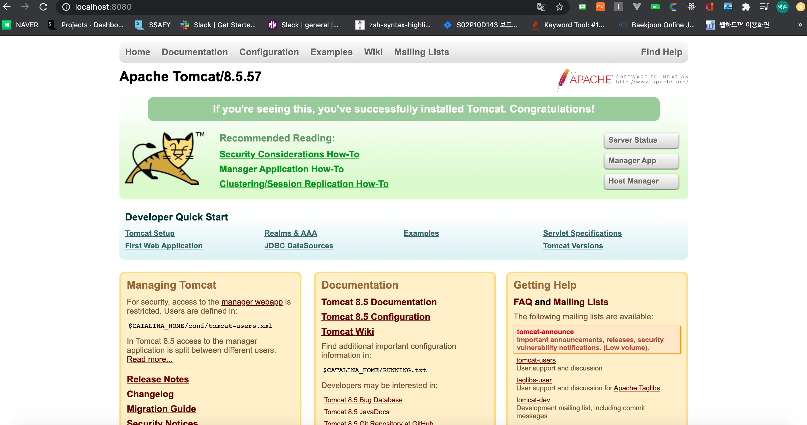
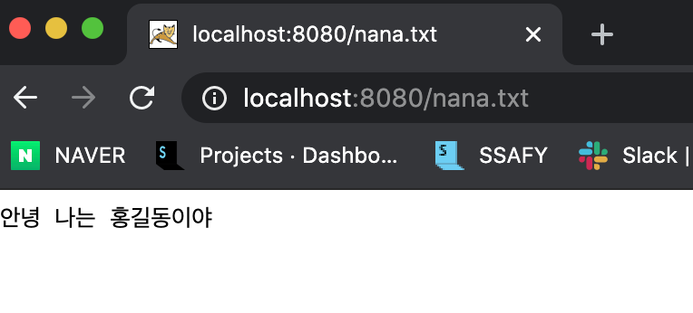
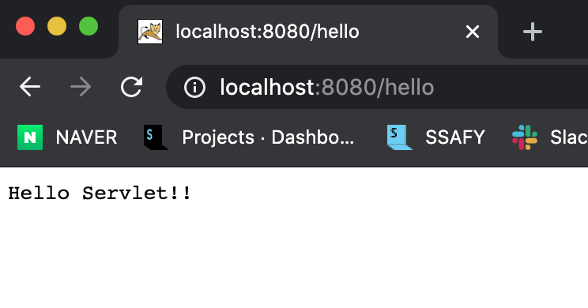
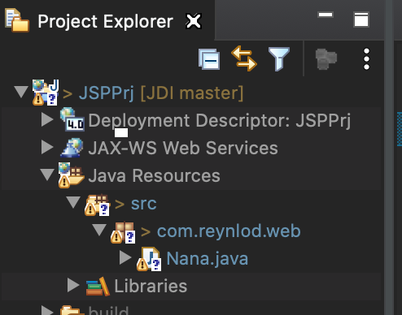
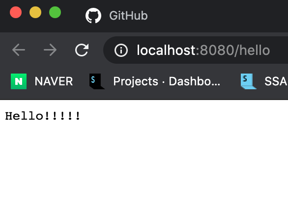
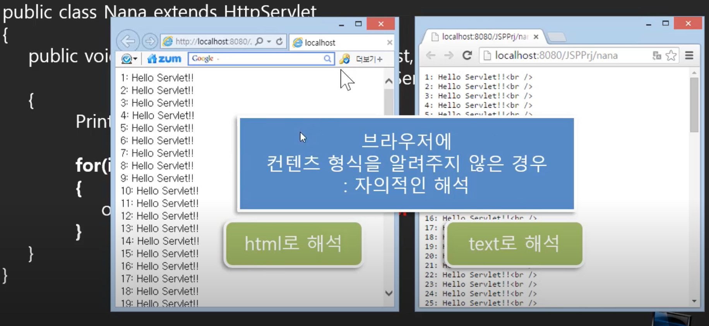
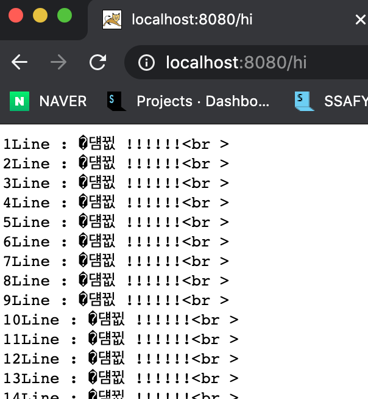
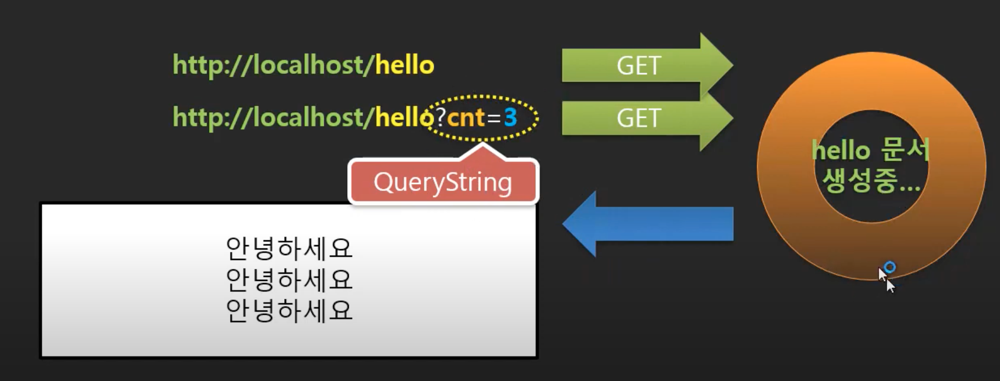

# Servlet 학습 1

## 1. 소개

- JAVA를 사용한 웹 개발
- JAVA를 사용해서 웹 개발을 할 때 사용할 수 있는 api가 서블릿과 JSP가 있음
- 자바를 이용한 백엔드 필요 기술 스택
  - 서블릿과 JSP를 학습해서 웹 서비스를 개발하기 전에 자바와 JDBC 등에 대해서 공부하자
  - 학습 순서
    - 자바(학습 완료) > HTML(프로젝트 경험), CSS(프로젝트 경험) > JDBC(프로젝트 경험, RDB, ORM 등) > 서블릿&JSP > 스프링 > 리눅스, 메이븐, Git(프로젝트 경험)


### 학습 목표


- 여기서는 서블릿, JSP, JSP MVC까지 학습
- 이어서 Spring 학습


## 2. 웹 서버 프로그램이란?

### 예전의 일반적인 업무용 프로그램

- 프로그램을 컴퓨터에서 바로 사용


### CS(클라이언트 / 서버) 프로그램

- 생산지, 지점 등(서버)과 본사(클라이언트) 간의 데이터 요청과 처리
- 데이터는 생산지, 지점에서 만들어지고 원격에 있는 본사에서 정보를 조회하려고 하는 일이 발생하게 됨
- 실시간 데이터 전달을 위해 네트워크(인터넷)을 이용함
- 그런데 서버와 클라이언트를 하나의 언어로 개발했고, 각 지점에서 동기화하기 위해서는 모든 클라이언트와 서버가 같은 버전을 사용해야했기 때문에, 설치와 재설치가 빈번해졌음(자동으로 설치와 재설치가 되던 것이 아님)
- 또, 소켓을 이용해서 데이터를 전송하는 것이 기본이었는데 직접 데이터를 포맷팅하고 유효성 검사하고 등등 부담스러움


- 이러한 불편함을 해결하기 위해 여러가지 방법들이 고안됨
  - 소켓, RPC, ... 웹 등
  - 결국에는 웹을 사용하게 됨


### 데이터가 아닌 문서를 전달하는 웹을 사용하면?

- 이미 웹은 브라우저를 통해 요청하고, 웹 서버에서 응답을 해주는 프로세스를 가지고 있었음
- 서버와 클라이언트 프로그램을 웹에 올려서 사용하자
- 웹은 기본적으로 페이지를 제공해주는 것
  - 생각해보니 예전에 사용하던 윈도우 프로그램의 페이지가 웹 페이지랑 크게 다르지 않다는 생각
  - 게임처럼 엄청나게 시각적으로 동적인건 아니지만, 업무용으로는 충분히 표현할 수 있음
  - 다만,  서버쪽에서 DB와 연동해서 데이터를 제공해주는 일은 해줘야함
    - DB와 연동해서 동적인 페이지를 환경을 추가하게 됨
- 이렇게 서버에서 동적인 페이지를 만들어서 클라이언트에 보내주면 브라우저를 통해 페이지를 볼 수 있게 됨
  - 동적인 페이지가 전달되다보니 클라이언트쪽에서 프로그램을 만들 필요가 없어짐
    - 브라우저만 있으면 페이지를 띄워주니까..
- 예전에는 CS프로그램이라고 했었는데 웹으로 오면서 클라이언트가 없어짐
  - 그래서 웹 초기에는 웹 개발자라고하면 서버 프로그래머를 의미했었음
- 최근에는 자바스크립트라는 것이 등장함
  - 페이지를 요청하던 것에서 다시 예전처럼 데이터를 전달하는 방식으로 바뀜
  - 서버쪽에서 데이터를 보내주면 브라우저에서 돌아가는 자바스크립트로 된 클라이언트 프로그램을 만들게 됨


## 3. 웹 서버 프로그램과 Servlet

### 웹 기반의 클라이언트/서버 프로그램

- 웹을 이용해서 CS 프로그램을 만들겠다라고 하면서 서버쪽에서 먼가 추가적인 작업이 필요하게 됨
- 사용자가 회원에 대한 목록을 요청함 > 웹 서버는 홈 디렉토리에 그 요청이 있는지 찾음 > 찾으면 웹 문서일 것
  - 그런데 웹 문서는 미리 만들어져 있는 것이 불가능함
  - DB에서 현재의 데이터 상황을 받아와야함
  - 결국 문서가 있는 것이 아니라 이런 문서를 만들어내기 위한 코드가 있음
  - 서버는 이 코드를 그냥 클라이언트에게 보내는 것이 아니라 실행시켜서 DB를 통해 데이터를 활용하고 난 후 페이지로 만들어서 보내줘야됨
  - 결국 이 코드를 실행할 실행환경이 추가적으로 필요하게 된 것
  - 웹 서버는 기본적으로 있지만, 사용자가 요구하는 내용이 동적이라면 이 코드를 실행하고, 그 결과를 보내줄 수 있는 무언가가 필요함
  - 이런 실행환경을 WAS(Web Application Server)라고 함
  - 이렇게 서비스해줄 수 있는 것이 추가적으로 설치되어있어야함
- 사용자가 목록 요청 > 웹 서버가 코드를 찾아서 WAS에게 넘겨줌 > WAS가 코드를 실행함(DB에 접근해서 보낼 목록을 만듬) > 다시 웹 서버에게 보냄 > 웹 서버가 클라이언트에게 결과를 응답함
- 결론적으로, 웹 서버 어플리케이션은 기본적으로 다음으로 구성됨
  - Server Application
    - 동적으로 문서를 만들기 위한 코드들
  - 이를 실행시킬 수 있는 환경
    -  웹 서버 + WAS


### 왜 웹 서버 응용 프로그램을 Servlet이라 명칭할까?

- 클라이언트에서 어떤 것을 요청하면 웹 서버에 의해서 이런 요청에 응답할 수 있는 코드(Server App, ex.자바 서버 어플리케이션)가 찾아질 것
- 그런데 이런 Server App은 사용자의 요청에 따라서 그때 그때 파편화된 것이 실행되고 전달되고나면 프로그램이 끝나버림
- 그래서 이렇게 조각나있는 서버 어플리케이션을 명칭화한게 아닐까?


- 서블릿 단위로 만들기 위한 환경, 서블릿이라는 것을 만들기 위한 환경을 구축해보자


## 4. 톰캣 9 설치하기 - 1. 설치

### mac에서 설치하기

1. http://tomcat.apache.org/
2. 원하는 버전을 찾아서 다운로드받는다


3. 다운로드받고 압축을 해제해준다
4. 터미널을 통해 다음과 같은 과정을 실행한다

```bash
1. Tomcat을 설치할 폴더 생성
sudo mkdir -p usr/local

2. 압축해제한 파일을 다운로드에서 /usr/local로 이동시킨다
sudo mv ~/Downloads/apache-tomcat-9.0.39 /usr/local

3. Library안에 Tomcat이 있을 경우를 대비해 삭제
sudo rm -f ~Library/Tomcat

4. local에 옮겨놨던  tomcat과 Library의  Tmocat을 링크시킴
sudo ln -s /usr/local/apache-tomcat-9.0.39 /Library/Tomcat

5. Library의 Tomcat폴더의 권한을 수정 ###에 사용자 이름을 입력
sudo chown -R ### /Library/Tomcat

6. Tomcat의 .sh파일 사용 가능하도록 권한 수정
sudo chmod +x /Library/Tomcat/bin/*.sh

7. 톰캣 시작과 종료
sudo /Library/Tomcat/bin/startup.sh
sudo /Library/Tomcat/bin/shutdown.sh
```

5. 실행 확인




## 5. 톰캣 9 설치하기 - 2. 웹문서 추가해보기

- 톰캣은 WAS
- 톰캣은 WAS에 자바어플리케이션을 개발하는 웹서비스 기능도 함께 있음
  - 웹 서버로 볼 수도 있음
  - 웹 서버라면 웹문서를 제공해주는 서비스를 함
  - 웹 문서를 어떤식으로 제공해주는가?
- 톰캣을 간단하게 웹문서를 제공해주는 것으로 사용해보자

### 테스트 문서 만들고 서비스하기

- tomcat > webapps > ROOT
  - 여기에 nana.txt 생성
    - 아무 내용이나 입력
  - http://localhost:8080/nana.txt
  - 한글 인코딩 문제발생
    - txt 인코딩 방식을 UTF-8에서 EUCKR로 바꿔서 결과출력 성공
    - txt 인코딩 문제 때문에 발생한 것으로 보임
    - 이클립스로 실행하면 오류가 안날 것으로 예상됨
- IP가 공인IP라면 전세계 어느곳에서든 브라우저를 통해서 접근할 수 있음


## 6. 톰캣 9 설치하기 - 3. Context 사이트 추가하기

### Context 사이트 추가

- 사이트를 만들다보면 규모가 커지고 파일수가 많아지게 됨
- 그에 따라 디렉토리도 많아지게 됨
- 여러개의 디렉토리를 한 명이 다 맡을 수 있을까?
- 떼어내서 별개의 사이트처럼 만들면 어떨까?
  - 물리적으로는 별개의 사이트이지만, 하나의 루트에서 나오는 것처럼 느껴지도록 만드는 것
  - 이런 것을 Context 사이트라고 함


- context 사이트를 추가하기 위해서는 conf > server.xml을 수정해줘야됨
  - 수정 후, 서버 재시작

```xml
<Host name="localhost"  appBase="webapps"
            unpackWARs="true" autoDeploy="true">

  <!-- 이 부분 추가-->
	<Context path="it"
	docBase="/usr/local/apache-tomcat-9.0.39/webapps/ITWeb"
	privileged="true"/>

</Host>

```


- 결과




- 그런데 톰캣 버전이 올라가면서 이렇게 server.xml을 수정하는 방식은 지양하게 됨
  - 서버를 재시작해야하기(껐다가 다시 켜야하기) 때문에 서비스에 치명적일 수 있음
  - 그래서 각 어플리케이션마다 metainfo라는 곳에 따로 Context를 마련하는 방법을 이용하는 것이 좋음
    - 이 부분은 다음에 어플리케이션을 만들 때 다루겠음


## 7. Servlet 프로그램 만들기

### 왜 웹 서버 응용 프로그램을 Servlet이라 명칭할까?

- 요청이 들어오면 그것만 로드해주기 위해서 담당 코드들(서버 어플리케이션)이 조각나있음
- 한번에 다 개발하지 않고 필요한 것을 하나씩 하나씩 만들어보자
- 어떻게 만들것인가?
  - JAVA 어플리케이션은 main()함수를 시작으로 프로그램을 만듦
  - 서버 어플리케이션은 service()함수를 시작으로 만듦
  - 나머지는 거의 자바 콘솔 어플리케이션이랑 비슷함
    - 웹 출력과 웹 입력 부분만 도구가 조금 추가됨

### 서블릿 코드 작성과 실행

- 클래스, 함수, 입출력 등 코드를 작성하는데 이렇게 만들게 되는 모든 서블릿 클래스들은 WAS를 통해서 로드가 되고 실행이 되고 결과를 돌려주게 됨
- 이 과정에서 WAS는 클래스 이름을 전부다 알 수가 없음
  - 약속되어있는 추상클래스나 인터페이스 이름에 따라서 작동하게 됨
  - 그래서 클래스명은 원하는데로 만들어도 됨
  - 클래스 안에 있는 WAS가 참조하고 있는 메소드는 service라는 정해진 이름을 사용하게 됨
- 자바에서는 main함수를 썼지만, 여기서는 service함수를 main함수라고 생각하고, 기능단위로 나눠서 클래스명은 알아서 만들면 됨
- 이렇게 만들어진 클래스를 'OO서블릿'이라고 함


- 이제 이 코드를 컴파일하고 사용자가 요청하면 실행될 수 있도록 만들어보자
- 일단 이클립스를 사용하지않고 그냥 메모장에다가 만들어보자

```java
import javax.servlet.*;
import javax.servlet.http.*;
import java.io.*;

public class Nana extends HttpServlet {
  public void service(HttpServletRequest request, HttpServletResponse response) throws IOException, ServletException {
    System.out.println("Hello Servlet");
  }
}
```

- 그냥 javac Nana.java 하면 오류가 뜸
  - servlet 관련 라이브러리를 사용하고 있기 때문임
- javac -cp /usr/local/apache-tomcat-9.0.39/lib/servlet-api.jar Nana.java
  - 톰캣 안에 있는 servlet 라이브러리를 써서 컴파일
- 오류없이 Nana.class 파일이 생성됨
  - 이제 이걸 어떻게 실행하게 할 것인가?


## 8. 서블릿 객체 생성과 실행 방법

### 톰캣에 의해서 서블릿 코드가 실행되도록 코드 배치와 요청

- 이렇게 만들어진 클래스파일들은 예약된 곳이 있음
  - ROOT > WEB-INF > classes
  - 여기에 들어가야됨
- 그러면 이거를 사용자는 어떻게 요청하나?
  - 경로대로 url에 치면 되나? 절대안됨
    - WEB-INF는 특별한 의미를 가짐
    - 클라이언트에서 접근할 수 있는 곳이 아님
    - 이 곳에 있는 파일들은 특수한 의미로써 서버쪽에서 사용할 수 있음
    - 그래서 클래스파일들을 여기에 비공개로 두고 서버쪽에서 특별한 방식으로 사용해야 됨


- 그러면 사용자가 이걸 어떻게 요청하나?

### 서블릿이 실행되는 시점과 방식

- 자바 서버 어플리케이션 부분은 톰캣(WAS)이라던지 웹서버만 알고 있으면 됨
- 톰캣 왈, "내가 실행은 해줄테니까 멀 원하는지 말해봐라"
  - URL과 매핑된 Servlet 코드를 찾아서 실행


### 서블릿 코드를 URL과 매핑하기

- web.xml에 다음과 같이 추가


```xml
  <servlet>
     <servlet-name>na</servlet-name>
     <servlet-class>Nana</servlet-class>
  </servlet>

  <servlet-mapping>
     <servlet-name>na</servlet-name>
     <url-pattern>/hello</url-pattern>
  </servlet-mapping>
```

- /hello 로 요청이 오면 웹서버는 hello라는 파일이 있는지 찾아보고 없다면 WAS에게 넘김
- WAS는 매핑정보를 찾아봐서 거기에 맞는 서블릿 코드를 실행하게 됨
- 현재는 흰색만 나옴
  - 코드에서 클라이언트에게 보여지는 부분은 아무것도 처리해준게 없음
  - 다만, "Hello Servlet"을 출력하는 부분은 서버쪽의 콘솔에 출력하는 것임
  - 출력 방법이 두개가 된 것임
    - 하나는 콘솔 출력(이거는 자바에서 했던 것), 또 하나는 웹 출력
    - 웹 출력을 위한 도구가 필요함
      - 그게 HttpServletResponse response임

- mac에서 콘솔을 통해서 로그를 확인하는 방법
  - sudo /Library/Tomcat/bin/startup.sh
  - sudo /Library/Tomcat/bin/shutdown.sh
    - 이렇게 하던 방법에서 
  - sudo /Library/Tomcat/bin/catalina.sh run
  - sudo /Library/Tomcat/bin/catalina.sh stop
    - 이렇게 하자


## 9. Servlet 문자열 출력

### 기본 자바 프로그램과 서블릿 프로그램에서 달라지는 부분

- 기존에는 콘솔에 입출력을 했다면
- 이제는 웹에 입출력을 해야함


### 서블릿 코드 작성하기 : response를 이용한 출력방법

#### Servlet 웹 입/출력 API

- HttpServletResponse response를 사용하자

```java
import javax.servlet.*;
import javax.servlet.http.*;
import java.io.*;

public class Nana extends HttpServlet {
  public void service(HttpServletRequest request, HttpServletResponse response) throws IOException, ServletException {
    
    // response(객체)가 가지고 있는 OutputStream 객체를 가져옴
    OutputStream os = response.getOutputStream();
    // OutputStream 객체를 이용해서 이를 좀 더 편하게 문자열을 사용할 수 있도록 PrintStream 객체를 만들어서 사용하자
    // 네트워크로 출력되는 스트림은 좀 쌓여야 보내줌, 버퍼를 꽉 채우지 못할 경우를 대비해서 프린트단위로 그냥 보내라는 의미로 true를 매개변수로 넣어줌
    PrintStream out = new PrintStream(os, true);
    out.println("Hello Servlet!!");
  }
}
```

- 다시 컴파일하고 classes안에 넣어주고 톰캣을 다시 재시작하자



- 코드를 한번더 수정하자
  - 앞으로는 다국어를 지원하는 PrintWriter를 사용하자
  - 그리고 다음부터는 이런 번거로운 수정작업을 줄이기 위해 이클립스를 사용하자

```java
import javax.servlet.*;
import javax.servlet.http.*;
import java.io.*;

public class Nana extends HttpServlet {
  public void service(HttpServletRequest request, HttpServletResponse response) throws IOException, ServletException {
    
    // 자바에서는 stream 계열과 writer 계열이 있음
    // 다국어 문자를 쓰겠다 > writer 계열을 씀
    PrintWriter out = response.getWriter();
    out.println("Hello Servlet!!");
  }
}
```


## 10. 웹 개발을 위한 이클립스 IDE 준비하기

- 이전까지 어떤 부분을 개발한다고하면
  - 코드작성 > 컴파일 > 파일 이동 > 서버 재시작 > 실행
  - 이렇게 번거로운 작업을 거쳐야했음
  - 이런 작업들을 하나로 통합하여 쉽게 개발할 수 있게 도와주는 도구들이 있음
  - 일반적으로 자바로 웹 개발을 하면 이클립스 엔터프라이즈 버전을 사용함

### 프로젝트 관리 + 코드 편집 도구 : 코드 수정의 편리함

- 코두 수정 > 컴파일 > 배포 > 톰캣 서버 재시작 > 브라우저로 요청
- 이클립스로 한번에 해결
- 이클립스 엔터프라이즈 버전 설치 > 동적 웹 프로젝트 생성 > tomcat 9 연결


## 11. 이클립스를 이용한 서블릿 프로그래밍

### html 파일 만들어 보기

- 홈디렉토리(tomcat의 ROOT)가 어디냐?
  - WebContent가 ROOT역할을 함
  - WebContent에 index.html 생성
  - 서버 재시작하고
  - http://localhost:8080/JSPPrj/index.html 들어가서 확인가능
- 그런데 JSPPrj라는 Context가 있는 것은 좋지 않음
  - 설정을 통해서 properties > Web Project Settings > Context root
  - JSPprj 를 / 로 변경
  - 서버 재시작하고
  - http://localhost:8080/index.html 에서 확인가능

### 이클립스에서 Nana 서블릿 작성하기

- 자바에서 클래스 만들었던 것과 똑같음
- 패키지를 하나만들고 Nana.java 생성



```java
package com.reynold.web;

import java.io.IOException;
import java.io.PrintWriter;

import javax.servlet.ServletException;
import javax.servlet.http.HttpServlet;
import javax.servlet.http.HttpServletRequest;
import javax.servlet.http.HttpServletResponse;

public class Nana extends HttpServlet {
	@Override
	protected void service(HttpServletRequest req, HttpServletResponse resp) throws ServletException, IOException {
		
		PrintWriter out = resp.getWriter();
		out.println("Hello!!");
	}
}

```

- 서블릿을 실행하기 위해서는 매핑이 필요함
- web.xml을 수정해줄려고 했는데 WEB-INF 안에 없음
- 저번에 tomcat에서 수정했던 것 복사해서 가져오자
- 패키지명만 추가해주자

```xml
	<servlet>
     <servlet-name>na</servlet-name>
     <servlet-class>com.reynold.web.Nana</servlet-class>
  </servlet>
 
  <servlet-mapping>
     <servlet-name>na</servlet-name>
     <url-pattern>/hello</url-pattern>
  </servlet-mapping>
```

- 성공




## 12. 어노테이션(Annotation)을 이용한 URL 매핑

### Annotation을 이용한 URL 매핑

- 어노테이션을 사용하면 web.xml에서 매핑을 해줄 필요가 없음
- WebServlet("/hello")

```java
package com.reynold.web;

import java.io.IOException;
import java.io.PrintWriter;

import javax.servlet.ServletException;
import javax.servlet.annotation.WebServlet;
import javax.servlet.http.HttpServlet;
import javax.servlet.http.HttpServletRequest;
import javax.servlet.http.HttpServletResponse;

@WebServlet("/hello")
public class Nana extends HttpServlet {
	@Override
	protected void service(HttpServletRequest req, HttpServletResponse resp) throws ServletException, IOException {
		
		PrintWriter out = resp.getWriter();
		out.println("Hello!!!");
	}
}

```

- 서블릿 2.X 버전에서는 사용할 수 있는 매핑 정보가 web.xml 밖에 없었음
- 서블릿 3.0 이상부터 어노테이션 방법도 사용할 수 있게 됨
  - 그런데 이걸 할려면 web.xml의 metadata-complete를 false로 바꿔야됨
  - true는 매핑관련 설정을 전부 web.xml에서 했다는 의미이기 때문에 어노테이션이 적용되지 않음


```xml
<?xml version="1.0" encoding="UTF-8"?>
<!--
 Licensed to the Apache Software Foundation (ASF) under one or more
  contributor license agreements.  See the NOTICE file distributed with
  this work for additional information regarding copyright ownership.
  The ASF licenses this file to You under the Apache License, Version 2.0
  (the "License"); you may not use this file except in compliance with
  the License.  You may obtain a copy of the License at

      http://www.apache.org/licenses/LICENSE-2.0

  Unless required by applicable law or agreed to in writing, software
  distributed under the License is distributed on an "AS IS" BASIS,
  WITHOUT WARRANTIES OR CONDITIONS OF ANY KIND, either express or implied.
  See the License for the specific language governing permissions and
  limitations under the License.
-->
<web-app xmlns="http://xmlns.jcp.org/xml/ns/javaee"
  xmlns:xsi="http://www.w3.org/2001/XMLSchema-instance"
  xsi:schemaLocation="http://xmlns.jcp.org/xml/ns/javaee
                      http://xmlns.jcp.org/xml/ns/javaee/web-app_4_0.xsd"
  version="4.0"
  metadata-complete="false">

  <!-- 주석 처리 -->
  <!-- <servlet>
     <servlet-name>na</servlet-name>
     <servlet-class>com.reynold.web.Nana</servlet-class>
  </servlet>
 
  <servlet-mapping>
     <servlet-name>na</servlet-name>
     <url-pattern>/hello</url-pattern>
  </servlet-mapping> -->

  <display-name>Welcome to Tomcat</display-name>
  <description>
     Welcome to Tomcat
  </description>


</web-app>

```

```java
package com.reynold.web;

import java.io.IOException;
import java.io.PrintWriter;

import javax.servlet.ServletException;
import javax.servlet.annotation.WebServlet;
import javax.servlet.http.HttpServlet;
import javax.servlet.http.HttpServletRequest;
import javax.servlet.http.HttpServletResponse;

@WebServlet("/hi")
public class Nana extends HttpServlet {
	@Override
	protected void service(HttpServletRequest req, HttpServletResponse resp) throws ServletException, IOException {
		
		PrintWriter out = resp.getWriter();
		out.println("Hello!!!!!!");
	}
}

```

- 두가지 방법 중에 어떤 것이 더 좋은 방법인가?
  - 어노테이션이 더 좋음
    - 코드가 더 깔끔하기도 하고
    - 기업형 프로그램을 만드는 것처럼 여러명에서 프로젝트를 하기 위해서는 각 맡은 부분을 따로 만들 수 있는 것이 좋음
    - 전부 web.xml 파일을 동시에 건드리는 건 안좋음


## 13. 서블릿 출력 형식을 지정해야 하는 이유

### 제어구조를 이용한 출력

- Nana.java

```java
package com.reynold.web;

import java.io.IOException;
import java.io.PrintWriter;

import javax.servlet.ServletException;
import javax.servlet.annotation.WebServlet;
import javax.servlet.http.HttpServlet;
import javax.servlet.http.HttpServletRequest;
import javax.servlet.http.HttpServletResponse;

@WebServlet("/hi")
public class Nana extends HttpServlet {
	@Override
	protected void service(HttpServletRequest req, HttpServletResponse resp) throws ServletException, IOException {
		
		PrintWriter out = resp.getWriter();
		
		for(int i=0; i<100; i++) {
			out.println((i+1) + "Line : Hello!!!!!!");
		}
		
	}
}

```

- 각 브라우저마다 출력되는 형태가 다름

  - 크롬같은 경우, 내려쓰기가 되는데 그 이유가 넘겨진 파일의 형식을 txt로 인식했기 때문에 받은 그대로 보여준 것

  - Edge의 경우에는 그냥 쭉 이어져서 나오는데 이게 사실 더 정상임

    - 웹 문서(html)로 인식하기 때문에 태그를 통한 내려쓰기가 없어서 적용이 안됨

  - ```java
    for(int i=0; i<100; i++) {
    			out.println((i+1) + "Line : Hello!!!!!!<br >");
    		}
    ```

  - 이렇게 해줘야됨

- 결국 브라우저에 컨텐츠 형식을 알려주지 않은 경우에는 각 브라우저에서 자의적으로 해석하게 됨

- 클라이언트에게 어떤 내용을 보낼 때 어떤 형식의 문서인지 알려줘야됨

- 그렇지 않으면, Edge나 인터넷익스프롤러는 html로 해석, 크롬은 text로 해석




## 14. 한글과 콘텐츠 형식 출력하기

### 한글 출력하기

- Nana.java

```java
package com.reynold.web;

import java.io.IOException;
import java.io.PrintWriter;

import javax.servlet.ServletException;
import javax.servlet.annotation.WebServlet;
import javax.servlet.http.HttpServlet;
import javax.servlet.http.HttpServletRequest;
import javax.servlet.http.HttpServletResponse;

@WebServlet("/hi")
public class Nana extends HttpServlet {
	@Override
	protected void service(HttpServletRequest req, HttpServletResponse resp) throws ServletException, IOException {
		
		PrintWriter out = resp.getWriter();
		
		for(int i=0; i<100; i++) {
			out.println((i+1) + "Line : 안녕 !!!!!!<br >");
		}
		
	}
}

```

- 한글이 깨져서  ?로 나옴

### 한글이 꺠지는 이유 두 가지

#### 서버에서 한글을 지원하지 않는 문자코드로 인코딩한 경우

- ISO-8859-1 이라는 방식으로 인코딩해서 보낼 경우, 문자가 1바이트씩 보내지는데 이렇게 되면 ?가 찍힘
- 한글로 나오게 할려면 2바이트씩 보내야됨

#### 서버에서는  UTF-8로 인코딩해서 보냈지만 브라우저가 다른 코드로 잘못 해석한 경우

- UTF-8은 2바이트씩 보내기 때문에 한글로 읽을 수 있도록 보내지만 브라우저에서 다른 인코딩방식으로 해석할 경우에는 결국 깨지게 됨


- UTF-8로 인코딩해서 보내기

```java
package com.reynold.web;

import java.io.IOException;
import java.io.PrintWriter;

import javax.servlet.ServletException;
import javax.servlet.annotation.WebServlet;
import javax.servlet.http.HttpServlet;
import javax.servlet.http.HttpServletRequest;
import javax.servlet.http.HttpServletResponse;

@WebServlet("/hi")
public class Nana extends HttpServlet {
	@Override
	protected void service(HttpServletRequest request, HttpServletResponse response) throws ServletException, IOException {
		
    // 인코딩 변경해주기
		response.setCharacterEncoding("UTF-8");
		
		PrintWriter out = response.getWriter();
		
		for(int i=0; i<100; i++) {
			out.println((i+1) + "Line : 안녕 !!!!!!<br >");
		}
		
	}
}

```



- 클라이언트에게 어떻게 해석해야할지도 알려줌

```java
package com.reynold.web;

import java.io.IOException;
import java.io.PrintWriter;

import javax.servlet.ServletException;
import javax.servlet.annotation.WebServlet;
import javax.servlet.http.HttpServlet;
import javax.servlet.http.HttpServletRequest;
import javax.servlet.http.HttpServletResponse;

@WebServlet("/hi")
public class Nana extends HttpServlet {
	@Override
	protected void service(HttpServletRequest request, HttpServletResponse response) throws ServletException, IOException {
		
		response.setCharacterEncoding("UTF-8");
    // 컨텐츠 타입이 html이고 UTF-8로 해석하도록 해주는 코드
		response.setContentType("text/html; charset=UTF-8");
		
		PrintWriter out = response.getWriter();
		
		for(int i=0; i<100; i++) {
			out.println((i+1) + "Line : 안녕 !!!!!!<br >");
		}
		
	}
}

```


## 15. GET 요청과 쿼리스트링

### 사용자 입력 다루기

- 사용자가 입력은 무언가를 요청하는 과정에서 발생하는 것
- 입력과 요청은 하나의 단위로 보기도 함
- 요청할 때 전달하는 값을 어떻게 받을 것인가?
- 사용자 요청의 가장 기본은 GET 요청

### GET 요청

#### 무엇을 달라고 하는 요청에는 옵션이 있을 수 있다

- 이런 옵션을 쿼리스트링이라고 함
  - GET http://localhost/hello
  - GET http://localhost/hello?cnt=3
  - 이렇게 클라이언트가 옵션을 넣어서 요청하면 서버쪽에서는 단순히 정적인 문서를 응답해주는 것이 아니라 옵션에 맞는 문서를 만들어줘야함



### 쿼리 스트링 값을 이용한 반복문 작성

- Nana.java

```java
package com.reynold.web;

import java.io.IOException;
import java.io.PrintWriter;

import javax.servlet.ServletException;
import javax.servlet.annotation.WebServlet;
import javax.servlet.http.HttpServlet;
import javax.servlet.http.HttpServletRequest;
import javax.servlet.http.HttpServletResponse;

@WebServlet("/hi")
public class Nana extends HttpServlet {
	@Override
	protected void service(HttpServletRequest request, HttpServletResponse response) throws ServletException, IOException {
		
		response.setCharacterEncoding("UTF-8");
		response.setContentType("text/html; charset=UTF-8");
		
		PrintWriter out = response.getWriter();
		
    // cnt로 넣어준 값을 읽는데 이때 무조건 문자열로 전달이 됨, 문자열을 integer로 변환해서 사용
		int cnt = Integer.parseInt(request.getParameter("cnt"));
		
		for(int i=0; i<cnt; i++) {
			out.println((i+1) + "안녕 Servlet<br />");
		}
		
	}
}

```


## 참고

- 유튜브 채널 뉴렉처


