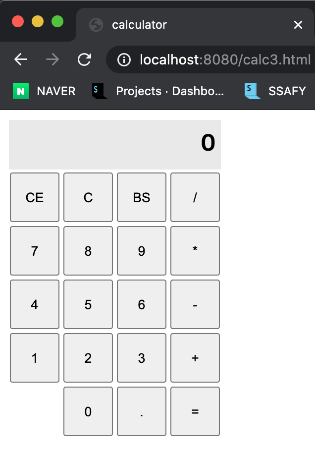
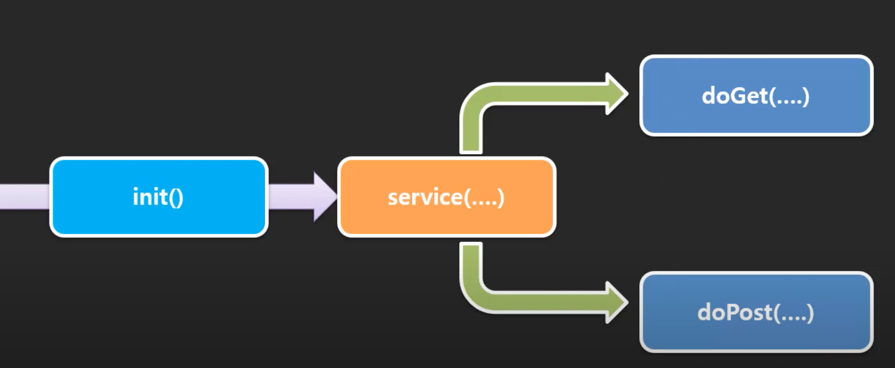
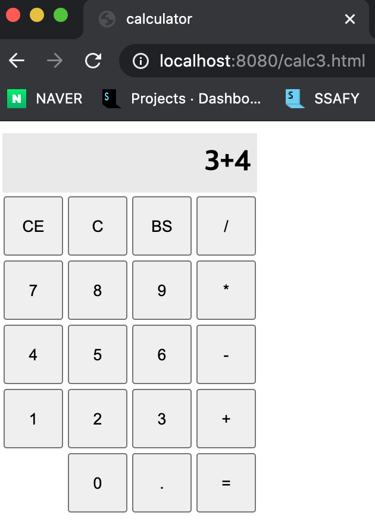
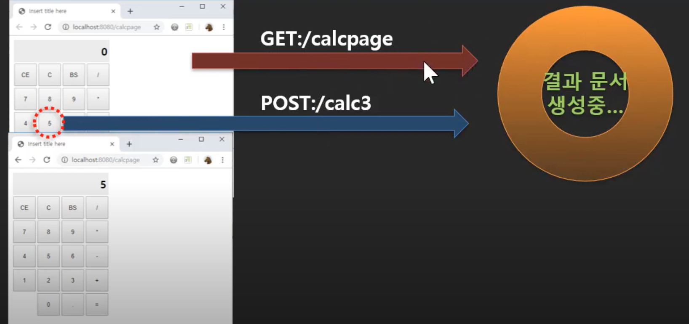

# Servlet 학습 3


## 33. 서버에서 페이지 전환해주기(redirect)

### 페이지 전환

- 현재 상태
  - 값을 입력하고 버튼을 누르면 서블릿으로 요청이감
  - 응답으로 흰색 백지페이지를 넘겨줌
  - 사용자가 다시 뒤로가기를 누르거나, calc.html을 주소창에 쳐서 페이지를 요청해서 돌아온 후, 다른 값을 입력해야 됨
  - 서버에서 바로 calc.html을 응답해주는 방법은 없나?


- redirect
  - 사용자의 요청에 대해 바로 서블릿이 응답을 해주는 것이 아니라, calc.html로 경로를 우회해버림


### 코드로 알아보자

- Calc2.java

```java
package com.reynold.web;

import java.io.IOException;

import javax.servlet.ServletContext;
import javax.servlet.ServletException;
import javax.servlet.annotation.WebServlet;
import javax.servlet.http.Cookie;
import javax.servlet.http.HttpServlet;
import javax.servlet.http.HttpServletRequest;
import javax.servlet.http.HttpServletResponse;
import javax.servlet.http.HttpSession;

@WebServlet("/calc2")
public class Calc2 extends HttpServlet {

	protected void service(HttpServletRequest request, HttpServletResponse response) throws ServletException, IOException {
		
		ServletContext application = request.getServletContext();
		HttpSession session = request.getSession();
		Cookie[] cookies = request.getCookies();
		
		response.setCharacterEncoding("UTF-8");
		response.setContentType("text/html; charser=UTF-8");
		
		String v_ = request.getParameter("v");
		String op = request.getParameter("operator");
		
		int v = 0;
		
		if(!v_.equals("")) {
			 v = Integer.parseInt(v_);
		}
		
		// 계산 
		if(op.equals("=")) {
			
			int x = 0;
			for(Cookie c : cookies) { 
				if(c.getName().equals("value")) {
					x = Integer.parseInt(c.getValue());
					break;
				}
			}
			
			
			int y = v;
			
			String operator = "";
			for(Cookie c : cookies) { 
				if(c.getName().equals("op")) {
					operator = c.getValue();
					break;
				}
			}
			
			
			int result = 0;
			
			if (operator.equals("+")) {
				result = x+y;
			} else {
				result = x-y; 
			}
			response.getWriter().printf("result is %d\n", result);
		// 값을 저장 
		} else {
			
			Cookie valueCookie = new Cookie("value", String.valueOf(v));
			Cookie opCookie = new Cookie("op", op);
			valueCookie.setPath("/calc2");
			valueCookie.setMaxAge(24*60*60);
			opCookie.setPath("/calc2");
			response.addCookie(valueCookie);
			response.addCookie(opCookie);
			
      // redirect를 통해 calc2.html을 바로 응답해줌, 바로 사용자가 저 페이지로 이동하게 해줌
			response.sendRedirect("/calc2.html");
		}
	}
}
```


## 34. 동적인 페이지(서버 페이지)의 필요성

### 좀 더 현실적인 계산기 프로그램

- 사용자가 값을 입력하고 버튼을 누르면 다시 계산기 페이지가 돌아오는데 이때, 이전에 입력했던 정보들이 함께 보여질 수 있도록 해야됨
- 단순한 정적인 html 문서가 아니라 동적으로 변하는 정보가 포함된 html 문서가 응답으로 와야함
- 즉, 사용자가 입력한 내용을 서버에서 페이지를 만들 때 끼워 넣어야 함


### 동적인 페이지(서버 페이지)의 필요성

- 쿠키를 읽어서 이 페이지에 심어줘야하는데 단순히 html문서를 redirect해주는 방법으로는 안될 것 같음


- 서블릿으로 이용해서 동적으로 만들어줘야할 것 같음
  - 서블릿으로 동적 페이지를 만든다는 것은 이미 존재했던 calc.html을 보내주는게 아니라
  - 요청이 오면 출력할 문서를 그때 바로 만들어서 보내줌, 이 때 출력할 값을 꽂아서 보내주는 것
  - 이런 문서, 요청이 있을 때, 그 때 만들어지는 문서를 동적인 문서라고 함
  - 동적인 페이지도 결과는 html이겠지만, 이미 존재했던 것이 아니라 요청에 따라서 그 때 만들어진 페이지임
  - 위치 상 서버쪽에서 만들어지는 것이다보니 서버 페이지라고도 함
  - 이 페이지는 html같은 정적인 파일이 아니라 서블릿으로 된 동적인 문서를 만드는 프로그램으로 대신해야됨


### 코드로 만들어보자

- calc3.html
  - 일단 정적 html문서를 만들어보자

```html
<!DOCTYPE html>
<html>
<head>
<meta charset="UTF-8">

<style>
	input{
		width:50px;
		height:50px;
	}
	.output{
		height:50px;
		background: #e9e9e9;
		font-size: 24px;
		font-weight: bold;
		text-align: right;
		padding: 0px 5px;
	}
</style>

<title>calculator</title>
</head>
<body>
	<div>
		<form action="calc3" method="post">
			<table>
				<tr>
					<td class="output" colspan="4">0</td>
				</tr>
				<tr>
					<td><input type="submit" name="operator" value="CE" /></td>
					<td><input type="submit" name="operator" value="C" /></td>
					<td><input type="submit" name="operator" value="BS" /></td>
					<td><input type="submit" name="operator" value="/" /></td>
				</tr>
				<tr>
					<td><input type="submit" name="value" value="7" /></td>
					<td><input type="submit" name="value" value="8" /></td>
					<td><input type="submit" name="value" value="9" /></td>
					<td><input type="submit" name="operator" value="*" /></td>
				</tr>
				<tr>
					<td><input type="submit" name="value" value="4" /></td>
					<td><input type="submit" name="value" value="5" /></td>
					<td><input type="submit" name="value" value="6" /></td>
					<td><input type="submit" name="operator" value="-" /></td>
				</tr>
				<tr>
					<td><input type="submit" name="value" value="1" /></td>
					<td><input type="submit" name="value" value="2" /></td>
					<td><input type="submit" name="value" value="3" /></td>
					<td><input type="submit" name="operator" value="+" /></td>
				</tr>
				<tr>
					<td></td>
					<td><input type="submit" name="value" value="0" /></td>
					<td><input type="submit" name="dot" value="." /></td>
					<td><input type="submit" name="operator" value="=" /></td>
				</tr>
			</table>
		</form>
	</div>
</body>
</html>
```



 

## 35. 처음이자 마지막으로 동적인 페이지 서블릿으로 직접 만들기

- 여기서 서블릿으로 동적인 페이지를 만들어보면서 문제점을 알아보고 JSP를 사용해야하는 이유를 알아보자

### 요청 Method에 따른 특화된 메소드들을 이용하기



- calc3.html
  - 정적 문서
  - 3+4이 그대로 나옴

```html
<!DOCTYPE html>
<html>
<head>
<meta charset="UTF-8">

<style>
	input{
		width:50px;
		height:50px;
	}
	.output{
		height:50px;
		background: #e9e9e9;
		font-size: 24px;
		font-weight: bold;
		text-align: right;
		padding: 0px 5px;
	}
</style>

<title>calculator</title>
</head>
<body>
	<div>
		<form action="calc3" method="post">
			<table>
				<tr>
					<td class="output" colspan="4">3+4</td>
				</tr>
				<tr>
					<td><input type="submit" name="operator" value="CE" /></td>
					<td><input type="submit" name="operator" value="C" /></td>
					<td><input type="submit" name="operator" value="BS" /></td>
					<td><input type="submit" name="operator" value="/" /></td>
				</tr>
				<tr>
					<td><input type="submit" name="value" value="7" /></td>
					<td><input type="submit" name="value" value="8" /></td>
					<td><input type="submit" name="value" value="9" /></td>
					<td><input type="submit" name="operator" value="*" /></td>
				</tr>
				<tr>
					<td><input type="submit" name="value" value="4" /></td>
					<td><input type="submit" name="value" value="5" /></td>
					<td><input type="submit" name="value" value="6" /></td>
					<td><input type="submit" name="operator" value="-" /></td>
				</tr>
				<tr>
					<td><input type="submit" name="value" value="1" /></td>
					<td><input type="submit" name="value" value="2" /></td>
					<td><input type="submit" name="value" value="3" /></td>
					<td><input type="submit" name="operator" value="+" /></td>
				</tr>
				<tr>
					<td></td>
					<td><input type="submit" name="value" value="0" /></td>
					<td><input type="submit" name="dot" value="." /></td>
					<td><input type="submit" name="operator" value="=" /></td>
				</tr>
			</table>
		</form>
	</div>
</body>
</html>
```



- CalcPage.java
  - html을 그대로 출력할 수 있도록해줌
  - 3+4를 계산한 값이 나옴
  - 동적인 표현이 가능함
  - 하지만, 너무 번거로움

```java
package com.reynold.web;

import java.io.IOException;
import java.io.PrintWriter;

import javax.servlet.ServletContext;
import javax.servlet.ServletException;
import javax.servlet.annotation.WebServlet;
import javax.servlet.http.Cookie;
import javax.servlet.http.HttpServlet;
import javax.servlet.http.HttpServletRequest;
import javax.servlet.http.HttpServletResponse;
import javax.servlet.http.HttpSession;

@WebServlet("/calcpage")
public class CalcPage extends HttpServlet {

	protected void service(HttpServletRequest request, HttpServletResponse response) throws ServletException, IOException {
		
		
		response.setCharacterEncoding("UTF-8");
		response.setContentType("text/html; charser=UTF-8");
		PrintWriter out = response.getWriter();
		
	
		
		out.write("<!DOCTYPE html>");
		out.write("<html>");
		out.write("<head>");
		out.write("<meta charset=\"UTF-8\">");
		out.write("<style>");
		out.write("input{");
		out.write("width:50px;");
		out.write("height:50px;");
		out.write("}");
		out.write(".output{");
		out.write("height:50px;");
		out.write("background: #e9e9e9;");
		out.write("font-size: 24px;");
		out.write("font-weight: bold;");
		out.write("text-align: right;");
		out.write("padding: 0px 5px;");
		out.write("}");
		out.write("</style>");
		out.write("<title>calculator</title>");
		out.write("</head>");
		out.write("<body>");
		out.write("<div>");
		out.write("<form action=\"calc3\" method=\"post\">");
		out.write("<table>");
		out.write("<tr>");
		out.printf("<td class=\"output\" colspan=\"4\">%d</td>", 3+4);
		out.write("</tr>");
		out.write("<tr>");
		out.write("<td><input type=\"submit\" name=\"operator\" value=\"CE\" /></td>");
		out.write("<td><input type=\"submit\" name=\"operator\" value=\"C\" /></td>");
		out.write("<td><input type=\"submit\" name=\"operator\" value=\"BS\" /></td>");
		out.write("<td><input type=\"submit\" name=\"operator\" value=\"/\" /></td>");
		out.write("</tr>");
		out.write("<tr>");
		out.write("<td><input type=\"submit\" name=\"value\" value=\"7\" /></td>");
		out.write("<td><input type=\"submit\" name=\"value\" value=\"8\" /></td>");
		out.write("<td><input type=\"submit\" name=\"value\" value=\"9\" /></td>");
		out.write("<td><input type=\"submit\" name=\"operator\" value=\"*\" /></td>");
		out.write("</tr>");
		out.write("<tr>");
		out.write("<td><input type=\"submit\" name=\"value\" value=\"4\" /></td>");
		out.write("<td><input type=\"submit\" name=\"value\" value=\"5\" /></td>");
		out.write("<td><input type=\"submit\" name=\"value\" value=\"6\" /></td>");
		out.write("<td><input type=\"submit\" name=\"operator\" value=\"-\" /></td>");
		out.write("</tr>");
		out.write("<tr>");
		out.write("<td><input type=\"submit\" name=\"value\" value=\"1\" /></td>");
		out.write("<td><input type=\"submit\" name=\"value\" value=\"2\" /></td>");
		out.write("<td><input type=\"submit\" name=\"value\" value=\"3\" /></td>");
		out.write("<td><input type=\"submit\" name=\"operator\" value=\"+\" /></td>");
		out.write("</tr>");
		out.write("<tr>");
		out.write("<td></td>");
		out.write("<td><input type=\"submit\" name=\"value\" value=\"0\" /></td>");
		out.write("<td><input type=\"submit\" name=\"dot\" value=\".\" /></td>");
		out.write("<td><input type=\"submit\" name=\"operator\" value=\"=\" /></td>");
		out.write("</tr>");
		out.write("</table>");
		out.write("</form>");
		out.write("</div>");
		out.write("</body>");
		out.write("</html>");
	}
}
```


## 36. 계산기 서블릿 완성하기

- CalcPage.java

```java
package com.reynold.web;

import java.io.IOException;
import java.io.PrintWriter;

import javax.servlet.ServletContext;
import javax.servlet.ServletException;
import javax.servlet.annotation.WebServlet;
import javax.servlet.http.Cookie;
import javax.servlet.http.HttpServlet;
import javax.servlet.http.HttpServletRequest;
import javax.servlet.http.HttpServletResponse;
import javax.servlet.http.HttpSession;

@WebServlet("/calcpage")
public class CalcPage extends HttpServlet {

	protected void service(HttpServletRequest request, HttpServletResponse response)
			throws ServletException, IOException {

		Cookie[] cookies = request.getCookies();

		String exp = "0";
		if (cookies != null) {
			for (Cookie c : cookies) {
				if (c.getName().equals("exp")) {
					exp = c.getValue();
					break;
				}
			}
		}

		response.setCharacterEncoding("UTF-8");
		response.setContentType("text/html; charser=UTF-8");
		PrintWriter out = response.getWriter();

		out.write("<!DOCTYPE html>");
		out.write("<html>");
		out.write("<head>");
		out.write("<meta charset=\"UTF-8\">");
		out.write("<style>");
		out.write("input{");
		out.write("width:50px;");
		out.write("height:50px;");
		out.write("}");
		out.write(".output{");
		out.write("height:50px;");
		out.write("background: #e9e9e9;");
		out.write("font-size: 24px;");
		out.write("font-weight: bold;");
		out.write("text-align: right;");
		out.write("padding: 0px 5px;");
		out.write("}");
		out.write("</style>");
		out.write("<title>calculator</title>");
		out.write("</head>");
		out.write("<body>");
		out.write("<div>");
		out.write("<form action=\"calc3\" method=\"post\">");
		out.write("<table>");
		out.write("<tr>");
		out.printf("<td class=\"output\" colspan=\"4\">%s</td>", exp);
		out.write("</tr>");
		out.write("<tr>");
		out.write("<td><input type=\"submit\" name=\"operator\" value=\"CE\" /></td>");
		out.write("<td><input type=\"submit\" name=\"operator\" value=\"C\" /></td>");
		out.write("<td><input type=\"submit\" name=\"operator\" value=\"BS\" /></td>");
		out.write("<td><input type=\"submit\" name=\"operator\" value=\"/\" /></td>");
		out.write("</tr>");
		out.write("<tr>");
		out.write("<td><input type=\"submit\" name=\"value\" value=\"7\" /></td>");
		out.write("<td><input type=\"submit\" name=\"value\" value=\"8\" /></td>");
		out.write("<td><input type=\"submit\" name=\"value\" value=\"9\" /></td>");
		out.write("<td><input type=\"submit\" name=\"operator\" value=\"*\" /></td>");
		out.write("</tr>");
		out.write("<tr>");
		out.write("<td><input type=\"submit\" name=\"value\" value=\"4\" /></td>");
		out.write("<td><input type=\"submit\" name=\"value\" value=\"5\" /></td>");
		out.write("<td><input type=\"submit\" name=\"value\" value=\"6\" /></td>");
		out.write("<td><input type=\"submit\" name=\"operator\" value=\"-\" /></td>");
		out.write("</tr>");
		out.write("<tr>");
		out.write("<td><input type=\"submit\" name=\"value\" value=\"1\" /></td>");
		out.write("<td><input type=\"submit\" name=\"value\" value=\"2\" /></td>");
		out.write("<td><input type=\"submit\" name=\"value\" value=\"3\" /></td>");
		out.write("<td><input type=\"submit\" name=\"operator\" value=\"+\" /></td>");
		out.write("</tr>");
		out.write("<tr>");
		out.write("<td></td>");
		out.write("<td><input type=\"submit\" name=\"value\" value=\"0\" /></td>");
		out.write("<td><input type=\"submit\" name=\"dot\" value=\".\" /></td>");
		out.write("<td><input type=\"submit\" name=\"operator\" value=\"=\" /></td>");
		out.write("</tr>");
		out.write("</table>");
		out.write("</form>");
		out.write("</div>");
		out.write("</body>");
		out.write("</html>");

	}

}

```

- Calc3.java

```java
package com.reynold.web;

import java.io.IOException;

import javax.script.ScriptEngine;
import javax.script.ScriptEngineManager;
import javax.script.ScriptException;
import javax.servlet.ServletContext;
import javax.servlet.ServletException;
import javax.servlet.annotation.WebServlet;
import javax.servlet.http.Cookie;
import javax.servlet.http.HttpServlet;
import javax.servlet.http.HttpServletRequest;
import javax.servlet.http.HttpServletResponse;
import javax.servlet.http.HttpSession;

@WebServlet("/calc3")
public class Calc3 extends HttpServlet {

	protected void service(HttpServletRequest request, HttpServletResponse response) throws ServletException, IOException {
		
		Cookie[] cookies = request.getCookies();
		
		String value = request.getParameter("value");
		String operator = request.getParameter("operator");
		String dot = request.getParameter("dot");
		
		String exp = "";
		if (cookies != null) {
			for (Cookie c : cookies) {
				if (c.getName().equals("exp")) {
					exp = c.getValue();
					break;
				}
			}
		}
		
		if(operator != null && operator.equals("=")) {
			ScriptEngine engine = new ScriptEngineManager().getEngineByName("nashorn");
			try {
				exp = String.valueOf(engine.eval(exp));
			} catch (ScriptException e) {
				// TODO Auto-generated catch block
				e.printStackTrace();
			}
			
		} else {
			exp += (value == null) ? "" : value;
			exp += (operator == null) ? "" : operator;
			exp += (dot == null) ? "" : dot;
		}

		
		Cookie expCookie = new Cookie("exp", exp);
		
		response.addCookie(expCookie);
		response.sendRedirect("calcpage");
		
	}

}

```


## 37. 쿠키 삭제하기

- C 버튼을 눌러서 쿠키를 삭제하자
  - 이를 통해 계산기의 값을 리셋시킬 수 있음
- Calc3.java

```java
package com.reynold.web;

import java.io.IOException;

import javax.script.ScriptEngine;
import javax.script.ScriptEngineManager;
import javax.script.ScriptException;
import javax.servlet.ServletContext;
import javax.servlet.ServletException;
import javax.servlet.annotation.WebServlet;
import javax.servlet.http.Cookie;
import javax.servlet.http.HttpServlet;
import javax.servlet.http.HttpServletRequest;
import javax.servlet.http.HttpServletResponse;
import javax.servlet.http.HttpSession;

@WebServlet("/calc3")
public class Calc3 extends HttpServlet {

	protected void service(HttpServletRequest request, HttpServletResponse response) throws ServletException, IOException {
		
		Cookie[] cookies = request.getCookies();
		
		String value = request.getParameter("value");
		String operator = request.getParameter("operator");
		String dot = request.getParameter("dot");
		
		String exp = "";
		if (cookies != null) {
			for (Cookie c : cookies) {
				if (c.getName().equals("exp")) {
					exp = c.getValue();
					break;
				}
			}
		}
		
		if(operator != null && operator.equals("=")) {
			ScriptEngine engine = new ScriptEngineManager().getEngineByName("nashorn");
			try {
				exp = String.valueOf(engine.eval(exp));
			} catch (ScriptException e) {
				// TODO Auto-generated catch block
				e.printStackTrace();
			}
		// C 버튼을 눌렀을 때, exp의 값을 빈문자열로 바꿔줌, 하지만, 쿠키가 완전히 사라진 것은 아님
    // 이것만 해줬을 때는 C 버튼을 눌렀을 때 아무것도 안나오게 됨(빈문자열 출력)
		} else if(operator != null && operator.equals("C")){
			exp = "";
		} else {
			exp += (value == null) ? "" : value;
			exp += (operator == null) ? "" : operator;
			exp += (dot == null) ? "" : dot;
		}

		
		Cookie expCookie = new Cookie("exp", exp);
    // 여기서 쿠키 자체를 삭제시켜줌
    // calcpage에서 처음에 쿠키를 찾아보고 exp라는 key를 가진 쿠키가 없기 때문에 초기값이 0으로 들어가게 됨
		if(operator != null && operator.equals("C")) {
			expCookie.setMaxAge(0);
		}
		response.addCookie(expCookie);
		response.sendRedirect("calcpage");
		
	}

}

```


## 38. GET과 POST에 특화된 서비스 함수

- 지금까지는 get요청이나 post요청을 하나의 URL을 통해서 요청받았고,  오버라이딩한 service 메소드에서 처리해서 응답해줬음
- 먼저 service메소드에서 다 처리하는 방식을 구현해보고 난 후, get과 post, 각각의 요청에 특화된 메소드에 대해 알아보자
- calculator.html
  - method 부분만 get/post로 변경해보면서 결과를 확인

```html
<!DOCTYPE html>
<html>
<head>
<meta charset="UTF-8">
<title>Insert title here</title>
</head>
<body>
	<form action="calculator" method="post">
		<input type="submit" value="요청">
	</form>
</body>
</html>
```

- Calculator.java

```java
package com.reynold.web;

import java.io.IOException;

import javax.servlet.ServletException;
import javax.servlet.annotation.WebServlet;
import javax.servlet.http.HttpServlet;
import javax.servlet.http.HttpServletRequest;
import javax.servlet.http.HttpServletResponse;

@WebServlet("/calculator")
public class Calculator extends HttpServlet {
	
	@Override
	protected void service(HttpServletRequest req, HttpServletResponse resp) throws ServletException, IOException {
		
		if(req.getMethod().equals("GET")) {
			System.out.println("GET 요청이 왔습니다.");
		} else if(req.getMethod().equals("POST")) {
			System.out.println("POST 요청이 왔습니다.");
		}
		
    // 이건 부모의 service 메소드를 호출하는 부분
    // 이게 중요함 
		//super.service(req,resp);
	}
}

```

### 요청 Method에 따른 특화된 메소드들을 이용하기

- super.service(req,resp);의 역할을 알아보자
  - 만약 service함수를 오버라이딩 안했다면 이게 호출되었을 것
- 부모가 가진 service함수는 doGet(), doPost()를 호출함
  - 부모의 service함수는 사용자의 요청을 확인해서 get요청이면 doGet(), post요청이면 doPost()를 호출함
  - 그런데 이때, doGet()나 doPost()가 오버라이딩 안되어있으면 오류가 남


- 요청에 대한 처리부분을 개발할 때 선택할 수 있음
  - service함수를 오버라이딩해서 조건처리로 요청을 구분해서 응답해줄 것인지
  - service함수는 그대로 둬서, 부모의 service함수가 호출되어, doGet()과 dpPost()가 호출되도록 이 메소드들을 오버라이딩할 것인지
  - 공통으로 처리할 부분이 있으면 service함수를 오버라이딩하고나서 부모의 service함수를 호출해서 추가적으로 각각 요청에 응답해주는 방법
- Calculator.java코드에서 super.service(req,resp);을 주석해제하고 실행해보면 405에러가 뜸
  - 404에러는 URL을 찾지 못했을 경우
  - 405에러는 URL은 있는데, 클라이언트의 요청을 처리해줄 수 있는 로직이 없을 경우, 발생

- Calculator.java

```java
package com.reynold.web;

import java.io.IOException;

import javax.servlet.ServletException;
import javax.servlet.annotation.WebServlet;
import javax.servlet.http.HttpServlet;
import javax.servlet.http.HttpServletRequest;
import javax.servlet.http.HttpServletResponse;

@WebServlet("/calculator")
public class Calculator extends HttpServlet {
	
  // 이 부분을 지워주면 바로 doGet과 doPost함수로 요청이 감
//	@Override
//	protected void service(HttpServletRequest req, HttpServletResponse resp) throws ServletException, IOException {
//		
//		if(req.getMethod().equals("GET")) {
//			System.out.println("GET 요청이 왔습니다.");
//		} else if(req.getMethod().equals("POST")) {
//			System.out.println("POST 요청이 왔습니다.");
//		}
//		
//		super.service(req,resp);
//	}
	
	@Override
	protected void doGet(HttpServletRequest req, HttpServletResponse resp) throws ServletException, IOException {
		System.out.println("doGET 메소드가 호출 되었습니다.");
	}
	
	@Override
	protected void doPost(HttpServletRequest req, HttpServletResponse resp) throws ServletException, IOException {
		System.out.println("doPOST 메소드가 호출 되었습니다.");
	}
}

```

- 만약 get과 post 요청을 각각 처리해야한다면 service함수는 오버라이딩하지 않는 것이 맞음
- 만약 한번에 처리해야한다면 service함수를 오버라이딩하고 부모의 service함수를 호출하는 부분은 지워주는게 맞음


## 39. 계산기 프로그램을 하나의 서블릿으로 합치기

### GET 요청 후 POST 요청

#### 서로 다른 요청 방식

- 현재는 get으로 calcpage 서블릿에 요청을해서 결과를 브라우저로 출력하고
- 이후에, post로 calc3 서블릿에 요청해서 쿠키값을 갱신하고 calcpage를 redirect해서 결과를 응답해주는 방식임
- 이렇게 하면 불편한점들이 있음
  - 쿠키
    - 쿠키를 사용할 때, path설정을 안하면 루트로 지정되서 모든 서블릿에서 이 쿠키를 받게 됨
    - path설정은 하나의 경로만 가능하기 때문에 이 두가지 요청을 하나의 서블릿에서 처리해주도록 수정하는 것이 좋음



- Calculator.java
  - 하나의 서블릿에서 두가지 방식의 요청을 처리해주자
  - doGet메소드에서 html의 form태그의 action을 생략할 수 있음
    - 자기 자신에게 요청하는 것이기 때문에
    - method만 post로 지정해서 보내주면 됨
  - expCookie.setPath("/calculator");를 사용해서 이 서블릿으로만 쿠키가 전달되도록 할 수 있음

```java
package com.reynold.web;

import java.io.IOException;
import java.io.PrintWriter;

import javax.script.ScriptEngine;
import javax.script.ScriptEngineManager;
import javax.script.ScriptException;
import javax.servlet.ServletException;
import javax.servlet.annotation.WebServlet;
import javax.servlet.http.Cookie;
import javax.servlet.http.HttpServlet;
import javax.servlet.http.HttpServletRequest;
import javax.servlet.http.HttpServletResponse;

@WebServlet("/calculator")
public class Calculator extends HttpServlet {

	@Override
	protected void doGet(HttpServletRequest request, HttpServletResponse response)
			throws ServletException, IOException {
		Cookie[] cookies = request.getCookies();

		String exp = "0";
		if (cookies != null) {
			for (Cookie c : cookies) {
				if (c.getName().equals("exp")) {
					exp = c.getValue();
					break;
				}
			}
		}

		response.setCharacterEncoding("UTF-8");
		response.setContentType("text/html; charser=UTF-8");
		PrintWriter out = response.getWriter();

		out.write("<!DOCTYPE html>");
		out.write("<html>");
		out.write("<head>");
		out.write("<meta charset=\"UTF-8\">");
		out.write("<style>");
		out.write("input{");
		out.write("width:50px;");
		out.write("height:50px;");
		out.write("}");
		out.write(".output{");
		out.write("height:50px;");
		out.write("background: #e9e9e9;");
		out.write("font-size: 24px;");
		out.write("font-weight: bold;");
		out.write("text-align: right;");
		out.write("padding: 0px 5px;");
		out.write("}");
		out.write("</style>");
		out.write("<title>calculator</title>");
		out.write("</head>");
		out.write("<body>");
		out.write("<div>");
		out.write("<form method=\"post\">");
		out.write("<table>");
		out.write("<tr>");
		out.printf("<td class=\"output\" colspan=\"4\">%s</td>", exp);
		out.write("</tr>");
		out.write("<tr>");
		out.write("<td><input type=\"submit\" name=\"operator\" value=\"CE\" /></td>");
		out.write("<td><input type=\"submit\" name=\"operator\" value=\"C\" /></td>");
		out.write("<td><input type=\"submit\" name=\"operator\" value=\"BS\" /></td>");
		out.write("<td><input type=\"submit\" name=\"operator\" value=\"/\" /></td>");
		out.write("</tr>");
		out.write("<tr>");
		out.write("<td><input type=\"submit\" name=\"value\" value=\"7\" /></td>");
		out.write("<td><input type=\"submit\" name=\"value\" value=\"8\" /></td>");
		out.write("<td><input type=\"submit\" name=\"value\" value=\"9\" /></td>");
		out.write("<td><input type=\"submit\" name=\"operator\" value=\"*\" /></td>");
		out.write("</tr>");
		out.write("<tr>");
		out.write("<td><input type=\"submit\" name=\"value\" value=\"4\" /></td>");
		out.write("<td><input type=\"submit\" name=\"value\" value=\"5\" /></td>");
		out.write("<td><input type=\"submit\" name=\"value\" value=\"6\" /></td>");
		out.write("<td><input type=\"submit\" name=\"operator\" value=\"-\" /></td>");
		out.write("</tr>");
		out.write("<tr>");
		out.write("<td><input type=\"submit\" name=\"value\" value=\"1\" /></td>");
		out.write("<td><input type=\"submit\" name=\"value\" value=\"2\" /></td>");
		out.write("<td><input type=\"submit\" name=\"value\" value=\"3\" /></td>");
		out.write("<td><input type=\"submit\" name=\"operator\" value=\"+\" /></td>");
		out.write("</tr>");
		out.write("<tr>");
		out.write("<td></td>");
		out.write("<td><input type=\"submit\" name=\"value\" value=\"0\" /></td>");
		out.write("<td><input type=\"submit\" name=\"dot\" value=\".\" /></td>");
		out.write("<td><input type=\"submit\" name=\"operator\" value=\"=\" /></td>");
		out.write("</tr>");
		out.write("</table>");
		out.write("</form>");
		out.write("</div>");
		out.write("</body>");
		out.write("</html>");
	}

	@Override
	protected void doPost(HttpServletRequest request, HttpServletResponse response)
			throws ServletException, IOException {
		Cookie[] cookies = request.getCookies();

		String value = request.getParameter("value");
		String operator = request.getParameter("operator");
		String dot = request.getParameter("dot");

		String exp = "";
		if (cookies != null) {
			for (Cookie c : cookies) {
				if (c.getName().equals("exp")) {
					exp = c.getValue();
					break;
				}
			}
		}

		if (operator != null && operator.equals("=")) {
			ScriptEngine engine = new ScriptEngineManager().getEngineByName("nashorn");
			try {
				exp = String.valueOf(engine.eval(exp));
			} catch (ScriptException e) {
				// TODO Auto-generated catch block
				e.printStackTrace();
			}

		} else if (operator != null && operator.equals("C")) {
			exp = "";
		} else {
			exp += (value == null) ? "" : value;
			exp += (operator == null) ? "" : operator;
			exp += (dot == null) ? "" : dot;
		}

		Cookie expCookie = new Cookie("exp", exp);
		if (operator != null && operator.equals("C")) {
			expCookie.setMaxAge(0);
		}
		expCookie.setPath("/calculator");
		response.addCookie(expCookie);
		response.sendRedirect("calculator");
	}
}

```


## 참고

- 유튜브 채널 뉴렉처


