# Spring Framework and Boot 학습 1


## 1. 스프링 소개

### 스프링 프레임워크의 핵심 기능 : 기업용 애플리케이션을 만들 때 중요함

- Dependency Injection
- Transaction management
- 이 두가지 기능이 기업용 애플리케이션을 만들 때 중요함

### JAVA에는 세가지 종류가 있었음

- JAVA ME(모바일), SE(스탠다드), EE(엔터프라이즈)
- 이 중에서 Java EE가 기업용 애플리케이션 개발을 담당했었음
- 근데 위에서 말한 두가지 기능이 제공되기는 하지만 복잡했음
- 이 때 스프링이 나타나서 이 두가지 기능을 더 쉽고 깔끔하게 할 수 있게 해줌

### 기업형 응용 프로그램을 보조하기 위한 쉬운 프레임워크

- Java EE -> <b>Spring</b>으로 대체됨
  - 분산형, 기업형 응용 프로그램
  - 개발을 위한 API
  - 결합력을 낮추는 DI, DB Transaction 처리, 로그 처리...
- Java SE
  - 일반적인 로컬 응용 프로그램
  - 개발을 위한 API
  - 파일 I/O, 콘솔 I/O, 윈도우 I/O, 네트워크 I/O, Thread..
- 개발자들 생각
  - 기업용 애플리케이션을 만들고 있지만 EE는 안쓰는데? SE만 설치하고 개발하는데??
  - SE가 Spring으로 대체되었기 때문임

### 웹을 위한 스프링 프레임워크 모듈


- 아직까지 선택할 수는 있음
  - Java SE 위에 EE
  - Java SE 위에 Spring
  - Java SE 위에 EE + Spring
- 어찌되었건 웹 개발에 초점을 맞춘다면 크게 세가지 범주를 생각할 수 있음
  - MVC
    - DI
      - 느슨한 결합력과 인터페이스
  - 트랜잭션
    - DI, AOP
  - 인증과 권한
    - Servlet Filter
- 이전에 Java, SQL, MVC 등은 미리 알아둬야됨


## 2. 느슨한 결합력과 인터페이스

### 코드 수정을 없애고 DI를 위한 설정

#### 어떤 레이어가 달라지면?

- 현재 상태

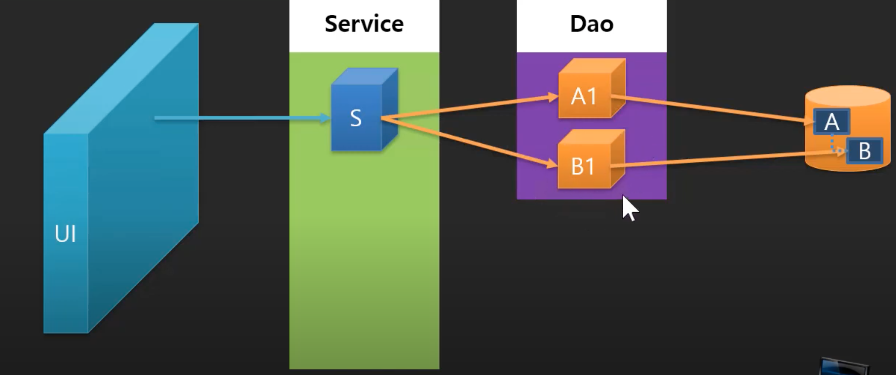

- B1의 수정이 필요함
  - B1의 소스코드를 구해서 수정한다? 재배포를 해야함.. 안좋은 방법임
  - B1은 그대로 두고, B2를 만들어서 덮어쓰기한다?
    - 이렇게 한다고해도 S를 수정해줘야함
    - 결합력이 높은 상태임

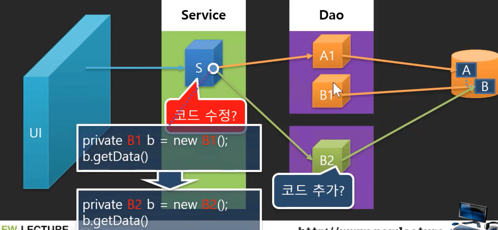

- 덮어쓰기를 하되, 수정하는 부분을 최소화하자
  - 소스코드없이 바꾸게 만들자 == 결합력을 낮추자
  - B라는 인터페이스를 사용하자
    - 참조형식 부분은 수정을 안해도 되도록 만들었음
  - 이제 객체타입도 B2로 바꿔야하는데 어떻게할 수 있을까?

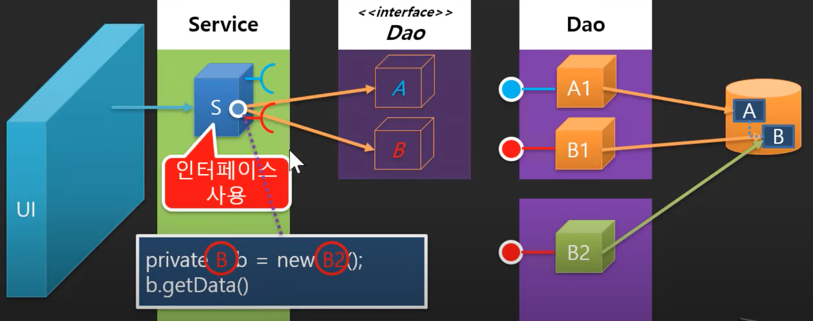

- 객체타입을 변경해서 갈아끼우는 작업을 UI에서 해주자
  - 소스코드 수정없이 가능하게 하기 위해서는 외부파일이나 외부설정을 사용해야함
  - 객체를 생성하는 부분을 비워두고, 외부파일이나 외부설정을 통해 변경될 수 있도록 만들자
  - 자바 객체지향 강의 33강 참고하기
    - https://www.youtube.com/watch?v=YZzpGtpW2h0&list=PLq8wAnVUcTFV4ZjRbyGnw6T1tgmYDLM3P&index=87

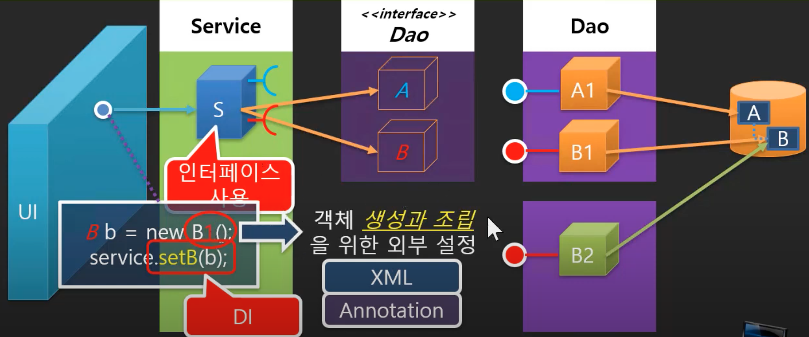

#### 결론

- 기업형 어플리테이션을 만들 때 다양한 레이어를 만들게 되고, 이것을 유지보수하게 됨
- 매번 소스코드를 열어서 수정하고 재배포하는 식의 유지보수는 위험부담이 있음
- 그래서 소스코드를 수정하는 방식보다는 대체하거나 추가하는 방식으로 유지보수를 하게 됨
- 그러기 위해서는 인터페이스와 설정파일이 필요함
  - 결합력을 낮추기 위한 방법임
- 스프링이 이런 것들을 도와줌
  - 결합할 때 필요한 설정파일을 제공
  - 객체를 결합해주는 역할을 함


## 3. DI(Dependency Injection)

### 스프링 프레임워크

#### 스프링 프레임워크 코어 기능: 종속 객체를 생성, 조립해주는 도구

- 스프링이 가지고 있는 가장 기본적인 능력은 무엇인가?
  - 객체를 생성해주고, 객체들을 조립해주는 능력
    - DI(Dependency Injection)
    - IoC Container

### Dependency들을 조립하기 - Dependecy를 부품으로 생각해보자

- Composition has a
  - 일체형
  - A가 생성될 떄, 부품인 B도 함께 생성됨
- Association has a
  - 조립형
  - A가 생성되더라도 B가 생성되지 않음
  - B는 외부에서 생성됨
  - 외부에서 생성된 객체를 셋팅해서 사용할 수 있음

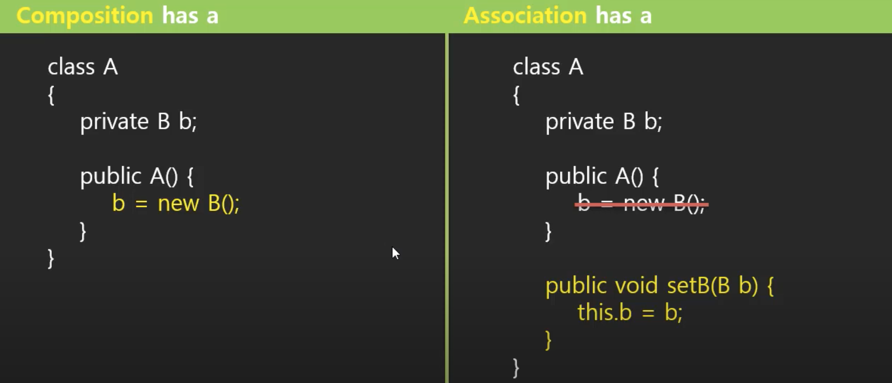

### DI(Dependency Injection)

#### Dependency

- 일체형보다는 조립형이 결합력을 낮춰주고, 부품을 쉽게 갈아끼울 수 있는 형태임
- 그래서 유지보수나 업데이트 등을 고려하는 기업형 어플리케이션에서는 조립형으로 많이 만듬
- Dependecy Injection을 사용했을 경우
  - 장점: 부품을 쉽게 바꿀 수 있음
  - 단점: 부품을 조립해야하는 번거로움이 있음
    - 누군가 부품을 대신 조립해주면 좋을텐데..
    - Spring이 그 역할을 해줌

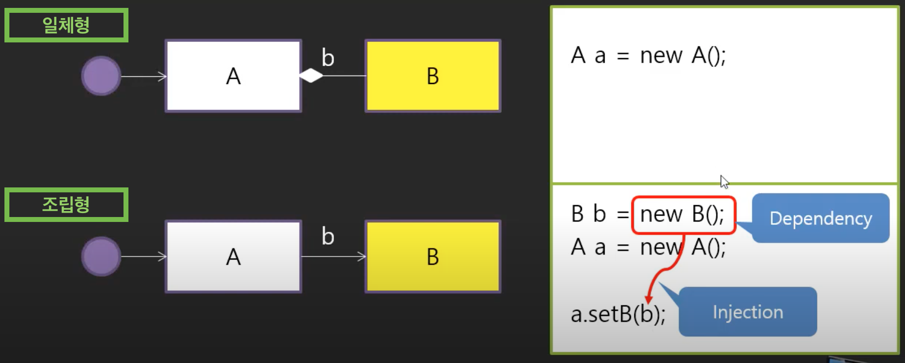

#### Injection - 조립하는 방법 두가지

- Setter Injection
- Construction Injection

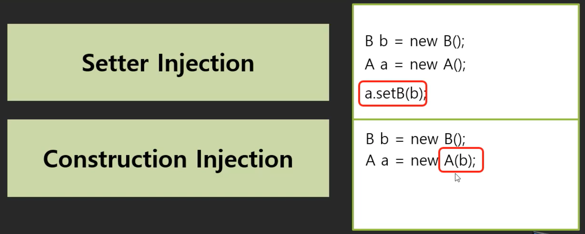

- 스프링은 객체 생성과 조립을 해줌
- 부품을 조립해주는 것이 Dependency Injection임
  - 원하는 부품들이 어떤것이 있고, 어떤 부품 결합을 하길 원하는지 설정을 해주면 스프링이 그런일을 해줌
  - 우리는 조립된 결과물을 가져다 쓰면 됨
- 객체를 조립해주기 위해서는 컨테이너가 필요한데, 그게 IoC Container임


## 4. IoC(Inversion of Control) 컨테이너

### DI(Dependency Injection)

- 부품을 조립해주는 능력
- 여러가지 부품들을 주문서에 적어서 스프링에게 제공해주어야함
- 스프링은 주문서를 보고 부품(객체)을 생성하고 조립함
- 어떤 부품이 필요하고 어떤 조립관계를 가져야하는지 명세화할 수 있어야함 - 두가지 방법
  - XML 파일
  - Annotation
- 주문서에 맞게 부품을 생성해서 담을 수 있는 공간이 필요함
  - IoC Container


### IoC(Inversion of Control) Container

- 왜 IoC라는 이름이 붙었나?
- 일체형의 경우, 큰 것이 조립되면 하위 부품들이 조립되는 순서
- 조립형의 경우, 작은 것부터 조립되고, 점점 커지는 순서
  - 조립까지해준다는 의미가 포함되어서, 순서가 역순이라는 의미로 IoC가 붙음

#### DI 순서

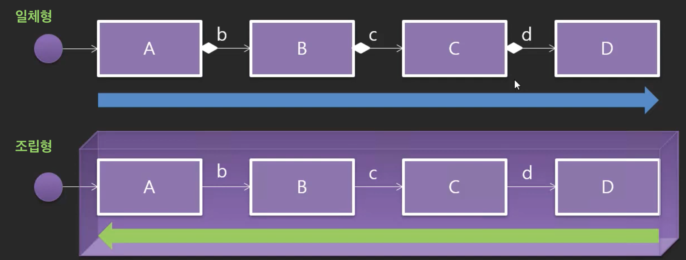


## 5. Dependecy를 직접 Injection하기

### DI를 스프링의 도움없이 직접 해보자

- Entity 인터페이스 Exam

```java
package spring.di.entity;

public interface Exam {
	int total();
	float avg();
}
```

- Exam을 실제 데이터 구조인 NewlecExam

```java
package spring.di.entity;

public class NewlecExam implements Exam {
	private int kor;
	private int eng;
	private int math;
	private int com;
	
	@Override
	public int total() {
		return kor+eng+math+com;
	}

	@Override
	public float avg() {
		return total() / 4.0f;
	}

}
```

- UI 인터페이스 ExamConsole

```java
package spring.di.ui;

public interface ExamConsole {
	void print();
}
```

- Console 방식 두가지

```java
package spring.di.ui;

import spring.di.entity.Exam;

public class InlineExamConsole implements ExamConsole {
	private Exam exam;
	
	public InlineExamConsole(Exam exam) {
		this.exam = exam;
	}

	@Override
	public void print() {
		System.out.printf("total is %d, avg is %f\n", exam.total(), exam.avg());
	}
}
```

```java
package spring.di.ui;

import spring.di.entity.Exam;

public class GridExamConsole implements ExamConsole {
	private Exam exam;
	
	public GridExamConsole(Exam exam) {
		this.exam = exam;
	}

	@Override
	public void print() {
		System.out.println("|---------|---------|");
		System.out.println("|  total  |   avg   |");
		System.out.println("|---------|---------|");
		System.out.printf("|  %3d  |   %3.2f   |\n", exam.total(), exam.avg());
		System.out.println("|---------|---------|");
	}
}
```

- Program
  - Console 방식을 선택해서 사용할 수 있음
  - Entity든 UI든 DI를 통해 선택적으로 사용할 수 있게 됨
  - 여기서 객체를 생성하고 DI하는 일을 스프링에게 맡기는 것

```java
package spring.di;

import spring.di.entity.Exam;
import spring.di.entity.NewlecExam;
import spring.di.ui.ExamConsole;
import spring.di.ui.GridExamConsole;
import spring.di.ui.InlineExamConsole;

public class Program {

	public static void main(String[] args) {
		
		Exam exam = new NewlecExam();
		ExamConsole console = new InlineExamConsole(exam); //DI
//		ExamConsole console = new GridExamConsole(exam);
		console.print();
	}
}
```


## 6. 스프링 DI 설정을 위해 이클립스 플러그인 설치하기

- 스프링에게 DI를 하도록 하기위해서는 지시서를 작성해서줘야하는데 이때 쓰는 방식이 XML 방식과 Annotation방식이 있음
- 일단 XML방식부터 해보자

### 설정 파일

- 이런 식으로 스프링이 알아보도록 써줘야하는데 이걸 다 일일히 써주는 것은 비효율적임
- 이런부분을 지원해주는 플러그인을 사용하자

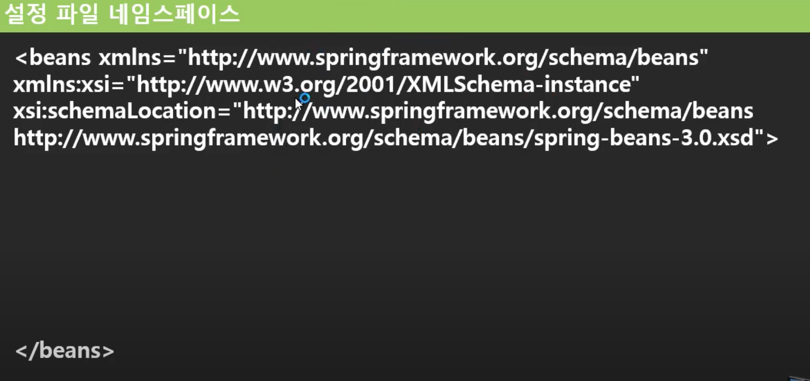

### 플러그인 설치

- 이클립스 마켓플레이스

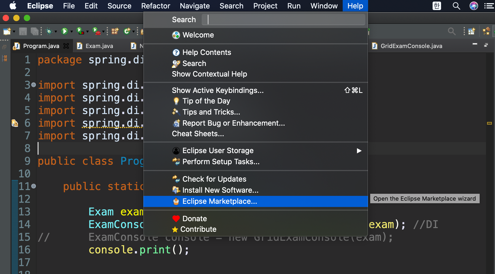

- Spring Tools 3 설치
  - Spring Tools 4는 스프링 부트를 기반으로하는 새로운 툴인데 여기서는 스프링을 중심으로하기 때문에 일단 3을 설치하자

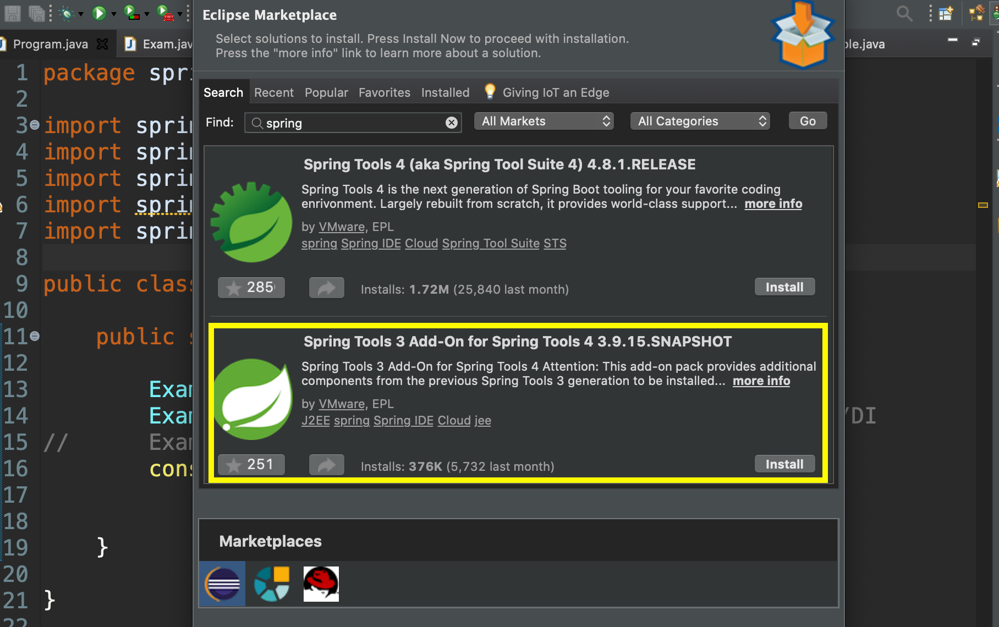

- 설치 과정에서 오류가 나서 구글링을 통해 해결
  - 이클립스 버전에 따른 오류가 있었던 거 같음
  - https://impact-ko.tistory.com/20

- Spring을 사용하는데 이클립스와 메이븐만으로도 충분히 만들 수는 있음
  - 다만, 설정파일 관련한 불편함을 줄이기 위해 플러그인을 설치하는 것

- 설치완료 후, 이클립스 재시작
- setting.xml를 생성해보자


- setting.xml
  - 자동으로 만들어줌

```xml
<?xml version="1.0" encoding="UTF-8"?>
<beans xmlns="http://www.springframework.org/schema/beans"
	xmlns:xsi="http://www.w3.org/2001/XMLSchema-instance"
	xsi:schemaLocation="http://www.springframework.org/schema/beans http://www.springframework.org/schema/beans/spring-beans.xsd">


</beans>

```


## 7. 스프링 DI 지시서 작성하기(Spring Bean Configuration)

- Program.java
  - Exam이 ExamConsole의 부품이라고 할 수 있고, DI를 통해서 조립을 해주는 것
  - DI 방법에는 생성자를 통한 방법과 setter를 이용한 방법이 있음
  - 일단 setter를 이용하는 방법부터, 스프링에서 설정하는 방법에 대해 알아보자

```java
package spring.di;

import spring.di.entity.Exam;
import spring.di.entity.NewlecExam;
import spring.di.ui.ExamConsole;
import spring.di.ui.GridExamConsole;
import spring.di.ui.InlineExamConsole;

public class Program {

	public static void main(String[] args) {
		
		Exam exam = new NewlecExam();
		
		//DI
		// 1.생성자를 사용한 DI
//		ExamConsole console = new InlineExamConsole(exam);
//		ExamConsole console = new GridExamConsole(exam);
		
		// 2.setter를 이용한 DI
//		ExamConsole console = new InlineExamConsole();
		ExamConsole console = new GridExamConsole();
		console.setExam(exam);
		
		
		console.print();
	}
}
```

### 지시서 작성하기

- Program.java
  - 객체를 생성하고 조립하는 것을 지시서에 작성하자
  - 지시서를 작성하고나면 이 지시서를 스프링에게 전달할 주체가 필요함
    - 다음 챕터에서 알아보자

```java
package spring.di;

import spring.di.entity.Exam;
import spring.di.entity.NewlecExam;
import spring.di.ui.ExamConsole;
import spring.di.ui.GridExamConsole;
import spring.di.ui.InlineExamConsole;

public class Program {

	public static void main(String[] args) {
		
		/* 스프링에게 지시하는 방법으로 코드를 변경
		Exam exam = new NewlecExam();
		ExamConsole console = new GridExamConsole();
		
		console.setExam(exam);
		*/

		ExamConsole console = ?;
		console.print();

	}
}
```

- setting.xml
  - 세팅해주는 부분의 setExam(exam)은
  - property태그로 나타내는데, 이때 name 속성의 값은 매개변수인 exam이 아니라, setExam에서 set을 떼어내고 소문자로 바꿔서 적어주는 것임
  - value와 ref 두개의 속성이 더 있는데, 이때 넘기는 매개변수가 값 타입(int, char, boolean ... )인지 참조 타입인지에 따라 배타적으로 쓰여짐
    - 여기서는 exam이 객체, 즉, 참조 타입이기 때문에 ref를 사용

```xml
<?xml version="1.0" encoding="UTF-8"?>
<beans xmlns="http://www.springframework.org/schema/beans"
	xmlns:xsi="http://www.w3.org/2001/XMLSchema-instance"
	xsi:schemaLocation="http://www.springframework.org/schema/beans http://www.springframework.org/schema/beans/spring-beans.xsd">
	<!-- Exam exam = new NewlecExam(); -->
	<bean id="exam" class="spring.di.entity.NewlecExam" />
	<!-- ExamConsole console = new GridExamConsole(); -->
	<bean id="console" class="spring.di.ui.GridExamConsole">
		<!-- console.setExam(exam); -->
		<!-- name ==> {setExam -> Exam -> exam} -->
		<property name="exam" ref="exam" />
	</bean>
	
	
</beans>

```


## 8. 스프링 IoC 컨테이너 사용하기(ApplicationContext 이용하기)

### Application Context

- 스프링에서 DI 또는 지시서를 읽어서 객체를 생성해주고 조립해주는 스프링의 구체적인 객체이름은 ApplicationContext
- ApplicationContext는 인터페이스명이고, 실질적으로 이 인터페이스를 구현하고 있는 여러가지 클래스들이 있음
- 그 중 대표적인 것이 ClassPathXmlApplicationContext임
- 각 클래스들의 차이
  - 지시서를 넘길 때, 그 지시서의 위치를 어떻게 알려주냐에 따라 다름
  - ClassPathXmlApplicationContext: 
    - 어플리케이션의 루트로부터 경로를 지정하고 싶을 경우
  - FileSystemXmlApplicationContext: 
    - C드라이브의 어디에.., D드라이브 어디에.. 처럼 현재 파일 시스템의 경로를 이용할 경우
  - XmlWebApplicationContext: 
    - web에 둬서 url을 통해서 지정하는 경우
  - AnnotationConfigAppicationContext:
    - 파일로 두는 것이 아니라 annotation으로 두었기 때문에 스캔하는 방법을 씀
    - 다음에 더 자세히 알아보자

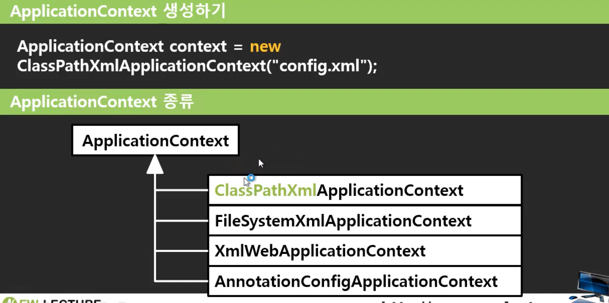

### ApplicationContext를 사용하기 위해서 스프링 관련 라이브러리 받기

- 직접 다운받아도되지만, 메이븐이라는 빌드 툴을 배웠으니까 메이븐 프로젝트로 변경해서 dependency를 추가해주는 식으로 하자

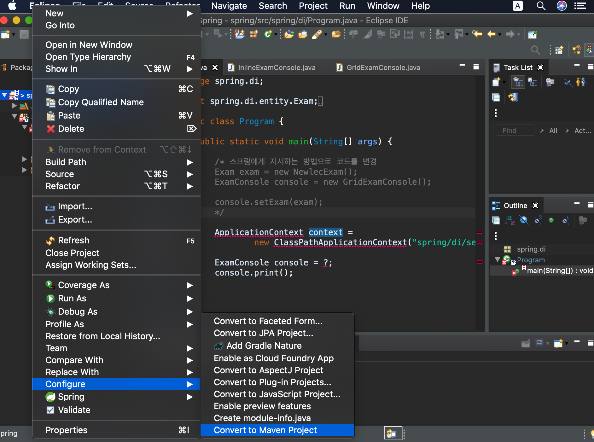

- dependency를 추가하려면 메이븐 원격 저장소에 있는 라이브러리들을 로컬로 가져와야하는데, 이때 시간이 많이 걸림..
  - 일단은 직접 메이븐 레파지토리에 가서 필요한 라이브러리만 받아서 pom파일에 추가해주자
  - https://mvnrepository.com/artifact/org.springframework/spring-context/5.1.19.RELEASE

- pom.xml

```xml
<project xmlns="http://maven.apache.org/POM/4.0.0" xmlns:xsi="http://www.w3.org/2001/XMLSchema-instance" xsi:schemaLocation="http://maven.apache.org/POM/4.0.0 https://maven.apache.org/xsd/maven-4.0.0.xsd">
  <modelVersion>4.0.0</modelVersion>
  <groupId>com.newlecture</groupId>
  <artifactId>spring</artifactId>
  <version>0.0.1-SNAPSHOT</version>
  
  <dependencies>
  <!-- https://mvnrepository.com/artifact/org.springframework/spring-context -->
	<dependency>
	    <groupId>org.springframework</groupId>
	    <artifactId>spring-context</artifactId>
	    <version>5.1.19.RELEASE</version>
	</dependency>
  </dependencies>
  
  <build>
    <sourceDirectory>src</sourceDirectory>
    <resources>
      <resource>
        <directory>src</directory>
        <excludes>
          <exclude>**/*.java</exclude>
        </excludes>
      </resource>
    </resources>
    <plugins>
      <plugin>
        <artifactId>maven-compiler-plugin</artifactId>
        <version>3.8.1</version>
        <configuration>
          <release>11</release>
        </configuration>
      </plugin>
    </plugins>
  </build>
</project>
```

- Program.java
  - 이제 스프링이 작업지시서를 보고 객체를 생성하고 조립한 다음에 IoC 컨테이너에 넣어둠
  - IoC 컨테이너에 있는 객체들을 꺼내쓰면 되는데, 꺼내는 방법 두가지가 있음
  - 객체명(console)으로 꺼낼 수도 있고, 타입명(ExamConsole)으로 꺼낼 수도 있음

```java
package spring.di;

import org.springframework.context.ApplicationContext;
import org.springframework.context.support.ClassPathXmlApplicationContext;

import spring.di.entity.Exam;
import spring.di.entity.NewlecExam;
import spring.di.ui.ExamConsole;
import spring.di.ui.GridExamConsole;
import spring.di.ui.InlineExamConsole;

public class Program {

	public static void main(String[] args) {
		
		/* 스프링에게 지시하는 방법으로 코드를 변경
		Exam exam = new NewlecExam();
		ExamConsole console = new GridExamConsole();
		
		console.setExam(exam);
		*/
		
		ApplicationContext context = 
				new ClassPathXmlApplicationContext("spring/di/setting.xml");
		
		// 객체명 방법
//		ExamConsole console = (ExamConsole) context.getBean("console");
		// 타입명 방법 - 좀 더 선호됨
		ExamConsole console = context.getBean(ExamConsole.class);
		
		console.print();

	}
}
```

- setting.xml를 수정하면 실행 결과가 달라짐

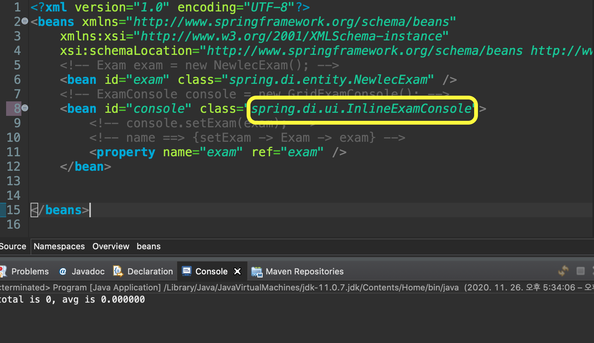

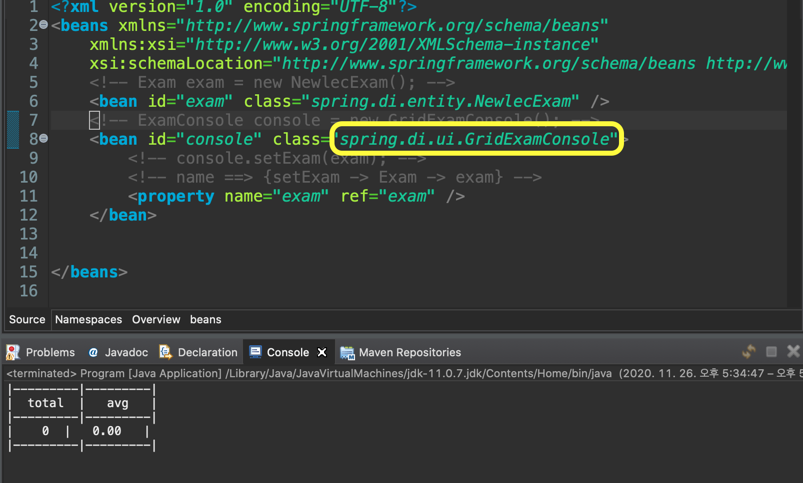


## 9. 값 형식 DI

### 값 형식의 속성에 값 설정하기

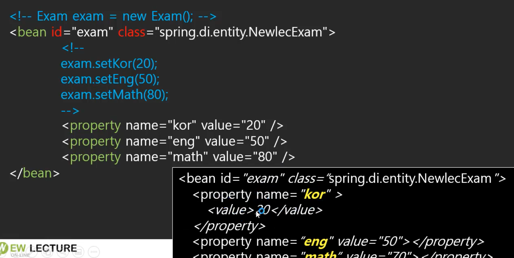

- NewlecExam.java에서 각 멤버변수에 해당하는 getter와 setter를 추가해주자
- setting.xml
  - 이렇게 값을 넣는것은 setter를 사용하는 것
  - 밑에처럼 value태그를 따로 써주거나 property 태그 내에 속성으로 넣는 방식이 있음

```xml
<?xml version="1.0" encoding="UTF-8"?>
<beans xmlns="http://www.springframework.org/schema/beans"
	xmlns:xsi="http://www.w3.org/2001/XMLSchema-instance"
	xsi:schemaLocation="http://www.springframework.org/schema/beans http://www.springframework.org/schema/beans/spring-beans.xsd">
	<!-- Exam exam = new NewlecExam(); -->
	<bean id="exam" class="spring.di.entity.NewlecExam">
		<property name="kor">
			<value>10</value>
		</property>
		<property name="eng" value="10" />
		<property name="math" value="10" />
		<property name="com" value="10" />
	</bean>
	<!-- ExamConsole console = new GridExamConsole(); -->
	<bean id="console" class="spring.di.ui.InlineExamConsole">
		<!-- console.setExam(exam); -->
		<!-- name ==> {setExam -> Exam -> exam} -->
		<property name="exam" ref="exam" />
	</bean>
	
	
</beans>

```


## 10. 생성자 DI

### Dependency 객체 생성과 초기화

#### Exam 객체 constructor를 이용한 속성 값 설정

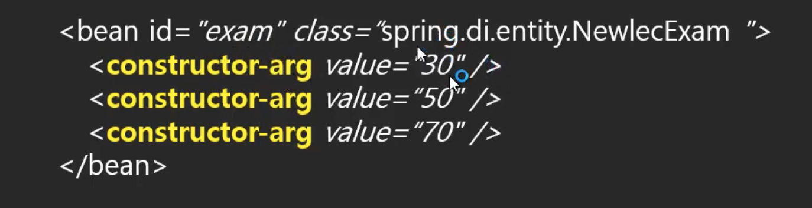

- NewlecExam.java
  - 생성자 및 toString 생성

```java
package spring.di.entity;

public class NewlecExam implements Exam {
	
	private int kor;
	private int eng;
	private int math;
	private int com;
	
	public NewlecExam() {
	}
	
	public NewlecExam(int kor, int eng, int math, int com) {
		this.kor = kor;
		this.eng = eng;
		this.math = math;
		this.com = com;
	}

	public int getKor() {
		return kor;
	}

	public void setKor(int kor) {
		this.kor = kor;
	}

	public int getEng() {
		return eng;
	}

	public void setEng(int eng) {
		this.eng = eng;
	}

	public int getMath() {
		return math;
	}

	public void setMath(int math) {
		this.math = math;
	}

	public int getCom() {
		return com;
	}

	public void setCom(int com) {
		this.com = com;
	}

	@Override
	public int total() {
		return kor+eng+math+com;
	}

	@Override
	public float avg() {
		return total() / 4.0f;
	}

	@Override
	public String toString() {
		return "NewlecExam [kor=" + kor + ", eng=" + eng + ", math=" + math + ", com=" + com + "]";
	}

}
```

- Program.java

```java
package spring.di;

import org.springframework.context.ApplicationContext;
import org.springframework.context.support.ClassPathXmlApplicationContext;

import spring.di.entity.Exam;
import spring.di.entity.NewlecExam;
import spring.di.ui.ExamConsole;
import spring.di.ui.GridExamConsole;
import spring.di.ui.InlineExamConsole;

public class Program {

	public static void main(String[] args) {
		
		ApplicationContext context = 
				new ClassPathXmlApplicationContext("spring/di/setting.xml");
		
    // exam 객체도 가져와서 toString을 통해 설정된 값을 확인해보자
		Exam exam = context.getBean(Exam.class);
		System.out.println(exam.toString());

		ExamConsole console = context.getBean(ExamConsole.class);
		
		console.print();
		
		
	}

}

```

- 생성자를 이용해서 DI하는 경우의 setting.xml

```xml
<?xml version="1.0" encoding="UTF-8"?>
<beans xmlns="http://www.springframework.org/schema/beans"
	xmlns:xsi="http://www.w3.org/2001/XMLSchema-instance"
	xsi:schemaLocation="http://www.springframework.org/schema/beans http://www.springframework.org/schema/beans/spring-beans.xsd">
	<!-- Exam exam = new NewlecExam(); -->
	<bean id="exam" class="spring.di.entity.NewlecExam">
		<constructor-arg value="10"/>
		<constructor-arg value="20"/>
		<constructor-arg value="30"/>
		<constructor-arg value="40"/>
	</bean>
	<!-- ExamConsole console = new GridExamConsole(); -->
	<bean id="console" class="spring.di.ui.InlineExamConsole">
		<!-- console.setExam(exam); -->
		<!-- name ==> {setExam -> Exam -> exam} -->
		<property name="exam" ref="exam" />
	</bean>
	
	
</beans>

```

- 매개변수를 index로 받을 수도 있음

```java
<bean id="exam" class="spring.di.entity.NewlecExam">
		<constructor-arg index="0" value="10"/>
		<constructor-arg index="1" value="20"/>
		<constructor-arg index="2" value="30"/>
		<constructor-arg index="3" value="40"/>
</bean>
```

- 매개변수를 변수명으로 받을 수도 있음
  - 이렇게 하니까 매개변수의 타입이 다르고 변수명이 같은 오버로드 생성자들의 경우, 모호해짐 

```java
<bean id="exam" class="spring.di.entity.NewlecExam">
		<constructor-arg name="kor" value="10"/>
		<constructor-arg name="eng" value="20"/>
		<constructor-arg name="com" value="30"/>
		<constructor-arg name="math" value="40"/>
</bean>
```

#### 생성자 호출의 모호한 매개변수

- 타입도 속성으로 넣을 수가 있음
- 그런데 이렇게 하니까 태그가 좀 복잡해보임

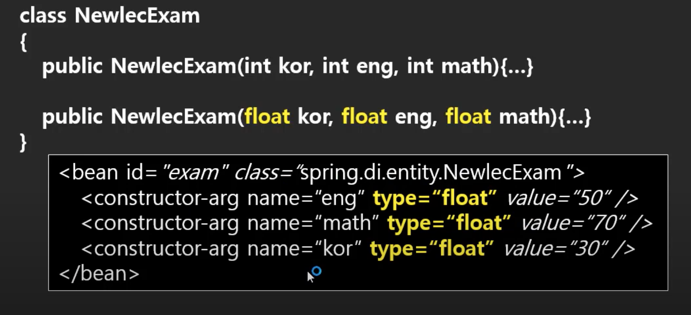

- 이러한 부분을 해결할 수 있는 방법이 있음

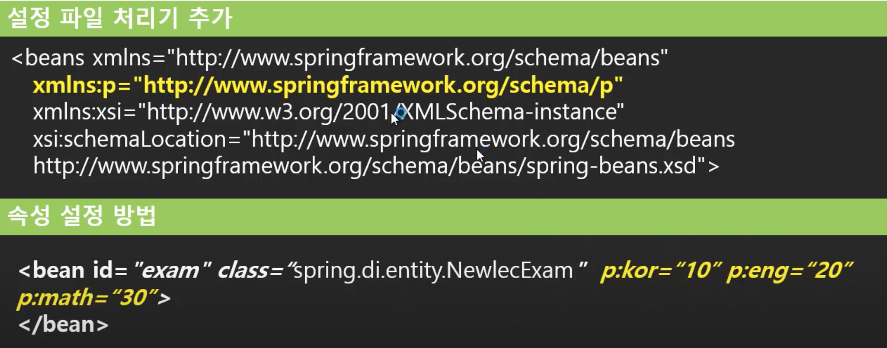

- Namespace : p 추가
  - namespace의 두가지 의미
    - 해당 태그가 특정한 처리기에 의해서 실행될 수 있도록 특정짓기 위해서 사용함
    - 태그의 이름을 식별하기 위해서 써주는 것
  - 속성이나 태그 앞에 접두사를 붙여서 식별하고, 특정 처리기가 처리할 수 있도록해주는 것
- setting.xml

```xml
<?xml version="1.0" encoding="UTF-8"?>
<beans xmlns="http://www.springframework.org/schema/beans"
	xmlns:xsi="http://www.w3.org/2001/XMLSchema-instance"
	xmlns:p="http://www.springframework.org/schema/p"
	xsi:schemaLocation="http://www.springframework.org/schema/beans http://www.springframework.org/schema/beans/spring-beans.xsd">
	<bean id="exam" class="spring.di.entity.NewlecExam" p:kor="10" p:eng="10" />
	<bean id="console" class="spring.di.ui.InlineExamConsole">
		<property name="exam" ref="exam" />
	</bean>

</beans>
```

- 결과

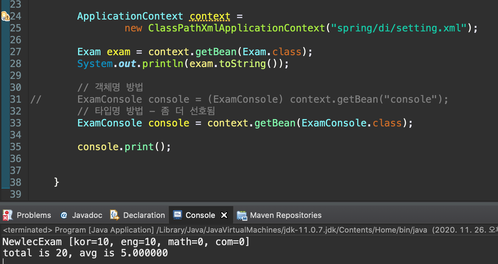


## 참고

- 유튜브 채널 - 뉴렉처
  - 스프링 프레임워크 강좌/강의
  - https://www.youtube.com/watch?v=XtXHIDnzS9c&list=PLq8wAnVUcTFUHYMzoV2RoFoY2HDTKru3T

