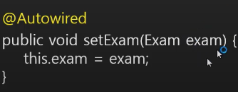
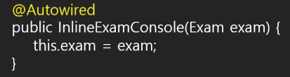
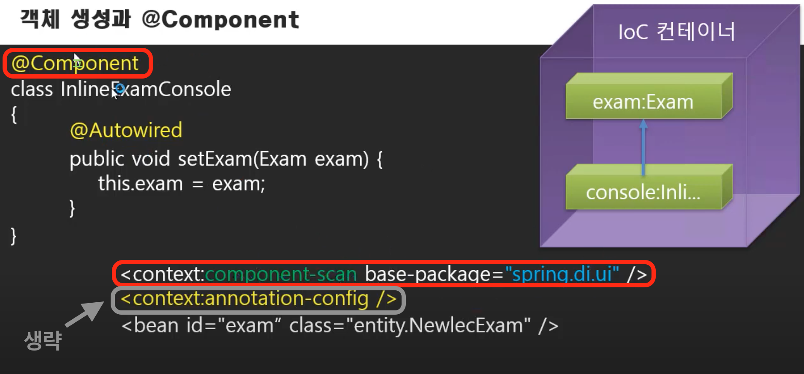
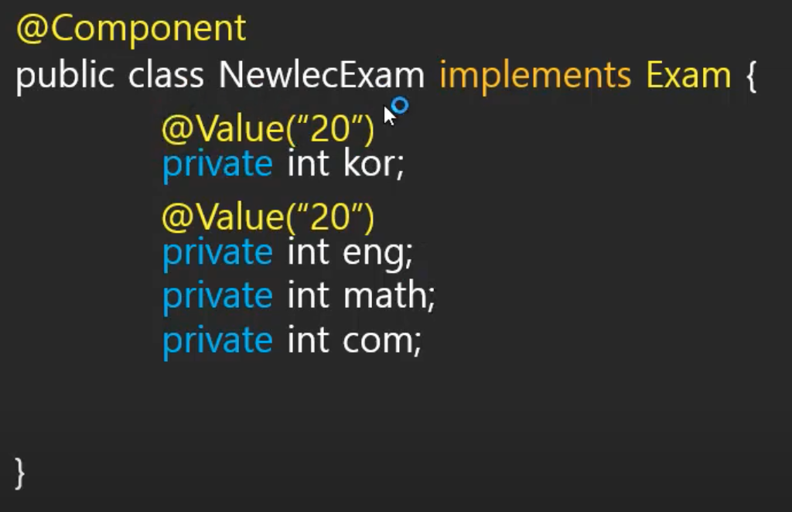
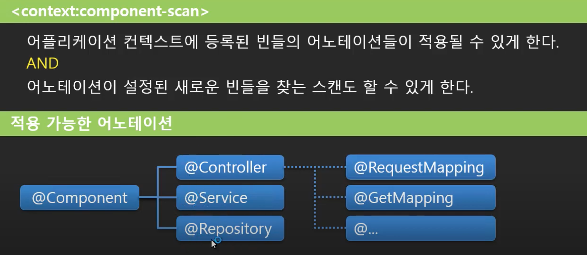
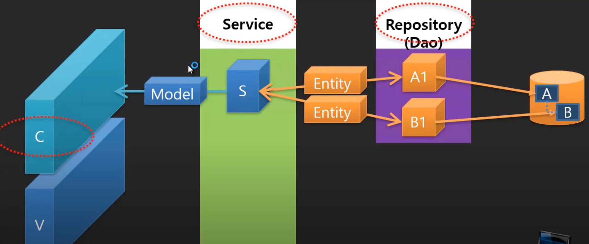
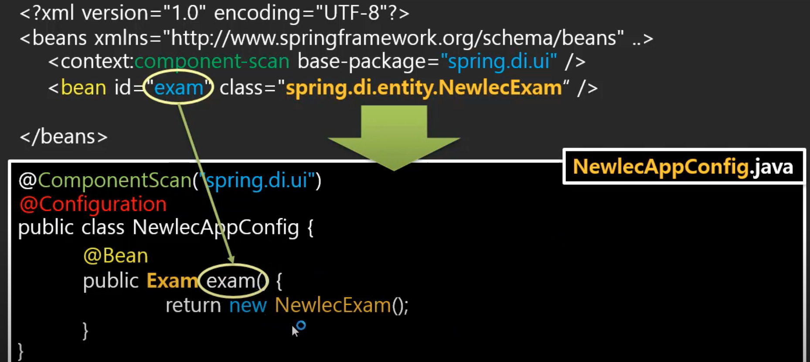
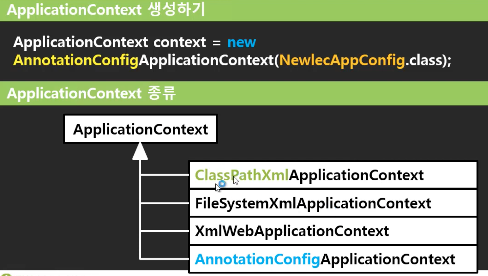
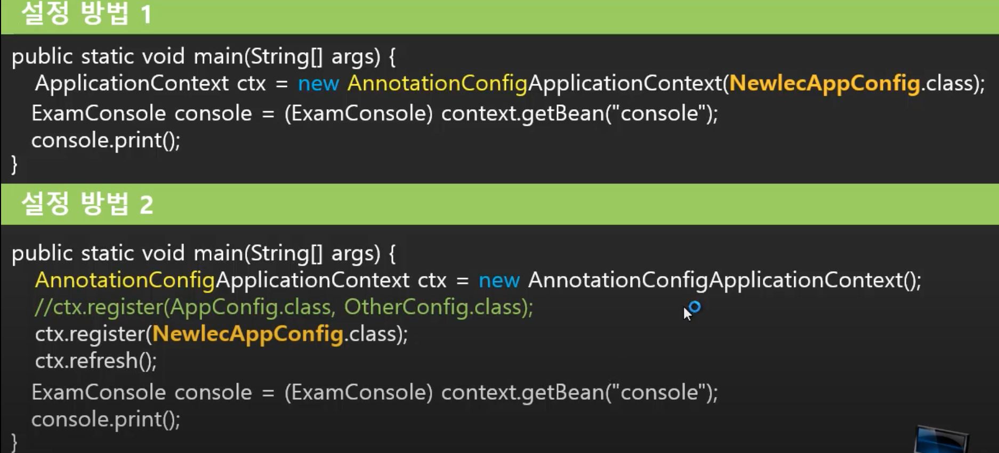

# Spring Framework and Boot 학습 2 - DI


## 11. 콜렉션 생성과 목록 DI

- 콜렉션 생성과 콜렉션에 객체를 참조시키는 초기화 작업을 어떻게 DI할 것인가 알아보자
- Program.java

```java
package spring.di;

import java.util.ArrayList;
import java.util.List;

import org.springframework.context.ApplicationContext;
import org.springframework.context.support.ClassPathXmlApplicationContext;

import spring.di.entity.Exam;
import spring.di.entity.NewlecExam;
import spring.di.ui.ExamConsole;
import spring.di.ui.GridExamConsole;
import spring.di.ui.InlineExamConsole;

public class Program {

	public static void main(String[] args) {
		
		ApplicationContext context = 
				new ClassPathXmlApplicationContext("spring/di/setting.xml");
		
		Exam exam = context.getBean(Exam.class);
		System.out.println(exam.toString());
		
		ExamConsole console = context.getBean(ExamConsole.class);
		console.print();
		
    // List 생성
		List<Exam> exams = (List<Exam>) context.getBean("exams"); //new ArrayList<>();
    // List에 객체 추가
//		exams.add(new NewlecExam(1,1,1,1));
		
		for(Exam e : exams) {
			System.out.println(e);
		}
	}
}

```

- setting.xml
- namespace를 사용하지 않은 방법

```xml
<?xml version="1.0" encoding="UTF-8"?>
<beans xmlns="http://www.springframework.org/schema/beans"
	xmlns:xsi="http://www.w3.org/2001/XMLSchema-instance"
	xmlns:p="http://www.springframework.org/schema/p"
	xsi:schemaLocation="http://www.springframework.org/schema/beans http://www.springframework.org/schema/beans/spring-beans.xsd
		http://www.springframework.org/schema/util http://www.springframework.org/schema/util/spring-util-4.3.xsd">
	<bean id="exam" class="spring.di.entity.NewlecExam" p:kor="10" p:eng="10" />
	<bean id="console" class="spring.di.ui.InlineExamConsole">
		<property name="exam" ref="exam" />
	</bean>
	
  <!-- ArrayList 객체 생성, 생성자로 collection을 넘기는 방식 -->
	<bean id="exams" class="java.util.ArrayList">
		<constructor-arg>
			<list>
        <!-- id는 따로 안적음 -->
				<bean class="spring.di.entity.NewlecExam" p:kor="1" p:eng="1" />
        <!-- 이렇게 id로 참조하는 방법도 있음 -->
				<ref bean="exam"/>
			</list>
		</constructor-arg>
	</bean> 
	
</beans>

```

- namespace를 사용하는 방법
  - xmlns:util 사용

```xml
<?xml version="1.0" encoding="UTF-8"?>
<beans xmlns="http://www.springframework.org/schema/beans"
	xmlns:xsi="http://www.w3.org/2001/XMLSchema-instance"
	xmlns:p="http://www.springframework.org/schema/p"
	xmlns:util="http://www.springframework.org/schema/util"
	xsi:schemaLocation="http://www.springframework.org/schema/beans http://www.springframework.org/schema/beans/spring-beans.xsd
		http://www.springframework.org/schema/util http://www.springframework.org/schema/util/spring-util-4.3.xsd">
	<bean id="exam" class="spring.di.entity.NewlecExam" p:kor="10" p:eng="10" />
	<bean id="console" class="spring.di.ui.InlineExamConsole">
		<property name="exam" ref="exam" />
	</bean>
	<!-- namespace를 사용-->
	<util:list id="exams" list-class="java.util.ArrayList">
		<bean class="spring.di.entity.NewlecExam" p:kor="1" p:eng="1" />
		<ref bean="exam"/>
	</util:list>
	
</beans>

```


## 12. 어노테이션을 이용할 때의 장점과 @Autowired를 이용한 DI 해보기

- 어플리케이션을 만들 때, 초기화 설정을 만드는 방법에는 두가지가 있음
  - 첫번째
    - xml을 사용해서 외부에 설정정보를 두는 방법
  - 두번째
    - 어노테이션이라는 방법으로, 코드파일에 설정정보를 심는 방법
    - 코드파일에 심은 설정정보를 어노테이션이라고 함
- 어노테이션을 이용했을 때의 장점에 대해 알아보고 DI하는 부분을 어노테이션으로 바꿔보자

### 스프링 어노테이션


### Annotation으로 설정할 때의 장점

#### XML로 설정할 때의 모듈 변경 방법

- 외부파일을 통해 B2를 DI했음


- B3로 대체해야하는 상황


- 외부파일을 수정해주어야함
  - 외부파일을 수정해주는 작업도 없애고 싶어서 어노테이션이 나옴


#### Annotation으로 설정할 때의 모듈 변경 방법

- B2 클래스 코드에 @Component라는 어노테이션을 달아두면 스프링이 읽고 객체로 만들어줌


- B2를 없애고, B3에 어노테이션을 달고 도킹해주는 어노테이션(@Autowired)까지 달면 대체가 됨
  - 다른 외부파일을 손대거나 할 필요가 없어짐


### DI 지원을 위한 스프링 어노테이션

#### @Autowired 어노테이션


- Program.java

```java
package spring.di;

import java.util.ArrayList;
import java.util.List;

import org.springframework.context.ApplicationContext;
import org.springframework.context.support.ClassPathXmlApplicationContext;

import spring.di.entity.Exam;
import spring.di.entity.NewlecExam;
import spring.di.ui.ExamConsole;
import spring.di.ui.GridExamConsole;
import spring.di.ui.InlineExamConsole;

public class Program {

	public static void main(String[] args) {
		
		ApplicationContext context = 
				new ClassPathXmlApplicationContext("spring/di/setting.xml");
		
		ExamConsole console = context.getBean(ExamConsole.class);
		console.print();
	}
}
```

- setting.xml
  - console에 exam을 DI하는 부분 없앰
  - 스프링이 이 파일을 읽다가 객체를 생성하면 그 클래스로 가서 @Autowired가 있는지 확인할 수 있도록 namespace사용
    - xmlns:context
    - <context:annotation-config /> 추가

```xml
<?xml version="1.0" encoding="UTF-8"?>
<beans xmlns="http://www.springframework.org/schema/beans"
	xmlns:xsi="http://www.w3.org/2001/XMLSchema-instance"
	xmlns:p="http://www.springframework.org/schema/p"
	xmlns:util="http://www.springframework.org/schema/util"
	xmlns:context="http://www.springframework.org/schema/context"
	xsi:schemaLocation="http://www.springframework.org/schema/beans http://www.springframework.org/schema/beans/spring-beans.xsd
		http://www.springframework.org/schema/context http://www.springframework.org/schema/context/spring-context-4.3.xsd
		http://www.springframework.org/schema/util http://www.springframework.org/schema/util/spring-util-4.3.xsd">
	
	<context:annotation-config />
	<bean id="exam" class="spring.di.entity.NewlecExam" p:kor="10" p:eng="10" />
	<bean id="console" class="spring.di.ui.InlineExamConsole">
		<!-- <property name="exam" ref="exam" /> -->
	</bean>
	
	<util:list id="exams" list-class="java.util.ArrayList">
		<bean class="spring.di.entity.NewlecExam" p:kor="1" p:eng="1" />
		<ref bean="exam"/>
	</util:list>
	
</beans>

```

- InlineExamConsole.java
  - setExam에 @Autowired 달아주기
  - 그런데 어노테이션을 달아주기만 했을 뿐인데 넘겨지는 값에 대한 정보는 어떻게 알아서 처리해주는 건가?

```java
package spring.di.ui;

import org.springframework.beans.factory.annotation.Autowired;

import spring.di.entity.Exam;

public class InlineExamConsole implements ExamConsole {
	
	private Exam exam;
	
	public InlineExamConsole() {
	}
	
	public InlineExamConsole(Exam exam) {
		this.exam = exam;
	}

	@Override
	public void print() {
		System.out.printf("total is %d, avg is %f\n", exam.total(), exam.avg());

	}

	@Autowired
	@Override
	public void setExam(Exam exam) {
		this.exam = exam;
		
	}

}

```


## 13. @Autowired의 동작방식 이해와 @Qualifier 사용하기

### 객체 생성과 Autowired

- xml에서 객체를 생성하고 Autowired를 사용해서 DI도 해줬음
- 그런데 어떤 객체와 DI해야하는지를 어떻게 스프링이 알아서 해주는건가?


- InlineExamConsole.java
  - 기본적으로 매개변수로 들어오는 객체의 자료형에 맞춰서 받아옴
  - 여기서는 Exam 타입이기 때문에 이 인터페이스를 상속하는 NewlecExam 객체를 받아옴

```java
@Autowired
@Override
public void setExam(Exam exam) {
  this.exam = exam;

}
```

- NewlecExam객체가 한 개인 setting.xml
  - 객체의 타입으로 가져오는 것이기 때문에 id값이 다르거나 없어도 인식할 수 있음
  - 단, 똑같은 타입의 객체가 여러개라면 오류가 발생함

```xml
<bean id="exam1" class="spring.di.entity.NewlecExam" p:kor="10" p:eng="10" />
```

- NewlecExam객체가 여러개인 setting.xml
  - 이 경우에는 매개변수명으로 찾아올 수 있음

```xml
<bean id="exam" class="spring.di.entity.NewlecExam" p:kor="10" p:eng="10" />
<bean id="exam1" class="spring.di.entity.NewlecExam" p:kor="20" p:eng="20" />
```

- 그런데 이렇게 이름이 전부 틀릴 경우에는 어떻게 해야하나?
  - setter의 매개변수명을 변경하는 것은 바람직하지 않음
  - @Qualifier 어노테이션을 사용해야함

```xml
<bean id="exam1" class="spring.di.entity.NewlecExam" p:kor="10" p:eng="10" />
<bean id="exam2" class="spring.di.entity.NewlecExam" p:kor="20" p:eng="20" />
```

- InlineExamConsole.java

```java
@Autowired
@Qualifier("exam2")
@Override
public void setExam(Exam exam) {
  this.exam = exam;

}
```

### 정리

- 자료형식을 기본으로하되, 식별이 모호할 경우에는 자료명도 사용함
- 자료명에 맞춰서 매개변수명을 바꾸는건 바람직하지 않음
- @Qualifier를 사용해서 식별할 수 있도록 하자


## 14. @Autowired의 위치와 Required 옵션

### Injection 방법 3가지

#### setter위에 두는 방법



```java
@Autowired
@Qualifier("exam2")
@Override
public void setExam(Exam exam) {
  System.out.println("setter");
  this.exam = exam;
}
```

#### 오버로드 생성자 위에 두는 방법

- 오버로드 생성자의 경우에는 매개변수로 여러개의 Exan이 있을 수도 있기 때문에 각 매개변수마다 @Qualifier 어노테이션을 달아줘야함



```java
@Autowired
public InlineExamConsole(@Qualifier("exam2") Exam exam) {
  System.out.println("overloaded constructor");
  this.exam = exam;
}
```

#### 필드 위에 두는 법

- 오버로드 생성자가 아니라 기본 생성자에서 객체를 생성하는 형태
- 이 경우에는 오버로드 생성자만 있을 경우엔 오류가 뜸
  - 기본 생성자가 자동으로 만들어지지 않기 때문임
  - 기본 생성자와 오버로드 생성자 모두 직접 만들지 않으면 기본 생성자가 자동으로 만들어지기 때문에 정상 작동함


```java
@Autowired
@Qualifier("exam2")
private Exam exam;

public InlineExamConsole() {
  System.out.println("constructor");
}

public InlineExamConsole(Exam exam) {
  System.out.println("overloaded constructor");
  this.exam = exam;
}
```

### Required 옵션

- 객체가 만들어지지 않은 경우에도 정상작동할 수 있도록 하기 위한 옵션
- setting.xml
  - Exam 객체들이 없는 상태

```java
<?xml version="1.0" encoding="UTF-8"?>
<beans xmlns="http://www.springframework.org/schema/beans"
	xmlns:xsi="http://www.w3.org/2001/XMLSchema-instance"
	xmlns:p="http://www.springframework.org/schema/p"
	xmlns:util="http://www.springframework.org/schema/util"
	xmlns:context="http://www.springframework.org/schema/context"
	xsi:schemaLocation="http://www.springframework.org/schema/beans http://www.springframework.org/schema/beans/spring-beans.xsd
		http://www.springframework.org/schema/context http://www.springframework.org/schema/context/spring-context-4.3.xsd
		http://www.springframework.org/schema/util http://www.springframework.org/schema/util/spring-util-4.3.xsd">
	
	<context:annotation-config />
	<bean id="console" class="spring.di.ui.InlineExamConsole">
	</bean>

</beans>

```

- InlineExamConsole.java

```java
package spring.di.ui;

import org.springframework.beans.factory.annotation.Autowired;
import org.springframework.beans.factory.annotation.Qualifier;

import spring.di.entity.Exam;

public class InlineExamConsole implements ExamConsole {
	
	@Autowired(required = false)
	@Qualifier("exam2")
	private Exam exam;
	
	public InlineExamConsole() {
		System.out.println("constructor");
	}

	public InlineExamConsole(Exam exam) {
		System.out.println("overloaded constructor");
		this.exam = exam;
	}

	@Override
	public void print() {
		if(exam == null) {
			System.out.printf("total is %d, avg is %f\n", 0, 0.0);
		} else {
			System.out.printf("total is %d, avg is %f\n", exam.total(), exam.avg());			
		}

	}

	@Override
	public void setExam(Exam exam) {
		System.out.println("setter");
		this.exam = exam;
		
	}

}
```

- 결과

```txt
constructor
total is 0, avg is 0.000000

```


## 15. 어노테이션을 이용한 객체생성

### 객체 생성과 @Component

- setting.xml에서 객체 생성하는 부분을 없애는 대신에, 어노테이션을 통해 객체를 생성한다는 것을 알려줘야함
- 이때 클래스의 위치를 context태그안에 적어주는데, 이렇게 되면 스프링이 그 위치의 클래스에 가서 어노테이션들을 읽을 수 있게 됨
  - 이전에 사용했던 <context:annotation-config /> 태그를 없애주어도 읽을 수 있기 때문에 생략해줌



- setting.xml
  - 읽어올 객체 클래스가 있는 패키지를 여러개 적어줄 수 있음

```xml
<?xml version="1.0" encoding="UTF-8"?>
<beans xmlns="http://www.springframework.org/schema/beans"
	xmlns:xsi="http://www.w3.org/2001/XMLSchema-instance"
	xmlns:p="http://www.springframework.org/schema/p"
	xmlns:util="http://www.springframework.org/schema/util"
	xmlns:context="http://www.springframework.org/schema/context"
	xsi:schemaLocation="http://www.springframework.org/schema/beans http://www.springframework.org/schema/beans/spring-beans.xsd
		http://www.springframework.org/schema/context http://www.springframework.org/schema/context/spring-context-4.3.xsd
		http://www.springframework.org/schema/util http://www.springframework.org/schema/util/spring-util-4.3.xsd">
	
	<context:component-scan base-package="spring.di.ui, spring.di.entity" />
  
</beans>

```

- InlineExamConsole.java
  - Program.java에서 이름으로 객체를 찾는 방법을 쓸 때는 @Component 어노테이션에 객체명도 적어줘야함
  - 타입으로 찾을 때는 생략가능
  - Exam 객체가 있어야 실행이 되도록 @Autowired의 required 옵션을 제거함

```java
package spring.di.ui;

import org.springframework.beans.factory.annotation.Autowired;
import org.springframework.beans.factory.annotation.Qualifier;
import org.springframework.stereotype.Component;

import spring.di.entity.Exam;

@Component("console")
public class InlineExamConsole implements ExamConsole {
	
	@Autowired
//	@Autowired(required = false)
//	@Qualifier("exam2")
	private Exam exam;
	
	public InlineExamConsole() {
		System.out.println("constructor");
	}

	public InlineExamConsole(Exam exam) {
		System.out.println("overloaded constructor");
		this.exam = exam;
	}

	@Override
	public void print() {
		if(exam == null) {
			System.out.println("exam is null");
			System.out.printf("total is %d, avg is %f\n", 0, 0.0);
		} else {
			System.out.println("exam has values");
			System.out.printf("total is %d, avg is %f\n", exam.total(), exam.avg());			
		}
	}

	@Override
	public void setExam(Exam exam) {
		System.out.println("setter");
		this.exam = exam;
	}
}
```

- Program.java

```java
package spring.di;

import java.util.ArrayList;
import java.util.List;

import org.springframework.context.ApplicationContext;
import org.springframework.context.support.ClassPathXmlApplicationContext;

import spring.di.entity.Exam;
import spring.di.entity.NewlecExam;
import spring.di.ui.ExamConsole;
import spring.di.ui.GridExamConsole;
import spring.di.ui.InlineExamConsole;

public class Program {

	public static void main(String[] args) {
		
		ApplicationContext context = 
				new ClassPathXmlApplicationContext("spring/di/setting.xml");
		
		// 객체명 방법
		ExamConsole console = (ExamConsole) context.getBean("console");
		// 타입명 방법 - 좀 더 선호됨
//		ExamConsole console = context.getBean(ExamConsole.class);
		console.print();
	}
}
```

- NewlecExam.java
  - @Component를 사용해서 객체를 생성

```java
package spring.di.entity;

import org.springframework.stereotype.Component;

@Component
public class NewlecExam implements Exam {
	
	private int kor;
	private int eng;
	private int math;
	private int com;
	
	public NewlecExam() {
	}
	
	public NewlecExam(int kor, int eng, int math, int com) {
		this.kor = kor;
		this.eng = eng;
		this.math = math;
		this.com = com;
	}

	public int getKor() {
		return kor;
	}

	public void setKor(int kor) {
		this.kor = kor;
	}

	public int getEng() {
		return eng;
	}

	public void setEng(int eng) {
		this.eng = eng;
	}

	public int getMath() {
		return math;
	}

	public void setMath(int math) {
		this.math = math;
	}

	public int getCom() {
		return com;
	}

	public void setCom(int com) {
		this.com = com;
	}

	@Override
	public int total() {
		return kor+eng+math+com;
	}

	@Override
	public float avg() {
		return total() / 4.0f;
	}

	@Override
	public String toString() {
		return "NewlecExam [kor=" + kor + ", eng=" + eng + ", math=" + math + ", com=" + com + "]";
	}

}
```

- 결과
  - 기본 생성자를 사용해서 DI해주었기 때문에 값들은 0으로 초기화되어있음
  - 그러면 어떻게 값을 넣어서 DI를 해줄 수 있을까?

```txt
constructor
exam has values
total is 0, avg is 0.000000
```


## 16. @component의 종류와 시멘틱 @Component

### 특화된 @Component 어노테이션 (@Controller, @Service, @Repository)

### 기본 값 설정을 위한 @Value 어노테이션



### 처리기의 명령

- Controller, Service, Repository 등은 Component와 똑같은 기능을 하는 어노테이션이지만 이름을 좀 더 MVC에 특화된 표현으로 했다는 차이점이 있음



### Spring MVC의 구성

#### 스프링 웹 어플리케이션을 구성하는 기본 구성

- controller, service, repository를 컴포넌트라고 함
- model, Entity, 코드를 가지고 있지 않은 외부 클래스 등에는 component 어노테이션을 사용하지 않음
- NewlecExam은 Entitiy이기 때문에 컴포넌트 어노테이션을 붙여서 쓰지 않음
  - 그러면 어노테이션을 사용하지 않고, xml을 무조건 사용해야하는가?, No
  - 어노테이션만 사용하는 방법이 있음



- NewlecExam.java
  - 컴포넌트 어노테이션 지워주기
  - NewlecExam객체를 생성할 다른 방법을 알아보자

```java
package spring.di.entity;

import org.springframework.beans.factory.annotation.Value;
import org.springframework.stereotype.Component;

//@Component
public class NewlecExam implements Exam {
	
	@Value("20")
	private int kor;
	@Value("30")
	private int eng;
	private int math;
	private int com;
}

```


## 17. XML Configuration을 Java Configruation으로 변경하기

### 지시서 작성방식의 변경

- xml파일을 지우면 이를 대신할 수 있는 설정파일이 있어야되는데 , 자바 클래스로 만들 수 있음
- 설정을 위한 자바 클래스라는 점을 표시하기 위해 @Configuraion을 써줌
- @ComponentScan("spring.di.ui")를 통해 객체화할 클래스들을 찾을 수 있음
  - 이때 여러개의 패키지에서 찾고자할 때는 배열 형태로 써줘야함
    - @ComponentScan({"spring.di.ui", "spring.di.controller"}) 이런식으로
- bean을 생성할 때는 함수를 정의하는 형태처럼 쓰는데 이때, 함수명은 동사가 아니고 명사임
  - 함수명이 id가 되서 IoC 컨테이너에서 식별자로 쓰이는 것



### Application Context

- 종류 4가지 중에서 위에 3가지는 xml파일을 사용하는데 위치가 어디인지에 따라 바뀌는 것이었고, 마지막에 있는 AnnotaionConfig는 Config 클래스를 받는 것



### 클래스 설정 방법

- '설정방법 2'는 여러개의 config 클래스를 받을 수 있는 방법
- 한번에 쉼표로 구분해서 넣을 수도 있고, 아니면 여러번 register해줄 수도 있음
- 마지막에 refresh만 해주면 됨




## 참고

- 유튜브 채널 - 뉴렉처
  - 스프링 프레임워크 강좌/강의
  - https://www.youtube.com/watch?v=XtXHIDnzS9c&list=PLq8wAnVUcTFUHYMzoV2RoFoY2HDTKru3T

