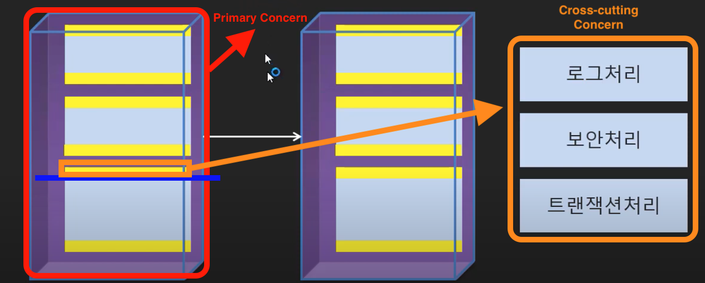
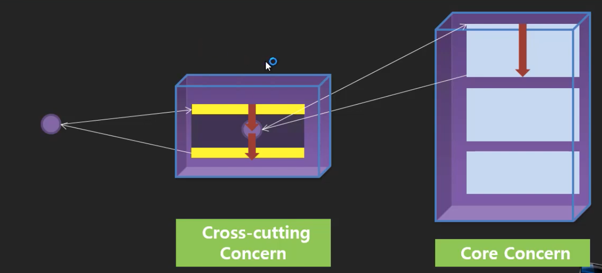
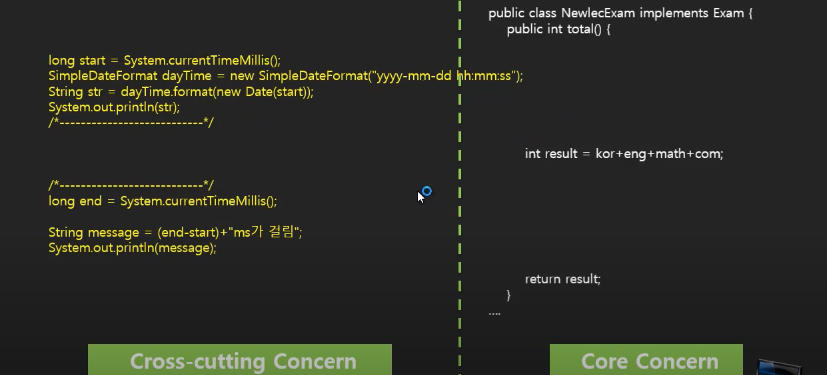
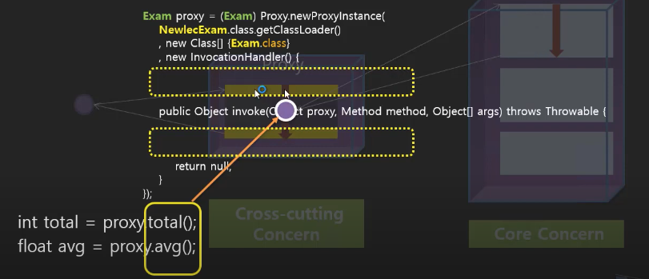
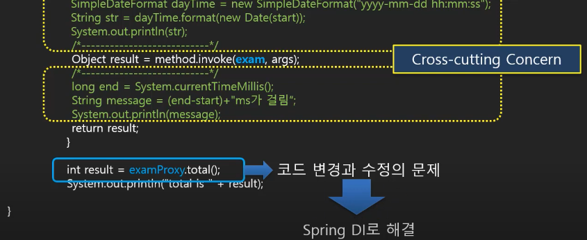

# Spring Framework and Boot 학습 3 - AOP


## 1. AOP(Aspect Oriented Programming) 이란?

- 방법론인데, 스프링이 이 방법론으로 구현하는것에 도움준다고 함
- 스프링이 지원해주는 범주 내에서 AOP 방법론으로 프로그램을 만들게 되면 어떤 도움을 받을 수 있는지 확인해보자

### AOP(Aspect Oriented Programming) 이해하기

#### Aspect의 의미

- 객체지향프로그래밍은 사용자를 위한, 사용자가 필요한, 요구하는 업무 로직을 개발하는 것
  - 이게 주 업무, 코어 업무이긴 함
- 하지만, 개발을 하다보면 개발자나 운영자에게 필요한 코드들이 존재함
  - 구현을 하기 위해 또는 테스트해보기 위해 필요한 코드들이 있음
  - 이것들은 사용자는 모르는 부분, 요구한 적 없는 부분임
  - 개발자나 운영자를 위해 끼워놓게 되는 부가적인 코드들
- 이때까지는 사용자 중심으로만 프로그래밍하는 객체지향프로그래밍이었다면 개발자나 운영자의 관점에서도 필요한 부분들이 있고 이런 것들을 신경쓰자는 의미
- 각 관점에서 필요한 것들을 프로그래밍하는 것을 의미함
- 객체지향프로그래밍보다 더 큰 개념이라고 할 수 있음
- 각 관점들에 대한 내용들을 어떻게 분류하고 결합시켜서 프로그래밍할 것인가에 대한 방법론임

### Concern

#### Primary(Core) Concern과 Cross-cutting Concern

- Primary Concern
  - 주된 관심사들, 사용자의 주관심사들, 객체로 만들어짐
  - 실질적인 업무들은 메소드로 만들어짐
  - 각 객체들간의 이용관계도 있음
- Cross-cutting Concern
  - 로그처리, 보안처리, 트랜잭션처리 등과 같이 주업무가 아닌 업무들
  - 주된 업무인 메소드들의 앞 또는 뒤에 들어가게 됨
  - 프로그램의 실행방향과 수직방향으로 잘라내서 끼웠다가 뻇다가 할 수 있도록 하자
    - 예전에는 이렇게 cutting하는 작업을 쉽게 할 수 없었음



### AOP 구현 방식

#### 함수 호출 방식

- 예전에는 직접 코드를 수정해서 주석처리했다가 다시 풀었다가 했었음
- 이런 불편한 점을 해결할 방법을 생각하자해서 나온것이 AOP 방식임
- 스프링을 사용하면 이런 방식을 쉽게 구현할 수 있음




## 2. AOP 자바 코드 이해하기

### Spring을 사용하지 않고 AOP 구현하기

- Core Concern코드를 건드리지 않으면서 Cross-cutting Concern코드를 끼워넣을 수 있어야함
- 실행흐름을 그렇게 만들자



### 프락시 클래스에 구현되는 Cross-cutting Concern



### Program.java

- 나중에 스프링 DI를 사용해서 뺏다 꽂았다하는 처리를 쉽게 할 수 있음 





## 3. 순수 자바로 AOP 구현하기

### spring.aop 와 spring.aop.entity 패키지 만들기

- total을 계산하는데 얼마의 시간이 걸리는지 알아본다고 가정해보자

#### spring.aop.entity

- Exam.java

```java
package spring.aop.entity;

public interface Exam {
	
	int total();
	float avg();
}

```

- NewlecExam.java

```java
package spring.aop.entity;


public class NewlecExam implements Exam {
	
	private int kor;
	private int eng;
	private int math;
	private int com;
	
	public NewlecExam() {
	}
	
	public NewlecExam(int kor, int eng, int math, int com) {
		this.kor = kor;
		this.eng = eng;
		this.math = math;
		this.com = com;
	}

	public int getKor() {
		return kor;
	}

	public void setKor(int kor) {
		this.kor = kor;
	}

	public int getEng() {
		return eng;
	}

	public void setEng(int eng) {
		this.eng = eng;
	}

	public int getMath() {
		return math;
	}

	public void setMath(int math) {
		this.math = math;
	}

	public int getCom() {
		return com;
	}

	public void setCom(int com) {
		this.com = com;
	}

  
  // 주석처럼 직접 코드를 넣지 않고 Proxy를 사용해서 AOP 방식으로 구현해보자
	@Override
	public int total() {
//		long start = System.currentTimeMillis();
		
		int result = kor+eng+math+com;
		
		try {
			Thread.sleep(200);
		} catch (InterruptedException e) {
			// TODO Auto-generated catch block
			e.printStackTrace();
		}
		
//		long end = System.currentTimeMillis();
//		
//		String message = (end - start) + "ms 시간이 걸렸습니다.";
//		System.out.println(message);
		
		return result;
	}

	@Override
	public float avg() {
		
		float result =  total() / 4.0f;
		
		return result;
	}

	@Override
	public String toString() {
		return "NewlecExam [kor=" + kor + ", eng=" + eng + ", math=" + math + ", com=" + com + "]";
	}

	
}

```

#### spring.aop

- Program.java
  - exam 객체가 가지고 있는 주된 업무에 개발자를 위한 업무(실행시간 알아보기)를 추가하기 위해서 Proxy를 사용하자
  - 

```java
package spring.aop;

import java.lang.reflect.InvocationHandler;
import java.lang.reflect.Method;
import java.lang.reflect.Proxy;

import spring.aop.entity.Exam;
import spring.aop.entity.NewlecExam;

public class Program {

	public static void main(String[] args) {
		
		Exam exam = new NewlecExam(1,1,1,1);
		
		Exam proxy = (Exam) Proxy.newProxyInstance(NewlecExam.class.getClassLoader(), 
				new Class[] {Exam.class}, 
				new InvocationHandler() {
					
						@Override
						public Object invoke(Object proxy, Method method, Object[] args) throws Throwable {
							
							long start = System.currentTimeMillis();
							
							Object result = method.invoke(exam, args);
							
							long end = System.currentTimeMillis();
							
							String message = (end - start) + "ms 시간이 걸렸습니다.";
							System.out.println(message);
							
							return result;
						}
					}
				);
		
		System.out.printf("total is %d\n", proxy.total());
		System.out.printf("avg is %f\n", proxy.avg());
		
		
	}

}

```

- 결과

```txt
205ms 시간이 걸렸습니다.
total is 4
201ms 시간이 걸렸습니다.
avg is 1.000000
```


## 4. 스프링으로 AOP 구현해보기 - AroundAdvice

- AOP를 구현하려면 proxy, Cross-cutting Concern, Core Concern, 이렇게 세가지가 합쳐졌다가 분리되었다가 할 수 있어야됨
- 이전에 사용했던 proxy말고 스프링이 제공하는 proxy 클래스를 사용할 것
  - IoC 컨테이너에 담아놓고 주업무와 보조업무를 꽂을 수 있도록 만들거임
- 스프링에서는 네가지 형태로 구분하고 있음
  - Before Advice
    - 주업무의 앞에만 필요로하는 보조업무
  - After returnning Advice
    - 뒤에만 필요로하는 보조업무
  - After throwing Advice
    - 예외를 처리하는 보조업무
  - Around Advice
    - 앞뒤로 모두 필요로하는 보조업무
- 이 네가지 형태 중에서 구현하고자하는 형태와 가장 알맞는 형태를 인터페이스 상속받아서 구현함
- 이전에 자바로 했던 Around Advice형태를 스프링으로 구현해보자

### xml 파일을 사용해서 리팩토링해보기

- Program.java

```java
package spring.aop;

import org.springframework.context.ApplicationContext;
import org.springframework.context.annotation.AnnotationConfigApplicationContext;
import org.springframework.context.support.ClassPathXmlApplicationContext;

import spring.aop.entity.Exam;
import spring.aop.entity.NewlecExam;
import spring.di.NewlecDIConfig;

public class Program {

	public static void main(String[] args) {

		ApplicationContext context = 
//				new AnnotationConfigApplicationContext(NewlecDIConfig.class);
				new ClassPathXmlApplicationContext("spring/aop/setting.xml");
		
		Exam proxy = (Exam) context.getBean("proxy");
		
		System.out.printf("total is %d\n", proxy.total());
		System.out.printf("avg is %f\n", proxy.avg());
		
	}

}

```

- setting.xml

```xml
<?xml version="1.0" encoding="UTF-8"?>
<beans xmlns="http://www.springframework.org/schema/beans"
	xmlns:xsi="http://www.w3.org/2001/XMLSchema-instance"
	xmlns:p="http://www.springframework.org/schema/p"
	xmlns:util="http://www.springframework.org/schema/util"
	xmlns:context="http://www.springframework.org/schema/context"
	xsi:schemaLocation="http://www.springframework.org/schema/beans http://www.springframework.org/schema/beans/spring-beans.xsd
		http://www.springframework.org/schema/context http://www.springframework.org/schema/context/spring-context-4.3.xsd
		http://www.springframework.org/schema/util http://www.springframework.org/schema/util/spring-util-4.3.xsd">
	

	<bean id="target" class="spring.aop.entity.NewlecExam" p:kor="1" p:eng="1" p:math="1" p:com="1"/>
	<bean id="logAroundAdvice" class="spring.aop.advice.LogAroundAdvice" />
	<bean id="proxy" class="org.springframework.aop.framework.ProxyFactoryBean">
		<property name="target" ref="target" />
		<property name="interceptorNames">
			<list>
				<value>logAroundAdvice</value>
			</list>
		</property>
	</bean>
	
	
</beans>

```

- LogAroundAdvice.java

```java
package spring.aop.advice;

import org.aopalliance.intercept.MethodInterceptor;
import org.aopalliance.intercept.MethodInvocation;

public class LogAroundAdvice implements MethodInterceptor {

	@Override
	public Object invoke(MethodInvocation invocation) throws Throwable {
		
		long start = System.currentTimeMillis();
		
		Object result = invocation.proceed();
		
		long end = System.currentTimeMillis();
		
		String message = (end - start) + "ms 시간이 걸렸습니다.";
		System.out.println(message);
		
		return result;
	}
	
}

```

- 결과

```txt
203ms 시간이 걸렸습니다.
total is 4
200ms 시간이 걸렸습니다.
avg is 1.000000
```

### proxy이름을 exam으로 변경하기

- Program.java

```java
package spring.aop;

import java.lang.reflect.InvocationHandler;
import java.lang.reflect.Method;
import java.lang.reflect.Proxy;

import org.springframework.context.ApplicationContext;
import org.springframework.context.annotation.AnnotationConfigApplicationContext;
import org.springframework.context.support.ClassPathXmlApplicationContext;

import spring.aop.entity.Exam;
import spring.aop.entity.NewlecExam;
import spring.di.NewlecDIConfig;

public class Program {

	public static void main(String[] args) {

		ApplicationContext context = 
//				new AnnotationConfigApplicationContext(NewlecDIConfig.class);
				new ClassPathXmlApplicationContext("spring/aop/setting.xml");
		
		Exam exam = (Exam) context.getBean("exam");
		
		System.out.printf("total is %d\n", exam.total());
		System.out.printf("avg is %f\n", exam.avg());
	
	}

}

```

- setting.xml

```xml
<?xml version="1.0" encoding="UTF-8"?>
<beans xmlns="http://www.springframework.org/schema/beans"
	xmlns:xsi="http://www.w3.org/2001/XMLSchema-instance"
	xmlns:p="http://www.springframework.org/schema/p"
	xmlns:util="http://www.springframework.org/schema/util"
	xmlns:context="http://www.springframework.org/schema/context"
	xsi:schemaLocation="http://www.springframework.org/schema/beans http://www.springframework.org/schema/beans/spring-beans.xsd
		http://www.springframework.org/schema/context http://www.springframework.org/schema/context/spring-context-4.3.xsd
		http://www.springframework.org/schema/util http://www.springframework.org/schema/util/spring-util-4.3.xsd">
	

	<bean id="target" class="spring.aop.entity.NewlecExam" p:kor="1" p:eng="1" p:math="1" p:com="1"/>
	<bean id="logAroundAdvice" class="spring.aop.advice.LogAroundAdvice" />
	<bean id="exam" class="org.springframework.aop.framework.ProxyFactoryBean">
		<property name="target" ref="target" />
		<property name="interceptorNames">
			<list>
				<value>logAroundAdvice</value>
			</list>
		</property>
	</bean>
	
	
</beans>

```

- 결과
  - 같은 결과가 나옴

```txt
200ms 시간이 걸렸습니다.
total is 4
201ms 시간이 걸렸습니다.
avg is 1.000000
```

### 이렇게 되면 Program.java의 코드는 수정하지 않고도 xml파일 수정만으로 주업무로직만 처리할지 보조업무로직을 함께 처리할지 결정할 수 있음

- Program.java
  - 변경없음
- setting.xml
  - proxy 부분을 지우고 target bean의 Id를 exam으로 변경하면 Program.java의 코드수정없이 주업무만 실행시킬 수 있음

```xml
<?xml version="1.0" encoding="UTF-8"?>
<beans xmlns="http://www.springframework.org/schema/beans"
	xmlns:xsi="http://www.w3.org/2001/XMLSchema-instance"
	xmlns:p="http://www.springframework.org/schema/p"
	xmlns:util="http://www.springframework.org/schema/util"
	xmlns:context="http://www.springframework.org/schema/context"
	xsi:schemaLocation="http://www.springframework.org/schema/beans http://www.springframework.org/schema/beans/spring-beans.xsd
		http://www.springframework.org/schema/context http://www.springframework.org/schema/context/spring-context-4.3.xsd
		http://www.springframework.org/schema/util http://www.springframework.org/schema/util/spring-util-4.3.xsd">
  
	<bean id="exam" class="spring.aop.entity.NewlecExam" p:kor="1" p:eng="1" p:math="1" p:com="1"/>
	
</beans>

```

- 결과

```txt
total is 4
avg is 1.000000
```


## 5. BeforeAdvice 구현하기

- setting.xml
  - 여러개의 보조업무를 사용할 수 있음

```xml
<?xml version="1.0" encoding="UTF-8"?>
<beans xmlns="http://www.springframework.org/schema/beans"
	xmlns:xsi="http://www.w3.org/2001/XMLSchema-instance"
	xmlns:p="http://www.springframework.org/schema/p"
	xmlns:util="http://www.springframework.org/schema/util"
	xmlns:context="http://www.springframework.org/schema/context"
	xsi:schemaLocation="http://www.springframework.org/schema/beans http://www.springframework.org/schema/beans/spring-beans.xsd
		http://www.springframework.org/schema/context http://www.springframework.org/schema/context/spring-context-4.3.xsd
		http://www.springframework.org/schema/util http://www.springframework.org/schema/util/spring-util-4.3.xsd">
	

	<bean id="target" class="spring.aop.entity.NewlecExam" p:kor="1" p:eng="1" p:math="1" p:com="1"/>
	<bean id="logAroundAdvice" class="spring.aop.advice.LogAroundAdvice" />
	<bean id="logBeforeAdvice" class="spring.aop.advice.LogBeforeAdvice" />
	<bean id="exam" class="org.springframework.aop.framework.ProxyFactoryBean">
		<property name="target" ref="target" />
		<property name="interceptorNames">
			<list>
				<value>logAroundAdvice</value>
				<value>logBeforeAdvice</value>
			</list>
		</property>
	</bean>
	
	
</beans>

```

- LogBeforeAdvice.java

```java
package spring.aop.advice;

import java.lang.reflect.Method;

import org.springframework.aop.MethodBeforeAdvice;

public class LogBeforeAdvice implements MethodBeforeAdvice{

	@Override
	public void before(Method method, Object[] args, Object target) throws Throwable {
		System.out.println("앞에서 실행될 로직");
		
	}

}
```

- 결과

```txt
앞에서 실행될 로직
203ms 시간이 걸렸습니다.
total is 4
앞에서 실행될 로직
201ms 시간이 걸렸습니다.
avg is 1.000000
```


## 6. After Returning Advice / Throwing Advice 구현

 


## 참고

- 유튜브 채널 - 뉴렉처
  - 스프링 프레임워크 강좌/강의
  - https://www.youtube.com/watch?v=XtXHIDnzS9c&list=PLq8wAnVUcTFUHYMzoV2RoFoY2HDTKru3T

