# Spring Framework and Boot 학습 4 - Spring MVC


## 0. Spring MVC (스프링 웹 MVC) 학습 방향

### Spring MVC의 두 가지 버전

- Spring을 사용하지 않고 웹 개발을 할 수 있었음
  - Tomcat을 사용하고, web.xml에 필요한 라이브러리들을 설정해서 인스턴스화하는 작업을 했었음
  - Mybatis나 Tiles 등 라이브러리를 web.xml에 설정하는 것

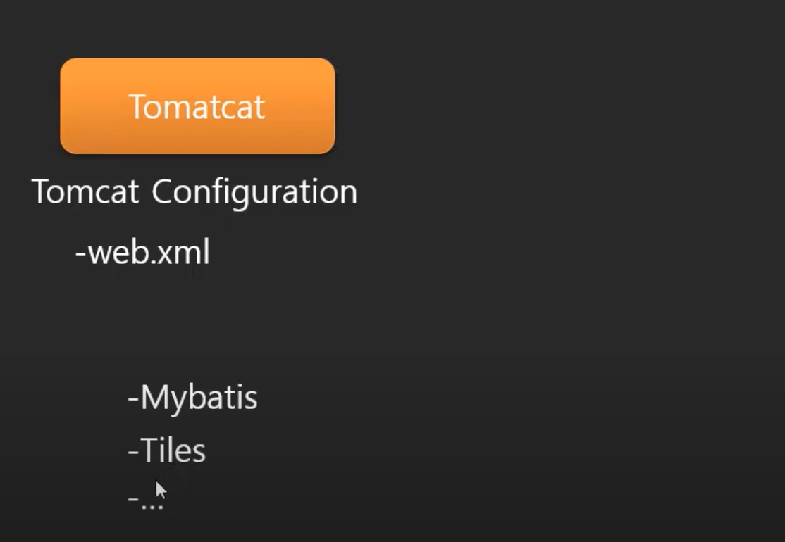

- Spring으로 웹을 개발하고자하면 Spring Dispatcher라는 라이브러리를 써야함
  - Spring이 올라가면 Spring이 모든 것을 관리할려고함
  - web.xml에서 설정해줬던 라이브러리 관련된 내용들을 Spring이 관리하게 됨
  - 추가적으로 여러가지 라이브러리들도 관리하게 됨
  - 그런데 이런 설정 방법들이 Spring의 버전이 올라감에 따라 변하게 되었음
    - XML, Annotation, Java 를 이용한 방법이 존재함
    - 이런 방법들이 섞여서 쓰이기도 함

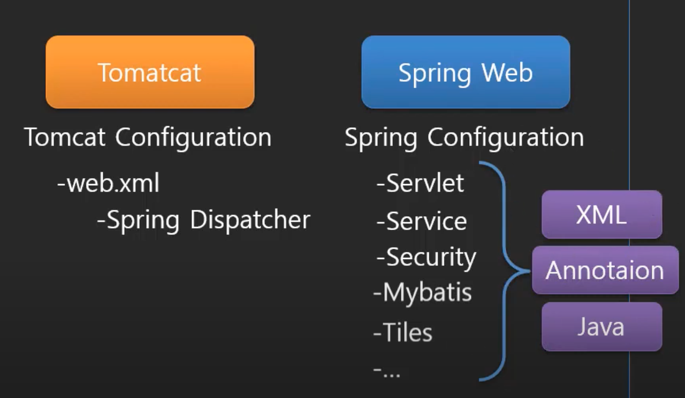

- 이런 혼란스러운 설정 관련 내용들을 모아서 편하게 할 수 있는 Spring Boot가 등장함
  - application.properties 또는 YAML 를 사용해서 설정을 간편하게 할 수 있음

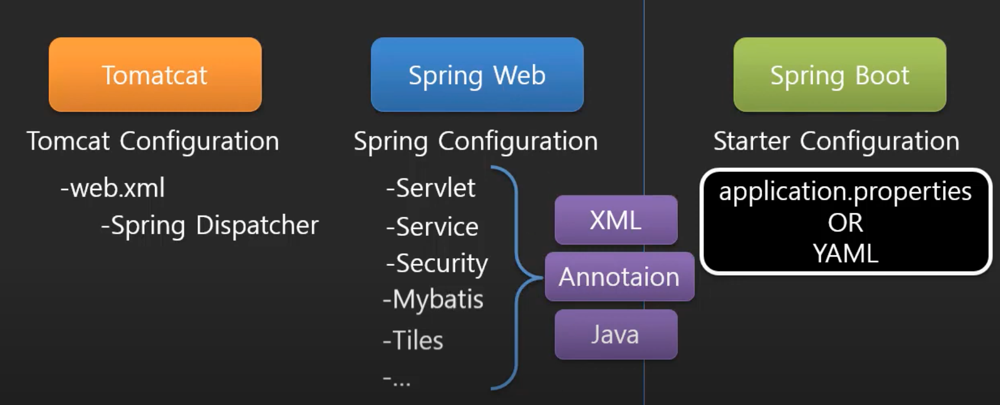

- 하지만, 현업에는 Spring Boot를 쓰는 곳도 있고 안쓰는 곳도 있기 때문에 Spring만으로도 할 수 있어야함
- 강의에서는 Spring만을 사용해서 버전이 달라진 흐름에 맞춰 변화된 방식을 전부 다 해보면서 넘어가는 버전과 Spring Boot를 사용해서 빠르게 개발하는 버전, 두가지를 다룰 것임
- 그중에서 일단은 Spring만으로 하나하나 다 짚고 넘어가는 방법을 먼저해보자


## 1. Spring MVC란?

### MVC model 2 방식의 변화: Dispatcher를 집중화 하기 전의 모델

- Controller와 View를 나눴음
- Controller와 View를 연결할 때, 포워딩 방식을 사용했고, 이때 Dispatcher를 사용했었음
- 최종적으로는 Controller와 Dispatcher는 서블릿으로 남겨두고, View 부분은 JSP로 만들었음
- 이렇게 만들다보니 Contoller 하나당 각각의 Dispatcher를 만들어야하는 비효율이 있었음

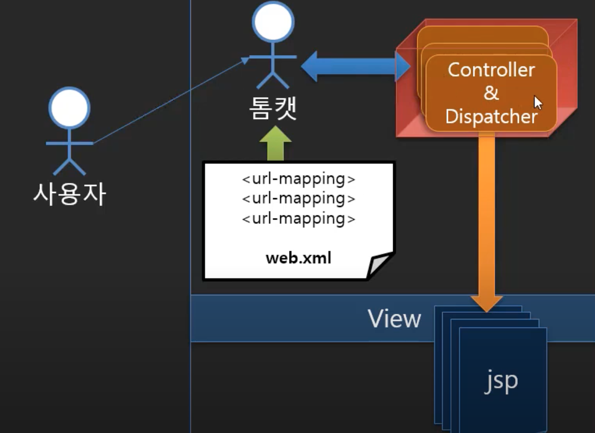

### MVC model 2 방식의 변화: Dispatcher를 집중화 한 후의 모델

- 순수하게 Controller의 기능은 서블릿이 아닌 일반적인 자바클래스로 구현하고 따로 떼어냄
  - 이것을 POJO(Plain Old Java Object)라고 함
- 남아있는 Dispatcher들은 포워딩 기능을 담당하는데 하나로 합쳐짐
  - 사용자가 요청하면 실제 로직을 가지고 있는 컨트롤러에게 요청을 전달함
  - 그 결과물을 받아서 View(JSP)에게 전달함
  - 굉장히 중요한 역할을 수행하게 됨
    - 사용자의 요청을 받는다는 것은 단순히 요청을 라우팅해주는 것이 아니라 사용자가 전달한 입력값이 있으면 컨트롤러가 사용하기 쉽게 포장해서 같이 전달해줘야함
    - 이렇게 되면 컨트롤러 입장에서는 getParameter 같은 메소드를 써서 데이터를 받는 것이 아니라 편하게 데이터를 쓸 수 있음
    - Dispatcher가 기존의 서블릿이 가지고 있는 입력도구를 이용해서 데이터를 받고, 컨트롤러에게는 사용하기 쉽게 자바의 기본 타입인 int나 String같은 걸로 전달할 수 있음
    - 뿐만 아니라 개체형(Notice형, Student형..)으로도 데이터를 담아서 보내 줄 수 있음
    - 컨트롤러에서는 서블릿 라이브러리를 하나도 사용하지 않고도 입력을 처리할 수 있게 됨
- 컨트롤러가 업무로직을 다 처리하고 결과를 반환할 때, 필요한 view페이지에 대한 정보를 함께 dispatcher에게 넘겨주게 됨
- 결국 기존의 서블릿으로 구현했던 요청을 받고 처리하는 부분은 Dispatcher가 가지고 가는 것
  - 컨트롤러는 웹서버, WAS 등과 거리를 좀 둘 수 있게 됨
  - 결합력을 낮춤으로써 컨트롤러를 다른 환경에서도 쓸 수 있음
- 결국 Dispatcher를 만드는 것이 중요한데, 이부분을 스프링이 제공하고 있다는 것
  - Front Contoller 라이브러리를 사용하게 됨
  - Front Contoller를 잘만들게 되면 웹 개발을 하는데 tomcat 같은 웹 서버나 WAS에 신경을 안쓰고 할 수 있음
- 스프링이 제공하고 있는 dispatcher 서블릿은 모든 URL을 처리하게 되고, 각 URL에 대해 어떤 컨트롤러를 요청할지 알고 있어야함
  - URL과 해당 요청에 대한 컨트롤러의 연결 정보를 가지고 있어야함
  - 이전에는 web.xml이나 어노테이션을 통해 서블릿 각각에 연결해주었다면, 이제는 servlet.xml이라는 파일 사용해서 url 매핑을 해줘야함
- 결론적으로
  - 사용자가 요청하면 디스패처가 받아서 해당 url에 맞는 컨트롤러를 요청함 > 컨트롤러는 결과로 출력하고자 하는 model과 필요로 하는 View에 대한 정보를 반환함 > 디스패처는 이를 확인하고 해당 View에 관련 데이터(model)를 전달하게 됨 > View는 해당 데이터를 사용자에게 적절하게 출력해줌

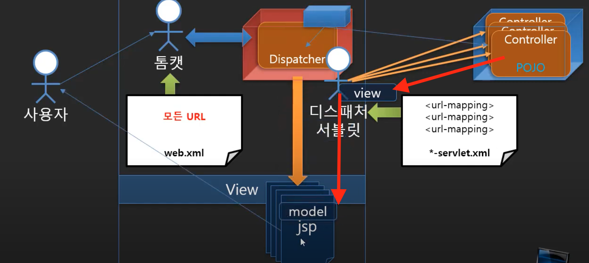

### Spring MVC 라이브러리

- Spring MVC는 Dispatcher 라이브러리를 사용한다는 것

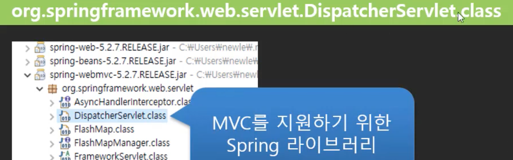


## 2. 실습환경 준비하기

- Tomcat: 이전에 설치했음
- Spring Tool Suite 4: 예전에 brew cask로 설치했었는데 버전 차이가 있을 수도 있어서 새로 설치함
  - https://spring.io/tools

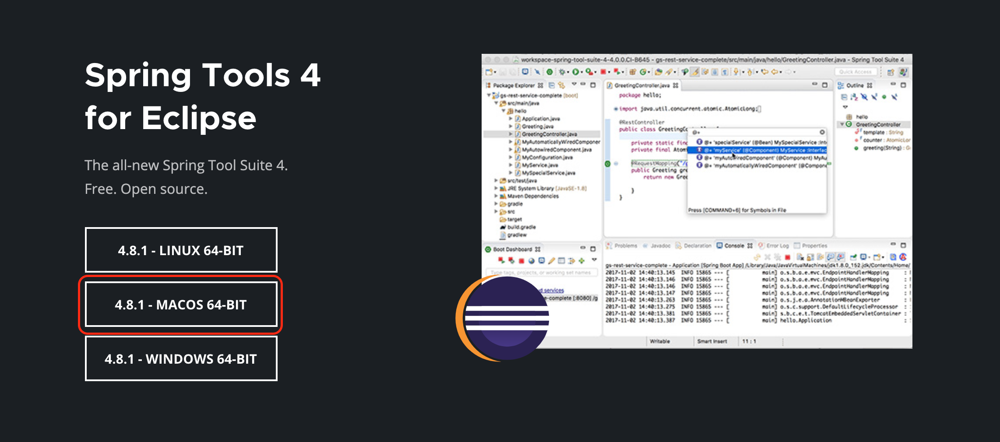


## 3. 메이븐을 이용한 기본 웹 프로젝트 생성하기

- 메이븐 프로젝트 기본 아키타입으로 생성하고, 패키징 타입 war로 설정(web project니까)
-  WEB-INF 및 web.xml 파일 생성

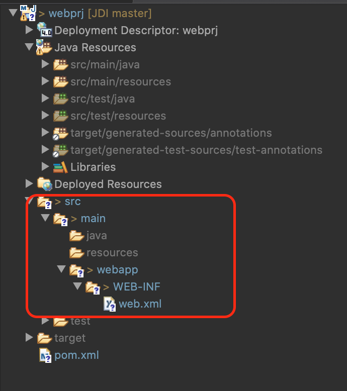

- jdk 버전 1.8로 변경하기 위해서 pom.xml 수정

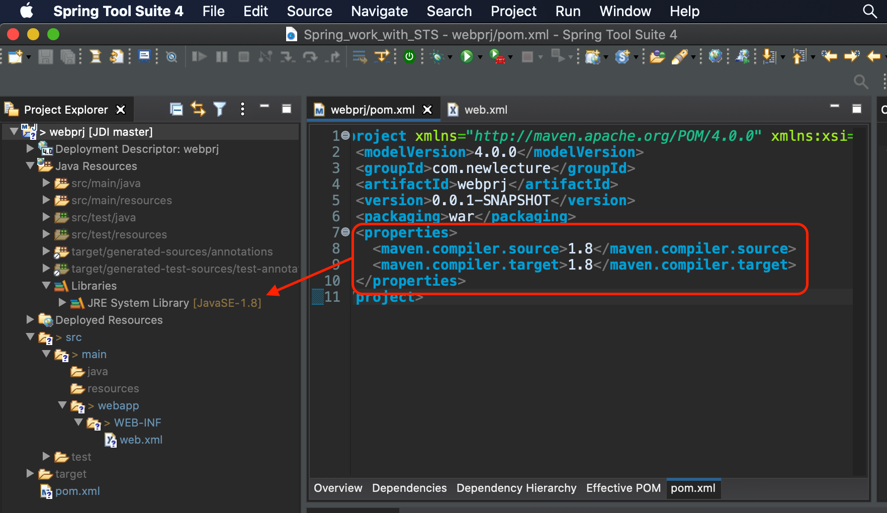

- jsp 라이브러리 dependency로 추가해주기

```xml
<project xmlns="http://maven.apache.org/POM/4.0.0" xmlns:xsi="http://www.w3.org/2001/XMLSchema-instance" xsi:schemaLocation="http://maven.apache.org/POM/4.0.0 https://maven.apache.org/xsd/maven-4.0.0.xsd">
  <modelVersion>4.0.0</modelVersion>
  <groupId>com.newlecture</groupId>
  <artifactId>webprj</artifactId>
  <version>0.0.1-SNAPSHOT</version>
  <packaging>war</packaging>
  <dependencies>
  	<!-- https://mvnrepository.com/artifact/org.apache.tomcat/tomcat-api -->
    <dependency>
        <groupId>org.apache.tomcat</groupId>
        <artifactId>tomcat-api</artifactId>
        <version>9.0.39</version>
    </dependency>
  </dependencies>
  <properties>
  	<maven.compiler.source>1.8</maven.compiler.source>
  	<maven.compiler.target>1.8</maven.compiler.target>
  </properties>
</project>
```

- 톰캣 서버 연결해주고 실행하기

```java
<%@ page language="java" contentType="text/html; charset=UTF-8"
    pageEncoding="UTF-8"%>
<!DOCTYPE html>
<html>
<head>
<meta charset="UTF-8">
<title>Insert title here</title>
</head>
<body>
	<h1>Hello JSP</h1>
</body>
</html>
```

- 결과

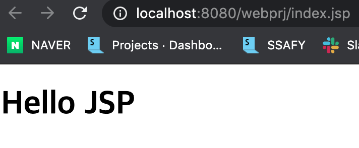


## 4. Dispatcher Servlet 라이브러리 설정하기

### Spring Dispatcher를 Front 컨트롤러로 설정하기

- 라이브러리가 필요함

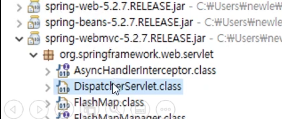

- 메이븐 저장소에서 spring mvc 5.2.9버전을 찾아서 dependency 추가해주기
  - 메이븐 탭에서 메이븐 원격 저장소를 rebuild해서 라이브러리 목록을 전부다 받아두고 필요한 것만 검색해서 설치하는 방법도 있지만, 목록을 받아오는데 시간이 걸리므로 그냥 메이븐 저장소 사이트에서 직접 코드를 받아옴

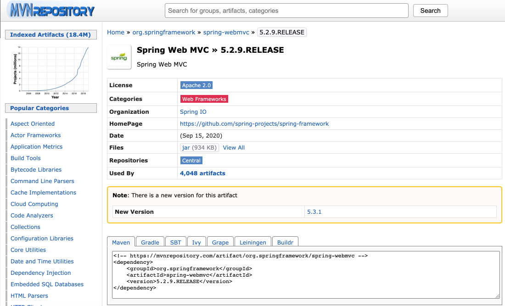

- 필요한 라이브러리 설치완료
  - 이 서블릿클래스는 프론트 컨트롤러의 역할을 하기 위한 것임 
  - 이를 사용하기 위해서는 web.xml에서 설정을 해줘야함
  - 다음 챕터에서 해보자

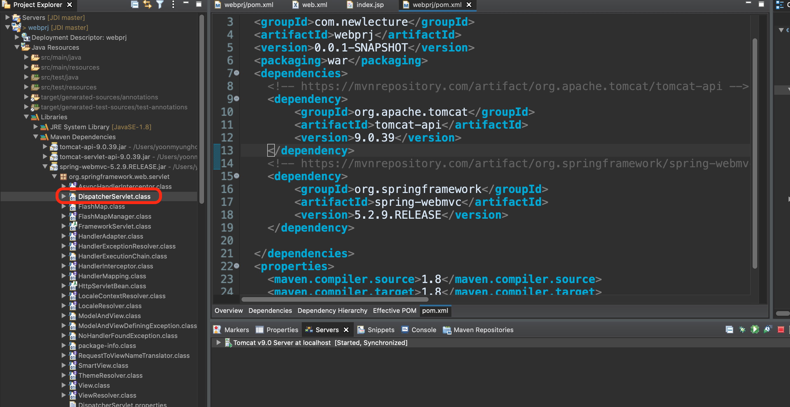

- pom.xml

```xml
<!-- https://mvnrepository.com/artifact/org.springframework/spring-webmvc -->
<dependency>
  <groupId>org.springframework</groupId>
  <artifactId>spring-webmvc</artifactId>
  <version>5.2.9.RELEASE</version>
</dependency>
```


## 5. Dispatcher-servlet.xml 파일

- 기존에는 Controller를 서블릿으로 직접 만들어서 사용했기 때문에 어노테이션을 사용해서 url 매핑을 할 수 있었지만, 이제는 스프링에서 제공하는 서블릿을 사용해야하므로 어노테이션을 달 수가 없음
  - web.xml을 사용해서 매핑해줘야함
- DispatcherServlet의 qualified name을 복사해서 붙여넣고, 확장자명(.class)을 지워주자
- web.xml
  - /* : 어떤 주소를 입력해도 dispatcher로 요청이 감
  - dispathcer에서 각 요청들을 적절한 컨트롤러에 매핑해주어야함
    - *-servlet.xml가 약속된 위치에 있어야함
      - WEB-INF안에 만들어줘야함
      - 여기서 *은 dispatcher의 servlet-name임
        - 만약 aaa로 했으면, aaa-servlet.xml로 만들어야함

```xml
<servlet>
  <servlet-name>dispatcher</servlet-name>
  <servlet-class>org.springframework.web.servlet.DispatcherServlet</servlet-class>
</servlet>
<servlet-mapping>
  <servlet-name>dispatcher</servlet-name>
  <url-pattern>/*</url-pattern>
</servlet-mapping>
```

- dispatcher-servlet.xml 생성

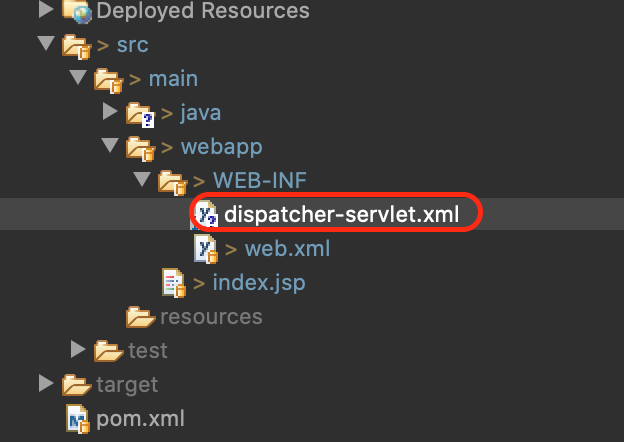


## 6. 스프링 컨트롤러 IndexController 작성하기

- dispatcher-servlet.xml 를 작성하기 위해서 레퍼런스를 찾아보자
  - https://docs.spring.io/spring-framework/docs/
  - bean을 생성하는데 id가 url이되고 class에 컨트롤러를 써줌

```xml
<?xml version="1.0" encoding="UTF-8"?>
<beans xmlns="http://www.springframework.org/schema/beans"
    xmlns:xsi="http://www.w3.org/2001/XMLSchema-instance"
    xsi:schemaLocation="http://www.springframework.org/schema/beans
        https://www.springframework.org/schema/beans/spring-beans.xsd">

    <bean id="/index" class="com.newlecture.web.controller.IndexController">  
        <!-- collaborators and configuration for this bean go here -->
    </bean>

</beans>
```

- dispatcher-servlet.xml에 작성한대로 IoC 컨테이너에는 객체가 만들어짐
  - 사용자가 url을 요청하면 객체가 만들어지는 것에서 그치는게 아니라 먼가 요청에 해당하는 일을 해주어야함
  - 그래서 약속된 메소드가 있음
    - handleRequest
    - 사용자가 요청을 보내면 이 메소드가 실행되는 것
  - 이 메소드를 정의해둔 인터페이스 Controller를 상속해서 오버라이딩해줘야함

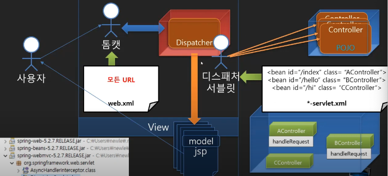

- IndexController.java

```java
package com.newlecture.web.controller;

import javax.servlet.http.HttpServletRequest;
import javax.servlet.http.HttpServletResponse;

import org.springframework.web.servlet.ModelAndView;
import org.springframework.web.servlet.mvc.Controller;

public class IndexController implements Controller {

	@Override
	public ModelAndView handleRequest(HttpServletRequest request, HttpServletResponse response) throws Exception {
		
		ModelAndView mv = new ModelAndView();
		mv.addObject("data", "Hello Spring MVC");
		mv.setViewName("index.jsp");
		
		return mv;
	}
	
}

```

- web.xml
  - 모든 요청이 디스패처를 거치는데 IndexController에서 포워딩 방식으로 넘긴 index.jsp도 결국엔 디스패처를 거치게 됨
  - 이때, dispatcher-servlet.xml에서 이에 대한 설정 부분이 없기 때문에 오류가 발생하게 됨
  - /* 을 / 로 바꿔주게 되면, dispatcher-servlet.xml를 찾아보다가 만약 없는 경우엔 그냥 요청을 받은 url로 요청을 해줌

```xml
<?xml version="1.0" encoding="UTF-8"?>

<web-app xmlns="http://xmlns.jcp.org/xml/ns/javaee"
  xmlns:xsi="http://www.w3.org/2001/XMLSchema-instance"
  xsi:schemaLocation="http://xmlns.jcp.org/xml/ns/javaee
                      http://xmlns.jcp.org/xml/ns/javaee/web-app_4_0.xsd"
  version="4.0"
  metadata-complete="true">

	<servlet>
		<servlet-name>dispatcher</servlet-name>
		<servlet-class>org.springframework.web.servlet.DispatcherServlet</servlet-class>
	</servlet>
	<servlet-mapping>
		<servlet-name>dispatcher</servlet-name>
    <!-- <url-pattern>/*</url-pattern> -->
		<url-pattern>/</url-pattern>
	</servlet-mapping>

  <display-name>Welcome to Tomcat</display-name>
  <description>
     Welcome to Tomcat
  </description>


</web-app>

```

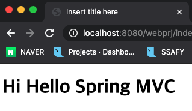


## 7. View 페이지를 위한 위치

- View 페이지(index.jsp)는 사용자가 직접 요청할 수 없음
  - WEB-INF에 넣어야함
  - IndexController.java의 포워딩을 통해서만 접근할 수 있음

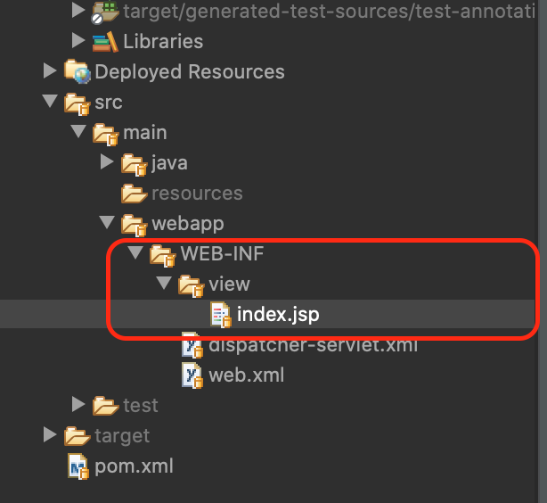

- IndexController.java

```java
package com.newlecture.web.controller;

import javax.servlet.http.HttpServletRequest;
import javax.servlet.http.HttpServletResponse;

import org.springframework.web.servlet.ModelAndView;
import org.springframework.web.servlet.mvc.Controller;

public class IndexController implements Controller {

	@Override
	public ModelAndView handleRequest(HttpServletRequest request, HttpServletResponse response) throws Exception {
		
		ModelAndView mv = new ModelAndView();
		mv.addObject("data", "Hello Spring MVC");
    // 경로 앞에 '/'를 써서 절대경로를 써주자
		mv.setViewName("/WEB-INF/view/index.jsp");
		
		return mv;
	}
	
}

```

- Context명 제거해주기
  - localhost:8080/webprj/index
    - 여기서 webprj은 프로젝트명으로 자동으로 Context로 추가된 것인데 빼주는게 좋음
    - webprj -> / 으로 변경

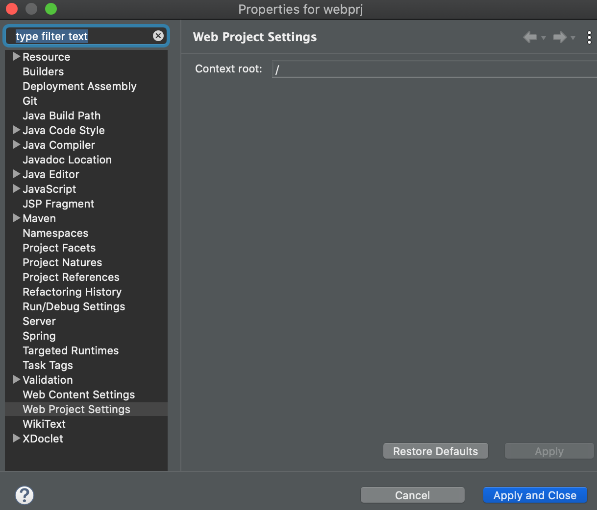


## 8. ViewResolver 사용하기

- View page를 쉽게 찾을 수 있도록 하는 ViewResolver를 사용해보자

### 반복되는 View의 일부분

- 반복되는 부분이 존재함

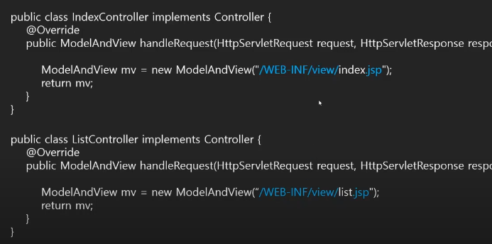

- ViewResolver를 사용해서 반복을 없앨 수 있음

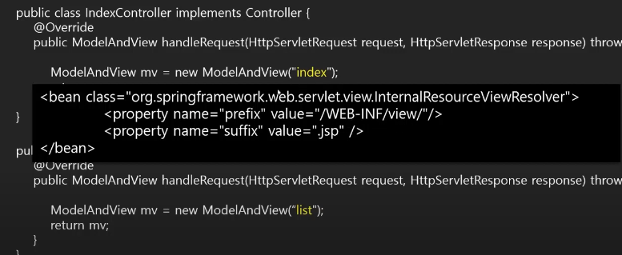

- IndexController.java

```java
package com.newlecture.web.controller;

import javax.servlet.http.HttpServletRequest;
import javax.servlet.http.HttpServletResponse;

import org.springframework.web.servlet.ModelAndView;
import org.springframework.web.servlet.mvc.Controller;

public class IndexController implements Controller {

	@Override
	public ModelAndView handleRequest(HttpServletRequest request, HttpServletResponse response) throws Exception {
		
// 이렇게 오버로딩된 생성자를 사용해서 view 설정할 수도 있음
//		ModelAndView mv = new ModelAndView("/WEB-INF/view/index.jsp");
		ModelAndView mv = new ModelAndView("index");
		mv.addObject("data", "Hello Spring MVC");
//		mv.setViewName("/WEB-INF/view/index.jsp");
		return mv;
	}
	
}

```

- dispatcher-servlet.xml

```xml
<?xml version="1.0" encoding="UTF-8"?>
<beans xmlns="http://www.springframework.org/schema/beans"
    xmlns:xsi="http://www.w3.org/2001/XMLSchema-instance"
    xsi:schemaLocation="http://www.springframework.org/schema/beans
        https://www.springframework.org/schema/beans/spring-beans.xsd">

    <bean id="/index" class="com.newlecture.web.controller.IndexController" />  

  <!-- ViewResolver 추가 -->
	<bean class="org.springframework.web.servlet.view.InternalResourceViewResolver">
		<property name="prefix" value="/WEB-INF/view/"></property>
		<property name="suffix" value=".jsp"></property>
	</bean>
	
	
</beans>
```


## 9. HTML 파일 설정하기

- HTML 파일 다운로드 받기
  - http://www.newlecture.com/customer/notice/16
- webapp에 html 폴더 넣기
- html의 index.html 내용 복사해서 view안에 있는 index.jsp에 붙여넣고 서버 실행
- 이미지같은 것들이 제대로 안나옴

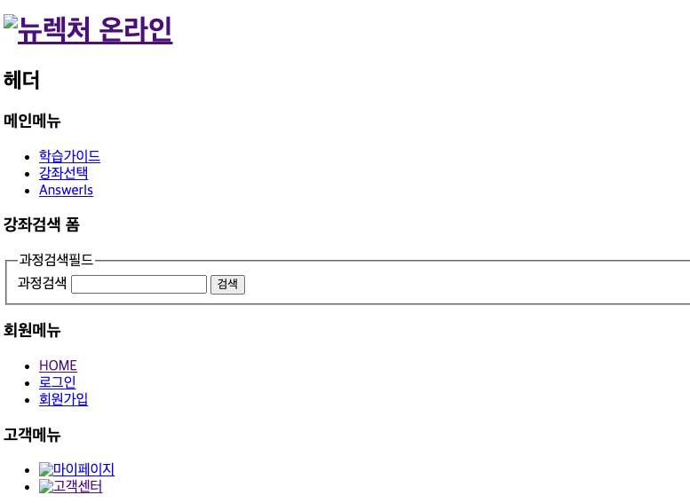

- 사용되는 css나 images, js를 root(webapp)로 옮기자

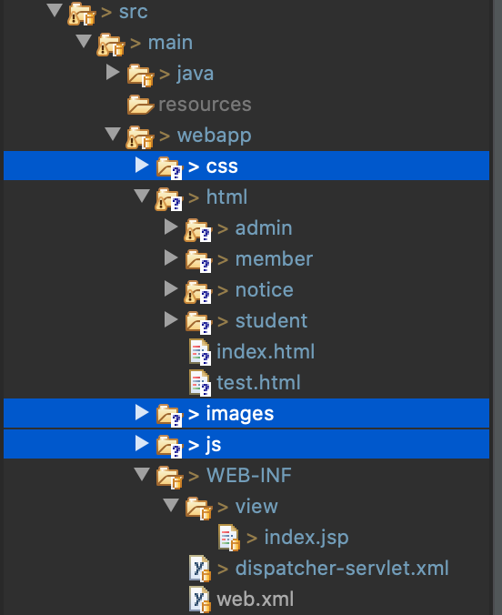

- 다시 서버 실행해봐도 결과는 똑같이 나옴
- 다음 챕터에서 문제를 해결해보자


## 10. 정적 파일 서비스하기


## 참고

- 유튜브 채널 - 뉴렉처
  - 스프링 프레임워크 강좌/강의
  - https://www.youtube.com/watch?v=XtXHIDnzS9c&list=PLq8wAnVUcTFUHYMzoV2RoFoY2HDTKru3T

