# Spring Framework and Boot 학습 5 - Spring MVC


## 15. Tiles 지시서 작성하기

### MVC Model2와 Tiles

- 사용자가 요청을 함
  - /notice/list
- 디스패처서블릿이 컨트롤에게 요청을 전달
- 컨트롤은 요청에 해당하는 작업을 하고 결과로 모델과 뷰를 다시 디스패처서블릿에게 전달
  - 이때, 스프링이 제공하는 resolver를 사용해서 해당 위치에 있는 jsp를 찾아서 전달해줬음
    - 컨트롤러는 notice/list라는 값과 resolver를 통한 prefix와 subfix를 사용해서 jsp의 위치를 전달
  - 이제는 이런 형태말고도 notice.list 형태로 값을 반환해서 tiles를 호출하게 됨
    - tiles는 이런 형태의 값을 받으면 그 형태에 맞는 페이지 조각들을 조합해서 반환하게 됨
    - 어떤 페이지 조각들이 어떻게 결합되어야하는지 tiles가 알 수 있도록 지시서를 작성해줘야함
- 스프링은 어떻게 두 가지 형태(notice/list or notice.list)를 구분해서 처리해주는가?
  - tiles를 사용하는 형태의 우선순위를 높게 설정
  - tiles를 통해서 찾아보다가 없으면 resolver를 사용하는 방법
- tiles 지시사항에는 두가지가 있어야함
  -  어떤 조각을 붙일 것인지에 대한 지시사항
  - 어떤 위치에 붙여야되는지에 대한 지시사항

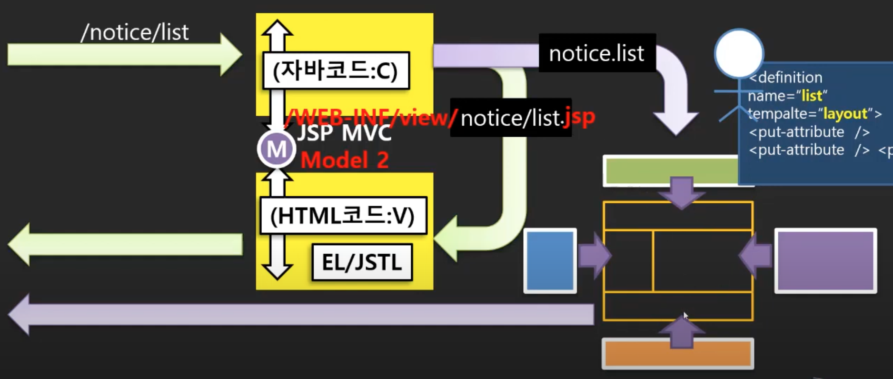

- Tiles
  - tiles는 백엔드에서 페이지를 처리할 때 사용되는 라이브러리
  - 페이지를 처리하는 부분이 백엔드에서 프론트엔드로 넘어가면서 tiles를 이용하는 빈도가 적어짐
  - 더 이상 발전하지는 않지만, 사용될 수도 있음
  - tutorial 링크
    - https://tiles.apache.org/framework/tutorial/basic/pages.html

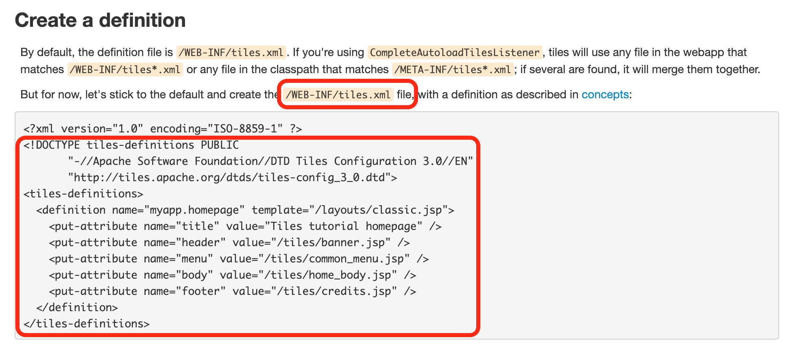

- WEB-INF 안에 tiles.xml 생성

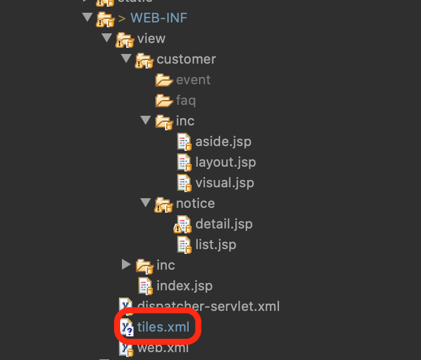

- ListController.java

```java
package com.newlecture.web.controller.notice;

import javax.servlet.http.HttpServletRequest;
import javax.servlet.http.HttpServletResponse;

import org.springframework.web.servlet.ModelAndView;
import org.springframework.web.servlet.mvc.Controller;

public class ListController implements Controller{

	@Override
	public ModelAndView handleRequest(HttpServletRequest request, HttpServletResponse response) throws Exception {
		
    // 변경해주기
		ModelAndView mv = new ModelAndView("notice.list");
//		ModelAndView mv = new ModelAndView("notice/list");
		return mv;
	}

}

```

- DetailController.java

```java
package com.newlecture.web.controller.notice;

import javax.servlet.http.HttpServletRequest;
import javax.servlet.http.HttpServletResponse;

import org.springframework.web.servlet.ModelAndView;
import org.springframework.web.servlet.mvc.Controller;

public class DetailController implements Controller{

	@Override
	public ModelAndView handleRequest(HttpServletRequest request, HttpServletResponse response) throws Exception {

		ModelAndView mv = new ModelAndView("notice.detail");
		return mv;
	}

}

```

- tiles.xml
  - 레이아웃과 그 안에 들어갈 페이지 조각들을 작성해줬음
  - 각 조각들이 레이아웃의 어디에 위치할 것인지에 대한 설정 부분은 다음 챕터에서 알아보자

```xml
<?xml version="1.0" encoding="UTF-8"?>
<!DOCTYPE tiles-definitions PUBLIC
       "-//Apache Software Foundation//DTD Tiles Configuration 3.0//EN"
       "http://tiles.apache.org/dtds/tiles-config_3_0.dtd">
<tiles-definitions>
  <definition name="notice.list" template="/WEB-INF/view/customer/inc/layout.jsp">
    <put-attribute name="title" value="Tiles tutorial homepage" />
    <put-attribute name="header" value="/WEB-INF/view/inc/header.jsp" />
    <put-attribute name="visual" value="/WEB-INF/view/customer/inc/visual.jsp" />
    <put-attribute name="aside" value="/WEB-INF/view/customer/inc/aside.jsp" />
    <put-attribute name="body" value="/WEB-INF/view/customer/notice/list.jsp" />
    <put-attribute name="footer" value="/WEB-INF/view/inc/footer.jsp" />
  </definition>
  <definition name="notice.detail" template="/WEB-INF/view/customer/inc/layout.jsp">
    <put-attribute name="title" value="Tiles tutorial homepage" />
    <put-attribute name="header" value="/WEB-INF/view/inc/header.jsp" />
    <put-attribute name="visual" value="/WEB-INF/view/customer/inc/visual.jsp" />
    <put-attribute name="aside" value="/WEB-INF/view/customer/inc/aside.jsp" />
    <put-attribute name="body" value="/WEB-INF/view/customer/notice/detail.jsp" />
    <put-attribute name="footer" value="/WEB-INF/view/inc/footer.jsp" />
  </definition>
</tiles-definitions>
```


## 16. 레이아웃 페이지 만들기와 Tiles 라이브러리 설정하기

- tiles.xml에서 레이아웃에 어떤 페이지 조각들을 넣을 것인지에 대한 설정을 해줬음
- 이제는 어떤 위치에 둘 것인지에 대한 설정을 해줘야함
- layout.jsp에서 taglib를 사용할 수 있도록 tiles 라이브러리를 받아오자
  - https://mvnrepository.com/artifact/org.apache.tiles/tiles-jsp/3.0.8
- pom.xml

```xml
<!-- https://mvnrepository.com/artifact/org.apache.tiles/tiles-jsp -->
<dependency>
  <groupId>org.apache.tiles</groupId>
  <artifactId>tiles-jsp</artifactId>
  <version>3.0.8</version>
</dependency>
```

- titles.xml

```xml
<?xml version="1.0" encoding="UTF-8"?>
<!DOCTYPE tiles-definitions PUBLIC
       "-//Apache Software Foundation//DTD Tiles Configuration 3.0//EN"
       "http://tiles.apache.org/dtds/tiles-config_3_0.dtd">
<tiles-definitions>
  <definition name="notice.list" template="/WEB-INF/view/customer/inc/layout.jsp">
    <put-attribute name="title" value="공지사항" />
    <put-attribute name="header" value="/WEB-INF/view/inc/header.jsp" />
    <put-attribute name="visual" value="/WEB-INF/view/customer/inc/visual.jsp" />
    <put-attribute name="aside" value="/WEB-INF/view/customer/inc/aside.jsp" />
    <put-attribute name="body" value="/WEB-INF/view/customer/notice/list.jsp" />
    <put-attribute name="footer" value="/WEB-INF/view/inc/footer.jsp" />
  </definition>
  <definition name="notice.detail" template="/WEB-INF/view/customer/inc/layout.jsp">
    <put-attribute name="title" value="Tiles tutorial homepage" />
    <put-attribute name="header" value="/WEB-INF/view/inc/header.jsp" />
    <put-attribute name="visual" value="/WEB-INF/view/customer/inc/visual.jsp" />
    <put-attribute name="aside" value="/WEB-INF/view/customer/inc/aside.jsp" />
    <put-attribute name="body" value="/WEB-INF/view/customer/notice/detail.jsp" />
    <put-attribute name="footer" value="/WEB-INF/view/inc/footer.jsp" />
  </definition>
</tiles-definitions>
```

- layout.jsp
  - taglib 추가
  - 각 위치에 맞는 페이지 조각을 tiles태그를 사용해서 넣어주자

```jsp
<%@ page language="java" contentType="text/html; charset=UTF-8"
    pageEncoding="UTF-8"%>
<%@ taglib prefix="tiles" uri="http://tiles.apache.org/tags-tiles" %>
<!DOCTYPE html>
<html>

<head>
    <meta charset="UTF-8">
    <title><tiles:getAsString name="title" /></title>
    
    <link href="/css/customer/layout.css" type="text/css" rel="stylesheet" />
    <style>
    
        #visual .content-container{	
            height:inherit;
            display:flex; 
            align-items: center;
            
            background: url("../../images/customer/visual.png") no-repeat center;
        }
    </style>
</head>

<body>
    <!-- header 부분 -->
	<tiles:insertAttribute name="header" />

	<!-- --------------------------- <visual> --------------------------------------- -->
	<!-- visual 부분 -->
	<tiles:insertAttribute name="visual" />
	
	<!-- --------------------------- <body> --------------------------------------- -->
	<div id="body">
		<div class="content-container clearfix">

			<!-- --------------------------- aside --------------------------------------- -->
			<!-- aside 부분 -->
			<tiles:insertAttribute name="aside" />

			
			<!-- --------------------------- main --------------------------------------- -->
			<tiles:insertAttribute name="body" />
			
		</div>
	</div>

    <!-- ------------------- <footer> --------------------------------------- -->
	<tiles:insertAttribute name="footer" />

    </body>
    
    </html>
```


## 17. Tiles ViewResolver 설정하기

- tiles.xml에 페이지 설정과 layout.jsp에서 위치 지정까지 해주었음
- 이제 컨트롤러에서 notice.list를 통해 페이지를 요청할 때, 앞서 설정한 부분들과 연결될 수 있도록 resolver를 설정해줘야함

### Controller와 Resolver

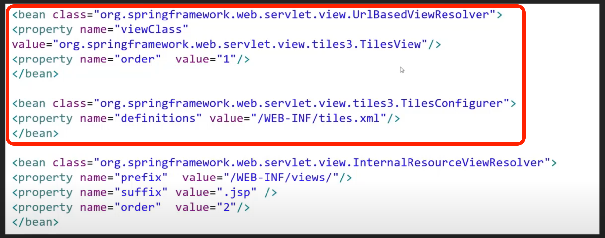

- dispatcher-servlet.xml

```xml
<?xml version="1.0" encoding="UTF-8"?>
<beans xmlns="http://www.springframework.org/schema/beans"
	xmlns:mvc="http://www.springframework.org/schema/mvc"
    xmlns:xsi="http://www.w3.org/2001/XMLSchema-instance"
    xsi:schemaLocation="http://www.springframework.org/schema/beans
        https://www.springframework.org/schema/beans/spring-beans.xsd
        http://www.springframework.org/schema/mvc
        https://www.springframework.org/schema/mvc/spring-mvc.xsd">
        

    <bean id="/index" class="com.newlecture.web.controller.IndexController" />  
    <bean id="/notice/list" class="com.newlecture.web.controller.notice.ListController" />  
    <bean id="/notice/detail" class="com.newlecture.web.controller.notice.DetailController" />  

<!-- *******추가******* -->
	<bean
		class="org.springframework.web.servlet.view.UrlBasedViewResolver">
		<property name="viewClass"
			value="org.springframework.web.servlet.view.tiles3.TilesView" />
		<property name="order" value="1" />
	</bean>

	<bean
		class="org.springframework.web.servlet.view.tiles3.TilesConfigurer">
		<property name="definitions" value="/WEB-INF/tiles.xml" />
	</bean>
<!-- ***************** -->

	<bean class="org.springframework.web.servlet.view.InternalResourceViewResolver">
		<property name="prefix" value="/WEB-INF/view/"></property>
		<property name="suffix" value=".jsp"></property>
		<property name="order" value="2" />
	</bean>
	
	<mvc:resources location="/static/" mapping="/**"></mvc:resources>
	
</beans>
```

- 실행 결과
  - jstl 라이브러리가 없음
  - 라이브러리 추가하자
    - https://mvnrepository.com/artifact/javax.servlet/jstl/1.2

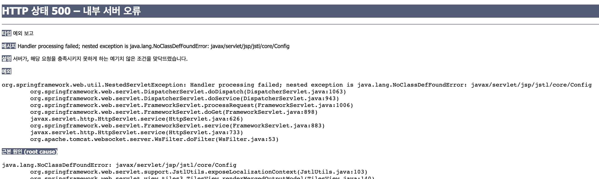

- pom.xml에 dependency 추가

```xml
	<!-- https://mvnrepository.com/artifact/javax.servlet/jstl -->
	<dependency>
	    <groupId>javax.servlet</groupId>
	    <artifactId>jstl</artifactId>
	    <version>1.2</version>
	</dependency>
```

- 재실행 결과

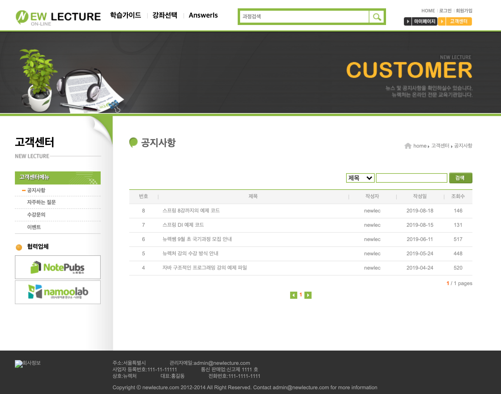


## 18. Tiles 설정에 Wildcard 이용하기

- tiles.xml에서 설정을 할 때, 비효율적인 부분들이 있었음(반복하는 부분들)
- wildcard를 사용해서 이런 부분을 개선해보자
  - 자세한 활용방법은 https://tiles.apache.org/framework/tutorial/advanced/wildcard.html 참고
- tiles.xml
  - 패턴을 사용할 수 있음
  - notice.* -> notice. 뒤로 오는 패턴들을 밑에 {1}에서 받겠다는 의미
  - 패턴을 여러개 사용할 수도 있음

```xml
<?xml version="1.0" encoding="UTF-8"?>
<!DOCTYPE tiles-definitions PUBLIC
       "-//Apache Software Foundation//DTD Tiles Configuration 3.0//EN"
       "http://tiles.apache.org/dtds/tiles-config_3_0.dtd">
<tiles-definitions>
  <definition name="notice.*" template="/WEB-INF/view/customer/inc/layout.jsp">
    <put-attribute name="title" value="공지사항" />
    <put-attribute name="header" value="/WEB-INF/view/inc/header.jsp" />
    <put-attribute name="visual" value="/WEB-INF/view/customer/inc/visual.jsp" />
    <put-attribute name="aside" value="/WEB-INF/view/customer/inc/aside.jsp" />
    <put-attribute name="body" value="/WEB-INF/view/customer/notice/{1}.jsp" />
    <put-attribute name="footer" value="/WEB-INF/view/inc/footer.jsp" />
  </definition>
</tiles-definitions>
```


## 19. Root 페이지들을 위한 Layout 페이지 만들기

- Root 페이지(index.jsp)를 위한 layout.jsp 생성

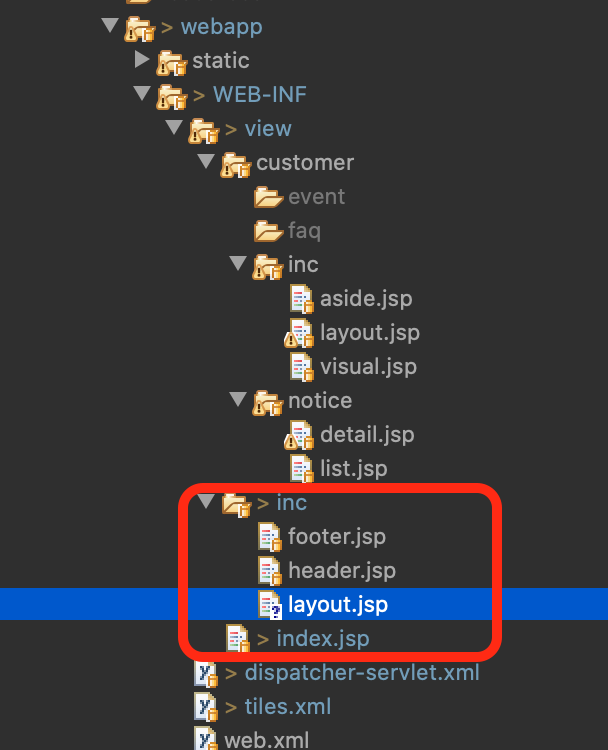

```jsp
<%@ page language="java" contentType="text/html; charset=UTF-8"
    pageEncoding="UTF-8"%>
<%@ taglib prefix="tiles" uri="http://tiles.apache.org/tags-tiles" %>
<!DOCTYPE html>
<html>

<head>
    <title>코딩 전문가를 만들기 위한 온라인 강의 시스템</title>
    <meta charset="UTF-8">
    <title>공지사항목록</title>

    <link href="/css/layout.css" type="text/css" rel="stylesheet" />
    <link href="/css/index.css" type="text/css" rel="stylesheet" />
    <script>
    
    </script>
</head>

<body>
    <!-- header 부분 -->
	<tiles:insertAttribute name="header" />
    <!-- --------------------------- <body> --------------------------------------- -->
	<tiles:insertAttribute name="body" />
    <!-- ------------------- <footer> --------------------------------------- -->
	<tiles:insertAttribute name="footer" />
   
</body>

</html>
```

- Index.jsp에는 content 부분만 남기고 지워주기
- tiles.xml
  - root를 앞에 적어줌으로써 구분해주기
  - 만약 안적어주면 모든 요청에 대해 응답하기 때문에 notice.* 를 통해서 페이지를 생성할 수가 없음

```xml
<?xml version="1.0" encoding="UTF-8"?>
<!DOCTYPE tiles-definitions PUBLIC
       "-//Apache Software Foundation//DTD Tiles Configuration 3.0//EN"
       "http://tiles.apache.org/dtds/tiles-config_3_0.dtd">
<tiles-definitions>
  <definition name="root.*" template="/WEB-INF/view/inc/layout.jsp">
    <put-attribute name="title" value="공지사항" />
    <put-attribute name="header" value="/WEB-INF/view/inc/header.jsp" />
    <put-attribute name="body" value="/WEB-INF/view/{1}.jsp" />
    <put-attribute name="footer" value="/WEB-INF/view/inc/footer.jsp" />
  </definition>
  <definition name="notice.*" template="/WEB-INF/view/customer/inc/layout.jsp">
    <put-attribute name="title" value="공지사항" />
    <put-attribute name="header" value="/WEB-INF/view/inc/header.jsp" />
    <put-attribute name="visual" value="/WEB-INF/view/customer/inc/visual.jsp" />
    <put-attribute name="aside" value="/WEB-INF/view/customer/inc/aside.jsp" />
    <put-attribute name="body" value="/WEB-INF/view/customer/notice/{1}.jsp" />
    <put-attribute name="footer" value="/WEB-INF/view/inc/footer.jsp" />
  </definition>
</tiles-definitions>
```

- IndexController.java

```java
package com.newlecture.web.controller;

import javax.servlet.http.HttpServletRequest;
import javax.servlet.http.HttpServletResponse;

import org.springframework.web.servlet.ModelAndView;
import org.springframework.web.servlet.mvc.Controller;

public class IndexController implements Controller {

	@Override
	public ModelAndView handleRequest(HttpServletRequest request, HttpServletResponse response) throws Exception {
		// root를 적어주자
		ModelAndView mv = new ModelAndView("root.index");
		mv.addObject("data", "Hello Spring MVC");
		return mv;
	}
	
}

```

- 실행 결과

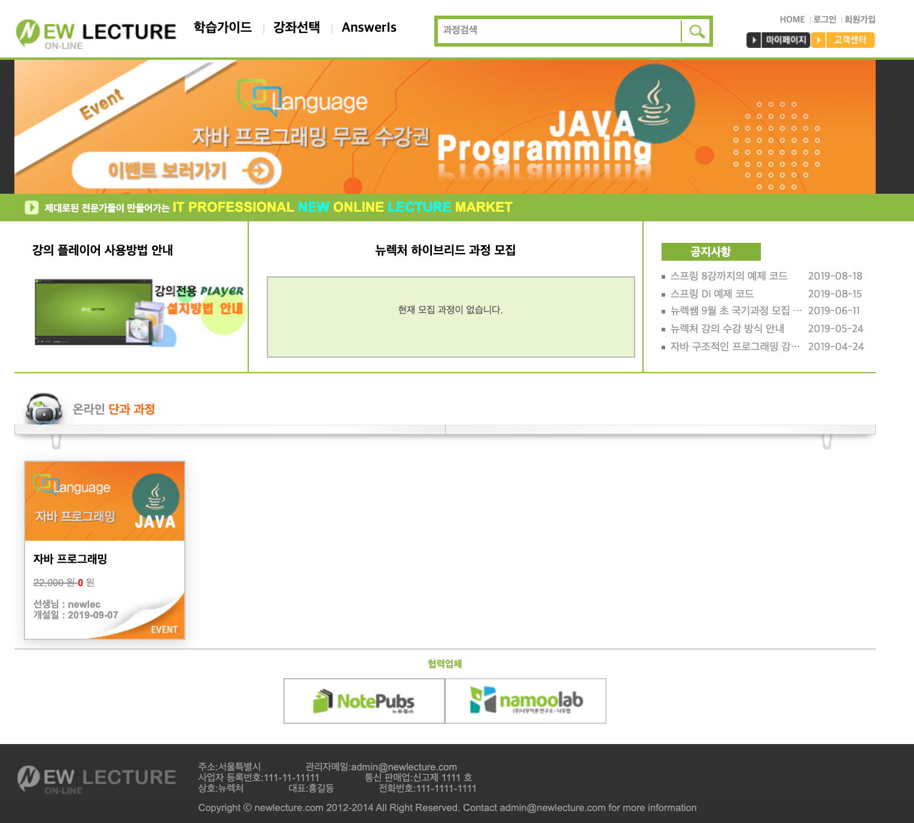


## 20. 데이터 서비스 클래스(NoticeService) 준비하기

- 강의에서 제공해주는 NoticeService와 Notice를 사용하자
  - JDBC 학습할 때 사용한 NoticeService와 Notice는 완성형이기 때문에 강의에서 제공해주는 것을 사용
  - http://www.newlecture.com/customer/notice/1020
- Notice.java

```java
package com.newlecture.web.entity;

import java.util.Date;

public class Notice {
	private int id;
	private String title;
	private String writerId;
	private Date regDate;
	private String content;
	private int hit;
	private String files;
	
	public Notice() {
		
	}
	public Notice(int id, String title, String writerId, Date regDate, String content, int hit, String files) {
		super();
		this.id = id;
		this.title = title;
		this.writerId = writerId;
		this.regDate = regDate;
		this.content = content;
		this.hit = hit;
		this.files = files;
	}

	public int getId() {
		return id;
	}
	public void setId(int id) {
		this.id = id;
	}
	public String getTitle() {
		return title;
	}
	public void setTitle(String title) {
		this.title = title;
	}
	public String getWriterId() {
		return writerId;
	}
	public void setWriterId(String writerId) {
		this.writerId = writerId;
	}
	public Date getRegDate() {
		return regDate;
	}
	public void setRegDate(Date regDate) {
		this.regDate = regDate;
	}
	public String getContent() {
		return content;
	}
	public void setContent(String content) {
		this.content = content;
	}
	public int getHit() {
		return hit;
	}
	public void setHit(int hit) {
		this.hit = hit;
	}

	public String getFiles() {
		return files;
	}

	public void setFiles(String files) {
		this.files = files;
	}

}
```

- NoticeService.java

```java
package com.newlecture.web.service;

import java.sql.Connection;
import java.sql.DriverManager;
import java.sql.PreparedStatement;
import java.sql.ResultSet;
import java.sql.SQLException;
import java.sql.Statement;
import java.util.ArrayList;
import java.util.Date;
import java.util.List;

import com.newlecture.web.entity.Notice;

public class NoticeService {
	private String url = "jdbc:oracle:thin:@localhost:1521/xepdb1";
	private String uid = "NEWLEC";
	private String pwd = "1234";
	private String driver = "oracle.jdbc.driver.OracleDriver";
	
	public List<Notice> getList(int page, String field, String query) throws ClassNotFoundException, SQLException{
		
		int start = 1 + (page-1)*10;     // 1, 11, 21, 31, ..
		int end = 10*page; // 10, 20, 30, 40...
		
		String sql = "SELECT * FROM NOTICE_VIEW WHERE "+field+" LIKE ? AND NUM BETWEEN ? AND ?";	
		
		Class.forName(driver);
		Connection con = DriverManager.getConnection(url,uid, pwd);
		PreparedStatement st = con.prepareStatement(sql);
		st.setString(1, "%"+query+"%");
		st.setInt(2, start);
		st.setInt(3, end);
		ResultSet rs = st.executeQuery();
		
		List<Notice> list = new ArrayList<Notice>();
		
		while(rs.next()){
		    int id = rs.getInt("ID");
		    String title = rs.getString("TITLE");
		    String writerId = rs.getString("WRITER_ID");
		    Date regDate = rs.getDate("REGDATE");
		    String content = rs.getString("CONTENT");
		    int hit = rs.getInt("hit");
		    String files = rs.getString("FILES");
		    
		    Notice notice = new Notice(
		    					id,
		    					title,
		    					writerId,
		    					regDate,
		    					content,
		    					hit,
		    					files
		    				);

		    list.add(notice);
		    
		}

		
		rs.close();
		st.close();
		con.close();
		
		return list;
	}
	
	// Scalar 
	public int getCount() throws ClassNotFoundException, SQLException {
		int count = 0;
		
		String sql = "SELECT COUNT(ID) COUNT FROM NOTICE";	
		
		Class.forName(driver);
		Connection con = DriverManager.getConnection(url,uid, pwd);
		Statement st = con.createStatement();
		
		ResultSet rs = st.executeQuery(sql);
		
		if(rs.next())
			count = rs.getInt("COUNT");		
		
		rs.close();
		st.close();
		con.close();
		
		return count;
	}

	public int insert(Notice notice) throws SQLException, ClassNotFoundException {
		String title = notice.getTitle();
		String writerId = notice.getWriterId();
		String content = notice.getContent();
		String files = notice.getFiles();
		
		String url = "jdbc:oracle:thin:@localhost:1521/xepdb1";
		String sql = "INSERT INTO notice (    " + 
				"    title," + 
				"    writer_id," + 
				"    content," + 
				"    files" + 
				") VALUES (?,?,?,?)";	
		
		Class.forName(driver);
		Connection con = DriverManager.getConnection(url,uid, pwd);                   
		//Statement st = con.createStatement();
		//st.ex....(sql)
		PreparedStatement st = con.prepareStatement(sql);
		st.setString(1, title);
		st.setString(2, writerId);
		st.setString(3, content);
		st.setString(4, files);
		
		int result = st.executeUpdate();
		
		
		st.close();
		con.close();
		
		return result;
	}
	
	public int update(Notice notice) throws SQLException, ClassNotFoundException {
		String title = notice.getTitle();
		String content = notice.getContent();
		String files = notice.getFiles();
		int id = notice.getId();
		
		String url = "jdbc:oracle:thin:@localhost:1521/xepdb1";
		String sql = "UPDATE NOTICE " + 
				"SET" + 
				"    TITLE=?," + 
				"    CONTENT=?," + 
				"    FILES=?" + 
				"WHERE ID=?";
		
		Class.forName(driver);
		Connection con = DriverManager.getConnection(url,uid, pwd);                   
		//Statement st = con.createStatement();
		//st.ex....(sql)
		PreparedStatement st = con.prepareStatement(sql);
		st.setString(1, title);
		st.setString(2, content);
		st.setString(3, files);
		st.setInt(4, id);
		
		int result = st.executeUpdate();
				
		st.close();
		con.close();
		
		return result;
	}
	
	public int delete(int id) throws ClassNotFoundException, SQLException {
	
		String url = "jdbc:oracle:thin:@localhost:1521/xepdb1";
		String sql = "DELETE NOTICE WHERE ID=?";
		
		Class.forName(driver);
		Connection con = DriverManager.getConnection(url,uid, pwd);                  
		//Statement st = con.createStatement();
		//st.ex....(sql)
		PreparedStatement st = con.prepareStatement(sql);		
		st.setInt(1, id);
		
		int result = st.executeUpdate();
				
		st.close();
		con.close();
		
		return result;
	}

	
}

```

- 오라클 데이터베이스에서 PDB1서버(xepdb1)에 새로운 사용자 하나 추가해주자
  - 이전에 사용하던 NEWLEC은 이미 완성된 테이블들을 가지고 있으므로 새로운 사용자 추가
  - 먼저 할당할 테이블스페이스 생성
    - NEWLEC1_TABLESPACE 생성
    - NEWLEC1_LOGSPACE 생성
  - 사용자 추가 및 테이블스페이스 연결
    - NEWLEC1
    - 1234
  - 접속 완료
    - 오라클 NEWLEC1 PDB1 서버
- Notcie 테이블 생성

```sql
CREATE TABLE NOTICE ( 
  ID NUMBER NOT NULL,
  TITLE NVARCHAR2(100) NOT NULL,
  WRITER_ID NVARCHAR2(50) NOT NULL,
  CONTENT CLOB,
  REGDATE TIMESTAMP (6) DEFAULT systimestamp NOT NULL,
  HIT NUMBER DEFAULT 0 NOT NULL,
  FILES NVARCHAR2(1000),
  PUB NUMBER(1,0) DEFAULT 0 NOT NULL,
  CONSTRAINT "NOTICE_PK" PRIMARY KEY ("ID")
);
```

- 결과

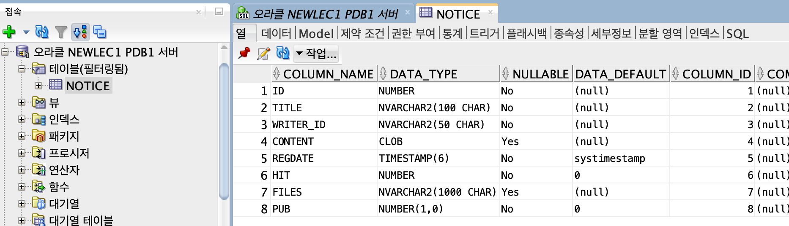

- 다음챕터를 공부해본 결과, JSP, JDBC에서 추가한 부분(NOTICE_VIEW 생성 과정 등)은 강의에서 스킵하고 진행하고 있음
  - 그냥 기존의 NEWLEC으로 진행해도 될 듯


## 21. Service 객체 사용하기

- JDBC 라이브러리 추가
  - https://mvnrepository.com/artifact/com.oracle.database.jdbc/ojdbc10/19.7.0.0
- pom.xml

```xml
<!-- https://mvnrepository.com/artifact/com.oracle.database.jdbc/ojdbc10 -->
<dependency>
  <groupId>com.oracle.database.jdbc</groupId>
  <artifactId>ojdbc10</artifactId>
  <version>19.7.0.0</version>
</dependency>
```

### 데이터 서비스 생성과 바인딩

- NoticeService를 bean을 통해 객체화하고, 컨트롤러에 DI 해주자

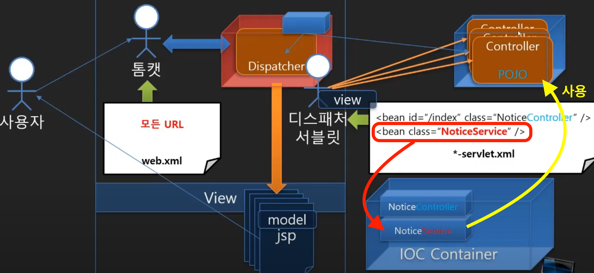

- dispatcher-servlet.xml

```xml
<?xml version="1.0" encoding="UTF-8"?>
<beans xmlns="http://www.springframework.org/schema/beans"
	xmlns:mvc="http://www.springframework.org/schema/mvc"
    xmlns:xsi="http://www.w3.org/2001/XMLSchema-instance"
    xsi:schemaLocation="http://www.springframework.org/schema/beans
        https://www.springframework.org/schema/beans/spring-beans.xsd
        http://www.springframework.org/schema/mvc
        https://www.springframework.org/schema/mvc/spring-mvc.xsd">
        

    <bean id="/index" class="com.newlecture.web.controller.IndexController" />  
    <bean id="/notice/list" class="com.newlecture.web.controller.notice.ListController">
      <!-- setter를 통해 DI 해주기 -->
    	<property name="noticeService" ref="noticeService" />
    </bean>  
    <bean id="/notice/detail" class="com.newlecture.web.controller.notice.DetailController" />  

	<bean
		class="org.springframework.web.servlet.view.UrlBasedViewResolver">
		<property name="viewClass"
			value="org.springframework.web.servlet.view.tiles3.TilesView" />
		<property name="order" value="1" />
	</bean>

	<bean
		class="org.springframework.web.servlet.view.tiles3.TilesConfigurer">
		<property name="definitions" value="/WEB-INF/tiles.xml" />
	</bean>

	<bean class="org.springframework.web.servlet.view.InternalResourceViewResolver">
		<property name="prefix" value="/WEB-INF/view/"></property>
		<property name="suffix" value=".jsp"></property>
		<property name="order" value="2" />
	</bean>
	
	<mvc:resources location="/static/" mapping="/**"></mvc:resources>
	<!-- bean 추가 -->
	<bean id="noticeService" class="com.newlecture.web.service.NoticeService" />
	
</beans>
```

- ListController.java
  - Setter 만들어서 noticeService 받기

```java
package com.newlecture.web.controller.notice;

import java.util.List;

import javax.servlet.http.HttpServletRequest;
import javax.servlet.http.HttpServletResponse;

import org.springframework.web.servlet.ModelAndView;
import org.springframework.web.servlet.mvc.Controller;

import com.newlecture.web.entity.Notice;
import com.newlecture.web.service.NoticeService;

public class ListController implements Controller{
	
	private NoticeService noticeService;
	
	public void setNoticeService(NoticeService noticeService) {
		this.noticeService = noticeService;
	}

	@Override
	public ModelAndView handleRequest(HttpServletRequest request, HttpServletResponse response) throws Exception {
		
		ModelAndView mv = new ModelAndView("notice.list");
//		ModelAndView mv = new ModelAndView("notice/list");
//		mv.setViewName("/WEB-INF/view/notice/list.jsp");
		
		List<Notice> list = noticeService.getList(1, "TITLE", "");
		mv.addObject("list", list);
		
		return mv;
	}

}

```

- list.jsp
  - JSTL 태그라이브러리 추가 

```jsp
<%@ page language="java" contentType="text/html; charset=UTF-8"
    pageEncoding="UTF-8"%>
<%@ taglib prefix="c" uri="http://java.sun.com/jsp/jstl/core" %>

<!-- 생략 -->

<c:forEach var="n" items="${list}">
  <tr>
    <td>${n.id}</td>
    <td class="title indent text-align-left"><a href="detail">${n.title}</a></td>
    <td>${n.writerId}</td>
    <td>
      ${n.regDate}
    </td>
    <td>${n.hit}</td>
  </tr>
</c:forEach>


<!-- 생략 -->
```

- 결과

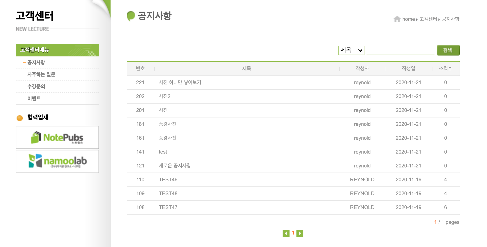


## 22. Service 객체 분리하기

- 보통 스프링을 통해 기업용 어플리케이션을 만들 때는 결합력을 낮추기 위해서 service를 controller가 직접 사용하지 않음
  - Service 객체를 분리해서 사용함

### 서비스 객체의 결합력을 낮추기

#### 서비스 객체를 다른 객체로 바꾸려면?

- Service 인터페이스를 하나 생성하고, 실제 구현되는 부분은 쉽게 갈아끼울 수 있도록 만들자

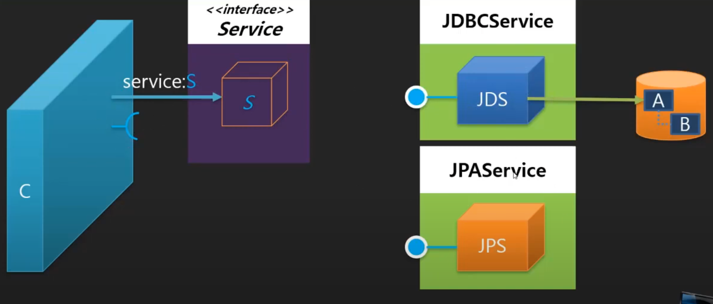

- 디렉토리 구조 변경
  - 기존의 NoticeService를 JDBCNoticeService로 변경
  - 이해를 돕기 위해 임시로 JPANoticeService 생성
    - JDBC뿐만 아니라 JPA나 mybatis와 같이 여러가지 기술이 사용될 수 있고, 이를 쉽게 변경할 수 있도록 결합력을 낮추는 과정에 대해 설명하고 있음
    - 나중에는 DAO라는 계층에서 데이터와 관련된 처리를 하기 때문에 DAO안에서 JDBC, JPA, Mabatis 등으로 나뉠 예정
    - 일단은 이해를 돕기 위해 만든 것이고 나중에 지워줄 것임
  - NoticeService를 인터페이스로 생성하고, JDBCNoticeService에 implements 해주자

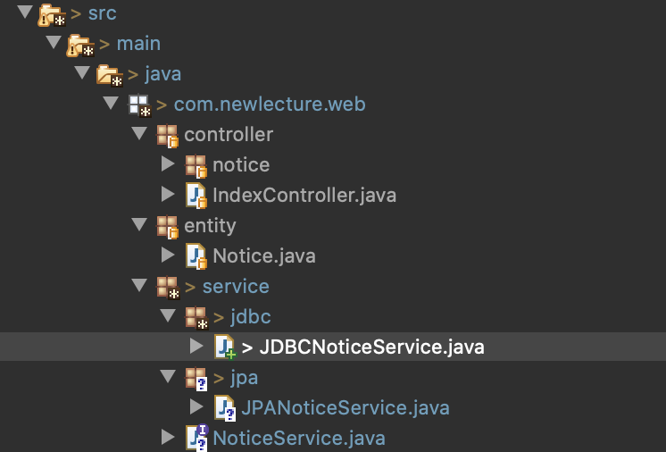

- NoticeService.java
  - JDBCNoticeService에서 구현하게 될 메소드들을 정의해줌

```java
package com.newlecture.web.service;

import java.sql.SQLException;
import java.util.List;

import com.newlecture.web.entity.Notice;

public interface NoticeService {

	List<Notice> getList(int page, String field, String query) throws ClassNotFoundException, SQLException;
	int getCount() throws ClassNotFoundException, SQLException;
	int insert(Notice notice) throws SQLException, ClassNotFoundException;
	int update(Notice notice) throws SQLException, ClassNotFoundException;
	int delete(int id) throws ClassNotFoundException, SQLException;
}

```

- ListController.java

```java
package com.newlecture.web.controller.notice;

import java.util.List;

import javax.servlet.http.HttpServletRequest;
import javax.servlet.http.HttpServletResponse;

import org.springframework.web.servlet.ModelAndView;
import org.springframework.web.servlet.mvc.Controller;

import com.newlecture.web.entity.Notice;
import com.newlecture.web.service.NoticeService;

public class ListController implements Controller{
	
	private NoticeService noticeService;
	
	public void setNoticeService(NoticeService noticeService) {
		this.noticeService = noticeService;
	}

	@Override
	public ModelAndView handleRequest(HttpServletRequest request, HttpServletResponse response) throws Exception {
		
		ModelAndView mv = new ModelAndView("notice.list");
		List<Notice> list = noticeService.getList(1, "TITLE", "");
		mv.addObject("list", list);
		
		return mv;
	}

}

```

- JDBCNoticeService.java
  - NoticeService 인터페이스를 상속
- Dispatcher-servlet.xml

```xml
<?xml version="1.0" encoding="UTF-8"?>
<beans xmlns="http://www.springframework.org/schema/beans"
	xmlns:mvc="http://www.springframework.org/schema/mvc"
    xmlns:xsi="http://www.w3.org/2001/XMLSchema-instance"
    xsi:schemaLocation="http://www.springframework.org/schema/beans
        https://www.springframework.org/schema/beans/spring-beans.xsd
        http://www.springframework.org/schema/mvc
        https://www.springframework.org/schema/mvc/spring-mvc.xsd">
        

    <bean id="/index" class="com.newlecture.web.controller.IndexController" />  
    <bean id="/notice/list" class="com.newlecture.web.controller.notice.ListController">
      <!-- 어떤 객체를 사용하던 상속한 인터페이스명을 사용하기 때문에 갈아끼울 수 있음 -->
    	<property name="noticeService" ref="noticeService" />
    </bean>  
    <bean id="/notice/detail" class="com.newlecture.web.controller.notice.DetailController" />  

	<bean
		class="org.springframework.web.servlet.view.UrlBasedViewResolver">
		<property name="viewClass"
			value="org.springframework.web.servlet.view.tiles3.TilesView" />
		<property name="order" value="1" />
	</bean>

	<bean
		class="org.springframework.web.servlet.view.tiles3.TilesConfigurer">
		<property name="definitions" value="/WEB-INF/tiles.xml" />
	</bean>

	<bean class="org.springframework.web.servlet.view.InternalResourceViewResolver">
		<property name="prefix" value="/WEB-INF/view/"></property>
		<property name="suffix" value=".jsp"></property>
		<property name="order" value="2" />
	</bean>
	
	<mvc:resources location="/static/" mapping="/**"></mvc:resources>
	
  <!-- 여기서 클래스를 변경해서 갈아끼울 수 있도록 만들어줌 -->
	<bean id="noticeService" class="com.newlecture.web.service.jdbc.JDBCNoticeService" />
	
</beans>
```


## 23. Connection 정보 분리하기

- Database 연결 정보를 별도의 클래스로 만들어서 분리하자
- 연결 정보를 분리하는 이유
  - 만약 DB 비밀번호를 주기적으로 변경해줘야한다면, 배포된 서비스(바이너리로 배포된 형태, 코드 형태가 아님)를 소스 코드를 수정하고 다시 배포해야됨
  - 만약 여러개의 DAO에 적어둔 연결 정보를 전부다 수정해줘야한다면? 굉장히 비효율적임
  - DB의 위치가 localhost가 별도의 DB를 사용한다면 그 부분도 수정하고 다시 배포해야함
- JDBCNoticeService.java

```java
package com.newlecture.web.service.jdbc;

import java.sql.Connection;
import java.sql.DriverManager;
import java.sql.PreparedStatement;
import java.sql.ResultSet;
import java.sql.SQLException;
import java.sql.Statement;
import java.util.ArrayList;
import java.util.Date;
import java.util.List;

// DB 연결 정보를 넣어주기 위한 인터페이스
import javax.sql.DataSource;

import com.newlecture.web.entity.Notice;
import com.newlecture.web.service.NoticeService;

public class JDBCNoticeService implements NoticeService {
//	private String url = "jdbc:oracle:thin:@localhost:1521/xepdb1";
//	private String uid = "NEWLEC";
//	private String pwd = "1234";
//	private String driver = "oracle.jdbc.driver.OracleDriver";
	
	private DataSource dataSource;
	
	public void setDataSource(DataSource dataSource) {
		this.dataSource = dataSource;
	}

	public List<Notice> getList(int page, String field, String query) throws ClassNotFoundException, SQLException{
		
		int start = 1 + (page-1)*10;     // 1, 11, 21, 31, ..
		int end = 10*page; // 10, 20, 30, 40...
		
		String sql = "SELECT * FROM NOTICE_VIEW WHERE "+field+" LIKE ? AND NUM BETWEEN ? AND ?";	
		
//		Class.forName(driver);
//		Connection con = DriverManager.getConnection(url,uid, pwd);
    // 이렇게 연결할 수 있음
		Connection con = dataSource.getConnection();
		PreparedStatement st = con.prepareStatement(sql);
		st.setString(1, "%"+query+"%");
		st.setInt(2, start);
		st.setInt(3, end);
		ResultSet rs = st.executeQuery();
		
		List<Notice> list = new ArrayList<Notice>();
		
		while(rs.next()){
		    int id = rs.getInt("ID");
		    String title = rs.getString("TITLE");
		    String writerId = rs.getString("WRITER_ID");
		    Date regDate = rs.getDate("REGDATE");
		    String content = rs.getString("CONTENT");
		    int hit = rs.getInt("hit");
		    String files = rs.getString("FILES");
		    
		    Notice notice = new Notice(
		    					id,
		    					title,
		    					writerId,
		    					regDate,
		    					content,
		    					hit,
		    					files
		    				);

		    list.add(notice);
		    
		}

		
		rs.close();
		st.close();
		con.close();
		
		return list;
	}
	
	// Scalar 
	public int getCount() throws ClassNotFoundException, SQLException {
		int count = 0;
		
		String sql = "SELECT COUNT(ID) COUNT FROM NOTICE";	
		
//		Class.forName(driver);
//		Connection con = DriverManager.getConnection(url,uid, pwd);
		Connection con = dataSource.getConnection();
		Statement st = con.createStatement();
		
		ResultSet rs = st.executeQuery(sql);
		
		if(rs.next())
			count = rs.getInt("COUNT");		
		
		rs.close();
		st.close();
		con.close();
		
		return count;
	}

	public int insert(Notice notice) throws SQLException, ClassNotFoundException {
		String title = notice.getTitle();
		String writerId = notice.getWriterId();
		String content = notice.getContent();
		String files = notice.getFiles();
		
		String url = "jdbc:oracle:thin:@localhost:1521/xepdb1";
		String sql = "INSERT INTO notice (    " + 
				"    title," + 
				"    writer_id," + 
				"    content," + 
				"    files" + 
				") VALUES (?,?,?,?)";	
		
//		Class.forName(driver);
//		Connection con = DriverManager.getConnection(url,uid, pwd);            
		Connection con = dataSource.getConnection();
		//Statement st = con.createStatement();
		//st.ex....(sql)
		PreparedStatement st = con.prepareStatement(sql);
		st.setString(1, title);
		st.setString(2, writerId);
		st.setString(3, content);
		st.setString(4, files);
		
		int result = st.executeUpdate();
		
		
		st.close();
		con.close();
		
		return result;
	}
	
	public int update(Notice notice) throws SQLException, ClassNotFoundException {
		String title = notice.getTitle();
		String content = notice.getContent();
		String files = notice.getFiles();
		int id = notice.getId();
		
		String url = "jdbc:oracle:thin:@localhost:1521/xepdb1";
		String sql = "UPDATE NOTICE " + 
				"SET" + 
				"    TITLE=?," + 
				"    CONTENT=?," + 
				"    FILES=?" + 
				"WHERE ID=?";
		
//		Class.forName(driver);
//		Connection con = DriverManager.getConnection(url,uid, pwd);    
		Connection con = dataSource.getConnection();
		//Statement st = con.createStatement();
		//st.ex....(sql)
		PreparedStatement st = con.prepareStatement(sql);
		st.setString(1, title);
		st.setString(2, content);
		st.setString(3, files);
		st.setInt(4, id);
		
		int result = st.executeUpdate();
				
		st.close();
		con.close();
		
		return result;
	}
	
	public int delete(int id) throws ClassNotFoundException, SQLException {
	
		String url = "jdbc:oracle:thin:@localhost:1521/xepdb1";
		String sql = "DELETE NOTICE WHERE ID=?";
		
//		Class.forName(driver);
//		Connection con = DriverManager.getConnection(url,uid, pwd);
		Connection con = dataSource.getConnection();
		//Statement st = con.createStatement();
		//st.ex....(sql)
		PreparedStatement st = con.prepareStatement(sql);		
		st.setInt(1, id);
		
		int result = st.executeUpdate();
				
		st.close();
		con.close();
		
		return result;
	}

}
```

- dispatcher-servlet.xml
  - dataSource 인터페이스를 상속한 DriverManagerDataSource객체에 DB 연결 정보들을 주입
  - 이를 JDBCNoticeService의 dataSource에 주입

```xml
<bean id="noticeService" class="com.newlecture.web.service.jdbc.JDBCNoticeService">
  <property name="dataSource" ref="dataSource" />
</bean>

<bean id="dataSource" class="org.springframework.jdbc.datasource.DriverManagerDataSource">
  <property name="driverClassName" value="oracle.jdbc.driver.OracleDriver"/>
  <property name="url" value="jdbc:oracle:thin:@localhost:1521/xepdb1" />
  <property name="username" value="NEWLEC" />
  <property name="password" value="1234" />
</bean>
```

- 여기서 DriverManagerDataSource이 클래스를 사용해야하기 때문에 라이브러리 추가해줘야함
- pom.xml

```xml
<!-- https://mvnrepository.com/artifact/org.springframework/spring-jdbc -->
<dependency>
  <groupId>org.springframework</groupId>
  <artifactId>spring-jdbc</artifactId>
  <version>5.2.9.RELEASE</version>
</dependency>
```


## 24. 스프링 설정 파일 분리하기

### 스프링 설정 파일 나누기

#### 스프링 설정 파일은 원하는 위치와 파일명으로 만들 수 있음

- 지금까지는 dispatcher-servlet.xml 이라는 파일에 설정을 했었음
  - WEB-INF 안에 둬야했고, 이름도 ooo-servlet.xml 이라는 파일명을 사용해야했음
- 이를 분리할 필요가 있음
  - 프로젝트를 보통 여러명에서 만들기 때문에 각 역할에 따라 설정파일을 나누는 것이 바람직
  - 만약 나누지 않고 한 파일에서 모두 다 처리하려면, 다른 사람이 처리하기까지 기다렸다가 처리해야하고, 여러명의 다루는 과정에서 문제가 발생할 수도 있음
- 이제부터 위치와 이름을 변경하는 방법을 알아보자

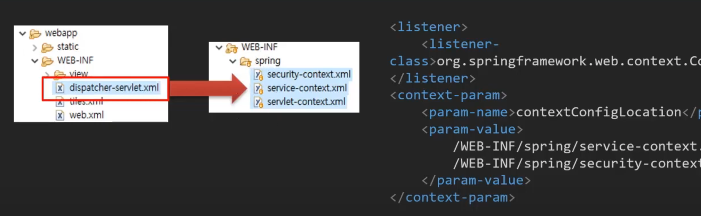

- service-context.xml
  - 서비스 관련 설정 부분만 가져오기

```xml
<?xml version="1.0" encoding="UTF-8"?>
<beans xmlns="http://www.springframework.org/schema/beans"
	xmlns:mvc="http://www.springframework.org/schema/mvc"
    xmlns:xsi="http://www.w3.org/2001/XMLSchema-instance"
    xsi:schemaLocation="http://www.springframework.org/schema/beans
        https://www.springframework.org/schema/beans/spring-beans.xsd
        http://www.springframework.org/schema/mvc
        https://www.springframework.org/schema/mvc/spring-mvc.xsd">
        
	<bean id="dataSource" class="org.springframework.jdbc.datasource.DriverManagerDataSource">
		<property name="driverClassName" value="oracle.jdbc.driver.OracleDriver"/>
		<property name="url" value="jdbc:oracle:thin:@localhost:1521/xepdb1" />
		<property name="username" value="NEWLEC" />
		<property name="password" value="1234" />
	</bean>
	
	<bean id="noticeService" class="com.newlecture.web.service.jdbc.JDBCNoticeService">
		<property name="dataSource" ref="dataSource" />
	</bean>
        
        
</beans>
```

- servlet-context.xml
  - 서비스 이외의 부분들 가져오기
  - 보안 관련 내용은 아직 안했으므로 security-context.xml는 비워둠 

```xml
<?xml version="1.0" encoding="UTF-8"?>
<beans xmlns="http://www.springframework.org/schema/beans"
	xmlns:mvc="http://www.springframework.org/schema/mvc"
    xmlns:xsi="http://www.w3.org/2001/XMLSchema-instance"
    xsi:schemaLocation="http://www.springframework.org/schema/beans
        https://www.springframework.org/schema/beans/spring-beans.xsd
        http://www.springframework.org/schema/mvc
        https://www.springframework.org/schema/mvc/spring-mvc.xsd">
        
    <bean id="/index" class="com.newlecture.web.controller.IndexController" />  
    <bean id="/notice/list" class="com.newlecture.web.controller.notice.ListController">
    	<property name="noticeService" ref="noticeService" />
    </bean>  
    <bean id="/notice/detail" class="com.newlecture.web.controller.notice.DetailController" />  

	<bean
		class="org.springframework.web.servlet.view.UrlBasedViewResolver">
		<property name="viewClass"
			value="org.springframework.web.servlet.view.tiles3.TilesView" />
		<property name="order" value="1" />
	</bean>

	<bean
		class="org.springframework.web.servlet.view.tiles3.TilesConfigurer">
		<property name="definitions" value="/WEB-INF/tiles.xml" />
	</bean>

	<bean class="org.springframework.web.servlet.view.InternalResourceViewResolver">
		<property name="prefix" value="/WEB-INF/view/"></property>
		<property name="suffix" value=".jsp"></property>
		<property name="order" value="2" />
	</bean>
	
	<mvc:resources location="/static/" mapping="/**"></mvc:resources>
	
</beans>
```

- dispatcher-servlet.xml은 지워도되지만, 그냥 확장자명을 임의로 바꿔두자
- web.xml
  - 이전에는 dispatcher 서블릿을 사용할 때, 설정 파일의 위치에 대한 내용을 정해주지 않았음
    - 그래서 위치나 이름을 약속으로 정해진대로 해줬어야했음
  - 파일명이나 위치를 바꾸게 되면 그걸 여기서 표시해줘야함

```xml
<?xml version="1.0" encoding="UTF-8"?>

<web-app xmlns="http://xmlns.jcp.org/xml/ns/javaee"
	xmlns:xsi="http://www.w3.org/2001/XMLSchema-instance"
	xsi:schemaLocation="http://xmlns.jcp.org/xml/ns/javaee
                      http://xmlns.jcp.org/xml/ns/javaee/web-app_4_0.xsd"
	version="4.0" metadata-complete="true">

	<!-- 스프링이 제공하는 listener -->
  <!-- 톰캣이 시작될때, 끝날때, 세션이 시작될때, 끝날때 등 어떤 시점에 무언가 행위를 할 수 있는 이벤트를 처리할 때 사용하는 것 -->
  <!-- ContextLoaderListener는 context-param으로 파라미터를 가질 수 있음 -->
  <!-- ContextLoaderListener를 DispatcherServlet가 쓸 수 있음 -->
  <!-- DispatcherServlet가 context-param를 사용할 수가 있음 -->
	<listener>
		<listener-class>org.springframework.web.context.ContextLoaderListener</listener-class>
	</listener>
	<context-param>
		<param-name>contextConfigLocation</param-name>
		<param-value>
			/WEB-INF/spring/service-context.xml
			/WEB-INF/spring/security-context.xml
		</param-value>
	</context-param>
	
	<servlet>
		<servlet-name>dispatcher</servlet-name>
		<servlet-class>org.springframework.web.servlet.DispatcherServlet</servlet-class>
    <!-- DispatcherServlet가 알아볼 수 있도록 정해진 형식으로 적어줘야함 -->
		<init-param>
      <!-- 여기서는 하나만 지정해줄 수 있음, 스프링이 제공하는 listener를 사용하자(위쪽에 있음) -->
			<param-name>contextConfigLocation</param-name>
			<param-value>/WEB-INF/spring/servlet-context.xml</param-value>
		</init-param>
    <!-- servlet은 언제 실행되나? 언제 servlet객체가 메모리에 올라가나?
    모든 servlet은 url 매핑이 되어있음, 첫번째 url 요청이 있을 때 메모리에 올라감
    그런데 DispatcherServlet의 경우에는 설정을 가지고 있는 서블릿이다보니 
		첫번째 요청이 올 때 메모리에 올라가면 너무 느림
		그래서 미리 올라가 있도록 할 수 있으면 좋을 것 같다, 톰캣이 시작될 때 서블릿을 바로 로드할 수 있도록 설정해줌
 		우선순위를 지정할 수도 있음
    -->
		<load-on-startup>1</load-on-startup>
    <!-- 다른 서블릿들과 연관되어 차례로 하나하나 로드되지 않고, 비동기적으로 로드될 수 있도록 설정 -->
		<async-supported>true</async-supported>
	</servlet>
  <!-- 변경 전
  <servlet>
		<servlet-name>dispatcher</servlet-name>
		<servlet-class>org.springframework.web.servlet.DispatcherServlet</servlet-class>
	</servlet>
  -->
	<servlet-mapping>
		<servlet-name>dispatcher</servlet-name>
		<url-pattern>/</url-pattern>
	</servlet-mapping>

	<display-name>Welcome to Tomcat</display-name>
	<description>
     Welcome to Tomcat
 	</description>


</web-app>

```


## 25. 객체 DI를 Annotation으로 변경하기

### 자바 프로그램의 초기화 또는 설정 파일

- 자바 프로그램 보통 xml이나 어노테이션을 사용해서 외부설정을 함
- 스프링도 2버전 이상부터는 어노테이션을 지원해서 요즘에는 대부분 어노테이션을 사용함
- 최근에는 외부설정파일로 properties같은 경량화된 파일형태로도 사용한다고 함

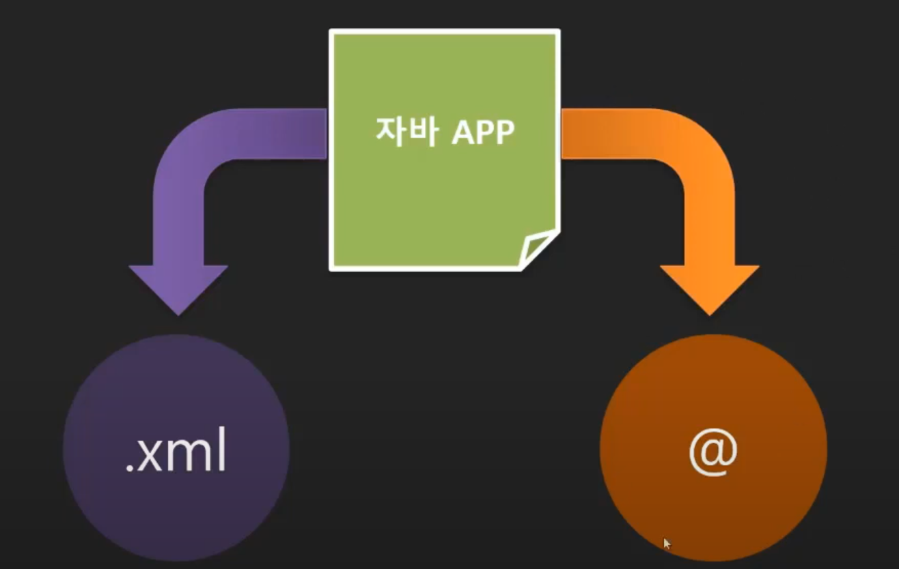

- servlet-context.xml
  - annotation-config 사용

```xml
<?xml version="1.0" encoding="UTF-8"?>
<beans xmlns="http://www.springframework.org/schema/beans"
	xmlns:mvc="http://www.springframework.org/schema/mvc"
	xmlns:context="http://www.springframework.org/schema/context"
    xmlns:xsi="http://www.w3.org/2001/XMLSchema-instance"
    xsi:schemaLocation="http://www.springframework.org/schema/beans
        https://www.springframework.org/schema/beans/spring-beans.xsd
        http://www.springframework.org/schema/mvc
        https://www.springframework.org/schema/mvc/spring-mvc.xsd
        http://www.springframework.org/schema/context
        https://www.springframework.org/schema/context/spring-context.xsd">
        
    <context:annotation-config />
    
    <bean id="/index" class="com.newlecture.web.controller.IndexController" />  
    <bean id="/notice/list" class="com.newlecture.web.controller.notice.ListController">
      <!-- setter를 통해서 객체 주입하는 부분을 annotation으로 처리 -->
    	<!-- <property name="noticeService" ref="noticeService" /> -->
    </bean>  
    <bean id="/notice/detail" class="com.newlecture.web.controller.notice.DetailController" />  

	<bean
		class="org.springframework.web.servlet.view.UrlBasedViewResolver">
		<property name="viewClass"
			value="org.springframework.web.servlet.view.tiles3.TilesView" />
		<property name="order" value="1" />
	</bean>

	<bean
		class="org.springframework.web.servlet.view.tiles3.TilesConfigurer">
		<property name="definitions" value="/WEB-INF/tiles.xml" />
	</bean>

	<bean class="org.springframework.web.servlet.view.InternalResourceViewResolver">
		<property name="prefix" value="/WEB-INF/view/"></property>
		<property name="suffix" value=".jsp"></property>
		<property name="order" value="2" />
	</bean>
	
	<mvc:resources location="/static/" mapping="/**"></mvc:resources>
	
</beans>
```

- ListController.java

```java
package com.newlecture.web.controller.notice;

import java.util.List;

import javax.servlet.http.HttpServletRequest;
import javax.servlet.http.HttpServletResponse;

import org.springframework.beans.factory.annotation.Autowired;
import org.springframework.web.servlet.ModelAndView;
import org.springframework.web.servlet.mvc.Controller;

import com.newlecture.web.entity.Notice;
import com.newlecture.web.service.NoticeService;

public class ListController implements Controller{
	
   // 여기에 달면 기본생성자를 통해 주입되기 때문에 굳이 setter를 쓸 필요가 없음
	@Autowired
	private NoticeService noticeService;
	
  // 여기에 달아줘도 되지만, 객체가 주입되면서 다른 처리를 함께 해주는게 아니면 굳이 여기에 달 필요가 없음
//	public void setNoticeService(NoticeService noticeService) {
//		this.noticeService = noticeService;
//	}

	@Override
	public ModelAndView handleRequest(HttpServletRequest request, HttpServletResponse response) throws Exception {
		
		ModelAndView mv = new ModelAndView("notice.list");
		
		List<Notice> list = noticeService.getList(1, "TITLE", "");
		mv.addObject("list", list);
		
		return mv;
	}

}

```

- service-context.xml

```xml
<?xml version="1.0" encoding="UTF-8"?>
<beans xmlns="http://www.springframework.org/schema/beans"
	xmlns:mvc="http://www.springframework.org/schema/mvc"
	xmlns:context="http://www.springframework.org/schema/context"
    xmlns:xsi="http://www.w3.org/2001/XMLSchema-instance"
    xsi:schemaLocation="http://www.springframework.org/schema/beans
        https://www.springframework.org/schema/beans/spring-beans.xsd
        http://www.springframework.org/schema/mvc
        https://www.springframework.org/schema/mvc/spring-mvc.xsd
        http://www.springframework.org/schema/context
        https://www.springframework.org/schema/context/spring-context.xsd">
        
    <context:annotation-config />
        
	<bean id="dataSource" class="org.springframework.jdbc.datasource.DriverManagerDataSource">
		<property name="driverClassName" value="oracle.jdbc.driver.OracleDriver"/>
		<property name="url" value="jdbc:oracle:thin:@localhost:1521/xepdb1" />
		<property name="username" value="NEWLEC" />
		<property name="password" value="1234" />
	</bean>
	
	<bean id="noticeService" class="com.newlecture.web.service.jdbc.JDBCNoticeService">
		<!-- <property name="dataSource" ref="dataSource" /> -->
	</bean>
        
        
</beans>
```

- JDBCNoticeService.java

```java
	// 생략

	@Autowired
	private DataSource dataSource;
	
//	public void setDataSource(DataSource dataSource) {
//		this.dataSource = dataSource;
//	}


	// 생략
```


## 26. Annotation으로 서비스 객체 생성하기

- service-context.xml

```xml
<?xml version="1.0" encoding="UTF-8"?>
<beans xmlns="http://www.springframework.org/schema/beans"
	xmlns:mvc="http://www.springframework.org/schema/mvc"
	xmlns:context="http://www.springframework.org/schema/context"
    xmlns:xsi="http://www.w3.org/2001/XMLSchema-instance"
    xsi:schemaLocation="http://www.springframework.org/schema/beans
        https://www.springframework.org/schema/beans/spring-beans.xsd
        http://www.springframework.org/schema/mvc
        https://www.springframework.org/schema/mvc/spring-mvc.xsd
        http://www.springframework.org/schema/context
        https://www.springframework.org/schema/context/spring-context.xsd">
        
  	<!-- 해당 패키지에서 component를 스캔하면서 Autowired도 확인하기 때문에 밑에꺼는 없애줘도 됨 -->
    <!-- <context:annotation-config /> -->
    <context:component-scan base-package="com.newlecture.web.service" />
        
	<bean id="dataSource" class="org.springframework.jdbc.datasource.DriverManagerDataSource">
		<property name="driverClassName" value="oracle.jdbc.driver.OracleDriver"/>
		<property name="url" value="jdbc:oracle:thin:@localhost:1521/xepdb1" />
		<property name="username" value="NEWLEC" />
		<property name="password" value="1234" />
	</bean>
	
  <!-- Service 객체를 생성하는 것까지 어노테이션으로 처리 -->
	<!-- <bean id="noticeService" class="com.newlecture.web.service.jdbc.JDBCNoticeService">
		<property name="dataSource" ref="dataSource" />
	</bean> -->
        
        
</beans>
```

- JDBCNoticeService.java

```java
//@Component를 써도 되지만, 좀 더 의미에 맞도록 @Service를 사용하자
@Service
public class JDBCNoticeService implements NoticeService {
	// 생략
}
```


## 27. Annotation으로 URL 매핑하기


## 참고

- 유튜브 채널 - 뉴렉처
  - 스프링 프레임워크 강좌/강의
  - https://www.youtube.com/watch?v=XtXHIDnzS9c&list=PLq8wAnVUcTFUHYMzoV2RoFoY2HDTKru3T

