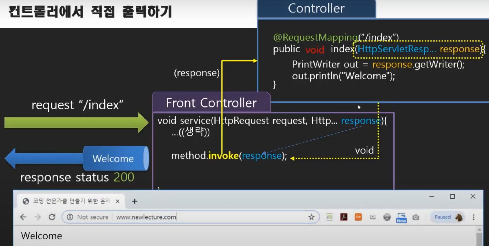
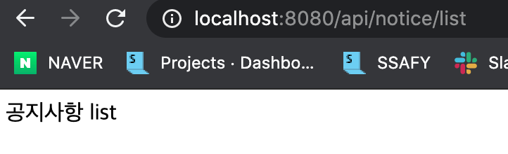

# Spring Framework and Boot 학습 6 - Spring MVC


## 31. 문서 출력방법 4가지

- 스프링을 통해서 컨트롤러에서 출력하는 방법에는 4가지가 있음

### 문서 출력 방법 4가지

- 이때까지 배운 내용은 두 가지
  1. ResourceViewResolver를 이용한 문서 출력하기
  2. TilesViewResolver를 이용한 문서 출력하기
- 문서가 아니라 단순히 문자열을 출력하고자 할때의 방법 두 가지 
  3. 서블릿 객체를 얻어서 문자열 출력하기
  4. @ResponseBody 설정을 통한 문자열 출력하기

### 서블릿 객체를 얻어서 문자열 출력하기

- 컨트롤러의 메소드가 매개변수를 가지고 있을 경우, Front Controller는 자기가 해당 매개변수를 제공해줄 수 있는지 확인해서 가능하다면 매개값을 넘겨줌
- HttpServletResponse response 객체를 전달해줌



- HomeController.java

```java
package com.newlecture.web.controller;

@Controller
@RequestMapping("/")
public class HomeController {
  
@RequestMapping("index")
  // void를 사용한다는 것은 resolver를 사용하지 않겠다는 의미
  // void를 해도 스프링이 알아서 resolver를 통해서 해당 위치를 찾고 문서를 출력해주긴 하지만, 원래 문서를 출력할려면
  // 반환타입을 String으로 해서 문서에 접근할 수 있도록 해주는 것이 바람직한 듯 
	public void index(HttpServletResponse response) {
		PrintWriter out;
		try {
			out = response.getWriter();
			out.println("Hello Index");
		} catch (IOException e) {
			// TODO Auto-generated catch block
			e.printStackTrace();
		}
	}
}
```

### @ResponseBody 설정을 통한 문자열 출력하기

- 단순히 문자열만 출력하려면 위의 방법보다 더 쉬운 방법이 있음
- @ResponseBody를 달아주면 해당 String 값이 문서출력을 위한 것이 아니라 단순 문자열임을 의미함
- HomeController.java

```java
package com.newlecture.web.controller;

@Controller
@RequestMapping("/")
public class HomeController {
	
	@RequestMapping("index")
	@ResponseBody
	public String index() {
		
		return "Hello Index !!";
		
	}
}

```


## 32. @RestContoller와 한글 출력 설정

- RestController는 문서를 만들어서 제공해주는 것이 아니라 주로 데이터를 제공해주는 역할을 수행할 때 사용하는 컨트롤임
- 이거를 사용할 때 한글 출력 부분에서 문제가 발생함
- 어떻게 해결할 수 있을지 알아보자
- controller 패키지에 api 패키지를 추가하고, 그 안에 NoticeController.java를 추가하자

```java
package com.newlecture.web.controller.api;

import org.springframework.web.bind.annotation.RequestMapping;
import org.springframework.web.bind.annotation.RestController;

// customer의 NoticeController와 겹치기 때문에 id를 따로 지정해줌
// @RestController를 사용하면 @ResponseBody를 메소드에 달아주는 것과 동일함
@RestController("apiNoticeController")
@RequestMapping("/api/notice/")
public class NoticeController {

	@RequestMapping("list")
	public String list() {
		// 한글 출력에서 문제가 발생함
		return "공지사항 list";
	}
	
}

```

- servlet-context.xml
  - mvc:annotation-driven에서 메소드와 url을 매핑하는 과정에 대한 설정을 해줄 수 있음
  - 여러개의 converter를 통해 설정할 수 있음
  - StringHttpMessageConverter는 @ResponseBody로 String 처리하는 과정에서의 설정을 할 수 있음

```xml
<?xml version="1.0" encoding="UTF-8"?>
<beans xmlns="http://www.springframework.org/schema/beans"
       xmlns:mvc="http://www.springframework.org/schema/mvc"
       xmlns:context="http://www.springframework.org/schema/context"
       xmlns:xsi="http://www.w3.org/2001/XMLSchema-instance"
       xsi:schemaLocation="http://www.springframework.org/schema/beans
                           https://www.springframework.org/schema/beans/spring-beans.xsd
                           http://www.springframework.org/schema/mvc
                           https://www.springframework.org/schema/mvc/spring-mvc.xsd
                           http://www.springframework.org/schema/context
                           https://www.springframework.org/schema/context/spring-context.xsd">

  <context:component-scan base-package="com.newlecture.web.controller" />
	
	<mvc:annotation-driven>
		<mvc:message-converters> <!-- @ResponseBody로 String 처리할때 한글처리 -->
			<bean class="org.springframework.http.converter.StringHttpMessageConverter">
				<property name="supportedMediaTypes">
					<list>
						<value>text/html;charset=UTF-8</value>
					</list>
				</property>
			</bean>
		</mvc:message-converters>
	</mvc:annotation-driven>
	
</beans>
```

- 결과




## 33. JSON 출력하기


## 참고

- 유튜브 채널 - 뉴렉처
  - 스프링 프레임워크 강좌/강의
  - https://www.youtube.com/watch?v=XtXHIDnzS9c&list=PLq8wAnVUcTFUHYMzoV2RoFoY2HDTKru3T

