# Spring Framework and Boot 학습 6 - Spring MVC


## 31. 문서 출력방법 4가지

- 스프링을 통해서 컨트롤러에서 출력하는 방법에는 4가지가 있음

### 문서 출력 방법 4가지

- 이때까지 배운 내용은 두 가지
  1. ResourceViewResolver를 이용한 문서 출력하기
  2. TilesViewResolver를 이용한 문서 출력하기
- 문서가 아니라 단순히 문자열을 출력하고자 할때의 방법 두 가지 
  3. 서블릿 객체를 얻어서 문자열 출력하기
  4. @ResponseBody 설정을 통한 문자열 출력하기

### 서블릿 객체를 얻어서 문자열 출력하기

- 컨트롤러의 메소드가 매개변수를 가지고 있을 경우, Front Controller는 자기가 해당 매개변수를 제공해줄 수 있는지 확인해서 가능하다면 매개값을 넘겨줌
- HttpServletResponse response 객체를 전달해줌


- HomeController.java

```java
package com.newlecture.web.controller;

@Controller
@RequestMapping("/")
public class HomeController {
  
@RequestMapping("index")
  // void를 사용한다는 것은 resolver를 사용하지 않겠다는 의미
  // void를 해도 스프링이 알아서 resolver를 통해서 해당 위치를 찾고 문서를 출력해주긴 하지만, 원래 문서를 출력할려면
  // 반환타입을 String으로 해서 문서에 접근할 수 있도록 해주는 것이 바람직한 듯 
	public void index(HttpServletResponse response) {
		PrintWriter out;
		try {
			out = response.getWriter();
			out.println("Hello Index");
		} catch (IOException e) {
			// TODO Auto-generated catch block
			e.printStackTrace();
		}
	}
}
```

### @ResponseBody 설정을 통한 문자열 출력하기

- 단순히 문자열만 출력하려면 위의 방법보다 더 쉬운 방법이 있음
- @ResponseBody를 달아주면 해당 String 값이 문서출력을 위한 것이 아니라 단순 문자열임을 의미함
- HomeController.java

```java
package com.newlecture.web.controller;

@Controller
@RequestMapping("/")
public class HomeController {
	
	@RequestMapping("index")
	@ResponseBody
	public String index() {
		
		return "Hello Index !!";
		
	}
}

```


## 32. @RestContoller와 한글 출력 설정

- RestController는 문서를 만들어서 제공해주는 것이 아니라 주로 데이터를 제공해주는 역할을 수행할 때 사용하는 컨트롤임
- 이거를 사용할 때 한글 출력 부분에서 문제가 발생함
- 어떻게 해결할 수 있을지 알아보자
- controller 패키지에 api 패키지를 추가하고, 그 안에 NoticeController.java를 추가하자

```java
package com.newlecture.web.controller.api;

import org.springframework.web.bind.annotation.RequestMapping;
import org.springframework.web.bind.annotation.RestController;

// customer의 NoticeController와 겹치기 때문에 id를 따로 지정해줌
// @RestController를 사용하면 @ResponseBody를 메소드에 달아주는 것과 동일함
@RestController("apiNoticeController")
@RequestMapping("/api/notice/")
public class NoticeController {

	@RequestMapping("list")
	public String list() {
		// 한글 출력에서 문제가 발생함
		return "공지사항 list";
	}
	
}

```

- servlet-context.xml
  - mvc:annotation-driven에서 메소드와 url을 매핑하는 과정에 대한 설정을 해줄 수 있음
  - 여러개의 converter를 통해 설정할 수 있음
  - StringHttpMessageConverter는 @ResponseBody로 String 처리하는 과정에서의 설정을 할 수 있음

```xml
<?xml version="1.0" encoding="UTF-8"?>
<beans xmlns="http://www.springframework.org/schema/beans"
       xmlns:mvc="http://www.springframework.org/schema/mvc"
       xmlns:context="http://www.springframework.org/schema/context"
       xmlns:xsi="http://www.w3.org/2001/XMLSchema-instance"
       xsi:schemaLocation="http://www.springframework.org/schema/beans
                           https://www.springframework.org/schema/beans/spring-beans.xsd
                           http://www.springframework.org/schema/mvc
                           https://www.springframework.org/schema/mvc/spring-mvc.xsd
                           http://www.springframework.org/schema/context
                           https://www.springframework.org/schema/context/spring-context.xsd">

  <context:component-scan base-package="com.newlecture.web.controller" />
	
	<mvc:annotation-driven>
		<mvc:message-converters> <!-- @ResponseBody로 String 처리할때 한글처리 -->
			<bean class="org.springframework.http.converter.StringHttpMessageConverter">
				<property name="supportedMediaTypes">
					<list>
						<value>text/html;charset=UTF-8</value>
					</list>
				</property>
			</bean>
		</mvc:message-converters>
	</mvc:annotation-driven>
	
</beans>
```

- 결과


## 33. JSON 출력하기

- 이번에는 단순 문자열이 아니라 객체(데이터, model)를 반환해보자
- 여기서 객체를 보낸다는 것은 객체 형태의 데이터를 문자열로 보낸다는 의미

### 데이터를 구분하기 위한 표현방법

#### XML, CSV, JSON

- CSV는 콤마로 구분하기 때문에 순서를 나타내기에는 용이하지만, 중첩된 구분을 하기가 어려움
- XML은 데이터의 데이터, 즉, 메타데이터를 함께 나타내서 보낼 수 있기 때문에 중첩이 깊어져도 적절하게 형태를 만들어낼 수 있음
  - 하지만, 태그라는 것을 여러개 쓰다보니, 데이터가 비대한 느낌이 있음
  - 성능도 느리기 때문에 좀 더 경량화할 필요를 느낌
  - 그래서 요즘에는 JSON을 많이 사용하고 있음
- JSON은 메타데이터도 함께 표현할 수 있으면서, 경량화되어있음
  - 원래는 Javascript에서 객체를 표현하는 방식이었는데, 요즘에는 이렇게 사용범위가 넓어졌음
  - 서버에서 클라이언트에게 데이터를 보낼 때 가장 많이 사용하는 방식이 되었음

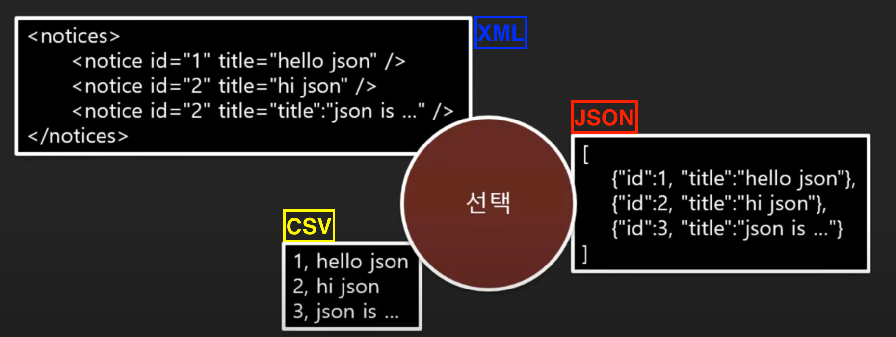

### 공지사항 목록을 JSON으로 반환하기 위한 컨트롤러

- 그냥 list 객체를 반환하면 어떻게 될까?

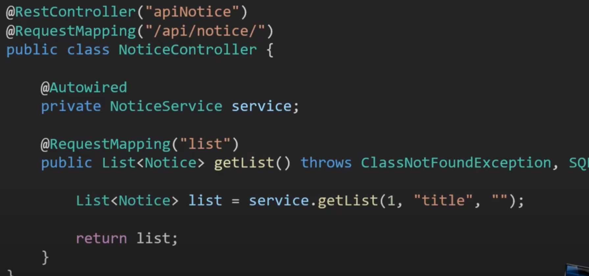

- pom.xml에 라이브러리 추가

```xml
<dependency>
  <groupId>com.fasterxml.jackson.core</groupId>
  <artifactId>jackson-databind</artifactId>
  <version>2.11.2</version>
</dependency>
```

- NoticeController.java

```java
package com.newlecture.web.controller.api;

import java.sql.SQLException;
import java.util.List;

import org.springframework.beans.factory.annotation.Autowired;
import org.springframework.web.bind.annotation.RequestMapping;
import org.springframework.web.bind.annotation.RestController;

import com.newlecture.web.entity.Notice;
import com.newlecture.web.service.NoticeService;

@RestController("apiNoticeController")
@RequestMapping("/api/notice/")
public class NoticeController {
	
	@Autowired
	private NoticeService service;

	@RequestMapping("list")
	public List<Notice> list() throws ClassNotFoundException, SQLException {
		
		List<Notice> list = service.getList(1, "title", "");
		
		return list;
	}
	
}

```

- 결과
  - 스프링이 알아서 객체를 JSON으로 변환해서 반환해줌
  - 지난 챕터에서 annotation-driven 태그에서 UTF-8을 지원하는 컨버터를 달았었는데, 그 위치에 JSON 변환 컨버터가 미리 추가 되어 있기 때문임
    - MessageConverter가 내장되어있음

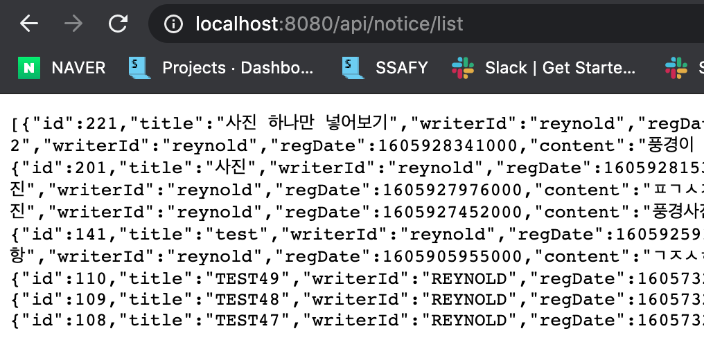


## 34. 지금까지 다루었던 내용과 이번에 다루게 될 사용자 입력 5가지

### 지금까지

#### 컨트롤러 URL 매핑과 사용자 출력

- 지금까지 스프링MVC를 학습했었음
- 스프링MVC라는 것은 Front Controller가 제공하는 기능을(라이브러리 형태로) 쓴다는 것
- 매핑, 출력까지 알아봤고, 앞으로는 입력에 대해 알아볼 것임
  - 출력은 JSP를 통해 html문서를 출력하는 방식(Resource ViewResolver/Tiles ViewResolver를 사용했음)과 문자열 출력, JSON형태의 문자열 출력 등이 있었음
- 매핑, 출력, 입력까지가 스프링MVC가 제공해주는 기능임

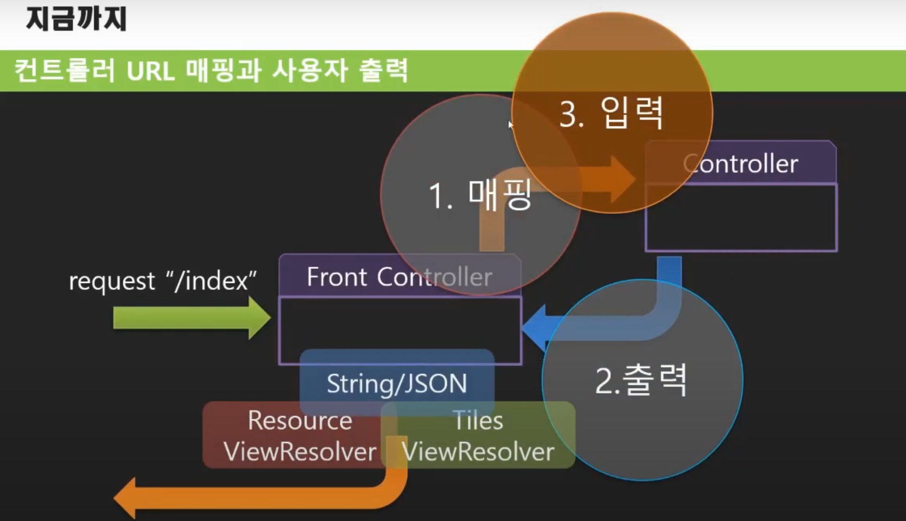

- DI, AOP, Transaction 처리 등은 스프링이 제공해주는 기능

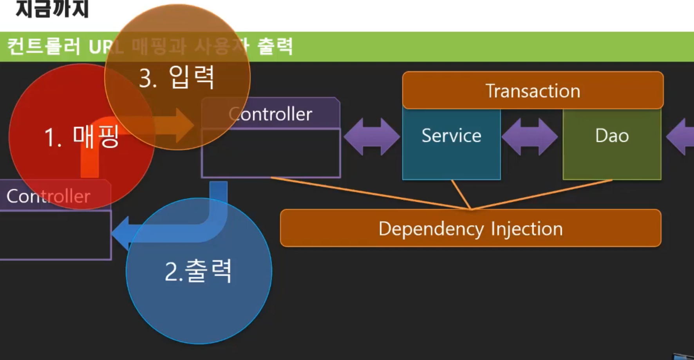

### 사용자로부터 전달되는 값

#### 값의 종류

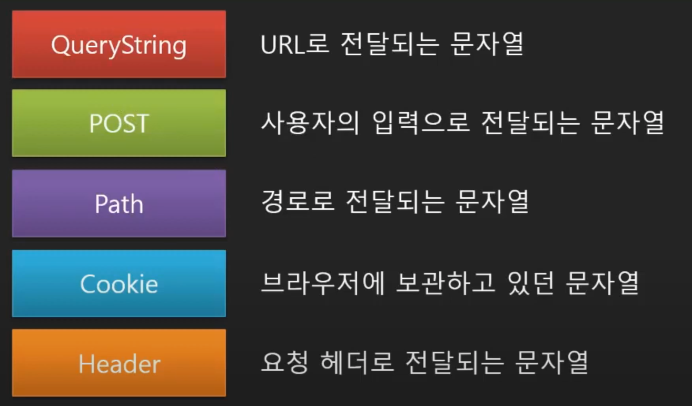


## 35. QueryString 입력 #1

### 입력 도구를 얻어오는 방법

- request라는 변수를 매개변수로 받고자하면 Front Controller가 그 값을 전달해줌
- 하지만, 이것보다 더 편하게 값을 받아오는 방법이 있음

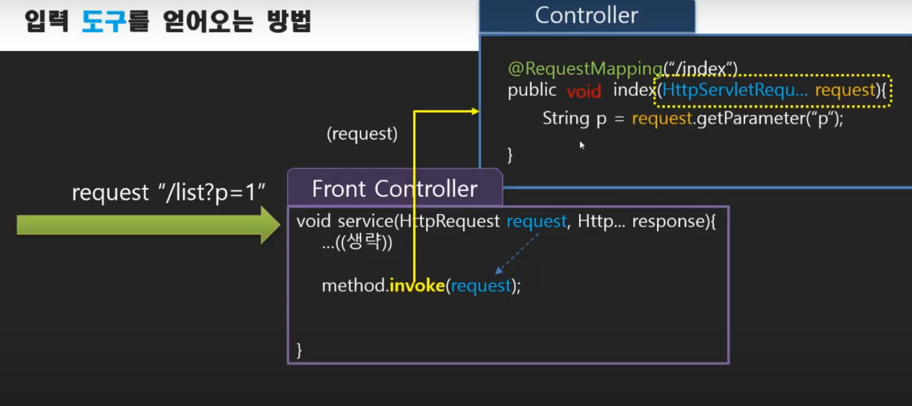

### 입력 값을 얻어오는 방법

- 쿼리스트링에서 받고자하는 값의 변수명을 매개변수로하면 그 값을 바로 받을 수 있음


- NoticeController.java

```java
package com.newlecture.web.controller.customer;

import java.sql.SQLException;
import java.util.List;

import javax.servlet.http.HttpServletRequest;

import org.springframework.beans.factory.annotation.Autowired;
import org.springframework.stereotype.Controller;
import org.springframework.web.bind.annotation.RequestMapping;

import com.newlecture.web.entity.Notice;
import com.newlecture.web.service.NoticeService;

@Controller
@RequestMapping("/customer/notice/")
public class NoticeController {
	
	@Autowired
	private NoticeService noticeService;
	
	@RequestMapping("list")
	public String list(String p) throws ClassNotFoundException, SQLException {
//    매개변수로 HttpServletRequest request를 받았을 경우에는 이렇게 할 수 있음
//		String p = request.getParameter("p");
		System.out.println("page: " + p);
		
		List<Notice> list = noticeService.getList(1, "TITLE", "");
		
		return "notice.list";
	}
	
	@RequestMapping("detail")
	public String detail() {
		
		return "notice.detail";
	}
	
}

```


## 36. QueryString 입력 #2 : 변수명 별칭과 기본값 처리

### 입력 값 얻어오는 방법

- URL의 경우에는 길이 제한이 있기 때문에 최대한 변수명을 줄일려고 하지만, 코드 단에서는 명확한 변수명을 쓰는것이 더 바람직함
- @RequestParam(기존 변수명)을 사용해서 해결할 수 있음 

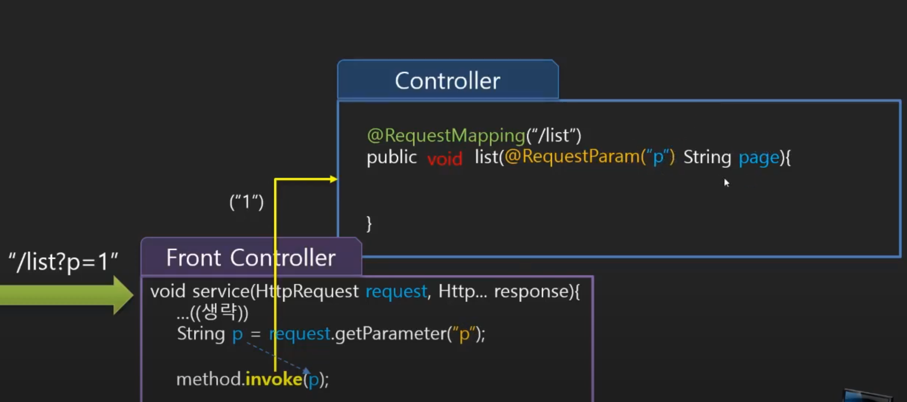

- NoticeController.java

```java
package com.newlecture.web.controller.customer;

import java.sql.SQLException;
import java.util.List;

import javax.servlet.http.HttpServletRequest;

import org.springframework.beans.factory.annotation.Autowired;
import org.springframework.stereotype.Controller;
import org.springframework.web.bind.annotation.RequestMapping;
import org.springframework.web.bind.annotation.RequestParam;

import com.newlecture.web.entity.Notice;
import com.newlecture.web.service.NoticeService;

@Controller
@RequestMapping("/customer/notice/")
public class NoticeController {
	
	@Autowired
	private NoticeService noticeService;
	
	@RequestMapping("list")
  // name으로 초기 변수명을, defaultValue로 초기값을 지정해줄 수 있음
  // 원래 쿼리스트링으로 받는 값은 모두 String인데 밑에처럼 int로 매개변수타입을 지정해주면 스프링이 알아서 int로 변환해서 전달해줌
	public String list(@RequestParam(name = "p", defaultValue = "1") int page) throws ClassNotFoundException, SQLException {

		System.out.println("page: " + page);
		
		List<Notice> list = noticeService.getList(1, "TITLE", "");
		
		return "notice.list";
	}
	
	@RequestMapping("detail")
	public String detail() {
		
		return "notice.detail";
	}
	
}

```


## 37. @RequestParam Optional 속성

- @RequestParam에는 4가지 옵션이 있음
  - name
    - 기존에 넘겨받을 변수의 이름
  - defaultValue
    - 초기값 설정
  - required
    - 초기값을 설정하지 않았을 경우에는 에러가 나왔었는데, required가 true로 설정되어있기 때문임
    - 만약 false로 지정하면 초기값을 지정하지 않더라도 값이 없음을 뜻하는 null값으로 전달됨
    - 다만, null값으로 전달받기위해서 Integer나 String 처럼 null값을 가질 수 있는 변수타입을 적어줘야함
  - value
    - name과 동일한 역할을 함
    - 다만, name과 value 중에서 하나만 사용해야함


## 38. POST 입력을 위한 Admin 컨트롤러 추가하기

- admin 패키지 생성, 내부에 board 패키지 생성
- NoticeController.java 생성
  - 일단 CRUD기능을 위한 메소드들은 만들어두고, reg를 통해 입력값을 받는 것을 학습해보자

```java
package com.newlecture.web.controller.admin.board;

import org.springframework.stereotype.Controller;
import org.springframework.web.bind.annotation.RequestMapping;
import org.springframework.web.bind.annotation.ResponseBody;

@Controller("adminNoticeController")
@RequestMapping("/admin/board/notice/")
public class NoticeController {

	@RequestMapping("list")
	public String list() {
		
		return "";
	}

	@RequestMapping("reg")
	@ResponseBody
	public String reg() {
		
		return "reg";
	}
	
	@RequestMapping("edit")
	public String edit() {
		
		return "";
	}
	
	@RequestMapping("del")
	public String del() {
		
		return "";
	}
	
}
```


## 39. POST 입력방법 #1

- jsp로 등록 페이지를 만들기 전에 저번에 다운받았던 html 파일을 사용해서 입력 처리를 학습해보자
- servlet-content.xml에서 정적인 리소스들을 처리하는 설정을 해준 적이 있음
  - url 요청을 받으면 먼저 동적인 처리가 필요한지 controller들을 찾아보고 만약 없으면 static 폴더 내부를 찾아보게 됨
  - static으로 요청하지 않고 루트 경로로 요청하는 것처럼 설정해줬음
  - 만약 reg.html을 요청하려면 /static/admin/board/notice/reg.html을 요청하는 것이 아니라
  - /admin/board/notice/reg.html로 요청하면 됨
    - 그런데 여기서 문제가 생김

```xml
<mvc:resources location="/static/" mapping="/**"></mvc:resources>
```

- NoticeController.java
  - static으로 가기전에 여기서 /admin/board/notice/reg.html에 대한 요청을 처리해버림
  - @RequestMapping("reg")이 패턴문자열을 받기 때문에 reg.html도 여기에서 처리되버림

```java
package com.newlecture.web.controller.admin.board;

import org.springframework.stereotype.Controller;
import org.springframework.web.bind.annotation.RequestMapping;
import org.springframework.web.bind.annotation.ResponseBody;

@Controller("adminNoticeController")
@RequestMapping("/admin/board/notice/")
public class NoticeController {

	@RequestMapping("list")
	public String list() {
		
		return "";
	}

	@RequestMapping("reg")
	@ResponseBody
  // 쿼리스트링에서와 동일하게 변수명만으로도 값을 받아올 수 있음
	public String reg(String title, String content) {
		
		return String.format("title:%s<br>content:%s<br>", title, content);
	}
	
	@RequestMapping("edit")
	public String edit() {
		
		return "";
	}
	
	@RequestMapping("del")
	public String del() {
		
		return "";
	}
	
}

```

- 그래서 reg.html의 이름을 reg1.html로 일단 변경해두고 실행

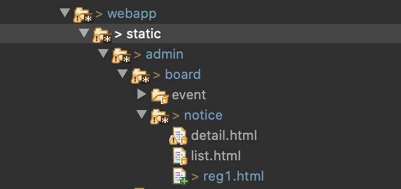

- reg1.html 페이지 요청 성공

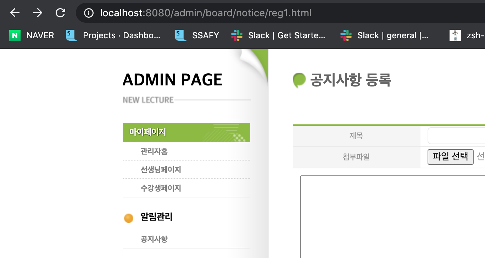

- reg1.html form태그 수정
  - action으로 reg만 적어줘도 앞까지의 url이 동일하므로 NoticeController의 reg 메소드에 매핑됨
    - reg1.html 요청 url: http://localhost:8080/admin/board/notice/reg1.html
    - reg 메소드 요청 url: http://localhost:8080/admin/board/notice/reg

```html
<form action="reg" method="post">
  <div class="margin-top first">
    <h3 class="hidden">공지사항 입력</h3>
    <table class="table">
      <tbody>
        <tr>
          <th>제목</th>
          <td class="text-align-left text-indent text-strong text-orange" colspan="3">
            <input type="text" name="title" />
          </td>
        </tr>
        <tr>
          <th>첨부파일</th>
          <td colspan="3" class="text-align-left text-indent"><input type="file"
                                                                     name="file" /> </td>
        </tr>
        <tr class="content">
          <td colspan="4"><textarea class="content" name="content"></textarea></td>
        </tr>
        <tr>
          <td colspan="4" class="text-align-right"><input class="vertical-align" type="checkbox" id="open" name="open" value="true"><label for="open" class="margin-left">바로공개</label> </td>
        </tr>
      </tbody>
    </table>
  </div>
  <div class="margin-top text-align-center">
    <input class="btn-text btn-default" type="submit" value="등록" />
    <a class="btn-text btn-cancel" href="list.html">취소</a>
  </div>
</form>
```

- 값을 입력하고 결과 확인

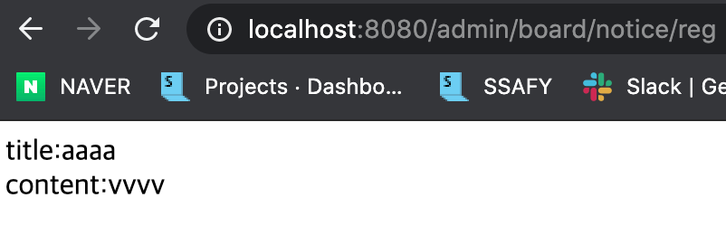


## 40. POST 입력 #2 (콤보박스 값 입력)

- NoticeController.java
  - 콤보박스로 받아올 값의 변수명을 category로 정하자

```java
@RequestMapping("reg")
@ResponseBody
public String reg(String title, String content, String category) {

  return String.format("title:%s<br>content:%s<br>category:%s<br>", title, content, category);
}
```

- reg1.html 에 row로 콤보박스 추가

```html
<tr>
  <th>카테고리</th>
  <td class="text-align-left text-indent text-strong text-orange" colspan="3">
    <select name="category">
      <option value="1">카테고리1</option>
      <option value="2">카테고리2</option>
      <option value="3">카테고리3</option>
      <option value="4">카테고리4</option>
    </select>
  </td>
</tr>
```

- 결과

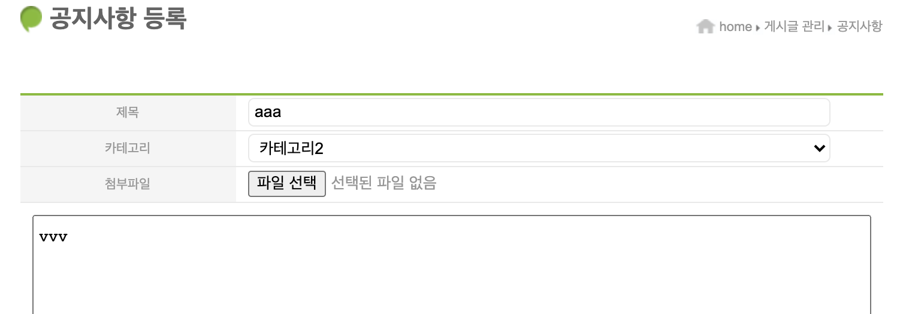


## 41. POST 입력 #3 (체크박스, 라디오버튼 입력)

- NoticeController.java
  - checkbox는 다중 선택 가능, foods라는 변수명을 사용해서 배열로 받음
  - radio 버튼은 동일한 name 안에서 하나만 선택할 수 있음, food라는 변수명을 사용

```java
@RequestMapping("reg")
@ResponseBody
public String reg(String title, String content, String category, String[] foods, String food) {
  for(String f : foods) {
    System.out.printf("I like food%s", f);
    System.out.println();
  }
  System.out.printf("My favorite food is food%s", food);
  return String.format("title:%s<br>content:%s<br>category:%s<br>", title, content, category);
}
```

- reg1.html
  - checkbox로 좋아하는 음식을, radio 버튼으로 가장 좋아하는 음식을 입력

```html
<tr>
  <th>좋아하는 음식</th>
  <td class="text-align-left text-indent text-strong text-orange" colspan="3">
    <input type="checkbox" name="foods" value="1" id="ch1"><label for="ch1">자장면</label>
    <input type="checkbox" name="foods" value="2" id="ch2"><label for="ch2">짬뽕</label>
    <input type="checkbox" name="foods" value="3" id="ch3"><label for="ch3">볶음밥</label>
    <input type="checkbox" name="foods" value="4" id="ch4"><label for="ch4">탕수육</label>
  </td>
</tr>
<tr>
  <th>가장 좋아하는 음식</th>
  <td class="text-align-left text-indent text-strong text-orange" colspan="3">
    <input type="radio" name="food" value="1" id="ch1"><label for="ch1">자장면</label>
    <input type="radio" name="food" value="2" id="ch2"><label for="ch2">짬뽕</label>
    <input type="radio" name="food" value="3" id="ch3"><label for="ch3">볶음밥</label>
    <input type="radio" name="food" value="4" id="ch4"><label for="ch4">탕수육</label>
  </td>
</tr>
```

- 실행

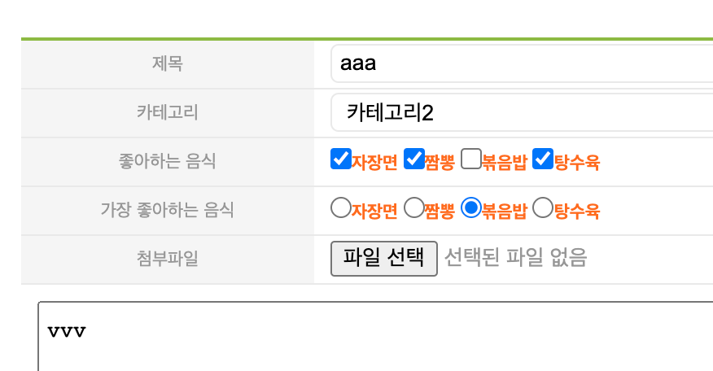

- 콘솔 결과

```txt
I like food1
I like food2
I like food4
My favorite food is food3
```


## 42. POST 입력 #4 (한글 입력이 깨지는 문제)

### 한글이 전달되는 것을 서버에서 받지 못하는 문제

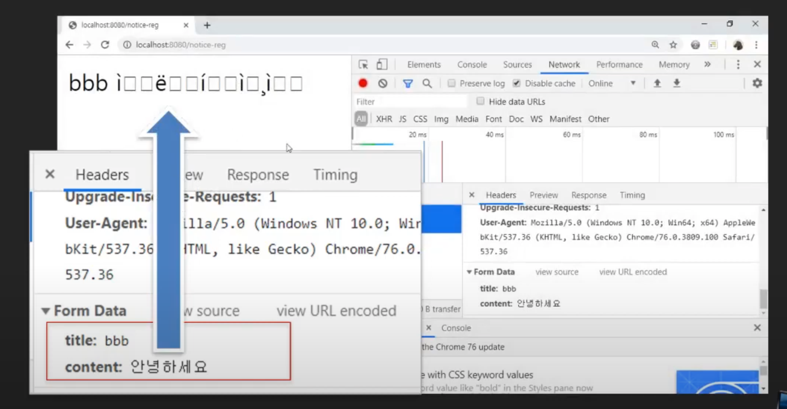

### 멀티 바이트 문자 전송 문제 : 사용자로부터 값 입력 받아서 전송하기

- 사용자가 UTF-8로 입력 데이터를 주면 그에 맞도록 하나의 문자 당 2바이트씩을 차지하면서 보내짐
- 웹 서버쪽에서도 UTF-8로 오는 것을 인식하고 2바이트씩 읽어줘야하는데 톰캣의 경우엔 기본 설정이 ISO-8859-1로 되어있기 때문에 1바이트씩 읽어서 이상하게 나옴

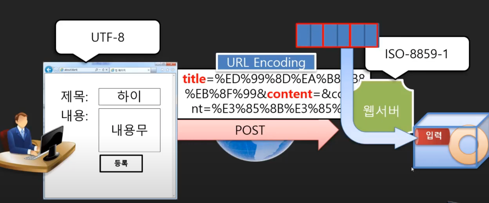

### 멀티 바이트 문자 전송 문제 : 해결 방법 두 가지

- 톰캣 설정을 바꾸는 방법
  - 설정 파일을 수정해주는 방법
  - 톰캣 서버를 사용하는 모든 프로그램에 영향을 줄 수가 있음
- 사용하는 서블릿마다 인코딩 설정을 변경해주는 방법
  - 일일이 서블릿마다 찾아서 달아주는 것이 비효율적임
- 위의 두가지 방법에서의 문제점들을 해결하도록 필터를 사용하자

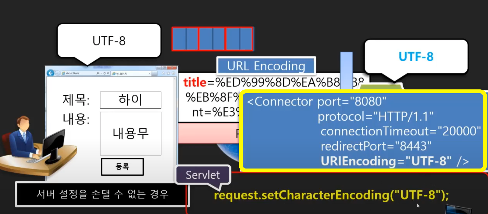

### 필터

- 인코딩, 인증 및 권한 등 여러 서블릿에서 처리해야하는 것들을 이전에 필터를 두고 거기서 처리할 수 있음
- 필터를 만들 수도 있지만, 스프링이 제공하는 필터를 사용하면 간단한 설정만으로도 처리를 할 수가 있음

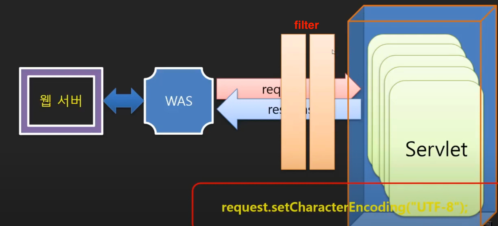

- web.xml에 filter 설정 추가
  - 서버 재시작하면 한글도 제대로 나옴
  - 참고: [Servlet_2](Servlet_2.md) - 20챕터(서블릿 필터)

```xml
<filter>
  <filter-name>charaterEncodingFilter</filter-name>
  <filter-class>org.springframework.web.filter.CharacterEncodingFilter</filter-class>
  <init-param>
    <param-name>encoding</param-name>
    <param-value>UTF-8</param-value>
  </init-param>
  <init-param>
    <param-name>forceEncoding</param-name>
    <param-value>true</param-value>
  </init-param>
</filter>
<filter-mapping>
  <filter-name>charaterEncodingFilter</filter-name>
  <url-pattern>/*</url-pattern>
</filter-mapping>
```


## 참고

- 유튜브 채널 - 뉴렉처
  - 스프링 프레임워크 강좌/강의
  - https://www.youtube.com/watch?v=XtXHIDnzS9c&list=PLq8wAnVUcTFUHYMzoV2RoFoY2HDTKru3T

