# 서블릿/JSP Study


## 16. 기본 값 사용하기

- 사용자가 입력값을 따로 안줘도 오류가 안나려면 기본값이 필요

### 전달되는 입력 값의 형태

#### 쿼리스트링을 다음처럼 사용할 경우에 전달 되는 int 값은...?

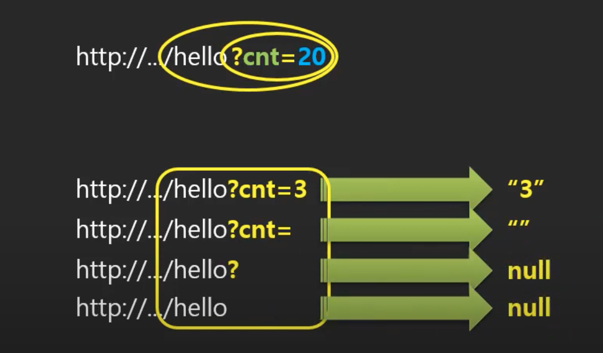

#### 전달 방식의 차이

- null이나 빈 문자열일 경우에는 기본값으로 대체


- 코드 업데이트

```java
package com.reynold.web;

import java.io.IOException;
import java.io.PrintWriter;

import javax.servlet.ServletException;
import javax.servlet.annotation.WebServlet;
import javax.servlet.http.HttpServlet;
import javax.servlet.http.HttpServletRequest;
import javax.servlet.http.HttpServletResponse;

@WebServlet("/hi")
public class Nana extends HttpServlet {
	@Override
	protected void service(HttpServletRequest request, HttpServletResponse response) throws ServletException, IOException {
		
		response.setCharacterEncoding("UTF-8");
		response.setContentType("text/html; charset=UTF-8");
		
		PrintWriter out = response.getWriter();
		
		String cnt_ = request.getParameter("cnt");
		
		int cnt = 100;
		
		if(cnt_ != null && !cnt_.equals("")) {
			cnt = Integer.parseInt(cnt_);
		}
		
		for(int i=0; i<cnt; i++) {
			out.println((i+1) + "번째 줄 : 안녕 Servlet<br />");
		}
		
	}
}

```

- 그런데 이러한 값들을 사용자가 항상 주소창으로 전달할까? No
  - Index.html에서 하이퍼텍스트를 통해서 주소로 접근할 수 있도록 하자
  - a 태그를 사용하자

```html
<!DOCTYPE html>
<html>
<head>
<meta charset="UTF-8">
<title>Insert title here</title>
</head>
<body>
	환영합니다.<br >
	<a href="hi">인사하기</a><br >
	<a href="hi?cnt=3">인사하기</a><br >
</body>
</html>
```


## 17. 사용자 입력을 통한 GET 요청

- 사용자가 직접 입력시킬 수 있도록 해보자

### 반복횟수를 사용자로부터 입력 받으려면 입력폼을 준비해야된다.

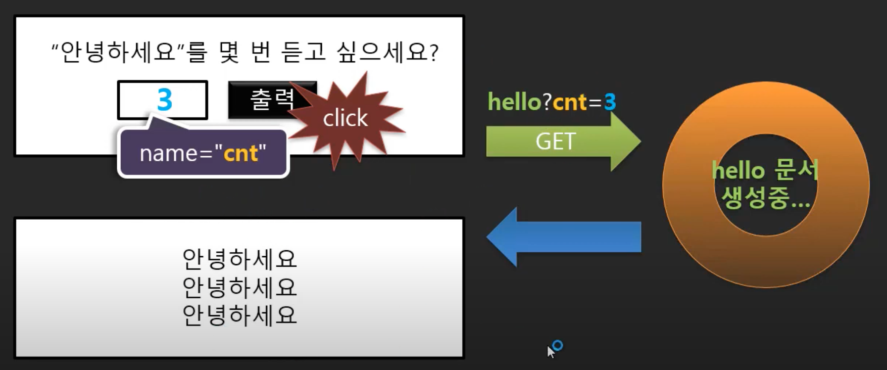

### 입력 폼

- form 태그와 input 태그를 사용하자
  - form 태그의 action을 통해 매핑 주소를 입력해주자
  - input 태그를 통해 입력값을 받을 수 있도록 name을 맞춰주자
  - form과 input 태그를 사용하면 브라우저가 저런식으로 주소를 만들어서 요청을 보내줌


- hello.html

```html
<!DOCTYPE html>
<html>
<head>
<meta charset="UTF-8">
<title>Insert title here</title>
</head>
<body>
	<div>
		<form action="hi">
			<div>
				<label>"안녕하세요"를 몇 번 듣고 싶으세요?</label>
			</div>
			<div>
				<input type="text" name="cnt" />
				<input type="submit" value="출력" />
			</div>
		</form>
	</div>
</body>
</html>
```


## 18. 입력할 내용이 많은 경우는 POST 요청

### POST 요청의 일반적인 요청 방식

#### 요청과 제출, 두 단계로 나누어서 일을 처리하려고 할 때의 두 가지 요청

- 입력 폼을 받기위해서 GET 요청
- 받은 입력 폼을 작성해서 POST 요청


### title과 content를 보내는 POST 요청을 만들어보자

- reg.html
  - title과 content를 입력할 수 있는 form을 제공
  - post 방식으로 notice-reg로 보냄

```html
<!DOCTYPE html>
<html>
<head>
<meta charset="UTF-8">
<title>Insert title here</title>
</head>
<body>
	<div>
		<form action="notice-reg" method="post">
			<div>
				<label>제목:</label><input name="title" type="text" >
			</div>
			<div>
				<label>내용:</label>
				<textarea name="content"></textarea>
			</div>
			<div>
				<input type="submit" value="등록" />
			</div>
		</form>
	</div>
</body>
</html>
```

- NoticeReg.java
  - notice-reg를 매핑받아서 처리를 담당할 서블릿을 작성하자
  - title과 content를 받아서 그대로 보여주는 기능을 구현

```java
package com.reynold.web;

import java.io.IOException;
import java.io.PrintWriter;

import javax.servlet.ServletException;
import javax.servlet.annotation.WebServlet;
import javax.servlet.http.HttpServlet;
import javax.servlet.http.HttpServletRequest;
import javax.servlet.http.HttpServletResponse;

@WebServlet("/notice-reg")
public class NoticeReg extends HttpServlet {
	@Override
	protected void service(HttpServletRequest request, HttpServletResponse response) throws ServletException, IOException {
		
		response.setCharacterEncoding("UTF-8");
		response.setContentType("text/html; charset=UTF-8");
		
		PrintWriter out = response.getWriter();
		
		String title = request.getParameter("title");
		String content = request.getParameter("content");
		
		out.println(title);
		out.println(content);
		
		
	}
}

```

- 영어로 입력했을 경우, 잘나오지만 한글을 입력했을 경우 이상한 문자가 결과로 보여짐


## 19. 한글 입력 문제

### 한글이 전달되는 것을 서버에서 받지 못하는 문제

#### 멀티 바이트 문자 전송 문제: 사용자로부터 값 입력 받아서 전송하기

- 영문자는 문자하나당 숫자로 변환될 때 1바이트지만, 한글은 2바이트를 사용해야 제대로 표현할 수 있음
- 보낼 때는 잘 보냈는데 웹 서버에서 2바이트씩 UTF-8 방식으로 읽으면 제대로 읽히지만, 그렇지 않은 경우에는 이상한 문자로 해석하게 됨
- 그런데 사용하고 있는 웹서버(아파치 톰캣)은 ISO-8859-1 인코딩 방식을 사용하고 있음
  - 1바이트를 한 문자로 인식하고 있음
  - 한글이 깨짐
  - 깨진 값을 다시 보내니까 이상하게 보여지는 것


- 이를 해결할 수 있는 방법 2가지
  - request.setCharacterEncoding("UTF-8"); 을 사용해서 요청을 받을 때 인코딩 변환해줘서 받기
  - 톰캣의 환경설정인 server.xml의 Connector 부분에 UTF-8로 인코딩할 수 있도록 코드 추가해주기
    - 그런데 일반적으로 톰캣 서버의 환경설정은 잘 안건드림
      - 만약 톰캣에서 여러개의 서비스를 돌릴 경우, 다른 서비스들도 영향을 줄 수 있기 때문에


- NoticeReg.java

```java
package com.reynold.web;

import java.io.IOException;
import java.io.PrintWriter;

import javax.servlet.ServletException;
import javax.servlet.annotation.WebServlet;
import javax.servlet.http.HttpServlet;
import javax.servlet.http.HttpServletRequest;
import javax.servlet.http.HttpServletResponse;

@WebServlet("/notice-reg")
public class NoticeReg extends HttpServlet {
	@Override
	protected void service(HttpServletRequest request, HttpServletResponse response) throws ServletException, IOException {
		
		response.setCharacterEncoding("UTF-8");
		response.setContentType("text/html; charset=UTF-8");
    // 추가
		request.setCharacterEncoding("UTF-8");
		
		PrintWriter out = response.getWriter();
		
		String title = request.getParameter("title");
		String content = request.getParameter("content");
		
		out.println(title);
		out.println(content);
	}
}
```


## 20. 서블릿 필터(Servlet Filter)

### 필터

- 웹 서버 <-> WAS <-> Servlet Container
- 웹 서버가 정적 요청 담당하고 동적인 부분은 WAS에게 넘김
- WAS(톰캣)가 사용자로부터 요청을 받으면 적절한 소프트웨어를 실행해서 결과를 돌려주게 되어있음
- 이 소프트웨어가 서블릿이고 서블릿이 실행될 때 메모리에 존재하게 되는데, 이때의 공간이 Sevlet Container임
- WAS는 서블릿을 실행시켜서 결과를 Servlet Container에 넣어뒀다가 돌려줌
- 더이상 서블릿이 사용되지 않으면 Servlet Container에서 삭제함

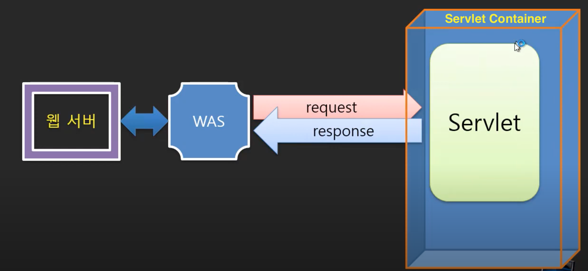

- 그런데 서블릿 말고 만들 수 있는 객체가 하나 더 있음
- 그게 필터임
  - 필터는 WAS와 Sevlet Container 사이에 있음
  - 요청과 응답 과정에서 가로채서 먼가 더 처리를 해줄 수 있음
  - 요청을 먼저 받아서 서블릿을 실행할 것인지 말것인지를 검사하고 제어할 수 있음
    - 인증과 권한 기능을 구현할 때 사용됨
      - 수문장의 역할
    - 모든 서블릿이 사용해야되는 기본 기능을 여기서 구현할 수도 있음
      - 예를 들어 한글을 입력 받는 서블릿을 만들면 인코딩을 해줘야함
      - request.setCharacterEncoding("UTF-8"); 이 코드를 각 서블릿마다 작성해줘야함
      - 그런데 모든 서블릿에서 이 코드를 작성하는 것이 아니라 필터에서 이런 부분을 담당할 수 있음
  - 실행되고 응답하는 과정에서도 먼가 추가적인 작업을 해줄 수 있음


- filter를 만들고 설정해줘야됨. 방법 2가지

  - web.xml에서 코드를 통한 설정

    - CharacterEncodingFilter.java

    ```java
    package com.reynold.web.filter;
    
    import java.io.IOException;
    
    import javax.servlet.Filter;
    import javax.servlet.FilterChain;
    import javax.servlet.ServletException;
    import javax.servlet.ServletRequest;
    import javax.servlet.ServletResponse;
    import javax.servlet.annotation.WebFilter;
    
    public class CharacterEncodingFilter implements Filter {
    
    	@Override
    	public void doFilter(ServletRequest request, 
    			ServletResponse response, 
    			FilterChain chain)
    			throws IOException, ServletException {
    
    //		System.out.println("before filter");
    		
        // 다음으로 가기 전에 인코딩 설정해줌
    		request.setCharacterEncoding("UTF-8");
    		
        // 이 코드가 중요
        // 이 코드 위쪽은 다음으로 가기 전에 실행되고, 이 코드 밑쪽은 응답하고 나서 실행됨
    		chain.doFilter(request, response);
    		
    //		System.out.println("after filter");
    
    	}
    
    }
    ```

    - web.xml
      - servlet 설정해준거랑 비슷

    ```xml
    <?xml version="1.0" encoding="UTF-8"?>
    <web-app xmlns="http://xmlns.jcp.org/xml/ns/javaee"
      xmlns:xsi="http://www.w3.org/2001/XMLSchema-instance"
      xsi:schemaLocation="http://xmlns.jcp.org/xml/ns/javaee
                          http://xmlns.jcp.org/xml/ns/javaee/web-app_4_0.xsd"
      version="4.0"
      metadata-complete="false">
      
      <filter>
      	 <filter-name>characterEncodingFilter</filter-name>
      	 <filter-class>com.reynold.web.filter.CharacterEncodingFilter</filter-class>
      </filter>
      <filter-mapping>
      	 <filter-name>characterEncodingFilter</filter-name>
      	 <url-pattern>/*</url-pattern>
      </filter-mapping>
    
      <display-name>Welcome to Tomcat</display-name>
      <description>
         Welcome to Tomcat
      </description>
    
    
    </web-app>
    
    
    
    ```

  - 어노테이션 방법

    - CharacterEncodingFilter.java

    ```java
    package com.reynold.web.filter;
    
    import java.io.IOException;
    
    import javax.servlet.Filter;
    import javax.servlet.FilterChain;
    import javax.servlet.ServletException;
    import javax.servlet.ServletRequest;
    import javax.servlet.ServletResponse;
    import javax.servlet.annotation.WebFilter;
    
    @WebFilter("/*")
    public class CharacterEncodingFilter implements Filter {
    	}
    
    }
    ```

    - web,xml
      - filter관련 부분 지워줌


## 21. 학습과제(사용자 입력을 통한 계산 요청)

### 계산기 웹 프로그램 만들어보기


- add.html

```html
<!DOCTYPE html>
<html>
<head>
<meta charset="UTF-8">
<title>calculator_ADD</title>
</head>
<body>
	<div>
		<form action="add" method="post">
			<div>
				<label>x :</label>
				<input type="text" name="x" >
			</div>
			<div>
				<label>y :</label>
				<input type="text" name="y" >
			</div>
			<div>
				<input type="submit" value="ADD">
			</div>
		</form>
	</div>
</body>
</html>
```

- CalculatorADD.java

```java
package com.reynold.web;

import java.io.IOException;
import java.io.PrintWriter;

import javax.servlet.ServletException;
import javax.servlet.annotation.WebServlet;
import javax.servlet.http.HttpServlet;
import javax.servlet.http.HttpServletRequest;
import javax.servlet.http.HttpServletResponse;

@WebServlet("/add")
public class CalculatorADD extends HttpServlet {
	@Override
	protected void service(HttpServletRequest request, HttpServletResponse response) throws ServletException, IOException {
		
		response.setCharacterEncoding("UTF-8");
		response.setContentType("text/html; charset=UTF-8");
		
		PrintWriter out = response.getWriter();
		
		String x = request.getParameter("x");
		String y = request.getParameter("y");
		
		int num_x = Integer.parseInt(x);
		int num_y = Integer.parseInt(y);
		int result = num_x + num_y;
		
		out.println(result);
	}
}
```


## 22. 과제 풀이(사용자 입력을 통한 계산 요청)

### 사용자로부터 계산을 위한 값을 입력 받아서 계산을 요청한다.

- Add.java

```java
package com.reynold.web;

import java.io.IOException;
import javax.servlet.ServletException;
import javax.servlet.annotation.WebServlet;
import javax.servlet.http.HttpServlet;
import javax.servlet.http.HttpServletRequest;
import javax.servlet.http.HttpServletResponse;

@WebServlet("/add")
public class Add extends HttpServlet {

	protected void service(HttpServletRequest request, HttpServletResponse response) throws ServletException, IOException {
		
		response.setCharacterEncoding("UTF-8");
		response.setContentType("text/html; charser=UTF-8");
		
		String x_ = request.getParameter("x");
		String y_ = request.getParameter("y");
		
		int x = 0;
		int y = 0;
		
		if(!x_.equals("")) {
			x = Integer.parseInt(x_);
		}
		
		if(!y_.equals("")) {
			y = Integer.parseInt(y_);
		}
		
		int result = x+y;
		
		response.getWriter().printf("result is %d\n", result);
	}

}

```


## 23. 여러 개의 Submit 버튼 사용하기

### 사용자로부터 계산을 위한 값을 입력 받아서 계산을 요청한다.

- calc.html
  - submit에 name을 통해 value을 전달해줌으로써 서버쪽에서 어떤 연산을 요청하는지 알 수 있게 하자

```html
<!DOCTYPE html>
<html>
<head>
<meta charset="UTF-8">
<title>calculator_ADD</title>
</head>
<body>
	<div>
		<form action="calc" method="post">
			<div>
				<label>x :</label>
				<input type="text" name="x" >
			</div>
			<div>
				<label>y :</label>
				<input type="text" name="y" >
			</div>
			<div>
				<input type="submit" name="operator" value="덧셈">
				<input type="submit" name="operator" value="뺄셈">
			</div>
		</form>
	</div>
</body>
</html>
```

- Calc.java

```java
package com.reynold.web;

import java.io.IOException;
import javax.servlet.ServletException;
import javax.servlet.annotation.WebServlet;
import javax.servlet.http.HttpServlet;
import javax.servlet.http.HttpServletRequest;
import javax.servlet.http.HttpServletResponse;

@WebServlet("/calc")
public class Calc extends HttpServlet {

	protected void service(HttpServletRequest request, HttpServletResponse response) throws ServletException, IOException {
		
		response.setCharacterEncoding("UTF-8");
		response.setContentType("text/html; charser=UTF-8");
		
		String x_ = request.getParameter("x");
		String y_ = request.getParameter("y");
		String op = request.getParameter("operator");
		
		int x = 0;
		int y = 0;
		
		if(!x_.equals("")) {
			x = Integer.parseInt(x_);
		}
		
		if(!y_.equals("")) {
			y = Integer.parseInt(y_);
		}
		
		int result = 0;
		
		if (op.equals("덧셈")) {
			result = x+y;
		} else {
			result = x-y;
		}
		
		response.getWriter().printf("result is %d\n", result);
	}
}
```


## 24. 입력 데이터 배열로 받기

- add2.html
  - input에서 name이 같은 값들은 배열로 처리되서 서버에게 전달됨
  - num이라는 이름으로 입력되는 값들은 배열로 전달

```html
<!DOCTYPE html>
<html>
<head>
<meta charset="UTF-8">
<title>calculator_ADD</title>
</head>
<body>
	<div>
		<form action="add2" method="post">
			<div>
				<input type="text" name="num" >
				<input type="text" name="num" >
				<input type="text" name="num" >
				<input type="text" name="num" >
			</div>
			<div>
				<input type="submit" value="ADD">
			</div>
		</form>
	</div>
</body>
</html>
```

- Add2.java

```java
package com.reynold.web;

import java.io.IOException;
import javax.servlet.ServletException;
import javax.servlet.annotation.WebServlet;
import javax.servlet.http.HttpServlet;
import javax.servlet.http.HttpServletRequest;
import javax.servlet.http.HttpServletResponse;

@WebServlet("/add2")
public class Add2 extends HttpServlet {

	protected void service(HttpServletRequest request, HttpServletResponse response) throws ServletException, IOException {
		
		response.setCharacterEncoding("UTF-8");
		response.setContentType("text/html; charser=UTF-8");
		
    // num이라는 이름으로 전달받은 배열을 num_에 저장
		String[] num_ = request.getParameterValues("num");
		
		int result = 0;
		
		for(int i=0; i<num_.length; i++) {
			int num = Integer.parseInt(num_[i]);
			result += num;
		}
		
		response.getWriter().printf("result is %d\n", result);
	}

}

```


## 25. 상태 유지를 필요로 하는 경우와 구현의 어려움

- 웹에서 웹 서버 어플리케이션은 조각나 있음 == 서블릿
- 그러다보니 전역변수같은 개념을 갖고 있지 않은 조각난 어플리케이션들 사이에서, 전역변수처럼 각 서블릿들 사이에서 값을 유지해야만하는 일이 필요해짐
- 이런 경우에는 어떻게 처리할 것인가?

### 사용자로부터 두 개의 값을 한번에 입력 받는 방식

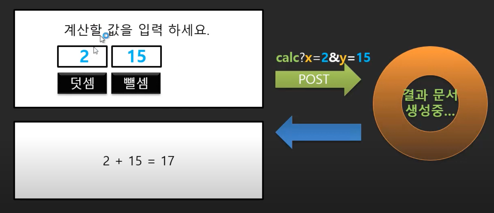

### 사용자로부터 두 개의 값을 하나씩 개별적으로 입력 받는 방식

- 이게  좀 더 현실적
- 그런데 이렇게 되면 2를 입력하고 + 버튼을 누르면 서블릿이 실행되서 2가 저장은 되지만, 아무런 처리없이 서블릿이 종료되고 나면 기록이 안남음
- 그 다음 숫자를 입력하고 계산 버튼을 눌러도 이전의 값을 알 수 없기 때문에 계산이 불가능함
- 각 서블릿끼리 타임캡슐처럼 공유할 수 있는 것이 없음
- 이런 일을 할 수 있는 방법이 5가지 있음


### 상태 유지를 위한 5가지 방법

- application
- session
- cookie
- hidden input
- querystring
- 이 중에서 application, session, cookie에 대해서 먼저 알아보자


## 26. Application 객체와 그것을 사용한 상태 값 저장

### Application 자장소: 서블릿 컨텍스트(Context)

- 서블릿들간의 문맥을 이어갈 수 있는 공간
- 상태 저장 공간
- 자원 공유 공간

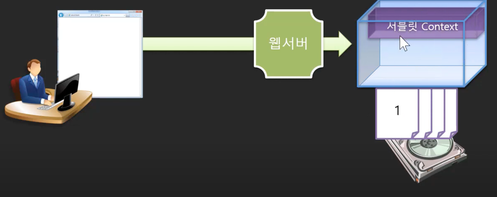

- calc2.html

```html
<!DOCTYPE html>
<html>
<head>
<meta charset="UTF-8">
<title>calculator_ADD</title>
</head>
<body>
	<div>
		<form action="calc2" method="post">
			<div>
				<label>입력 :</label>
				<input type="text" name="v" />
			</div>
			<div>
				<input type="submit" name="operator" value="+" />
				<input type="submit" name="operator" value="-" />
				<input type="submit" name="operator" value="=" />
			</div>
			<div>
					결과: 0
			</div>
		</form>
	</div>
</body>
</html>
```

- Calc2.java

```java
package com.reynold.web;

import java.io.IOException;

import javax.servlet.ServletContext;
import javax.servlet.ServletException;
import javax.servlet.annotation.WebServlet;
import javax.servlet.http.HttpServlet;
import javax.servlet.http.HttpServletRequest;
import javax.servlet.http.HttpServletResponse;

@WebServlet("/calc2")
public class Calc2 extends HttpServlet {

	protected void service(HttpServletRequest request, HttpServletResponse response) throws ServletException, IOException {
		// ServletContext 객체화
		ServletContext application = request.getServletContext();
		response.setCharacterEncoding("UTF-8");
		response.setContentType("text/html; charser=UTF-8");
		
		String v_ = request.getParameter("v");
		String op = request.getParameter("operator");
		
		int v = 0;
		
		if(!v_.equals("")) {
			 v = Integer.parseInt(v_);
		}
		
		// 계산 
		if(op.equals("=")) {
      // 값 받아오기
			int x = (Integer) application.getAttribute("value");
			int y = v;
			String operator = (String) application.getAttribute("op");
			
			int result = 0;
			
			if (operator.equals("+")) {
				result = x+y;
			} else {
				result = x-y;
			}
			response.getWriter().printf("result is %d\n", result);
		// 값을 저장 
		} else {
      // 값 저장
			application.setAttribute("value", v);
			application.setAttribute("op", op);
			
		}
		
		
	}

}

```


## 27. Session 객체로 상태 값 저장하기(그리고 Application 객체와의 차이점)

- Calc2.java
  - application객체를 사용한 부분을 session객체로 변경해줬는데도 똑같은 기능을 수행함
  - 그렇다면 아무거나 그냥 쓰면 되는 것인가? X
  - application객체는 어플리케이션 전역에서 쓸 수 있다는 의미
    - 모든 서블릿이 전역적으로 쓸 수 있는 전역공간
  - session객체는 세션 범주 내에서 쓸 수 있다는 의미
    - 세션이란 현재 접속한 사용자를 의미
    - 사용자 별로 그 공간이 달라질 수 있다

```java
package com.reynold.web;

import java.io.IOException;

import javax.servlet.ServletContext;
import javax.servlet.ServletException;
import javax.servlet.annotation.WebServlet;
import javax.servlet.http.HttpServlet;
import javax.servlet.http.HttpServletRequest;
import javax.servlet.http.HttpServletResponse;
import javax.servlet.http.HttpSession;

@WebServlet("/calc2")
public class Calc2 extends HttpServlet {

	protected void service(HttpServletRequest request, HttpServletResponse response) throws ServletException, IOException {
		
		ServletContext application = request.getServletContext();
		HttpSession session = request.getSession();
		
		response.setCharacterEncoding("UTF-8");
		response.setContentType("text/html; charser=UTF-8");
		
		String v_ = request.getParameter("v");
		String op = request.getParameter("operator");
		
		int v = 0;
		
		if(!v_.equals("")) {
			 v = Integer.parseInt(v_);
		}
		
		// 계산 
		if(op.equals("=")) {
//			int x = (Integer) application.getAttribute("value");
			int x = (Integer) session.getAttribute("value");
			int y = v;
//			String operator = (String) application.getAttribute("op");
			String operator = (String) session.getAttribute("op");
			
			int result = 0;
			
			if (operator.equals("+")) {
				result = x+y;
			} else {
				result = x-y;
			}
			response.getWriter().printf("result is %d\n", result);
		// 값을 저장 
		} else {
//			application.setAttribute("value", v);
//			application.setAttribute("op", op);
			session.setAttribute("value", v);
			session.setAttribute("op", op);
		}
	}
}
```

- 세션을 사용한 코드를 통해 현재 접속자를 별로 공간을 따로 가지는 확인해보자
  - 크롬과 사파리, 두 개의 브라우저로 각각 접속해보자
  - 먼저 크롬으로 접속해서 덧셈을 수행하고난 후,
  - 사파리로 접속해서 바로 '='을 눌럿는데 다음과 같은 오류가 나왔다
  - 세션 객체에 저장된 값이 없기 때문에 생기는 오류인 듯 싶다


- 각 브라우저별로는 다른 사용자로 인식하지만, 같은 브라우저에서 새로운 창을 통해 똑같은 일을 수행하면 같은 사옹자로 인식함
- 그 이유는 새창을 띄운다고해서 새로운 프로세스가 돌아가는게 아니라 하나의 브라우저가 여러개의 스레드를 사용하는 방식이기 때문에 각각의 스레드는 자원을 공유하기 때문에, WAS에서는 이들을 같은 세션으로 인식하게 됨


## 28. WAS가 현재사용자(Session)을 구분하는 방식

### 세션 ID와 사용자 저장소 구별

- 세션을 통한 사용자 저장소는 헬스장의 사물함같은 느낌임
- 처음 요청할 때는 세션 ID가 없어서 WAS에서 세션 공간을 사용할 수 없음


- 세션 ID를 할당해주고 응답할 때 돌려보내줌 


- 두번째 요청부터는 항상 세션 ID와 함께 요청하기 때문에 WAS에서 이를 인식하고 저장 공간을 쓸 수 있게 해줌

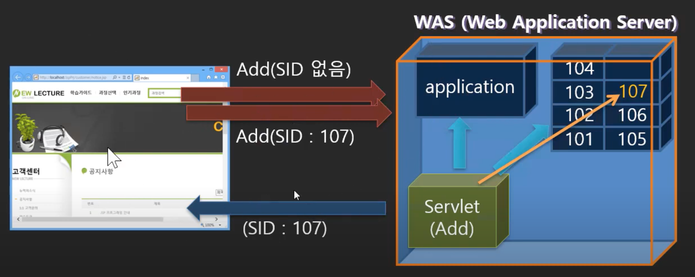

- 브라우저는 서버에 요청할 때마다 가지고 있는 세션을 함께 보내줌

 

- 그렇다면 WAS는 계속해서 세션 공간을 유지하고 있을까?

### 세션 메소드

- 다양한 메소드들이 존재하고 이를 통해 인증이나 여러가지 기능에 활용될 수 있음


## 29. Cookie를 이용해 상태값 유지하기

- WAS의 저장 공간에 두는 게 아니라 가지고 다닐 수도 있음 => 쿠키
- 서블릿에서 요청에 대해서 먼가 처리를 해줄 때, WAS에 있는 저장공간(application, session)에서 값을 찾아서 가지고 올 수도 있지만, 요청과 함께 브라우저에서 보낸 정보(cookie)를 이용할 수도 있음
  - 꺼내서 쓸수도 있지만, 가져온 값을 쓸 수도 있다


### 서블릿에서 사용할 수 있는 상태 저장소

- 클라이언트가 서버에게 먼가를 요청할 때 값을 가지고 갈 수 있는데, 크게 3가지가 있음
  - 헤더 정보
    - 브라우저가 알아서 보내주는 정보
    - Header 설정
    - 서블릿에서 받을 때, getHeader("remote-host")
  - 쿠키 데이터
    - 내가 직접 심는건 아니지만 브라우저가 알아서 쿠키가 있으면 가져감
    - 데이터 설정
    - 서블릿에서 받을 때, getCookies();
    - 서블릿에서 쿠키를 추가해서 응답할 때, addCookie();
      - 이게 시작점임
      - 서버에서 쿠키에 정보를 넣어서 응답하면 브라우저가 쿠키를 인식하고 다음 요청마다 쿠키를 가지고 감
  - 사용자 데이터
    - 내가 보내는 데이터
    - 서블릿에서 받을 때, getParameter("x")를 통해서 받음


### 쿠키 사용하기

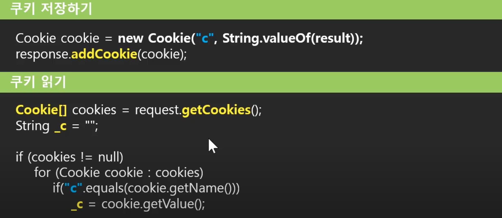

- Calc2.java
  - 쿠키는 배열로 넘어옴
    - Cookie[] cookies = request.getCookies();
    - 이렇게 받아줘야됨
  - 찾고자하는 쿠키를 반복문을 통해서 찾아줘야한다는 번거로움이 있음

```java
package com.reynold.web;

import java.io.IOException;

import javax.servlet.ServletContext;
import javax.servlet.ServletException;
import javax.servlet.annotation.WebServlet;
import javax.servlet.http.Cookie;
import javax.servlet.http.HttpServlet;
import javax.servlet.http.HttpServletRequest;
import javax.servlet.http.HttpServletResponse;
import javax.servlet.http.HttpSession;

@WebServlet("/calc2")
public class Calc2 extends HttpServlet {

	protected void service(HttpServletRequest request, HttpServletResponse response) throws ServletException, IOException {
		
		ServletContext application = request.getServletContext();
		HttpSession session = request.getSession();
		Cookie[] cookies = request.getCookies();
		
		response.setCharacterEncoding("UTF-8");
		response.setContentType("text/html; charser=UTF-8");
		
		String v_ = request.getParameter("v");
		String op = request.getParameter("operator");
		
		int v = 0;
		
		if(!v_.equals("")) {
			 v = Integer.parseInt(v_);
		}
		
		// 계산 
		if(op.equals("=")) {
//			int x = (Integer) application.getAttribute("value");
//			int x = (Integer) session.getAttribute("value");
			
			int x = 0;
			for(Cookie c : cookies) { 
				if(c.getName().equals("value")) {
					x = Integer.parseInt(c.getValue());
					break;
				}
			}
			
			
			int y = v;
//			String operator = (String) application.getAttribute("op");
//			String operator = (String) session.getAttribute("op");
			
			String operator = "";
			for(Cookie c : cookies) { 
				if(c.getName().equals("op")) {
					operator = c.getValue();
					break;
				}
			}
			
			
			int result = 0;
			
			if (operator.equals("+")) {
				result = x+y;
			} else {
				result = x-y; 
			}
			response.getWriter().printf("result is %d\n", result);
		// 값을 저장 
		} else {
//			application.setAttribute("value", v);
//			application.setAttribute("op", op);
			
//			session.setAttribute("value", v);
//			session.setAttribute("op", op);
			
			Cookie valueCookie = new Cookie("value", String.valueOf(v));
			Cookie opCookie = new Cookie("op", op);
			response.addCookie(valueCookie);
			response.addCookie(opCookie);
		}
	}
}

```


## 30. Cookie의 Path 옵션

- 쿠키를 사용할 때 꼭 생각해야되는 것 두가지

### 쿠키는 모든 페이지마다 동일한가?

- 서블릿을 여러개 만들 것임
- 서블릿마다 저장해야되는 값이 있어서 쿠키로 저장할려고 한다고 하자
- 그러면 서블릿마다 쿠키가 같을까? 다를까?
  - 상식적으로 달라야됨
  - 각 서블릿마다 사용되는 값이 모든 서블릿에게 필요한 것이 아니기 때문에
- 그래서 쿠키를 설정할 때, URL을 설정할 수가 있음
  - 특정 서블릿들에게만 가지고 오도록 할 수 있음
  - 이렇게 해야 쿠키가 비효율적으로 모든 값을 가지고 다니거나, 쿠키 안의 내용이 충돌된다거나 하는 것을 막을 수 있음
- Calc2.java

```java
package com.reynold.web;

import java.io.IOException;

import javax.servlet.ServletContext;
import javax.servlet.ServletException;
import javax.servlet.annotation.WebServlet;
import javax.servlet.http.Cookie;
import javax.servlet.http.HttpServlet;
import javax.servlet.http.HttpServletRequest;
import javax.servlet.http.HttpServletResponse;
import javax.servlet.http.HttpSession;

@WebServlet("/calc2")
public class Calc2 extends HttpServlet {

	protected void service(HttpServletRequest request, HttpServletResponse response) throws ServletException, IOException {
		
		Cookie[] cookies = request.getCookies();
		
		response.setCharacterEncoding("UTF-8");
		response.setContentType("text/html; charser=UTF-8");
		
		String v_ = request.getParameter("v");
		String op = request.getParameter("operator");
		
		int v = 0;
		
		if(!v_.equals("")) {
			 v = Integer.parseInt(v_);
		}
		
		// 계산 
		if(op.equals("=")) {
			
			int x = 0;
			for(Cookie c : cookies) { 
				if(c.getName().equals("value")) {
					x = Integer.parseInt(c.getValue());
					break;
				}
			}
			
			
			int y = v;
			
			String operator = "";
			for(Cookie c : cookies) { 
				if(c.getName().equals("op")) {
					operator = c.getValue();
					break;
				}
			}
			
			
			int result = 0;
			
			if (operator.equals("+")) {
				result = x+y;
			} else {
				result = x-y; 
			}
			response.getWriter().printf("result is %d\n", result);
		// 값을 저장 
		} else {
			
			Cookie valueCookie = new Cookie("value", String.valueOf(v));
			Cookie opCookie = new Cookie("op", op);
      // path 설정
			valueCookie.setPath("/calc2");
			opCookie.setPath("/calc2");
			response.addCookie(valueCookie);
			response.addCookie(opCookie);
			
		}
  }
}
```


## 31. Cookie의 maxAge 옵션

 ### 브라우저가 닫혀도 유효한가?

- maxAge 옵션을 따로 설정해주지 않으면 Cookie는 브라우저의 생명주기를 따르게 됨
- 브라우저가 프로그램 종료되면 Cookie는 사라짐
- maxAge 옵션을 사용하면 브라우저가 종료되도 설정한 기간 내에는 쿠키의 값이 유지가 됨
- 브라우저가 닫혔는데 어떻게 유지하나?


### 브라우저가 쿠키를 저장하는 공간

- 기본적으로 쿠키는 브라우저의 memory에 저장됨
- 그런데 기간설정, maxAge 설정을 하게 되면 브라우저와 별도로 저장되어야하기 때문에 외부 파일(영구 저장소라고 할 수 있는)에 저장됨
- 따로 저 경로에 쿠키 정보가 저장됨 


- Calc2.java
  - 가간 설정한 쿠키 정보는 브라우저를 종료하고 다시 봐도 남아있음

```java
package com.reynold.web;

import java.io.IOException;

import javax.servlet.ServletContext;
import javax.servlet.ServletException;
import javax.servlet.annotation.WebServlet;
import javax.servlet.http.Cookie;
import javax.servlet.http.HttpServlet;
import javax.servlet.http.HttpServletRequest;
import javax.servlet.http.HttpServletResponse;
import javax.servlet.http.HttpSession;

@WebServlet("/calc2")
public class Calc2 extends HttpServlet {

	protected void service(HttpServletRequest request, HttpServletResponse response) throws ServletException, IOException {
		
		ServletContext application = request.getServletContext();
		HttpSession session = request.getSession();
		Cookie[] cookies = request.getCookies();
		
		response.setCharacterEncoding("UTF-8");
		response.setContentType("text/html; charser=UTF-8");
		
		String v_ = request.getParameter("v");
		String op = request.getParameter("operator");
		
		int v = 0;
		
		if(!v_.equals("")) {
			 v = Integer.parseInt(v_);
		}
		
		// 계산 
		if(op.equals("=")) {
			
			int x = 0;
			for(Cookie c : cookies) { 
				if(c.getName().equals("value")) {
					x = Integer.parseInt(c.getValue());
					break;
				}
			}
			
			
			int y = v;
			
			String operator = "";
			for(Cookie c : cookies) { 
				if(c.getName().equals("op")) {
					operator = c.getValue();
					break;
				}
			}
			
			
			int result = 0;
			
			if (operator.equals("+")) {
				result = x+y;
			} else {
				result = x-y; 
			}
			response.getWriter().printf("result is %d\n", result);
		// 값을 저장 
		} else {
			
			Cookie valueCookie = new Cookie("value", String.valueOf(v));
			Cookie opCookie = new Cookie("op", op);
			valueCookie.setPath("/calc2");
      // 기간 설정
			valueCookie.setMaxAge(24*60*60);
			opCookie.setPath("/calc2");
			response.addCookie(valueCookie);
			response.addCookie(opCookie);
		}
	}
}
```

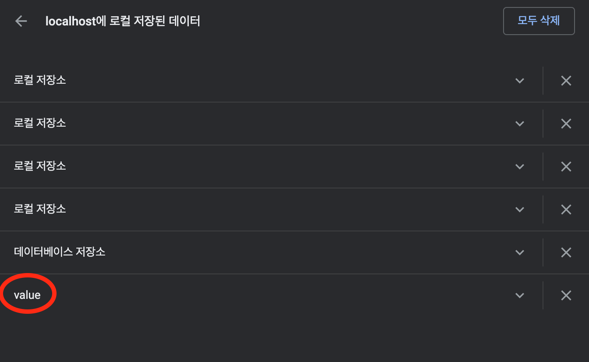


## 32. Application/Session/Cookie의 차이점 정리

### 상태 저장을 위한 값의 저장소의 특징

#### Application

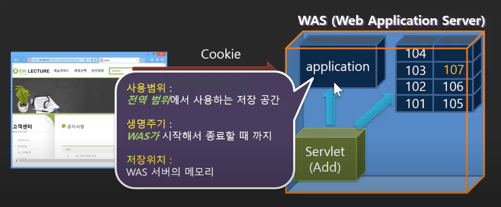

#### Session

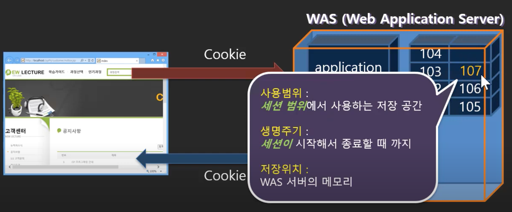

#### Cookie

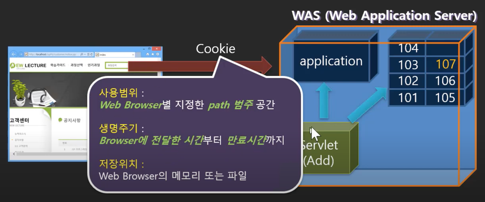

### 간단한 질문들에 대해 답해보자

- 데이터를 오랫동안, 대략 1년 정도 유지 및 보관하고 싶다면 어디에 그 정보를 저장할 것인가?
  - 기간이 길면 무조건 쿠키를 써야함
  - 세션이라는 공간에 1년동안 정보를 둘 수는 없음
    - 둘 수있다고 해도 그 사용자가 사용할 수 있는게 아님
    - 사용자는 브라우저가 종료되면 쿠키가 사라지면서 쿠키안에 있던 세션ID도 사라지게 됨
    - 새로 접속하면 새로운 ID가 부여되기 때문에 새로운 공간이 부여되는 것
    - 그렇게 되면 공간은 계속 남아있는데 사용자는 쓸 수도 없고, 점점 쌓이기만하게 됨
    - 모든 사용자들에 대해서 이런식으로 세션을 제공하면 서버 자원을 낭비하는 것
- 만약 어떤 서블릿과 관련된 값이 있다고 하자, 이 서블릿말고는 다른 서블릿에서 사용되지 않음
  - 특정 URL에서만 쓰이는 정보라면 쿠키를 사용해야됨
  - 어쩌다한번 필요한 요청을 위해서 서버의 자원을 사용하게 하는 것은 낭비임


## 참고

- 유튜브 채널 뉴렉처


